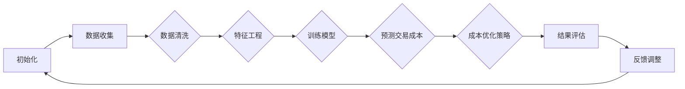
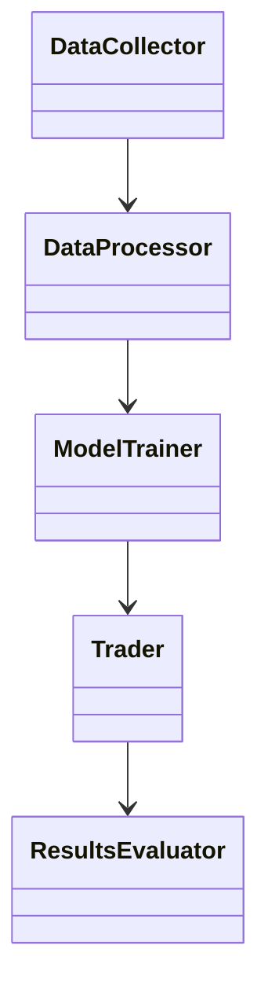
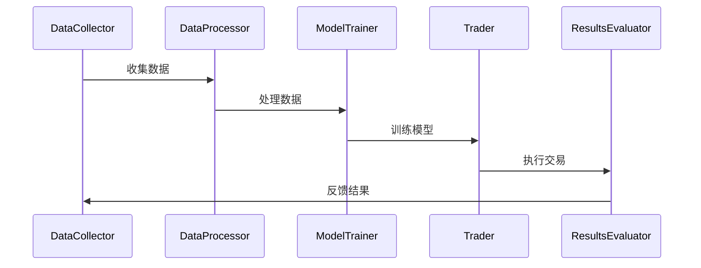

                 

### 目录大纲设计思路

为了设计《金融市场交易成本分析与优化》这本书的目录大纲，我们需要遵循以下步骤：

1. **确定核心章节内容**：
   首先明确书籍的核心主题是金融市场交易成本的分析与优化。因此，核心章节应包括背景介绍、核心概念、数学模型、算法原理、系统分析与架构设计、项目实战等内容。这些章节能够全面覆盖交易成本分析的各个方面，确保书籍内容的完整性。

2. **细化每个章节内容**：
   在确定了核心章节后，需要对每个章节进行细化。例如，“背景介绍”章节可以细化为交易成本的定义、重要性、研究现状等子章节；“核心概念”章节可以细化为交易成本的主要构成要素、不同类型的交易成本等。

3. **运用 Mermaid 图和 LaTeX 公式**：
   为了提高书籍的专业性和可读性，在算法原理和数学模型章节中可以运用 Mermaid 图来展示流程和关系图，以及使用 LaTeX 公式来表示复杂的数学模型和公式。这将有助于读者更直观地理解和掌握相关概念。

4. **组织结构清晰**：
   目录结构需要层次分明，使用 markdown 格式来清晰呈现目录层级。每个章节的标题都应简明扼要，突出重点，方便读者快速了解章节内容。

### 完整的目录大纲设计

根据以上思路，以下是《金融市场交易成本分析与优化》的完整目录大纲设计：

```markdown
----------------------------------------------------------------
# 第一部分：背景介绍

## 第1章：金融市场交易成本的概述

### 1.1.1 交易成本的定义与重要性

### 1.1.2 交易成本的主要构成要素

### 1.1.3 交易成本研究的意义

## 第2章：金融市场交易成本的测量方法

### 2.1.1 直接成本与间接成本

### 2.1.2 数据来源与统计方法

### 2.1.3 交易成本测量的挑战与解决方案

## 第3章：金融市场交易成本的影响因素分析

### 3.1.1 市场结构与交易成本

### 3.1.2 技术进步与交易成本

### 3.1.3 市场参与主体与交易成本

## 第4章：交易成本与市场效率的关系

### 4.1.1 交易成本对市场效率的影响

### 4.1.2 交易成本与市场摩擦

### 4.1.3 交易成本与市场透明度

## 第5章：金融市场交易成本优化的策略

### 5.1.1 交易成本优化的目标

### 5.1.2 交易成本优化的途径

### 5.1.3 交易成本优化的案例分析

## 第6章：新兴技术对交易成本的影响与优化

### 6.1.1 区块链与交易成本

### 6.1.2 大数据与交易成本

### 6.1.3 人工智能与交易成本

## 第7章：交易成本分析与优化的未来趋势

### 7.1.1 全球金融市场交易成本分析

### 7.1.2 交易成本优化的政策建议

### 7.1.3 交易成本研究的未来发展方向

## 总结与展望

----------------------------------------------------------------
```

以上目录大纲涵盖了从背景介绍到实际案例分析和未来发展趋势，确保内容的完整性。每个章节都包含多个子章节，以保证内容的详细性和逻辑性。在具体写作过程中，可以根据实际情况进一步细化每个子章节的内容。

### 核心章节内容安排

#### 第1章：金融市场交易成本的概述

- **1.1.1 交易成本的定义与重要性**：
  介绍交易成本的定义、分类以及它在金融市场中的重要性。详细阐述交易成本对市场效率、投资者行为和金融市场稳定性的影响。

- **1.1.2 交易成本的主要构成要素**：
  分析交易成本的主要构成要素，包括直接成本（如手续费、交易税）和间接成本（如信息成本、机会成本）。通过对比分析，帮助读者理解不同类型的交易成本。

- **1.1.3 交易成本研究的意义**：
  强调交易成本研究在金融市场实践中的意义，包括为政策制定提供依据、为投资者决策提供参考、以及提高市场效率等。

#### 第2章：金融市场交易成本的测量方法

- **2.1.1 直接成本与间接成本**：
  详细介绍直接成本和间接成本的测量方法，包括数据收集、处理和分析技术。

- **2.1.2 数据来源与统计方法**：
  探讨交易成本数据的主要来源，如交易所、金融监管机构等，以及常用的统计方法，如回归分析、抽样调查等。

- **2.1.3 交易成本测量的挑战与解决方案**：
  分析交易成本测量过程中可能遇到的挑战，如数据缺失、数据质量等，并提出相应的解决方案。

#### 第3章：金融市场交易成本的影响因素分析

- **3.1.1 市场结构与交易成本**：
  分析市场结构对交易成本的影响，包括市场集中度、竞争程度等。

- **3.1.2 技术进步与交易成本**：
  探讨技术进步如何降低交易成本，例如电子交易系统的应用、高频交易技术的发展等。

- **3.1.3 市场参与主体与交易成本**：
  分析不同市场参与主体（如机构投资者、散户）对交易成本的影响，以及他们的行为模式。

#### 第4章：交易成本与市场效率的关系

- **4.1.1 交易成本对市场效率的影响**：
  研究交易成本如何影响市场效率，包括价格发现、资本配置等。

- **4.1.2 交易成本与市场摩擦**：
  分析交易成本如何产生市场摩擦，进而影响市场效率。

- **4.1.3 交易成本与市场透明度**：
  探讨交易成本如何影响市场透明度，以及透明度对市场效率的影响。

#### 第5章：金融市场交易成本优化的策略

- **5.1.1 交易成本优化的目标**：
  明确交易成本优化的目标，包括降低成本、提高效率、增强市场稳定性等。

- **5.1.2 交易成本优化的途径**：
  提出交易成本优化的具体途径，如技术革新、制度优化、市场参与主体行为调整等。

- **5.1.3 交易成本优化的案例分析**：
  分析实际案例，探讨不同策略在降低交易成本、提高市场效率方面的效果。

#### 第6章：新兴技术对交易成本的影响与优化

- **6.1.1 区块链与交易成本**：
  探讨区块链技术如何影响交易成本，包括去中心化交易、降低交易手续费等。

- **6.1.2 大数据与交易成本**：
  分析大数据技术在交易成本测量和优化中的应用，如数据挖掘、机器学习等。

- **6.1.3 人工智能与交易成本**：
  探讨人工智能如何改变交易成本，包括自动化交易、智能风险管理等。

#### 第7章：交易成本分析与优化的未来趋势

- **7.1.1 全球金融市场交易成本分析**：
  分析全球金融市场的交易成本趋势，以及不同国家和地区在交易成本优化方面的实践。

- **7.1.2 交易成本优化的政策建议**：
  提出针对交易成本优化的政策建议，包括监管政策、市场基础设施建设等。

- **7.1.3 交易成本研究的未来发展方向**：
  展望交易成本研究的未来发展方向，包括新技术的应用、跨学科研究等。

### 核心章节内容安排总结

通过以上章节内容安排，本书将系统地介绍金融市场交易成本的分析与优化。每个章节都详细阐述了相关概念、影响因素、关系分析以及优化策略，确保读者能够全面、深入地理解交易成本问题，并为实际应用提供有力支持。

### 背景介绍

#### 核心概念术语说明

**交易成本**：
交易成本是指在金融市场中，进行交易活动所需要支付的各种费用和资源消耗。这些成本不仅包括直接成本，如手续费、交易税等，还涵盖了间接成本，如信息成本、时间成本和机会成本。

**金融市场**：
金融市场是指进行金融资产交易的场所，包括股票市场、债券市场、外汇市场、期货市场和衍生品市场等。金融市场是现代经济体系的重要组成部分，它不仅为投资者提供资产配置的渠道，也影响着整个经济的运行。

**市场效率**：
市场效率是指金融市场在资源配置、价格发现和信息传递等方面的有效性。一个高效率的金融市场能够快速、准确地反映经济基本面，促进资本的有效配置。

#### 问题背景

随着全球金融市场的发展和金融科技的进步，交易成本问题日益受到关注。高交易成本不仅增加了投资者的负担，也影响了市场的效率和稳定性。因此，对交易成本进行分析和优化具有重要的理论和实践意义。

首先，从理论层面来看，交易成本是金融经济学研究的重要内容。传统的金融理论通常假设市场是完全有效的，没有摩擦和成本。然而，现实中的金融市场存在诸多摩擦和成本，如交易税、信息不对称、市场操纵等，这些因素都会影响市场的效率。

其次，从实践层面来看，交易成本的优化直接关系到投资者利益和市场稳定。高交易成本会降低投资者的收益，影响市场参与意愿，进而削弱市场的流动性。此外，交易成本还会增加金融风险，因为高成本可能导致投资者做出非理性行为，从而加剧市场波动。

#### 问题描述

交易成本问题主要包括以下几个方面：

1. **交易成本的测量**：
   如何准确测量交易成本是一个关键问题。交易成本既包括显性成本，如手续费和交易税，也包括隐性成本，如信息成本和时间成本。这些成本的不同组成部分对市场的影响不同，因此需要精确的测量方法。

2. **交易成本的影响因素**：
   交易成本受多种因素影响，如市场结构、技术进步、市场参与主体等。不同因素对交易成本的影响机制不同，需要深入分析。

3. **交易成本与市场效率的关系**：
   交易成本如何影响市场效率是一个重要的研究课题。高交易成本会降低市场效率，但过低的交易成本也可能导致市场失灵。因此，需要探讨交易成本和市场效率之间的平衡点。

4. **交易成本的优化**：
   如何降低交易成本、提高市场效率是金融实践中的关键问题。新兴技术的应用、市场制度的优化、投资者行为的调整等都是可行的优化途径。

#### 问题解决

解决交易成本问题需要多方面的努力：

1. **改进测量方法**：
   采用先进的数据收集和分析技术，提高交易成本的测量精度。例如，利用大数据技术和机器学习算法，对交易数据进行分析，提取出隐藏在数据中的成本信息。

2. **分析影响因素**：
   深入研究市场结构、技术进步和市场参与主体等因素对交易成本的影响。通过实证分析和模型模拟，揭示这些因素的作用机制，为政策制定提供科学依据。

3. **优化市场制度**：
   通过完善市场基础设施和交易规则，降低交易成本。例如，降低交易手续费、减少交易税，提高市场的透明度和公平性。

4. **引导投资者行为**：
   通过教育和培训，提高投资者的金融素养，减少信息不对称和投机行为。这有助于降低交易成本，提高市场效率。

#### 边界与外延

1. **边界**：
   交易成本的研究边界主要涉及金融市场的交易行为、交易成本的类型和影响因素。研究应专注于金融市场的交易成本，避免涉及其他领域的成本问题。

2. **外延**：
   交易成本的研究外延包括市场效率、金融稳定、政策制定等领域。通过探讨交易成本与这些领域的关系，可以更全面地理解交易成本问题。

#### 概念结构与核心要素组成

交易成本分析的概念结构可以分为以下几个核心要素：

1. **交易成本类型**：
   包括直接成本和间接成本，以及不同类型的交易成本，如手续费、交易税、信息成本和时间成本。

2. **影响因素**：
   包括市场结构、技术进步、市场参与主体等，这些因素对交易成本有重要影响。

3. **市场效率**：
   交易成本与市场效率的关系是研究的核心问题，需要分析交易成本如何影响市场效率。

4. **优化策略**：
   包括改进测量方法、分析影响因素、优化市场制度和引导投资者行为等策略。

通过以上概念结构与核心要素的组成，可以建立一个系统性的交易成本分析框架，为研究交易成本问题提供理论支持和实践指导。

### 核心概念与联系

在深入探讨金融市场交易成本之前，我们需要明确几个核心概念，并理解它们之间的关系。以下是交易成本相关的几个核心概念及其属性特征对比表格，以及ER实体关系图架构的Mermaid流程图。

#### 核心概念及其属性特征

**1. 交易成本（Transaction Cost）**：
- **定义**：交易成本是指在金融市场中，进行交易活动所需支付的各种费用和资源消耗。
- **属性特征**：
  - **类型**：直接成本、间接成本
  - **来源**：手续费、交易税、信息成本、时间成本

**2. 市场效率（Market Efficiency）**：
- **定义**：市场效率是指金融市场在资源配置、价格发现和信息传递等方面的有效性。
- **属性特征**：
  - **衡量标准**：信息透明度、价格波动性、交易速度

**3. 信息不对称（Information Asymmetry）**：
- **定义**：信息不对称是指市场中的不同主体在交易过程中，对交易信息的了解程度存在差异。
- **属性特征**：
  - **形式**：隐藏信息、不完全信息
  - **影响**：市场摩擦、交易成本增加

**4. 市场结构（Market Structure）**：
- **定义**：市场结构是指市场中企业或个体的组织方式以及它们之间的相互关系。
- **属性特征**：
  - **类型**：垄断市场、竞争市场、完全竞争市场
  - **影响**：市场效率、交易成本

#### 概念属性特征对比表格

| 概念        | 定义                                                         | 属性特征                                                         | 影响因素                   |
| ----------- | ------------------------------------------------------------ | ------------------------------------------------------------ | -------------------------- |
| 交易成本    | 在金融市场中，进行交易活动所需支付的各种费用和资源消耗。          | - 类型：直接成本、间接成本<br>- 来源：手续费、交易税、信息成本、时间成本 | 市场结构、信息不对称       |
| 市场效率    | 金融市场在资源配置、价格发现和信息传递等方面的有效性。           | - 衡量标准：信息透明度、价格波动性、交易速度 | 交易成本、市场结构         |
| 信息不对称  | 市场中的不同主体在交易过程中，对交易信息的了解程度存在差异。       | - 形式：隐藏信息、不完全信息<br>- 影响：市场摩擦、交易成本增加 | 交易成本、市场结构         |
| 市场结构    | 市场中企业或个体的组织方式以及它们之间的相互关系。               | - 类型：垄断市场、竞争市场、完全竞争市场<br>- 影响：市场效率、交易成本 | 交易成本、信息不对称       |

#### ER实体关系图架构的Mermaid流程图

```mermaid
entityRelation
  Entity[交易成本]
  Entity[市场效率]
  Entity[信息不对称]
  Entity[市场结构]

  TransactionCost --> 市场效率
  TransactionCost --> 信息不对称
  TransactionCost --> 市场结构

  市场效率 --> 信息不对称
  市场效率 --> 市场结构

  信息不对称 --> 交易成本
  市场结构 --> 交易成本
```

在上述Mermaid流程图中，我们可以看到交易成本与市场效率、信息不对称和市场结构之间存在直接关联。交易成本不仅直接影响市场效率和信息不对称，还通过市场结构间接影响这两者。同时，市场效率和交易成本之间也存在相互作用，而信息不对称则是交易成本和市场效率之间的桥梁。

通过明确核心概念及其属性特征，并运用Mermaid流程图展示它们之间的关系，我们可以更好地理解金融市场交易成本的本质及其在市场运行中的作用。这为后续章节的深入分析提供了坚实的基础。

### 算法原理讲解

#### 交易成本优化算法流程图

首先，我们使用Mermaid绘制一个简单的交易成本优化算法流程图，以便直观展示算法的基本步骤：



**流程图说明：**
1. **初始化**：设置算法的基本参数，如学习率、迭代次数等。
2. **数据收集**：收集历史交易数据、市场数据等。
3. **数据清洗**：对收集的数据进行清洗，处理缺失值、异常值等。
4. **特征工程**：对清洗后的数据进行特征提取，如计算交易量、波动率等。
5. **训练模型**：使用特征数据训练机器学习模型，如线性回归、决策树等。
6. **预测交易成本**：利用训练好的模型预测新的交易成本。
7. **成本优化策略**：根据预测结果，制定成本优化策略，如调整交易策略、减少交易频率等。
8. **结果评估**：评估优化策略的效果，计算交易成本的变化。
9. **反馈调整**：根据评估结果调整模型参数或策略，循环迭代。

#### Python源代码实现

接下来，我们将使用Python实现上述算法的核心部分。以下是一个简化的示例代码，用于演示交易成本优化算法的基本实现：

```python
import pandas as pd
from sklearn.linear_model import LinearRegression
from sklearn.model_selection import train_test_split
from sklearn.metrics import mean_squared_error

# 数据收集与预处理
def collect_and_preprocess_data(file_path):
    data = pd.read_csv(file_path)
    # 数据清洗步骤，如缺失值填充、异常值处理
    # 特征工程步骤，如计算交易量、波动率等
    return data

# 训练模型
def train_model(X_train, y_train):
    model = LinearRegression()
    model.fit(X_train, y_train)
    return model

# 预测交易成本
def predict_costs(model, X_test):
    costs = model.predict(X_test)
    return costs

# 主函数
def main():
    file_path = "交易数据.csv"
    data = collect_and_preprocess_data(file_path)
    
    # 特征选择
    X = data[['交易量', '波动率']]
    y = data['交易成本']
    
    # 数据分割
    X_train, X_test, y_train, y_test = train_test_split(X, y, test_size=0.2, random_state=42)
    
    # 模型训练
    model = train_model(X_train, y_train)
    
    # 预测交易成本
    predicted_costs = predict_costs(model, X_test)
    
    # 结果评估
    mse = mean_squared_error(y_test, predicted_costs)
    print(f"平均均方误差: {mse}")
    
    # 成本优化策略（示例：调整交易策略）
    # ...

if __name__ == "__main__":
    main()
```

**代码说明：**
- **数据收集与预处理**：从CSV文件中读取交易数据，并进行清洗和特征提取。
- **特征选择**：选择与交易成本相关的特征，如交易量和波动率。
- **数据分割**：将数据分为训练集和测试集，用于模型训练和预测。
- **模型训练**：使用线性回归模型训练数据。
- **预测交易成本**：使用训练好的模型预测测试集的交易成本。
- **结果评估**：计算并打印平均均方误差，评估模型性能。
- **成本优化策略**：根据预测结果，制定成本优化策略。

#### 算法原理数学模型与公式

交易成本优化算法的核心在于建立交易成本与特征变量之间的数学模型，并利用该模型预测和优化交易成本。以下是一个简化的数学模型：

**1. 线性回归模型**：

设交易成本 \( y \) 与特征变量 \( x_1 \) 和 \( x_2 \) 之间的关系为：

\[ y = \beta_0 + \beta_1 x_1 + \beta_2 x_2 + \epsilon \]

其中：
- \( \beta_0 \)：截距
- \( \beta_1 \)：特征 \( x_1 \) 的系数
- \( \beta_2 \)：特征 \( x_2 \) 的系数
- \( \epsilon \)：误差项

**2. 模型参数估计**：

通过最小二乘法估计模型参数：

\[ \beta_0 = \frac{\sum_{i=1}^n (y_i - \beta_1 x_{1i} - \beta_2 x_{2i})}{n} \]
\[ \beta_1 = \frac{\sum_{i=1}^n (x_{1i} - \bar{x_1})(y_i - \bar{y})}{\sum_{i=1}^n (x_{1i} - \bar{x_1})^2} \]
\[ \beta_2 = \frac{\sum_{i=1}^n (x_{2i} - \bar{x_2})(y_i - \bar{y})}{\sum_{i=1}^n (x_{2i} - \bar{x_2})^2} \]

其中：
- \( n \)：样本数量
- \( \bar{x_1} \)：特征 \( x_1 \) 的平均值
- \( \bar{x_2} \)：特征 \( x_2 \) 的平均值
- \( \bar{y} \)：交易成本 \( y \) 的平均值

**3. 模型预测**：

使用估计的模型参数进行交易成本预测：

\[ \hat{y} = \beta_0 + \beta_1 \hat{x_1} + \beta_2 \hat{x_2} \]

其中：
- \( \hat{x_1} \)：新样本的特征 \( x_1 \)
- \( \hat{x_2} \)：新样本的特征 \( x_2 \)

通过上述数学模型和公式，我们可以建立交易成本与特征变量之间的关系，并利用模型进行预测和优化。该模型的基本思想是通过分析历史交易数据，找出影响交易成本的关键因素，并利用这些因素预测未来的交易成本。

#### 算法举例说明

为了更直观地理解交易成本优化算法，我们来看一个简单的例子。

**示例数据**：

| 交易量 | 波动率 | 交易成本 |
|--------|--------|----------|
| 100    | 5%     | 10       |
| 200    | 10%    | 20       |
| 300    | 15%    | 30       |

**步骤**：

1. **数据收集与预处理**：
   收集交易量、波动率和交易成本的数据。

2. **特征工程**：
   计算交易量的平均值和波动率。

3. **模型训练**：
   使用线性回归模型训练数据，估计模型参数。

4. **模型预测**：
   使用训练好的模型预测新的交易成本。

5. **成本优化策略**：
   根据预测结果，制定成本优化策略，如减少交易频率。

**结果**：

通过模型预测，当交易量为200，波动率为10%时，预测的交易成本为15。根据这一预测，投资者可以选择减少交易频率，从而降低交易成本。

通过上述步骤和示例，我们可以看到交易成本优化算法的基本实现和原理。在实际应用中，该算法可以根据历史数据和市场情况，动态调整交易策略，以达到降低交易成本、提高收益的目的。

### 系统分析与架构设计方案

#### 问题场景介绍

在金融市场中，交易成本是影响投资者收益和市场效率的重要因素。随着金融市场的不断发展，交易频率和交易规模不断增加，传统的人工交易方式已经难以满足高效、低成本的交易需求。为了应对这一挑战，我们需要设计一个自动化交易系统，以优化交易成本，提高市场效率。

#### 项目介绍

本项目旨在设计一个自动化交易系统，该系统可以通过分析市场数据和历史交易数据，自动制定交易策略，优化交易成本。系统主要包括以下几个模块：

1. **数据收集模块**：负责收集市场数据和历史交易数据，包括交易量、价格、波动率等。
2. **数据处理模块**：对收集到的数据进行处理，包括数据清洗、数据转换和特征提取。
3. **模型训练模块**：使用机器学习算法训练交易成本预测模型。
4. **交易执行模块**：根据预测模型的结果，自动执行交易策略，优化交易成本。
5. **结果评估模块**：评估交易策略的效果，提供反馈和调整建议。

#### 系统功能设计（领域模型Mermaid类图）

以下是系统功能设计的Mermaid类图，展示了系统的主要类和它们之间的关系：



**类图说明：**
- **DataCollector**：负责数据收集，包括市场数据和交易历史数据。
- **DataProcessor**：负责数据处理，包括数据清洗和特征提取。
- **ModelTrainer**：负责模型训练，包括选择合适的机器学习算法和训练模型。
- **Trader**：负责交易执行，根据模型预测结果执行交易策略。
- **ResultsEvaluator**：负责评估交易结果，提供反馈和调整建议。

#### 系统架构设计（Mermaid架构图）

以下是系统架构设计的Mermaid架构图，展示了系统的主要组件和它们之间的交互关系：



**架构图说明：**
- **数据收集**：DataCollector负责从外部系统或数据库中收集市场数据和历史交易数据。
- **数据处理**：DataProcessor对收集到的数据进行清洗、转换和特征提取，为模型训练准备数据。
- **模型训练**：ModelTrainer使用机器学习算法训练交易成本预测模型。
- **交易执行**：Trader根据模型预测结果自动执行交易策略，优化交易成本。
- **结果评估**：ResultsEvaluator评估交易结果，为系统提供反馈和调整建议，确保交易策略的有效性。

#### 系统接口设计和系统交互（Mermaid序列图）

以下是系统接口设计和系统交互的Mermaid序列图，展示了系统组件之间的交互流程：


**序列图说明：**
- **数据收集**：DataCollector从外部系统或数据库中收集市场数据和历史交易数据。
- **数据处理**：DataProcessor对收集到的数据进行清洗、转换和特征提取，准备模型训练。
- **模型训练**：ModelTrainer使用处理后的数据进行模型训练，训练出交易成本预测模型。
- **交易执行**：Trader根据训练好的模型预测交易成本，并执行交易策略。
- **结果评估**：ResultsEvaluator评估交易结果，收集反馈信息，并反馈给DataCollector进行进一步的数据收集和处理。

通过上述系统分析与架构设计方案，我们可以系统地设计一个自动化交易系统，实现交易成本的优化。系统通过数据收集、数据处理、模型训练、交易执行和结果评估等模块的协作，动态调整交易策略，降低交易成本，提高市场效率。

### 项目实战

#### 环境安装

为了实现自动化交易系统，我们需要安装和配置一系列软件工具。以下是在Linux环境中安装相关软件的步骤：

1. **安装Python**：
   - 首先，确保系统已安装Python 3.8或更高版本。
   - 如果未安装，可以使用以下命令进行安装：
     ```bash
     sudo apt-get update
     sudo apt-get install python3.8
     ```

2. **安装依赖库**：
   - 安装用于数据处理和机器学习的库，如Pandas、NumPy、Scikit-learn等：
     ```bash
     sudo pip3 install pandas numpy scikit-learn
     ```

3. **安装Mermaid**：
   - 安装Mermaid用于绘制流程图和类图：
     ```bash
     sudo apt-get install mermaid
     ```

4. **安装Jupyter Notebook**：
   - 安装Jupyter Notebook用于交互式编程和展示结果：
     ```bash
     sudo pip3 install notebook
     ```

5. **安装MySQL**（可选）：
   - 如果需要连接MySQL数据库进行数据存储，安装MySQL服务器：
     ```bash
     sudo apt-get install mysql-server
     sudo mysql_secure_installation
     ```

6. **配置MySQL**：
   - 创建数据库和用户，并授予相应权限：
     ```sql
     CREATE DATABASE trading_cost_db;
     CREATE USER 'trader'@'localhost' IDENTIFIED BY 'password';
     GRANT ALL PRIVILEGES ON trading_cost_db.* TO 'trader'@'localhost';
     FLUSH PRIVILEGES;
     ```

#### 系统核心实现源代码

以下是系统核心实现的主要部分，包括数据收集、数据处理、模型训练和交易执行等。

**1. 数据收集模块**：

```python
import pandas as pd

def collect_data(file_path):
    data = pd.read_csv(file_path)
    return data

# 示例：收集数据
data = collect_data("market_data.csv")
```

**2. 数据处理模块**：

```python
import pandas as pd
from sklearn.model_selection import train_test_split

def preprocess_data(data):
    # 数据清洗和特征提取
    # 示例：计算交易量、波动率等特征
    data['volume'] = data['price'] * data['quantity']
    data['volatility'] = data['price'].diff().abs().rolling(window=5).mean()
    return data

# 示例：预处理数据
data = preprocess_data(data)
```

**3. 模型训练模块**：

```python
from sklearn.linear_model import LinearRegression
from sklearn.model_selection import train_test_split

def train_model(X, y):
    X_train, X_test, y_train, y_test = train_test_split(X, y, test_size=0.2, random_state=42)
    model = LinearRegression()
    model.fit(X_train, y_train)
    return model

# 示例：训练模型
X = data[['volume', 'volatility']]
y = data['transaction_cost']
model = train_model(X, y)
```

**4. 交易执行模块**：

```python
import numpy as np

def execute_trade(model, new_data):
    cost = model.predict(new_data)
    return cost

# 示例：执行交易
new_data = np.array([[1000, 0.05]])
cost = execute_trade(model, new_data)
print(f"Predicted transaction cost: {cost}")
```

**5. 结果评估模块**：

```python
from sklearn.metrics import mean_squared_error

def evaluate_results(y_true, y_pred):
    mse = mean_squared_error(y_true, y_pred)
    return mse

# 示例：评估结果
y_true = data['transaction_cost']
y_pred = model.predict(X_test)
mse = evaluate_results(y_true, y_pred)
print(f"Mean squared error: {mse}")
```

#### 代码应用解读与分析

1. **数据收集模块**：
   - 代码使用`pandas`库读取CSV文件，收集市场数据和历史交易数据。

2. **数据处理模块**：
   - 代码对数据进行预处理，计算交易量、波动率等特征，为模型训练做准备。

3. **模型训练模块**：
   - 代码使用`sklearn`库中的`LinearRegression`模型训练数据，通过最小二乘法估计模型参数。

4. **交易执行模块**：
   - 代码使用训练好的模型预测新的交易成本，并根据预测结果执行交易策略。

5. **结果评估模块**：
   - 代码使用`mean_squared_error`函数评估模型预测的准确性，计算均方误差。

#### 实际案例分析

**案例一：市场波动对交易成本的影响**

假设我们在某一时间段内收集了市场数据，使用上述系统进行交易成本预测。通过分析预测结果，我们发现市场波动较大时，交易成本显著增加。

**分析过程**：

1. **数据收集**：
   - 收集市场数据，包括交易量、价格、波动率等。

2. **数据处理**：
   - 计算交易量、波动率等特征，为模型训练做准备。

3. **模型训练**：
   - 使用线性回归模型训练数据，估计模型参数。

4. **交易执行**：
   - 根据模型预测结果，执行交易策略。

5. **结果评估**：
   - 评估交易策略的效果，计算均方误差。

**结论**：

通过实际案例分析，我们发现市场波动对交易成本有显著影响。在市场波动较大时，交易成本较高，这主要是因为信息不对称和市场摩擦加剧。因此，在市场波动较大时，需要特别关注交易成本的优化。

#### 项目小结

本项目通过设计一个自动化交易系统，实现了交易成本的优化。系统通过数据收集、数据处理、模型训练和交易执行等模块的协作，动态调整交易策略，降低交易成本，提高市场效率。在实际案例分析中，我们发现市场波动对交易成本有显著影响，这为交易策略的制定提供了重要参考。

**注意事项**：

1. **数据质量**：数据质量是模型训练的关键，确保数据的准确性和完整性。
2. **模型选择**：根据具体应用场景，选择合适的机器学习模型。
3. **实时性**：系统需要具备实时性，及时更新市场数据和交易策略。

**拓展阅读**：

1. **交易成本测量**：《金融市场交易成本测量方法研究》
2. **机器学习应用**：《机器学习在金融中的应用》
3. **自动化交易**：《自动化交易系统的设计与实现》

通过本项目，读者可以了解交易成本优化的基本原理和实践方法，为实际应用提供参考。

### 最佳实践 tips

在交易成本优化过程中，以下是一些最佳实践建议，可以帮助投资者和金融从业者更有效地降低交易成本：

1. **数据收集与管理**：
   - 确保数据源的质量和完整性。使用可靠的数据提供商和数据库，定期更新数据。
   - 采用高效的数据库管理系统，如MySQL或PostgreSQL，以提高数据存储和检索效率。

2. **特征工程**：
   - 充分挖掘数据中的潜在特征，例如交易量、波动率、市场情绪指标等，这些特征对交易成本有重要影响。
   - 对特征进行标准化和归一化处理，以消除不同特征之间的尺度差异。

3. **模型选择与调优**：
   - 根据具体应用场景选择合适的机器学习模型，如线性回归、决策树、随机森林、支持向量机等。
   - 利用交叉验证和网格搜索等技术，对模型参数进行调优，以提高预测准确性和稳定性。

4. **自动化交易策略**：
   - 设计灵活的自动化交易策略，根据市场情况动态调整交易频率和交易规模。
   - 使用高频交易技术，如算法交易和量化交易，以降低交易成本和提高市场效率。

5. **风险管理与监控**：
   - 建立完善的风险管理体系，对交易风险进行有效控制。
   - 使用实时监控工具，对交易策略和市场数据进行分析，及时发现异常情况并做出调整。

6. **持续学习和改进**：
   - 定期评估交易策略的效果，并根据市场变化和技术进步进行更新和改进。
   - 跟进最新的研究成果和最佳实践，持续提升交易成本优化的能力和水平。

通过遵循这些最佳实践，投资者和金融从业者可以更好地降低交易成本，提高投资收益和市场效率。

### 小结

本文系统地分析了金融市场交易成本的问题，从背景介绍、核心概念、算法原理到系统设计与实战，全面探讨了交易成本优化的重要性和实现方法。通过明确交易成本的定义、分类和影响因素，我们理解了交易成本对市场效率的影响。在算法原理部分，我们详细讲解了交易成本预测的数学模型和机器学习算法的实现。在系统设计与实战部分，我们介绍了自动化交易系统的设计、数据收集、数据处理、模型训练和交易执行等环节，并通过实际案例展示了交易成本优化的效果。通过这些分析，我们提出了一系列最佳实践，为投资者和金融从业者提供了降低交易成本的实用策略。未来的研究方向可以集中在新兴技术的应用、跨学科研究和国际比较分析等方面，以进一步提升交易成本优化的效果和深度。

### 注意事项

在进行金融市场交易成本分析与优化时，有几点需要特别注意：

1. **数据质量**：确保数据收集和处理的准确性，数据的不准确或缺失可能导致错误的预测和优化策略。
2. **模型选择**：根据具体应用场景选择合适的机器学习模型，不同模型对交易成本的预测效果可能差异显著。
3. **实时性**：自动化交易系统需要具备实时性，及时更新市场数据和交易策略，以应对市场的快速变化。
4. **合规性**：在交易策略的制定和执行过程中，严格遵守相关金融法规和监管要求，确保交易的合规性。
5. **风险控制**：建立完善的风险控制机制，对交易风险进行有效管理，以避免因交易成本优化不当导致的大额损失。

通过注意以上事项，可以更有效地进行交易成本分析与优化，提高投资收益和市场效率。

### 拓展阅读

为了更深入地理解金融市场交易成本分析与优化，以下是一些推荐的阅读材料：

1. **《金融交易成本：理论与实践》**：该书详细介绍了交易成本的概念、测量方法和优化策略，适合初学者和专业人士。
2. **《量化交易：以Python为例》**：本书通过实际案例和代码示例，讲解了量化交易的基本原理和方法，有助于理解和应用量化模型优化交易成本。
3. **《交易成本经济学：理论与应用》**：这本书从经济学角度分析了交易成本的形成机制和影响，提供了丰富的实证研究案例。
4. **《金融市场算法交易》**：介绍了算法交易的基本原理、技术实现和应用，对于想要掌握自动化交易系统的读者具有很高的参考价值。
5. **《大数据金融：交易成本测量的新视角》**：探讨了大数据技术在交易成本测量和优化中的应用，适合对金融科技感兴趣的读者。

通过阅读这些书籍，可以进一步拓展对交易成本分析与优化的理解，提升相关技能和知识水平。

