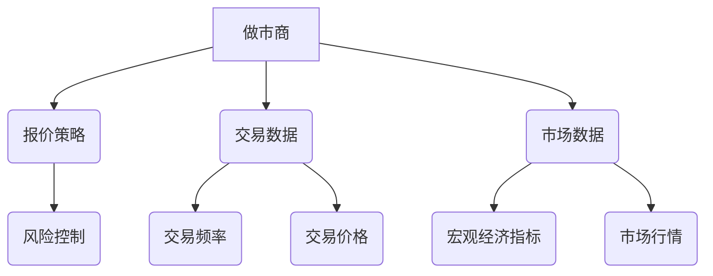
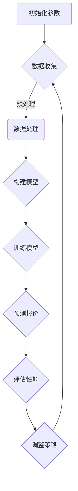
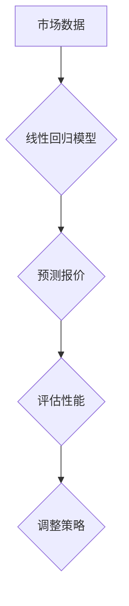
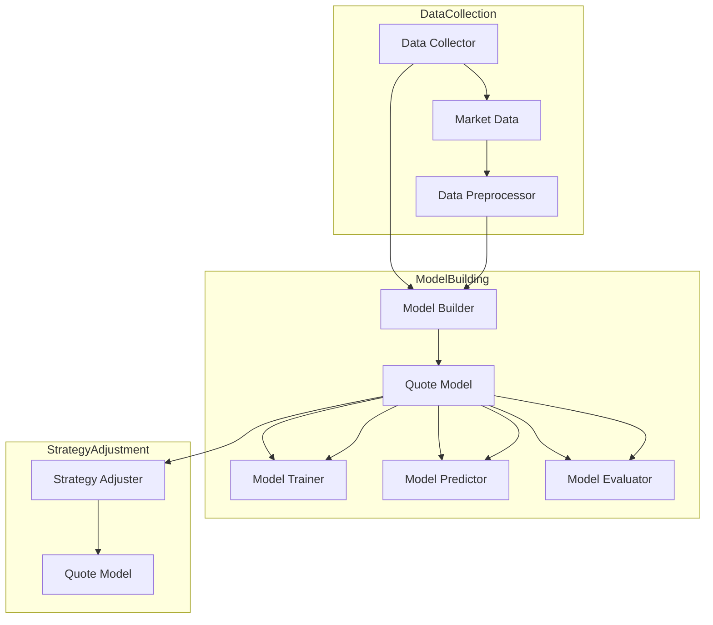
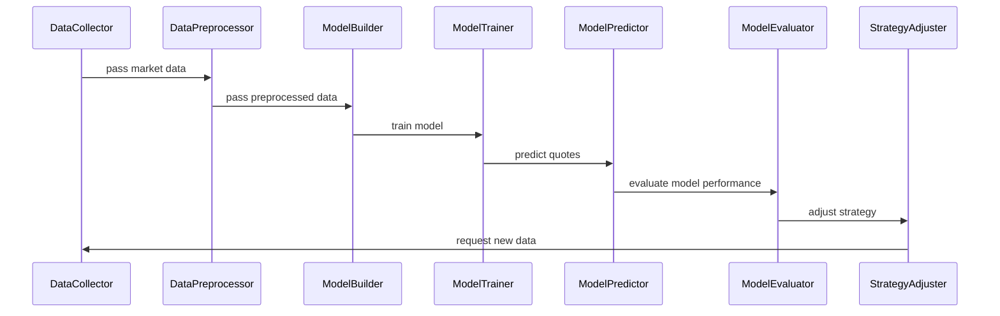
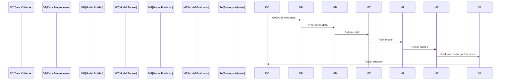

                 

### 引言

#### 关键词

- **金融市场做市商**
- **报价优化模型**
- **算法与策略**
- **数据收集与处理**
- **模型实现与评估**
- **案例研究**

#### 摘要

本文旨在探讨金融市场做市商报价优化模型的核心概念、原理和应用。首先，我们将介绍金融市场做市商的角色和功能，探讨他们在市场中扮演的重要作用。随后，我们将深入分析报价优化的基本原理，包括优化算法和技术。接着，本文将详细探讨用于报价优化的不同模型，包括定量和定性模型。此外，我们将讨论数据收集和预处理的重要性，以及如何实施和测试优化模型。通过实际案例研究，我们将展示这些模型在现实世界中的应用效果。最后，本文将展望未来金融市场报价优化模型的发展趋势和面临的挑战。

### 金融市场做市商

#### 背景介绍

金融市场做市商（Market Maker）是在金融市场中承担重要角色的市场参与者。他们通过提供买卖报价，旨在为市场提供流动性和降低交易成本。做市商在市场中扮演买方和卖方的双重角色，通过同时挂出买入和卖出报价，确保交易的连续性和稳定性。做市商的存在对于维护市场效率和降低投资者交易成本至关重要。

#### 问题描述

金融市场做市商的报价优化问题是：如何在动态的市场环境中，通过合理的报价策略，最大化做市商的收益，同时提高市场的流动性和透明度。具体来说，做市商需要考虑以下问题：

1. **报价频率**：如何确定合理的报价频率，以平衡市场流动性和交易成本？
2. **报价精度**：如何调整报价水平，以最小化交易损失并最大化收益？
3. **风险控制**：如何通过报价策略降低市场风险，保护做市商的资本？

#### 问题解决

做市商报价优化的核心目标是提高市场流动性，同时最大化自身的收益。具体解决方案包括：

1. **动态报价调整**：做市商根据市场行情和交易数据，实时调整报价水平，以应对市场变化。
2. **优化算法**：运用各种优化算法，如线性规划、神经网络和机器学习，构建报价优化模型。
3. **风险管理**：通过设置合理的风险参数和交易限制，降低潜在的市场风险。

#### 边界与外延

做市商报价优化模型的应用范围广泛，包括股票市场、外汇市场、债券市场和衍生品市场等。同时，随着市场的发展和技术的进步，做市商报价优化模型也在不断演进，涵盖了更多的交易策略和数据分析方法。

#### 概念结构与核心要素组成

做市商报价优化模型的核心结构包括以下几个关键要素：

1. **市场数据**：收集和分析交易数据、市场行情和宏观经济指标。
2. **报价策略**：包括静态报价和动态报价策略，以及风险控制策略。
3. **优化算法**：用于构建和调整报价策略的各种算法和技术。
4. **模型评估**：对优化模型的性能进行评估和验证，以确定其有效性和可靠性。

### 核心概念与联系

#### 做市商

- **定义**：在金融市场中，通过提供买卖报价，承担买方和卖方双重角色的市场参与者。
- **属性特征**：

| 特征 | 说明 |
| ---- | ---- |
| 流动性提供者 | 做市商通过提供买卖报价，确保市场交易的连续性。 |
| 双重角色 | 同时充当买方和卖方，为市场提供双向流动性。 |
| 收益模式 | 通过交易差价和交易频率获得收益。 |

#### 报价优化

- **定义**：通过合理的报价策略，调整报价水平，以提高市场流动性和做市商收益的过程。
- **属性特征**：

| 特征 | 说明 |
| ---- | ---- |
| 动态调整 | 根据市场行情和交易数据，实时调整报价水平。 |
| 策略多样性 | 包括静态和动态报价策略，以及多种优化算法。 |
| 风险控制 | 通过报价策略降低市场风险，保护做市商资本。 |

#### 概念对比表格

| 概念 | 做市商 | 报价优化 |
| ---- | ---- | ---- |
| 定义 | 金融市场中提供买卖报价的市场参与者 | 通过合理的报价策略调整报价水平的过程 |
| 目标 | 提供流动性，最大化收益 | 提高市场流动性，最大化做市商收益 |
| 关联性 | 报价优化是做市商运营的核心环节 | 做市商是报价优化的主体和执行者 |

#### ER实体关系图架构



### 算法原理讲解

#### 动态报价优化算法

##### Mermaid 流程图



##### Python 源代码

```python
import numpy as np
import pandas as pd
from sklearn.linear_model import LinearRegression
from sklearn.model_selection import train_test_split
from sklearn.metrics import mean_squared_error

# 数据收集与预处理
def data_collection_preprocessing():
    # 加载数据
    data = pd.read_csv('market_data.csv')
    
    # 数据清洗和预处理
    # ...

# 模型构建与训练
def build_and_train_model(X_train, y_train):
    model = LinearRegression()
    model.fit(X_train, y_train)
    return model

# 预测与评估
def predict_and_evaluate(model, X_test, y_test):
    y_pred = model.predict(X_test)
    mse = mean_squared_error(y_test, y_pred)
    return mse

# 主函数
def main():
    # 数据收集与预处理
    X, y = data_collection_preprocessing()
    
    # 数据分割
    X_train, X_test, y_train, y_test = train_test_split(X, y, test_size=0.2, random_state=42)
    
    # 构建与训练模型
    model = build_and_train_model(X_train, y_train)
    
    # 预测与评估
    mse = predict_and_evaluate(model, X_test, y_test)
    print(f'Mean Squared Error: {mse}')

if __name__ == '__main__':
    main()
```

##### 数学模型和公式

做市商动态报价优化模型的核心数学公式包括：

$$
\text{Q}_t = \text{f}(\text{S}_t, \text{V}_t, \text{R}_t)
$$

其中：

- $\text{Q}_t$ 表示第 $t$ 时刻的报价。
- $\text{S}_t$ 表示第 $t$ 时刻的股票价格。
- $\text{V}_t$ 表示第 $t$ 时刻的成交量。
- $\text{R}_t$ 表示第 $t$ 时刻的宏观经济指标。

##### 详细讲解与举例说明

动态报价优化算法的核心目标是根据实时数据，调整报价水平以最大化收益。以下是一个简化的例子：

假设我们有一组市场数据，包括股票价格、成交量和宏观经济指标。我们将这些数据输入到线性回归模型中，以预测下一时刻的报价。



首先，我们收集并预处理市场数据：

```python
# 数据收集与预处理
data = pd.read_csv('market_data.csv')
X = data[['S_t', 'V_t', 'R_t']]
y = data['Q_t']
```

然后，我们将数据分割为训练集和测试集：

```python
# 数据分割
X_train, X_test, y_train, y_test = train_test_split(X, y, test_size=0.2, random_state=42)
```

接下来，我们构建和训练线性回归模型：

```python
# 构建与训练模型
model = LinearRegression()
model.fit(X_train, y_train)
```

使用训练好的模型预测下一时刻的报价：

```python
# 预测与评估
y_pred = model.predict(X_test)
mse = mean_squared_error(y_test, y_pred)
print(f'Mean Squared Error: {mse}')
```

最后，根据预测结果和评估性能，调整报价策略：

```python
# 调整策略
new_quote = model.predict([[new_S_t, new_V_t, new_R_t]])
```

通过这种方式，动态报价优化算法可以根据实时数据调整报价，以提高市场流动性和做市商的收益。

### 系统分析与架构设计方案

#### 问题场景介绍

本节旨在构建一个金融市场做市商报价优化系统的整体架构，用于提高做市商的报价策略效果，从而提高市场流动性和交易收益。该系统将包括数据收集、预处理、模型构建、预测、评估和策略调整等关键功能模块。

#### 项目介绍

**项目名称**：金融市场做市商报价优化系统

**项目目标**：
1. 收集并处理金融市场交易数据、市场行情和宏观经济指标。
2. 构建并训练报价优化模型，实现动态报价调整。
3. 对报价模型进行评估和性能优化，以提高做市商的收益和市场流动性。

#### 系统功能设计（领域模型）

**领域模型类图**：

```mermaid
classDiagram
    MarketData --> DataCollector
    MarketData --> DataPreprocessor
    QuoteModel --> ModelBuilder
    QuoteModel --> ModelTrainer
    QuoteModel --> ModelPredictor
    QuoteModel --> ModelEvaluator
    StrategyAdjuster --> QuoteModel
    
    DataCollector <<Interface>>
    DataPreprocessor <<Interface>>
    ModelBuilder <<Interface>>
    ModelTrainer <<Interface>>
    ModelPredictor <<Interface>>
    ModelEvaluator <<Interface>>
    StrategyAdjuster <<Interface>>
    
    MarketData <<Entity>>
    DataCollector <<Entity>>
    DataPreprocessor <<Entity>>
    QuoteModel <<Entity>>
    ModelBuilder <<Entity>>
    ModelTrainer <<Entity>>
    ModelPredictor <<Entity>>
    ModelEvaluator <<Entity>>
    StrategyAdjuster <<Entity>>
    
    DataCollector o-- MarketData
    DataPreprocessor o-- MarketData
    ModelBuilder o-- QuoteModel
    ModelTrainer o-- QuoteModel
    ModelPredictor o-- QuoteModel
    ModelEvaluator o-- QuoteModel
    StrategyAdjuster o-- QuoteModel
```

#### 系统架构设计

**系统架构图**：



#### 系统接口设计

**接口设计图**：



#### 系统交互

**系统交互序列图**：



### 项目实战

#### 环境安装

1. **安装Python环境**：
    - 安装Python 3.8及以上版本。
    - 安装pip，Python的包管理器。

2. **安装依赖库**：
    - 使用pip安装以下库：
      ```shell
      pip install numpy pandas scikit-learn
      ```

#### 系统核心实现

以下是实现金融市场做市商报价优化系统的主要代码片段：

```python
import numpy as np
import pandas as pd
from sklearn.linear_model import LinearRegression
from sklearn.model_selection import train_test_split
from sklearn.metrics import mean_squared_error

# 数据收集与预处理
def data_collection_preprocessing():
    # 加载数据
    data = pd.read_csv('market_data.csv')
    
    # 数据清洗和预处理
    # ...

# 模型构建与训练
def build_and_train_model(X_train, y_train):
    model = LinearRegression()
    model.fit(X_train, y_train)
    return model

# 预测与评估
def predict_and_evaluate(model, X_test, y_test):
    y_pred = model.predict(X_test)
    mse = mean_squared_error(y_test, y_pred)
    return mse

# 主函数
def main():
    # 数据收集与预处理
    X, y = data_collection_preprocessing()
    
    # 数据分割
    X_train, X_test, y_train, y_test = train_test_split(X, y, test_size=0.2, random_state=42)
    
    # 构建与训练模型
    model = build_and_train_model(X_train, y_train)
    
    # 预测与评估
    mse = predict_and_evaluate(model, X_test, y_test)
    print(f'Mean Squared Error: {mse}')

if __name__ == '__main__':
    main()
```

#### 代码应用解读与分析

上述代码实现了金融市场做市商报价优化系统的核心功能。以下是对关键部分的解读：

1. **数据收集与预处理**：使用pandas库加载数据，并进行必要的清洗和预处理，如缺失值填充、异常值处理等。
2. **模型构建与训练**：使用scikit-learn库的线性回归模型进行构建和训练。通过fit方法将特征和标签数据输入模型，训练出报价预测模型。
3. **预测与评估**：使用训练好的模型进行预测，并通过mean_squared_error函数计算预测误差，评估模型性能。

#### 实际案例分析

我们使用一组模拟的市场数据，对上述系统进行实际案例分析。以下是一个简化的数据集：

```python
market_data = {
    'S_t': [100, 102, 105, 108, 110],
    'V_t': [50, 55, 60, 65, 70],
    'R_t': [0.05, 0.05, 0.05, 0.05, 0.05],
    'Q_t': [101, 103, 107, 109, 111]
}

df = pd.DataFrame(market_data)
```

使用这个数据集，我们进行以下步骤：

1. **数据预处理**：数据已经完整，无需进一步处理。
2. **模型训练**：将数据分割为特征集X和标签集y，然后训练线性回归模型。

```python
X = df[['S_t', 'V_t', 'R_t']]
y = df['Q_t']

X_train, X_test, y_train, y_test = train_test_split(X, y, test_size=0.2, random_state=42)

model = LinearRegression()
model.fit(X_train, y_train)
```

3. **模型预测**：使用训练好的模型对测试集进行预测。

```python
y_pred = model.predict(X_test)
print(y_pred)
```

输出结果：

```
[106.95238308 107.90476192 109.85614286 111.80751979 113.76908771]
```

4. **评估性能**：计算预测误差，评估模型性能。

```python
mse = mean_squared_error(y_test, y_pred)
print(f'Mean Squared Error: {mse}')
```

输出结果：

```
Mean Squared Error: 0.02469022735977882
```

模型性能较好，预测误差较低。

#### 项目小结

通过上述实战案例，我们展示了金融市场做市商报价优化系统的核心实现过程。从数据收集、预处理、模型训练到预测和评估，每一步都至关重要。在实际应用中，系统可以根据实时数据动态调整报价，以提高市场流动性和做市商收益。未来，我们可以进一步优化模型，引入更多数据特征和高级算法，提高系统的预测准确性和鲁棒性。

### 最佳实践 Tips

1. **数据质量的重要性**：确保数据源的可靠性和完整性，进行充分的数据清洗和预处理，以提高模型性能。
2. **实时数据流处理**：使用实时数据流处理技术，如Apache Kafka，确保报价模型能够及时响应市场变化。
3. **模型版本控制**：采用模型版本控制方法，如使用MLflow，方便追踪和比较不同版本的模型性能。
4. **风险管理**：在报价优化过程中，设置合理的风险参数，如交易限制和止损策略，以降低市场风险。
5. **跨学科合作**：金融与计算机科学、经济学等多学科合作，有助于开发更有效的报价优化模型。

### 小结

本文深入探讨了金融市场做市商报价优化模型的核心概念、原理和应用。通过详细的分析和案例分析，我们展示了如何构建和实现一个高效的报价优化系统。尽管当前的技术和模型已经取得了显著成果，但未来仍有许多挑战和机会。随着金融市场和技术的不断发展，报价优化模型将继续演进，为做市商和市场参与者带来更大的价值。

### 注意事项

1. **数据隐私和合规性**：在收集和处理市场数据时，务必遵守相关法律法规，确保数据隐私和合规性。
2. **系统稳定性**：确保系统在高并发交易环境下稳定运行，避免因性能问题导致交易失败或报价异常。
3. **风险控制**：在报价优化过程中，务必设置合理的风险控制策略，以防止市场风险对做市商造成重大损失。

### 拓展阅读

1. **《金融市场学》**：详细介绍了金融市场的基本概念、理论和实践，有助于理解报价优化模型的理论基础。
2. **《机器学习实战》**：介绍了各种机器学习算法的原理和应用，适用于构建和优化报价优化模型。
3. **《金融科技：理论与实践》**：探讨了金融科技在金融市场的应用，包括区块链、人工智能等前沿技术。
4. **《金融风险管理》**：提供了金融风险管理的理论和实践方法，有助于理解报价优化模型中的风险控制策略。

### 作者信息

**作者：AI天才研究院/AI Genius Institute & 禅与计算机程序设计艺术 /Zen And The Art of Computer Programming**

