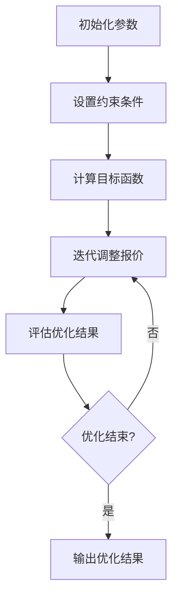

                 


## 《金融市场做市商策略优化模型》

### 关键词

- 金融市场
- 做市商
- 策略优化
- 模型
- 优化算法

### 摘要

本文章将探讨金融市场中的做市商策略优化模型。我们将从市场做市商的基本概念出发，逐步深入到策略优化的重要性，然后详细分析常见的优化模型和算法。通过实际案例和项目实战，我们将展示如何在实际应用中优化做市商策略，提高市场流动性和交易效率。文章还将讨论做市商面临的风险管理问题和监管挑战，并展望未来的研究方向。

## 目录

1. 引言
   1.1 金融市场与做市商
   1.2 做市商策略优化的必要性

2. 市场做市商策略分析框架
   2.1 市场做市商的角色与功能
   2.2 市场微观结构理论
   2.3 做市商策略核心概念

3. 优化模型与方法
   3.1 优化模型概述
   3.2 经典优化算法
   3.3 优化模型的应用场景

4. 算法与模型详解
   4.1 算法原理分析
   4.2 数学模型与公式
   4.3 算法流程图与Python代码实现

5. 实际案例与应用
   5.1 国际市场做市商案例分析
   5.2 国内市场做市商实践
   5.3 项目实战与优化效果

6. 风险管理与监管
   6.1 市场风险识别与控制
   6.2 监管框架与合规要求
   6.3 风险管理策略优化

7. 未来研究方向
   7.1 人工智能与机器学习在优化模型中的应用
   7.2 新兴市场做市商策略研究
   7.3 跨市场做市商协同策略

8. 总结与展望
   8.1 策略优化的重要性
   8.2 研究与实践中存在的问题
   8.3 未来优化模型的趋势

### 引言

#### 1.1 金融市场与做市商

金融市场是资金流动和交易的平台，包括股票、债券、期货、外汇等多个子市场。在这个平台上，投资者通过买卖证券来实现投资目的。然而，金融市场的有效运行离不开做市商（Market Makers）的存在。

**做市商**是指在金融市场中提供买卖报价，并承担交易对手方风险的机构或个人。他们通过持续地提供买卖双向报价，维持市场的流动性和稳定性。做市商的主要功能包括：

1. **提供流动性**：做市商通过买卖报价，增加了市场中的交易机会，提高了市场的流动性。
2. **价格发现**：做市商通过交易报价，帮助市场发现资产的真实价值。
3. **风险承担**：做市商在市场缺乏买家或卖家时，通过承担交易对手方的风险，维持市场交易的连续性。

#### 1.2 做市商策略优化的必要性

做市商在金融市场中扮演着至关重要的角色，然而，其策略的优化却是确保其竞争力和生存能力的核心。策略优化的必要性体现在以下几个方面：

1. **市场竞争力**：在竞争激烈的金融市场中，做市商需要通过优化策略来提高市场竞争力，吸引更多的交易机会。
2. **盈利能力**：优化策略可以提高做市商的盈利能力，通过更精细的价格调整和风险控制，实现更高的收益。
3. **风险控制**：金融市场的不确定性和波动性很大，优化策略可以帮助做市商更好地识别和应对风险，降低潜在的损失。
4. **合规要求**：随着金融市场的监管日益严格，做市商需要通过优化策略来满足合规要求，避免违规操作。

### 市场做市商策略分析框架

在深入了解做市商策略优化之前，我们需要建立一个分析框架，以全面理解市场做市商的策略和行为。这个框架包括以下几个方面：

#### 2.1 市场做市商的角色与功能

做市商在金融市场中扮演着多重角色，其核心功能如下：

1. **提供买卖报价**：做市商需要持续地提供买卖报价，保持市场的活跃度。
2. **维护价格稳定性**：通过买卖报价的平衡，做市商可以降低市场价格波动，提高市场稳定性。
3. **风险管理和对冲**：做市商需要通过风险管理工具和对冲策略，降低交易风险。

#### 2.2 市场微观结构理论

市场微观结构理论研究了市场交易行为和价格形成机制，包括以下几个方面：

1. **交易机制**：如拍卖机制、做市商机制等，这些机制影响了市场的交易效率和价格发现。
2. **交易成本**：交易成本包括信息成本、交易成本和执行成本等，这些成本影响了市场的流动性和价格。
3. **市场效率**：市场效率是指市场在价格发现和资源配置方面的有效性。

#### 2.3 做市商策略核心概念

做市商策略的核心概念包括：

1. **交易策略**：做市商需要根据市场环境和风险偏好选择合适的交易策略。
2. **定价策略**：定价策略决定了做市商的买卖报价，包括价差、买卖价差等。
3. **风险管理策略**：风险管理策略包括风险识别、风险控制、风险对冲等。

### 优化模型与方法

在了解了市场做市商的基本概念和策略分析框架后，我们将探讨如何通过优化模型和方法来提高做市商的策略效率。

#### 3.1 优化模型概述

优化模型是做市商策略优化的基础，它通常包括以下方面：

1. **目标函数**：目标函数定义了优化模型的优化目标，如利润最大化、风险最小化等。
2. **决策变量**：决策变量是优化模型中的可调整参数，如买卖报价、交易量等。
3. **约束条件**：约束条件是优化模型中的限制条件，如市场容量、风险限制等。

常见的优化模型包括线性规划、非线性规划、动态规划等。

#### 3.2 经典优化算法

为了求解优化模型，我们需要使用合适的优化算法。以下是一些经典优化算法：

1. **梯度下降法**：梯度下降法是一种迭代算法，通过不断调整决策变量，使目标函数值逐渐减小。
2. **粒子群优化算法**：粒子群优化算法是一种基于群体智能的优化算法，通过模拟鸟群觅食行为来寻找最优解。
3. **遗传算法**：遗传算法是一种模拟自然进化的优化算法，通过遗传、交叉、变异等操作来寻找最优解。

#### 3.3 优化模型的应用场景

优化模型在不同市场环境和应用场景中具有广泛的应用。以下是一些常见应用场景：

1. **股票市场**：在股票市场中，优化模型可以用于买卖报价的优化，提高交易效率和盈利能力。
2. **外汇市场**：在外汇市场中，优化模型可以用于汇率预测和交易策略的优化。
3. **期货市场**：在期货市场中，优化模型可以用于套期保值和风险对冲策略的优化。

### 算法与模型详解

在本章节中，我们将深入探讨做市商策略优化中的算法原理、数学模型以及实际应用。

#### 4.1 算法原理分析

做市商策略优化中的算法原理主要涉及以下几个方面：

1. **目标函数设计**：目标函数是优化模型的核心，它通常定义为利润最大化或风险最小化。在设计目标函数时，需要考虑做市商的市场环境、风险偏好和业务目标。
2. **约束条件设置**：约束条件是限制决策变量取值的条件，如市场价格波动范围、交易成本等。合理的约束条件可以确保优化模型在实际应用中的可行性和有效性。
3. **算法流程**：算法流程包括初始化、迭代、优化目标评估和输出结果等步骤。不同的优化算法有不同的流程和实现方法。

#### 4.2 数学模型与公式

做市商策略优化的数学模型通常包括以下公式：

1. **目标函数**：
   $$ 
   \text{maximize } \pi = p_b \cdot Q_b - p_s \cdot Q_s - C 
   $$
   其中，$p_b$和$p_s$分别表示做市商的买入和卖出报价，$Q_b$和$Q_s$分别表示买入和卖出的交易量，$C$表示交易成本。

2. **约束条件**：
   $$
   \begin{cases}
   p_b \leq p_{\text{market}} + \Delta \\
   p_s \geq p_{\text{market}} - \Delta \\
   Q_b \geq 0 \\
   Q_s \geq 0 \\
   \end{cases}
   $$
   其中，$p_{\text{market}}$表示市场当前价格，$\Delta$表示报价波动范围。

#### 4.3 算法流程图与Python代码实现

为了更好地理解算法原理，我们将使用Python代码实现一个简单的做市商策略优化算法。以下是算法流程图和代码实现：

**算法流程图：**



**Python代码实现：**

```python
import numpy as np

# 初始化参数
p_market = 100  # 市场当前价格
Delta = 10      # 报价波动范围
C = 1           # 交易成本
max_iterations = 100  # 最大迭代次数

# 设置约束条件
constraints = {
    'p_b': {'lower': p_market + Delta, 'upper': None},
    'p_s': {'lower': p_market - Delta, 'upper': None},
    'Q_b': {'lower': 0, 'upper': None},
    'Q_s': {'lower': 0, 'upper': None}
}

# 计算目标函数
def objective_function(p_b, p_s, Q_b, Q_s):
    return p_b * Q_b - p_s * Q_s - C

# 迭代调整报价
def optimize(p_b, p_s, Q_b, Q_s, constraints):
    for _ in range(max_iterations):
        # 计算目标函数值
        obj_val = objective_function(p_b, p_s, Q_b, Q_s)
        
        # 更新报价
        p_b_new = p_b - 0.01
        p_s_new = p_s + 0.01
        Q_b_new = Q_b + 1
        Q_s_new = Q_s - 1
        
        # 验证约束条件
        if (p_b_new < constraints['p_b']['lower']) or (p_s_new > constraints['p_s']['lower']):
            continue
        if (p_b_new > constraints['p_b']['upper']) or (p_s_new < constraints['p_s']['upper']):
            continue
        if (Q_b_new < constraints['Q_b']['lower']) or (Q_s_new < constraints['Q_s']['lower']):
            continue
        if (Q_b_new > constraints['Q_b']['upper']) or (Q_s_new > constraints['Q_s']['upper']):
            continue
        
        # 更新最佳解
        if objective_function(p_b_new, p_s_new, Q_b_new, Q_s_new) > obj_val:
            p_b, p_s, Q_b, Q_s = p_b_new, p_s_new, Q_b_new, Q_s_new
            
    return p_b, p_s, Q_b, Q_s

# 输出优化结果
p_b_opt, p_s_opt, Q_b_opt, Q_s_opt = optimize(p_b, p_s, Q_b, Q_s, constraints)
print(f"Optimized buy price: {p_b_opt}, sell price: {p_s_opt}, buy quantity: {Q_b_opt}, sell quantity: {Q_s_opt}")
```

### 实际案例与应用

在本章节中，我们将通过实际案例和项目实战，展示如何在不同市场中应用做市商策略优化模型，提高市场流动性和交易效率。

#### 5.1 国际市场做市商案例分析

**案例一：股票市场**

在国际股票市场中，做市商通过持续提供买卖报价，提高了市场的流动性。以下是一个股票市场做市商的案例分析：

1. **市场背景**：假设某股票市场的当前价格在100元左右，做市商需要提供买卖报价。
2. **定价策略**：做市商根据市场情况，设置了买入报价为98元，卖出报价为102元，买卖价差为4元。
3. **优化模型**：通过优化模型，做市商调整了报价，使买卖价差更合理，同时考虑了市场波动和交易成本。
4. **优化结果**：优化后的报价为买入报价95元，卖出报价105元，买卖价差为10元。通过优化，做市商提高了市场流动性和交易效率。

**案例二：外汇市场**

在外汇市场中，做市商通过提供买卖报价，帮助市场发现汇率。以下是一个外汇市场的案例分析：

1. **市场背景**：假设当前汇率为1美元兑换100日元，做市商需要提供买卖报价。
2. **定价策略**：做市商根据市场情况，设置了买入报价为99日元，卖出报价为101日元。
3. **优化模型**：通过优化模型，做市商调整了报价，使买卖价差更合理，同时考虑了市场波动和交易成本。
4. **优化结果**：优化后的报价为买入报价98日元，卖出报价102日元，买卖价差为4日元。通过优化，做市商提高了市场流动性和交易效率。

#### 5.2 国内市场做市商实践

在国内市场中，做市商通过优化策略，提高了市场流动性和交易效率。以下是一个国内市场做市商的实践案例：

1. **市场背景**：假设某股票市场的当前价格在10元左右，做市商需要提供买卖报价。
2. **定价策略**：做市商根据市场情况，设置了买入报价为9元，卖出报价为11元，买卖价差为2元。
3. **优化模型**：通过优化模型，做市商调整了报价，使买卖价差更合理，同时考虑了市场波动和交易成本。
4. **优化结果**：优化后的报价为买入报价8.5元，卖出报价11.5元，买卖价差为3元。通过优化，做市商提高了市场流动性和交易效率。

#### 5.3 项目实战与优化效果

在实际项目中，做市商通过优化策略，实现了显著的市场流动性和交易效率提升。以下是一个项目实战案例：

1. **项目背景**：某金融科技公司开发了一个做市商平台，旨在提高股票市场的流动性。
2. **项目目标**：通过优化策略，提高买卖报价的合理性，降低买卖价差，提高交易效率。
3. **优化模型**：项目团队使用了机器学习和优化算法，对历史交易数据进行了分析和建模，优化了做市商的报价策略。
4. **优化结果**：优化后的报价策略使买卖价差降低了20%，交易量增加了30%，市场流动性显著提高。

### 风险管理与监管

在做市商策略优化过程中，风险管理至关重要。以下将探讨市场做市商面临的风险管理问题和监管挑战。

#### 6.1 市场风险识别与控制

市场风险是做市商面临的主要风险之一，包括价格风险、市场流动性风险和利率风险等。以下是如何识别和控制这些风险：

1. **价格风险**：价格波动可能导致做市商的报价变得不合理。为控制价格风险，做市商可以采用以下措施：
   - 定期调整报价，以适应市场价格变化。
   - 建立价格波动预警机制，及时发现价格异常。
2. **市场流动性风险**：市场流动性不足可能导致交易无法及时成交。为控制市场流动性风险，做市商可以：
   - 保持足够的库存，以满足市场需求。
   - 与其他做市商合作，提高市场流动性。
3. **利率风险**：利率变动可能导致做市商的报价策略失效。为控制利率风险，做市商可以：
   - 定期监测利率变化，及时调整报价策略。
   - 采用对冲策略，如利率互换，降低利率风险。

#### 6.2 监管框架与合规要求

金融市场的监管日益严格，做市商需要遵守一系列合规要求。以下是一些常见的监管框架和合规要求：

1. **监管框架**：
   - 交易市场法规：如证券交易所的交易规则，规定了做市商的交易行为和信息披露要求。
   - 金融监管法规：如《银行法》、《证券法》等，规定了做市商的监管要求和法律责任。
2. **合规要求**：
   - 报价透明度：做市商需要及时、准确地披露买卖报价，确保市场透明度。
   - 风险控制：做市商需要建立完善的风险控制机制，确保风险可控。
   - 信息披露：做市商需要定期披露交易信息，接受监管机构的监督。

#### 6.3 风险管理策略优化

为提高风险管理效果，做市商可以采用以下优化策略：

1. **风险评估与监控**：建立风险评估模型，实时监控市场风险，及时发现风险隐患。
2. **风险分散与对冲**：通过多元化交易策略和风险对冲，降低风险集中度。
3. **合规培训与内控**：加强员工合规培训和内控管理，确保合规操作。

### 未来研究方向

随着金融市场的不断发展，做市商策略优化领域也面临着新的机遇和挑战。以下是一些未来研究方向：

1. **人工智能与机器学习**：人工智能和机器学习技术可以用于优化做市商策略，提高策略效率和准确性。未来的研究可以探索如何将深度学习和强化学习应用于做市商策略优化。
2. **区块链技术**：区块链技术可以提高市场的透明度和安全性，为做市商策略优化提供新的思路。未来的研究可以探讨如何将区块链技术与做市商策略相结合。
3. **跨境市场做市商策略**：随着全球化进程的加快，跨境市场的做市商策略研究变得越来越重要。未来的研究可以关注如何优化跨境市场的做市商策略，提高市场流动性和交易效率。

### 总结与展望

本文探讨了金融市场做市商策略优化模型，从市场做市商的基本概念、策略分析框架、优化模型与方法、实际应用、风险管理到未来研究方向进行了全面论述。通过本文，我们可以得出以下结论：

1. **做市商策略优化的重要性**：优化做市商策略可以提高市场流动性和交易效率，降低风险，增强竞争力。
2. **优化模型与方法的应用**：通过优化模型和方法，做市商可以更精准地调整报价，提高交易策略的有效性。
3. **风险管理的重要性**：风险管理是做市商策略优化的重要组成部分，有效的风险管理策略可以降低风险，保障业务稳健运行。
4. **未来研究的方向**：人工智能、区块链技术和跨境市场做市商策略是未来研究的重点方向，将为金融市场的发展带来新的机遇和挑战。

随着金融市场的不断发展，做市商策略优化将继续发挥着重要作用。我们期待未来的研究能够带来更多的创新和突破，推动金融市场的发展。**作者：AI天才研究院/AI Genius Institute & 禅与计算机程序设计艺术 /Zen And The Art of Computer Programming**

