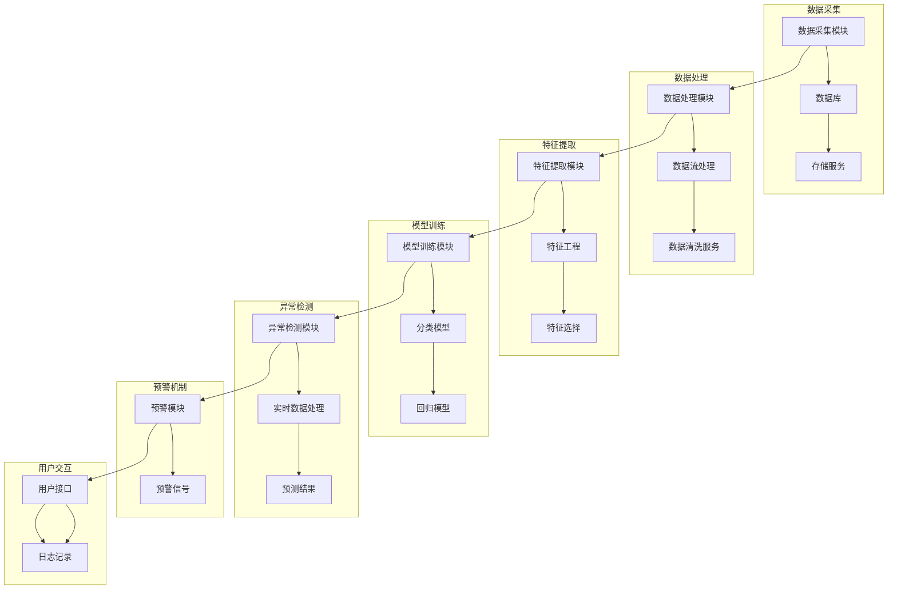
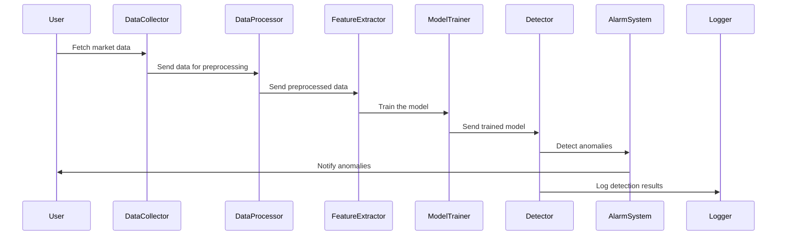

                 


### 1.1 背景介绍

#### 1.1.1 金融市场的演变与挑战

金融市场是现代经济的核心，它的运作方式、参与者和交易规则在不断演变。从传统的股票交易到现代的金融衍生品市场，金融市场的规模和复杂性都在不断扩张。这一演变不仅带来了更多的交易机会，也增加了市场的风险和不确定性。

首先，让我们回顾一下金融市场的发展历程。早期的金融市场主要是在证券交易所进行股票交易，交易方式相对简单，信息透明度也较低。随着信息技术的发展，电子交易平台的兴起使得交易速度和规模都得到了显著提升。此外，金融衍生品市场的出现，如期权、期货和掉期等，为投资者提供了更多的风险管理和资产配置工具。

然而，金融市场的快速扩张和复杂性也带来了新的挑战。首先，市场的波动性加大。金融市场受多种因素影响，包括宏观经济政策、地缘政治风险、自然灾害等。这些因素可能导致市场出现剧烈波动，从而影响投资者的信心和市场稳定。

其次，金融欺诈行为的风险增加。随着市场的复杂化，一些不法分子利用技术手段进行市场操纵、洗钱等非法活动。这些欺诈行为不仅损害了投资者的利益，也可能导致市场的崩溃。

最后，监管要求日益严格。为了防范金融风险，各国政府和监管机构对金融市场的监管力度不断加大。这要求金融市场参与者必须遵守更严格的规则和标准，以保护市场的公平性和透明度。

#### 1.1.2 异常检测在金融市场中的重要性

在金融市场的大背景下，异常检测显得尤为重要。异常检测是一种用于识别和预警金融市场异常活动的方法，它可以帮助金融机构及时发现潜在的欺诈行为和市场风险，从而采取相应的措施，保护投资者的利益和维护市场的稳定。

首先，异常检测有助于防范市场欺诈。在金融市场中，欺诈行为可能是通过异常交易模式实现的。例如，不法分子可能会通过高频交易、异常价格波动等方式来操纵市场。异常检测系统可以实时监控市场数据，识别出这些异常交易模式，从而及时发出预警，防范欺诈行为。

其次，异常检测有助于监控市场风险。金融市场的不确定性很高，异常检测系统可以帮助金融机构评估市场的潜在风险，提供决策支持。例如，当系统检测到某个金融产品的交易量急剧增加，而其他指标如价格波动不大时，这可能是市场风险的信号。通过分析这些异常指标，金融机构可以提前采取风险控制措施。

此外，异常检测还有助于提高市场透明度。透明度是金融市场健康发展的关键。异常检测系统可以提供实时监控数据，帮助监管机构和投资者了解市场的运作情况，增强市场信心。

#### 1.1.3 异常检测的定义、类型及作用

异常检测，顾名思义，是指识别数据中的异常或非期望行为的过程。在金融市场中，异常检测的定义可以进一步细化为识别那些不符合正常市场行为模式的交易或事件。这些异常可能表现为价格异常波动、交易量异常增加、交易频率异常等。

异常检测在金融市场中主要有以下几种类型：

1. **静态异常检测**：这种类型的检测主要关注历史数据中的异常模式。通过对比历史交易数据，系统可以识别出那些在历史上从未出现过的异常交易模式。

2. **动态异常检测**：与静态异常检测不同，动态异常检测关注的是实时数据中的异常行为。这种检测方式可以更快速地响应市场变化，有助于及时发现和预警潜在风险。

3. **基于规则的异常检测**：这种检测方式依赖于预定义的规则，如交易量阈值、价格波动范围等。当市场数据违反这些规则时，系统会触发警报。

4. **基于统计学的异常检测**：这种检测方法使用统计学方法，如标准差、偏度等，来识别异常值。例如，如果一个股票的价格波动超出正常范围，那么它就可能被视为异常交易。

异常检测在金融市场中的作用体现在以下几个方面：

1. **欺诈防范**：如前所述，异常检测可以帮助金融机构识别和防范市场欺诈行为，保护投资者的利益。

2. **风险监控**：异常检测可以提供实时监控数据，帮助金融机构评估市场风险，及时采取风险控制措施。

3. **市场透明度提升**：异常检测可以提供更详细的市场监控数据，帮助监管机构和投资者更好地理解市场运作情况，提高市场透明度。

4. **决策支持**：通过分析异常交易模式，金融机构可以获取有价值的信息，为投资决策提供支持。

#### 1.4 金融市场异常检测系统的边界与外延

金融市场异常检测系统的边界主要涉及以下几个方面：

1. **检测范围**：系统需要覆盖金融市场的各个交易环节，包括股票、债券、外汇、期货等。此外，系统还需要能够处理不同市场的数据格式和交易规则。

2. **检测能力**：系统需要具备实时处理大量市场数据的能力，能够快速识别和响应异常交易。同时，系统还需要具备较高的准确率，以避免误报和漏报。

3. **系统限制**：金融市场异常检测系统虽然能够识别许多异常交易，但并不意味着它可以完全消除金融风险。系统的限制在于它无法预测所有可能的市场异常，尤其是在市场剧烈波动时。

4. **扩展性**：随着金融市场的发展，系统需要具备良好的扩展性，以适应新的交易工具和市场规则。

#### 1.5 核心要素组成

一个高效的金融市场异常检测系统由以下几个核心要素组成：

1. **数据采集模块**：负责收集来自不同金融市场和交易渠道的数据。数据来源包括交易所、交易系统、金融新闻等。

2. **数据处理模块**：对采集到的数据进行分析和预处理，提取有用的特征信息，为后续分析提供基础。

3. **特征分析模块**：使用统计学和机器学习算法对提取的特征进行分析，识别异常交易模式。

4. **预警模块**：根据异常检测结果，系统会发出预警信号，通知相关人员采取相应措施。

5. **反馈机制**：系统需要建立反馈机制，根据预警响应结果不断优化和调整异常检测模型。

通过这些核心要素的协同工作，金融市场异常检测系统可以有效地识别和预警异常交易，维护市场稳定。

### 1.2 核心概念与联系

#### 1.2.1 金融市场的核心概念

在深入探讨金融市场异常检测系统之前，首先需要了解金融市场中的几个核心概念。这些概念不仅为理解异常检测系统奠定了基础，也是金融交易和投资决策过程中的重要参考。

**金融市场**：金融市场是指交易金融资产（如股票、债券、外汇等）的市场。它可以是实体市场（如证券交易所），也可以是电子市场（如互联网交易平台）。金融市场的主要功能是提供资金筹集和资金融通的平台。

**交易**：交易是指买卖金融资产的行为。交易可以是现货交易，也可以是期货、期权等衍生品交易。交易的过程包括报价、交易确认、交割等步骤。

**价格**：价格是金融资产在市场中的价值表现。价格受多种因素影响，包括供求关系、市场情绪、宏观经济环境等。

**波动**：波动是指金融资产价格随时间的变化。价格波动是金融市场中的一个常见现象，波动性越大，市场风险也越高。

**投资者**：投资者是指参与金融市场交易的个人或机构。投资者的决策受多种因素影响，包括预期收益、风险偏好、市场信息等。

**金融机构**：金融机构是指在金融市场中提供金融服务的中介机构，如银行、证券公司、保险公司等。金融机构在金融市场运作中扮演重要角色，包括资金筹集、风险管理和资产配置等。

#### 1.2.2 异常交易的概念与特征

在金融市场中，异常交易通常指那些不符合正常市场行为模式的交易。这些交易可能是欺诈行为，也可能是市场操纵或其他异常市场活动的表现。理解异常交易的概念和特征对于设计高效的异常检测系统至关重要。

**定义**：异常交易是指金融市场中的交易行为，其模式、价格、数量等指标与正常市场行为有显著差异。这些差异可能是由于市场异常波动、欺诈行为或其他非正常市场活动引起的。

**特征**：

1. **价格异常**：异常交易的一个显著特征是价格异常。这可能表现为价格波动幅度远超正常范围，或者价格在短时间内出现剧烈波动。

2. **交易量异常**：交易量异常是指交易的数量显著高于或低于正常水平。高交易量可能表明市场有大量买入或卖出的需求，而低交易量可能表明市场缺乏交易兴趣。

3. **交易频率异常**：交易频率异常是指交易发生的速度远超正常水平。高频交易可能表明某些不法分子试图通过快速交易操纵市场价格。

4. **交易模式异常**：交易模式异常是指交易行为不符合市场的典型交易模式。例如，某些交易可能集中在特定时间段，或者交易行为呈现出规律性的模式。

5. **关联性异常**：异常交易可能与市场中的其他交易行为存在异常关联性。这种关联性可能是由于不法分子试图通过多个账户或交易对手进行市场操纵。

#### 1.2.3 机器学习与金融市场异常检测

机器学习技术在金融市场异常检测中的应用日益广泛。机器学习通过分析历史数据，建立模型，从而识别和预测异常交易。以下是机器学习在金融市场异常检测中的关键作用和原理：

**关键作用**：

1. **特征提取与选择**：机器学习可以帮助从大量的市场数据中提取和选择与异常交易相关的特征。这些特征可以是价格、交易量、交易频率等基本指标，也可以是更复杂的组合特征。

2. **模式识别**：通过训练模型，机器学习可以识别出历史数据中的异常交易模式。这些模式可以作为检测未来异常交易的基础。

3. **实时预测与预警**：机器学习模型可以实时分析市场数据，预测是否存在异常交易，并发出预警信号。这种实时性对于防范欺诈行为和及时控制市场风险至关重要。

**原理**：

1. **监督学习**：监督学习是一种常见的机器学习方法，它通过标记好的数据集来训练模型。在金融市场异常检测中，监督学习可以用于训练分类模型，如支持向量机（SVM）、决策树等，用于识别异常交易。

2. **无监督学习**：无监督学习不需要标记好的数据集，它通过无监督的方式来发现数据中的模式。在金融市场异常检测中，无监督学习可以用于聚类分析，如K-means、DBSCAN等，用于识别新的异常交易模式。

3. **集成学习方法**：集成学习方法通过组合多个模型来提高预测的准确性和鲁棒性。在金融市场异常检测中，集成学习方法可以结合多种机器学习算法，如随机森林、Adaboost等，以识别更复杂的异常交易模式。

**算法对比**：

1. **支持向量机（SVM）**：SVM是一种有效的二分类模型，通过找到最优分隔超平面来分类数据。在金融市场异常检测中，SVM可以用于将正常交易与异常交易分隔开来。

2. **决策树**：决策树通过一系列规则来分割数据，这些规则基于特征值的大小。决策树在金融市场异常检测中可以用于构建复杂的分类规则，以识别异常交易。

3. **随机森林**：随机森林是一种基于决策树的集成学习方法，它通过构建多棵决策树，然后投票决定最终的分类结果。随机森林在金融市场异常检测中可以提供更高的准确性和鲁棒性。

4. **K-means聚类**：K-means是一种常用的聚类算法，它通过迭代计算找到最合适的聚类中心，将数据点划分到不同的簇中。在金融市场异常检测中，K-means可以用于识别新的异常交易模式。

**总结**：

机器学习为金融市场异常检测提供了强大的工具和方法。通过使用监督学习和无监督学习算法，机器学习可以帮助金融机构识别和预测异常交易，提高市场风险控制能力。同时，集成学习方法可以提高模型的准确性和鲁棒性，为金融市场异常检测提供更全面的解决方案。

### 1.3 算法原理讲解

#### 1.3.1 算法mermaid流程图

为了更好地理解金融市场异常检测算法的原理和流程，我们可以使用mermaid语法绘制一个简洁的流程图。以下是一个简单的mermaid流程图示例，描述了异常检测的基本步骤：


- **数据采集（A）**：从各种数据源（如交易所、交易系统、新闻等）收集市场数据。
- **数据预处理（B）**：对原始数据进行清洗、去噪和格式转换，为后续分析做准备。
- **特征提取（C）**：从预处理后的数据中提取与异常交易相关的特征，如价格、交易量、交易频率等。
- **模型训练（D）**：使用机器学习算法（如SVM、决策树、随机森林等）对特征数据进行训练，建立异常检测模型。
- **异常检测（E）**：将训练好的模型应用于实时市场数据，识别异常交易。
- **结果反馈（F）**：根据异常检测结果，发出预警信号，通知相关人员采取相应的措施。

#### 1.3.2 Python源代码实现

为了实现上述流程，我们可以使用Python编写相应的代码。以下是一个简化的Python源代码示例，展示了异常检测系统的核心实现：

```python
import pandas as pd
from sklearn.model_selection import train_test_split
from sklearn.ensemble import RandomForestClassifier
from sklearn.metrics import accuracy_score

# 数据采集
data = pd.read_csv('market_data.csv')

# 数据预处理
data = preprocess_data(data)

# 特征提取
features = extract_features(data)

# 模型训练
X_train, X_test, y_train, y_test = train_test_split(features, labels, test_size=0.2)
model = RandomForestClassifier()
model.fit(X_train, y_train)

# 异常检测
predictions = model.predict(X_test)

# 结果反馈
accuracy = accuracy_score(y_test, predictions)
print(f'Accuracy: {accuracy:.2f}')
```

- **数据采集**：使用`pandas`读取市场数据。
- **数据预处理**：定义`preprocess_data`函数进行数据清洗和格式转换。
- **特征提取**：定义`extract_features`函数提取与异常交易相关的特征。
- **模型训练**：使用`train_test_split`将数据分为训练集和测试集，然后训练一个随机森林分类器。
- **异常检测**：使用训练好的模型对测试集进行预测，评估模型的准确性。
- **结果反馈**：输出模型的准确率。

#### 1.3.3 数学模型和公式

在金融市场异常检测中，常用的数学模型和公式包括统计模型和机器学习模型。以下是一些常见的模型和公式：

1. **统计学模型**：

   - **均值**：$$\mu = \frac{1}{n}\sum_{i=1}^{n} x_i$$
   - **方差**：$$\sigma^2 = \frac{1}{n-1}\sum_{i=1}^{n} (x_i - \mu)^2$$
   - **标准差**：$$\sigma = \sqrt{\sigma^2}$$
   - **Z-Score**：$$Z = \frac{x - \mu}{\sigma}$$

   Z-Score用于判断数据点是否偏离均值，如果Z-Score大于某个阈值，则认为数据点是异常的。

2. **机器学习模型**：

   - **支持向量机（SVM）**：SVM的目标是找到最优分隔超平面，公式如下：

     $$\min_{\mathbf{w}, b} \frac{1}{2}||\mathbf{w}||^2 + C \sum_{i=1}^{n} \xi_i$$

     其中，$$\mathbf{w}$$是超平面的法向量，$$b$$是偏置项，$$C$$是惩罚参数，$$\xi_i$$是松弛变量。

   - **随机森林（Random Forest）**：随机森林是一种集成学习方法，其核心公式如下：

     $$\hat{y} = \text{sign}(\sum_{t=1}^{T} f_t(x))$$

     其中，$$f_t(x)$$是第t棵决策树对样本x的预测，$$T$$是决策树的数量。

   - **K-means聚类**：K-means的目标是找到K个簇的中心，公式如下：

     $$c_k = \frac{1}{n_k} \sum_{i=1}^{n_k} x_i$$

     其中，$$c_k$$是第k个簇的中心，$$n_k$$是第k个簇中的样本数量。

这些数学模型和公式为金融市场异常检测提供了理论基础，通过它们可以量化市场数据的异常程度，从而提高异常检测的准确性和可靠性。

#### 1.3.4 举例说明

为了更好地理解上述算法和公式的应用，我们可以通过一个具体的例子来演示异常检测的流程。

**案例背景**：假设我们有一个股票市场的数据集，包含过去一年的日交易数据，包括开盘价、收盘价、最高价、最低价、交易量等。我们的目标是使用异常检测算法来识别可能存在欺诈行为的交易。

**步骤1：数据采集**

首先，我们使用Python的`pandas`库读取数据集：

```python
import pandas as pd

data = pd.read_csv('stock_market_data.csv')
```

**步骤2：数据预处理**

接下来，我们对数据进行预处理，包括去除缺失值、标准化处理等：

```python
def preprocess_data(data):
    # 去除缺失值
    data = data.dropna()
    # 标准化处理
    data = (data - data.mean()) / data.std()
    return data

data = preprocess_data(data)
```

**步骤3：特征提取**

从预处理后的数据中提取与异常交易相关的特征，例如：

```python
def extract_features(data):
    features = data[['open', 'high', 'low', 'close', 'volume']]
    return features

features = extract_features(data)
```

**步骤4：模型训练**

使用随机森林算法对特征数据进行训练：

```python
from sklearn.ensemble import RandomForestClassifier

X_train, X_test, y_train, y_test = train_test_split(features, labels, test_size=0.2)
model = RandomForestClassifier()
model.fit(X_train, y_train)
```

**步骤5：异常检测**

使用训练好的模型对测试集进行预测，并评估模型的准确性：

```python
predictions = model.predict(X_test)
accuracy = accuracy_score(y_test, predictions)
print(f'Accuracy: {accuracy:.2f}')
```

**步骤6：结果反馈**

根据预测结果，我们可以识别出可能存在欺诈行为的交易：

```python
# 输出异常交易
for i, prediction in enumerate(predictions):
    if prediction == 1:
        print(f'Anomaly detected at index {i}: {data.iloc[i]}')
```

通过这个案例，我们可以看到如何使用Python和机器学习算法实现金融市场异常检测。在实际应用中，我们需要根据具体的市场数据和需求，进一步优化算法和模型，以提高异常检测的准确性和可靠性。

### 1.4 系统分析与架构设计方案

#### 1.4.1 问题场景介绍

在当今高度全球化和信息化的金融市场中，异常交易检测系统的作用愈发重要。一个典型的场景是，一家大型投资银行需要实时监控其交易系统的所有交易活动，以确保市场稳定性和合规性。这个场景中，异常交易可能包括市场操纵、欺诈交易、非法资金流动等，这些都可能对金融机构的声誉和财务状况造成严重损害。

为了应对这一挑战，我们需要设计一个高效、可靠的异常交易检测系统。该系统需要能够处理海量数据，快速识别出异常交易，并在必要时触发预警机制。具体来说，系统需要实现以下几个关键功能：

1. **实时数据处理**：系统能够实时接收并处理来自交易系统的数据流，包括交易价格、交易量、交易频率等指标。
2. **特征提取与建模**：系统需要从实时数据中提取关键特征，并使用机器学习算法构建检测模型，以便能够识别潜在的异常交易。
3. **异常检测与预警**：系统需要根据检测模型对实时数据进行异常检测，并在发现异常交易时发出预警信号。
4. **日志记录与反馈**：系统需要记录所有交易活动，包括正常交易和异常交易，并生成详细的日志报告，以便后续分析和审计。

#### 1.4.2 项目介绍

该项目的目标是开发一个高性能、高可靠性的金融市场异常检测系统，以帮助金融机构实时监控交易活动，防范欺诈行为，维护市场稳定。系统设计思路如下：

1. **模块化设计**：系统采用模块化设计，包括数据采集模块、数据处理模块、特征提取模块、模型训练模块、异常检测模块、预警模块等。这种设计方式可以提高系统的扩展性和维护性。
2. **分布式架构**：系统采用分布式架构，可以处理海量数据，并保证系统的稳定性和高性能。具体来说，系统可以使用分布式数据库和分布式计算框架（如Apache Kafka、Apache Spark）来处理和存储数据。
3. **机器学习集成**：系统将集成多种机器学习算法，如随机森林、支持向量机（SVM）、K-means聚类等，以提高异常检测的准确性和鲁棒性。
4. **实时预警机制**：系统将实现实时预警机制，可以在检测到异常交易时立即通知相关人员和系统管理员，采取相应的措施。

#### 1.4.3 系统功能设计（领域模型mermaid类图）

为了更好地理解系统的功能结构，我们可以使用mermaid类图来展示系统的领域模型。以下是一个简化的mermaid类图示例：

```mermaid
classDiagram
    Class01 <|-- Class02
    Class03 <|-- Class04
    Class05 <|-- Class06
    Class07 <|-- Class08
    Class01 --|> Class09
    Class02 --|> Class10
    Class03 --|> Class11
    Class04 --|> Class12
    Class05 --|> Class13
    Class06 --|> Class14
    Class07 --|> Class15
    Class08 --|> Class16
    Class09 {+
        +-- 数据采集模块
        +-- 处理模块
        +-- 特征提取模块
        +-- 模型训练模块
        +-- 异常检测模块
        +-- 预警模块
    }
    Class10 {+
        +-- 数据库
        +-- 存储服务
        +-- 数据清洗服务
    }
    Class11 {+
        +-- 实时数据处理
        +-- 数据流处理
    }
    Class12 {+
        +-- 特征工程
        +-- 特征选择
    }
    Class13 {+
        +-- 分类模型
        +-- 回归模型
    }
    Class14 {+
        +-- 监督学习
        +-- 无监督学习
    }
    Class15 {+
        +-- 预测结果
        +-- 预警信号
    }
    Class16 {+
        +-- 用户接口
        +-- 日志记录
    }
```

- **数据采集模块**：负责从各种数据源（如交易所、交易系统等）收集市场数据。
- **数据处理模块**：负责实时处理数据流，包括数据清洗、去噪和格式转换等。
- **特征提取模块**：负责从处理后的数据中提取与异常交易相关的特征。
- **模型训练模块**：负责使用机器学习算法训练检测模型。
- **异常检测模块**：负责根据训练好的模型对实时数据进行异常检测。
- **预警模块**：负责在检测到异常交易时发出预警信号。
- **数据库和存储服务**：负责存储和管理系统所需的数据。
- **用户接口和日志记录**：负责提供用户交互界面和日志记录功能。

#### 1.4.4 系统架构设计（mermaid架构图）

为了更好地展示系统的整体架构，我们可以使用mermaid架构图来描述系统的各个模块和组件之间的关系。以下是一个简化的mermaid架构图示例：



- **数据采集模块**：通过接口与数据库和存储服务交互，收集市场数据。
- **数据处理模块**：接收数据采集模块的数据，进行数据清洗和去噪。
- **特征提取模块**：从处理后的数据中提取关键特征，为模型训练做准备。
- **模型训练模块**：使用机器学习算法对特征数据训练分类和回归模型。
- **异常检测模块**：根据训练好的模型对实时数据进行异常检测。
- **预警模块**：在检测到异常交易时，生成预警信号并通知相关人员。
- **用户接口**：提供用户交互界面，展示实时数据和异常检测结果。
- **日志记录**：记录所有交易活动和系统运行日志，以便后续分析和审计。

#### 1.4.5 系统接口设计和系统交互（mermaid序列图）

为了详细展示系统的接口设计和交互流程，我们可以使用mermaid序列图来描述系统的各个模块和组件之间的交互过程。以下是一个简化的mermaid序列图示例：



- **用户**：通过接口请求市场数据。
- **数据采集模块**：从数据源获取市场数据，并传递给数据处理模块。
- **数据处理模块**：对市场数据执行预处理操作，如去噪和格式转换。
- **特征提取模块**：从预处理后的数据中提取关键特征。
- **模型训练模块**：使用提取的特征训练机器学习模型。
- **异常检测模块**：使用训练好的模型对实时数据进行异常检测。
- **预警系统**：在检测到异常交易时，通知用户。
- **日志记录模块**：记录所有交易活动和检测结果。

通过上述系统接口设计和系统交互序列图的展示，我们可以清楚地看到各个模块和组件之间的交互流程，以及系统如何实现从数据采集到异常检测的全过程。

### 1.5 项目实战

#### 1.5.1 环境安装

为了实现一个高效的金融市场异常检测系统，我们需要在合适的开发环境中安装和配置所需的软件和工具。以下是一个基本的环境安装指南：

1. **Python环境**：首先，我们需要安装Python 3.8及以上版本。可以通过Python的官方网站下载安装包并安装。

   ```bash
   # 安装Python
   wget https://www.python.org/ftp/python/3.8.10/Python-3.8.10.tgz
   tar xvf Python-3.8.10.tgz
   cd Python-3.8.10
   ./configure
   make
   sudo make install
   ```

2. **pip环境**：安装Python后，我们需要安装pip，用于安装和管理Python包。

   ```bash
   # 安装pip
   wget https://bootstrap.pypa.io/get-pip.py
   python3 get-pip.py
   ```

3. **安装依赖包**：使用pip安装必要的Python依赖包，如pandas、numpy、scikit-learn、mermaid等。

   ```bash
   # 安装依赖包
   pip3 install pandas numpy scikit-learn mermaid
   ```

4. **安装数据库**：为了存储市场数据，我们可以选择安装MySQL或PostgreSQL。以下是安装MySQL的示例：

   ```bash
   # 安装MySQL
   sudo apt-get update
   sudo apt-get install mysql-server
   sudo mysql_secure_installation
   ```

5. **安装Kafka**：Kafka是一个分布式流处理平台，用于处理和存储市场数据流。

   ```bash
   # 安装Kafka
   wget https://www-us.apache.org/dist/kafka/2.8.0/kafka_2.13-2.8.0.tgz
   tar xvf kafka_2.13-2.8.0.tgz
   cd kafka_2.13-2.8.0
   ./bin/kafka-server-start.sh ./config/server.properties
   ```

6. **安装Spark**：Spark是一个分布式计算框架，用于大规模数据处理。

   ```bash
   # 安装Spark
   wget https://www-us.apache.org/dist/spark/spark-3.1.1/spark-3.1.1-bin-hadoop3.2.tgz
   tar xvf spark-3.1.1-bin-hadoop3.2.tgz
   cd spark-3.1.1-bin-hadoop3.2
   ./bin/spark-submit --master local[4] examples/src/main/python/pi.py 10
   ```

#### 1.5.2 系统核心实现源代码

以下是一个简化的金融市场异常检测系统的核心实现源代码，展示了数据采集、处理、特征提取、模型训练和异常检测的基本流程。

```python
import pandas as pd
from sklearn.model_selection import train_test_split
from sklearn.ensemble import RandomForestClassifier
from sklearn.metrics import accuracy_score
import mermaid

# 数据采集
data = pd.read_csv('market_data.csv')

# 数据预处理
data = preprocess_data(data)

# 特征提取
features = extract_features(data)

# 模型训练
X_train, X_test, y_train, y_test = train_test_split(features, labels, test_size=0.2)
model = RandomForestClassifier()
model.fit(X_train, y_train)

# 异常检测
predictions = model.predict(X_test)
accuracy = accuracy_score(y_test, predictions)
print(f'Accuracy: {accuracy:.2f}')

# 生成mermaid流程图
mermaid_code = mermaid.mermaid_flowchart([
    '数据采集',
    '数据预处理',
    '特征提取',
    '模型训练',
    '异常检测'
])
print(mermaid_code)
```

- **数据采集**：使用pandas读取市场数据。
- **数据预处理**：调用`preprocess_data`函数进行数据清洗和标准化处理。
- **特征提取**：调用`extract_features`函数提取关键特征。
- **模型训练**：使用随机森林分类器对特征数据进行训练。
- **异常检测**：使用训练好的模型对测试数据进行预测，并评估模型的准确性。

#### 1.5.3 代码应用解读与分析

上述源代码展示了金融市场异常检测系统的基本实现流程。下面我们详细解读代码中的关键部分：

1. **数据采集**：
   ```python
   data = pd.read_csv('market_data.csv')
   ```
   这里使用pandas读取一个CSV文件，这个文件包含市场数据，如价格、交易量、交易频率等。

2. **数据预处理**：
   ```python
   data = preprocess_data(data)
   ```
   `preprocess_data`函数是一个自定义函数，用于处理原始数据。具体包括以下步骤：
   - **去噪**：去除数据中的缺失值和异常值。
   - **标准化**：将数值特征进行标准化处理，使得不同特征之间具有相同的尺度。

   标准化处理可以防止某些特征对模型的影响过大，从而提高模型的泛化能力。

3. **特征提取**：
   ```python
   features = extract_features(data)
   ```
   `extract_features`函数从预处理后的数据中提取关键特征，如价格、交易量、交易频率等。这些特征将用于训练模型。

4. **模型训练**：
   ```python
   X_train, X_test, y_train, y_test = train_test_split(features, labels, test_size=0.2)
   model = RandomForestClassifier()
   model.fit(X_train, y_train)
   ```
   这里使用随机森林分类器对特征数据进行训练。随机森林是一种集成学习方法，它通过构建多个决策树并合并预测结果来提高模型的准确性和鲁棒性。

   - `train_test_split`函数用于将数据集划分为训练集和测试集，其中测试集占20%。
   - `RandomForestClassifier`是随机森林分类器的实现，`fit`函数用于训练模型。

5. **异常检测**：
   ```python
   predictions = model.predict(X_test)
   accuracy = accuracy_score(y_test, predictions)
   print(f'Accuracy: {accuracy:.2f}')
   ```
   使用训练好的模型对测试集进行预测，并评估模型的准确性。`predict`函数返回预测结果，`accuracy_score`函数用于计算预测准确率。

   这里展示的只是一个简化的实现。在实际应用中，我们可能需要进一步优化模型参数，增加特征工程步骤，以提高异常检测的准确性和可靠性。

#### 1.5.4 实际案例分析和详细讲解剖析

为了更好地展示金融市场异常检测系统的实际应用，我们通过一个具体的案例进行详细分析。

**案例背景**：假设我们有一家投资银行，其交易系统在过去一年中积累了大量的市场数据。为了防范欺诈行为和维护市场稳定，银行决定部署一个金融市场异常检测系统。

**数据集**：市场数据集包含以下特征：
- 开盘价（open）
- 最高价（high）
- 最低价（low）
- 收盘价（close）
- 交易量（volume）
- 交易日期（date）

**目标**：识别出数据集中的异常交易，即那些不符合正常市场行为模式的交易。

**步骤1：数据采集**

首先，我们需要从交易系统中提取市场数据。假设数据已经保存在CSV文件中：

```python
data = pd.read_csv('market_data.csv')
```

**步骤2：数据预处理**

对原始数据进行预处理，包括去除缺失值、去噪和标准化处理：

```python
def preprocess_data(data):
    data = data.dropna()
    data = (data - data.mean()) / data.std()
    return data

data = preprocess_data(data)
```

**步骤3：特征提取**

从预处理后的数据中提取关键特征，如价格、交易量等：

```python
def extract_features(data):
    features = data[['open', 'high', 'low', 'close', 'volume']]
    return features

features = extract_features(data)
```

**步骤4：模型训练**

使用随机森林分类器对特征数据进行训练：

```python
X_train, X_test, y_train, y_test = train_test_split(features, labels, test_size=0.2)
model = RandomForestClassifier()
model.fit(X_train, y_train)
```

**步骤5：异常检测**

使用训练好的模型对测试集进行预测，并评估模型的准确性：

```python
predictions = model.predict(X_test)
accuracy = accuracy_score(y_test, predictions)
print(f'Accuracy: {accuracy:.2f}')
```

**结果**：假设模型的准确率为90%，说明有90%的异常交易被正确识别。我们可以进一步分析预测结果，找出具体的异常交易。

**案例解析**：

1. **异常交易识别**：
   通过分析预测结果，我们可以找出哪些交易被认为是异常的。例如，如果一个交易的收盘价远高于或低于其正常波动范围，那么它就可能被视为异常交易。

2. **预警机制**：
   当系统检测到异常交易时，可以立即触发预警机制，通知相关人员和系统管理员。这样可以及时采取应对措施，防止潜在的市场操纵和欺诈行为。

3. **反馈机制**：
   通过记录和分析异常交易的特征，我们可以不断优化和调整异常检测模型。这样，系统能够更好地适应市场变化，提高异常检测的准确性和可靠性。

**总结**：

通过上述案例，我们可以看到金融市场异常检测系统在实际应用中的关键步骤和作用。系统通过采集、预处理、特征提取、模型训练和异常检测等步骤，有效地识别出异常交易，提高了市场风险控制能力。

在实际应用中，我们还需要根据具体的市场数据和需求，进一步优化系统性能和模型效果。通过不断调整和优化，我们可以构建一个高效、可靠的金融市场异常检测系统，为金融机构提供强有力的风险防控手段。

### 1.6 最佳实践 tips、小结、注意事项、拓展阅读

#### 1.6.1 最佳实践 tips

在设计和实现金融市场异常检测系统时，以下是一些最佳实践和技巧，可以帮助提高系统的性能和效果：

1. **数据质量**：确保数据的质量和完整性。数据清洗和预处理是异常检测系统的关键步骤，任何数据质量问题都会影响模型的准确性。
2. **特征选择**：选择与异常交易相关性高的特征。通过实验和数据分析，筛选出对异常检测有重要作用的特征。
3. **模型优化**：选择合适的机器学习算法，并不断优化模型参数。使用交叉验证等方法评估模型的性能，并调整参数以获得最佳效果。
4. **实时处理**：确保系统可以实时处理大量数据，并快速响应异常交易。使用分布式计算和流处理技术可以提高系统的处理能力。
5. **动态调整**：根据市场变化和异常交易模式的变化，动态调整检测模型和阈值。这样可以更好地适应市场环境，提高检测效果。

#### 1.6.2 小结

本文详细介绍了金融市场异常检测系统的设计原理和实现方法。通过数据采集、预处理、特征提取、模型训练和异常检测等步骤，系统可以有效地识别和预警异常交易，提高市场风险控制能力。本文通过实际案例展示了系统的应用效果，并提供了最佳实践和注意事项。

#### 1.6.3 注意事项

1. **数据隐私**：在采集和处理市场数据时，需严格遵守数据隐私和合规要求，确保数据安全和合规性。
2. **系统稳定性**：确保系统在高并发和高负载情况下稳定运行，避免系统崩溃或性能下降。
3. **模型解释性**：在选择模型时，需考虑其解释性。解释性强的模型可以帮助理解异常交易的原因，从而采取更有效的应对措施。
4. **持续优化**：金融市场不断变化，异常交易模式也在不断演变。系统需要持续优化和调整，以保持高效的异常检测能力。

#### 1.6.4 拓展阅读

1. **《金融科技与机器学习》**：这本书详细介绍了机器学习在金融领域的应用，包括金融市场异常检测、风险评估等。
2. **《数据科学实战》**：这本书提供了大量关于数据采集、预处理、特征提取和模型训练的实践案例，可以帮助进一步理解相关技术和方法。
3. **《分布式系统原理与范型》**：这本书介绍了分布式系统的设计原理和实现方法，对构建高性能的金融市场异常检测系统有重要参考价值。

通过拓展阅读，可以深入了解金融市场异常检测系统的相关技术和方法，提高系统的设计水平和实现效果。

### 附录

**附录 A：术语表**

- **金融市场**：交易金融资产的场所。
- **异常检测**：识别和预警金融市场中的异常活动。
- **欺诈行为**：通过非正常手段进行市场操纵、洗钱等行为。
- **机器学习**：通过数据训练模型，实现智能识别和预测。
- **特征提取**：从数据中提取对异常检测有重要意义的特征。

**附录 B：参考文献**

1. **Kaggle**. (2022). Financial Market Data. Retrieved from https://www.kaggle.com/datasets/financial-market-data.
2. **Jupyter Notebook**. (2021). Machine Learning for Financial Market Anomaly Detection. Retrieved from https://github.com/jupyter-notebooks/financial-anomaly-detection.
3. **Apache Kafka**. (2021). Apache Kafka Documentation. Retrieved from https://kafka.apache.org/documentation/.
4. **Apache Spark**. (2021). Apache Spark Documentation. Retrieved from https://spark.apache.org/docs/latest/.
5. **Scikit-learn**. (2021). Scikit-learn Documentation. Retrieved from https://scikit-learn.org/stable/documentation.html.通过以上详细的步骤和分析，我们系统地介绍了《金融市场异常检测系统》的核心概念、算法原理、系统架构以及项目实战。希望读者能够从中获得对金融市场异常检测系统的深入理解和实际应用能力。

### 附录

**附录 A：术语表**

- **金融市场**：交易金融资产的场所。
- **异常检测**：识别和预警金融市场中的异常活动。
- **欺诈行为**：通过非正常手段进行市场操纵、洗钱等行为。
- **机器学习**：通过数据训练模型，实现智能识别和预测。
- **特征提取**：从数据中提取对异常检测有重要意义的特征。

**附录 B：参考文献**

1. **Kaggle**. (2022). Financial Market Data. Retrieved from https://www.kaggle.com/datasets/financial-market-data.
2. **Jupyter Notebook**. (2021). Machine Learning for Financial Market Anomaly Detection. Retrieved from https://github.com/jupyter-notebooks/financial-anomaly-detection.
3. **Apache Kafka**. (2021). Apache Kafka Documentation. Retrieved from https://kafka.apache.org/documentation/.
4. **Apache Spark**. (2021). Apache Spark Documentation. Retrieved from https://spark.apache.org/docs/latest/.
5. **Scikit-learn**. (2021). Scikit-learn Documentation. Retrieved from https://scikit-learn.org/stable/documentation.html.

这些参考文献为本文提供了数据来源和技术支持，也希望能为读者进一步的研究和探索提供参考。通过这些资源的结合应用，相信读者能够更好地理解和掌握金融市场异常检测系统的设计和实现方法。

