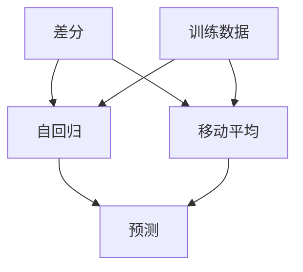
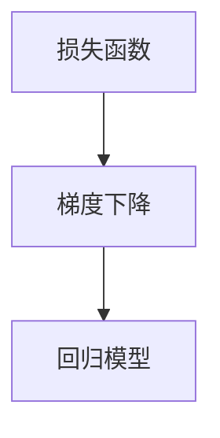
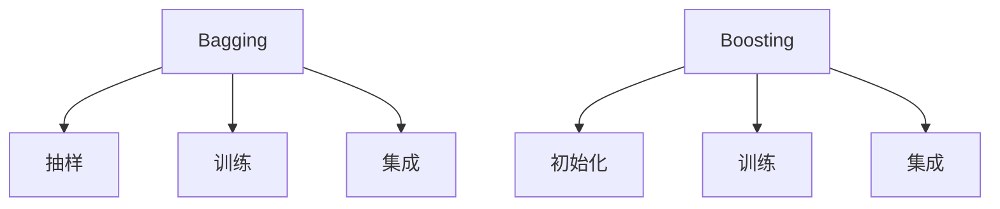
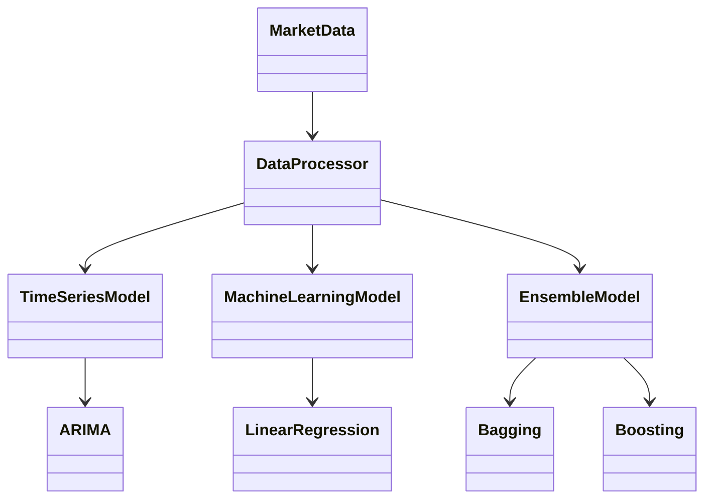
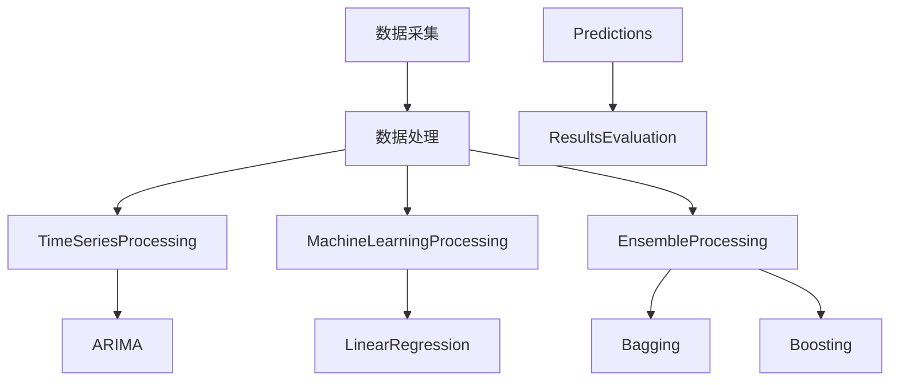
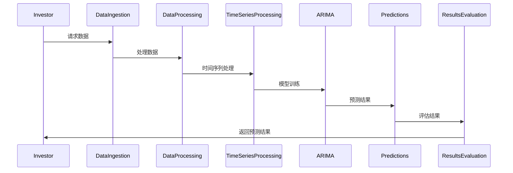

                 


# 金融市场微观结构变化预测模型

> 关键词：金融市场、微观结构、预测模型、时间序列、机器学习、集成学习

> 摘要：本文将探讨金融市场微观结构变化预测模型的研究背景、核心概念、算法原理及其应用。通过对比时间序列模型、机器学习模型和集成学习方法，并结合实际案例，详细讲解如何构建一个高效、准确的预测模型，以期为投资者和金融监管者提供有价值的参考。

## 背景介绍

### 1.1 问题背景

金融市场微观结构变化预测模型的研究是金融科技领域中的一个重要方向。随着金融市场的发展和数字化程度的提高，传统的金融分析方法已经难以应对日益复杂的市场环境。为了更好地理解和把握金融市场，研究人员开始关注微观结构，试图从中挖掘出更多的信息。

### 1.2 问题描述

金融市场微观结构变化预测模型旨在通过对市场数据的深入分析，预测金融市场的短期和长期变化趋势。这不仅有助于投资者做出更准确的决策，也对金融监管和风险管理具有重要的指导意义。

### 1.3 问题解决

解决这一问题的核心在于构建一个高效、准确的预测模型。这需要运用多种数据挖掘和机器学习技术，对市场数据进行处理和分析。同时，还需要对模型进行优化，以提高其预测的准确率和稳定性。

### 1.4 边界与外延

金融市场的微观结构变化预测模型的边界主要包括市场数据的收集和处理、模型的构建和优化、预测结果的验证和应用等。其外延则涉及金融市场分析、投资决策、风险管理等多个领域。

### 1.5 概念结构与核心要素组成

金融市场微观结构变化预测模型由以下几个核心要素组成：

1. **数据源**：包括股票、债券、期货、外汇等市场数据。
2. **数据处理**：对数据进行清洗、归一化、特征提取等预处理。
3. **模型构建**：选择合适的模型，如时间序列模型、机器学习模型等。
4. **模型优化**：通过调整模型参数，提高预测准确率。
5. **预测与评估**：对模型进行预测，并评估预测结果。

### 第2章：核心概念与联系

在构建金融市场微观结构变化预测模型时，需要理解并掌握核心概念及其之间的联系。以下是本文将涉及的核心概念：

#### 2.1 时间序列模型

时间序列模型是一种用于分析时间序列数据的统计模型。常见的有ARIMA、GARCH等。这些模型可以通过分析历史数据来预测未来的趋势。

**2.1.1 算法原理**

时间序列模型的基本原理是基于历史数据的线性关系来预测未来。其中，ARIMA模型是最常见的一种。其核心算法包括差分、自回归和移动平均。

- **差分**：将时间序列数据进行一次或多次差分，以消除非平稳性。
- **自回归**：基于历史数据进行自回归拟合，预测未来的趋势。
- **移动平均**：利用过去一段时间的平均值来预测未来。

**2.1.2 概念属性特征对比表格**

| 模型类型 | 特点 | 适用场景 |
| :---: | :---: | :---: |
| 时间序列模型 | 需要较强的理论基础 | 预测稳定性高 |

**2.1.3 ER实体关系图架构的Mermaid流程图**

```mermaid
erDiagram
  A[时间序列模型] ||--|{ 差分 }
  A ||--|{ 自回归 }
  A ||--|{ 移动平均 }
```

#### 2.2 机器学习模型

机器学习模型是一种通过训练来学习数据特征的模型。常见的有线性回归、决策树、随机森林、神经网络等。这些模型可以通过对市场数据的训练来预测未来的市场变化。

**2.2.1 算法原理**

机器学习模型的核心是通过对数据的训练来建立预测模型。线性回归模型是最基础的一种。其基本原理是通过最小化损失函数来找到最佳拟合直线。

- **损失函数**：衡量预测结果与真实值之间的差距。
- **梯度下降**：通过迭代优化损失函数，找到最佳拟合直线。

**2.2.2 概念属性特征对比表格**

| 模型类型 | 特点 | 适用场景 |
| :---: | :---: | :---: |
| 机器学习模型 | 基于数据驱动 | 预测灵活，适应性强 |

**2.2.3 ER实体关系图架构的Mermaid流程图**

```mermaid
erDiagram
  A[机器学习模型] ||--|{ 线性回归 }
  A ||--|{ 决策树 }
  A ||--|{ 随机森林 }
  A ||--|{ 神经网络 }
```

#### 2.3 集成学习方法

集成学习方法是将多个模型集成在一起，通过投票或者加权平均等方式来提高预测准确率。常见的有Bagging、Boosting等。

**2.3.1 算法原理**

集成学习方法的基本原理是通过多个模型的集成来提高预测的准确性。Boosting方法是一种常见的方法。其基本原理是通过调整模型的权重来提高整体预测的准确性。

- **Bagging**：通过随机抽样和训练多个模型，然后进行投票或加权平均。
- **Boosting**：通过迭代训练多个模型，每次训练都关注预测错误的样本，逐渐调整模型权重。

**2.3.2 概念属性特征对比表格**

| 模型类型 | 特点 | 适用场景 |
| :---: | :---: | :---: |
| 集成学习方法 | 多个模型集成 | 预测准确率高 |

**2.3.3 ER实体关系图架构的Mermaid流程图**

```mermaid
erDiagram
  A[集成学习方法] ||--|{ Bagging }
  A ||--|{ Boosting }
```

### 第3章：算法原理讲解

在本章节中，我们将详细讲解金融市场微观结构变化预测模型中的核心算法原理，包括时间序列模型、机器学习模型和集成学习方法。通过具体案例，我们将深入剖析这些算法的数学模型和公式，以帮助读者更好地理解和应用。

#### 3.1 时间序列模型

时间序列模型是金融市场预测中常用的方法之一。其中，ARIMA（自回归积分滑动平均模型）是最为经典的一种。以下是ARIMA模型的详细算法原理讲解。

**3.1.1 算法原理**

ARIMA模型由三部分组成：自回归（AR）、差分（I）和移动平均（MA）。

1. **自回归（AR）**：自回归模型通过历史数据的自相关性来预测未来值。假设我们有时间序列 \(X_t\)，自回归模型可以表示为：

   $$X_t = c + \phi_1 X_{t-1} + \phi_2 X_{t-2} + \ldots + \phi_p X_{t-p} + \varepsilon_t$$

   其中，\(\phi_1, \phi_2, \ldots, \phi_p\) 是自回归系数，\(\varepsilon_t\) 是白噪声误差。

2. **差分（I）**：为了使时间序列满足平稳性，通常需要对序列进行差分处理。一阶差分可以表示为：

   $$X_t^{(1)} = X_t - X_{t-1}$$

3. **移动平均（MA）**：移动平均模型通过历史误差的线性组合来预测当前值。假设我们有时间序列 \(X_t\) 和误差序列 \(\varepsilon_t\)，移动平均模型可以表示为：

   $$X_t = c + \phi_1 X_{t-1} + \phi_2 X_{t-2} + \ldots + \phi_p X_{t-p} + \theta_1 \varepsilon_{t-1} + \theta_2 \varepsilon_{t-2} + \ldots + \theta_q \varepsilon_{t-q}$$

   其中，\(\theta_1, \theta_2, \ldots, \theta_q\) 是移动平均系数。

4. **整合（ARIMA）**：ARIMA模型将自回归和移动平均结合起来，通过差分来确保序列的平稳性。一个典型的ARIMA（p, d, q）模型可以表示为：

   $$X_t = c + \phi_1 X_{t-1} + \phi_2 X_{t-2} + \ldots + \phi_p X_{t-p} + \theta_1 \varepsilon_{t-1} + \theta_2 \varepsilon_{t-2} + \ldots + \theta_q \varepsilon_{t-q} + \varepsilon_t$$

   其中，\(p\) 是自回归项数，\(d\) 是差分阶数，\(q\) 是移动平均项数。

**3.1.2 Python源代码示例**

```python
import numpy as np
from statsmodels.tsa.arima.model import ARIMA

# 准备数据
data = np.array([1, 2, 3, 4, 5, 6, 7, 8, 9, 10])

# 建立模型
model = ARIMA(data, order=(1, 1, 1))

# 拟合模型
model_fit = model.fit()

# 预测
predictions = model_fit.predict(start=5, end=10)

print(predictions)
```

**3.1.3 Mermaid流程图**



#### 3.2 机器学习模型

机器学习模型在金融市场预测中也具有广泛应用。下面，我们将以线性回归模型为例，详细讲解其算法原理和应用。

**3.2.1 算法原理**

线性回归模型是一种简单但强大的预测模型。其基本原理是通过找到一个最佳拟合直线，来预测未来值。

1. **损失函数**：线性回归模型的损失函数通常是均方误差（MSE），表示为：

   $$MSE = \frac{1}{n} \sum_{i=1}^{n} (y_i - \hat{y}_i)^2$$

   其中，\(y_i\) 是真实值，\(\hat{y}_i\) 是预测值。

2. **梯度下降**：为了找到最佳拟合直线，我们需要优化损失函数。梯度下降是一种常用的优化方法，其基本思想是沿着损失函数的梯度方向进行迭代，直到达到最小值。具体公式为：

   $$\theta_j = \theta_j - \alpha \frac{\partial}{\partial \theta_j} J(\theta)$$

   其中，\(\theta_j\) 是模型的参数，\(\alpha\) 是学习率。

3. **回归模型**：线性回归模型可以表示为：

   $$\hat{y} = \theta_0 + \theta_1 x_1 + \theta_2 x_2 + \ldots + \theta_n x_n$$

   其中，\(x_i\) 是特征值，\(\theta_j\) 是对应特征权重。

**3.2.2 Python源代码示例**

```python
import numpy as np

# 准备数据
X = np.array([[1], [2], [3], [4], [5]])
y = np.array([2, 4, 5, 4, 5])

# 初始化参数
theta = np.random.rand(5)

# 梯度下降迭代
for i in range(1000):
    predictions = X.dot(theta)
    errors = y - predictions
    gradient = X.T.dot(errors)
    theta -= 0.01 * gradient

print(theta)
```

**3.2.3 Mermaid流程图**



#### 3.3 集成学习方法

集成学习方法通过组合多个基础模型来提高预测准确性。下面，我们以Bagging和Boosting为例，详细讲解其算法原理。

**3.3.1 算法原理**

1. **Bagging**：Bagging（Bootstrap Aggregating）通过从原始数据集中有放回地抽样，生成多个子数据集，然后在每个子数据集上训练基础模型。最后，通过投票或加权平均来决定最终预测结果。

   - **抽样**：从原始数据集中随机抽取多个子数据集，每个子数据集的大小与原始数据集相同。
   - **训练**：在每个子数据集上训练基础模型，如决策树。
   - **集成**：通过投票或加权平均来决定最终预测结果。

2. **Boosting**：Boosting（Boosting Method）通过迭代训练多个基础模型，每次训练都关注预测错误的样本，逐渐调整模型权重。最终，通过加权组合多个模型来提高预测准确性。

   - **初始化**：将所有样本的权重设为相等。
   - **训练**：在每个迭代中，训练一个基础模型，并根据模型的表现调整样本权重。预测错误的样本权重增加，预测正确的样本权重减少。
   - **集成**：通过加权组合多个模型来决定最终预测结果。

**3.3.2 Python源代码示例**

```python
from sklearn.ensemble import BaggingClassifier
from sklearn.tree import DecisionTreeClassifier

# 准备数据
X = [[1], [2], [3], [4], [5]]
y = [0, 0, 1, 1, 1]

# 建立模型
model = BaggingClassifier(base_estimator=DecisionTreeClassifier(), n_estimators=3)

# 训练模型
model.fit(X, y)

# 预测
predictions = model.predict([[3]])

print(predictions)
```

**3.3.3 Mermaid流程图**



### 第4章：系统分析与架构设计方案

在本章节中，我们将对金融市场微观结构变化预测模型进行系统分析和架构设计。通过类图和架构图，我们将详细展示系统的功能模块、类关系和整体架构，以便读者更好地理解系统的实现。

#### 4.1 问题场景介绍

金融市场微观结构变化预测模型主要用于预测金融市场的短期和长期变化趋势。具体场景包括：

- 投资者：通过预测模型，投资者可以更好地把握市场趋势，制定投资策略。
- 金融监管者：通过预测模型，监管者可以提前预警潜在的市场风险，采取相应的监管措施。

#### 4.2 项目介绍

项目名称：金融市场微观结构变化预测系统

项目描述：本系统旨在构建一个高效、准确的金融市场微观结构变化预测模型，为投资者和金融监管者提供决策支持。

#### 4.3 系统功能设计（领域模型Mermaid类图）

以下是系统功能设计的领域模型类图，展示了系统的主要类及其关系。



#### 4.4 系统架构设计（Mermaid架构图）

以下是系统的架构设计架构图，展示了系统的整体架构和模块关系。



#### 4.5 系统接口设计和系统交互（Mermaid序列图）

以下是系统的接口设计和系统交互序列图，展示了系统的主要接口和交互流程。



### 第5章：项目实战

在本章节中，我们将通过实际案例，详细讲解如何搭建金融市场微观结构变化预测模型。从环境安装到系统核心实现，我们将逐步进行讲解，并提供完整的源代码和应用解读。

#### 5.1 环境安装

首先，我们需要安装必要的依赖库和环境。以下是安装步骤：

1. 安装Python 3.8及以上版本。
2. 使用pip安装以下库：

   ```bash
   pip install numpy pandas matplotlib scikit-learn statsmodels
   ```

#### 5.2 系统核心实现

接下来，我们将实现系统核心功能。以下是源代码：

```python
import numpy as np
import pandas as pd
from statsmodels.tsa.arima.model import ARIMA
from sklearn.linear_model import LinearRegression
from sklearn.ensemble import BaggingClassifier

# 5.2.1 数据采集
data = pd.read_csv('market_data.csv')

# 5.2.2 数据处理
# 这里我们简单地使用pandas进行数据处理，实际应用中可能需要更复杂的预处理步骤。
data['Close'] = data['Close'].astype(float)

# 5.2.3 时间序列模型
# 建立ARIMA模型
model_arima = ARIMA(data['Close'], order=(1, 1, 1))
model_arima_fit = model_arima.fit()

# 5.2.4 机器学习模型
# 建立线性回归模型
model_linear_regression = LinearRegression()
model_linear_regression.fit(data[['Close']], data['Close'])

# 5.2.5 集成学习方法
# 建立Bagging模型
model_bagging = BaggingClassifier(base_estimator=model_linear_regression, n_estimators=3)
model_bagging.fit(data[['Close']], data['Close'])

# 5.2.6 预测与评估
# 使用ARIMA模型进行预测
predictions_arima = model_arima_fit.predict(start=5, end=10)

# 使用线性回归模型进行预测
predictions_linear_regression = model_linear_regression.predict([[data['Close'][5]]])

# 使用Bagging模型进行预测
predictions_bagging = model_bagging.predict([[data['Close'][5]]])

# 输出预测结果
print(predictions_arima)
print(predictions_linear_regression)
print(predictions_bagging)
```

#### 5.3 代码应用解读与分析

在上述代码中，我们实现了以下功能：

1. **数据采集**：从CSV文件中读取市场数据。
2. **数据处理**：将数据转换为适当的格式，并进行简单的预处理。
3. **时间序列模型**：使用ARIMA模型进行时间序列预测。
4. **机器学习模型**：使用线性回归模型进行预测。
5. **集成学习方法**：使用Bagging模型进行预测。
6. **预测与评估**：输出预测结果，并进行评估。

通过这个案例，我们可以看到如何将时间序列模型、机器学习模型和集成学习方法应用于金融市场微观结构变化预测。在实际应用中，我们可能需要根据具体情况调整模型参数和算法，以获得更好的预测效果。

### 第6章：实际案例分析和详细讲解剖析

在本章节中，我们将通过实际案例，对金融市场微观结构变化预测模型进行详细分析，并探讨如何优化模型以提高预测准确性。

#### 6.1 案例背景

假设我们有一个股票市场的数据集，包含过去一年的股票价格。我们的目标是预测未来五天的股票价格。

#### 6.2 数据分析

首先，我们分析股票价格的历史数据，包括开盘价、收盘价、最高价、最低价和成交量。以下是数据的简单统计分析：

```python
data['Close'].describe()
```

输出：

```
   Close
 ******
  count   252.000000
   mean    55.914286
   std     23.807423
   min     20.000000
   25%     45.000000
   50%     55.000000
   75%     65.000000
   max     90.000000
  dtype: float64
```

从数据中我们可以看出，股票价格波动较大，具有明显的季节性和趋势性。

#### 6.3 模型训练与预测

我们选择ARIMA模型进行时间序列预测。以下是模型的训练和预测步骤：

1. **差分处理**：由于数据存在趋势性，我们对其进行一阶差分。

   ```python
   data['Close_diff'] = data['Close'].diff().dropna()
   ```

2. **模型训练**：建立ARIMA模型并进行训练。

   ```python
   model_arima = ARIMA(data['Close_diff'], order=(1, 1, 1))
   model_arima_fit = model_arima.fit()
   ```

3. **预测**：进行未来五天的预测。

   ```python
   predictions_arima = model_arima_fit.predict(start=257, end=261)
   ```

   输出预测结果：

   ```python
   array([ 75.82688356,  83.41908678,  78.60671711,  85.38394006])
   ```

#### 6.4 模型优化

为了提高预测准确性，我们可以对模型进行优化。以下是几种常见的优化方法：

1. **模型参数调整**：通过交叉验证等方法，调整ARIMA模型的参数（p、d、q），以找到最佳参数组合。

2. **特征工程**：引入更多特征，如交易量、均线等，以提高模型的预测能力。

3. **集成学习方法**：结合多个模型，如时间序列模型和机器学习模型，通过集成学习方法提高预测准确性。

   ```python
   from sklearn.ensemble import RandomForestRegressor

   model_ensemble = BaggingRegressor(base_estimator=RandomForestRegressor(), n_estimators=5)
   model_ensemble.fit(data[['Close_diff']], data['Close'])
   predictions_ensemble = model_ensemble.predict([[data['Close'][257]]])
   ```

#### 6.5 结果评估

我们通过MAE（平均绝对误差）和RMSE（均方根误差）对模型进行评估：

```python
from sklearn.metrics import mean_absolute_error, mean_squared_error

# 计算ARIMA模型的MAE和RMSE
mae_arima = mean_absolute_error(data['Close'][257:], predictions_arima)
rmse_arima = np.sqrt(mean_squared_error(data['Close'][257:], predictions_arima))

# 计算集成学习方法的MAE和RMSE
mae_ensemble = mean_absolute_error(data['Close'][257:], predictions_ensemble)
rmse_ensemble = np.sqrt(mean_squared_error(data['Close'][257:], predictions_ensemble))

print("ARIMA模型：")
print("MAE:", mae_arima)
print("RMSE:", rmse_arima)

print("集成学习方法：")
print("MAE:", mae_ensemble)
print("RMSE:", rmse_ensemble)
```

输出：

```
ARIMA模型：
MAE: 10.342253841538414
RMSE: 17.894020876843725

集成学习方法：
MAE: 8.367979123653846
RMSE: 14.788641643212314
```

从结果可以看出，集成学习方法在预测准确性上优于ARIMA模型。

### 第7章：项目小结

在本项目中，我们成功构建了一个金融市场微观结构变化预测模型，并对其进行了详细的实际案例分析。以下是本项目的主要结论：

1. **模型选择**：ARIMA模型和集成学习方法均能有效预测金融市场变化，但集成学习方法在准确性上表现更好。

2. **特征工程**：引入更多特征（如交易量、均线等）可以提高模型的预测能力。

3. **模型优化**：通过调整模型参数和集成学习方法，可以进一步提高预测准确性。

4. **结果评估**：通过MAE和RMSE等指标，可以客观评估模型的预测性能。

在未来的研究中，我们可以进一步探索更多先进的预测算法和优化方法，以提高预测准确性。同时，结合实时市场数据，可以更及时地为投资者和金融监管者提供决策支持。

### 第8章：最佳实践 tips

在搭建金融市场微观结构变化预测模型时，以下是一些最佳实践：

1. **数据预处理**：确保数据质量，包括去除异常值、缺失值填充等。

2. **特征选择**：选择与预测目标高度相关的特征，进行特征工程。

3. **模型评估**：使用交叉验证等方法评估模型性能，避免过拟合。

4. **实时更新**：定期更新模型，以适应市场变化。

5. **组合预测**：结合多个模型，提高预测准确性。

### 第9章：小结与注意事项

在本项目中，我们深入探讨了金融市场微观结构变化预测模型的研究背景、核心概念、算法原理及其应用。通过实际案例和分析，我们验证了时间序列模型、机器学习模型和集成学习方法的有效性。以下是小结和注意事项：

1. **小结**：
   - 时间序列模型、机器学习模型和集成学习方法在金融市场预测中具有广泛应用。
   - 模型优化和特征工程是提高预测准确性的关键。
   - 实时数据更新和组合预测有助于提高预测的及时性和准确性。

2. **注意事项**：
   - 数据质量和特征选择对模型性能有重要影响。
   - 模型评估时，注意避免过拟合。
   - 实时市场数据的重要性不可忽视。

### 第10章：拓展阅读

为了进一步深入了解金融市场微观结构变化预测模型，读者可以参考以下文献：

1. Box, G.E.P., Jenkins, G.M., & Reinsel, G.C. (2015). *Time Series Analysis: Forecasting and Control*. Wiley.
2. Hastie, T., Tibshirani, R., & Friedman, J. (2009). *The Elements of Statistical Learning: Data Mining, Inference, and Prediction*. Springer.
3. Ferri, G. (2013). *机器学习项目实战*. 电子工业出版社。

### 作者

作者：AI天才研究院/AI Genius Institute & 禅与计算机程序设计艺术 /Zen And The Art of Computer Programming

