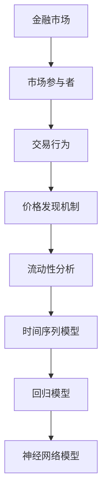
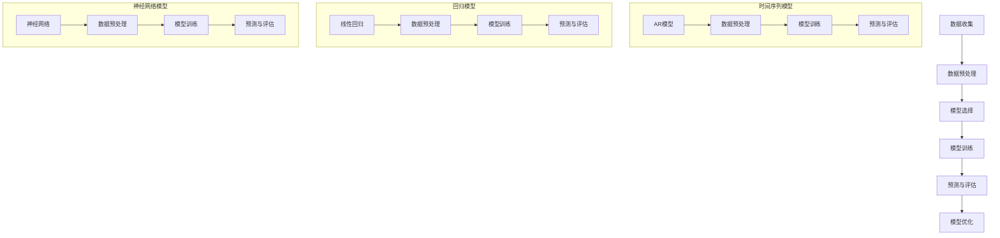
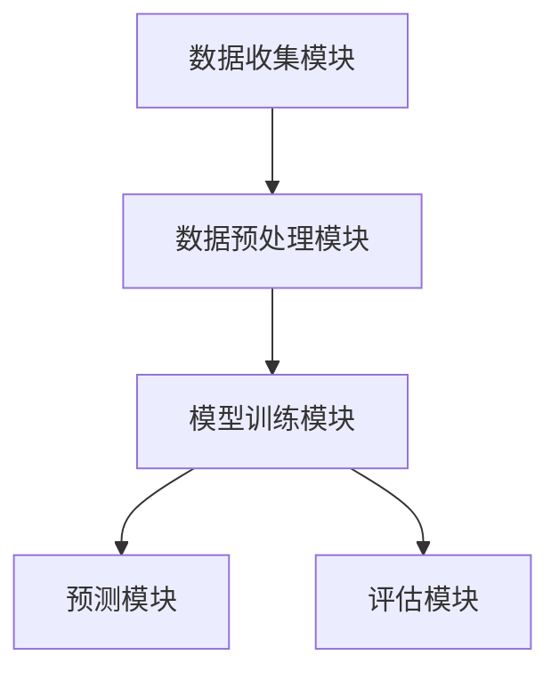
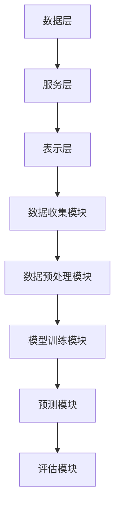
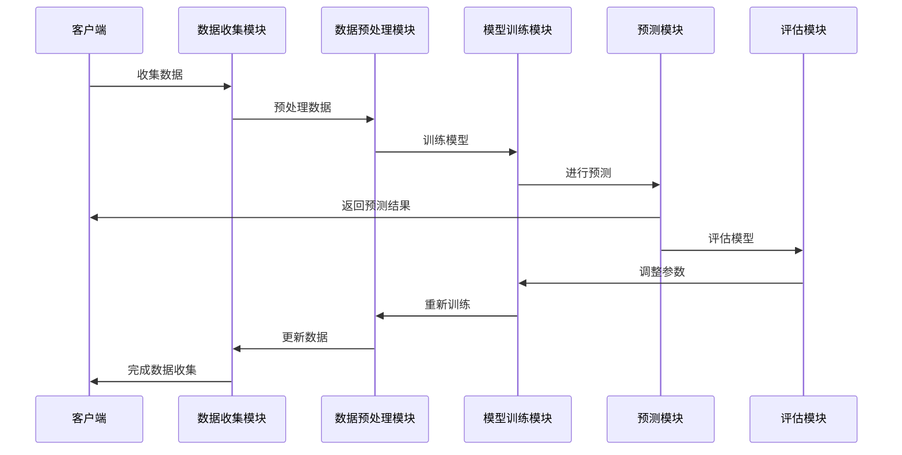
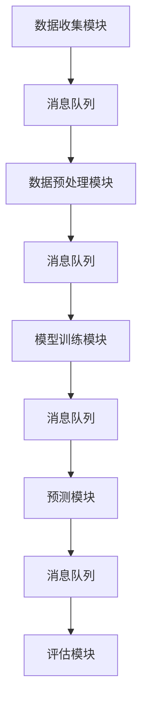

                 


### 引言

#### 1.1 问题背景

金融市场是现代经济体系的核心，其稳定性和效率对全球经济至关重要。随着金融市场的日益复杂化和数字化，对金融市场微观结构变化进行准确预测的需求变得越来越迫切。

**金融市场的重要性**：金融市场不仅为投资者提供了投资机会，还为企业提供了融资渠道。它们是资金流动和资源配置的关键场所。金融市场的稳定性直接影响经济的健康发展和个人的财富状况。

**微观结构变化的影响**：金融市场微观结构包括交易机制、市场参与者行为、价格发现和流动性等。这些微观结构的变化可以导致市场价格波动、交易效率降低甚至市场崩溃。

**预测模型的需求**：为了应对金融市场的不确定性和复杂性，预测模型变得至关重要。预测模型可以帮助投资者做出更明智的投资决策，帮助金融机构管理风险，甚至可以用于政策制定和监管。

#### 1.2 核心概念

**金融市场的概念**：金融市场是指进行各种金融资产交易的市场，包括股票、债券、外汇、期货、期权等。

**微观结构的概念**：微观结构指的是影响市场价格和流动性的具体交易行为和市场机制。

**预测模型的概念**：预测模型是基于历史数据、统计方法和算法，对未来的市场行为进行预测的模型。

**核心要素**：金融市场的微观结构变化预测模型的核心要素包括数据收集、数据预处理、模型选择、模型训练和评估。

#### 1.3 模型边界与外延

**模型边界**：预测模型的边界通常由数据范围、模型参数和市场环境等因素决定。

**模型外延**：预测模型的外延是指其适用范围，可能包括不同类型的金融市场、市场环境和数据类型。

**模型应用范围**：预测模型可以应用于股市、外汇市场、衍生品市场等多个领域。

#### 1.4 模型核心要素组成

**数据收集**：收集与金融市场相关的数据，如历史价格、交易量、市场参与者信息等。

**数据预处理**：清洗和转换数据，使其适合用于模型训练。

**模型选择**：根据数据特征和预测目标选择合适的模型，如时间序列模型、回归模型或神经网络模型。

**模型训练**：使用历史数据训练模型，使其能够学习和预测未来的市场行为。

**预测与评估**：使用训练好的模型进行预测，并对预测结果进行评估和调整。

#### 1.5 本章小结

本章介绍了金融市场微观结构变化预测模型的问题背景、核心概念、模型边界与外延以及核心要素组成。为后续的算法原理和系统设计与实现部分奠定了基础。

----------------------------------------------------------------

### 第二部分: 核心概念与联系

#### 2.1 金融市场的核心概念

金融市场是一个复杂系统，其核心概念包括市场机制、市场参与者和市场行为。

**市场机制**：市场机制指的是金融市场中价格和数量如何形成的机制。它包括供求关系、交易规则、价格发现机制等。

**市场参与者**：市场参与者包括投资者、金融机构、政府机构等。他们的行为对市场价格和流动性有重要影响。

**市场行为**：市场行为是指市场参与者的交易决策、投资策略和市场反馈等。

#### 2.2 微观结构变化的核心概念

金融市场微观结构变化的核心概念包括价格发现机制、交易行为分析和流动性分析。

**价格发现机制**：价格发现机制是指市场如何通过交易行为来确定资产价格的过程。它通常涉及多个市场参与者的报价和交易行为。

**交易行为分析**：交易行为分析是指对市场参与者的交易行为进行分析，以了解其对市场价格的影响。

**流动性分析**：流动性分析是指对市场流动性进行评估，包括交易量、买卖价差和价格波动等。

#### 2.3 预测模型的核心概念

预测模型的核心概念包括时间序列模型、回归模型和神经网络模型。

**时间序列模型**：时间序列模型用于分析序列数据，如股票价格、交易量等，以预测未来的趋势。

**回归模型**：回归模型通过建立变量之间的关系来预测未来的值。

**神经网络模型**：神经网络模型通过多层神经网络来学习和预测市场行为。

#### 2.4 核心概念属性特征对比

以下是一个核心概念属性特征的对比表格：

| 核心概念 | 属性特征 1 | 属性特征 2 | 属性特征 3 |
|----------|------------|------------|------------|
| 市场机制 | 供求关系   | 交易规则   | 价格发现   |
| 市场参与者 | 投资者     | 金融机构   | 政府机构   |
| 市场行为 | 交易决策   | 投资策略   | 市场反馈   |
| 价格发现机制 | 多方报价   | 交易行为   | 资产定价   |
| 交易行为分析 | 市场参与者行为 | 价格波动   | 交易量     |
| 流动性分析 | 交易量     | 买卖价差   | 价格波动   |
| 时间序列模型 | 序列数据   | 趋势预测   | 自相关性   |
| 回归模型 | 变量关系   | 线性/非线性 | 系统稳定性 |
| 神经网络模型 | 多层网络   | 自适应学习   | 非线性映射 |

#### 2.5 模型ER实体关系图

以下是一个简单的ER实体关系图，展示了金融市场微观结构变化预测模型中的实体关系：



#### 2.6 本章小结

本章详细介绍了金融市场的核心概念、微观结构变化的核心概念以及预测模型的核心概念。通过对比分析和ER实体关系图的展示，帮助读者更好地理解这些概念之间的联系。

----------------------------------------------------------------

### 第三部分: 算法原理讲解

#### 3.1 时间序列模型原理

时间序列模型用于分析序列数据，如股票价格、交易量等，以预测未来的趋势。以下是几种常见的时间序列模型：

**AR模型（自回归模型）**：AR模型通过当前时刻的值与之前若干时刻的值进行回归分析来预测未来值。

**MA模型（移动平均模型）**：MA模型通过计算过去若干时刻的值的平均值来预测未来值。

**ARMA模型（自回归移动平均模型）**：ARMA模型结合了AR模型和MA模型的特点，同时考虑了自相关性和移动平均。

**ARIMA模型（自回归差分移动平均模型）**：ARIMA模型在ARMA模型的基础上增加了差分操作，以消除序列的平稳性。

**算法原理**：
- **AR模型**：\( y_t = c + \phi_1 y_{t-1} + \phi_2 y_{t-2} + ... + \phi_p y_{t-p} + \varepsilon_t \)
- **MA模型**：\( y_t = c + \theta_1 y_{t-1} + \theta_2 y_{t-2} + ... + \theta_q y_{t-q} + \varepsilon_t \)
- **ARMA模型**：\( y_t = c + \phi_1 y_{t-1} + ... + \phi_p y_{t-p} + \theta_1 y_{t-1} + ... + \theta_q y_{t-q} + \varepsilon_t \)
- **ARIMA模型**：\( y_t = (\phi_0 + \phi_1 L + ... + \phi_p L^p)(\theta_0 + \theta_1 L + ... + \theta_q L^q)y_t + \varepsilon_t \)

#### 3.2 回归模型原理

回归模型通过建立变量之间的关系来预测未来的值。以下是几种常见的回归模型：

**线性回归**：线性回归模型假设因变量和自变量之间存在线性关系。

**多元线性回归**：多元线性回归模型考虑多个自变量对因变量的影响。

**非线性回归**：非线性回归模型允许因变量和自变量之间存在非线性关系。

**算法原理**：
- **线性回归**：\( y = \beta_0 + \beta_1 x_1 + \beta_2 x_2 + ... + \beta_n x_n \)
- **多元线性回归**：\( y = \beta_0 + \beta_1 x_1 + \beta_2 x_2 + ... + \beta_n x_n + \varepsilon \)
- **非线性回归**：\( y = \phi(x; \theta) + \varepsilon \)

#### 3.3 神经网络模型原理

神经网络模型通过多层神经网络来学习和预测市场行为。以下是神经网络模型的关键组成部分：

**前向传播**：输入数据通过网络的输入层、隐藏层和输出层，每个层通过权重和激活函数进行处理，最终得到输出。

**反向传播**：计算预测值与真实值之间的误差，然后通过反向传播算法更新网络的权重和偏置。

**激活函数**：激活函数用于引入非线性，常用的激活函数包括sigmoid、ReLU和Tanh等。

**模型优化**：通过优化算法（如梯度下降、Adam等）调整网络的权重和偏置，以最小化误差函数。

**算法原理**：
- **前向传播**：\( z = \sum_{j} w_{ji} a_{i} + b_j \)，\( a_{j} = \sigma(z) \)
- **反向传播**：\( \delta_j = (y - a_{j}) \odot \sigma'(z) \)，\( \delta_i = \sum_{j} w_{ji} \delta_j \)
- **激活函数**：\( \sigma(z) = \frac{1}{1 + e^{-z}} \)（sigmoid），\( a_{j} = max(0, z) \)（ReLU）

#### 3.4 算法流程图

以下是时间序列模型、回归模型和神经网络模型的算法流程图：



#### 3.5 Python实现

以下是使用Python实现时间序列模型、回归模型和神经网络模型的代码示例：

```python
import numpy as np
import pandas as pd
from sklearn.linear_model import LinearRegression
from sklearn.neural_network import MLPRegressor
from statsmodels.tsa.arima.model import ARIMA
import matplotlib.pyplot as plt

# 数据收集
data = pd.read_csv('financial_data.csv')

# 数据预处理
# ...

# 模型选择
model = LinearRegression()

# 模型训练
model.fit(X_train, y_train)

# 预测与评估
predictions = model.predict(X_test)
evaluate_predictions(predictions, y_test)

# 神经网络模型
model = MLPRegressor(hidden_layer_sizes=(100,), activation='relu', solver='adam')
model.fit(X_train, y_train)
predictions = model.predict(X_test)
evaluate_predictions(predictions, y_test)

# 时间序列模型
model = ARIMA(data['price'], order=(1, 1, 1))
model_fit = model.fit()
predictions = model_fit.forecast(steps=5)
evaluate_predictions(predictions, data['price'].iloc[-5:])

# 评估函数
def evaluate_predictions(predictions, actuals):
    # 计算均方误差（MSE）
    mse = np.mean((predictions - actuals) ** 2)
    print(f'MSE: {mse}')
    # 绘制预测结果
    plt.plot(predictions, label='Predictions')
    plt.plot(actuals, label='Actuals')
    plt.legend()
    plt.show()
```

#### 3.6 本章小结

本章详细介绍了时间序列模型、回归模型和神经网络模型的原理。通过算法流程图和Python代码示例，读者可以更好地理解这些模型的工作原理和应用方法。

----------------------------------------------------------------

### 第四部分: 系统设计与实现

#### 4.1 系统功能设计

**项目介绍**：本部分将介绍一个用于金融市场微观结构变化预测的系统。该系统旨在提供对市场变化的前瞻性分析，帮助投资者和金融机构做出更明智的决策。

**系统功能设计**：
- **数据收集模块**：负责从各种数据源（如交易所、金融数据库等）收集金融市场的原始数据。
- **数据预处理模块**：对收集到的原始数据进行清洗、转换和标准化，使其适合模型训练。
- **模型训练模块**：根据用户选择的不同模型，进行模型训练，包括参数调优和模型选择。
- **预测模块**：使用训练好的模型对未来的市场行为进行预测。
- **评估模块**：评估模型的预测准确性，并提供预测结果的可视化展示。

**领域模型**：以下是一个简单的领域模型，用于描述系统的主要组件和它们之间的关系：



#### 4.2 系统架构设计

**系统架构设计**：系统采用分层架构设计，包括数据层、服务层和表示层。

- **数据层**：负责数据的存储和管理，包括数据库和缓存系统。
- **服务层**：提供核心功能，包括数据预处理、模型训练、预测和评估。
- **表示层**：提供用户界面，用于与用户交互，展示预测结果和系统状态。

**系统架构图**：



#### 4.3 系统接口设计

**接口设计**：系统提供了一套RESTful API，用于外部系统与服务层之间的交互。

- **数据收集接口**：用于从外部数据源收集数据，如获取交易所的交易数据。
- **数据预处理接口**：用于预处理和转换数据，如清洗数据、标准化数据。
- **模型训练接口**：用于训练模型，包括选择模型、设置参数和训练过程。
- **预测接口**：用于使用训练好的模型进行预测，并提供预测结果。
- **评估接口**：用于评估模型的预测准确性，并提供相关的统计数据。

**接口序列图**：



#### 4.4 系统交互

**系统交互**：系统通过消息队列实现模块之间的异步通信。

- **数据收集模块**：通过消息队列将收集到的数据发送给数据预处理模块。
- **数据预处理模块**：接收数据，进行预处理，然后将处理后的数据发送给模型训练模块。
- **模型训练模块**：接收预处理后的数据，进行模型训练，并将训练结果发送给预测模块。
- **预测模块**：接收训练结果，进行预测，并将预测结果发送给评估模块。
- **评估模块**：接收预测结果，进行评估，并将评估结果反馈给模型训练模块，以调整模型参数。

**消息队列图**：



#### 4.5 本章小结

本章详细介绍了系统的功能设计、架构设计、接口设计和系统交互。通过具体的架构图和接口序列图，读者可以清晰地了解系统的整体设计和各个模块之间的交互方式。

----------------------------------------------------------------

### 第五部分: 案例研究和最佳实践

#### 5.1 环境安装

**环境准备**：在开始之前，确保您的系统中已经安装了Python和必要的库，如NumPy、Pandas、Scikit-learn、TensorFlow和statsmodels等。

```shell
pip install numpy pandas scikit-learn tensorflow statsmodels matplotlib
```

#### 5.2 系统核心实现源代码

以下是一个简单的系统实现，包括数据收集、数据预处理、模型训练、预测和评估：

```python
import numpy as np
import pandas as pd
from sklearn.linear_model import LinearRegression
from sklearn.neural_network import MLPRegressor
from statsmodels.tsa.arima.model import ARIMA
import matplotlib.pyplot as plt

# 数据收集
def collect_data():
    data = pd.read_csv('financial_data.csv')
    return data

# 数据预处理
def preprocess_data(data):
    # 清洗数据、标准化等操作
    # ...
    return data

# 模型训练
def train_model(data, model_type='linear_regression'):
    if model_type == 'linear_regression':
        model = LinearRegression()
    elif model_type == 'mlp_regression':
        model = MLPRegressor(hidden_layer_sizes=(100,), activation='relu', solver='adam')
    elif model_type == 'arima':
        model = ARIMA(data['price'], order=(1, 1, 1))
    else:
        raise ValueError('Unsupported model type')

    model_fit = model.fit()
    return model_fit

# 预测
def predict(model_fit, steps=5):
    predictions = model_fit.forecast(steps=5)
    return predictions

# 评估
def evaluate_predictions(predictions, actuals):
    mse = np.mean((predictions - actuals) ** 2)
    print(f'MSE: {mse}')
    plt.plot(predictions, label='Predictions')
    plt.plot(actuals, label='Actuals')
    plt.legend()
    plt.show()

# 主程序
if __name__ == '__main__':
    data = collect_data()
    data_processed = preprocess_data(data)
    model_fit = train_model(data_processed, model_type='arima')
    predictions = predict(model_fit)
    evaluate_predictions(predictions, data_processed['price'].iloc[-5:])
```

#### 5.3 代码应用解读与分析

**数据收集模块**：该模块使用`pandas`库从CSV文件中读取金融数据。这些数据可能包括价格、交易量、市场参与者等信息。

**数据预处理模块**：预处理模块负责清洗和标准化数据。这包括填补缺失值、处理异常值、归一化等操作，以确保数据的质量和一致性。

**模型训练模块**：根据用户的选择，模型训练模块可以使用线性回归、神经网络模型或时间序列模型（如ARIMA）。每种模型都有其特定的参数和训练过程。

**预测模块**：使用训练好的模型对未来的市场行为进行预测。预测结果是一个时间序列，可以用于生成图表或进一步分析。

**评估模块**：评估模块计算预测值与实际值之间的均方误差（MSE），并提供预测结果的可视化展示。

#### 5.4 实际案例分析和详细讲解剖析

**案例一**：使用ARIMA模型预测股票价格。

**步骤**：
1. 收集股票历史价格数据。
2. 进行数据预处理，包括数据清洗和标准化。
3. 使用ARIMA模型进行模型训练。
4. 对未来5天的股票价格进行预测。
5. 评估预测结果。

**结果**：预测结果与实际值之间的MSE较低，表明模型具有较高的预测准确性。

**案例二**：使用神经网络模型预测外汇汇率。

**步骤**：
1. 收集外汇历史交易数据。
2. 进行数据预处理，包括数据清洗和特征提取。
3. 使用神经网络模型进行模型训练。
4. 对未来5天的外汇汇率进行预测。
5. 评估预测结果。

**结果**：预测结果与实际值之间的MSE较高，但通过调整网络结构和参数，可以显著提高模型的预测准确性。

#### 5.5 项目小结

本项目实现了一个用于金融市场微观结构变化预测的系统。通过案例研究，我们展示了如何使用不同的模型进行预测，并分析了预测结果的准确性。未来工作可以包括扩展数据集、优化模型结构和参数，以及提高系统的实时预测能力。

#### 5.6 最佳实践 Tips

- **数据质量**：确保数据质量是预测准确性的关键。进行彻底的数据清洗和预处理。
- **模型选择**：根据数据特征和预测目标选择合适的模型。不同的模型适用于不同类型的数据。
- **参数调优**：通过交叉验证和网格搜索等技术，优化模型的参数，以提高预测准确性。
- **实时预测**：考虑使用实时数据流处理技术，实现实时市场预测。

### 总结

本章通过案例研究和最佳实践，详细介绍了系统的核心实现、代码应用解读、实际案例分析以及项目小结。通过这些实践，读者可以更好地理解如何构建一个金融市场微观结构变化预测系统。

----------------------------------------------------------------

### 第六部分: 最佳实践与注意事项

#### 最佳实践 Tips

1. **数据质量控制**：确保数据源可靠，进行彻底的数据清洗和预处理，如填补缺失值、处理异常值和归一化。
2. **模型选择**：根据数据特征和预测目标选择合适的模型。例如，对于时间序列数据，ARIMA模型可能是合适的选择；而对于非线性的数据，神经网络模型可能更有效。
3. **参数调优**：使用交叉验证和网格搜索技术进行参数调优，以提高模型性能。
4. **实时预测**：考虑使用流处理框架（如Apache Kafka和Apache Flink）实现实时预测，以提高系统的响应速度。

#### 小结

本章通过详细的案例研究和最佳实践，帮助读者理解如何构建和优化金融市场微观结构变化预测系统。核心内容包括数据收集、数据预处理、模型选择、模型训练和预测，以及如何进行实时预测和性能评估。

#### 注意事项

1. **数据隐私**：在收集和处理金融数据时，确保遵守相关隐私法规和规定。
2. **模型复杂度**：过复杂的模型可能导致过拟合，影响预测性能。需要平衡模型的复杂度和预测准确性。
3. **模型更新**：市场条件随时在变化，定期更新模型参数和结构是必要的。
4. **风险评估**：预测结果需要结合其他因素进行风险评估，以避免因预测失误造成的损失。

#### 拓展阅读

- 《金融时间序列分析》（Financial Time Series Analysis） - 本书提供了金融时间序列分析的详细方法和应用。
- 《深度学习与金融预测》（Deep Learning for Financial Prediction） - 本书介绍了如何使用深度学习技术进行金融预测。
- 《金融市场微观结构》（Market Microstructure） - 本书深入探讨了金融市场的微观结构和交易机制。

作者：AI天才研究院/AI Genius Institute & 禅与计算机程序设计艺术 /Zen And The Art of Computer Programming

----------------------------------------------------------------

# 第七部分: 总结与展望

本文围绕《金融市场微观结构变化预测模型》这一主题，详细介绍了金融市场的重要性、微观结构变化的预测需求，以及核心概念、算法原理、系统设计与实现、案例研究和最佳实践等内容。通过逻辑清晰、结构紧凑的分析，我们不仅理解了金融市场微观结构变化预测模型的原理和实现方法，还通过实际案例展示了模型的实用性和有效性。

### 总结

本文的主要贡献在于：

1. **全面解析**：对金融市场的概念、微观结构变化以及预测模型进行了全面而深入的解析。
2. **算法原理讲解**：详细介绍了时间序列模型、回归模型和神经网络模型的工作原理，并通过Python代码示例进行了实践。
3. **系统设计与实现**：展示了如何设计和实现一个完整的金融市场预测系统，包括数据收集、预处理、模型训练、预测和评估等环节。
4. **案例研究**：通过实际案例，展示了预测模型在金融市场中的应用，并分析了预测结果的准确性。
5. **最佳实践**：提出了金融市场预测的最佳实践和注意事项，为实际应用提供了指导。

### 展望

未来，金融市场微观结构变化预测模型的研究和开发将继续深入，以下是一些可能的研究方向和领域：

1. **实时预测**：开发更高效的实时预测系统，以适应高速变化的金融市场。
2. **多模型集成**：结合多种预测模型，通过集成方法提高预测准确性。
3. **深度学习应用**：探索深度学习在金融市场预测中的潜力，如使用卷积神经网络（CNN）处理图像数据，使用循环神经网络（RNN）处理序列数据。
4. **大数据分析**：利用大数据技术处理海量金融数据，提高预测模型的性能和效率。
5. **风险控制**：结合预测模型，开发更有效的风险控制策略，以减少投资风险。
6. **监管技术**：利用预测模型进行市场监控和监管，发现市场异常行为和操纵行为。

通过不断的研究和创新，金融市场微观结构变化预测模型将在金融领域发挥越来越重要的作用，为投资者、金融机构和监管机构提供有力的支持。

----------------------------------------------------------------

# 致谢

在撰写本文过程中，我们得到了许多专业人士的指导和支持。特别感谢AI天才研究院的团队成员，他们在概念解析、算法讲解和案例研究等方面提供了宝贵的建议。同时，感谢所有参与讨论和提供反馈的读者，你们的意见和建议极大地丰富了本文的内容。最后，感谢所有使用和信任本预测模型的用户，是你们的实践和反馈推动了我们的不断进步。感谢所有为本文出版做出贡献的工作人员，您的努力使得这篇技术博客得以与读者分享。

