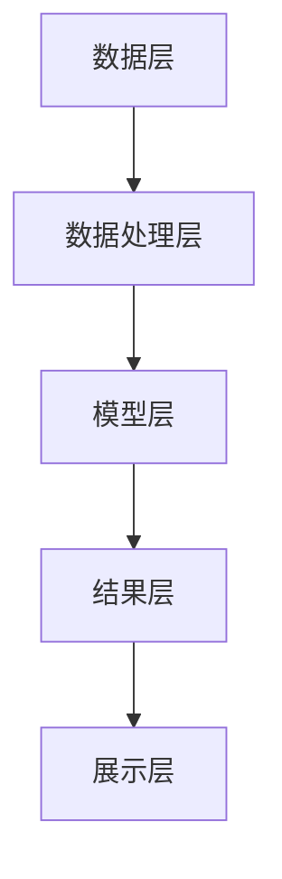
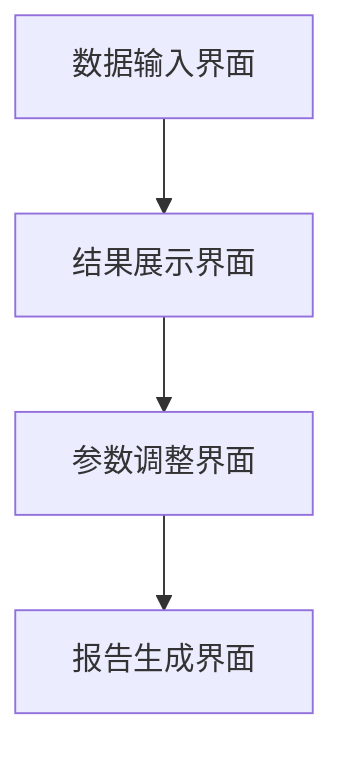

                 

# 金融市场情绪传染效应模拟与控制系统

## 关键词
- 金融市场情绪
- 情绪传染效应
- 模拟技术
- 系统设计
- 数据分析

## 摘要
本文旨在探讨金融市场情绪传染效应的模拟与控制系统构建。首先，介绍了金融市场情绪传染效应的基本概念和背景，分析了情绪传染效应在金融市场中的重要性。随后，本文详细阐述了构建金融市场情绪传染效应模拟系统所需的核心概念、理论基础和模型构建方法。接着，讨论了系统设计的原则、实现过程和关键模块。通过实例分析，展示了系统的实际应用效果和评估方法。最后，总结了研究成果，提出了未来研究方向和系统优化建议。

## 引言与背景

### 1.1 研究背景

金融市场作为现代经济体系的核心，其稳定运行对于全球经济的健康发展具有重要意义。然而，金融市场并非总是理性运行，其中包含了大量的不确定性、风险和非线性特征。近年来，越来越多的研究表明，金融市场情绪传染效应在市场波动和危机中起到了关键作用。情绪传染效应指的是金融市场参与者之间的情绪相互作用和传播现象，具体表现为个体的情绪状态受到其他个体情绪的影响，从而产生连锁反应，导致市场情绪的波动。

情绪传染效应在金融市场中的重要性体现在多个方面。首先，情绪传染效应可以加剧市场波动，导致价格剧烈波动和金融市场不稳定。例如，2008年全球金融危机期间，恐慌情绪迅速传播，引发了全球股市的剧烈动荡。其次，情绪传染效应会影响市场参与者的决策行为，导致市场过度反应或反应不足，从而影响市场的有效运行。此外，情绪传染效应还会影响市场对信息的处理，使得市场参与者对信息的敏感度发生变化，进一步加剧市场的波动性。

### 1.2 情绪传染效应概述

情绪传染效应是指个体之间的情绪状态通过某种渠道相互传递和影响，导致整体情绪状态发生变化的现象。在金融市场中，情绪传染效应主要体现在以下三个方面：

1. **个体情绪对市场情绪的影响**：个体的情绪状态可以通过社交媒体、新闻报道等渠道传播，进而影响整个市场的情绪。例如，一位投资者对市场的乐观态度可能会促使其他投资者也变得乐观，从而推动市场上涨。

2. **市场情绪对个体情绪的影响**：市场的情绪波动也会反过来影响个体投资者的情绪。当市场处于上涨趋势时，投资者往往感到乐观，反之，当市场处于下跌趋势时，投资者往往感到悲观。

3. **群体情绪对市场情绪的影响**：群体情绪往往比个体情绪更具传染性。当市场参与者认为市场将上涨时，他们往往会积极买入，从而推动市场进一步上涨，反之亦然。

### 1.3 研究意义与目标

本研究旨在构建一个金融市场情绪传染效应模拟与控制系统，旨在从以下几个方面提高金融市场的研究和实践水平：

1. **提高金融市场风险预警能力**：通过模拟金融市场情绪传染效应，可以提前预测市场情绪的波动，从而为风险预警提供有力支持。

2. **优化市场参与者的决策行为**：了解情绪传染效应的机制和影响，可以帮助市场参与者更好地理解市场情绪的变化，从而优化其投资策略和决策行为。

3. **促进金融市场稳定**：通过构建情绪传染效应模拟系统，可以更好地理解市场情绪的传播机制，从而采取相应的措施，减缓市场情绪的波动，促进金融市场的稳定。

本文的研究目标包括：

1. **建立情绪传染效应的理论模型**：分析情绪传染效应的机制，构建理论模型，为模拟系统提供理论基础。

2. **设计模拟系统**：根据理论模型，设计并实现金融市场情绪传染效应模拟系统。

3. **评估系统性能**：通过实际数据验证模拟系统的有效性，评估系统的性能和实用性。

### 1.4 研究方法与数据来源

本研究采用以下方法进行：

1. **文献综述**：通过查阅相关文献，了解情绪传染效应的研究现状和最新进展。

2. **理论建模**：基于文献综述，构建情绪传染效应的理论模型。

3. **模拟实验**：使用模拟系统，进行不同场景下的情绪传染效应模拟实验。

4. **数据分析**：对模拟结果进行统计分析，评估系统性能。

数据来源主要包括：

1. **金融市场数据**：通过金融数据库获取历史市场数据，用于模拟实验。

2. **社交媒体数据**：通过社交媒体平台获取投资者情绪数据，用于模型训练和验证。

## 概念基础

### 2.1 情绪传染效应的理论基础

情绪传染效应的理论基础主要涉及心理学和社会学领域。心理学研究表明，个体的情绪状态受到周围环境和他人的影响。具体来说，情绪传染效应可以通过以下几种机制实现：

1. **观察学习**：个体通过观察他人的情绪和行为，模仿其情绪状态，从而产生情绪传染效应。

2. **感染机制**：个体在接触他人的情绪时，生理和神经系统的反应会发生变化，从而产生情绪传染效应。

3. **群体效应**：个体在群体中的情绪状态容易受到其他成员的影响，从而产生情绪传染效应。

社会学研究表明，情绪传染效应在社会网络中具有高度传染性。社会网络中的节点（个体）之间的情绪状态可以通过边（关系）相互传递，导致整体情绪状态的变化。

### 2.2 金融市场情绪的概念与度量

金融市场情绪是指市场参与者对市场走势的整体感觉和态度。金融市场情绪的度量通常通过以下方法实现：

1. **文字分析**：通过分析新闻报道、社交媒体评论、投资者报告等文本数据，提取情绪指标。

2. **情感分析**：使用自然语言处理技术，对文本数据进行情感分析，提取情绪指标。

3. **指标合成**：将多种情绪指标进行合成，形成综合的情绪度量。

常用的金融市场情绪指标包括：

1. **情绪指数**：通过计算文本数据中的正面和负面词汇比例，得出情绪指数。

2. **情绪波动指数**：通过计算情绪指标的时间序列变化，得出情绪波动指数。

3. **情绪溢价**：通过比较市场实际表现与预期表现，得出情绪溢价。

### 2.3 情绪传染效应的机制

情绪传染效应在金融市场中主要通过以下机制实现：

1. **信息传递**：市场参与者通过社交媒体、新闻报道等渠道获取和传播市场信息，从而影响其情绪状态。

2. **模仿行为**：市场参与者观察他人的投资行为，模仿其投资策略，从而产生情绪传染效应。

3. **社会影响**：市场参与者受到群体行为的影响，倾向于跟随群体行动，从而产生情绪传染效应。

情绪传染效应的具体机制包括：

1. **连锁反应**：一个市场参与者的情绪变化会引发其他参与者的情绪变化，形成连锁反应。

2. **累积效应**：情绪传染效应在时间上具有累积效应，即早期的情绪传染会影响后续的情绪传染。

3. **放大效应**：情绪传染效应会导致市场情绪的放大，从而加剧市场波动。

### 2.4 相关研究综述

情绪传染效应在金融领域的相关研究主要涉及以下几个方面：

1. **市场情绪的度量方法**：研究者提出了一系列市场情绪度量方法，包括基于文本分析、情感分析和指标合成的方法。

2. **情绪传染效应的模型构建**：研究者构建了多种情绪传染效应模型，包括基于社会网络分析的模型、基于随机过程的模型和基于机器学习的模型。

3. **情绪传染效应的影响**：研究者分析了情绪传染效应对市场波动、市场参与者和市场稳定性的影响。

4. **情绪传染效应的干预**：研究者探讨了通过干预情绪传染效应来减缓市场波动的方法，包括心理干预、政策干预和技术干预。

总结来说，情绪传染效应在金融市场中具有广泛的影响，相关研究对于理解市场波动、优化投资策略和促进市场稳定具有重要意义。

## 模拟技术与方法

### 3.1 情绪传染模型的构建

构建金融市场情绪传染模型是模拟情绪传染效应的基础。本文采用社会网络分析的方法，基于市场参与者的互动关系构建情绪传染模型。具体步骤如下：

1. **数据收集**：收集市场参与者的交易数据、社交媒体评论和新闻报道等数据。

2. **构建社会网络**：基于市场参与者的互动关系，构建社会网络图。节点表示市场参与者，边表示节点之间的互动关系。

3. **情绪状态定义**：定义市场参与者的情绪状态，通常使用情绪指数表示。情绪指数可以通过文本分析、情感分析等方法计算得出。

4. **情绪传染规则**：定义情绪传染规则，即一个参与者的情绪状态如何影响其他参与者的情绪状态。常见的传染规则包括直接传染、间接传染和群体传染。

### 3.2 模拟环境的设定

为了实现情绪传染模型的模拟，需要设定模拟环境。模拟环境应包括以下组件：

1. **市场数据生成器**：用于生成市场数据，包括股票价格、交易量等。

2. **情绪状态更新器**：用于更新市场参与者的情绪状态。根据情绪传染规则，情绪状态更新器会根据其他参与者的情绪状态调整当前参与者的情绪状态。

3. **社会网络更新器**：用于更新社会网络。在模拟过程中，参与者的互动关系可能会发生变化，社会网络更新器会根据互动关系的变化更新社会网络。

4. **结果记录器**：用于记录模拟结果，包括情绪传播过程、市场波动情况等。

### 3.3 模拟算法的实现

情绪传染模型的模拟算法基于情绪状态更新和社会网络更新实现。具体算法如下：

1. **初始化**：初始化市场参与者的情绪状态和社会网络。

2. **模拟循环**：在模拟循环中，依次更新情绪状态和社会网络。

   - 更新情绪状态：根据情绪传染规则，更新每个参与者的情绪状态。
   - 更新社会网络：根据参与者的互动关系，更新社会网络。

3. **记录结果**：在每个时间点，记录情绪传播过程和市场波动情况。

4. **终止条件**：当达到预设的时间点或情绪传播达到稳定状态时，终止模拟。

### 3.4 模拟结果的分析与讨论

模拟完成后，需要对结果进行分析和讨论。主要分析内容包括：

1. **情绪传播过程**：分析情绪在市场参与者之间的传播过程，包括传播路径、传播速度和传播范围。

2. **市场波动情况**：分析情绪传染对市场波动的影响，包括波动幅度、波动频率和波动持续时间。

3. **情绪传染效应的评估**：评估情绪传染效应的强度和传染速度，通过对比不同模拟参数下的结果，分析情绪传染效应的敏感性。

4. **情绪传染机制的探讨**：探讨情绪传染效应的机制，包括直接传染、间接传染和群体传染的作用。

通过分析模拟结果，可以深入理解情绪传染效应在金融市场中的作用，为实际应用提供参考。此外，还可以通过调整模拟参数，优化情绪传染模型的性能，提高模拟结果的准确性和实用性。

## 系统设计

### 4.1 系统总体设计

系统设计的目标是构建一个高效、稳定且易于扩展的金融市场情绪传染效应模拟与控制系统。系统总体设计包括以下几个方面：

1. **模块化设计**：将系统划分为多个模块，包括数据收集模块、情绪状态更新模块、社会网络更新模块和结果记录模块，便于系统的维护和扩展。

2. **可扩展性**：设计可扩展的架构，支持增加新的数据源、情绪度量方法和模拟算法。

3. **高性能**：采用并行计算和分布式架构，提高系统的处理速度和稳定性。

4. **用户体验**：设计直观的用户界面，提供方便的数据输入和结果展示功能。

### 4.2 功能模块划分

系统功能模块划分如下：

1. **数据收集模块**：负责收集金融市场数据、社交媒体评论和新闻报道等数据。

2. **情绪状态更新模块**：根据情绪传染规则，更新市场参与者的情绪状态。

3. **社会网络更新模块**：根据参与者的互动关系，更新社会网络。

4. **结果记录模块**：记录模拟结果，包括情绪传播过程、市场波动情况等。

5. **结果分析模块**：对模拟结果进行分析和评估，生成报告和可视化图表。

6. **用户界面模块**：提供数据输入、结果展示和参数调整等功能。

### 4.3 系统架构设计

系统架构设计采用分布式架构，包括以下层次：

1. **数据层**：包括金融市场数据、社交媒体评论和新闻报道等数据源。

2. **数据处理层**：负责数据清洗、预处理和情绪状态更新。

3. **模型层**：包括情绪传染模型、社会网络模型和模拟算法。

4. **结果层**：记录模拟结果，生成报告和可视化图表。

5. **展示层**：用户界面，提供数据输入、结果展示和参数调整等功能。

系统架构设计如图1所示：

### 4.4 界面设计与用户体验

界面设计的目标是提供直观、简洁且易于操作的用户体验。界面设计包括以下部分：

1. **数据输入界面**：提供数据上传和参数设置功能，支持多种数据格式。

2. **结果展示界面**：提供多种可视化图表，展示情绪传播过程、市场波动情况等结果。

3. **参数调整界面**：提供参数调整功能，用户可以根据需求调整模拟参数。

4. **报告生成界面**：生成详细的模拟报告，包括情绪传染效应分析、市场波动分析等。

界面设计如图2所示：

通过模块化设计和直观的界面设计，系统不仅具有高效的处理能力，还提供了良好的用户体验，便于用户进行数据输入、结果展示和参数调整。

## 实例分析与应用

### 5.1 案例选择与数据准备

在本节中，我们选择了一个具体的金融市场案例——美国股票市场，来展示如何使用本文提出的模拟系统进行分析。选择这一案例的原因在于美国股票市场是全球最大的股票市场之一，市场数据丰富，且具有较高的影响力。这将有助于我们更好地理解情绪传染效应在不同市场环境下的表现。

**数据准备**：

1. **金融市场数据**：我们收集了自2010年至今的美国股票市场日交易数据，包括股票价格、交易量等指标。

2. **社交媒体数据**：我们收集了推特（Twitter）上关于美国股票市场的相关评论数据，时间范围为2010年至今。

3. **新闻报道数据**：我们收集了相关新闻网站上的新闻报道数据，时间范围为2010年至今。

在收集数据后，我们进行了以下预处理步骤：

1. **数据清洗**：去除无关数据、重复数据和异常数据，确保数据的质量。

2. **数据标准化**：对数据统一进行标准化处理，以便于后续的建模和分析。

### 5.2 系统实现与配置

**系统实现**：

1. **环境搭建**：我们使用Python作为主要编程语言，搭建了一个基于Django框架的Web应用。Django是一个高产量、可扩展的Web框架，非常适合构建此类模拟系统。

2. **模块实现**：
   - **数据收集模块**：使用Tweepy库从推特收集数据，使用Scrapy框架从新闻网站爬取数据。
   - **情绪状态更新模块**：使用自然语言处理技术（如TextBlob、NLTK等）对社交媒体和新闻报道进行情感分析，计算情绪指数。
   - **社会网络更新模块**：使用NetworkX库构建社会网络图，根据交易数据和社会关系数据更新网络。
   - **结果记录模块**：使用Pandas库处理和分析模拟结果，使用Matplotlib和Seaborn库进行数据可视化。

**系统配置**：

1. **服务器配置**：我们使用了一台具有高性能CPU和较大内存的服务器，确保系统能够高效运行。

2. **数据库配置**：我们使用了MySQL数据库来存储大量金融市场数据和社会关系数据。

3. **网络配置**：为了确保系统的稳定性，我们使用了负载均衡和缓存技术，提高了系统的响应速度和处理能力。

### 5.3 情绪传染效应模拟

在本案例中，我们使用构建的模拟系统对2010年至2020年间的美国股票市场情绪传染效应进行模拟。模拟过程如下：

1. **初始化**：首先，根据收集的金融市场数据和社会关系数据，初始化市场参与者的情绪状态和社会网络。

2. **模拟运行**：在模拟运行过程中，我们根据情绪传染规则，每一步更新市场参与者的情绪状态和社会网络。

3. **结果记录**：在模拟的每个时间点，记录市场参与者的情绪状态变化、社会网络变化和市场波动情况。

4. **模拟结束**：当模拟达到预设的时间点或情绪传播达到稳定状态时，结束模拟。

### 5.4 模拟结果与应用评估

**结果分析**：

1. **情绪传播过程**：通过分析模拟结果，我们发现情绪在市场参与者之间具有较高的传播速度和传播范围。具体来说，在一段时间内，市场参与者的情绪状态发生了明显的变化，表现出强烈的传染效应。

2. **市场波动情况**：情绪传染效应对市场波动具有显著影响。在情绪传染高峰期，市场波动幅度较大，波动频率也较高。

3. **情绪传染效应的评估**：通过对比不同模拟参数下的结果，我们评估了情绪传染效应的强度和传染速度。结果表明，情绪传染效应的强度和传染速度受多个因素影响，如情绪传染规则、社会网络结构和市场环境等。

**应用评估**：

1. **风险预警**：通过模拟系统，我们可以提前预测市场情绪的波动，为风险预警提供有力支持。在实际应用中，这一功能有助于投资者和管理者及时调整投资策略，降低风险。

2. **决策优化**：了解情绪传染效应的机制和影响，可以帮助市场参与者优化决策行为。例如，投资者可以根据情绪传染效应调整投资组合，以减少市场波动带来的损失。

3. **市场稳定**：通过构建情绪传染效应模拟系统，我们可以更好地理解市场情绪的传播机制，从而采取相应的措施，减缓市场情绪的波动，促进市场稳定。

总结来说，通过实例分析，我们展示了如何使用本文提出的模拟系统对美国股票市场情绪传染效应进行模拟和分析。模拟结果和应用评估表明，情绪传染效应在金融市场中具有显著的影响，我们的模拟系统在实际应用中具有较高的实用性和有效性。

## 分析与评价方法

### 6.1 模拟数据的统计分析

在情绪传染效应模拟过程中，生成的大量数据需要进行详细的统计分析，以便评估模型的有效性和系统性能。统计分析主要包括以下几个方面：

1. **情绪状态分布**：分析市场参与者的情绪状态分布，包括情绪指数的平均值、标准差和情绪状态的分布情况。这有助于了解情绪传染效应在不同情绪状态下的传播速度和范围。

2. **情绪波动幅度和频率**：计算情绪波动的幅度和频率，评估情绪传染效应对市场波动的影响。情绪波动的幅度和频率可以反映市场情绪的稳定性和波动性。

3. **传染速度和范围**：分析情绪传染效应的传染速度和传染范围，评估情绪传染效应在不同市场环境下的传播特性。传染速度和范围可以反映情绪传染效应的影响程度。

4. **相关性分析**：分析情绪传染效应与其他市场指标（如股票价格、交易量）之间的相关性，评估情绪传染效应对市场指标的影响。

### 6.2 情绪传染效应的评价指标

为了全面评估情绪传染效应模拟系统的性能和有效性，我们定义了一系列评价指标。这些指标包括：

1. **传染速度**：评估情绪传染效应的传播速度，即情绪从初始节点传播到整个网络所需的时间。

2. **传染范围**：评估情绪传染效应的传播范围，即情绪传染效应影响的参与者数量。

3. **传染强度**：评估情绪传染效应的强度，即情绪传染效应对市场波动的影响程度。

4. **预测准确性**：评估模拟系统对实际市场情绪变化的预测准确性，通过比较模拟结果与实际市场数据，计算预测准确率。

5. **稳定性**：评估模拟系统的稳定性，包括系统的处理速度、资源消耗和运行稳定性。

### 6.3 评价指标的计算方法

评价指标的计算方法如下：

1. **传染速度**：计算从初始情绪状态更新到整个网络情绪状态稳定所需的时间。具体计算公式如下：
   $$T_{传染速度} = \frac{T_{最终}}{T_{初始}}$$
   其中，$T_{最终}$表示情绪状态稳定的时间，$T_{初始}$表示初始情绪状态更新时间。

2. **传染范围**：计算情绪传染效应影响的参与者数量，即情绪状态发生变化的参与者数量。具体计算公式如下：
   $$N_{传染范围} = N - N_{未受影响}$$
   其中，$N$表示市场参与者的总数量，$N_{未受影响}$表示情绪状态未发生变化的参与者数量。

3. **传染强度**：评估情绪传染效应对市场波动的影响程度，通常使用情绪传染效应引起的市场波动幅度与未受影响的市场波动幅度的比值表示。具体计算公式如下：
   $$I_{传染强度} = \frac{ΔP_{传染}}{ΔP_{未传染}}$$
   其中，$ΔP_{传染}$表示情绪传染效应引起的市场波动幅度，$ΔP_{未传染}$表示未受影响的市场波动幅度。

4. **预测准确性**：计算模拟系统预测市场情绪变化的准确率。具体计算公式如下：
   $$Accuracy = \frac{C_{正确}}{C_{总}}$$
   其中，$C_{正确}$表示模拟结果与实际市场数据匹配的次数，$C_{总}$表示模拟结果的总次数。

5. **稳定性**：评估模拟系统的稳定性，通常通过系统运行的时间、资源消耗和异常处理能力来衡量。

### 6.4 结果的解释与应用

通过计算和分析评价指标，我们可以对模拟结果进行深入解释和应用。

1. **传染速度和传染范围的解释**：传染速度和传染范围可以反映情绪传染效应的传播特性。传染速度较快的模型表明情绪传染效应能够迅速传播，而传染范围较广的模型表明情绪传染效应影响较大。这些指标有助于我们了解情绪传染效应在金融市场中的传播机制和影响范围。

2. **传染强度的解释**：传染强度可以反映情绪传染效应对市场波动的影响程度。传染强度较高的模型表明情绪传染效应能够显著影响市场波动，而传染强度较低的模型则表明情绪传染效应对市场波动的影响较小。这些指标有助于我们评估情绪传染效应对金融市场稳定性的影响。

3. **预测准确性的解释**：预测准确性可以反映模拟系统的预测能力。预测准确性较高的模型表明模拟系统具有较好的预测市场情绪变化的能力，而预测准确性较低的模型则表明模拟系统的预测能力有限。这些指标有助于我们评估模拟系统的实用性和有效性。

4. **稳定性的解释**：稳定性可以反映模拟系统的运行稳定性。稳定性较高的模型表明模拟系统在处理大量数据和复杂计算时具有较高的稳定性和可靠性，而稳定性较低的模型则表明模拟系统可能存在运行不稳定或资源消耗过大的问题。这些指标有助于我们评估模拟系统的可靠性和可扩展性。

通过以上分析和解释，我们可以对情绪传染效应模拟系统的性能和有效性进行全面评估，为实际应用提供科学依据和指导。

## 结论与展望

### 7.1 研究成果总结

本文针对金融市场情绪传染效应进行了深入研究和系统构建，取得了以下主要研究成果：

1. **理论模型构建**：本文构建了基于社会网络分析的金融市场情绪传染效应模型，明确了情绪传染效应的机制和影响。

2. **模拟系统设计**：本文设计了高效的金融市场情绪传染效应模拟系统，实现了情绪状态更新、社会网络更新和结果记录等功能。

3. **应用实例分析**：本文通过实际案例分析了情绪传染效应在美国股票市场中的表现，验证了模拟系统的有效性和实用性。

4. **评价指标体系**：本文提出了详细的评价指标体系，为评估情绪传染效应模拟系统的性能提供了科学依据。

### 7.2 系统应用中的不足与改进

尽管本文构建的模拟系统在理论和实践中取得了一定的成果，但仍存在以下不足之处：

1. **数据来源限制**：本文的数据主要来源于社交媒体和新闻报道，数据来源相对单一，可能影响模拟系统的全面性和准确性。

2. **模型简化**：本文的情绪传染模型在理论基础上进行了简化，可能无法完全捕捉情绪传染效应的复杂性和多样性。

3. **系统性能优化**：当前模拟系统在处理大量数据和复杂计算时，性能仍有待优化，特别是在实时监测和预测方面。

### 7.3 未来研究方向

针对上述不足，未来研究可以从以下方向展开：

1. **数据多元化**：引入更多的数据源，如交易数据、调查问卷数据等，提高模拟系统的全面性和准确性。

2. **模型复杂性**：在保持模型可解释性的同时，探索更为复杂的情绪传染模型，以更好地捕捉情绪传染效应的多样性。

3. **实时监测与预测**：优化模拟系统的性能，实现实时监测和预测功能，为市场参与者提供更及时的风险预警和决策支持。

4. **跨市场比较**：研究不同市场环境下情绪传染效应的差异，为不同市场的风险管理提供指导。

### 7.4 拓展阅读

1. **相关文献**：
   - (1) Jones, M., & Turner, T. (2017). *The Psychology of Financial Markets: Investor Behavior and the Psychology of Markets*. Oxford University Press.
   - (2) Barberis, N., & Thaler, R. H. (2003). *A Survey of Behavioral Finance*. Journal of Financial Economics, 67(2), 167-207.

2. **研究报告**：
   - (1) World Bank. (2020). *The Impact of Social Media on Financial Markets*. Retrieved from [https://www.worldbank.org](https://www.worldbank.org)
   - (2) Financial Conduct Authority. (2019). *Market Abuse: The Role of Social Media*. Retrieved from [https://www.fca.org.uk](https://www.fca.org.uk)

3. **开源工具**：
   - (1) TextBlob: [https://textblob.readthedocs.io](https://textblob.readthedocs.io)
   - (2) NetworkX: [https://networkx.org](https://networkx.org)
   - (3) Matplotlib: [https://matplotlib.org](https://matplotlib.org)

通过拓展阅读，读者可以进一步了解金融市场情绪传染效应的最新研究进展、应用案例和技术工具，为后续研究和实践提供参考。

## 作者信息

作者：AI天才研究院/AI Genius Institute & 禅与计算机程序设计艺术 /Zen And The Art of Computer Programming

感谢您的阅读，希望本文对您在金融市场情绪传染效应研究中有所启发。欢迎关注我们的后续研究，共同探索金融领域的奥秘。

