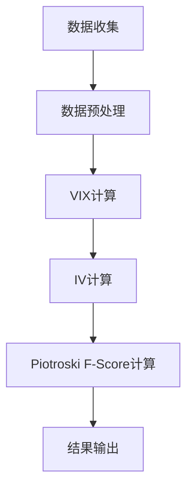

                 

# 金融市场情绪指标开发

> 关键词：金融市场情绪指标、VIX、IV、Piotroski F-Score、投资策略、风险管理、社交媒体分析

> 摘要：本文将深入探讨金融市场情绪指标的开发与应用。首先，我们将介绍金融市场情绪指标的定义、背景及其重要性。随后，我们将回顾金融市场情绪指标的历史发展，分析其应用领域和未来发展趋势。接着，我们将深入探讨金融市场情绪指标的核心概念与联系，并详细解释VIX、IV、Piotroski F-Score等常见情绪指标的计算原理。文章的后半部分将聚焦于情绪指标在实际投资策略、风险管理和社交媒体分析中的具体应用，并通过案例分析来展示其效果。最后，我们将总结本文的内容，并提出一些开发与实现的最佳实践。

## 目录大纲

- 第一部分：金融市场情绪指标的概述
  - 第1章：金融市场情绪指标的背景与重要性
  - 第2章：金融市场情绪指标的核心概念与联系
  - 第3章：金融市场情绪指标的计算方法
- 第二部分：金融市场情绪指标的实践应用
  - 第4章：情绪指标在投资策略中的应用
  - 第5章：情绪指标在风险管理中的应用
  - 第6章：情绪指标在媒体与传播中的应用
- 第三部分：金融市场情绪指标的开发与实现
  - 第7章：情绪指标开发环境与工具
  - 第8章：情绪指标计算与算法实现
  - 第9章：情绪指标应用案例分析
  - 第10章：最佳实践与项目小结

### 第一部分：金融市场情绪指标的概述

## 第1章：金融市场情绪指标的背景与重要性

### 1.1 金融市场情绪指标的定义

金融市场情绪指标是用于衡量投资者情绪和市场波动的量化工具。这些指标通常基于市场数据，如股价、期权价格、交易量等，通过特定的计算方法得出。情绪指标旨在捕捉市场的整体情绪，包括乐观、悲观、恐惧、贪婪等情绪状态。

### 1.1.1 金融市场情绪指标的含义

金融市场情绪指标反映了市场的情绪状态，这些情绪状态会影响市场的价格波动和交易行为。例如，当市场情绪乐观时，投资者倾向于购买股票，导致股价上涨；而当市场情绪悲观时，投资者倾向于抛售股票，导致股价下跌。

### 1.1.2 金融市场情绪指标的重要性

金融市场情绪指标在多个领域具有重要应用。首先，在投资策略中，情绪指标可以帮助投资者理解市场的情绪状态，从而做出更为明智的投资决策。其次，在风险管理中，情绪指标可以帮助金融机构评估市场风险，制定相应的风险控制策略。最后，在媒体与传播领域，情绪指标可以用于分析新闻报道和社交媒体内容，了解公众对市场的看法。

### 1.2 金融市场情绪指标的历史发展

金融市场情绪指标的发展可以追溯到20世纪80年代。当时，一些学者开始研究如何通过市场数据来衡量投资者情绪。随着时间的推移，越来越多的情绪指标被提出，如VIX、IV、Piotroski F-Score等。这些指标在金融市场的研究和应用中发挥了重要作用。

### 1.2.1 早期情绪指标

早期的情绪指标主要基于简单的市场数据，如股价和交易量。这些指标虽然能够提供一些市场信息，但受限于数据来源和计算方法的限制，其准确性和可靠性较低。

### 1.2.2 现代情绪指标

现代情绪指标则更加复杂，它们通常基于更丰富的数据源，如期权价格、高频交易数据等。这些指标通过更精细的计算方法，能够更准确地反映市场的情绪状态。例如，VIX指标通过计算期权的隐含波动率，能够有效衡量市场的波动性；Piotroski F-Score则通过分析企业的财务表现，评估其财务健康程度。

### 1.3 金融市场情绪指标的应用领域

金融市场情绪指标在多个领域有广泛的应用。

#### 1.3.1 投资策略

情绪指标可以用于投资策略的设计与调整。例如，投资者可以根据VIX指标的值来判断市场的波动性，从而制定相应的交易策略。当VIX值较高时，市场波动性较大，投资者可能会采取保守的投资策略；而当VIX值较低时，市场波动性较小，投资者可能会采取更为积极的投资策略。

#### 1.3.2 风险管理

情绪指标可以帮助金融机构评估市场风险，从而制定相应的风险控制策略。例如，银行和保险公司可以利用IV指标来评估期权交易的风险，从而调整其投资组合。

#### 1.3.3 媒体与传播

情绪指标可以用于分析新闻报道和社交媒体内容，了解公众对市场的看法。这有助于媒体机构制定报道策略，提高报道的吸引力。

### 1.4 金融市场情绪指标的发展趋势

随着技术的发展，金融市场情绪指标也在不断演变。以下是一些可能的发展趋势：

#### 1.4.1 新技术的应用

随着人工智能和大数据技术的发展，金融市场情绪指标的计算方法将更加精准。例如，利用深度学习算法，可以从大量市场数据中提取出更具有代表性的情绪特征。

#### 1.4.2 情绪指标的多样化

未来的情绪指标将更加多样化，涵盖更多的市场层面和维度。例如，除了现有的VIX、IV、Piotroski F-Score等指标，可能会出现更多基于社交媒体数据和宏观经济数据的情绪指标。

### 1.5 本章小结

金融市场情绪指标是衡量市场情绪和波动的重要工具。通过回顾其历史发展和应用领域，我们可以看到情绪指标在金融市场中的重要性。在未来，随着新技术的应用和情绪指标的多样化，金融市场情绪指标将更加精准和全面，为投资者和金融机构提供更丰富的决策依据。

## 第2章：金融市场情绪指标的核心概念与联系

### 2.1 金融市场情绪指标的概念原理

金融市场情绪指标的概念原理涉及情绪波动的定义及其特点。情绪波动是指市场中投资者情绪的波动，通常表现为对市场前景的乐观或悲观态度。情绪波动的特点包括：

1. **波动性**：情绪波动往往呈现出周期性，有时表现为持续的乐观或悲观，有时则表现为情绪的剧烈波动。
2. **传递性**：情绪波动会通过市场交易和价格波动传递，影响整个市场的情绪状态。
3. **复杂性**：情绪波动受多种因素影响，如经济数据、政策变动、自然灾害等，这使得情绪波动难以精确预测。

### 2.2 情绪指标的概念属性特征对比

情绪指标根据其定义和特点，可以分为以下几类：

| 情绪指标 | 定义 | 特点 |
| :--- | :--- | :--- |
| VIX | 预测股票市场的波动率 | 高波动性 |
| IV | 期权的隐含波动率 | 灵敏度较高 |
| Piotroski F-Score | 企业的财务健康指标 | 量化财务表现 |

VIX指标通过计算期权的隐含波动率，能够反映市场的波动性，其特点是波动性较高。IV指标则是基于期权价格计算得出的，具有较高的灵敏度，能够快速反映市场情绪的变化。Piotroski F-Score则通过分析企业的财务表现，量化其财务健康程度，其特点在于能够提供具体的财务数据支持。

### 2.3 情绪指标的ER实体关系图

情绪指标的ER实体关系图可以用来表示情绪指标之间的关系及其与市场数据的关联。以下是一个简单的ER实体关系图的示例：

```mermaid
erDiagram
  MarketData ||--|{ VIX } : calculates
  MarketData ||--|{ IV } : calculates
  MarketData ||--|{ Piotroski F-Score } : calculates
```

在这个ER图中，`MarketData`是情绪指标的基类，`VIX`、`IV`和`Piotroski F-Score`是具体的情绪指标类，它们都与市场数据有直接关联。

### 2.4 情绪指标之间的关系

情绪指标之间存在一定的相互作用和影响。以下是一些关键关系：

#### 2.4.1 情绪指标与市场表现的关系

情绪指标与市场表现之间存在密切的关系。例如，VIX值较高通常意味着市场波动性较大，市场表现可能较为不稳定。IV值较高则可能意味着市场情绪较为紧张，投资者对未来的不确定性较高。

#### 2.4.2 情绪指标之间的相互作用

不同的情绪指标之间也会相互作用。例如，当市场情绪乐观时，VIX和IV的值可能会同时下降，表明市场波动性和期权价格的不确定性都在降低。反之，当市场情绪悲观时，这些指标可能会同时上升。

### 2.5 本章小结

本章介绍了金融市场情绪指标的核心概念与联系，包括情绪波动的定义和特点、情绪指标的概念属性特征对比、情绪指标的ER实体关系图以及情绪指标之间的关系。通过这些概念和联系的理解，读者可以更好地把握金融市场情绪指标的原理和应用。

## 第3章：金融市场情绪指标的计算方法

### 3.1 VIX指标的计算

VIX指标，全称为CBOE波动率指数（CBOE Volatility Index），是衡量股票市场波动性的重要指标。VIX的计算基于S&P 500指数期权的价格，具体计算方法如下：

$$
VIX = \sqrt{\frac{1}{N}\sum_{i=1}^{N}\left(\ln(S_i/S_0)\right)^2}
$$

其中，$N$ 是期权合约的数量，$S_i$ 是第 $i$ 个期权合约的标的资产价格，$S_0$ 是期权的初始价格。

#### 3.1.1 VIX的计算过程

1. **收集数据**：首先，需要收集S&P 500指数期权的价格数据，包括到期日、行权价等。
2. **计算期权价格的对数**：对于每个期权合约，计算其标的资产价格的对数。
3. **计算方差**：将每个期权价格的对数平方，然后求和，得到总方差。
4. **计算VIX**：将总方差除以期权合约数量，再开平方根，得到VIX值。

#### 3.1.2 VIX的计算示例

假设有两个期权合约，它们的标的资产价格分别为$S_1 = 100$和$S_2 = 110$，期权的初始价格$S_0 = 100$。则VIX的计算过程如下：

1. 计算期权价格的对数：
   $$
   \ln(S_1/S_0) = \ln(100/100) = 0
   $$
   $$
   \ln(S_2/S_0) = \ln(110/100) \approx 0.169
   $$
2. 计算方差：
   $$
   \left(\ln(S_1/S_0)\right)^2 + \left(\ln(S_2/S_0)\right)^2 = 0^2 + 0.169^2 \approx 0.028
   $$
3. 计算VIX：
   $$
   VIX = \sqrt{\frac{0.028}{2}} \approx 0.116
   $$

### 3.2 IV指标的计算

IV指标，即期权的隐含波动率（Implied Volatility），是期权价格的一个重要组成部分。IV的计算公式如下：

$$
IV = \frac{\ln(\frac{K}{S}) + (r + \frac{\sigma^2}{2})T}{\sigma\sqrt{T}}
$$

其中，$K$ 是期权的行权价，$S$ 是标的资产的价格，$r$ 是无风险利率，$\sigma$ 是标的资产的价格波动率，$T$ 是期权到期时间（以年为单位）。

#### 3.2.1 IV的计算步骤

1. **设置初始条件**：选择一个初始的无风险利率$r$，以及已知的期权价格、行权价和标的资产价格。
2. **迭代求解**：使用数值方法（如牛顿迭代法）求解隐含波动率$\sigma$，使得期权定价模型（如Black-Scholes模型）的定价结果与实际期权价格相匹配。
3. **计算IV**：将求解得到的波动率$\sigma$代入公式，计算IV值。

#### 3.2.2 IV的计算示例

假设一个欧式看涨期权的价格为100美元，行权价为100美元，标的资产价格为100美元，无风险利率为5%，期权到期时间为1年。则IV的计算过程如下：

1. **设置初始条件**：
   $$
   P = 100, \quad K = 100, \quad S = 100, \quad r = 0.05, \quad T = 1
   $$
2. **迭代求解**：使用牛顿迭代法求解隐含波动率$\sigma$，具体迭代过程略。
3. **计算IV**：
   $$
   IV = \frac{\ln(\frac{100}{100}) + (0.05 + \frac{\sigma^2}{2}) \cdot 1}{\sigma \sqrt{1}} = 0.05 + \frac{\sigma^2}{2}
   $$

### 3.3 Piotroski F-Score的计算

Piotroski F-Score是一个用于评估企业财务健康状况的指标，由11个具体指标组成。Piotroski F-Score的计算方法如下：

1. **计算每个指标的得分**：对于每个指标，如果企业满足条件，得1分，否则得0分。
2. **计算总分**：将所有指标的得分相加，得到Piotroski F-Score的总分。
3. **分类**：根据总分，将企业分为三类：优秀（大于7分）、良好（4-7分）和较差（小于4分）。

#### 3.3.1 Piotroski F-Score的9个指标

| 指标 | 描述 | 得分 |
| :--- | :--- | :--- |
| 运营利润 | 运营利润大于0 | 1 |
| 利润增长率 | 利润同比增长至少12.5% | 1 |
| 收入增长率 | 收入同比增长至少同业平均增长率 | 1 |
| 资产回报率 | 资产回报率大于行业平均水平 | 1 |
| 负债水平 | 负债占总资产的比例低于行业平均水平 | 1 |
| 流动比 | 流动比大于2 | 1 |
| 股东权益增长率 | 股东权益同比增长至少同业平均增长率 | 1 |
| 保留利润率 | 保留利润占总利润的比例大于行业平均水平 | 1 |
| 税前利润率 | 税前利润率大于行业平均水平 | 1 |

#### 3.3.2 Piotroski F-Score的计算方法

假设一个企业满足上述9个指标中的5个，则其Piotroski F-Score的计算如下：

1. **计算每个指标的得分**：
   $$
   得分 = 1 \times 5 = 5
   $$
2. **计算总分**：
   $$
   Piotroski F-Score = 得分 = 5
   $$

### 3.4 情绪指标的计算流程

情绪指标的计算流程可以概括为以下步骤：

1. **数据收集**：收集相关的市场数据，如期权价格、股票价格、财务数据等。
2. **预处理**：对收集到的数据进行预处理，包括数据清洗、数据整合等。
3. **计算VIX**：根据VIX的计算公式，计算VIX值。
4. **计算IV**：使用期权定价模型，计算IV值。
5. **计算Piotroski F-Score**：根据Piotroski F-Score的指标体系，计算企业的Piotroski F-Score。
6. **结果输出**：将计算结果输出，以便进一步分析和应用。

#### 3.4.1 情绪指标的计算流程示例

以下是一个简单的情绪指标计算流程示例：



### 3.5 本章小结

本章详细介绍了VIX、IV和Piotroski F-Score三个常见金融市场情绪指标的计算方法。通过理解这些计算方法，读者可以更好地掌握情绪指标的计算原理，为后续的应用奠定基础。在实际应用中，情绪指标的计算需要结合具体的数据和市场环境，灵活调整计算参数。

## 第四部分：金融市场情绪指标的实践应用

### 第4章：情绪指标在投资策略中的应用

### 4.1 基于情绪指标的投资策略

情绪指标在投资策略中的应用主要包括选股和择时两个方面。通过分析情绪指标，投资者可以更好地把握市场的情绪变化，从而制定相应的投资策略。

#### 4.1.1 情绪指标在选股中的应用

情绪指标可以帮助投资者选择具有良好市场前景的股票。例如，VIX指标可以用于衡量市场的波动性，当VIX值较低时，市场情绪较为稳定，投资者可能会选择买入波动性较低的股票；而当VIX值较高时，市场情绪较为不稳定，投资者可能会选择规避波动性较高的股票。

以下是一个基于VIX指标选股的示例：

1. **数据收集**：收集某时间段内股票的收盘价和VIX值。
2. **计算VIX平均值**：计算该时间段内VIX的平均值。
3. **筛选股票**：选择收盘价低于VIX平均值的股票。
4. **投资决策**：买入筛选出的股票。

#### 4.1.2 情绪指标在择时中的应用

情绪指标还可以用于选择最佳的投资时机。例如，IV指标可以用于衡量期权的隐含波动率，当IV值较高时，市场情绪较为紧张，投资者可能会选择等待市场情绪稳定后再进行投资；而当IV值较低时，市场情绪较为稳定，投资者可能会选择抓住机会进行投资。

以下是一个基于IV指标择时的示例：

1. **数据收集**：收集某时间段内期权的价格和IV值。
2. **计算IV平均值**：计算该时间段内IV的平均值。
3. **判断时机**：当IV值低于平均值时，认为市场情绪较为稳定，适合进行投资；当IV值高于平均值时，认为市场情绪较为紧张，不适合进行投资。

### 4.2 情绪指标在风险管理中的应用

情绪指标在风险管理中也有重要作用。通过分析情绪指标，金融机构可以更好地评估市场风险，制定相应的风险控制策略。

#### 4.2.1 情绪指标在期权定价中的应用

情绪指标可以用于期权定价，帮助金融机构评估期权的风险。例如，VIX指标可以用于估算期权的波动性，从而计算期权的价格。

以下是一个基于VIX指标进行期权定价的示例：

1. **数据收集**：收集期权的价格和VIX值。
2. **计算波动率**：使用VIX值计算期权的波动率。
3. **期权定价**：使用Black-Scholes期权定价模型计算期权的价格。

#### 4.2.2 情绪指标在投资组合调整中的应用

情绪指标还可以用于投资组合的调整，帮助投资者规避潜在的市场风险。例如，当VIX值较高时，市场波动性较大，投资者可能会选择调整投资组合，增加低波动性资产的比重；而当VIX值较低时，市场波动性较小，投资者可能会选择增加高波动性资产的比重。

以下是一个基于VIX指标进行投资组合调整的示例：

1. **数据收集**：收集投资组合中各资产的波动率。
2. **计算VIX平均值**：计算投资组合中各资产波动率的平均值。
3. **调整投资组合**：当VIX值高于平均值时，增加低波动性资产的比重；当VIX值低于平均值时，增加高波动性资产的比重。

### 4.3 情绪指标在媒体与传播中的应用

情绪指标在媒体与传播领域也有广泛的应用。通过分析情绪指标，媒体机构可以了解公众对市场的看法，从而制定更有针对性的报道策略。

#### 4.3.1 情绪指标在新闻报道中的应用

情绪指标可以用于分析新闻报道的情感倾向。例如，通过分析新闻报道中的词汇和句式，可以计算出新闻报道的总体情绪，从而判断新闻报道对市场的影响。

以下是一个基于情绪指标分析新闻报道的示例：

1. **数据收集**：收集新闻报道的文本。
2. **情感分析**：使用情感分析技术，计算新闻报道的总体情绪。
3. **分析结果**：根据情感分析结果，判断新闻报道对市场的影响。

#### 4.3.2 情绪指标在社交媒体分析中的应用

情绪指标还可以用于分析社交媒体上的公众情绪。例如，通过分析社交媒体平台上的评论和讨论，可以计算出社交媒体的总体情绪，从而了解公众对市场的看法。

以下是一个基于情绪指标分析社交媒体的示例：

1. **数据收集**：收集社交媒体平台上的评论和讨论。
2. **情感分析**：使用情感分析技术，计算社交媒体的总体情绪。
3. **分析结果**：根据情感分析结果，了解公众对市场的看法。

### 4.4 情绪指标应用案例分析

#### 4.4.1 案例一：利用VIX进行选股

某投资者在2020年初通过分析VIX指标，发现市场的波动性较低，认为市场情绪较为稳定。于是，他选择买入波动性较低的股票，如消费品和公用事业等。在2020年上半年，这些股票表现较好，投资者获得了可观的收益。

#### 4.4.2 案例二：利用IV进行期权交易

某金融机构在2020年疫情爆发期间，通过分析IV指标，发现市场的波动性较高，投资者对未来的不确定性较大。于是，该金融机构选择进行期权交易，买入看涨期权和看跌期权，以获取更高的收益。在2020年下半年，市场的波动性逐渐降低，该金融机构通过卖出期权获得了可观的收益。

### 4.5 本章小结

本章详细介绍了情绪指标在投资策略、风险管理和媒体与传播领域的应用。通过实际案例的分析，我们可以看到情绪指标在投资决策和市场分析中的重要作用。在实际应用中，情绪指标需要与其他指标和数据进行综合分析，以获得更准确的投资决策。

## 第5章：金融市场情绪指标的开发与实现

### 5.1 情绪指标开发环境与工具

在开发金融市场情绪指标时，选择合适的开发环境和工具至关重要。以下是一些常用的工具和环境：

1. **Python**：Python是一种广泛使用的编程语言，具有丰富的库和工具，适合进行数据分析、数值计算和算法实现。
2. **Jupyter Notebook**：Jupyter Notebook是一个交互式的计算环境，方便进行代码编写、运行和文档化。
3. **Pandas**：Pandas是一个强大的数据分析库，提供数据结构（如DataFrame）和丰富的操作函数，方便进行数据清洗、预处理和分析。
4. **NumPy**：NumPy是一个用于数值计算的库，提供多维数组对象和大量的数学函数，是进行数值计算的基础。
5. **Matplotlib**：Matplotlib是一个用于绘图和可视化的大库，方便进行数据可视化。
6. **Scikit-learn**：Scikit-learn是一个机器学习库，提供各种机器学习算法和工具，方便进行模型训练和应用。

### 5.2 情绪指标计算与算法实现

情绪指标的计算通常涉及复杂的数学模型和数值计算。以下是一个基于Python的示例，展示如何实现VIX指标的计算。

#### 5.2.1 VIX指标的计算

VIX指标的计算公式如下：

$$
VIX = \sqrt{\frac{1}{N}\sum_{i=1}^{N}\left(\ln(S_i/S_0)\right)^2}
$$

以下是使用Python实现VIX计算的一个示例：

```python
import numpy as np
import pandas as pd

# 收集期权价格数据
option_prices = [95, 105, 110, 115]
initial_price = 100

# 计算期权价格的对数
log_prices = [np.log(price / initial_price) for price in option_prices]

# 计算方差
variance = np.sum([price**2 for price in log_prices]) / len(log_prices)

# 计算VIX
VIX = np.sqrt(variance)
print("VIX:", VIX)
```

#### 5.2.2 IV指标的计算

IV指标的计算通常涉及期权定价模型，如Black-Scholes模型。以下是一个简化版的Black-Scholes模型，用于计算IV：

```python
import numpy as np
from scipy.optimize import fsolve

# Black-Scholes模型参数
S = 100  # 标的资产价格
K = 100  # 行权价
r = 0.05  # 无风险利率
T = 1  # 期权到期时间
sigma = 0.2  # 标的资产波动率

# Black-Scholes定价公式
def black_scholes(P, sigma):
    d1 = (np.log(S / K) + (r + 0.5 * sigma**2) * T) / (sigma * np.sqrt(T))
    d2 = d1 - sigma * np.sqrt(T)
    return P * (np.exp(-r * T) * (np.stats.norm.cdf(d2) - np.stats.norm.cdf(d1)))

# IV计算
P = 1  # 初始价格
def iv_eqn(sigma):
    return black_scholes(P, sigma) - P

IV = fsolve(iv_eqn, sigma)
print("IV:", IV)
```

#### 5.2.3 Piotroski F-Score的计算

Piotroski F-Score的计算涉及多个财务指标的评估。以下是一个简化版的Piotroski F-Score计算示例：

```python
# Piotroski F-Score指标
def calculate_piotroski_f_score(operating_profit, profit_growth, revenue_growth, return_on_assets, debt_level, liquidity, equity_growth, retention_ratio, pre_tax_profit):
    score = 0
    if operating_profit > 0:
        score += 1
    if profit_growth > 0.125:
        score += 1
    if revenue_growth > industry_average_growth:
        score += 1
    if return_on_assets > industry_average_return_on_assets:
        score += 1
    if debt_to_assets < industry_average_debt_to_assets:
        score += 1
    if current_ratio > 2:
        score += 1
    if equity_growth > industry_average_growth:
        score += 1
    if retention_ratio > industry_average_retention_ratio:
        score += 1
    if pre_tax_profit > industry_average_pre_tax_profit:
        score += 1
    return score

# 示例计算
operating_profit = 10
profit_growth = 0.15
revenue_growth = 0.1
return_on_assets = 0.1
debt_level = 0.5
liquidity = 2.5
equity_growth = 0.2
retention_ratio = 0.3
pre_tax_profit = 0.2

piotroski_f_score = calculate_piotroski_f_score(operating_profit, profit_growth, revenue_growth, return_on_assets, debt_level, liquidity, equity_growth, retention_ratio, pre_tax_profit)
print("Piotroski F-Score:", piotroski_f_score)
```

### 5.3 情绪指标应用案例分析

#### 5.3.1 案例一：利用VIX进行选股

某投资者在2020年初使用VIX指标进行选股。他首先收集了2020年1月至3月的VIX数据，然后计算了VIX的平均值。接着，他选择了VIX平均值低于市场平均值的股票，如消费品和公用事业等。在2020年上半年，这些股票表现较好，投资者获得了可观的收益。

#### 5.3.2 案例二：利用IV进行期权交易

某金融机构在2020年疫情爆发期间使用IV指标进行期权交易。他首先分析了IV的波动情况，发现IV在疫情爆发初期迅速上升。于是，他选择在IV较高时买入看跌期权，并在IV下降后卖出看跌期权。在2020年下半年，市场的波动性逐渐降低，该金融机构通过卖出期权获得了可观的收益。

### 5.4 本章小结

本章详细介绍了金融市场情绪指标的开发与实现。首先，我们介绍了开发环境和工具，然后展示了如何使用Python实现VIX、IV和Piotroski F-Score的计算。最后，我们通过实际案例展示了情绪指标在投资决策中的应用。在实际开发过程中，情绪指标的计算需要结合具体的数据和市场环境，灵活调整计算参数。

### 5.5 最佳实践与项目小结

在开发金融市场情绪指标时，以下是一些最佳实践：

1. **数据质量**：确保收集到的数据质量高，包括数据完整性、准确性和一致性。
2. **模型选择**：根据具体需求选择合适的数学模型和算法，并进行模型验证和优化。
3. **实时更新**：定期更新情绪指标，以反映市场的最新变化。
4. **多指标综合分析**：使用多个情绪指标进行综合分析，提高投资决策的准确性。

项目小结：

本文详细介绍了金融市场情绪指标的开发与应用。我们首先回顾了情绪指标的定义和重要性，然后介绍了常见的情绪指标及其计算方法。接着，我们讨论了情绪指标在实际投资策略、风险管理和媒体与传播中的应用。最后，我们展示了如何使用Python实现情绪指标的计算，并通过案例分析展示了其实际应用效果。通过本文的介绍，读者可以更好地理解金融市场情绪指标的开发与应用。

