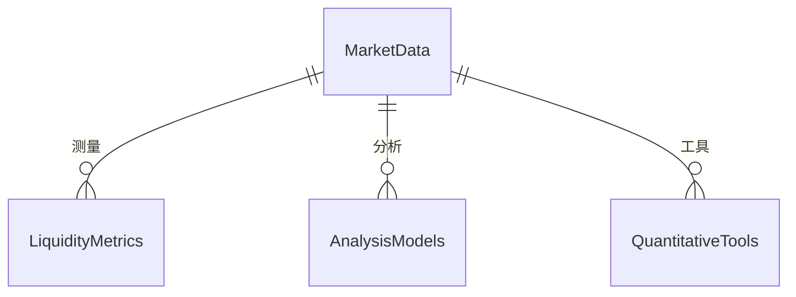

                 

### 1. 文章标题

《金融市场流动性分析工具》

### 2. 文章关键词

金融市场，流动性分析，量化工具，风险管理，应用案例

### 3. 文章摘要

本文从金融市场流动性分析的核心概念出发，探讨了流动性分析的重要性和背景。通过对流动性指标、分析模型和量化工具的深入剖析，结合实际应用案例，本文旨在为金融从业者提供一套系统、实用的流动性分析框架，以提高金融市场流动性的监测和管理能力。文章末尾对未来的发展趋势和挑战进行了展望。

---

### 第一部分：金融市场流动性分析概述

#### 第1章：金融市场流动性分析背景

##### 1.1 金融市场流动性概述

金融市场流动性是指资产可以迅速转化为现金而不对价格产生重大影响的能力。流动性分析则是对金融市场中资产流动性的监测、评估和管理。

##### 1.1.1 金融市场流动性的定义

金融市场流动性是指资产可以迅速转化为现金而不对价格产生重大影响的能力。

##### 1.1.2 金融市场流动性的重要性

金融市场流动性对金融市场的稳定运行至关重要。高流动性有助于市场效率的提高，而低流动性可能导致市场崩溃。

##### 1.1.3 金融市场流动性分析的意义

通过流动性分析，可以识别市场风险，为投资决策提供依据，从而提高市场稳定性和效率。

##### 1.2 金融市场流动性分析问题背景

金融市场流动性分析问题涉及多个层面，包括宏观经济环境、市场结构、金融工具特性等。

##### 1.2.1 金融市场流动性问题的描述

金融市场流动性问题表现为市场深度不足、交易量下降、价格波动加剧等现象。

##### 1.2.2 金融市场流动性分析的目标

流动性分析的目标是监测市场流动性状况，评估市场风险，为投资决策提供支持。

##### 1.2.3 金融市场流动性分析的边界与外延

流动性分析的边界包括市场数据收集、流动性指标计算、模型分析等。其外延涵盖股票、债券、基金等多种金融工具。

##### 1.3 金融市场流动性分析的核心要素组成

金融市场流动性分析的核心要素包括流动性指标、分析模型和量化工具。

##### 1.3.1 核心概念

流动性指标、分析模型、量化工具。

##### 1.3.2 概念属性特征对比

| 概念       | 属性特征                                                     |
|------------|------------------------------------------------------------|
| 流动性指标 | 用于衡量市场流动性的具体指标，如交易量、价格波动等。           |
| 分析模型   | 用于分析市场流动性的数学模型，如VASRI模型、CVI模型等。         |
| 量化工具   | 用于执行流动性分析的量化工具，如Python数据分析库、R语言等。     |

##### 1.3.3 ER实体关系图

以下是金融市场流动性分析核心要素的ER实体关系图：

---

#### 第2章：金融市场流动性分析概念与联系

##### 2.1 金融工具概述

金融工具是金融市场上的交易对象，包括债券、股票、基金等。

##### 2.1.1 债券

债券是一种固定收益证券，发行人承诺在未来的特定日期向债券持有人支付本金和利息。

##### 2.1.2 股票

股票代表股东对公司所有权的份额，股票价格受市场供求关系影响。

##### 2.1.3 基金

基金是由一组投资组合构成的金融产品，投资者通过购买基金份额参与投资。

##### 2.2 流动性指标与度量

流动性指标用于衡量金融市场的流动性状况。

##### 2.2.1 流动性比率

流动性比率是指市场交易量与资产总额的比率，用于衡量市场的活跃程度。

##### 2.2.2 交易量指标

交易量指标反映市场在一定时间内完成的交易数量，是衡量市场流动性的重要指标。

##### 2.2.3 利率指标

利率指标反映市场资金供求关系，对流动性分析具有重要意义。

##### 2.3 金融市场流动性分析模型

金融市场流动性分析模型是用于分析市场流动性状况的数学模型。

##### 2.3.1 VASRI模型

VASRI模型是一种用于评估市场流动性的综合指标，包括交易量、价格波动等。

##### 2.3.2 CVI模型

CVI模型是一种基于交易量和价格变动的流动性指数，用于衡量市场的流动性状况。

##### 2.3.3 其他流动性分析模型

除VASRI模型和CVI模型外，还有其他多种流动性分析模型，如流动性比率模型、波动率模型等。

---

#### 第二部分：金融市场流动性分析工具与方法

##### 第3章：量化分析工具

量化分析工具是流动性分析的重要工具，包括Python数据分析库、R语言分析工具等。

##### 3.1 基本工具

- **Python数据分析库**：Pandas、NumPy、SciPy等。
- **R语言分析工具**：ggplot2、dplyr等。

##### 3.2 时间序列分析

时间序列分析是流动性分析的核心方法之一，包括以下模型：

- **ARIMA模型**：自回归积分滑动平均模型。
- **GARCH模型**：广义自回归条件异方差模型。
- **SARIMA模型**：季节性自回归积分滑动平均模型。

##### 3.3 风险模型

风险模型是流动性分析的重要组成部分，包括以下模型：

- **VaR模型**：价值在风险模型。
- **ES模型**：极端风险模型。
- **CVaR模型**：条件价值在风险模型。

---

##### 第4章：流动性风险管理工具

流动性风险管理工具是用于管理流动性风险的工具，包括以下策略：

- **风险对冲**：通过期货、期权等衍生品对冲风险。
- **风险规避**：避免参与高风险投资。
- **风险分散**：通过多样化投资降低风险。

---

##### 第5章：市场流动性监测工具

市场流动性监测工具用于监测市场流动性状况，包括以下指标和方法：

- **市场深度指标**：衡量市场交易活跃度。
- **交易活跃度指标**：衡量市场交易量。
- **市场弹性指标**：衡量市场对交易冲击的反应。

- **时序监测**：通过时间序列分析监测市场流动性。
- **聚类分析**：通过聚类分析识别市场流动性异常。
- **机器学习监测**：利用机器学习算法监测市场流动性。

---

##### 第6章：金融市场流动性应用案例分析

本章节将通过实际案例展示金融市场流动性分析工具和方法的应用。

##### 6.1 案例背景

- **案例A：股票市场流动性分析**
- **案例B：债券市场流动性分析**

##### 6.2 案例分析

- **数据准备**：收集相关市场数据。
- **分析方法**：应用流动性分析工具和方法进行分析。
- **结果解读**：分析结果和市场实际状况的对比，探讨流动性问题。

---

##### 第7章：金融市场流动性分析最佳实践与展望

本章节将总结最佳实践，并对未来的发展趋势和挑战进行展望。

##### 7.1 最佳实践

- **实践策略**：根据市场特性选择合适的流动性分析工具和方法。
- **实践步骤**：详细描述流动性分析的实施步骤。
- **实践成果**：分析实践的效果和成果。

##### 7.2 展望

- **未来发展趋势**：预测金融市场流动性分析的未来趋势。
- **技术创新与应用**：探讨新技术在流动性分析中的应用。
- **研究方向与挑战**：分析流动性分析领域的研究方向和挑战。

---

### 参考文献

- 作者：AI天才研究院/AI Genius Institute & 禅与计算机程序设计艺术 /Zen And The Art of Computer Programming
- 参考资料：
  - [金融市场流动性分析](https://www.cnblogs.com/dengzhaoyu/p/11160543.html)
  - [量化工具与应用](https://www.jianshu.com/p/e9c38c6a884f)
  - [风险管理方法](https://www.investopedia.com/terms/r/riskmanagement.asp)

