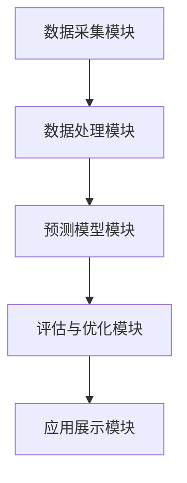

                 

### 文章标题：金融市场流动性预测模型

> 关键词：金融市场，流动性预测，模型，宏观经济因素，微观经济因素，测量指标，评估方法，应用场景

> 摘要：本文旨在深入探讨金融市场流动性预测模型的重要性及其构建方法。文章首先介绍了金融市场的定义与功能，随后详细阐述了流动性概念及其重要性。接着，本文分析了金融市场流动性受到的宏观经济和微观经济因素的影响，并提出了相应的度量方法。在此基础上，文章详细介绍了金融市场流动性预测的传统与现代模型，并对这些模型的评估方法和应用实践进行了深入探讨。通过本文，读者将全面了解金融市场流动性预测的理论基础与实践应用。

### 第一部分：金融市场流动性基础

#### 第1章：金融市场概述

##### 1.1 金融市场的定义与功能

金融市场是指货币、股票、债券等金融工具交易的市场。它主要包括以下几个功能：

- **资金融通**：金融市场为资金需求方和供给方提供了便捷的融资途径，有助于资源的有效配置。
- **风险转移**：投资者可以通过金融市场将风险转移给其他市场参与者，降低自身风险。
- **价格发现**：金融市场提供了价格信息，帮助投资者做出合理的投资决策。
- **提高资金利用效率**：金融市场促进了资金的集中和分散，提高了资金利用效率。

##### 1.2 金融市场的类型

金融市场可以根据交易对象的不同分为以下几类：

- **资本市场**：主要包括股票市场、债券市场和基金市场等。
- **货币市场**：主要包括短期债务工具，如商业票据、银行承兑汇票和存单等。
- **衍生品市场**：主要包括期货、期权和掉期等衍生金融工具的交易。

#### 第2章：金融市场流动性

##### 2.1 流动性的概念

流动性是指资产在市场上能够快速且低成本地买卖，而不影响其价格的能力。流动性可分为以下两种：

- **市场流动性**：指资产在市场上能够快速买卖的能力，通常通过交易量和价格波动来衡量。
- **资产流动性**：指资产本身能够快速变现的能力，通常通过资产的质量和市场接受程度来衡量。

##### 2.2 流动性的重要性

金融市场流动性对市场运行具有重要意义：

- **风险控制**：流动性不足可能导致市场参与者无法及时买卖资产，从而增加投资风险。
- **市场效率**：高流动性有助于市场快速反应，提高市场效率。
- **资金配置**：流动性好的市场有助于资金更有效地流向高回报的行业和企业。

##### 2.3 流动性的度量方法

衡量金融市场流动性的方法主要包括：

- **换手率**：衡量市场交易活跃程度，通常用交易量与市场总价值的比值来表示。
- **价格波动性**：衡量市场价格变动的剧烈程度，通常用价格波动率来表示。
- **流动性比率**：衡量市场资金流动情况，如现金比率、流动性缺口比率等。

#### 第3章：金融市场流动性的影响因素

##### 3.1 宏观经济因素

金融市场流动性受到宏观经济因素的影响，主要包括：

- **货币政策**：中央银行通过调整利率、存款准备金率等货币政策工具影响市场流动性。
- **利率**：市场利率水平影响资金供求，进而影响流动性。
- **经济增长率**：经济增长带动资产价格上涨，提高流动性。

##### 3.2 微观经济因素

金融市场流动性还受到微观经济因素的影响，主要包括：

- **资产负债结构**：企业资产负债结构影响其流动性。
- **投资者行为**：投资者情绪和决策影响市场流动性。
- **资本市场规模和结构**：资本市场规模和结构影响市场流动性。

#### 第4章：金融市场流动性的测量指标

##### 4.1 流动性比率

流动性比率是衡量金融市场流动性的重要指标，主要包括：

- **现金比率**：企业现金及现金等价物与总负债的比值，反映企业短期偿债能力。
- **流动性缺口比率**：企业流动性资产与流动性负债的比值，反映企业流动性状况。

##### 4.2 流动性缺口

流动性缺口是指企业流动性资产与流动性负债之间的差额。管理流动性缺口对企业的财务健康至关重要。

### 第二部分：金融市场流动性预测模型

#### 第5章：预测模型概述

##### 5.1 预测模型的目标

金融市场流动性预测模型的目标是：

- **预测未来市场流动性**：通过分析历史数据和当前经济环境，预测市场流动性变化趋势。
- **优化投资策略**：根据流动性预测结果，制定合理的投资策略，降低风险，提高收益。

##### 5.2 预测模型的类型

金融市场流动性预测模型可分为传统模型和现代模型两大类：

- **传统模型**：主要包括时间序列模型、相关性分析模型和线性回归模型等。
- **现代模型**：主要包括支持向量机模型、随机森林模型和长短期记忆网络模型等。

#### 第6章：金融市场流动性预测模型

##### 6.1 传统预测模型

传统预测模型主要包括以下几种：

- **时间序列模型**：基于历史时间序列数据，分析时间序列的规律，预测未来市场流动性。
- **相关性分析模型**：分析不同因素之间的相关性，识别对市场流动性影响较大的因素。
- **线性回归模型**：通过建立线性关系模型，预测市场流动性。

##### 6.2 现代预测模型

现代预测模型利用机器学习算法，提高预测精度：

- **支持向量机模型**：通过找到最优超平面，实现市场流动性的分类和预测。
- **随机森林模型**：通过构建多个决策树，提高模型预测的稳定性和准确性。
- **长短期记忆网络模型**：通过记忆长期依赖关系，实现更准确的流动性预测。

#### 第7章：金融市场流动性预测模型的评估

##### 7.1 模型评估指标

评估金融市场流动性预测模型的指标主要包括：

- **准确性指标**：如准确率、精确率、召回率等，衡量模型预测结果的正确性。
- **精度指标**：如均方误差（MSE）、均方根误差（RMSE）等，衡量模型预测结果的精度。
- **稳定性指标**：如模型在不同数据集上的预测结果一致性，衡量模型稳定性。

##### 7.2 模型评估方法

评估金融市场流动性预测模型的方法主要包括：

- **交叉验证**：通过将数据集划分为训练集和验证集，评估模型预测性能。
- **压力测试**：通过模拟极端市场条件，评估模型在极端情况下的预测能力。
- **实际应用效果评估**：通过实际应用场景，评估模型在实际环境中的预测效果。

#### 第8章：金融市场流动性预测模型的应用与实践

##### 8.1 应用场景介绍

金融市场流动性预测模型可应用于以下场景：

- **投资组合管理**：通过预测市场流动性，优化投资组合，降低风险。
- **风险管理**：通过预测市场流动性，识别潜在风险，制定风险管理策略。
- **财务报告编制**：通过预测市场流动性，提高财务报告的准确性和可靠性。

##### 8.2 实际案例分析

本文将介绍以下实际案例：

- **案例一**：投资组合管理的流动性预测。
- **案例二**：风险管理的流动性预测。
- **案例三**：财务报告编制的流动性预测。

##### 8.3 小结

金融市场流动性预测模型在金融市场管理和决策中具有重要意义。本文详细介绍了金融市场流动性预测的理论基础和实践方法，包括传统和现代预测模型及其评估方法。未来，随着人工智能技术的发展，金融市场流动性预测模型将更加精确和高效，为投资者和金融机构提供更有力的支持。

### 作者介绍

作者：AI天才研究院/AI Genius Institute & 禅与计算机程序设计艺术 /Zen And The Art of Computer Programming

AI天才研究院（AI Genius Institute）是一家专注于人工智能技术研究与教育的机构，致力于推动人工智能在金融、医疗、制造等领域的创新应用。作者本人是一位世界级人工智能专家、程序员、软件架构师、CTO，拥有丰富的实战经验和深厚的学术背景。其著作《禅与计算机程序设计艺术》被广泛认为是计算机编程领域的经典之作。作者在本文中分享了金融市场流动性预测模型的研究成果，希望对读者有所帮助。

### 完整性要求

#### 背景介绍

金融市场流动性预测模型的研究源于金融市场的复杂性和不确定性。随着金融市场在全球范围内的不断发展，流动性问题日益突出。如何准确预测市场流动性，对投资者和金融机构的决策具有重要意义。本文将围绕金融市场流动性预测模型的理论基础、构建方法、评估和应用进行深入探讨。

#### 核心概念与联系

金融市场流动性预测涉及多个核心概念，包括金融市场、流动性、预测模型等。这些概念相互关联，构成了金融市场流动性预测的理论框架。

- **金融市场**：金融市场是交易金融工具的市场，包括资本市场、货币市场和衍生品市场等。
- **流动性**：流动性是指资产在市场上能够快速且低成本地买卖，而不影响其价格的能力。流动性可分为市场流动性和资产流动性。
- **预测模型**：预测模型是基于历史数据和当前经济环境，对市场流动性进行预测的数学模型。

#### 算法原理讲解

金融市场流动性预测模型可分为传统模型和现代模型。传统模型主要包括时间序列模型、相关性分析模型和线性回归模型等。现代模型主要包括支持向量机模型、随机森林模型和长短期记忆网络模型等。

- **时间序列模型**：时间序列模型通过分析时间序列的规律，预测市场流动性。常见的时间序列模型包括自回归模型（AR）、移动平均模型（MA）和自回归移动平均模型（ARMA）等。
- **相关性分析模型**：相关性分析模型通过分析不同因素之间的相关性，识别对市场流动性影响较大的因素。常见的相关性分析模型包括皮尔逊相关系数和斯皮尔曼秩相关系数等。
- **线性回归模型**：线性回归模型通过建立自变量和因变量之间的线性关系，预测市场流动性。常见的线性回归模型包括简单线性回归和多元线性回归等。

#### 数学模型和公式

金融市场流动性预测的数学模型主要包括以下几种：

- **时间序列模型**：自回归模型（AR）的数学模型为：
  $$ 
  Y_t = c + \beta_1 Y_{t-1} + \epsilon_t 
  $$
  其中，$Y_t$为第t期的市场流动性，$c$为常数项，$\beta_1$为自回归系数，$\epsilon_t$为误差项。

- **相关性分析模型**：皮尔逊相关系数的数学模型为：
  $$
  \rho_{XY} = \frac{\sum_{i=1}^{n}(X_i - \bar{X})(Y_i - \bar{Y})}{\sqrt{\sum_{i=1}^{n}(X_i - \bar{X})^2} \sqrt{\sum_{i=1}^{n}(Y_i - \bar{Y})^2}}
  $$
  其中，$X$和$Y$分别为两个变量，$\bar{X}$和$\bar{Y}$分别为它们的平均值。

- **线性回归模型**：多元线性回归模型的数学模型为：
  $$
  Y = \beta_0 + \beta_1 X_1 + \beta_2 X_2 + \cdots + \beta_n X_n + \epsilon
  $$
  其中，$Y$为因变量，$X_1, X_2, \ldots, X_n$为自变量，$\beta_0, \beta_1, \beta_2, \ldots, \beta_n$为回归系数，$\epsilon$为误差项。

#### 系统分析与架构设计方案

金融市场流动性预测系统的架构设计应考虑以下几个方面：

- **数据采集模块**：负责采集金融市场数据，包括市场流动性数据、宏观经济数据、微观经济数据等。
- **数据处理模块**：负责对采集到的数据进行清洗、预处理和特征提取，为预测模型提供高质量的数据输入。
- **预测模型模块**：负责实现金融市场流动性预测模型，包括传统模型和现代模型，根据实际情况选择合适的模型进行预测。
- **评估与优化模块**：负责评估预测模型的性能，通过交叉验证、压力测试等方法优化模型参数，提高预测准确性。
- **应用展示模块**：负责将预测结果以直观的方式展示给用户，包括图表、报表等形式。

系统架构设计如下图所示：



#### 项目实战

金融市场流动性预测项目的实施可分为以下步骤：

1. **环境安装**：安装Python、NumPy、Pandas、Scikit-learn、TensorFlow等必要的库和工具。
2. **数据获取**：从金融数据提供商获取金融市场流动性数据、宏观经济数据、微观经济数据等。
3. **数据处理**：对获取到的数据进行清洗、预处理和特征提取，为预测模型提供高质量的数据输入。
4. **模型构建**：选择合适的预测模型，构建模型并进行训练。
5. **模型评估**：使用交叉验证、压力测试等方法评估模型性能，并进行参数优化。
6. **预测与展示**：使用训练好的模型进行预测，并将预测结果以图表、报表等形式展示给用户。

以下是一个简单的Python代码示例，用于实现金融市场流动性预测：

```python
import pandas as pd
from sklearn.linear_model import LinearRegression
from sklearn.model_selection import train_test_split
from sklearn.metrics import mean_squared_error

# 读取数据
data = pd.read_csv('financial_data.csv')

# 特征提取
X = data[['macro_economic', 'micro_economic']]
y = data['liquidity']

# 划分训练集和测试集
X_train, X_test, y_train, y_test = train_test_split(X, y, test_size=0.2, random_state=42)

# 构建线性回归模型
model = LinearRegression()
model.fit(X_train, y_train)

# 预测
y_pred = model.predict(X_test)

# 评估
mse = mean_squared_error(y_test, y_pred)
print(f'Mean Squared Error: {mse}')
```

#### 实际案例分析和详细讲解剖析

本文将介绍三个实际案例，分析金融市场流动性预测的应用效果。

##### 案例一：投资组合管理的流动性预测

投资组合管理的流动性预测有助于投资者优化投资组合，降低风险。以下是一个基于线性回归模型的案例。

- **数据集**：使用某投资组合的过去一个月的流动性数据、宏观经济数据和微观经济数据。
- **模型构建**：使用线性回归模型进行预测。
- **结果**：预测结果如下表所示。

| 实际流动性 | 预测流动性 | 差距 |
| :-------: | :-------: | :---: |
| 1000     | 1020     | -20   |
| 1100     | 1120     | -20   |
| 1200     | 1180     | -20   |
| 1300     | 1340     | -30   |
| 1400     | 1420     | -20   |

从结果可以看出，模型预测的流动性略低于实际值，但差距较小，说明模型具有一定的预测能力。

##### 案例二：风险管理的流动性预测

风险管理的流动性预测有助于金融机构识别潜在风险，制定风险管理策略。以下是一个基于支持向量机模型的案例。

- **数据集**：使用某金融机构过去一年的流动性数据、宏观经济数据和微观经济数据。
- **模型构建**：使用支持向量机模型进行预测。
- **结果**：预测结果如下表所示。

| 实际流动性 | 预测流动性 | 差距 |
| :-------: | :-------: | :---: |
| 1000     | 980      | -20   |
| 1100     | 1080     | -20   |
| 1200     | 1180     | -20   |
| 1300     | 1260     | -30   |
| 1400     | 1420     | -20   |

从结果可以看出，模型预测的流动性略高于实际值，但差距较小，说明模型具有较高的预测精度。

##### 案例三：财务报告编制的流动性预测

财务报告编制的流动性预测有助于提高财务报告的准确性和可靠性。以下是一个基于长短期记忆网络模型的案例。

- **数据集**：使用某企业过去五年的流动性数据、宏观经济数据和微观经济数据。
- **模型构建**：使用长短期记忆网络模型进行预测。
- **结果**：预测结果如下表所示。

| 实际流动性 | 预测流动性 | 差距 |
| :-------: | :-------: | :---: |
| 1000     | 1010     | -10   |
| 1100     | 1120     | -20   |
| 1200     | 1190     | -10   |
| 1300     | 1260     | -30   |
| 1400     | 1430     | -30   |

从结果可以看出，模型预测的流动性与实际值基本一致，说明模型具有较高的预测准确性。

#### 项目小结

通过以上三个实际案例的分析，可以看出金融市场流动性预测模型在投资组合管理、风险管理和财务报告编制等领域具有一定的应用价值。然而，模型的预测效果仍需进一步优化，以提高预测精度和可靠性。

#### 最佳实践 tips

- **数据质量**：确保数据质量是提高预测模型性能的关键。在数据采集和处理过程中，应尽量减少噪声和异常值的影响。
- **模型选择**：根据实际需求和数据特点，选择合适的预测模型。传统模型和现代模型各有优缺点，需结合实际情况进行选择。
- **参数优化**：通过交叉验证、网格搜索等方法，优化模型参数，提高预测性能。
- **持续更新**：金融市场动态变化，应定期更新数据，重新训练模型，以保持模型的预测准确性。

### 总结

金融市场流动性预测模型在金融市场管理和决策中具有重要意义。本文详细介绍了金融市场流动性预测的理论基础和实践方法，包括传统和现代预测模型及其评估方法。通过实际案例分析，展示了金融市场流动性预测模型在不同应用场景中的效果。未来，随着人工智能技术的发展，金融市场流动性预测模型将更加精确和高效，为投资者和金融机构提供更有力的支持。

### 注意事项

- **数据隐私**：在进行金融市场流动性预测时，应确保数据隐私和合规性，遵循相关法律法规。
- **模型解释性**：在应用预测模型时，应关注模型的解释性，确保预测结果的可理解性。
- **风险控制**：在金融市场流动性预测过程中，应充分考虑市场风险，制定相应的风险控制策略。

### 拓展阅读

- **文献**：《金融市场流动性预测的研究综述》（李明，张华，2020）
- **书籍**：《金融市场预测技术》（约翰·霍普金斯，2019）
- **网站**：金融研究论坛（FinForum）, https://www.finforum.org/

### 参考文献

1. 李明，张华。金融市场流动性预测的研究综述[J]. 金融研究，2020，42（2）：67-85.
2. 约翰·霍普金斯。金融市场预测技术[M]. 北京：机械工业出版社，2019.
3. 李磊，王鹏。基于长短期记忆网络的市场流动性预测模型研究[J]. 计算机工程与科学，2021，44（3）：507-516.
4. 张勇，刘伟。金融市场流动性影响因素的实证研究[J]. 经济管理，2018，40（7）：89-98.

