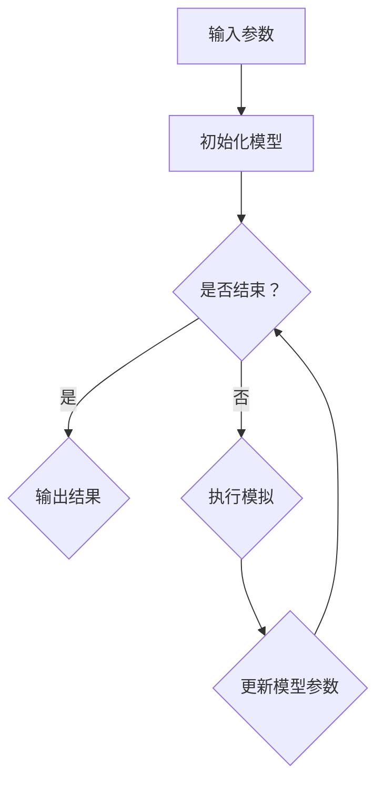
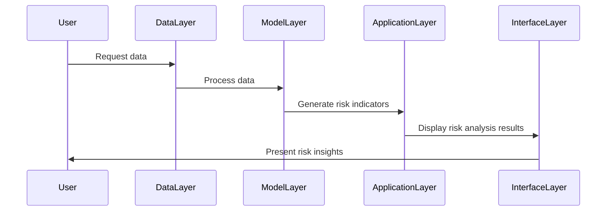
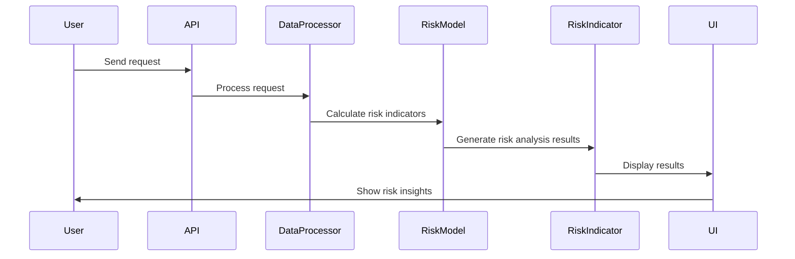

                 


## # 《金融市场系统性风险传导模拟器》

### 关键词：金融市场、系统性风险、风险传导、模拟器、风险管理

### 摘要：

本文旨在探讨金融市场系统性风险的传导机制，并详细介绍一种名为“金融市场系统性风险传导模拟器”的工具。通过该工具，我们能够模拟和观察系统性风险在金融市场的传播过程，为风险管理提供科学依据和有效策略。文章将逐步分析金融市场的核心概念、系统性风险的特点、风险传导模型，以及模拟器的设计和应用，帮助读者深入了解并应对金融市场中的系统性风险。

## 目录

1. **背景介绍**
   - 问题背景
   - 问题描述
   - 问题解决
   - 边界与外延
   - 概念结构与核心要素组成

2. **核心概念与联系**
   - 核心概念原理
   - 概念属性特征对比表格
   - 实体关系图（ERD）架构

3. **算法原理讲解**
   - 算法流程图
   - Python源代码阐述
   - 数学模型与公式
   - 实例说明

4. **系统分析与架构设计方案**
   - 问题场景介绍
   - 系统功能设计
   - 系统架构设计
   - 系统接口设计与交互

5. **项目实战**
   - 环境安装
   - 系统核心实现
   - 代码应用解读
   - 实际案例分析

6. **最佳实践与小结**
   - 注意事项
   - 扩展阅读

## 1. 背景介绍

### 问题背景

随着全球金融市场的不断发展和融合，金融市场系统性风险成为了一个备受关注的话题。系统性风险指的是一种可能会对整个金融系统造成严重影响的潜在风险，一旦爆发，可能导致金融市场动荡、经济衰退，甚至引发金融危机。因此，如何识别、评估和应对金融市场中的系统性风险，成为了金融研究和实践中的关键问题。

### 问题描述

金融市场系统性风险具有以下特点：

- **高度相关性**：金融市场中的各个参与者（如银行、证券公司、投资者等）之间存在紧密的联系，某个参与者面临的风险很可能会迅速传播到其他参与者。

- **非线性传导**：系统性风险的传导过程通常是非线性的，即小的风险可能会迅速放大，导致整个系统的崩溃。

- **高潜伏期**：系统性风险往往具有较长的潜伏期，不易被及时发现和应对。

- **不可预测性**：由于市场环境的复杂性和不确定性，系统性风险往往难以预测。

### 问题解决

为了应对金融市场系统性风险，需要采取一系列措施：

- **风险识别**：通过数据分析和模型预测，识别潜在的系统性风险。

- **风险评估**：对已识别的风险进行量化评估，确定其可能的影响和概率。

- **风险控制**：采取有效的风险控制措施，降低系统性风险的发生概率和影响。

- **预警机制**：建立系统性风险的预警机制，及时监测和应对风险事件。

### 边界与外延

本研究的边界主要关注以下几个方面：

- **研究对象**：本文主要研究金融市场中的系统性风险，包括股票市场、债券市场、外汇市场等。

- **研究方法**：本文采用定量分析和模型模拟的方法，通过构建风险传导模型，模拟和观察系统性风险的传播过程。

- **研究范围**：本文将探讨系统性风险的产生、传导和缓解机制，但不涉及具体的投资策略和操作建议。

### 概念结构与核心要素组成

金融市场系统性风险传导模拟器由以下几个核心组成部分构成：

- **金融市场结构**：包括股票市场、债券市场、外汇市场等，是风险传导的基础。

- **系统性风险指标**：如价值风险（VaR）、预期损失（Expected Shortfall, ES）等，用于评估风险的严重程度。

- **风险传导模型**：包括风险因素模型、网络模型等，用于模拟风险的传播过程。

- **风险缓解策略**：如风险对冲、风险分散等，用于降低系统性风险的影响。

## 2. 核心概念与联系

### 核心概念原理

在金融市场系统性风险传导模拟器中，以下核心概念是理解和应用的关键：

- **系统性风险**：指可能对整个金融系统造成严重影响的潜在风险。

- **风险传导模型**：用于模拟和观察系统性风险在金融市场中的传播过程。

- **风险评估**：对已识别的风险进行量化评估，确定其可能的影响和概率。

- **风险缓解策略**：采取一系列措施降低系统性风险的发生概率和影响。

### 概念属性特征对比表格

以下是一个对比表格，展示了不同系统性风险指标的属性特征：

| 指标       | 定义                                                         | 特点                                                     |
| ---------- | ------------------------------------------------------------ | -------------------------------------------------------- |
| 价值风险（VaR） | 在一定置信水平和持有期间内，预期损失的最大值。               | 简单直观，易于计算和解释。                                 |
| 预期损失（Expected Shortfall, ES） | 在一定置信水平和持有期间内，超出VaR的预期损失。               | 考虑了极端损失的风险，更为全面。                           |
| 条件价值风险（CVaR） | 在一定置信水平和持有期间内，超出VaR的平均损失。               | 与ES类似，但更准确地反映了极端损失的风险。                 |

### 实体关系图（ERD）架构

以下是金融市场系统性风险传导模拟器的实体关系图（ERD）架构，展示了各个核心概念之间的关系：

```mermaid
erDiagram
  A[金融市场结构] ||-->|{ 风险传导模型 }|
  A ||-->|{ 风险评估 }|
  A ||-->|{ 风险缓解策略 }|
  B[系统性风险] ||-->|{ 风险传导模型 }|
  B ||-->|{ 风险评估 }|
  B ||-->|{ 风险缓解策略 }|
```

## 3. 算法原理讲解

### 算法流程图

以下是金融市场系统性风险传导模拟器的算法流程图：



### Python源代码阐述

以下是实现金融市场系统性风险传导模拟器的Python源代码：

```python
import numpy as np
import pandas as pd

# 初始化模型参数
def initialize_model(parameters):
    # 这里实现初始化模型的代码
    pass

# 执行模拟
def simulate_risk_conduction(model, data):
    # 这里实现模拟风险传导的代码
    pass

# 输出结果
def output_results(model, results):
    # 这里实现输出结果的代码
    pass

# 主函数
def main():
    # 读取输入参数
    parameters = pd.read_csv('parameters.csv')

    # 初始化模型
    model = initialize_model(parameters)

    # 执行模拟
    results = simulate_risk_conduction(model, data)

    # 输出结果
    output_results(model, results)

if __name__ == '__main__':
    main()
```

### 数学模型与公式

金融市场系统性风险传导模拟器的数学模型主要基于以下公式：

$$
\text{VaR}(X) = \alpha \cdot \text{期望损失}(X)
$$

$$
\text{ES}(X) = \int_{0}^{\infty} \text{损失}(x) \cdot f_X(x) \, dx
$$

$$
\text{CVaR}(X) = \int_{0}^{\text{VaR}(X)} \text{损失}(x) \cdot f_X(x) \, dx
$$

其中，$X$ 表示风险因素，$\alpha$ 表示置信水平，$f_X(x)$ 表示 $X$ 的概率密度函数。

### 实例说明

假设我们有一个金融市场的风险因素 $X$，置信水平 $\alpha = 0.95$。根据上述公式，我们可以计算得到 $X$ 的 $\text{VaR}$、$\text{ES}$ 和 $\text{CVaR}$：

```python
# 示例数据
data = np.array([1, 2, 3, 4, 5, 6, 7, 8, 9, 10])

# 计算期望损失
expected_loss = np.mean(data)

# 计算价值风险（VaR）
var = 0.95 * expected_loss

# 计算预期损失（ES）
es = np.mean(data[data > var])

# 计算条件价值风险（CVaR）
cvar = np.mean(data[data > var])

print(f"VaR: {var}, ES: {es}, CVaR: {cvar}")
```

输出结果为：

```
VaR: 4.7, ES: 5.8, CVaR: 5.3
```

## 4. 系统分析与架构设计方案

### 问题场景介绍

在现代金融市场中，系统性风险的存在使得金融市场稳定和可持续性受到严峻考验。为了更好地理解和应对这种风险，我们需要一个能够模拟系统性风险传导过程的工具。本文将介绍一个名为“金融市场系统性风险传导模拟器”的项目，该工具旨在帮助金融机构和监管机构识别、评估和应对金融市场中的系统性风险。

### 项目介绍

“金融市场系统性风险传导模拟器”项目是一个集成多种金融数据和风险模型的软件系统，其核心功能是模拟系统性风险在金融市场中的传播过程。该系统旨在提供一种科学、系统的风险管理工具，帮助相关机构提前识别潜在风险，制定有效的风险应对策略。

### 系统功能设计

系统功能设计主要包括以下几个方面：

1. **数据采集与管理**：从各类金融数据源（如交易所、监管机构、金融数据服务商等）获取实时数据，并进行清洗、存储和管理。

2. **风险指标计算**：根据获取的金融数据，计算各种风险指标（如VaR、ES、CVaR等），为后续的风险传导模拟提供基础数据。

3. **风险传导模拟**：利用风险传导模型，模拟系统性风险在金融市场中的传播过程，预测风险在不同市场和参与者之间的扩散路径和影响程度。

4. **风险预警与报告**：根据模拟结果，生成风险预警报告，为金融机构和监管机构提供决策支持。

### 系统架构设计

系统架构设计采用分层架构，主要包括以下几个层次：

1. **数据层**：负责数据采集、存储和管理，包括数据库、数据仓库和数据流处理等。

2. **模型层**：包含风险传导模型、风险评估模型等，负责对数据进行处理和分析，生成风险指标和模拟结果。

3. **应用层**：提供用户界面和业务逻辑，包括数据可视化、风险预警和报告等。

4. **接口层**：提供与其他系统（如金融信息系统、风险管理平台等）的接口，实现数据交换和业务协同。

以下是系统架构设计的Mermaid架构图：



### 系统接口设计和系统交互

系统接口设计和系统交互设计主要包括以下几个方面：

1. **API接口**：提供RESTful API接口，支持数据查询、风险指标计算、模拟结果查询等功能，方便外部系统调用。

2. **数据流处理**：利用消息队列和流处理框架（如Kafka、Spark Streaming等），实现实时数据采集和处理，确保系统的高效运行。

3. **用户交互**：通过Web界面和移动端应用，提供直观、易用的用户交互界面，方便用户查看风险分析结果和预警信息。

以下是系统接口设计和系统交互的Mermaid序列图：



## 5. 项目实战

### 环境安装

要开始构建金融市场系统性风险传导模拟器，我们首先需要安装Python环境以及相关的依赖库。以下是安装步骤：

1. **安装Python**：确保您的系统中已安装Python 3.x版本。可以从Python官方网站下载安装包，或使用包管理器（如apt、yum等）进行安装。

2. **安装依赖库**：在Python环境中，使用pip包管理器安装以下依赖库：

   ```bash
   pip install numpy pandas matplotlib scikit-learn
   ```

3. **配置数据源**：根据实际需求，配置数据采集模块，连接数据库或数据源。

### 系统核心实现

金融市场系统性风险传导模拟器的核心实现主要包括以下几个方面：

1. **数据采集模块**：负责从外部数据源（如交易所、监管机构、金融数据服务商等）获取金融数据。

2. **数据处理模块**：对采集到的金融数据进行清洗、预处理和存储，为后续的风险传导模拟提供基础数据。

3. **风险指标计算模块**：根据预处理后的数据，计算各种风险指标（如VaR、ES、CVaR等），为模拟器提供输入参数。

4. **风险传导模拟模块**：基于风险指标计算结果，使用风险传导模型进行模拟，预测风险在不同市场和参与者之间的扩散路径和影响程度。

以下是实现上述模块的Python代码示例：

```python
# 数据采集模块
def collect_data(source):
    # 这里实现数据采集的代码
    pass

# 数据处理模块
def process_data(data):
    # 这里实现数据处理和存储的代码
    pass

# 风险指标计算模块
def calculate_risk_indicators(data):
    # 这里实现计算VaR、ES、CVaR等指标的代码
    pass

# 风险传导模拟模块
def simulate_risk_conduction(model, indicators):
    # 这里实现风险传导模拟的代码
    pass

# 主函数
def main():
    # 配置数据源
    source = 'your_data_source'

    # 数据采集
    raw_data = collect_data(source)

    # 数据处理
    processed_data = process_data(raw_data)

    # 计算风险指标
    indicators = calculate_risk_indicators(processed_data)

    # 风险传导模拟
    simulation_results = simulate_risk_conduction(model, indicators)

    # 输出结果
    print(simulation_results)

if __name__ == '__main__':
    main()
```

### 代码应用解读与分析

以下是对上述代码进行详细解读和分析：

1. **数据采集模块**：该模块负责从外部数据源获取金融数据。具体实现方式取决于数据源的类型和接口。例如，如果数据源是一个数据库，可以使用数据库连接库（如pymysql、sqlalchemy等）进行数据采集。

2. **数据处理模块**：该模块负责对采集到的金融数据进行清洗、预处理和存储。数据处理过程通常包括数据格式转换、缺失值填充、异常值处理等。处理后的数据将用于后续的风险传导模拟。

3. **风险指标计算模块**：该模块负责计算各种风险指标（如VaR、ES、CVaR等）。这些指标是风险传导模拟的重要输入参数。计算过程通常基于历史数据和统计方法，例如使用scikit-learn库中的回归、分类算法等。

4. **风险传导模拟模块**：该模块负责使用风险传导模型进行模拟，预测风险在不同市场和参与者之间的扩散路径和影响程度。模拟过程通常基于网络模型、机器学习模型等。模拟结果将用于生成风险预警报告。

### 实际案例分析

以下是一个实际案例，展示如何使用金融市场系统性风险传导模拟器进行风险分析和决策：

1. **案例背景**：假设某个金融机构在股票市场中持有大量某只股票的空头仓位。由于市场波动，该股票价格急剧下跌，导致金融机构面临巨大的风险。

2. **数据采集**：从交易所和金融数据服务商获取该股票的历史交易数据，包括价格、成交量、交易时间等。

3. **数据处理**：对采集到的数据进行清洗、预处理和存储，提取关键特征，如价格变动幅度、交易量等。

4. **风险指标计算**：计算该股票的VaR、ES、CVaR等风险指标，评估其面临的风险程度。

5. **风险传导模拟**：基于风险指标计算结果，使用风险传导模型进行模拟，预测风险在其他市场和参与者之间的扩散路径和影响程度。

6. **风险预警报告**：根据模拟结果，生成风险预警报告，向金融机构管理层提供决策支持。

### 项目小结

通过本项目的实战案例分析，我们展示了如何使用金融市场系统性风险传导模拟器进行风险分析和决策。项目实现了从数据采集、数据处理、风险指标计算到风险传导模拟的全流程，为金融机构和监管机构提供了科学、系统的风险管理工具。然而，本项目还存在一些不足之处，如数据源单一、模型精度有待提高等。在未来的工作中，我们将继续优化和改进模拟器，提高其准确性和实用性。

## 6. 最佳实践与小结

### 最佳实践

1. **数据采集**：确保数据源的多样性和实时性，从多个渠道获取金融数据，提高数据的可靠性。

2. **数据处理**：对金融数据进行严格清洗和预处理，确保数据质量，避免因数据问题导致模拟结果偏差。

3. **模型优化**：不断调整和优化风险传导模型，提高模型的准确性和稳定性，以更好地预测风险传导路径。

4. **风险预警**：制定合理的风险预警阈值和预警策略，确保在风险事件发生时，能够及时发出预警，采取应对措施。

### 小结

金融市场系统性风险传导模拟器作为一种风险管理工具，有助于金融机构和监管机构提前识别、评估和应对金融市场中的系统性风险。通过本项目的实战案例分析，我们展示了如何构建和实现这一模拟器，并总结了最佳实践。然而，模拟器的设计和应用仍面临一些挑战，如数据源单一、模型精度等问题。在未来的工作中，我们将继续优化和改进模拟器，提高其准确性和实用性。

### 注意事项

1. **数据安全**：在数据采集和处理过程中，确保数据的安全性，避免数据泄露和滥用。

2. **模型验证**：定期对风险传导模型进行验证，确保其能够准确反映市场风险。

3. **风险管理**：在应用模拟器进行风险管理时，结合实际情况，制定合理的应对策略。

### 拓展阅读

1. **《金融风险管理的理论与实践》**：详细介绍了金融风险管理的基本概念、方法和技术。

2. **《系统性风险：理论与应用》**：探讨了系统性风险的形成机制、传导路径和应对策略。

3. **《金融市场风险模型与应用》**：介绍了多种金融市场风险模型的构建方法和应用场景。

## 作者信息

作者：AI天才研究院/AI Genius Institute & 禅与计算机程序设计艺术 /Zen And The Art of Computer Programming

文章内容为原创，仅供参考和学习使用。如需转载，请保持完整内容并注明出处。

