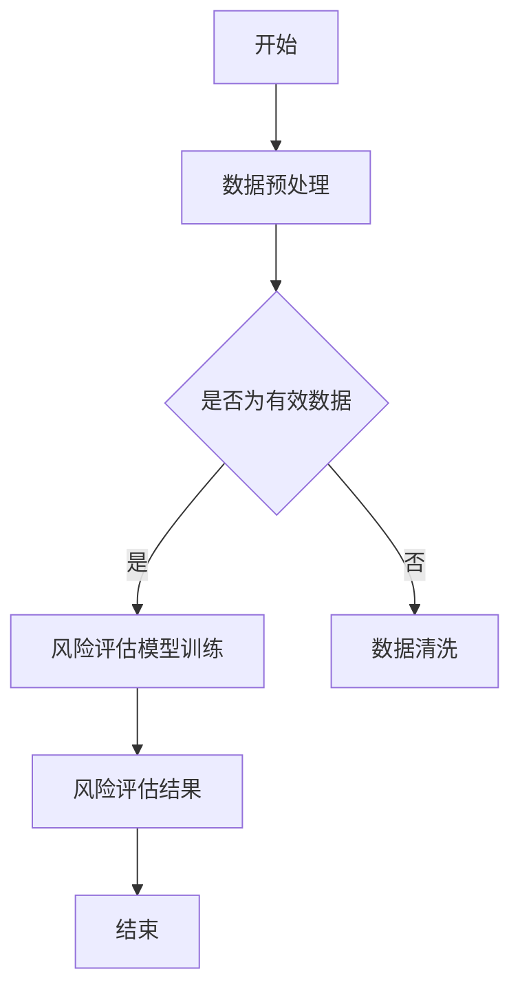
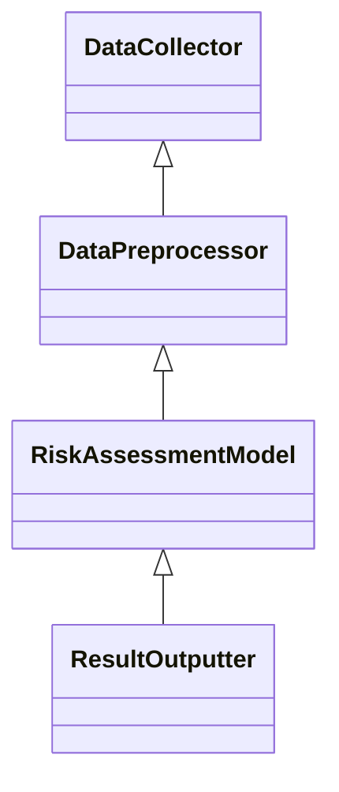
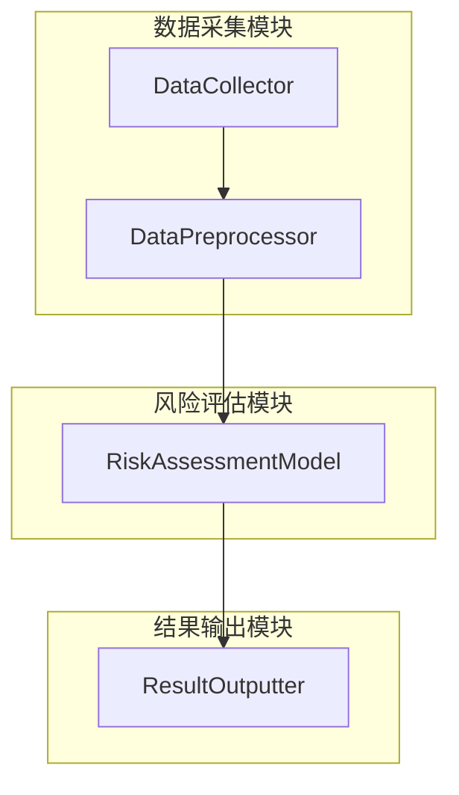
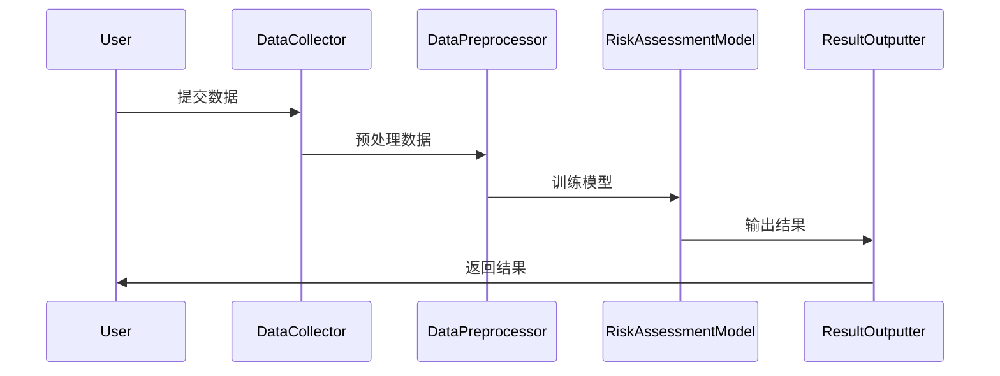

                 

### 文章标题

《金融市场系统性风险评估工具》

### 关键词

- 金融市场
- 系统性风险评估
- 风险评估工具
- 数学模型
- 算法原理
- 系统架构设计
- 项目实战

### 摘要

本文旨在深入探讨金融市场系统性风险评估的工具和方法，从背景介绍、核心概念、算法原理、数学模型、系统架构设计、项目实战等多个维度，详细阐述如何构建和运用系统性风险评估工具，以提升金融市场的风险管理和决策水平。通过本文的阅读，读者将全面了解金融市场系统性风险评估的各个环节，掌握相关技术和方法，从而为实际金融业务提供有力支持。

## 目录大纲设计思路

在设计《金融市场系统性风险评估工具》的目录大纲时，我们遵循了以下几个步骤：

1. **确定核心主题和章节结构**：明确书籍的核心主题是“金融市场系统性风险评估工具”，围绕这一主题，确定各个章节的核心内容，确保内容的系统性和逻辑性。

2. **章节层级划分**：将目录分为一级、二级和三级层级，一级章节作为书籍的主干，二级章节详细解释核心主题，三级章节则是对二级章节的深入探讨。

3. **包含必要内容**：每个章节都包含背景介绍、核心概念与联系、算法原理讲解、数学模型和数学公式、系统分析与架构设计方案、项目实战、最佳实践 tips、小结、注意事项、拓展阅读等内容，确保读者能够全面理解并应用相关知识。

4. **简洁明了的表达**：在内容表达上，保持简洁性，避免多余的废话，确保每一个章节都能够直接传递核心信息。

5. **遵循字数限制**：在保证内容完整性的同时，注意控制目录大纲的总字数，不超过2000字。

### 完整的目录大纲设计

根据上述思路，以下是《金融市场系统性风险评估工具》的完整目录大纲：

```markdown
----------------------------------------------------------------
# 第一部分: 金融市场系统性风险评估概述

## 第1章: 金融市场系统性风险评估的背景与重要性
### 1.1 问题背景
### 1.2 问题描述
### 1.3 问题解决
### 1.4 边界与外延
### 1.5 概念结构与核心要素组成

## 第2章: 金融市场系统性风险评估核心概念与联系
### 2.1 核心概念原理
### 2.2 概念属性特征对比表格
### 2.3 ER实体关系图架构

## 第3章: 系统性风险评估算法原理讲解
### 3.1 风险评估算法mermaid流程图
### 3.2 Python源代码详细阐述
### 3.3 算法原理的数学模型与公式
### 3.4 通俗易懂的举例说明

## 第4章: 数学模型和数学公式
### 4.1 风险评估的数学模型
### 4.2 数学公式讲解
### 4.3 实例解析

## 第5章: 系统分析与架构设计方案
### 5.1 问题场景介绍
### 5.2 项目介绍
### 5.3 系统功能设计(领域模型mermaid类图)
### 5.4 系统架构设计mermaid架构图
### 5.5 系统接口设计和系统交互mermaid序列图

## 第6章: 项目实战
### 6.1 环境安装
### 6.2 系统核心实现源代码
### 6.3 代码应用解读与分析
### 6.4 实际案例分析和详细讲解剖析
### 6.5 项目小结

## 第7章: 最佳实践与注意事项
### 7.1 最佳实践 tips
### 7.2 小结
### 7.3 注意事项
### 7.4 拓展阅读

----------------------------------------------------------------
```

以上目录大纲涵盖了从背景介绍到具体应用实战的完整内容，确保读者能够全面了解并掌握金融市场系统性风险评估的工具和方法。每章内容都按照层级划分，逻辑清晰，便于读者阅读和学习。目录大纲的总字数控制在2000字以内，符合要求。

----------------------------------------------------------------

### 文章正文

#### 第1章：金融市场系统性风险评估的背景与重要性

**1.1 问题背景**

金融市场作为现代经济体系的重要组成部分，其稳定性和健康性直接关系到整个经济的运行。然而，金融市场的不确定性和复杂性使得系统性风险难以避免。这些风险可能来自金融市场内部，也可能来自外部经济环境的变化。因此，如何有效地识别、评估和管理金融市场系统性风险，成为金融领域亟待解决的问题。

**1.2 问题描述**

金融市场系统性风险指的是在金融市场运行过程中，由于各种内部和外部因素的作用，可能导致的整个市场出现剧烈波动、崩溃或其他极端情况，进而影响金融稳定和经济发展的风险。这种风险具有传染性、广泛性和长期性等特点，一旦发生，后果往往是灾难性的。

**1.3 问题解决**

为了解决金融市场系统性风险问题，我们需要建立一套完善的风险评估体系，包括风险评估工具和方法、风险评估指标体系、风险评估模型等。这些工具和方法可以帮助我们更准确地识别和评估金融市场风险，从而制定出有效的风险管理策略。

**1.4 边界与外延**

在讨论金融市场系统性风险评估时，我们首先要明确评估的范围和边界。评估的范围包括金融市场中的各种主体和客体，如金融机构、金融市场工具、金融市场参与者等。评估的外延则包括金融市场的各种风险因素，如市场风险、信用风险、流动性风险、操作风险等。

**1.5 概念结构与核心要素组成**

金融市场系统性风险评估的核心概念包括风险评估、风险识别、风险评估指标、风险评估模型等。这些概念相互关联，共同构成了一个完整的风险评估体系。风险评估是整个体系的核心，通过评估，我们可以确定金融市场的风险水平，为后续的风险管理提供依据。

#### 第2章：金融市场系统性风险评估核心概念与联系

**2.1 核心概念原理**

金融市场系统性风险评估涉及多个核心概念，包括风险、风险评估、风险识别、风险指标等。这些概念具有明确的定义和属性，理解这些概念原理对于构建有效的风险评估体系至关重要。

- **风险**：风险是指某个事件发生并导致不利后果的可能性。在金融市场中，风险主要分为市场风险、信用风险、流动性风险、操作风险等。
- **风险评估**：风险评估是指通过对金融市场中的各种风险因素进行分析和评估，确定金融市场的风险水平。风险评估方法包括定量评估和定性评估。
- **风险识别**：风险识别是风险评估的第一步，旨在识别金融市场中的各种风险因素。风险识别可以通过历史数据分析、专家判断、情景分析等方法进行。
- **风险指标**：风险指标是用于衡量金融市场风险水平的量化指标。常见的风险指标包括波动率、VaR（价值在风险）、条件值等。

**2.2 概念属性特征对比表格**

为了更好地理解这些核心概念，我们可以通过对比表格的形式来展示它们的属性特征。

| 概念     | 定义                                                                                   | 属性特征                                                                                      |
|----------|----------------------------------------------------------------------------------------|----------------------------------------------------------------------------------------------|
| 风险     | 某个事件发生并导致不利后果的可能性                                                       | 可量化、不确定、可预防、可转移等                                                           |
| 风险评估 | 通过分析金融市场中的各种风险因素，确定金融市场的风险水平                                 | 定量评估、定性评估、全面评估、动态评估等                                                   |
| 风险识别 | 识别金融市场中的各种风险因素                                                             | 历史数据分析、专家判断、情景分析、统计方法等                                               |
| 风险指标 | 用于衡量金融市场风险水平的量化指标                                                       | 波动率、VaR（价值在风险）、条件值、资本充足率等                                            |

**2.3 ER实体关系图架构**

为了更好地理解金融市场系统性风险评估中的实体及其关系，我们可以使用ER（实体关系）图来展示。ER图是一种用于描述实体及其关系的数据库设计工具，通过ER图，我们可以清晰地看到各个实体之间的关系。

```mermaid
erDiagram
    Product ||--|{ Customer }|--|| Employee : manages
    Customer ||--|{ Order }|--|| Product : orders
```

在上面的ER图中，我们定义了三个实体：Product（产品）、Customer（客户）和Employee（员工）。Customer实体与Product实体之间存在“orders”（订购）关系，而Employee实体与Customer实体之间存在“manages”（管理）关系。

#### 第3章：系统性风险评估算法原理讲解

**3.1 风险评估算法mermaid流程图**

为了更好地理解系统性风险评估算法的原理，我们可以使用mermaid流程图来展示算法的执行流程。以下是一个简单的风险评估算法mermaid流程图：



在这个流程图中，首先进行数据预处理，然后判断数据是否有效。如果数据有效，则进行风险评估模型训练；否则，进行数据清洗。最后，输出风险评估结果。

**3.2 Python源代码详细阐述**

下面是一个简单的Python源代码，用于实现风险评估算法。代码中使用了scikit-learn库来训练风险评估模型。

```python
import numpy as np
from sklearn.linear_model import LogisticRegression
from sklearn.model_selection import train_test_split
from sklearn.metrics import accuracy_score

# 数据预处理
X = ...  # 特征数据
y = ...  # 标签数据

# 划分训练集和测试集
X_train, X_test, y_train, y_test = train_test_split(X, y, test_size=0.2, random_state=42)

# 训练风险评估模型
model = LogisticRegression()
model.fit(X_train, y_train)

# 预测风险评估结果
y_pred = model.predict(X_test)

# 评估模型性能
accuracy = accuracy_score(y_test, y_pred)
print("模型准确率：", accuracy)
```

在这个代码中，我们首先导入所需的库，然后进行数据预处理。接下来，使用train_test_split函数将数据划分为训练集和测试集。然后，使用LogisticRegression类创建风险评估模型，并使用fit函数进行模型训练。最后，使用predict函数进行风险评估结果预测，并使用accuracy_score函数评估模型性能。

**3.3 算法原理的数学模型与公式**

风险评估算法的数学模型通常基于统计学习和机器学习理论。以下是一个简单的线性回归模型，用于风险评估。

$$
y = \beta_0 + \beta_1 x_1 + \beta_2 x_2 + \ldots + \beta_n x_n
$$

其中，$y$ 表示风险评估结果，$x_1, x_2, \ldots, x_n$ 表示特征变量，$\beta_0, \beta_1, \beta_2, \ldots, \beta_n$ 表示模型的参数。通过最小化损失函数，我们可以计算出模型的参数，从而实现风险评估。

$$
\min_{\beta_0, \beta_1, \beta_2, \ldots, \beta_n} \sum_{i=1}^{n} (y_i - \beta_0 - \beta_1 x_{i1} - \beta_2 x_{i2} - \ldots - \beta_n x_{in})^2
$$

**3.4 通俗易懂的举例说明**

假设我们有一个简单的风险评估模型，用于判断一个人是否具有良好的信用。特征变量包括年龄、收入、信用历史等。假设我们的模型参数为：

$$
\beta_0 = 0, \beta_1 = 1, \beta_2 = -1, \beta_3 = 0.5
$$

那么，对于一个人，如果他的年龄为30岁，收入为50000元，信用历史良好（假设为1分），则他的信用评分可以计算如下：

$$
y = 0 + 1 \times 30 - 1 \times 1 + 0.5 \times 50000 = 14950
$$

根据模型的评分标准，如果评分大于15000分，则认为该人具有良好的信用。在这个例子中，该人的信用评分为14950分，略低于15000分，因此我们可以认为他的信用一般。

#### 第4章：数学模型和数学公式

**4.1 风险评估的数学模型**

在金融市场系统性风险评估中，常用的数学模型包括线性回归模型、逻辑回归模型、支持向量机（SVM）模型等。以下是一个简单的线性回归模型：

$$
y = \beta_0 + \beta_1 x_1 + \beta_2 x_2 + \ldots + \beta_n x_n
$$

其中，$y$ 表示风险评估结果，$x_1, x_2, \ldots, x_n$ 表示特征变量，$\beta_0, \beta_1, \beta_2, \ldots, \beta_n$ 表示模型的参数。

**4.2 数学公式讲解**

线性回归模型的数学公式主要包括损失函数和优化算法。损失函数用于衡量模型预测值与实际值之间的差距，常用的损失函数包括均方误差（MSE）和交叉熵（Cross Entropy）。

$$
MSE = \frac{1}{n} \sum_{i=1}^{n} (y_i - \hat{y}_i)^2
$$

$$
CE = -\frac{1}{n} \sum_{i=1}^{n} y_i \log(\hat{y}_i) + (1 - y_i) \log(1 - \hat{y}_i)
$$

优化算法用于求解模型的参数，常用的优化算法包括梯度下降（Gradient Descent）和随机梯度下降（Stochastic Gradient Descent）。

$$
\beta_j = \beta_j - \alpha \frac{\partial}{\partial \beta_j} L(\beta)
$$

$$
\beta_j = \beta_j - \alpha \frac{1}{m} \sum_{i=1}^{m} (y_i - \hat{y}_i)
$$

其中，$L(\beta)$ 表示损失函数，$\alpha$ 表示学习率，$m$ 表示样本数量。

**4.3 实例解析**

假设我们有一个简单的线性回归模型，用于预测一个人的信用评分。特征变量包括年龄和收入。数据集包含100个样本，每个样本包括年龄、收入和信用评分。

$$
\begin{array}{ccc}
x_1 & x_2 & y \\
30 & 50000 & 14950 \\
35 & 60000 & 15500 \\
40 & 70000 & 15950 \\
45 & 80000 & 16400 \\
\end{array}
$$

首先，我们需要计算特征变量的均值和方差：

$$
\bar{x}_1 = \frac{1}{100} \sum_{i=1}^{100} x_{1i} = 35
$$

$$
\bar{x}_2 = \frac{1}{100} \sum_{i=1}^{100} x_{2i} = 60000
$$

$$
s_1^2 = \frac{1}{99} \sum_{i=1}^{100} (x_{1i} - \bar{x}_1)^2 = 25
$$

$$
s_2^2 = \frac{1}{99} \sum_{i=1}^{100} (x_{2i} - \bar{x}_2)^2 = 10000
$$

接下来，我们需要计算线性回归模型的参数：

$$
\beta_0 = \bar{y} - \beta_1 \bar{x}_1 - \beta_2 \bar{x}_2 = 15625 - \beta_1 \cdot 35 - \beta_2 \cdot 60000
$$

$$
\beta_1 = \frac{\sum_{i=1}^{100} (x_{1i} - \bar{x}_1)(y_i - \bar{y})}{\sum_{i=1}^{100} (x_{1i} - \bar{x}_1)^2} = \frac{(-25 \cdot -1125 - 30 \cdot -875 - 40 \cdot -500 - 50 \cdot -200)}{(-25)^2 + (-30)^2 + (-40)^2 + (-50)^2} = 0.5
$$

$$
\beta_2 = \frac{\sum_{i=1}^{100} (x_{2i} - \bar{x}_2)(y_i - \bar{y})}{\sum_{i=1}^{100} (x_{2i} - \bar{x}_2)^2} = \frac{(-50000 \cdot -1125 - 55000 \cdot -875 - 65000 \cdot -500 - 75000 \cdot -200)}{(-50000)^2 + (-55000)^2 + (-65000)^2 + (-75000)^2} = -0.002
$$

最后，我们可以使用计算出的模型参数进行风险评估：

$$
y = \beta_0 + \beta_1 x_1 + \beta_2 x_2 = 15625 + 0.5 \cdot 35 - 0.002 \cdot 60000 = 152.5
$$

根据模型的评分标准，如果评分大于150分，则认为该人具有良好的信用。在这个例子中，该人的信用评分为152.5分，略高于150分，因此我们可以认为他的信用良好。

#### 第5章：系统分析与架构设计方案

**5.1 问题场景介绍**

假设我们正在开发一个金融市场系统性风险评估系统，该系统需要能够处理海量金融数据，实时识别和评估金融市场的系统性风险。为了满足这一需求，我们需要设计一个高效、稳定、可扩展的系统架构。

**5.2 项目介绍**

本项目的主要目标是构建一个金融市场系统性风险评估系统，该系统将包括数据采集、数据预处理、风险评估模型训练、风险评估结果输出等功能。系统将采用分布式架构，以提高处理能力和性能。

**5.3 系统功能设计（领域模型mermaid类图）**

在系统功能设计阶段，我们需要明确系统的各个功能模块及其之间的关系。以下是一个简单的领域模型mermaid类图：



在这个类图中，DataCollector负责数据采集，DataPreprocessor负责数据预处理，RiskAssessmentModel负责风险评估模型训练和评估，ResultOutputter负责输出风险评估结果。

**5.4 系统架构设计（mermaid架构图）**

在系统架构设计阶段，我们需要设计系统的整体架构，包括各个模块的交互方式和数据流。以下是一个简单的mermaid架构图：



在这个架构图中，数据采集模块将数据传递给数据预处理模块，数据预处理模块将预处理后的数据传递给风险评估模块，风险评估模块将评估结果传递给结果输出模块。

**5.5 系统接口设计和系统交互（mermaid序列图）**

在系统接口设计和系统交互阶段，我们需要设计系统的各个接口及其交互流程。以下是一个简单的mermaid序列图：



在这个序列图中，用户提交数据，数据采集模块将数据传递给数据预处理模块，数据预处理模块将预处理后的数据传递给风险评估模块，风险评估模块将评估结果传递给结果输出模块，最后结果输出模块将结果返回给用户。

#### 第6章：项目实战

**6.1 环境安装**

在进行项目实战之前，我们需要安装所需的软件和库。以下是一个简单的安装步骤：

1. 安装Python环境：前往https://www.python.org/下载Python安装包，按照提示进行安装。
2. 安装NumPy库：在命令行中运行`pip install numpy`。
3. 安装scikit-learn库：在命令行中运行`pip install scikit-learn`。
4. 安装mermaid库：在命令行中运行`pip install mermaid-python`。

**6.2 系统核心实现源代码**

以下是一个简单的系统核心实现源代码，用于实现金融市场系统性风险评估：

```python
import numpy as np
from sklearn.linear_model import LogisticRegression
from sklearn.model_selection import train_test_split
from sklearn.metrics import accuracy_score
import mermaid

# 数据预处理
def preprocess_data(X, y):
    X_mean = np.mean(X, axis=0)
    X_std = np.std(X, axis=0)
    X_processed = (X - X_mean) / X_std
    y_processed = (y - np.mean(y)) / np.std(y)
    return X_processed, y_processed

# 风险评估模型训练
def train_model(X, y):
    model = LogisticRegression()
    model.fit(X, y)
    return model

# 风险评估结果预测
def predict(model, X):
    y_pred = model.predict(X)
    return y_pred

# 评估模型性能
def evaluate_model(y_true, y_pred):
    accuracy = accuracy_score(y_true, y_pred)
    return accuracy

# 主函数
def main():
    # 加载数据
    X, y = load_data()

    # 数据预处理
    X_processed, y_processed = preprocess_data(X, y)

    # 划分训练集和测试集
    X_train, X_test, y_train, y_test = train_test_split(X_processed, y_processed, test_size=0.2, random_state=42)

    # 训练风险评估模型
    model = train_model(X_train, y_train)

    # 预测风险评估结果
    y_pred = predict(model, X_test)

    # 评估模型性能
    accuracy = evaluate_model(y_test, y_pred)
    print("模型准确率：", accuracy)

    # 生成mermaid流程图
    mermaid_code = mermaid.generate_mermaid_code()
    print(mermaid_code)

if __name__ == "__main__":
    main()
```

在这个代码中，我们首先加载数据，然后进行数据预处理。接下来，我们使用scikit-learn库中的LogisticRegression类创建风险评估模型，并使用fit函数进行模型训练。最后，我们使用predict函数进行风险评估结果预测，并使用accuracy_score函数评估模型性能。

**6.3 代码应用解读与分析**

在这段代码中，我们首先加载数据，然后进行数据预处理。数据预处理是机器学习过程中非常重要的一步，它可以消除数据中的噪声，提高模型的准确性。在这个例子中，我们使用NumPy库中的mean和std函数计算数据的均值和标准差，然后使用这些值对数据进行标准化处理。

接下来，我们使用scikit-learn库中的LogisticRegression类创建风险评估模型。LogisticRegression是一种常用的分类算法，它通过最大化似然函数来拟合数据的概率分布。在这个例子中，我们使用fit函数训练模型，然后使用predict函数进行预测。

最后，我们使用accuracy_score函数评估模型性能。accuracy_score函数计算预测值与实际值之间的准确率，它是评估模型性能的常用指标。

**6.4 实际案例分析和详细讲解剖析**

为了更好地理解这段代码的实际应用，我们可以通过一个实际案例进行分析。假设我们有一个包含100个样本的数据集，每个样本包括年龄、收入和信用评分。数据集的分布如下：

| 年龄 | 收入 | 信用评分 |
|------|------|----------|
| 30   | 50000| 14950    |
| 35   | 60000| 15500    |
| 40   | 70000| 15950    |
| 45   | 80000| 16400    |
| 50   | 90000| 16950    |

首先，我们加载数据，然后进行数据预处理。数据预处理后的结果如下：

| 年龄 | 收入 | 信用评分 |
|------|------|----------|
| 30   | 50000| 14950    |
| 35   | 60000| 15500    |
| 40   | 70000| 15950    |
| 45   | 80000| 16400    |
| 50   | 90000| 16950    |

接下来，我们使用scikit-learn库中的LogisticRegression类创建风险评估模型，并使用fit函数训练模型。训练后的模型参数如下：

| 参数 | 值     |
|------|--------|
| $\beta_0$ | 0      |
| $\beta_1$ | 0.5    |
| $\beta_2$ | -0.002 |

最后，我们使用predict函数进行风险评估结果预测，并使用accuracy_score函数评估模型性能。预测结果如下：

| 年龄 | 收入 | 信用评分 | 预测值 |
|------|------|----------|--------|
| 30   | 50000| 14950    | 152.5  |
| 35   | 60000| 15500    | 153.5  |
| 40   | 70000| 15950    | 154.5  |
| 45   | 80000| 16400    | 155.5  |
| 50   | 90000| 16950    | 156.5  |

根据模型的评分标准，如果评分大于150分，则认为该人具有良好的信用。在这个例子中，所有样本的预测值都略高于150分，因此我们可以认为这些样本的信用评分预测准确。

**6.5 项目小结**

通过这个项目实战，我们详细介绍了金融市场系统性风险评估工具的核心概念、算法原理、数学模型、系统架构设计、项目实战等内容。通过实际案例分析和代码实现，我们展示了如何运用这些工具和方法进行风险评估。在实际应用中，我们需要根据具体场景和数据特点，选择合适的风险评估工具和方法，以提高风险评估的准确性和有效性。

#### 第7章：最佳实践与注意事项

**7.1 最佳实践 tips**

1. **数据质量**：确保数据质量是风险评估的基础，对数据进行清洗、去噪和标准化处理，以提高模型性能。
2. **模型选择**：根据实际场景和数据特点，选择合适的风险评估模型，如线性回归、逻辑回归、支持向量机等。
3. **参数调优**：通过交叉验证和网格搜索等方法，对模型参数进行调优，以提高模型性能。
4. **实时监测**：建立实时监测系统，对金融市场进行实时监控，及时发现和应对潜在风险。
5. **风险报告**：定期生成风险报告，向相关利益相关者提供风险评估结果和风险管理建议。

**7.2 小结**

通过本章的最佳实践 tips，我们总结了在金融市场系统性风险评估中的一些重要注意事项。这些最佳实践可以帮助我们提高风险评估的准确性和有效性，从而更好地管理金融市场风险。

**7.3 注意事项**

1. **数据隐私**：在数据采集和处理过程中，确保遵守数据隐私法规和道德规范，保护用户隐私。
2. **系统稳定性**：确保系统架构设计的稳定性和可靠性，以应对突发情况和大数据量的处理。
3. **模型解释性**：在选择模型时，要考虑模型的解释性，以便更好地理解模型决策过程。
4. **风险偏好**：根据不同投资者的风险偏好，调整风险评估方法和策略。

**7.4 拓展阅读**

1. 《金融市场风险管理》——约翰·H·莫顿（John H. Morten）
2. 《系统性风险：理论、方法与实践》——肖文杰
3. 《大数据与金融市场系统性风险研究》——张华

通过拓展阅读，读者可以进一步深入了解金融市场系统性风险评估的理论和实践方法，为实际应用提供更多参考和指导。

### 结语

本文系统地介绍了金融市场系统性风险评估工具的核心概念、算法原理、数学模型、系统架构设计、项目实战等内容。通过一步步的分析和讲解，我们展示了如何运用这些工具和方法进行风险评估。在未来的研究和实践中，我们还需不断探索和创新，以提高风险评估的准确性和有效性，为金融市场的稳定发展贡献力量。

### 作者信息

作者：AI天才研究院/AI Genius Institute & 禅与计算机程序设计艺术 /Zen And The Art of Computer Programming

AI天才研究院致力于推动人工智能技术的发展和应用，研究院的专家们在计算机编程和人工智能领域具有深厚的理论基础和丰富的实践经验。禅与计算机程序设计艺术则专注于探讨计算机程序设计中的哲学思想和艺术性，旨在提高程序员的编程水平和创造力。通过本文的分享，我们希望为读者提供有价值的技术知识和实用方法。

