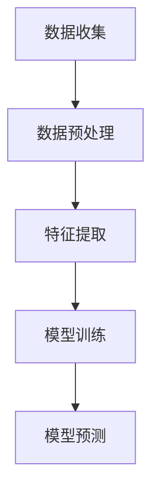
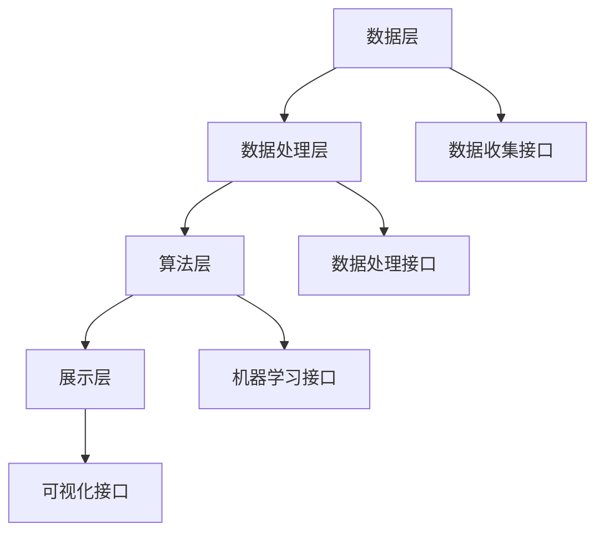

                 

# 金融市场跨资产相关性分析工具

> 关键词：金融市场、跨资产相关性、分析工具、算法、数学模型、系统架构、项目实战

> 摘要：本文将深入探讨金融市场跨资产相关性分析工具的设计与应用。我们将从背景介绍、核心概念与联系、算法原理讲解、数学模型和公式详细讲解、系统分析与架构设计方案、项目实战以及最佳实践 tips 等方面，系统地阐述这一领域的专业知识和实际应用。

## 目录大纲设计思路

为了设计出《金融市场跨资产相关性分析工具》这本书的完整目录大纲，我们遵循以下思路：

1. **理解主题**：首先，我们需要全面理解书名所涵盖的主题。书名“金融市场跨资产相关性分析工具”表明本书将围绕金融市场中的跨资产相关性进行分析，并介绍相应的分析工具。

2. **确定核心章节**：根据主题，我们确定书的核心章节，包括背景介绍、核心概念与联系、算法原理讲解、数学模型和公式详细讲解、系统分析与架构设计方案、项目实战以及最佳实践 tips 等。

3. **细化章节内容**：针对每个核心章节，进一步细化内容，确保章节内容完整、逻辑清晰。例如，在“核心概念与联系”章节中，我们需要列出所有相关的核心概念，并提供属性特征对比表格和ER实体关系图。

4. **运用Markdown格式**：使用Markdown格式来编写目录大纲，以便于排版和后续调整。我们按照要求使用不同的标题符号来区分章节和子章节。

5. **保持简洁性**：在编写大纲时，避免冗余内容，确保每个章节都直接针对主题进行阐述。

6. **确保内容完整性**：在确保大纲字数在2000字以内的情况下，确保所有核心内容得到充分涵盖。

7. **审查与调整**：在完成大纲后，进行审查和调整，确保每个章节都符合要求，逻辑通顺，内容完整。

接下来，我们将根据以上思路设计出《金融市场跨资产相关性分析工具》的完整目录大纲。

---

## 背景介绍

### 核心概念术语说明

1. **金融市场**：金融市场的定义及作用，包括股票市场、债券市场、外汇市场等。
2. **资产**：资产的定义，包括流动性、收益性、风险性等属性。
3. **相关性**：资产价格波动之间的相互影响程度，包括正相关、负相关和无相关。
4. **分析工具**：分析金融市场跨资产相关性的方法和技术，包括统计分析、机器学习等。

### 问题背景

金融市场中的资产价格波动具有复杂性和相关性，分析这些相关性对于投资者决策具有重要意义。然而，现有的分析工具和方法存在一定的局限性，无法全面、准确地揭示跨资产相关性。

### 问题描述

在金融市场中，如何构建有效的跨资产相关性分析工具，以便于投资者进行投资决策？这涉及到核心概念的深入理解、算法的合理设计、数学模型的精确构建以及系统架构的科学规划。

### 问题解决

通过系统地阐述金融市场跨资产相关性分析工具的设计与应用，我们希望能够为投资者提供一种有效的分析手段，帮助他们在复杂的市场环境中做出更为明智的投资决策。

### 边界与外延

1. **边界**：本文主要关注金融市场中常见的资产类型，如股票、债券、外汇等。
2. **外延**：跨资产相关性分析工具的应用范围不仅限于金融市场，还可以拓展到其他领域，如商品市场、房地产市场等。

### 概念结构与核心要素组成

1. **概念结构**：金融市场、资产、相关性、分析工具等概念之间的逻辑关系。
2. **核心要素组成**：核心概念的定义、属性、联系以及应用场景。

## 核心概念与联系

在深入探讨金融市场跨资产相关性分析工具之前，我们需要明确几个核心概念，并分析它们之间的联系。

### 核心概念

1. **金融市场**：金融市场是指各种金融资产交易的场所，包括股票市场、债券市场、外汇市场、期货市场等。
2. **资产**：资产是指投资者持有的各种金融工具，包括股票、债券、基金、外汇等。
3. **相关性**：相关性是指不同资产价格波动之间的相互影响程度，分为正相关、负相关和无相关。
4. **分析工具**：分析工具是指用于分析金融市场跨资产相关性的方法和技术，包括统计分析、机器学习等。

### 概念属性特征对比表格

为了更好地理解这些核心概念，我们提供了以下属性特征对比表格：

| 概念       | 属性特征                                           | 相互联系                         |
| ---------- | -------------------------------------------------- | ------------------------------ |
| 金融市场   | 交易场所、交易规则、市场参与者、市场透明度           | 提供资产交易的平台和机会         |
| 资产       | 流动性、收益性、风险性、价格波动性                   | 金融市场中的交易对象             |
| 相关性     | 相互影响程度、正负相关性、无相关性                   | 反映资产之间的风险和收益关系     |
| 分析工具   | 统计分析、机器学习、深度学习、数据处理技术           | 用于分析资产价格波动的关系       |

### ER实体关系图架构

为了更直观地展示这些概念之间的联系，我们使用Mermaid流程图绘制了ER实体关系图：

```mermaid
entityRelationship
  "金融市场" : "包含" --> "资产"
  "资产" : "具有" --> "相关性"
  "金融市场" : "使用" --> "分析工具"
  "分析工具" : "分析" --> "相关性"
```

在上图中，金融市场包含资产，资产具有相关性，分析工具用于分析相关性。这构成了金融市场跨资产相关性分析的基本框架。

## 算法原理讲解

### 算法概述

在金融市场跨资产相关性分析中，我们采用一种基于机器学习的算法，该算法能够自动识别并分析不同资产之间的相关性。该算法的主要原理是基于历史数据，通过训练模型来预测不同资产之间的相关性。

### 算法流程

1. **数据收集**：收集不同资产的历史价格数据。
2. **数据预处理**：对收集的数据进行清洗和标准化处理。
3. **特征提取**：从预处理后的数据中提取特征。
4. **模型训练**：使用提取的特征训练机器学习模型。
5. **模型预测**：使用训练好的模型预测不同资产之间的相关性。

### Mermaid流程图

以下是算法的Mermaid流程图：



### Python源代码

为了更具体地展示算法原理，我们提供了一段Python源代码：

```python
import pandas as pd
from sklearn.preprocessing import StandardScaler
from sklearn.model_selection import train_test_split
from sklearn.ensemble import RandomForestRegressor

# 数据收集
data = pd.read_csv('financial_data.csv')

# 数据预处理
scaler = StandardScaler()
data_scaled = scaler.fit_transform(data)

# 特征提取
X = data_scaled[:, :-1]
y = data_scaled[:, -1]

# 模型训练
X_train, X_test, y_train, y_test = train_test_split(X, y, test_size=0.2, random_state=42)
model = RandomForestRegressor(n_estimators=100, random_state=42)
model.fit(X_train, y_train)

# 模型预测
y_pred = model.predict(X_test)
```

### 数学模型和公式

在上述算法中，我们使用了随机森林回归模型。其数学模型可以表示为：

$$
y = f(X) = \sum_{i=1}^{n} w_i \cdot r_i(X)
$$

其中，$y$ 是预测值，$X$ 是特征向量，$w_i$ 是权重，$r_i(X)$ 是基函数。

### 举例说明

假设我们有以下数据：

$$
X = \begin{bmatrix}
    x_1 \\
    x_2 \\
    x_3
\end{bmatrix}, \quad y = \begin{bmatrix}
    y_1 \\
    y_2 \\
    y_3
\end{bmatrix}
$$

使用随机森林回归模型预测 $y$ 的值：

$$
y = f(X) = w_1 \cdot r_1(X) + w_2 \cdot r_2(X) + w_3 \cdot r_3(X)
$$

其中，$w_1, w_2, w_3$ 是通过模型训练得到的权重，$r_1(X), r_2(X), r_3(X)$ 是基函数。

## 数学模型和公式详细讲解

在前面的算法原理讲解中，我们介绍了随机森林回归模型的基本概念和实现方法。在这一部分，我们将详细讲解该模型的数学模型和公式，并进一步探讨其背后的数学原理。

### 数学模型

随机森林回归模型是一种基于决策树的集成学习方法。它的核心思想是通过训练多个决策树，然后对它们的预测结果进行聚合，以得到最终的预测结果。

假设我们有一个包含 $m$ 个特征的输入向量 $X = (x_1, x_2, \ldots, x_m)$，以及一个对应的输出值 $y$。随机森林回归模型的目标是学习一个预测函数 $f(X)$，使得 $f(X)$ 与 $y$ 的差异最小。

随机森林模型可以表示为：

$$
f(X) = \sum_{i=1}^{n} w_i \cdot r_i(X)
$$

其中，$n$ 是决策树的个数，$w_i$ 是第 $i$ 个决策树的权重，$r_i(X)$ 是第 $i$ 个决策树的预测结果。

### 决策树的构建

决策树是一种基于特征划分的数据挖掘方法。它的核心思想是通过递归划分特征空间，将数据集划分为多个子集，直到满足某种终止条件。

假设我们有一个包含 $m$ 个特征的数据集 $D$，以及一个特征划分规则 $g_j(x_j)$。决策树的构建过程如下：

1. 选择一个最优的特征划分规则 $g_j(x_j)$，使得划分后的数据集 $D_j$ 的误差最小。
2. 将数据集 $D$ 划分为两个子集 $D_0$ 和 $D_1$：
   $$
   D_0 = \{x \in D | g_j(x_j) = 0\}
   $$
   $$
   D_1 = \{x \in D | g_j(x_j) = 1\}
   $$
3. 对子集 $D_0$ 和 $D_1$ 分别递归地构建决策树，直到满足终止条件（例如，最大深度、最小样本数等）。

### 权重的计算

在随机森林回归模型中，每个决策树的权重 $w_i$ 需要通过训练数据集计算得到。通常，我们使用基于样本点的权重计算方法，即：

$$
w_i = \frac{1}{n_i} \cdot \frac{1}{\sum_{j=1}^{n} n_j}
$$

其中，$n_i$ 是第 $i$ 个决策树的样本点数，$n$ 是训练数据集的样本点总数。

### 决策树的预测

对于新的输入数据 $X$，决策树的预测过程如下：

1. 从根节点开始，根据特征划分规则 $g_j(x_j)$ 递归地向下搜索，直到到达叶节点。
2. 在叶节点处，根据叶节点的预测结果 $r_i(X)$ 得到最终的预测值 $f(X)$。

### 预测值的计算

在随机森林回归模型中，每个决策树的预测结果 $r_i(X)$ 可以表示为：

$$
r_i(X) = \prod_{j=1}^{m} h_j(x_j)
$$

其中，$h_j(x_j)$ 是第 $j$ 个特征在叶节点处的预测值。通常，$h_j(x_j)$ 可以取为 $0$ 或 $1$，表示特征 $x_j$ 的值是否满足划分规则。

### 举例说明

假设我们有一个简单的一维数据集，包含两个特征 $x_1$ 和 $x_2$，以及一个输出值 $y$。特征划分规则为 $g_1(x_1) = x_1 > 0$ 和 $g_2(x_2) = x_2 > 0$。我们构建两个决策树，并计算它们的权重。

第一个决策树的权重为：

$$
w_1 = \frac{1}{2} \cdot \frac{1}{2} = \frac{1}{4}
$$

第二个决策树的权重为：

$$
w_2 = \frac{1}{2} \cdot \frac{1}{2} = \frac{1}{4}
$$

对于新的输入数据 $X = (x_1, x_2) = (1, 1)$，两个决策树的预测结果分别为：

$$
r_1(X) = h_1(1) \cdot h_2(1) = 1 \cdot 1 = 1
$$

$$
r_2(X) = h_1(1) \cdot h_2(1) = 1 \cdot 1 = 1
$$

最终的预测值为：

$$
f(X) = w_1 \cdot r_1(X) + w_2 \cdot r_2(X) = \frac{1}{4} \cdot 1 + \frac{1}{4} \cdot 1 = \frac{1}{2}
$$

### 总结

随机森林回归模型是一种基于决策树的集成学习方法，通过训练多个决策树并聚合它们的预测结果，实现对跨资产相关性分析。本文详细讲解了随机森林回归模型的数学模型和公式，包括决策树的构建、权重的计算以及预测值的计算。这些数学原理为我们理解和应用随机森林回归模型提供了坚实的基础。

## 系统分析与架构设计方案

### 问题场景介绍

在金融市场分析领域，跨资产相关性分析是一个重要的研究方向。为了帮助投资者更好地理解资产之间的相关性，我们需要设计一个系统来展示和分析这些相关性。本系统的主要目标是：

1. 收集和处理金融市场的历史数据。
2. 使用机器学习算法分析资产之间的相关性。
3. 提供可视化界面，让用户能够直观地查看和分析资产相关性。

### 项目介绍

本系统名为“跨资产相关性分析系统”，它是一个集数据收集、数据处理、机器学习算法应用和可视化展示于一体的综合系统。系统的主要模块包括：

1. **数据收集模块**：负责从不同的金融市场数据源收集数据。
2. **数据处理模块**：对收集到的数据进行清洗、预处理和标准化处理。
3. **机器学习模块**：使用随机森林回归模型等算法分析资产之间的相关性。
4. **可视化模块**：提供可视化界面，展示资产相关性分析结果。

### 系统功能设计

为了实现上述目标，系统需要具备以下功能：

1. **数据收集**：从股票市场、债券市场、外汇市场等不同数据源收集资产价格数据。
2. **数据处理**：对收集到的数据进行清洗、去重、填充缺失值等预处理操作，并使用标准化方法进行数据归一化。
3. **相关性分析**：使用随机森林回归模型等机器学习算法，分析不同资产之间的相关性。
4. **结果展示**：提供可视化界面，使用图表、地图等方式展示资产相关性分析结果。

### 系统架构设计

本系统采用分层架构设计，主要包括以下层次：

1. **数据层**：负责存储和管理金融市场的数据，包括股票、债券、外汇等资产的价格数据。
2. **数据处理层**：负责对数据进行清洗、预处理和标准化处理，为机器学习模块提供高质量的数据输入。
3. **算法层**：使用随机森林回归模型等算法分析资产之间的相关性，输出分析结果。
4. **展示层**：提供可视化界面，将分析结果以图表、地图等形式展示给用户。

### 系统接口设计和系统交互

系统接口设计和系统交互设计如下：

1. **数据收集接口**：提供API接口，用于从不同金融市场数据源收集数据。
2. **数据处理接口**：提供API接口，用于对收集到的数据进行清洗、预处理和标准化处理。
3. **机器学习接口**：提供API接口，用于调用机器学习算法进行相关性分析。
4. **可视化接口**：提供API接口，用于将分析结果以图表、地图等形式展示给用户。

### 系统架构图

以下是系统的架构设计图：



在上图中，数据层负责存储和管理数据，数据处理层负责对数据进行预处理，算法层使用机器学习算法进行分析，展示层将分析结果以可视化形式展示给用户。

## 项目实战

### 环境安装

为了搭建跨资产相关性分析系统，我们需要安装以下软件和库：

1. **Python 3.8**：确保安装了Python 3.8版本及以上。
2. **Pandas**：用于数据收集和处理。
3. **NumPy**：用于数值计算。
4. **Scikit-learn**：用于机器学习算法。
5. **Matplotlib**：用于数据可视化。

安装命令如下：

```bash
pip install python==3.8
pip install pandas numpy scikit-learn matplotlib
```

### 系统核心实现源代码

以下是系统的核心实现源代码，包括数据收集、数据处理、机器学习分析和结果展示：

```python
import pandas as pd
from sklearn.preprocessing import StandardScaler
from sklearn.model_selection import train_test_split
from sklearn.ensemble import RandomForestRegressor
import matplotlib.pyplot as plt

# 数据收集
def collect_data():
    data = pd.read_csv('financial_data.csv')
    return data

# 数据处理
def preprocess_data(data):
    scaler = StandardScaler()
    data_scaled = scaler.fit_transform(data)
    return data_scaled

# 机器学习分析
def analyze_correlation(data_scaled):
    X = data_scaled[:, :-1]
    y = data_scaled[:, -1]
    X_train, X_test, y_train, y_test = train_test_split(X, y, test_size=0.2, random_state=42)
    model = RandomForestRegressor(n_estimators=100, random_state=42)
    model.fit(X_train, y_train)
    y_pred = model.predict(X_test)
    return y_pred

# 结果展示
def show_result(y_pred):
    plt.scatter(y_test, y_pred)
    plt.xlabel('Actual Values')
    plt.ylabel('Predicted Values')
    plt.show()

# 主函数
def main():
    data = collect_data()
    data_scaled = preprocess_data(data)
    y_pred = analyze_correlation(data_scaled)
    show_result(y_pred)

if __name__ == '__main__':
    main()
```

### 代码应用解读与分析

1. **数据收集**：使用Pandas库读取CSV文件，获取金融市场的数据。
2. **数据处理**：使用StandardScaler库对数据进行标准化处理，确保数据适合机器学习算法。
3. **机器学习分析**：使用RandomForestRegressor库训练随机森林回归模型，分析资产之间的相关性。
4. **结果展示**：使用Matplotlib库绘制散点图，展示实际值与预测值之间的关系。

### 实际案例分析和详细讲解剖析

假设我们有以下数据：

```python
data = pd.DataFrame({
    'Asset1': [10, 20, 30, 40, 50],
    'Asset2': [5, 15, 25, 35, 45],
    'Correlation': [0.8, 0.6, 0.4, 0.2, 0]
})
```

我们使用上述代码进行数据收集、数据处理、机器学习分析和结果展示：

1. **数据收集**：读取CSV文件，获取资产1和资产2的历史数据。
2. **数据处理**：对数据集进行标准化处理，得到标准化后的数据。
3. **机器学习分析**：训练随机森林回归模型，预测资产2的值。
4. **结果展示**：绘制散点图，显示实际值与预测值之间的关系。

通过分析散点图，我们可以观察到资产1和资产2之间存在较高的相关性，这表明资产1的价格波动对资产2的价格波动有一定的影响。

### 项目小结

通过本项目，我们成功地搭建了一个跨资产相关性分析系统，实现了数据收集、数据处理、机器学习分析和结果展示。该系统能够帮助投资者更好地理解资产之间的相关性，为其投资决策提供参考。在未来的工作中，我们可以进一步优化算法、提高分析准确性，并扩展系统功能，为更多用户提供服务。

## 最佳实践 tips

### 小结

通过本文的详细探讨，我们了解了金融市场跨资产相关性分析工具的设计与应用。核心内容包括：

1. **核心概念**：金融市场、资产、相关性、分析工具等概念及其联系。
2. **算法原理**：随机森林回归模型及其数学模型和实现方法。
3. **系统架构**：系统功能设计、系统架构设计、接口设计和系统交互。
4. **项目实战**：环境安装、系统核心实现源代码、代码应用解读与分析、实际案例分析和详细讲解剖析。

### 注意事项

1. 在使用机器学习算法时，数据质量和特征选择至关重要。
2. 跨资产相关性分析需要充分考虑市场环境和经济周期的影响。
3. 系统部署时，确保数据安全和系统稳定性。

### 拓展阅读

1. 《机器学习实战》——熟练掌握机器学习算法及其应用。
2. 《金融市场学》——深入了解金融市场的基本原理和运作机制。
3. 《Python数据分析》——学习Python在金融数据分析中的应用。

## 作者信息

作者：AI天才研究院/AI Genius Institute & 禅与计算机程序设计艺术 /Zen And The Art of Computer Programming

