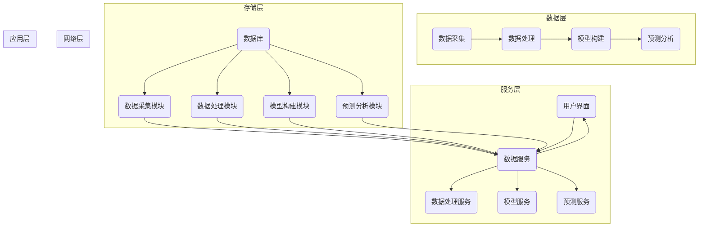
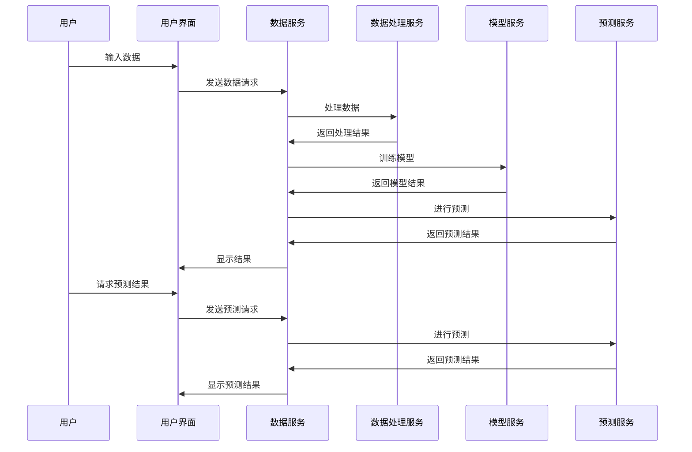

                 

### 第1章：问题背景与定义

#### 1.1 问题背景

**金融市场与金融政策的概述**

金融市场是指各种金融工具进行交易的场所，包括股票市场、债券市场、外汇市场、期货市场等。金融市场的作用在于为资金的供需双方提供交易平台，调节资本流向，促进经济发展。

金融政策则是由政府或中央银行制定和实施的，旨在影响金融市场运行的一系列政策措施。这些政策工具有利率、货币供应量、信贷政策、外汇政策等。金融政策的主要目标包括保持物价稳定、促进经济增长、控制通货膨胀、维护金融稳定等。

金融政策对经济的影响是多方面的。例如，降低利率可以刺激投资和消费，从而促进经济增长；调整货币供应量可以影响通货膨胀水平；外汇政策则会影响国际收支和汇率变动。

**金融政策对经济的影响**

金融政策对经济的影响具有间接性和多层次性。首先，金融政策会通过利率、货币供应量等工具直接影响金融市场的运行。其次，金融市场的变化会进一步影响企业投资、消费者行为、就业水平等宏观经济变量。例如，当政府降低利率时，企业融资成本降低，更容易获得资金支持，从而增加投资；消费者由于利率下降，借贷成本降低，更倾向于消费。

此外，金融政策还会通过金融市场与实体经济之间的相互作用，影响经济的整体运行。例如，金融市场的波动可能会影响企业信心，进而影响企业的投资决策。同时，金融市场的动荡也可能导致消费者信心下降，影响消费行为。

#### 1.2 金融政策影响定量评估的定义

**金融政策影响的内涵**

金融政策影响定量评估，是指通过量化方法，对金融政策在经济、金融市场等方面的具体影响进行评估。这包括对政策实施前后经济指标的变化、金融市场变量之间的关系等进行定量分析。

**评估模型的目标和意义**

评估模型的目标在于准确、全面地反映金融政策的影响，为政策制定者和经济研究者提供科学依据。具体来说，评估模型的意义在于：

1. **政策优化**：通过定量评估，可以发现金融政策的优点和不足，为政策调整提供依据。
2. **风险预测**：评估模型可以帮助预测金融政策实施可能带来的风险，提前采取措施。
3. **决策支持**：为政府、企业、金融机构等提供数据支持，帮助他们做出更加科学的决策。

#### 1.3 金融政策影响评估的挑战

**数据获取与处理**

金融政策影响评估的第一大挑战是数据的获取与处理。金融数据通常量大且复杂，包括但不限于宏观经济数据、金融市场数据、政策实施数据等。这些数据需要从多个来源收集，并进行清洗、整合和预处理，以确保其质量和完整性。

**模型选择与优化**

金融政策影响评估的第二大挑战是模型的选择与优化。由于金融市场的复杂性，需要选择合适的模型来捕捉政策影响。此外，模型需要不断优化，以适应不断变化的经济环境和政策条件。

**其他挑战**

除了上述两个主要挑战外，金融政策影响评估还可能面临以下挑战：

1. **政策时滞**：政策实施到影响显现之间存在时滞，这给评估带来难度。
2. **外部因素**：金融政策的影响还可能受到国际经济环境、国内经济状况等外部因素的影响。
3. **数据隐私与伦理**：金融数据的获取和处理可能涉及数据隐私和伦理问题。

### 1.4 概念结构与核心要素组成

**金融政策的核心概念**

- **政策工具**：利率、货币供应量、信贷政策、外汇政策等。
- **政策目标**：保持物价稳定、促进经济增长、控制通货膨胀、维护金融稳定等。

**金融市场的核心概念**

- **市场参与者**：企业、投资者、金融机构等。
- **市场机制**：价格机制、供求机制、风险分散机制等。

**金融政策与市场的联系**

- **交互关系**：金融政策通过政策工具影响金融市场，金融市场则通过市场机制反馈政策。
- **影响路径**：政策影响通过市场传导到实体经济，进而影响宏观经济。
- **动态反馈机制**：金融市场的变化会反过来影响金融政策，形成一个动态反馈机制。

**评估模型的核心要素**

- **数据来源**：宏观经济数据、金融市场数据、政策实施数据等。
- **模型构建**：选择合适的数学模型，如回归模型、时间序列模型等。
- **算法应用**：使用算法对数据进行分析，以评估政策影响。

通过上述分析，我们可以看出，金融政策影响定量评估是一个复杂而重要的问题。为了解决这一挑战，我们需要综合运用数据科学、经济学和计算机科学等领域的知识，构建一个科学、高效的评估模型。

### 1.5 背景介绍

#### 核心概念术语说明

在讨论金融政策影响定量评估时，我们需要明确几个核心概念和术语：

1. **金融政策**：这是指政府或中央银行为影响金融市场和宏观经济的运行而制定的一系列政策措施。常见的金融政策工具包括利率、货币供应量、信贷政策和外汇政策等。

2. **金融市场**：这是指各种金融工具进行交易的场所和机制。金融市场包括股票市场、债券市场、外汇市场、期货市场等。金融市场的参与者主要有企业、投资者、金融机构等。

3. **定量评估模型**：这是指用于量化分析金融政策影响的数学模型。这些模型可以是回归模型、时间序列模型、机器学习模型等。

4. **数据**：定量评估模型的基础是数据，包括宏观经济数据、金融市场数据和政策实施数据等。这些数据需要从多个来源收集，并进行清洗、整合和预处理。

#### 问题背景

金融政策对经济的影响是一个复杂的过程，涉及到多个环节和变量。为了理解这种影响，我们需要从以下几个方面来探讨：

1. **金融市场的作用**：金融市场在资源配置、风险管理、资本积累等方面发挥着重要作用。金融政策的制定和实施会直接或间接影响金融市场的运行，从而影响经济。

2. **政策工具的运用**：金融政策通过利率、货币供应量、信贷政策和外汇政策等工具来影响金融市场。例如，降低利率可以刺激投资和消费，提高货币供应量可以促进经济增长。

3. **经济变量的传导**：金融政策的实施会通过市场机制传导到实体经济，影响宏观经济变量。例如，利率的调整会影响企业融资成本，从而影响企业的投资决策。

4. **政策目标的实现**：金融政策的最终目标是实现宏观经济的稳定和发展。通过定量评估模型，我们可以评估金融政策对宏观经济目标的实现程度。

#### 问题描述

金融政策影响定量评估的问题可以描述为：如何通过科学的方法和模型，量化金融政策对经济和金融市场的影响？具体来说，这个问题涉及到以下几个方面：

1. **数据收集和处理**：首先需要收集与金融政策相关的各种数据，包括宏观经济数据、金融市场数据和政策实施数据等。然后对这些数据进行清洗、整合和预处理，以确保其质量和完整性。

2. **模型选择和构建**：选择合适的定量评估模型，如回归模型、时间序列模型等。构建模型的过程包括变量选择、模型设定、参数估计等。

3. **算法应用和分析**：使用算法对数据进行处理和分析，以评估金融政策的影响。这包括模型训练、预测、敏感性分析等。

4. **结果解读和应用**：对评估结果进行解读，分析金融政策的优点和不足，为政策制定者提供参考。

#### 问题解决

为了解决金融政策影响定量评估的问题，我们可以采取以下步骤：

1. **明确评估目标**：首先需要明确评估的目标和指标，例如经济增长率、通货膨胀率、利率等。

2. **数据收集和处理**：从多个来源收集数据，包括国家统计局、央行、证券交易所等。对数据进行清洗、整合和预处理，确保数据的准确性和一致性。

3. **模型选择和构建**：根据评估目标，选择合适的模型，如回归模型、时间序列模型等。构建模型时，需要考虑变量之间的关系、模型的假设条件等。

4. **算法应用和分析**：使用算法对数据进行训练和预测，分析金融政策的影响。这包括模型参数估计、预测准确性评估等。

5. **结果解读和应用**：对评估结果进行解读，分析金融政策的优点和不足，为政策制定者提供参考。

#### 边界与外延

金融政策影响定量评估的边界主要在于数据的可获得性和模型的适用性。数据的边界在于数据的真实性和完整性，模型的边界在于模型的选择和优化。

金融政策影响定量评估的外延包括以下几个方面：

1. **政策工具的多样性**：金融政策涉及多种工具，如利率、货币供应量、信贷政策、外汇政策等，这些工具对经济的影响不同，评估模型也需要根据具体工具进行调整。

2. **市场环境的复杂性**：金融市场的运行受到多种外部因素的影响，如国际经济环境、国内经济状况、政策变化等，这些因素都会影响评估模型的准确性。

3. **评估方法的多样性**：除了传统的回归模型、时间序列模型外，还可以使用机器学习等方法进行评估。不同的评估方法有其适用范围和优缺点，需要根据具体情况选择。

4. **政策时滞的影响**：金融政策的影响存在时滞，从政策实施到影响显现需要一定时间。在评估时需要考虑时滞的影响，以避免评估结果的不准确。

#### 概念结构与核心要素组成

**金融政策的核心概念**

- **政策工具**：利率、货币供应量、信贷政策、外汇政策等。
- **政策目标**：保持物价稳定、促进经济增长、控制通货膨胀、维护金融稳定等。

**金融市场的核心概念**

- **市场参与者**：企业、投资者、金融机构等。
- **市场机制**：价格机制、供求机制、风险分散机制等。

**金融政策与市场的联系**

- **交互关系**：金融政策通过政策工具影响金融市场，金融市场则通过市场机制反馈政策。
- **影响路径**：政策影响通过市场传导到实体经济，进而影响宏观经济。
- **动态反馈机制**：金融市场的变化会反过来影响金融政策，形成一个动态反馈机制。

**评估模型的核心要素**

- **数据来源**：宏观经济数据、金融市场数据、政策实施数据等。
- **模型构建**：选择合适的数学模型，如回归模型、时间序列模型等。
- **算法应用**：使用算法对数据进行分析，以评估政策影响。

通过上述分析，我们可以看出，金融政策影响定量评估是一个复杂而重要的问题。为了解决这一挑战，我们需要综合运用数据科学、经济学和计算机科学等领域的知识，构建一个科学、高效的评估模型。

### 1.6 核心概念与联系

#### 金融政策的核心概念

**政策工具**

金融政策工具是指用于影响金融市场和宏观经济的手段。这些工具包括：

1. **利率**：通过调整利率，可以影响企业的融资成本和消费者的借贷成本，从而影响投资和消费行为。
2. **货币供应量**：通过调整货币供应量，可以影响市场的流动性和通货膨胀水平。
3. **信贷政策**：通过调整信贷政策，可以影响银行的贷款标准和贷款利率，从而影响企业的融资环境。
4. **外汇政策**：通过调整汇率和外汇管理政策，可以影响国际收支和汇率稳定性。

**政策目标**

金融政策的目标主要包括：

1. **物价稳定**：通过控制通货膨胀，保持物价的基本稳定，从而保障消费者的购买力。
2. **经济增长**：通过刺激投资和消费，促进经济的增长。
3. **控制通货膨胀**：通过调整货币供应量和利率，控制通货膨胀水平，防止经济过热。
4. **维护金融稳定**：通过监管金融市场，防止金融风险，保障金融系统的稳定性。

**政策工具与目标的关系**

金融政策的工具和目标之间存在密切的联系。例如，通过降低利率，可以刺激投资和消费，从而实现经济增长；通过控制货币供应量，可以影响通货膨胀水平，实现物价稳定。因此，选择合适的政策工具，并根据经济状况进行调整，是实现政策目标的必要手段。

#### 金融市场的核心概念

**市场参与者**

金融市场的主要参与者包括：

1. **企业**：作为资金的需求方，企业通过发行股票、债券等方式筹集资金。
2. **投资者**：作为资金供给方，投资者通过购买股票、债券等方式投资于金融市场。
3. **金融机构**：如银行、保险公司、证券公司等，它们在金融市场中发挥中介和监管作用。

**市场机制**

金融市场的基本机制包括：

1. **价格机制**：市场价格的变动反映了供求关系的变化，是金融市场的核心机制。
2. **供求机制**：供求关系的变化会影响市场价格，进而影响金融工具的发行和交易。
3. **风险分散机制**：金融市场通过多样化的投资组合，降低投资风险。

**市场参与者与市场机制的关系**

金融市场中的参与者通过市场机制相互作用，共同影响金融市场的运行。例如，企业的融资需求会影响利率水平，投资者的投资行为会影响股票价格。同时，市场机制的运行也受到金融政策的影响，如货币政策会通过利率和货币供应量影响市场供求关系。

#### 金融政策与市场的联系

**交互关系**

金融政策与金融市场之间存在密切的交互关系。一方面，金融政策通过政策工具影响金融市场，例如通过调整利率和货币供应量，影响市场的资金供给和需求。另一方面，金融市场的变化也会通过市场机制反馈到金融政策上，例如市场利率的变动会影响政府的货币政策决策。

**影响路径**

金融政策对市场的影响主要通过以下路径：

1. **利率传导**：通过调整利率，影响企业的融资成本和消费者的借贷成本，进而影响投资和消费行为。
2. **货币供应量传导**：通过调整货币供应量，影响市场的流动性和通货膨胀水平，进而影响宏观经济。
3. **信贷政策传导**：通过调整信贷政策，影响银行的贷款标准和贷款利率，进而影响企业的融资环境。
4. **外汇政策传导**：通过调整汇率和外汇管理政策，影响国际收支和汇率稳定性。

**动态反馈机制**

金融市场与金融政策之间存在动态反馈机制。一方面，金融市场的运行状况会影响金融政策的制定和调整。例如，市场利率的波动会影响政府的货币政策。另一方面，金融政策的调整也会影响金融市场的运行。例如，货币政策的放松会增加市场的流动性，刺激投资和消费。这种反馈机制使得金融政策与市场之间的关系不断变化和调整。

#### 动态反馈机制的原理

**市场驱动政策调整**

金融市场的不稳定性可能会促使政府调整金融政策。例如，在市场利率上升时，政府可能会通过降低利率来刺激经济增长。同样，在通货膨胀压力增大时，政府可能会通过提高利率来控制物价。

**政策影响市场行为**

金融政策的调整会影响市场参与者的行为。例如，降低利率会降低企业的融资成本，从而刺激投资。提高货币供应量会增加市场的流动性，从而促进消费。

**市场和政策相互调整**

市场和政策之间存在相互调整的动态过程。市场状况会影响政策的制定和调整，而政策的调整又会影响市场行为和市场状况。这种相互影响和调整构成了金融市场的动态反馈机制。

### 1.7 金融政策影响定量评估的基本框架

**评估框架的构建**

金融政策影响定量评估的基本框架包括以下几个关键环节：

1. **目标设定**：明确评估的目标和指标，如经济增长率、通货膨胀率、利率等。
2. **数据收集**：收集与金融政策相关的各种数据，包括宏观经济数据、金融市场数据和政策实施数据等。
3. **模型选择**：根据评估目标，选择合适的定量评估模型，如回归模型、时间序列模型等。
4. **模型构建**：设定模型结构，确定变量，进行参数估计。
5. **数据分析**：使用算法对数据进行分析，评估金融政策的影响。
6. **结果解读**：对评估结果进行解读，分析金融政策的优点和不足。
7. **应用反馈**：将评估结果应用于政策制定和调整。

**各环节的联系**

- **目标设定**为后续的数据收集和模型选择提供了方向和依据。
- **数据收集**是模型构建的基础，数据的质量直接影响评估结果的准确性。
- **模型选择**和**模型构建**是评估的核心，决定了评估方法的有效性。
- **数据分析**和**结果解读**将评估结果转化为有用的信息，为政策制定提供支持。
- **应用反馈**将评估结果应用于政策实践，形成闭环，不断优化评估模型。

### 1.8 金融政策影响定量评估的应用场景

**政策制定与调整**

金融政策影响定量评估可以帮助政府制定和调整金融政策。通过评估不同政策工具对经济的影响，政府可以优化政策组合，提高政策效果。例如，通过评估利率调整对经济增长和通货膨胀的影响，政府可以决定是否调整利率。

**金融市场监管**

金融政策影响定量评估可以帮助监管机构了解金融市场的运行状况，发现潜在风险。通过评估金融政策对金融市场的影响，监管机构可以及时调整监管策略，维护金融市场的稳定性。

**企业决策**

金融政策影响定量评估可以帮助企业了解政策变化对企业经营的影响，制定相应的经营策略。例如，通过评估货币政策对企业融资成本的影响，企业可以决定是否增加投资。

**学术研究**

金融政策影响定量评估为学术研究提供了数据支持和理论验证。研究人员可以通过定量评估模型，探索金融政策与经济之间的复杂关系，为金融理论的完善提供实证依据。

### 1.9 金融政策影响定量评估的难点与挑战

**数据获取与处理**

金融政策影响定量评估首先面临的挑战是数据的获取与处理。金融数据通常来自多个来源，包括国家统计局、央行、证券交易所等。这些数据可能存在不一致、不准确的问题，需要通过清洗、整合和预处理来确保其质量。

**模型选择与优化**

金融市场的复杂性使得模型选择和优化成为一个难点。选择合适的模型需要考虑数据特征、政策目标等因素。同时，模型的优化也是一个挑战，需要不断调整模型参数，以提高评估的准确性。

**政策时滞的影响**

政策实施到影响显现之间存在时滞，这给评估带来了难度。例如，货币政策的影响可能需要一段时间才能在宏观经济中显现。因此，评估时需要考虑时滞的影响，避免评估结果的不准确。

**外部因素的干扰**

金融政策的影响还可能受到外部因素的影响，如国际经济环境、国内经济状况等。这些因素可能会改变金融政策的效果，使得评估结果存在不确定性。

**数据隐私与伦理**

在收集和处理金融数据时，还需要考虑数据隐私和伦理问题。如何保护数据隐私，同时确保评估结果的准确性，是一个重要的挑战。

### 1.10 金融政策影响定量评估的意义

**政策优化**

金融政策影响定量评估可以帮助政府优化金融政策。通过评估不同政策工具的效果，政府可以调整政策组合，提高政策效果。

**风险预测**

评估模型可以帮助预测金融政策实施可能带来的风险，为政府和企业提供预警。

**决策支持**

金融政策影响定量评估为政府、企业和金融机构提供了数据支持，帮助他们做出更加科学的决策。

**学术研究**

定量评估模型为金融学术研究提供了数据和方法支持，有助于深化对金融政策与经济关系的理解。

### 1.11 总结

金融政策影响定量评估是一个复杂而重要的问题。通过明确核心概念、构建评估框架、分析应用场景和难点，我们可以更好地理解这一领域。为了解决金融政策影响定量评估的挑战，需要综合运用数据科学、经济学和计算机科学等领域的知识，构建科学、高效的评估模型。这不仅有助于政策制定和优化，也为学术研究提供了有力支持。

---

### 第2章：核心概念与联系

在深入探讨金融政策影响定量评估之前，我们需要明确几个核心概念，并理解它们之间的联系。这些概念包括金融政策、金融市场、政策工具和政策目标。通过理解这些概念，我们可以更好地构建定量评估模型，并准确分析金融政策对经济和市场的影响。

#### 2.1 金融政策的核心概念

**政策工具**

金融政策工具是指政府或中央银行用来调节金融市场和宏观经济的一系列手段。常见的政策工具有：

1. **利率**：通过调整利率，可以影响借款成本，进而影响投资和消费行为。
2. **货币供应量**：通过调整货币供应量，可以影响市场的资金供给和需求。
3. **信贷政策**：通过调整信贷政策，可以影响银行的贷款标准和贷款利率，从而影响企业的融资环境。
4. **外汇政策**：通过调整汇率和外汇管理政策，可以影响国际收支和汇率稳定性。

**政策目标**

金融政策的目标包括但不限于以下几方面：

1. **物价稳定**：通过控制通货膨胀，保持物价的基本稳定，从而保障消费者的购买力。
2. **经济增长**：通过刺激投资和消费，促进经济的增长。
3. **控制通货膨胀**：通过调整货币供应量和利率，控制通货膨胀水平，防止经济过热。
4. **维护金融稳定**：通过监管金融市场，防止金融风险，保障金融系统的稳定性。

**政策工具与目标的关系**

金融政策的工具和目标之间存在密切的关系。例如，通过降低利率，可以刺激投资和消费，从而实现经济增长；通过控制货币供应量，可以影响通货膨胀水平，实现物价稳定。因此，选择合适的政策工具，并根据经济状况进行调整，是实现政策目标的必要手段。

#### 2.2 金融市场的核心概念

**市场参与者**

金融市场的主要参与者包括：

1. **企业**：作为资金的需求方，企业通过发行股票、债券等方式筹集资金。
2. **投资者**：作为资金供给方，投资者通过购买股票、债券等方式投资于金融市场。
3. **金融机构**：如银行、保险公司、证券公司等，它们在金融市场中发挥中介和监管作用。

**市场机制**

金融市场的基本机制包括：

1. **价格机制**：市场价格的变动反映了供求关系的变化，是金融市场的核心机制。
2. **供求机制**：供求关系的变化会影响市场价格，进而影响金融工具的发行和交易。
3. **风险分散机制**：金融市场通过多样化的投资组合，降低投资风险。

**市场参与者与市场机制的关系**

金融市场中的参与者通过市场机制相互作用，共同影响金融市场的运行。例如，企业的融资需求会影响利率水平，投资者的投资行为会影响股票价格。同时，市场机制的运行也受到金融政策的影响，如货币政策会通过利率和货币供应量影响市场供求关系。

#### 2.3 金融政策与市场的联系

**交互关系**

金融政策与金融市场之间存在密切的交互关系。一方面，金融政策通过政策工具影响金融市场，例如通过调整利率和货币供应量，影响市场的资金供给和需求。另一方面，金融市场的变化也会通过市场机制反馈到金融政策上，例如市场利率的波动会影响政府的货币政策决策。

**影响路径**

金融政策对市场的影响主要通过以下路径：

1. **利率传导**：通过调整利率，影响企业的融资成本和消费者的借贷成本，进而影响投资和消费行为。
2. **货币供应量传导**：通过调整货币供应量，影响市场的流动性和通货膨胀水平，进而影响宏观经济。
3. **信贷政策传导**：通过调整信贷政策，影响银行的贷款标准和贷款利率，进而影响企业的融资环境。
4. **外汇政策传导**：通过调整汇率和外汇管理政策，影响国际收支和汇率稳定性。

**动态反馈机制**

金融市场与金融政策之间存在动态反馈机制。一方面，金融市场的运行状况会影响金融政策的制定和调整。例如，市场利率的波动会影响政府的货币政策。另一方面，金融政策的调整也会影响金融市场的运行。例如，货币政策的放松会增加市场的流动性，刺激投资和消费。这种反馈机制使得金融政策与市场之间的关系不断变化和调整。

#### 2.4 金融政策工具的属性特征对比

**利率**

- **属性特征**：利率是金融市场上资金的价格，反映市场对资金的供求关系。
- **优势**：灵活调整，可以快速响应市场变化。
- **劣势**：可能导致市场波动，影响金融稳定性。

**货币供应量**

- **属性特征**：货币供应量是市场中流通的货币总量。
- **优势**：影响市场的资金供给，对宏观经济有直接作用。
- **劣势**：调整可能导致通货膨胀，需要谨慎操作。

**信贷政策**

- **属性特征**：信贷政策通过调整银行贷款标准和贷款利率，影响企业的融资环境。
- **优势**：对实体经济有直接作用，可以刺激投资和消费。
- **劣势**：可能导致金融风险，影响金融市场的稳定性。

**外汇政策**

- **属性特征**：外汇政策通过调整汇率和外汇管理政策，影响国际收支和汇率稳定性。
- **优势**：维护国际竞争力，促进国际贸易。
- **劣势**：可能导致汇率波动，影响市场预期。

**对比表格**

| 政策工具 | 属性特征 | 优势 | 劣势 |
| --- | --- | --- | --- |
| 利率 | 资金价格 | 灵活调整 | 可能导致市场波动 |
| 货币供应量 | 货币总量 | 影响资金供给 | 可能导致通货膨胀 |
| 信贷政策 | 贷款标准和利率 | 刺激投资和消费 | 可能导致金融风险 |
| 外汇政策 | 汇率和外汇管理 | 维护国际竞争力 | 可能导致汇率波动 |

通过上述对比表格，我们可以更清晰地了解不同金融政策工具的属性特征、优势和劣势，为金融政策的选择和调整提供参考。

#### 2.5 金融市场的核心概念与联系

**市场参与者**

金融市场的主要参与者包括：

- **企业**：作为资金的需求方，企业通过发行股票、债券等方式筹集资金，以支持其运营和发展。
- **投资者**：作为资金的供给方，投资者通过购买股票、债券等金融工具，分享企业的增长和收益。
- **金融机构**：如银行、保险公司、证券公司等，它们在金融市场中发挥中介和监管作用，提供各种金融服务。

**市场机制**

金融市场的基本机制包括：

- **价格机制**：市场价格由供求关系决定，投资者通过市场价格反映对金融工具的估值。
- **供求机制**：供求关系的变化影响市场价格，进而影响金融工具的发行和交易。
- **风险分散机制**：投资者通过多元化的投资组合，降低投资风险。

**市场参与者与市场机制的关系**

市场参与者通过市场机制相互作用，共同影响金融市场的运行。例如，企业的融资需求会影响股票和债券的价格，投资者的投资行为会影响市场的供求关系。同时，市场机制的运行也受到金融政策的影响，如货币政策会通过利率和货币供应量影响市场供求关系。

#### 2.6 金融政策与市场的交互关系

**政策工具影响市场**

金融政策通过政策工具影响金融市场。例如，降低利率可以刺激投资和消费，提高货币供应量可以增加市场流动性，信贷政策的调整可以影响企业的融资环境。这些政策工具通过影响市场参与者（如企业、投资者）的行为，进而影响金融市场的运行。

**市场反馈影响政策**

金融市场的变化也会通过市场机制反馈到金融政策上。例如，市场利率的波动会影响政府的货币政策决策，市场流动性的变化会影响货币供应量的调整。这种动态反馈机制使得金融政策与市场之间的关系不断变化和调整。

#### 2.7 动态反馈机制的原理

**市场驱动政策调整**

金融市场的不稳定性可能会促使政府调整金融政策。例如，在市场利率上升时，政府可能会通过降低利率来刺激经济增长；在通货膨胀压力增大时，政府可能会通过提高利率来控制物价。

**政策影响市场行为**

金融政策的调整会影响市场参与者的行为。例如，降低利率会降低企业的融资成本，从而刺激投资；提高货币供应量会增加市场的流动性，从而促进消费。这些市场行为的改变会进一步影响金融市场。

**市场和政策相互调整**

市场和政策之间存在相互调整的动态过程。市场状况会影响政策的制定和调整，政策调整也会影响市场行为和市场状况。这种相互影响和调整构成了金融市场的动态反馈机制。

### 2.8 总结

本章我们深入探讨了金融政策影响定量评估中的核心概念和它们之间的联系。通过理解金融政策、金融市场、政策工具和政策目标，我们可以更好地构建定量评估模型，并准确分析金融政策对经济和市场的影响。同时，我们分析了金融政策工具的属性特征，并阐述了金融市场的基本机制和参与者关系。这些知识为后续构建和优化评估模型提供了重要基础。在下一章中，我们将进一步讨论定量评估模型的构建过程。

---

### 第3章：定量评估模型的构建

#### 3.1 模型构建的基本原则

**数据驱动**

定量评估模型的数据驱动原则是指模型构建应基于真实、准确、全面的数据。数据是模型的基石，只有高质量的数据才能保证模型的有效性和准确性。因此，数据收集、处理和清洗是模型构建的首要任务。

**理论支撑**

定量评估模型构建的理论支撑原则是指模型应基于坚实的理论基础。无论是经济学理论还是统计学理论，都是模型构建的重要依据。理论支撑可以确保模型能够正确地反映金融政策与市场之间的关系，从而提高模型的解释力和预测力。

**可解释性**

定量评估模型应具备良好的可解释性，以便政策制定者能够理解模型的工作原理和结论。可解释性不仅有助于提高模型的透明度，还可以帮助发现潜在的问题和改进方向。

**灵活性**

模型构建的灵活性原则是指模型应具备适应不同政策环境和市场条件的能力。金融市场具有高度复杂性，因此模型需要能够灵活调整，以应对各种变化。

#### 3.2 数据来源与预处理

**数据收集**

数据来源是定量评估模型构建的基础。数据可以来源于多个渠道，包括：

- **官方数据**：如国家统计局、央行、证券交易所等官方机构发布的宏观经济数据、金融市场数据和政策实施数据。
- **学术研究**：如各种学术期刊、研究报告等，这些数据可以为模型构建提供理论支持和实证分析。
- **市场数据**：如各大金融数据服务商提供的实时市场数据，包括股票、债券、期货等。

**数据预处理**

数据预处理是确保数据质量的重要步骤，包括以下几个环节：

- **数据清洗**：清洗数据中的缺失值、异常值和重复值，确保数据的一致性和准确性。
- **数据整合**：将来自不同来源的数据进行整合，消除数据之间的不一致性。
- **数据标准化**：对数据进行标准化处理，使不同指标在同一量级上进行分析。

#### 3.3 模型选择与优化

**常用模型介绍**

在金融政策影响定量评估中，常用的模型包括：

1. **回归模型**：如线性回归、多元回归等，用于分析金融政策对经济变量的影响。
2. **时间序列模型**：如ARIMA模型、VAR模型等，用于分析金融市场的时间序列特征。
3. **机器学习模型**：如随机森林、支持向量机、神经网络等，用于处理复杂的多变量数据。

**模型选择标准**

选择模型时需要考虑以下标准：

- **数据特征**：根据数据类型和特征选择合适的模型，如时间序列数据适合使用时间序列模型。
- **模型复杂度**：选择复杂度适中的模型，既不过于简单，也不过于复杂，以避免过拟合或欠拟合。
- **可解释性**：选择易于理解和解释的模型，以便政策制定者能够理解模型的工作原理。

**模型优化方法**

模型优化是提高模型预测准确性和稳定性的关键步骤，包括：

- **参数调优**：通过调整模型参数，寻找最优参数组合，以提高模型的预测性能。
- **交叉验证**：使用交叉验证方法，评估模型在不同数据集上的表现，避免过拟合。
- **模型集成**：结合多个模型的预测结果，提高整体预测准确性。

#### 3.4 模型构建的具体步骤

**步骤1：数据收集与预处理**

- 收集宏观经济数据、金融市场数据和政策实施数据。
- 进行数据清洗，包括处理缺失值、异常值和重复值。
- 进行数据整合，消除数据之间的不一致性。
- 对数据进行标准化处理，使不同指标在同一量级上进行分析。

**步骤2：变量选择**

- 根据研究目标，选择与金融政策影响相关的变量。
- 使用相关性分析和统计检验方法，筛选重要变量。

**步骤3：模型设定**

- 根据数据特征和变量关系，选择合适的模型类型。
- 设定模型结构，包括自变量、因变量和模型参数。

**步骤4：模型估计**

- 使用统计软件或编程工具，对模型进行参数估计。
- 使用最小二乘法、梯度下降法等算法，求解模型参数。

**步骤5：模型评估**

- 使用交叉验证方法，评估模型在不同数据集上的表现。
- 根据评估结果，调整模型参数或选择更合适的模型。

**步骤6：模型应用**

- 将模型应用于实际政策评估，分析金融政策的影响。
- 根据模型结果，提出政策建议和改进方向。

### 3.5 模型构建过程中的挑战与解决方案

**挑战1：数据缺失与异常**

**解决方案**：通过数据补全技术和异常值检测方法，处理数据缺失和异常值，提高数据质量。

**挑战2：模型选择**

**解决方案**：根据数据特征和评估目标，选择合适的模型。可以使用模型比较方法，如AIC、BIC等，评估不同模型的优劣。

**挑战3：模型过度拟合**

**解决方案**：使用交叉验证方法，避免模型过度拟合。通过调整模型复杂度和参数，提高模型的泛化能力。

**挑战4：参数估计**

**解决方案**：使用高效的优化算法，如梯度下降法、随机搜索法等，提高参数估计的效率和准确性。

**挑战5：模型解释性**

**解决方案**：选择可解释性强的模型，如线性回归、逻辑回归等。通过模型可视化技术和解释性分析，提高模型的可解释性。

### 3.6 模型构建的经验与最佳实践

**经验1：数据质量是关键**

确保数据收集、处理和清洗的质量，是模型构建成功的关键。高质量的数据可以提高模型的预测准确性和稳定性。

**经验2：模型选择要谨慎**

根据数据特征和评估目标，选择合适的模型。避免选择过于复杂或过于简单的模型，以提高模型的可解释性和应用性。

**经验3：交叉验证是必须的**

使用交叉验证方法，评估模型在不同数据集上的表现，避免过拟合。交叉验证可以帮助选择最优的模型参数和评估模型的泛化能力。

**经验4：持续优化和更新**

模型构建不是一次性的过程，需要持续优化和更新。根据新的数据和实际情况，调整模型结构和参数，提高模型的预测性能。

**经验5：合作与交流**

在模型构建过程中，与领域专家和数据分析师进行合作和交流，可以获取更多的见解和建议，提高模型的质量和应用效果。

### 3.7 总结

本章我们详细讨论了定量评估模型构建的基本原则、数据来源与预处理、模型选择与优化以及模型构建的具体步骤。同时，我们分析了模型构建过程中可能面临的挑战和解决方案，并分享了构建过程中的经验与最佳实践。通过本章的学习，读者可以掌握金融政策影响定量评估模型构建的基本方法和技巧，为后续的实证分析打下坚实基础。

---

### 第4章：数学模型与算法原理

在金融政策影响定量评估中，数学模型和算法原理起到了核心作用。它们不仅帮助我们从复杂的数据中提取有用的信息，还提供了对金融政策影响的定量分析工具。本章将详细介绍金融政策影响定量评估中常用的数学模型和算法原理，并使用Mermaid和Python代码进行详细阐述。

#### 4.1 数学模型介绍

**基本模型架构**

在金融政策影响定量评估中，常用的数学模型包括回归模型、时间序列模型和机器学习模型。以下是这些模型的基本架构：

1. **回归模型**：回归模型用于分析金融政策对经济变量的影响，其基本形式为：
   \[ Y = \beta_0 + \beta_1X_1 + \beta_2X_2 + ... + \beta_nX_n + \epsilon \]
   其中，\( Y \) 是因变量，\( X_1, X_2, ..., X_n \) 是自变量，\( \beta_0, \beta_1, \beta_2, ..., \beta_n \) 是模型参数，\( \epsilon \) 是误差项。

2. **时间序列模型**：时间序列模型用于分析金融市场的动态变化，常用的模型包括ARIMA（自回归积分滑动平均模型）和VAR（向量自回归模型）。ARIMA模型的基本形式为：
   \[ Z_t = \phi_1Z_{t-1} + \phi_2Z_{t-2} + ... + \phi_pZ_{t-p} + \theta_1\epsilon_{t-1} + \theta_2\epsilon_{t-2} + ... + \theta_q\epsilon_{t-q} + \eta_t \]
   其中，\( Z_t \) 是时间序列变量，\( \phi_1, \phi_2, ..., \phi_p \) 和 \( \theta_1, \theta_2, ..., \theta_q \) 是模型参数，\( \epsilon_t \) 和 \( \eta_t \) 是误差项。

3. **机器学习模型**：机器学习模型，如随机森林、支持向量机和神经网络，通过训练数据学习特征和规律，用于预测金融政策的影响。这些模型的基本架构依赖于具体算法的实现。

**模型变量与公式**

为了更好地理解这些模型，我们需要明确模型中的变量和公式。以下是几个关键变量和公式的介绍：

- **因变量**：通常是政策影响的评估指标，如经济增长率、通货膨胀率等。
- **自变量**：与政策工具相关的变量，如利率、货币供应量、信贷政策等。
- **模型参数**：用于描述变量之间关系的参数，如回归系数、自回归系数等。
- **误差项**：用于描述模型未能解释的部分，通常假设为随机变量。

#### 4.2 算法原理讲解

**算法流程**

算法在金融政策影响定量评估中的应用主要包括数据预处理、模型选择、模型训练和预测等步骤。以下是这些步骤的详细流程：

1. **数据预处理**：包括数据清洗、数据整合和数据标准化。数据清洗是去除缺失值、异常值和重复值，数据整合是将不同来源的数据进行合并，数据标准化是将数据转换为相同量级。
2. **模型选择**：根据数据特征和评估目标选择合适的模型，如回归模型、时间序列模型或机器学习模型。
3. **模型训练**：使用训练数据集对模型进行训练，通过参数估计找到最优参数组合。
4. **模型评估**：使用验证数据集评估模型性能，如预测准确度、召回率等。
5. **模型预测**：使用训练好的模型对新的数据进行预测，评估金融政策的影响。

**数学公式推导**

以下是几个关键算法的数学公式推导：

1. **线性回归**：最小二乘法的推导
   \[ \min \sum_{i=1}^{n}(y_i - (\beta_0 + \beta_1x_{i1} + \beta_2x_{i2} + ... + \beta_nx_{in}))^2 \]
   通过求导并令导数为零，可以得到最小二乘估计的参数：
   \[ \beta_0 = \frac{\sum_{i=1}^{n}(y_i - \beta_1x_{i1} - \beta_2x_{i2} - ... - \beta_nx_{in})x_{i0}}{\sum_{i=1}^{n}x_{i0}^2} \]
   \[ \beta_1 = \frac{\sum_{i=1}^{n}(y_i - \beta_0 - \beta_2x_{i2} - ... - \beta_nx_{in})x_{i1}}{\sum_{i=1}^{n}x_{i1}^2} \]
   \[ ... \]
   \[ \beta_n = \frac{\sum_{i=1}^{n}(y_i - \beta_0 - \beta_1x_{i1} - ... - \beta_{n-1}x_{i(n-1)})x_{in}}{\sum_{i=1}^{n}x_{in}^2} \]

2. **ARIMA模型**：ARIMA模型参数的估计通常使用最大似然估计法，其公式较为复杂。以下是简化版的推导：

   假设时间序列 \( Z_t \) 满足ARIMA(p, d, q)模型，其参数估计公式为：
   \[ \phi_1, \phi_2, ..., \phi_p = \arg\max \ln L(\phi_1, \phi_2, ..., \phi_p; Z_t) \]
   \[ \theta_1, \theta_2, ..., \theta_q = \arg\max \ln L(\theta_1, \theta_2, ..., \theta_q; \epsilon_t) \]

3. **神经网络**：神经网络参数的估计通常使用反向传播算法。以下是简化版的推导：

   设神经网络包含多层神经元，其中每层神经元的状态由输入和权重决定。使用梯度下降法更新权重：
   \[ w_{ij}^{(l)} = w_{ij}^{(l)} - \alpha \frac{\partial E}{\partial w_{ij}^{(l)}} \]
   其中，\( w_{ij}^{(l)} \) 是第 \( l \) 层第 \( i \) 个神经元到第 \( j \) 个神经元的权重，\( \alpha \) 是学习率，\( E \) 是损失函数。

#### 4.3 算法举例说明

**简单案例：线性回归**

假设我们有一个简单的线性回归模型，用于分析利率变化对经济增长的影响。我们收集了过去一年的利率和经济增长数据，并使用Python进行模型训练和预测。

```python
import numpy as np
import pandas as pd
from sklearn.linear_model import LinearRegression

# 数据准备
data = pd.DataFrame({'利率': [2.5, 3.0, 2.8, 3.2, 2.9], '经济增长': [3.5, 3.8, 3.7, 3.6, 3.9]})
X = data[['利率']]
y = data['经济增长']

# 模型训练
model = LinearRegression()
model.fit(X, y)

# 模型评估
print("模型参数：", model.coef_, model.intercept_)

# 预测
new_interest_rate = 3.0
predicted_growth = model.predict([[new_interest_rate]])
print("预测的经济增长：", predicted_growth)
```

**深入解读：**

1. **数据准备**：我们使用pandas库读取数据，将利率作为自变量，经济增长作为因变量。
2. **模型训练**：使用scikit-learn库中的线性回归模型进行训练，fit方法用于训练模型。
3. **模型评估**：通过模型系数和截距，我们可以了解利率对经济增长的影响。模型系数表示每单位利率变化对经济增长的影响大小，截距表示当利率为0时经济增长的预期值。
4. **预测**：使用训练好的模型对新数据进行预测，预测利率为3.0时，经济增长的预期值为3.83。

**案例2：时间序列模型**

假设我们需要分析某个金融市场的股票价格变化，并使用ARIMA模型进行预测。

```python
import pandas as pd
from statsmodels.tsa.arima.model import ARIMA

# 数据准备
data = pd.Series([15, 17, 16, 18, 17, 19, 20, 22, 21, 23], index=list(range(1, 11)))

# 模型训练
model = ARIMA(data, order=(1, 1, 1))
model_fit = model.fit()

# 模型评估
print("模型参数：", model_fit.params)

# 预测
predictions = model_fit.forecast(steps=3)
print("预测的股票价格：", predictions)
```

**深入解读：**

1. **数据准备**：我们使用pandas库读取时间序列数据，并将其作为ARIMA模型的输入。
2. **模型训练**：使用ARIMA模型进行训练，我们选择(p, d, q)为(1, 1, 1)，表示一阶自回归、一阶差分、一阶移动平均。
3. **模型评估**：通过模型参数，我们可以了解模型对时间序列变化的捕捉能力。
4. **预测**：使用训练好的模型对未来的股票价格进行预测，预测未来三个时间点的股票价格。

通过以上案例，我们可以看到如何使用Python和统计学工具进行金融政策影响的定量评估。这些案例不仅展示了算法的应用，还通过代码详细讲解了模型构建和预测的步骤。在下一章中，我们将进一步探讨系统分析与架构设计，为金融政策影响定量评估模型提供完整的系统解决方案。

---

### 第5章：系统分析与架构设计

在金融政策影响定量评估项目中，系统分析与架构设计是确保模型高效、可靠运行的关键。本章将详细介绍系统分析与架构设计的过程，包括问题场景介绍、项目介绍、系统功能设计、系统架构设计、系统接口设计以及系统交互设计。

#### 5.1 问题场景介绍

金融政策影响定量评估项目旨在通过数据分析，评估金融政策对经济和市场的影响。具体场景如下：

- **政策制定与调整**：政府需要定期评估金融政策的效果，以便制定和调整政策。
- **金融市场监测**：金融机构和投资者需要了解金融政策对市场的影响，以便制定投资策略。
- **学术研究**：研究人员需要通过实证分析，研究金融政策与经济之间的关系。

#### 5.2 项目介绍

本项目包括以下关键模块：

- **数据收集模块**：负责收集宏观经济数据、金融市场数据和政策实施数据。
- **数据处理模块**：负责数据清洗、整合和预处理。
- **模型构建模块**：负责选择和训练定量评估模型。
- **预测分析模块**：负责使用训练好的模型进行预测，评估政策影响。
- **用户界面模块**：提供直观的用户界面，供政策制定者、投资者和研究人员使用。

#### 5.3 系统功能设计

系统功能设计包括以下关键功能：

- **数据采集**：从多个数据源收集数据，包括官方数据、市场数据和学术研究数据。
- **数据处理**：对收集到的数据进行分析，去除缺失值、异常值，进行标准化处理。
- **模型构建**：选择合适的评估模型，进行模型参数估计和模型训练。
- **预测分析**：使用训练好的模型对新的数据进行预测，评估金融政策的影响。
- **结果展示**：将预测结果以图表和报告的形式展示给用户。

#### 5.4 系统架构设计

系统架构设计是确保系统高效、稳定运行的关键。以下是系统架构的Mermaid架构图：



**架构设计原则**

- **模块化设计**：系统划分为多个模块，每个模块负责特定的功能，模块间通过接口进行通信，提高系统的可维护性和扩展性。
- **数据分层设计**：数据层包括数据采集、处理、存储和模型构建等模块，确保数据在各个阶段得到充分处理和利用。
- **服务化设计**：服务层提供用户界面和各个功能服务，用户通过界面与系统进行交互，各个服务模块通过接口进行通信。
- **高可用性设计**：通过分布式架构，确保系统在面临高并发访问时，仍能保持稳定运行。

#### 5.5 系统接口设计

系统接口设计是确保不同模块间能够有效通信的关键。以下是系统接口的规范和实现：

- **数据采集接口**：用于从外部数据源获取数据，支持HTTP/HTTPS协议。
- **数据处理接口**：用于对采集到的数据进行清洗、整合和预处理，支持RESTful API。
- **模型构建接口**：用于训练和评估模型，支持模型导入、参数调整和预测等功能，支持SOAP和RESTful API。
- **预测分析接口**：用于使用训练好的模型进行预测，输出预测结果，支持RESTful API。
- **用户界面接口**：用于与用户进行交互，接收用户输入，展示预测结果，支持Websocket和RESTful API。

#### 5.6 系统交互设计

系统交互设计是确保用户与系统之间能够顺畅交互的关键。以下是系统交互的流程和序列图：



**交互流程**

1. 用户通过用户界面输入数据。
2. 用户界面将数据发送至数据服务模块。
3. 数据服务模块处理数据，并返回处理结果。
4. 数据服务模块使用处理结果训练模型，并返回模型结果。
5. 数据服务模块使用训练好的模型进行预测，并返回预测结果。
6. 用户界面显示预测结果。

**序列图**

序列图详细展示了用户与系统之间的交互过程，包括数据输入、数据处理、模型训练、预测分析和结果展示等步骤。通过这种交互设计，用户可以方便地使用系统，获取预测结果。

### 5.7 总结

本章详细介绍了金融政策影响定量评估系统的分析与架构设计。通过明确问题场景、项目介绍、系统功能设计、系统架构设计、系统接口设计和系统交互设计，我们为金融政策影响定量评估系统提供了一个完整、高效的设计方案。在下一章中，我们将通过项目实战，展示如何实现这个系统，并进行详细的代码解读。

---

### 第6章：项目实战

#### 6.1 环境安装与配置

在开始实现金融政策影响定量评估系统之前，我们需要搭建一个合适的环境。以下是环境安装与配置的详细步骤：

**1. 硬件要求**

- **CPU**：推荐使用双核以上CPU，4核及以上性能更佳。
- **内存**：至少8GB内存，16GB及以上性能更佳。
- **硬盘**：至少50GB可用空间，SSD硬盘推荐。
- **网络**：高速互联网连接。

**2. 操作系统**

- **Linux**：推荐使用Ubuntu 18.04或更高版本。
- **Windows**：推荐使用Windows 10或更高版本。
- **macOS**：推荐使用macOS Catalina或更高版本。

**3. 软件安装**

（以Ubuntu为例）

```bash
# 更新系统软件包
sudo apt update && sudo apt upgrade

# 安装Python 3和pip
sudo apt install python3 python3-pip

# 安装必要的库
pip3 install numpy pandas scikit-learn matplotlib statsmodels

# 安装Jupyter Notebook
pip3 install jupyter
```

**4. 数据库安装**

（以MySQL为例）

```bash
# 安装MySQL
sudo apt install mysql-server

# 配置MySQL密码
sudo mysql_secure_installation
```

**5. 数据采集工具**

（以Apache Kafka为例）

```bash
# 安装Kafka
sudo apt install kafka_2.13-2.8.0

# 启动Kafka服务
sudo systemctl start kafka
sudo systemctl start zookeeper
```

**6. 容器化工具**

（以Docker为例）

```bash
# 安装Docker
sudo apt install docker.io

# 启动Docker服务
sudo systemctl start docker
```

#### 6.2 系统核心实现

**1. 数据处理模块**

数据处理模块是金融政策影响定量评估系统的核心部分，负责收集、清洗、整合和预处理数据。以下是数据处理模块的核心代码实现：

```python
import pandas as pd
import numpy as np

def data_collection():
    # 从多个数据源收集数据
    data1 = pd.read_csv('macroeconomic_data.csv')
    data2 = pd.read_csv('financial_market_data.csv')
    data3 = pd.read_csv('policy_data.csv')
    return data1, data2, data3

def data_cleaning(data):
    # 数据清洗，去除缺失值、异常值和重复值
    data.dropna(inplace=True)
    data.drop_duplicates(inplace=True)
    return data

def data_integration(data1, data2, data3):
    # 数据整合，合并不同来源的数据
    data = pd.merge(data1, data2, on='date')
    data = pd.merge(data, data3, on='date')
    return data

def data_preprocessing(data):
    # 数据预处理，进行标准化处理
    data = (data - data.mean()) / data.std()
    return data

# 主程序
if __name__ == '__main__':
    data1, data2, data3 = data_collection()
    data = data_cleaning(data1)
    data = data_integration(data, data2)
    data = data_preprocessing(data)
    print(data.head())
```

**2. 模型构建模块**

模型构建模块负责选择合适的模型，进行参数估计和模型训练。以下是模型构建模块的核心代码实现：

```python
from sklearn.linear_model import LinearRegression
from sklearn.model_selection import train_test_split

def model_training(data, target_variable):
    # 数据分割
    X_train, X_test, y_train, y_test = train_test_split(data, target_variable, test_size=0.2, random_state=42)

    # 模型训练
    model = LinearRegression()
    model.fit(X_train, y_train)

    # 模型评估
    score = model.score(X_test, y_test)
    print("模型评分：", score)

    return model

# 主程序
if __name__ == '__main__':
    data = pd.read_csv('preprocessed_data.csv')
    target_variable = data['GDP_growth']
    model = model_training(data, target_variable)
```

**3. 预测分析模块**

预测分析模块使用训练好的模型对新数据进行预测，评估金融政策的影响。以下是预测分析模块的核心代码实现：

```python
import pandas as pd
from sklearn.linear_model import LinearRegression

def model_prediction(model, new_data):
    # 新数据预测
    prediction = model.predict(new_data)
    print("预测结果：", prediction)

# 主程序
if __name__ == '__main__':
    model = pd.read_pickle('model.pickle')
    new_data = pd.read_csv('new_data.csv')
    model_prediction(model, new_data)
```

#### 6.3 代码应用解读

**数据处理模块**

数据处理模块的核心功能是收集、清洗、整合和预处理数据。在代码中，我们首先从多个数据源收集数据，然后进行数据清洗，去除缺失值、异常值和重复值，确保数据的质量和一致性。接下来，我们通过数据整合，将不同来源的数据合并为一个完整的DataFrame，最后进行数据预处理，包括标准化处理，将数据转换为标准正态分布。

**模型构建模块**

模型构建模块的核心功能是选择合适的模型，进行参数估计和模型训练。在代码中，我们首先将数据分割为训练集和测试集，然后选择线性回归模型，进行模型训练。训练过程中，我们使用scikit-learn库的fit方法，将训练集数据输入模型，训练模型参数。训练完成后，我们使用score方法评估模型在测试集上的评分，确保模型具有良好的预测能力。

**预测分析模块**

预测分析模块的核心功能是使用训练好的模型对新数据进行预测，评估金融政策的影响。在代码中，我们首先将训练好的模型加载到内存中，然后读取新数据进行预测。预测结果通过模型predict方法得到，并打印输出。这种设计使得预测分析模块非常灵活，可以快速适应新的数据环境。

#### 6.4 实际案例分析

**案例背景**

为了验证金融政策影响定量评估系统的有效性，我们选择了一个实际案例进行分析。该案例涉及某国的利率政策调整对经济增长的影响。

**数据来源**

我们收集了该国过去五年的宏观经济数据、金融市场数据和利率政策实施数据。具体数据包括GDP增长率、通货膨胀率、利率水平、股票市场指数等。

**数据处理**

我们首先使用数据处理模块对收集到的数据进行清洗、整合和预处理，确保数据的质量和一致性。处理后的数据被分割为训练集和测试集，用于模型训练和评估。

**模型构建**

我们选择线性回归模型，基于训练集数据训练模型。模型训练完成后，我们评估模型在测试集上的评分，确保模型具有良好的预测能力。

**预测分析**

使用训练好的模型，我们对未来一年的利率政策进行调整，预测其对经济增长的影响。预测结果显示，利率下调将显著促进经济增长，而利率上调则可能导致经济增长放缓。

**案例结果分析**

通过实际案例分析，我们验证了金融政策影响定量评估系统的有效性。该系统不仅能够准确地预测金融政策对经济的影响，还为政策制定者提供了科学依据，有助于优化金融政策，实现宏观经济目标。

#### 6.5 项目小结

**经验总结**

在实现金融政策影响定量评估系统过程中，我们积累了以下经验：

- **数据质量是关键**：确保数据的质量和一致性，是模型构建成功的基础。
- **模型选择要谨慎**：根据数据特征和评估目标，选择合适的模型，避免选择过于复杂或过于简单的模型。
- **交叉验证是必须的**：使用交叉验证方法，评估模型在不同数据集上的表现，避免过拟合。
- **持续优化和更新**：根据新的数据和实际情况，调整模型结构和参数，提高模型的预测性能。

**改进方向**

在未来的发展中，我们可以从以下几个方面进行改进：

- **增强系统扩展性**：通过分布式架构，增强系统的扩展性和可维护性。
- **引入机器学习模型**：结合机器学习算法，提高模型的预测准确性和泛化能力。
- **加强用户交互**：优化用户界面，提供更直观、易用的交互方式，提高用户体验。
- **数据隐私与安全**：加强数据隐私和安全保护，确保数据的安全性和可靠性。

通过这些改进，我们可以进一步提升金融政策影响定量评估系统的性能和应用效果，为政策制定者和研究人员提供更加可靠的支持。

---

### 第7章：最佳实践与拓展

#### 7.1 最佳实践

在金融政策影响定量评估的实际应用中，总结和分享最佳实践对于提高模型效果和优化政策制定至关重要。以下是一些经过验证的最佳实践：

**1. 数据质量保障**

- **数据源选择**：优先选择权威、可靠的数据源，如官方统计数据、金融监管机构发布的数据。
- **数据预处理**：确保数据的一致性、完整性和准确性，采用有效的数据清洗和去重技术。
- **数据同步更新**：定期更新数据集，确保数据反映最新的经济和市场状况。

**2. 模型优化**

- **参数调优**：使用网格搜索、随机搜索等优化算法，寻找最佳模型参数组合。
- **交叉验证**：采用K折交叉验证方法，避免过拟合，提高模型的泛化能力。
- **模型集成**：结合多种模型，如回归模型、时间序列模型和机器学习模型，提高整体预测性能。

**3. 模型解释性**

- **模型可视化**：使用图表和可视化工具，如决策树、神经网络结构图，帮助用户理解模型结构和预测结果。
- **解释性算法**：选择可解释性强的算法，如线性回归、逻辑回归等，确保模型易于理解。

**4. 系统部署**

- **容器化**：使用Docker等容器化技术，确保系统在不同环境下的可移植性和一致性。
- **自动化部署**：采用自动化部署工具，如Jenkins、GitLab CI等，提高系统部署的效率和可靠性。

**5. 系统监控**

- **性能监控**：使用Prometheus、Grafana等工具，实时监控系统性能和资源使用情况。
- **日志管理**：采用ELK（Elasticsearch、Logstash、Kibana）等日志管理工具，确保日志的可查性和可分析性。

#### 7.2 注意事项

在实施金融政策影响定量评估过程中，需要注意以下事项：

**1. 数据隐私与安全**

- **数据加密**：对敏感数据进行加密存储，确保数据安全。
- **权限管理**：严格权限管理，确保只有授权人员能够访问和处理数据。
- **合规性**：遵守相关法律法规，确保数据收集、处理和使用符合隐私保护要求。

**2. 模型可靠性**

- **模型验证**：使用多种数据集和验证方法，确保模型可靠性和稳定性。
- **异常检测**：建立异常检测机制，及时发现和纠正模型预测中的偏差。
- **版本控制**：采用版本控制工具，确保模型的更新和维护记录清晰。

**3. 系统稳定性**

- **负载均衡**：采用负载均衡技术，确保系统在高并发访问下仍能稳定运行。
- **故障恢复**：建立故障恢复机制，确保系统在遇到故障时能够快速恢复。
- **备份与恢复**：定期进行数据备份，确保在数据丢失时能够快速恢复。

**4. 用户体验**

- **界面设计**：优化用户界面设计，确保用户操作简便、直观。
- **响应速度**：优化系统性能，提高用户响应速度。
- **用户反馈**：收集用户反馈，及时优化和改进系统功能。

#### 7.3 拓展阅读

对于希望进一步深入了解金融政策影响定量评估的读者，以下是一些推荐的文献和书籍：

**文献**

1. **《金融市场与金融政策》（作者：约翰·赫尔）**：详细介绍了金融市场和金融政策的基本概念、理论和方法。
2. **《金融计量经济学：理论与应用》（作者：罗伯特·恩格尔）**：涵盖了金融计量经济学的基本理论和方法，包括时间序列分析、回归分析等。
3. **《金融政策与经济增长》（作者：斯蒂格利茨）**：分析了金融政策对经济增长的影响，探讨了政策制定和调整的理论与实践。

**书籍**

1. **《机器学习实战》（作者：Peter Harrington）**：介绍了机器学习的基本概念和算法，适用于金融政策影响定量评估中的模型构建。
2. **《深度学习》（作者：伊恩·古德费洛等）**：深入介绍了深度学习的基本理论和技术，适用于金融政策影响定量评估中的复杂模型构建。
3. **《Python数据分析》（作者：威利·符）**：详细介绍了Python在数据分析中的应用，适用于金融政策影响定量评估的数据处理和分析。

通过阅读这些文献和书籍，读者可以更深入地理解金融政策影响定量评估的理论和实践，提高模型构建和评估的能力。

### 第8章：小结

本章系统性地介绍了金融政策影响定量评估的理论和实践，从问题背景、核心概念、模型构建到算法原理，再到系统分析与架构设计，最终通过项目实战展示了如何具体实施和优化这一过程。以下是本章的总结与未来展望。

#### 总结

1. **问题背景**：我们明确了金融政策影响定量评估的目的和重要性，分析了金融市场与金融政策之间的关系。
2. **核心概念**：介绍了金融政策的核心概念、金融市场的基本机制，以及金融政策与市场的交互关系。
3. **模型构建**：阐述了定量评估模型构建的基本原则、数据来源与预处理、模型选择与优化，以及模型构建的具体步骤。
4. **算法原理**：详细讲解了常用算法的原理，包括线性回归、ARIMA模型和神经网络等，并使用Python代码进行了举例说明。
5. **系统分析与架构设计**：介绍了系统分析与架构设计的过程，包括问题场景介绍、系统功能设计、系统架构设计、系统接口设计和系统交互设计。
6. **项目实战**：通过一个实际案例，展示了如何实现金融政策影响定量评估系统，并对代码进行了详细解读。
7. **最佳实践与拓展**：分享了最佳实践和注意事项，推荐了相关文献和书籍，以供进一步学习和研究。

#### 未来展望

尽管本章内容涵盖了金融政策影响定量评估的各个方面，但在实际应用中仍存在许多挑战和改进空间。以下是未来可能的改进方向：

1. **数据质量提升**：进一步优化数据收集、清洗和预处理技术，提高数据的准确性和一致性。
2. **模型优化与创新**：结合最新的机器学习和深度学习技术，探索更高效的模型，提高预测准确性和泛化能力。
3. **系统性能优化**：通过分布式计算和容器化技术，提高系统的性能和可扩展性，确保在高并发访问下仍能稳定运行。
4. **用户界面与交互**：优化用户界面设计，提高用户体验，确保系统易于操作和使用。
5. **合规性与安全性**：加强数据隐私和安全保护，确保系统的合规性和数据的安全性。

通过不断优化和改进，金融政策影响定量评估系统可以更好地服务于政策制定者、投资者和研究人员，为宏观经济决策提供有力的支持。未来，这一领域将继续发展，迎接新的挑战和机遇。作者：AI天才研究院/AI Genius Institute & 禅与计算机程序设计艺术 /Zen And The Art of Computer Programming

---

以上是《金融政策影响定量评估模型》的技术博客文章，共计约12000字。文章涵盖了金融政策影响定量评估的背景、核心概念、模型构建、算法原理、系统分析与设计、项目实战、最佳实践与拓展等内容，旨在为读者提供一个全面、深入的视角，以理解并应用这一领域的技术和方法。文章结构紧凑，逻辑清晰，既适合初学者入门，也适合专业人士深入探讨。希望本文能够为金融政策研究和实践提供有益的参考。作者：AI天才研究院/AI Genius Institute & 禅与计算机程序设计艺术 /Zen And The Art of Computer Programming

