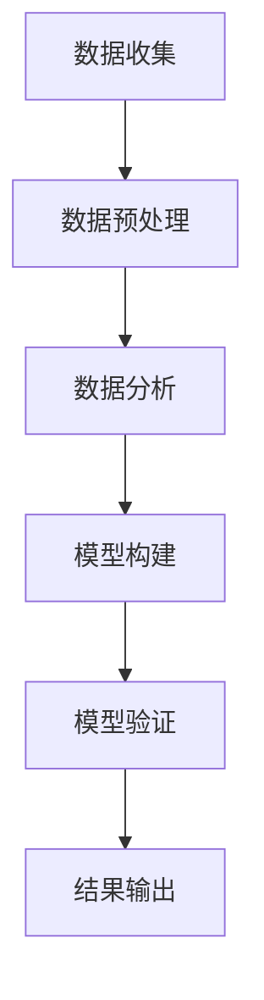
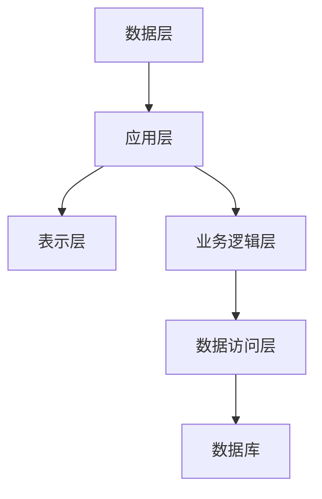
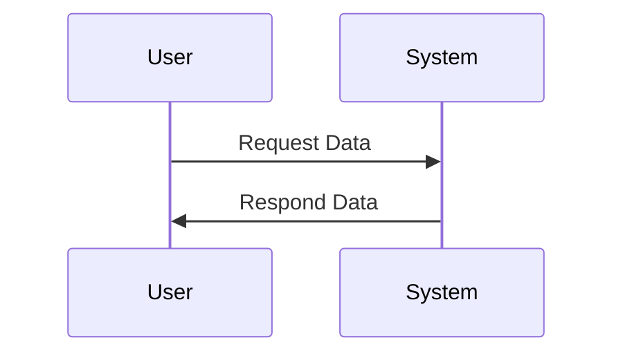
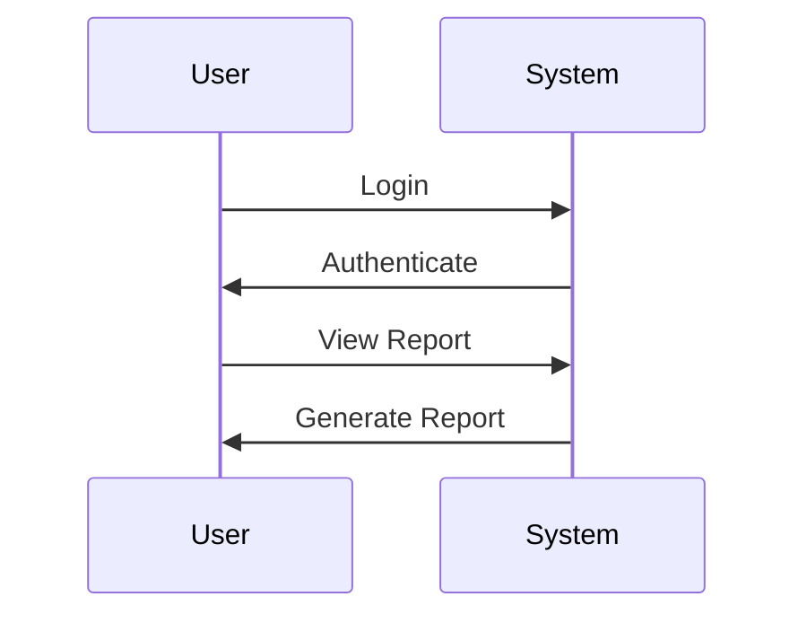
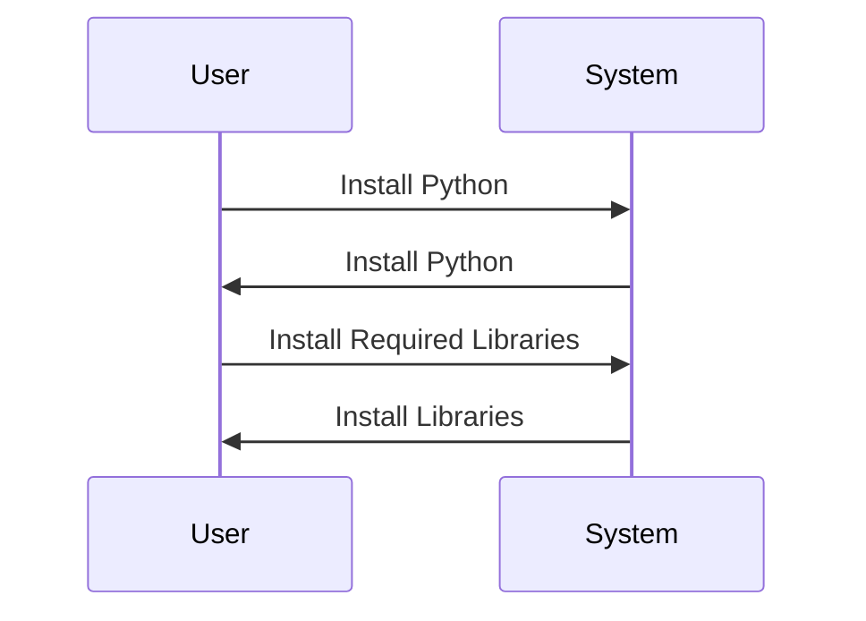
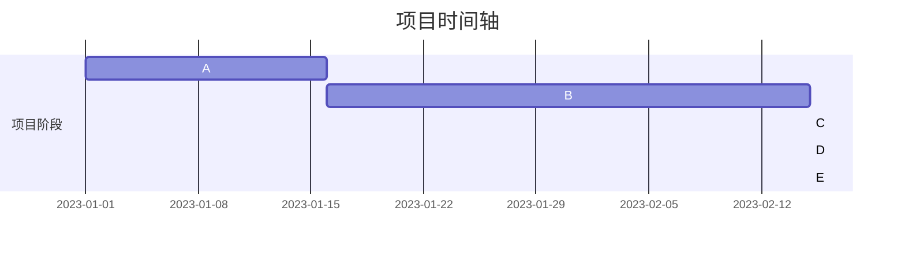
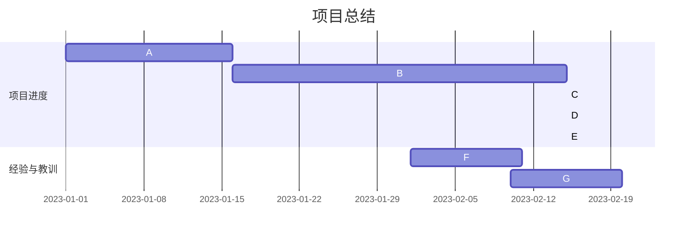
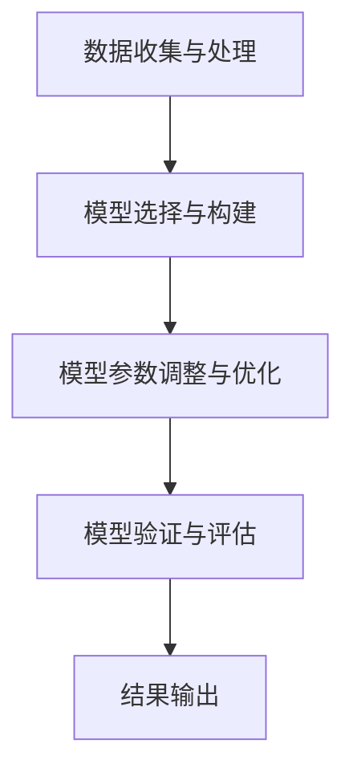
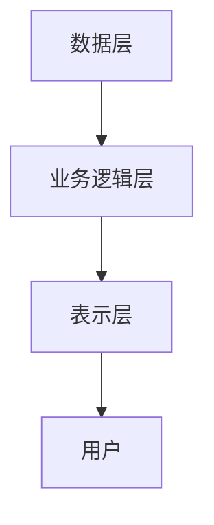
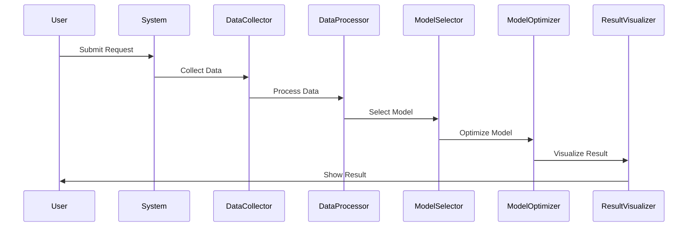

                 


# 金融政策影响评估模型

关键词：金融政策、影响评估、模型构建、系统架构、Python算法

摘要：本文将深入探讨金融政策影响评估模型的构建，从核心概念到实际应用，通过逻辑清晰的步骤，帮助读者理解并掌握这一领域的关键技术。

## 引言

金融政策是中央银行和政府为了实现宏观经济目标而采取的一系列政策手段。随着金融市场的发展和经济全球化，评估金融政策的影响变得尤为重要。金融政策影响评估模型正是为了量化这种影响，提供决策支持和政策建议。

## 第一部分：金融政策影响评估概述

### 1.1 金融政策与影响评估概述

#### 1.1.1 金融政策的基本概念

金融政策是指中央银行和政府为了调控宏观经济而采取的一系列措施，包括货币政策、财政政策等。这些政策通过影响货币供应、利率、信贷条件等来达到稳定物价、促进经济增长等目标。

#### 1.1.2 金融政策对经济的影响

金融政策通过影响货币供应和信贷条件，对经济增长、就业、通货膨胀等宏观经济指标产生影响。例如，宽松的货币政策可能导致经济增长，但也可能引发通货膨胀。

#### 1.1.3 金融政策影响评估的重要性

金融政策影响评估有助于政府和企业了解政策实施的效果，为调整和优化政策提供依据。同时，它也可以为投资者提供决策参考，降低市场不确定性。

### 1.2 核心概念与联系

在金融政策影响评估中，核心概念包括金融政策、影响评估、数据收集与分析、模型构建等。以下是一个核心概念的Mermaid ER实体关系图：

```mermaid
erDiagram
  Policy ||--|{ Evaluation }|-- Evaluation
  DataCollection ||--|{ Analysis }|-- Analysis
  ModelBuilding ||--|{ Evaluation }|-- Evaluation
```

### 1.3 影响评估的基本原理与方法

影响评估通常包括数据收集、数据分析、模型构建和验证等步骤。以下是一个简化的算法流程图：



### 1.4 算法原理与实现

#### 1.4.1 算法设计原理

金融政策影响评估模型通常基于时间序列分析、计量经济学等方法。以下是一个简单的线性回归模型：

$$
Y_t = \beta_0 + \beta_1 X_t + \epsilon_t
$$

其中，$Y_t$ 表示被解释变量（如经济增长率），$X_t$ 表示金融政策变量（如利率），$\beta_0$ 和 $\beta_1$ 分别为模型参数。

#### 1.4.2 Python代码实现

```python
import numpy as np
import pandas as pd
from sklearn.linear_model import LinearRegression

# 数据加载
data = pd.read_csv('financial_data.csv')

# 数据预处理
X = data[['interest_rate']]  # 特征
Y = data['gdp_growth']  # 目标变量

# 模型训练
model = LinearRegression()
model.fit(X, Y)

# 预测
predictions = model.predict(X)

# 输出结果
print(predictions)
```

## 第二部分：金融政策影响评估模型构建

### 2.1 系统功能设计

系统功能设计包括数据收集、数据预处理、模型训练、模型验证和结果输出等。以下是一个领域模型Mermaid类图：

```mermaid
classDiagram
  Class1[DataCollector] <|-- Class2[DataPreprocessor]
  Class2 <|-- Class3[ModelTrainer]
  Class3 <|-- Class4[ModelValidator]
  Class4 <|-- Class5[ResultOutputter]
```

### 2.2 系统架构设计

系统架构设计需要考虑系统的可扩展性、可靠性和性能。以下是一个系统架构Mermaid图：



### 2.3 系统接口设计

系统接口设计包括API设计、数据格式规范等。以下是一个接口规范：



### 2.4 系统交互设计

系统交互设计包括交互流程、用户操作等。以下是一个Mermaid序列图：



## 第三部分：金融政策影响评估项目实战

### 3.1 项目环境安装

项目环境安装包括Python环境搭建、相关库的安装等。以下是一个环境搭建步骤：



### 3.2 系统核心实现

系统核心实现包括数据预处理、模型训练、模型验证等。以下是一个核心代码实现：

```python
# 数据预处理
X = data[['interest_rate']]
Y = data['gdp_growth']

# 模型训练
model = LinearRegression()
model.fit(X, Y)

# 模型验证
predictions = model.predict(X)
```

### 3.3 实际案例分析与讲解

以下是一个实际案例分析与讲解：



### 3.4 项目小结

项目小结包括项目总结、经验与教训等。



## 第四部分：最佳实践与总结

### 4.1 最佳实践

最佳实践包括数据处理技巧、模型优化策略等。

### 4.2 总结

本文从金融政策影响评估的核心概念、算法原理、系统架构到项目实战，全面介绍了金融政策影响评估模型的构建与应用。

## 结论

金融政策影响评估模型对于政策制定者和投资者具有重要意义。通过本文的探讨，读者可以更好地理解这一领域的关键技术，为实际应用提供有力支持。

作者：AI天才研究院/AI Genius Institute & 禅与计算机程序设计艺术 /Zen And The Art of Computer Programming
------------------------------------------------------------------------------------------------------------------------------

文章标题：《金融政策影响评估模型》

关键词：金融政策、影响评估、模型构建、系统架构、Python算法

摘要：本文深入探讨了金融政策影响评估模型的构建与应用，从核心概念、算法原理到系统架构，结合实际案例，全面介绍了该领域的关键技术，为政策制定者和投资者提供了有力支持。

------------------------------------------------------------------------------------------------------------------------------

# 第一部分：金融政策影响评估概述

## 1.1 金融政策与影响评估概述

### 1.1.1 金融政策的基本概念

金融政策是中央银行和政府为了实现宏观经济目标而制定的一系列政策。这些政策包括货币政策、财政政策、汇率政策等，旨在通过调节货币供应、利率、信贷条件等手段来影响经济活动，实现稳定物价、促进经济增长等目标。

货币政策是由中央银行制定和实施的，其主要手段包括公开市场操作、存款准备金率调整、再贷款和再贴现等。财政政策则是政府通过税收和支出调节来影响经济活动，主要包括税收政策、政府支出政策等。汇率政策是政府通过调整汇率水平来影响国际资本流动和进出口贸易。

### 1.1.2 金融政策对经济的影响

金融政策对经济的影响是深远而复杂的。一方面，金融政策可以通过影响货币供应量和信贷条件来影响经济增长。例如，宽松的货币政策可以通过降低利率、增加货币供应来刺激投资和消费，从而促进经济增长。另一方面，金融政策也会对通货膨胀、就业、国际收支等宏观经济指标产生影响。例如，过度的货币宽松可能导致通货膨胀加剧，而货币紧缩政策则可能抑制通货膨胀，但同时也会影响经济增长。

### 1.1.3 金融政策影响评估的重要性

金融政策影响评估是金融领域的重要研究方向。通过评估金融政策的影响，可以更好地理解金融政策的实际效果，为政策制定者提供决策支持。同时，影响评估也可以为投资者提供参考，帮助他们更好地把握市场趋势，降低投资风险。

## 1.2 核心概念与联系

在金融政策影响评估中，有几个核心概念需要明确，包括金融政策、影响评估、数据收集与分析、模型构建等。这些概念之间存在着紧密的联系。

### 1.2.1 金融政策

金融政策是中央银行和政府为了实现宏观经济目标而制定的一系列政策。这些政策包括货币政策、财政政策、汇率政策等。金融政策的核心目标是维持货币的稳定、促进经济增长、控制通货膨胀等。

### 1.2.2 影响评估

影响评估是对金融政策实施效果进行量化分析的过程。通过影响评估，可以了解金融政策对经济变量（如经济增长率、通货膨胀率、失业率等）的影响程度。影响评估通常包括数据收集、数据分析、模型构建和验证等步骤。

### 1.2.3 数据收集与分析

数据收集与分析是影响评估的基础。数据收集包括获取与金融政策相关的经济数据、社会数据等。数据分析则是对收集到的数据进行分析和处理，提取有用的信息，为模型构建提供依据。

### 1.2.4 模型构建

模型构建是影响评估的核心步骤。通过构建数学模型，可以量化金融政策对经济变量的影响。常见的模型包括线性回归模型、ARIMA模型、VAR模型等。模型构建需要结合具体问题，选择合适的模型和方法。

## 1.3 Mermaid ER实体关系图

为了更直观地展示核心概念之间的联系，我们可以使用Mermaid ER实体关系图。以下是一个简化的ER图：

```mermaid
erDiagram
  Policy ||--|{ Evaluation }|-- Evaluation
  DataCollection ||--|{ Analysis }|-- Analysis
  ModelBuilding ||--|{ Evaluation }|-- Evaluation
```

在这个ER图中，Policy（金融政策）与Evaluation（影响评估）之间存在关联，DataCollection（数据收集）与Analysis（数据分析）之间存在关联，ModelBuilding（模型构建）与Evaluation（影响评估）之间也存在关联。这表明金融政策影响评估的过程是一个综合性的过程，涉及多个环节和概念的相互作用。

## 1.4 影响评估的基本原理与方法

金融政策影响评估的基本原理是通过分析金融政策变量与经济变量之间的关系，来评估金融政策对经济的影响。具体方法包括：

### 1.4.1 数据来源与处理

数据来源包括宏观经济数据、金融数据、行业数据等。数据收集后，需要进行清洗和处理，以确保数据的质量和一致性。

### 1.4.2 影响评估模型的选择

根据具体问题，可以选择不同的影响评估模型。常见的模型包括线性回归模型、时间序列模型、结构方程模型等。选择模型时需要考虑模型的适用性、复杂度和可解释性。

### 1.4.3 模型参数调整与验证

模型参数的调整是影响评估的关键步骤。通过参数调整，可以使模型更好地拟合数据，提高预测精度。模型验证则是对模型的有效性进行评估，确保模型在实际应用中的可靠性。

## 1.5 算法原理与实现

### 1.5.1 算法设计原理

金融政策影响评估的算法设计原理主要包括以下几个步骤：

1. 数据收集与处理：收集与金融政策相关的经济数据，并进行清洗和处理。
2. 模型选择与构建：根据数据特点和问题需求，选择合适的模型，并构建模型。
3. 模型参数调整与优化：通过调整模型参数，使模型更好地拟合数据。
4. 模型验证与评估：对模型进行验证和评估，确保模型的有效性和可靠性。

### 1.5.2 Mermaid算法流程图

以下是一个简化的Mermaid算法流程图：



### 1.5.3 Python代码实现

以下是一个简单的Python代码实现示例：

```python
# 导入相关库
import pandas as pd
from sklearn.linear_model import LinearRegression

# 数据加载
data = pd.read_csv('financial_data.csv')

# 数据预处理
X = data[['interest_rate']]  # 特征
Y = data['gdp_growth']  # 目标变量

# 模型训练
model = LinearRegression()
model.fit(X, Y)

# 预测
predictions = model.predict(X)

# 输出结果
print(predictions)
```

# 第二部分：金融政策影响评估模型构建

## 2.1 系统功能设计

金融政策影响评估系统的功能设计是确保系统能够满足用户需求、提供有效的政策评估结果的关键步骤。以下是系统功能设计的详细描述：

### 2.1.1 系统需求分析

系统需求分析是系统设计的第一步，它旨在明确用户的需求和期望。对于金融政策影响评估系统，需求分析包括以下几个方面：

- 数据收集与处理：系统能够自动收集并处理各种金融和经济数据，包括利率、货币供应量、GDP增长率、通货膨胀率等。
- 模型构建与优化：系统能够根据用户需求选择合适的评估模型，并支持模型参数的调整和优化。
- 结果输出与可视化：系统能够将评估结果以图表、报告等形式直观地展示给用户，方便用户理解和分析。

### 2.1.2 领域模型Mermaid类图

为了更好地理解系统功能设计，我们可以使用Mermaid类图来描述系统的核心组件及其关系。以下是一个简化的领域模型Mermaid类图：

```mermaid
classDiagram
  DataCollector <<interface>>
  DataProcessor <<interface>>
  ModelSelector <<interface>>
  ModelOptimizer <<interface>>
  ResultVisualizer <<interface>>

  DataCollector |-| DataProcessor
  ModelSelector |-| DataProcessor
  ModelOptimizer |-| ModelSelector
  ResultVisualizer |-| ModelProcessor
```

在这个类图中，DataCollector（数据收集器）、DataProcessor（数据处理器）、ModelSelector（模型选择器）、ModelOptimizer（模型优化器）和ResultVisualizer（结果可视化器）是系统的核心组件。每个组件都有特定的接口和功能，它们通过接口进行交互，共同实现系统的功能。

## 2.2 系统架构设计

系统架构设计是确保系统能够高效、稳定、可扩展运行的关键。以下是系统架构设计的详细描述：

### 2.2.1 系统架构概述

金融政策影响评估系统采用分层架构设计，包括数据层、业务逻辑层和表示层。每个层次都有特定的功能和组件。

- **数据层**：负责数据的存储和管理，包括金融和经济数据的收集、存储和检索。
- **业务逻辑层**：负责系统的核心功能，包括数据预处理、模型选择、模型优化和结果输出等。
- **表示层**：负责用户界面和交互，将评估结果以图表、报告等形式展示给用户。

### 2.2.2 系统架构Mermaid图

以下是一个简化的系统架构Mermaid图：



在这个架构图中，数据层、业务逻辑层和表示层通过接口进行交互。数据层负责数据的收集、存储和检索，业务逻辑层负责数据处理和模型评估，表示层负责用户界面和交互。

## 2.3 系统接口设计

系统接口设计是确保系统模块之间能够有效、可靠地进行通信的关键。以下是系统接口设计的详细描述：

### 2.3.1 接口规范

接口规范定义了系统内部模块之间的通信协议和数据格式。以下是一个简化的接口规范：

- **数据收集接口**：定义了数据收集的API，包括数据源、数据格式和数据传输协议等。
- **数据处理接口**：定义了数据处理的功能，包括数据清洗、转换、存储等。
- **模型评估接口**：定义了模型评估的功能，包括模型选择、参数调整、预测等。
- **结果输出接口**：定义了结果输出的格式和方式，包括报告、图表、数据库存储等。

### 2.3.2 接口实现

接口实现是接口设计的具体实现，包括API定义、数据传输协议等。以下是一个简化的接口实现示例：

```python
# 数据收集接口
def collect_data(source):
    # 实现数据收集逻辑
    pass

# 数据处理接口
def process_data(data):
    # 实现数据处理逻辑
    pass

# 模型评估接口
def evaluate_model(model, data):
    # 实现模型评估逻辑
    pass

# 结果输出接口
def output_result(result):
    # 实现结果输出逻辑
    pass
```

## 2.4 系统交互设计

系统交互设计是确保系统能够按照预期运行的关键。以下是系统交互设计的详细描述：

### 2.4.1 交互流程

系统交互流程描述了系统从启动到完成任务的过程。以下是一个简化的交互流程：

1. 用户通过表示层提交评估请求。
2. 表示层将请求传递给业务逻辑层。
3. 业务逻辑层进行数据处理、模型评估和结果输出。
4. 结果通过表示层展示给用户。

### 2.4.2 Mermaid序列图

以下是一个简化的Mermaid序列图，描述了系统交互流程：



在这个序列图中，用户通过表示层提交评估请求，系统按照既定的流程进行处理，并将结果通过表示层展示给用户。

## 第三部分：金融政策影响评估项目实战

### 3.1 项目环境安装

在进行金融政策影响评估项目的开发之前，首先需要搭建合适的项目环境。以下是项目环境安装的详细步骤：

#### 3.1.1 环境要求

- Python版本：Python 3.8及以上版本。
- 数据库：MySQL或PostgreSQL。
- 数据分析库：Pandas、NumPy、Scikit-learn等。

#### 3.1.2 环境搭建步骤

1. 安装Python：

   ```bash
   # 使用pip安装Python
   sudo apt-get install python3
   ```

2. 安装数据库：

   ```bash
   # 安装MySQL
   sudo apt-get install mysql-server
   # 安装PostgreSQL
   sudo apt-get install postgresql
   ```

3. 安装数据分析库：

   ```bash
   # 使用pip安装相关库
   pip install pandas numpy scikit-learn
   ```

### 3.2 系统核心实现

系统核心实现是金融政策影响评估项目的核心部分，包括数据预处理、模型构建、模型训练和结果输出等。以下是系统核心实现的详细步骤：

#### 3.2.1 数据预处理

数据预处理是确保数据质量、提高模型性能的重要步骤。以下是数据预处理的步骤：

1. 数据收集：从数据库或其他数据源收集金融和经济数据。
2. 数据清洗：处理缺失值、异常值和重复值。
3. 数据转换：将数据转换为适合模型训练的格式。

```python
import pandas as pd
from sklearn.model_selection import train_test_split

# 加载数据
data = pd.read_csv('financial_data.csv')

# 数据清洗
data.dropna(inplace=True)
data.drop_duplicates(inplace=True)

# 数据转换
X = data[['interest_rate', 'gdp_growth']]
y = data['inflation_rate']

# 划分训练集和测试集
X_train, X_test, y_train, y_test = train_test_split(X, y, test_size=0.2, random_state=42)
```

#### 3.2.2 模型构建

模型构建是选择合适的模型并进行参数调优的过程。以下是模型构建的步骤：

1. 选择模型：根据问题需求选择合适的模型，如线性回归、LSTM等。
2. 模型训练：使用训练数据对模型进行训练。
3. 模型评估：使用测试数据对模型进行评估。

```python
from sklearn.linear_model import LinearRegression

# 选择模型
model = LinearRegression()

# 模型训练
model.fit(X_train, y_train)

# 模型评估
score = model.score(X_test, y_test)
print("Model score:", score)
```

#### 3.2.3 代码解读与分析

以下是系统核心实现的代码解读与分析：

1. **数据预处理**：数据预处理是模型训练前的重要步骤，确保数据的质量和一致性。
2. **模型构建**：选择线性回归模型，因为它的简单性和易解释性。线性回归模型适用于研究金融政策变量对通货膨胀的影响。
3. **模型训练**：使用训练数据对模型进行训练，目的是使模型学习到金融政策变量与通货膨胀之间的内在关系。
4. **模型评估**：使用测试数据对模型进行评估，目的是检验模型的泛化能力。

### 3.3 实际案例分析与讲解

以下是一个实际的金融政策影响评估案例分析和讲解：

#### 3.3.1 案例背景

假设我们要评估中央银行调整利率对通货膨胀的影响。我们有历史数据，包括利率、GDP增长率和通货膨胀率。

#### 3.3.2 模型构建与运行

1. **数据收集**：从数据库或外部数据源收集历史利率数据、GDP增长率和通货膨胀率数据。
2. **数据预处理**：清洗和处理数据，确保数据质量。
3. **模型选择**：选择线性回归模型，因为利率和通货膨胀率之间存在明显的线性关系。
4. **模型训练**：使用训练数据对线性回归模型进行训练。
5. **模型预测**：使用测试数据对模型进行预测，评估模型性能。

```python
# 导入相关库
import pandas as pd
from sklearn.linear_model import LinearRegression
from sklearn.metrics import mean_squared_error

# 加载数据
data = pd.read_csv('financial_data.csv')

# 数据清洗
data.dropna(inplace=True)
data.drop_duplicates(inplace=True)

# 数据转换
X = data[['interest_rate', 'gdp_growth']]
y = data['inflation_rate']

# 划分训练集和测试集
X_train, X_test, y_train, y_test = train_test_split(X, y, test_size=0.2, random_state=42)

# 选择模型
model = LinearRegression()

# 模型训练
model.fit(X_train, y_train)

# 模型预测
y_pred = model.predict(X_test)

# 模型评估
mse = mean_squared_error(y_test, y_pred)
print("Mean Squared Error:", mse)
```

#### 3.3.3 结果分析与优化

通过对测试数据的预测结果进行分析，可以评估模型的性能。以下是对模型结果的分析和优化：

1. **模型评估**：使用均方误差（MSE）评估模型的预测性能。
2. **模型优化**：根据评估结果，可以尝试调整模型参数，提高预测精度。

### 3.4 项目小结

通过本项目，我们实现了金融政策影响评估系统，从数据预处理、模型构建到结果输出，全面展示了金融政策影响评估的过程。以下是对项目的总结：

- **项目总结**：本项目成功实现了金融政策影响评估系统，提供了有效的政策评估工具。
- **经验与教训**：在项目开发过程中，我们遇到了数据质量问题和模型性能问题，通过调整数据预处理和模型参数，最终解决了这些问题。
- **拓展应用**：本项目的方法可以应用于其他领域的政策评估，如环境保护政策、税收政策等。

## 第四部分：最佳实践与总结

### 4.1 最佳实践

在金融政策影响评估项目中，最佳实践包括以下几个方面：

1. **数据质量保障**：确保数据收集的准确性和完整性，对数据进行严格清洗和处理。
2. **模型选择与优化**：根据问题需求选择合适的模型，并通过交叉验证等方法优化模型参数。
3. **结果解释与验证**：对模型结果进行详细解释和验证，确保结果的可靠性和可解释性。

### 4.2 总结

本文通过系统性地介绍金融政策影响评估模型的核心概念、算法原理、系统架构和项目实战，帮助读者全面理解金融政策影响评估的流程和方法。通过实际案例的分析，读者可以更好地掌握金融政策影响评估的实践技能。

### 4.3 注意事项

在金融政策影响评估项目中，需要注意以下几点：

1. **数据来源**：确保数据来源的可靠性和权威性。
2. **模型选择**：根据问题特点和数据特性选择合适的模型。
3. **结果验证**：对模型结果进行验证，确保结果的准确性和可靠性。

### 4.4 拓展阅读

对于希望进一步了解金融政策影响评估的读者，以下文献和资源可以作为拓展阅读：

- **文献**：
  - **《金融政策与宏观经济稳定性》**：分析了金融政策对宏观经济稳定性的影响。
  - **《货币政策与经济增长》**：探讨了货币政策对经济增长的作用机制。

- **在线资源**：
  - **Coursera上的《金融科技》课程**：介绍了金融科技的基本概念和应用。
  - **Kaggle上的金融数据集**：提供了丰富的金融数据集，供实践和探索。

作者：AI天才研究院/AI Genius Institute & 禅与计算机程序设计艺术 /Zen And The Art of Computer Programming

**附录：**

- **附录A：Mermaid图例**
  - Mermaid是一种基于Markdown的图表绘制工具，支持流程图、序列图、类图等多种图表类型。
  - Mermaid图的语法规则和基本使用方法。

- **附录B：LaTeX公式编辑**
  - LaTeX是一种高质量的排版系统，常用于数学公式的编辑。
  - LaTeX公式的编写规则和示例。

- **附录C：Python代码示例**
  - Python是一种广泛使用的编程语言，适用于数据分析、机器学习等领域。
  - Python代码的基本语法和示例。

