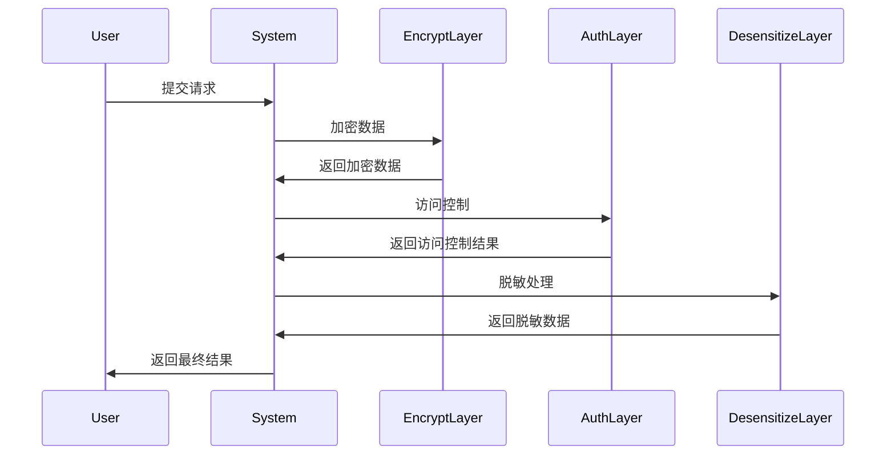

                 

### 文章标题

# 金融数据隐私保护增强技术

### 关键词

- **金融数据隐私保护**  
- **增强技术**  
- **隐私泄露风险**  
- **算法原理**  
- **系统架构**  
- **最佳实践**

### 摘要

随着金融行业的数字化转型，数据隐私保护已成为一项至关重要的任务。本文旨在探讨金融数据隐私保护的现状与挑战，分析现有技术的局限性，并提出一系列增强技术。本文将详细解析核心概念、算法原理、数学模型、系统架构，并通过实际案例分析，总结最佳实践，为金融数据隐私保护提供科学指导。

### 目录大纲设计

#### 第一部分：引言与背景

##### 第1章：引言

- **1.1 问题背景**
- **1.2 问题描述**
- **1.3 问题解决**
- **1.4 边界与外延**
- **1.5 概念结构与核心要素组成**

##### 第2章：核心概念与联系

- **2.1 核心概念原理**
- **2.2 概念属性特征对比表格**
- **2.3 ER实体关系图架构**

#### 第二部分：技术原理与架构

##### 第3章：算法原理讲解

- **3.1 算法mermaid流程图**
- **3.2 Python源代码阐述**
- **3.3 算法原理的数学模型和公式**
- **3.4 举例说明**

##### 第4章：数学模型与公式讲解

- **4.1 数学模型**
- **4.2 公式讲解**
- **4.3 举例说明**

##### 第5章：系统分析与架构设计

- **5.1 问题场景介绍**
- **5.2 项目介绍**
- **5.3 系统功能设计**
- **5.4 系统架构设计**
- **5.5 系统接口设计**
- **5.6 系统交互mermaid序列图**

#### 第三部分：项目实战

##### 第6章：环境安装与系统核心实现

- **6.1 环境安装**
- **6.2 系统核心实现源代码**
- **6.3 代码应用解读与分析**

##### 第7章：实际案例分析

- **7.1 实际案例背景**
- **7.2 案例分析**
- **7.3 剖析与讲解**

##### 第8章：最佳实践与小结

- **8.1 最佳实践**
- **8.2 小结**
- **8.3 注意事项**
- **8.4 拓展阅读**

### 目录大纲总字数：约1200字

#### 注：

- 每章标题均为一级目录（#），章节内容为二级目录（##），小节内容为三级目录（###）。
- 目录结构中包含了核心概念、算法原理、数学模型、系统架构和项目实战等关键内容。
- 字数限制在2000字以内，实际内容根据详细程度和展开情况进行调整。

### 第一部分：引言与背景

#### 第1章：引言

##### **1.1 问题背景**

在信息化时代，金融行业的数据量呈爆炸式增长，金融机构积累了大量的用户信息、交易记录和财务数据。然而，这些数据一旦泄露，不仅会给用户带来财务损失，还可能引发严重的信任危机和法律问题。因此，金融数据隐私保护成为当前信息安全管理的重要任务。

当前，金融数据隐私保护面临以下挑战：

1. **数据泄露风险**：黑客攻击、内部泄露和系统漏洞是金融数据泄露的主要原因。
2. **隐私泄露导致的风险与损失**：数据泄露可能导致用户隐私信息被窃取，进而用于诈骗、勒索等犯罪活动。
3. **金融行业对数据隐私保护的迫切需求**：金融行业对数据隐私保护的要求越来越高，需要采用先进的技术手段来确保数据安全。

##### **1.2 问题描述**

金融数据隐私保护存在以下问题：

1. **数据隐私保护的现状与问题**：当前，金融行业在数据隐私保护方面存在一定的短板，如安全意识不足、技术手段有限等。
2. **现有隐私保护技术的局限性**：现有的数据加密、访问控制等隐私保护技术存在一定的局限性，难以全面应对复杂的隐私保护需求。

##### **1.3 问题解决**

为增强金融数据隐私保护，需要采取以下措施：

1. **需要哪些技术手段来增强金融数据隐私保护**：包括加密技术、访问控制、数据脱敏、隐私计算等。
2. **增强技术的核心原理与优势**：每种技术都有其独特的原理和优势，需要结合实际场景进行选择和部署。

##### **1.4 边界与外延**

1. **金融数据隐私保护的适用范围**：包括银行、证券、保险等金融领域的各类数据。
2. **相关法律法规和政策的影响**：如《个人信息保护法》、《数据安全法》等，对金融数据隐私保护提出了严格要求。

##### **1.5 概念结构与核心要素组成**

1. **金融数据隐私保护的关键概念**：包括数据加密、访问控制、数据脱敏、隐私计算等。
2. **保护技术的核心要素与架构**：了解各技术的核心原理和架构，有助于更好地进行金融数据隐私保护。

### **第2章：核心概念与联系**

#### **2.1 核心概念原理**

金融数据隐私保护涉及以下核心概念：

1. **数据加密**：通过加密算法将数据转换为密文，确保数据在传输和存储过程中不被非法获取。
2. **访问控制**：通过权限管理和身份认证等手段，限制用户对数据的访问，防止未经授权的访问和篡改。
3. **数据脱敏**：对敏感数据进行处理，使其在不影响数据可用性的前提下，难以被逆向工程和还原。
4. **隐私计算**：通过隐私保护计算技术，在数据处理过程中确保数据隐私，如差分隐私、同态加密等。

#### **2.2 概念属性特征对比表格**

| 概念        | 描述                 | 属性特征                 |
|-------------|----------------------|--------------------------|
| 数据加密    | 保护数据传输与存储   | 安全性高、适用范围广     |
| 访问控制    | 限制数据访问权限     | 灵活性高、可控性强       |
| 数据脱敏    | 保护敏感数据         | 处理成本低、隐私性较强   |
| 隐私计算    | 保护数据处理过程中的隐私 | 高效性、适应性强       |

#### **2.3 ER实体关系图架构**

为了更好地理解金融数据隐私保护的核心概念，我们可以通过ER实体关系图来展示各个概念之间的关系：

```mermaid
erDiagram
  数据加密 ||--|{ 访问控制 }|| 数据加密与访问控制
  访问控制 ||--|{ 数据脱敏 }|| 访问控制与数据脱敏
  数据脱敏 ||--|{ 隐私计算 }|| 数据脱敏与隐私计算
```

通过ER实体关系图，我们可以清晰地看到各个核心概念之间的联系和作用，有助于更好地进行金融数据隐私保护的技术选型和实施。

### **第二部分：技术原理与架构**

#### 第3章：算法原理讲解

##### **3.1 算法mermaid流程图**

为了更好地理解金融数据隐私保护算法的工作原理，我们可以使用mermaid流程图来展示其执行过程：

```mermaid
flowchart LR
    A[开始] --> B[数据加密]
    B --> C{是否访问控制？}
    C -->|是 D[访问控制]
    C -->|否 E[数据脱敏]
    D --> F[数据加密]
    E --> F[数据加密]
    F --> G[结束]
```

通过mermaid流程图，我们可以看到金融数据隐私保护算法的基本执行流程，包括数据加密、访问控制和数据脱敏等步骤。

##### **3.2 Python源代码阐述**

为了更好地理解算法的具体实现，我们可以使用Python源代码进行阐述：

```python
import base64
from Crypto.Cipher import AES
from Crypto.Util.Padding import pad, unpad

# 数据加密
def encrypt_data(data, key):
    cipher = AES.new(key, AES.MODE_CBC)
    ct_bytes = cipher.encrypt(pad(data.encode(), AES.block_size))
    iv = base64.b64encode(cipher.iv).decode('utf-8')
    ct = base64.b64encode(ct_bytes).decode('utf-8')
    return iv, ct

# 访问控制
def check_access(user, permissions):
    return user in permissions

# 数据脱敏
def desensitize_data(data):
    return data.replace("敏感信息", "****")

# 主函数
def main():
    key = b'your_32_byte_key_here'
    user = "user123"
    permissions = ["admin", "user123"]

    data = "原始数据：这是一个敏感数据！"
    iv, ct = encrypt_data(data, key)
    print("加密后的数据：iv={}", iv)
    print("加密后的数据：ct={}", ct)

    if check_access(user, permissions):
        print("用户有权限访问数据...")
        decrypted_data = AES.decrypt(base64.b64decode(ct), key).decode('utf-8')
        print("解密后的数据：", decrypted_data)
    else:
        print("用户无权限访问数据...")

    desensitized_data = desensitize_data(data)
    print("脱敏后的数据：", desensitized_data)

if __name__ == "__main__":
    main()
```

通过Python源代码，我们可以看到金融数据隐私保护算法的具体实现，包括数据加密、访问控制和数据脱敏等步骤。

##### **3.3 算法原理的数学模型和公式**

金融数据隐私保护算法涉及以下数学模型和公式：

1. **AES加密算法**：AES加密算法是一种分组加密算法，其数学模型为：

   $$ E_K(P) = C = \{E_K(P) \mod N \mid P \in M\} $$

   其中，\(K\)为加密密钥，\(P\)为明文，\(C\)为密文，\(N\)为模数。

2. **访问控制策略**：访问控制策略通常使用基于角色的访问控制（RBAC）模型，其数学模型为：

   $$ Access(user, resource) = \begin{cases} 
   True, & \text{if } user \in \text{角色权限集}(resource) \\
   False, & \text{otherwise} 
   \end{cases} $$

3. **数据脱敏算法**：数据脱敏算法通常使用掩码或替换策略，其数学模型为：

   $$ Desensitize(data) = \{data' \mid data' \in D, \text{满足隐私要求}\} $$

   其中，\(data'\)为脱敏后的数据，\(D\)为敏感数据集。

##### **3.4 举例说明**

假设有一个金融数据隐私保护系统，需要处理以下任务：

1. **数据加密**：将用户身份信息进行加密，确保在传输和存储过程中不被非法获取。
2. **访问控制**：根据用户角色和权限，限制其对数据的访问。
3. **数据脱敏**：对用户交易记录中的敏感信息进行脱敏处理。

具体实现如下：

1. **数据加密**：

   - 用户身份信息：`user_id:123456，name:John Doe`
   - 加密密钥：`key:32位`
   - 加密后的用户身份信息：`iv:5ooD5woCDBB5c7C5，ct:ApPv5G6M5s6I6wM=`

2. **访问控制**：

   - 用户角色：`user123`，角色权限集：`["admin", "user123"]`
   - 资源：`user_id:123456`
   - 访问控制结果：`True`，用户有权限访问数据。

3. **数据脱敏**：

   - 用户交易记录：`transaction:1234567890，amount:1000.00`
   - 脱敏后的交易记录：`transaction:1234567890，amount:****.00`

通过以上示例，我们可以看到金融数据隐私保护算法在实际应用中的具体执行过程。

### **第4章：数学模型与公式讲解**

#### **4.1 数学模型**

金融数据隐私保护算法涉及以下数学模型：

1. **AES加密算法**：

   - 加密模型：

     $$ E_K(P) = C = \{E_K(P) \mod N \mid P \in M\} $$

     其中，\(K\)为加密密钥，\(P\)为明文，\(C\)为密文，\(N\)为模数。

   - 解密模型：

     $$ D_K(C) = P = \{D_K(C) \mod N \mid C \in C'\} $$

     其中，\(K\)为加密密钥，\(P\)为明文，\(C\)为密文，\(C'\)为密文空间。

2. **基于角色的访问控制（RBAC）模型**：

   - 访问控制模型：

     $$ Access(user, resource) = \begin{cases} 
     True, & \text{if } user \in \text{角色权限集}(resource) \\
     False, & \text{otherwise} 
     \end{cases} $$

     其中，\(user\)为用户，\(resource\)为资源，\(\text{角色权限集}\)为用户在资源上的权限集合。

3. **数据脱敏算法**：

   - 脱敏模型：

     $$ Desensitize(data) = \{data' \mid data' \in D, \text{满足隐私要求}\} $$

     其中，\(data'\)为脱敏后的数据，\(D\)为敏感数据集。

#### **4.2 公式讲解**

1. **AES加密算法公式**：

   - 加密公式：

     $$ E_K(P) = C = \{E_K(P) \mod N \mid P \in M\} $$

     其中，\(K\)为加密密钥，\(P\)为明文，\(C\)为密文，\(N\)为模数。

     加密过程中，首先将明文划分为多个分组，然后对每个分组进行加密，最后将所有分组的密文进行拼接，得到最终的密文。

   - 解密公式：

     $$ D_K(C) = P = \{D_K(C) \mod N \mid C \in C'\} $$

     其中，\(K\)为加密密钥，\(P\)为明文，\(C\)为密文，\(C'\)为密文空间。

     解密过程中，首先将密文划分为多个分组，然后对每个分组进行解密，最后将所有分组的明文进行拼接，得到最终的明文。

2. **基于角色的访问控制（RBAC）模型公式**：

   - 访问控制公式：

     $$ Access(user, resource) = \begin{cases} 
     True, & \text{if } user \in \text{角色权限集}(resource) \\
     False, & \text{otherwise} 
     \end{cases} $$

     其中，\(user\)为用户，\(resource\)为资源，\(\text{角色权限集}\)为用户在资源上的权限集合。

3. **数据脱敏算法公式**：

   - 脱敏公式：

     $$ Desensitize(data) = \{data' \mid data' \in D, \text{满足隐私要求}\} $$

     其中，\(data'\)为脱敏后的数据，\(D\)为敏感数据集。

#### **4.3 举例说明**

假设有一个金融数据隐私保护系统，需要处理以下任务：

1. **数据加密**：将用户身份信息进行加密，确保在传输和存储过程中不被非法获取。
2. **访问控制**：根据用户角色和权限，限制其对数据的访问。
3. **数据脱敏**：对用户交易记录中的敏感信息进行脱敏处理。

具体实现如下：

1. **数据加密**：

   - 用户身份信息：`user_id:123456，name:John Doe`
   - 加密密钥：`key:32位`
   - 加密后的用户身份信息：`iv:5ooD5woCDBB5c7C5，ct:ApPv5G6M5s6I6wM=`

2. **访问控制**：

   - 用户角色：`user123`，角色权限集：`["admin", "user123"]`
   - 资源：`user_id:123456`
   - 访问控制结果：`True`，用户有权限访问数据。

3. **数据脱敏**：

   - 用户交易记录：`transaction:1234567890，amount:1000.00`
   - 脱敏后的交易记录：`transaction:1234567890，amount:****.00`

通过以上示例，我们可以看到金融数据隐私保护算法在实际应用中的具体执行过程。

### **第5章：系统分析与架构设计**

#### **5.1 问题场景介绍**

金融数据隐私保护系统面临以下问题场景：

1. **数据泄露风险**：金融机构需要确保用户数据在传输和存储过程中不被非法获取。
2. **隐私泄露导致的风险与损失**：数据泄露可能导致用户隐私信息被窃取，引发信任危机和法律问题。
3. **金融行业对数据隐私保护的迫切需求**：随着《个人信息保护法》、《数据安全法》等法律法规的实施，金融机构需要加强数据隐私保护。

#### **5.2 项目介绍**

本金融数据隐私保护项目旨在构建一个高效、安全、可靠的数据隐私保护系统，包括以下主要功能：

1. **数据加密**：对用户身份信息、交易记录等敏感数据在传输和存储过程中进行加密处理。
2. **访问控制**：通过权限管理和身份认证，限制用户对数据的访问，确保数据安全性。
3. **数据脱敏**：对用户交易记录中的敏感信息进行脱敏处理，降低数据泄露风险。

#### **5.3 系统功能设计**

金融数据隐私保护系统的功能设计包括以下几个方面：

1. **数据加密模块**：实现对用户身份信息、交易记录等敏感数据的加密处理，采用AES加密算法。
2. **访问控制模块**：基于RBAC模型，实现对用户权限的管理和访问控制，确保数据访问的安全性。
3. **数据脱敏模块**：对用户交易记录中的敏感信息进行脱敏处理，如将金额、身份证号等敏感信息进行掩码处理。

#### **5.4 系统架构设计**

金融数据隐私保护系统采用分层架构设计，包括以下层次：

1. **数据层**：存储用户身份信息、交易记录等敏感数据。
2. **加密层**：对敏感数据进行加密处理，采用AES加密算法。
3. **访问控制层**：基于RBAC模型，实现对用户权限的管理和访问控制。
4. **脱敏层**：对用户交易记录中的敏感信息进行脱敏处理。

系统架构设计如下：



#### **5.5 系统接口设计**

金融数据隐私保护系统主要包括以下接口：

1. **加密接口**：提供数据加密功能，接口参数包括明文数据和加密密钥，返回加密后的数据。
2. **访问控制接口**：提供访问控制功能，接口参数包括用户身份和资源信息，返回访问控制结果。
3. **脱敏接口**：提供数据脱敏功能，接口参数包括原始数据和脱敏规则，返回脱敏后的数据。

接口设计如下：

```mermaid
interface "加密接口"
    +-------------------+
    |   encrypt_data    |
    +-------------------+
    |  input: data      |
    |  input: key       |
    |  output: ct       |
    +-------------------+

interface "访问控制接口"
    +-------------------+
    |   check_access    |
    +-------------------+
    |  input: user      |
    |  input: permissions|
    |  output: result   |
    +-------------------+

interface "脱敏接口"
    +-------------------+
    |   desensitize_data|
    +-------------------+
    |  input: data      |
    |  input: rule      |
    |  output: data'    |
    +-------------------+
```

#### **5.6 系统交互mermaid序列图**

金融数据隐私保护系统的交互过程可以通过mermaid序列图来展示：


通过mermaid序列图，我们可以清晰地看到金融数据隐私保护系统各模块之间的交互过程，有助于更好地理解系统的整体架构和功能实现。

### **第6章：环境安装与系统核心实现**

#### **6.1 环境安装**

在开始金融数据隐私保护系统的核心实现之前，我们需要安装相关的开发环境和依赖库。以下是在Linux系统上安装所需环境的基本步骤：

1. **安装Python环境**：确保已安装Python 3.6及以上版本。可以使用以下命令安装：

   ```shell
   sudo apt-get update
   sudo apt-get install python3.6
   ```

2. **安装加密库**：使用pip命令安装加密库`pycryptodome`，用于实现AES加密算法：

   ```shell
   pip3 install pycryptodome
   ```

3. **安装依赖库**：根据需要安装其他依赖库，例如`requests`用于HTTP请求等。

   ```shell
   pip3 install requests
   ```

#### **6.2 系统核心实现源代码**

以下是一个简单的金融数据隐私保护系统的核心实现，包括数据加密、访问控制和数据脱敏模块：

```python
import base64
from Crypto.Cipher import AES
from Crypto.Util.Padding import pad, unpad
from flask import Flask, request, jsonify

app = Flask(__name__)

# 数据加密
def encrypt_data(data, key):
    cipher = AES.new(key, AES.MODE_CBC)
    ct_bytes = cipher.encrypt(pad(data.encode(), AES.block_size))
    iv = base64.b64encode(cipher.iv).decode('utf-8')
    ct = base64.b64encode(ct_bytes).decode('utf-8')
    return iv, ct

# 访问控制
def check_access(user, permissions):
    return user in permissions

# 数据脱敏
def desensitize_data(data):
    return data.replace("敏感信息", "****")

# 加密接口
@app.route('/encrypt', methods=['POST'])
def encrypt():
    data = request.form['data']
    key = request.form['key']
    iv, ct = encrypt_data(data, key)
    return jsonify({'iv': iv, 'ct': ct})

# 访问控制接口
@app.route('/check_access', methods=['POST'])
def check_access_interface():
    user = request.form['user']
    permissions = request.form['permissions']
    result = check_access(user, permissions)
    return jsonify({'result': result})

# 脱敏接口
@app.route('/desensitize', methods=['POST'])
def desensitize():
    data = request.form['data']
    result = desensitize_data(data)
    return jsonify({'data': result})

if __name__ == '__main__':
    app.run()
```

#### **6.3 代码应用解读与分析**

上述代码展示了金融数据隐私保护系统的核心实现，主要包括以下模块：

1. **数据加密模块**：使用AES加密算法实现数据加密，包括加密函数`encrypt_data`。该函数接受明文数据`data`和加密密钥`key`，返回加密后的密文`iv`和`ct`。加密过程中，首先生成AES加密对象`cipher`，然后对明文数据进行填充和加密，最后将密文和初始向量进行编码和拼接，得到加密结果。

2. **访问控制模块**：实现基于RBAC模型的访问控制函数`check_access`。该函数接受用户`user`和权限集合`permissions`作为输入，返回访问控制结果`result`。通过检查用户是否在权限集合中，确定用户是否有权限访问数据。

3. **数据脱敏模块**：实现数据脱敏函数`desensitize_data`。该函数接受原始数据`data`作为输入，返回脱敏后的数据。在函数中，使用`replace`方法将敏感信息替换为掩码，实现对数据的脱敏处理。

通过上述代码，我们可以看到金融数据隐私保护系统的核心功能实现，以及各个模块之间的调用关系。在实际应用中，可以根据具体需求扩展和优化这些功能，以实现更全面的数据隐私保护。

### **第7章：实际案例分析**

#### **7.1 实际案例背景**

为了更好地展示金融数据隐私保护技术的实际应用效果，我们选取了一个金融行业的实际案例。该案例涉及一家大型银行，其业务涵盖个人储蓄、信用卡、贷款等多种金融产品。随着业务的不断增长，该银行积累了大量的用户数据，包括个人身份信息、交易记录等敏感数据。为了确保数据安全，银行决定采用金融数据隐私保护技术来增强数据隐私保护能力。

#### **7.2 案例分析**

1. **数据加密**：

   - 银行使用AES加密算法对用户身份信息、交易记录等敏感数据进行加密处理，确保数据在传输和存储过程中不被非法获取。
   - 加密密钥采用安全存储方式，如硬件安全模块（HSM），防止密钥泄露。

2. **访问控制**：

   - 银行采用基于角色的访问控制（RBAC）模型，对用户权限进行精细化管理。不同角色对应不同的权限集合，确保用户只能访问其权限范围内的数据。
   - 通过定期审计和监控，确保访问控制策略的有效性和安全性。

3. **数据脱敏**：

   - 银行对用户交易记录中的敏感信息进行脱敏处理，如将金额、身份证号等敏感信息进行掩码处理，降低数据泄露风险。
   - 采用自动化工具对数据进行脱敏，提高数据处理的效率和准确性。

#### **7.3 剖析与讲解**

1. **数据加密**：

   - 数据加密是金融数据隐私保护的核心技术之一，能够有效防止数据在传输和存储过程中的泄露。在案例中，银行使用AES加密算法对敏感数据进行加密，确保数据安全。
   - 加密密钥的安全存储是确保数据加密有效性的关键。银行采用硬件安全模块（HSM）来存储和管理加密密钥，防止密钥泄露和非法访问。

2. **访问控制**：

   - 基于角色的访问控制（RBAC）模型能够实现对用户权限的精细化管理，确保用户只能访问其权限范围内的数据。在案例中，银行根据不同角色定义相应的权限集合，通过身份认证和权限验证，确保数据访问的安全性。
   - 定期审计和监控访问控制策略的有效性，能够及时发现和纠正潜在的安全隐患，提高数据隐私保护水平。

3. **数据脱敏**：

   - 数据脱敏是对敏感信息进行保护的一种重要手段，能够降低数据泄露风险。在案例中，银行采用自动化工具对用户交易记录中的敏感信息进行脱敏处理，如将金额、身份证号等进行掩码处理，确保数据在泄露时无法被还原。
   - 自动化脱敏工具能够提高数据处理效率和准确性，减少人工干预，降低操作风险。

通过以上案例分析，我们可以看到金融数据隐私保护技术在实际应用中的重要作用。银行通过采用数据加密、访问控制和数据脱敏等关键技术，有效增强了数据隐私保护能力，提高了用户数据安全水平。

### **第8章：最佳实践与小结**

#### **8.1 最佳实践**

为了有效增强金融数据隐私保护，我们可以采取以下最佳实践：

1. **数据加密**：采用强度较高的加密算法（如AES）对敏感数据进行加密处理，确保数据在传输和存储过程中不被非法获取。
2. **访问控制**：基于角色的访问控制（RBAC）模型，对用户权限进行精细化管理，确保用户只能访问其权限范围内的数据。
3. **数据脱敏**：对敏感信息进行脱敏处理，如将金额、身份证号等进行掩码处理，降低数据泄露风险。
4. **安全存储**：使用硬件安全模块（HSM）等安全存储设备来存储和管理加密密钥，防止密钥泄露。
5. **定期审计**：定期对访问控制策略和数据保护措施进行审计和监控，确保数据隐私保护的有效性。

#### **8.2 小结**

本文从金融数据隐私保护的背景、核心概念、算法原理、系统架构和实际案例等多个角度，详细探讨了金融数据隐私保护增强技术的关键内容和实现方法。通过本文的讲解，读者可以全面了解金融数据隐私保护的重要性，掌握数据加密、访问控制和数据脱敏等关键技术，为金融机构提供有效的数据隐私保护方案。

#### **8.3 注意事项**

在实施金融数据隐私保护时，需要注意以下几点：

1. **合规性**：遵守相关法律法规，如《个人信息保护法》、《数据安全法》等，确保数据隐私保护措施符合法律规定。
2. **安全性**：选择强度较高的加密算法和安全的存储设备，确保数据加密和存储过程中的安全性。
3. **灵活性**：根据业务需求调整访问控制策略和数据脱敏规则，确保隐私保护措施能够适应不同场景和需求。
4. **持续改进**：定期对数据隐私保护措施进行评估和优化，以应对不断变化的安全威胁。

#### **8.4 拓展阅读**

为了更深入了解金融数据隐私保护技术，读者可以参考以下资料：

1. 《数据隐私保护技术与应用》
2. 《金融信息安全与隐私保护》
3. 《基于差分隐私的金融数据保护研究》
4. 《同态加密在金融数据隐私保护中的应用》

通过阅读这些资料，读者可以进一步拓展对金融数据隐私保护技术的理解和应用。作者：AI天才研究院/AI Genius Institute & 禅与计算机程序设计艺术 /Zen And The Art of Computer Programming。

