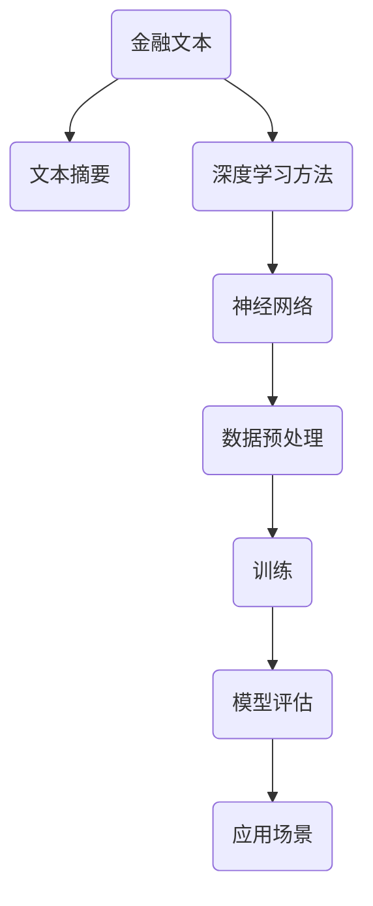

                 

### 让我们一步步思考：金融文本摘要生成的深度学习方法

随着金融行业的快速发展，文本数据量呈爆炸式增长，如何高效地从大量的金融文本中提取关键信息成为了一个关键问题。金融文本摘要生成技术应运而生，它不仅有助于提高信息检索的效率，还能帮助用户快速理解复杂的金融报告、新闻和公告。深度学习作为一种强大的机器学习技术，其在金融文本摘要生成中的应用越来越受到关注。本文将深入探讨金融文本摘要生成的深度学习方法，通过一步步的思考和分析，帮助读者理解和掌握这一前沿技术。

### 第一部分：背景介绍与基础概念

#### 第1章：问题背景与核心概念

##### 1.1.1 问题背景

在金融行业中，文本数据来源广泛，包括新闻报道、分析师报告、投资建议等。然而，这些文本通常信息量大，结构复杂，对于金融从业者和投资者来说，阅读和处理这些信息是一项繁琐且耗时的工作。因此，自动化的金融文本摘要技术能够显著提高工作效率，降低成本。

##### 1.1.2 核心概念

- **文本摘要**：文本摘要是指从原始文本中提取出关键信息，并以简洁、准确的方式呈现给用户。
- **深度学习方法**：深度学习是一种通过多层神经网络模型进行特征学习和分类的机器学习方法。
- **金融文本的特点**：金融文本通常具有数据量大、格式复杂、术语专业等特点。

##### 1.1.3 金融文本摘要的挑战

- **数据质量**：金融文本数据往往存在噪声、错别字等问题，这对文本预处理提出了高要求。
- **长文本处理**：金融文本通常篇幅较长，如何有效处理长文本是深度学习面临的挑战。
- **知识密集性**：金融文本涉及大量专业知识，如何准确提取和总结这些知识是深度学习需要解决的问题。

#### 概念属性特征对比

| 特征 | 文本摘要 | 深度学习方法 |
| ---- | -------- | ------------ |
| 目标 | 简化长文 | 提取关键信息 |
| 工具 | NLP技术 | 神经网络 |
| 难度 | 高 | 需要大量数据 |
| 应用 | 金融领域 | 多领域 |

#### ER实体关系图

##### 1.4 本章小结

本章介绍了金融文本摘要生成的背景、核心概念以及面临的挑战。通过对比文本摘要和深度学习方法的特点，为后续的深度学习在金融文本摘要中的应用奠定了基础。

### 第二部分：深度学习基础

#### 第2章：深度学习原理

##### 2.1 神经网络基础

- **神经元与层结构**：神经元是神经网络的基本单元，通过前向传播和反向传播进行信息传递。
- **前向传播与反向传播**：前向传播是信息从输入层到输出层的传递过程，反向传播则是根据误差调整网络权重。
- **激活函数**：激活函数用于引入非线性特性，常见的有Sigmoid、ReLU等。

##### 2.2 深度学习框架

- **TensorFlow**：由Google开发的开源深度学习框架，提供了丰富的工具和API。
- **PyTorch**：由Facebook开发的开源深度学习框架，以其灵活的动态图计算机制而闻名。

##### 2.3 模型训练策略

- **数据增强**：通过变换输入数据来增加模型的泛化能力。
- **优化算法**：用于调整模型参数，常见的有梯度下降、Adam等。
- **过拟合与正则化**：过拟合是指模型在训练数据上表现良好，但在测试数据上表现不佳。正则化是一种防止过拟合的技术。

##### 2.4 深度学习应用场景

- **图像识别**：深度学习在图像识别领域取得了显著成果，如人脸识别、物体检测等。
- **自然语言处理**：深度学习在自然语言处理中应用广泛，如机器翻译、情感分析等。

##### 2.5 深度学习相关术语解释

- **前向传播**：信息从输入层到输出层的传递过程。
- **反向传播**：根据输出误差调整模型参数的过程。
- **批量大小**：一次训练中输入样本的数量。
- **迭代次数**：模型训练的总次数。

##### 2.6 本章小结

本章介绍了深度学习的基础知识，包括神经网络的结构、深度学习框架、模型训练策略以及相关术语。这些基础概念为后续章节的金融文本摘要方法提供了理论支持。

### 第三部分：金融文本摘要方法

#### 第3章：传统文本摘要方法

##### 3.1 提取式摘要

- **基本原理**：从文本中直接提取关键信息，不进行语义理解。
- **应用实例**：自动新闻摘要、文档摘要。

##### 3.2 综合式摘要

- **基本原理**：结合提取式摘要和生成式摘要的优点，先提取关键信息，再进行语义理解。
- **应用实例**：会议纪要、报告摘要。

##### 3.3 基于深度学习的文本摘要

- **基本原理**：利用深度学习模型，通过语义理解生成摘要。
- **应用实例**：金融新闻摘要、财报摘要。

##### 3.4 文本摘要性能评估指标

- **ROUGE**：用于评估摘要质量的自动评估指标。
- **BLEU**：基于单词重叠率的评估指标。
- **F1-Score**：用于衡量模型准确率和召回率的综合指标。

##### 3.5 实际案例解析

- **案例一**：使用提取式摘要方法对金融新闻进行摘要。
- **案例二**：使用基于深度学习的文本摘要方法对财报进行摘要。

##### 3.6 本章小结

本章介绍了传统文本摘要方法和基于深度学习的文本摘要方法，并通过实际案例解析展示了不同方法的优缺点。

### 第四部分：深度学习在金融文本摘要中的应用

#### 第4章：金融文本数据处理

##### 4.1 金融文本数据预处理

- **数据清洗**：去除噪声、统一格式等。
- **数据归一化**：将不同特征的范围调整为相同。

##### 4.2 金融文本特征提取

- **词袋模型**：将文本转换为向量表示。
- **词嵌入**：将单词映射为密集向量。

##### 4.3 金融文本分类

- **基于深度学习的文本分类算法**：如卷积神经网络、循环神经网络等。
- **实践案例**：使用深度学习模型对金融文本进行分类。

##### 4.4 深度学习在金融文本摘要中的优化策略

- **上下文信息利用**：通过模型捕捉上下文信息，提高摘要质量。
- **模型融合**：结合多种模型的优势，提高摘要效果。

##### 4.5 深度学习在金融领域的其他应用

- **风险评估**：使用深度学习模型进行风险评估。
- **投资策略**：利用深度学习预测市场走势。

##### 4.6 本章小结

本章介绍了金融文本数据处理的方法和深度学习在金融文本摘要中的优化策略，并探讨了深度学习在金融领域的其他应用。

### 第五部分：项目实战

#### 第5章：项目概述

##### 5.1 项目背景

- **金融文本摘要项目的背景介绍**。

##### 5.2 项目目标

- **项目目标与预期成果**。

##### 5.3 项目介绍

- **系统功能设计**：定义系统需要实现的功能。
- **系统架构设计**：设计系统的整体架构。

##### 5.4 环境安装与配置

- **Python环境配置**：安装Python和相关依赖。
- **深度学习框架配置**：安装TensorFlow或PyTorch。

##### 5.5 系统核心实现源代码

- **数据预处理代码**：数据清洗、归一化等。
- **模型训练代码**：定义模型、训练过程等。
- **模型评估代码**：评估模型性能。

##### 5.6 代码应用解读与分析

- **代码应用解读**：详细解读系统核心代码。
- **分析**：对系统性能和效果进行分析。

##### 5.7 实际案例分析和详细讲解剖析

- **案例一**：使用系统对金融新闻进行摘要。
- **案例二**：使用系统对财报进行摘要。

##### 5.8 项目小结

- **项目成果总结**：总结项目的实施情况和成果。

##### 5.9 总结

- **项目经验总结**：总结项目过程中遇到的问题和解决方案。
- **未来展望**：探讨深度学习在金融文本摘要领域的未来发展趋势。

### 第六部分：最佳实践与总结

#### 第6章：最佳实践

##### 6.1 实践技巧

- **数据处理技巧**：如何处理金融文本数据。
- **模型训练技巧**：如何优化模型训练过程。

##### 6.2 注意事项

- **数据质量问题**：处理数据时应注意的问题。
- **模型选择问题**：选择模型时需要考虑的因素。

##### 6.3 拓展阅读

- **相关文献与资料推荐**：推荐一些与金融文本摘要相关的文献和资料。

##### 6.4 总结

- **成果回顾**：回顾项目的主要成果。
- **经验与教训**：总结项目过程中的经验和教训。
- **未来展望**：探讨深度学习在金融文本摘要领域的未来发展趋势。

### 结束语

本文通过一步步的思考，系统地介绍了金融文本摘要生成的深度学习方法。从背景介绍、基础概念，到深度学习原理、文本摘要方法，再到实际应用和项目实战，读者可以全面了解这一领域的前沿技术。希望通过本文，读者能够掌握金融文本摘要生成的关键技术和方法，为实际应用提供参考。

#### 作者信息

- **作者**：AI天才研究院/AI Genius Institute & 禅与计算机程序设计艺术 /Zen And The Art of Computer Programming

---

### 金融文本摘要生成的深度学习方法

> **关键词**：金融文本、文本摘要、深度学习、神经网络、NLP

> **摘要**：本文深入探讨了金融文本摘要生成的深度学习方法。通过对问题背景、核心概念、深度学习基础、金融文本摘要方法、实际应用和最佳实践的详细分析，展示了如何利用深度学习技术高效地从金融文本中提取关键信息，提升信息处理效率。本文旨在为读者提供关于金融文本摘要生成技术的全面理解和实际应用指导。

### 目录

----------------------------------------------------------------

# 金融文本摘要生成的深度学习方法

## 第一部分：背景介绍与基础概念

### 第1章：问题背景与核心概念

1.1 问题背景  
1.2 核心概念  
1.3 金融文本摘要的挑战

### 第2章：概念属性特征对比

2.1 文本摘要  
2.2 深度学习方法

### 第3章：ER实体关系图

## 第二部分：深度学习基础

### 第4章：深度学习原理

4.1 神经网络基础  
4.2 深度学习框架  
4.3 模型训练策略  
4.4 深度学习应用场景

### 第5章：深度学习相关术语解释

## 第三部分：金融文本摘要方法

### 第6章：传统文本摘要方法

6.1 提取式摘要  
6.2 综合式摘要  
6.3 基于深度学习的文本摘要

### 第7章：文本摘要性能评估指标

## 第四部分：深度学习在金融文本摘要中的应用

### 第8章：金融文本数据处理

8.1 金融文本数据预处理  
8.2 金融文本特征提取  
8.3 金融文本分类

### 第9章：深度学习在金融文本摘要中的优化策略

## 第五部分：项目实战

### 第10章：项目概述

10.1 项目背景  
10.2 项目目标  
10.3 项目介绍

### 第11章：环境安装与配置

11.1 Python环境配置  
11.2 深度学习框架配置

### 第12章：系统核心实现源代码

12.1 数据预处理代码  
12.2 模型训练代码  
12.3 模型评估代码

### 第13章：代码应用解读与分析

## 第六部分：最佳实践与总结

### 第14章：最佳实践

14.1 实践技巧  
14.2 注意事项  
14.3 拓展阅读

### 第15章：总结

15.1 成果回顾  
15.2 经验与教训  
15.3 未来展望

----------------------------------------------------------------

---

### 关键词

- 金融文本
- 文本摘要
- 深度学习
- 神经网络
- NLP

### 摘要

本文系统地介绍了金融文本摘要生成的深度学习方法。首先，分析了金融文本摘要的背景、核心概念和面临的挑战。接着，详细阐述了深度学习的原理、框架、训练策略和应用场景。随后，探讨了传统文本摘要方法和基于深度学习的文本摘要方法，以及文本摘要性能评估指标。进一步，介绍了深度学习在金融文本摘要中的应用，包括数据处理、特征提取、分类和优化策略。最后，通过一个项目实战案例，展示了深度学习在金融文本摘要中的实际应用，并总结了最佳实践和经验教训。本文旨在为读者提供关于金融文本摘要生成技术的全面理解和实际应用指导。

