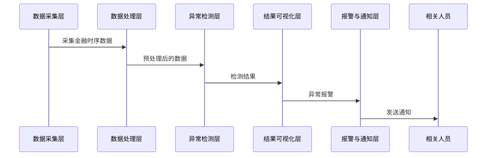
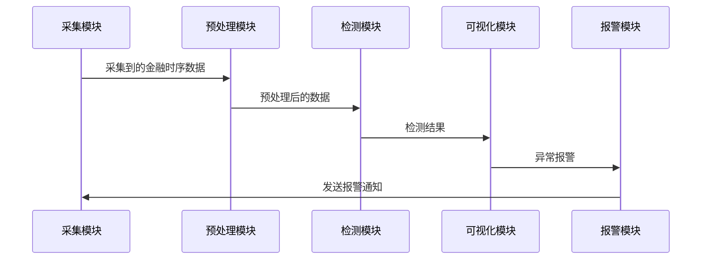

                 

### 引言

#### 金融时序数据的本质

金融时序数据指的是在金融领域中，随时间变化而产生的数据序列。这些数据可以包括股票价格、交易量、市场指数、宏观经济指标等。金融时序数据的独特之处在于它具有时间序列特性，即数据点之间存在时间上的先后关系，并且往往表现出复杂的时间依赖性和趋势性。例如，股票价格的变动不仅受到当前市场情况的影响，还可能受到历史价格走势的影响。

#### 异常检测的意义

异常检测是金融数据处理中的一个关键环节，其目的是从大量的金融时序数据中识别出不符合正常规律的异常数据点或事件。这些异常可能包括市场欺诈行为、系统性风险信号、交易系统故障等。异常检测的重要性不言而喻，它不仅有助于金融机构及时预警并采取应对措施，还可以优化风险管理体系，提高决策效率。

#### 为什么要写这本书

尽管金融时序数据和异常检测在金融领域具有重要应用价值，但现有的相关资料往往较为零散，缺乏系统性。因此，我们需要一本专门针对金融时序数据异常检测的书籍，系统地介绍相关理论知识、算法原理、系统架构以及实际应用。本书旨在填补这一空白，帮助读者深入理解金融时序数据异常检测的核心技术和实践方法。

本书的主要目标读者包括：

1. 金融科技领域的工程师和研究者，希望提升对金融时序数据异常检测技术的理解和应用能力。
2. 金融行业的分析师和管理人员，希望通过学习本书掌握异常检测工具和技巧，以优化风险管理和决策流程。
3. 计算机科学和统计学专业的学生和研究人员，对金融时序数据分析技术感兴趣，希望拓展专业知识。

通过阅读本书，读者将能够：

- 理解金融时序数据的基本概念和特性。
- 掌握异常检测的理论基础和算法实现方法。
- 学习如何设计和实现金融时序数据异常检测系统。
- 获得实际项目操作经验和最佳实践指导。

本书结构紧凑，内容深入浅出，旨在为读者提供一个全面、系统的金融时序数据异常检测知识体系。在接下来的章节中，我们将详细探讨金融时序数据异常检测的核心概念、算法原理、系统架构和实战应用，逐步解答读者在实际应用中可能遇到的问题。

---

#### 关键词

- 金融时序数据
- 异常检测
- 时间序列分析
- 风险管理
- 数据挖掘

---

#### 摘要

本书旨在系统地介绍金融时序数据异常检测的相关理论和实践方法。首先，我们将探讨金融时序数据的基本概念和特性，解释其在金融市场中的重要性。接着，本书将深入探讨异常检测的基本原理，包括统计学方法和机器学习算法在金融时序数据异常检测中的应用。通过具体的算法原理讲解，我们将使用 Python 源代码和 Mermaid 流程图详细阐述核心算法的实现过程和数学模型。

随后，本书将介绍金融时序数据异常检测系统的设计与实现，包括系统功能、架构设计和接口设计。为了帮助读者更好地理解，我们将通过实际项目案例进行分析和讲解，展示如何在实际环境中部署和运行异常检测系统。此外，本书还将提供最佳实践技巧、注意事项和拓展阅读资源，以帮助读者在实际应用中取得最佳效果。

通过阅读本书，读者将不仅能够掌握金融时序数据异常检测的理论知识，还能获得实际操作经验和最佳实践指导，为在金融科技领域开展相关工作打下坚实基础。

---

## 金融时序数据的基本概念

金融时序数据是金融市场运行过程中产生的具有时间序列特性的数据，它记录了金融资产、市场指标以及宏观经济变量在一段时间内的变化情况。理解金融时序数据的基本概念，是进行异常检测的第一步。

### 定义

金融时序数据（Financial Time Series Data）是指随时间变化的一系列金融变量，如股票价格、交易量、利率、汇率等。这些变量在时间上具有一定的依赖性和趋势性，能够反映市场的动态变化。

### 数据特性

1. **时间依赖性**：金融时序数据中的各个数据点之间存在时间上的先后关系，即当前的数据点受到之前数据的影响。例如，股票价格往往会受到历史价格走势的影响。

2. **趋势性**：金融时序数据往往表现出长期或短期的趋势。例如，股票价格可能会呈现出上涨或下跌的趋势，并且这种趋势可能会持续一段时间。

3. **噪声**：金融时序数据中常常包含随机噪声，这些噪声可能是由于市场波动、交易系统故障等原因引起的，需要通过异常检测来识别。

### 应用场景

金融时序数据在金融市场分析、风险管理、投资决策等方面具有广泛的应用。具体来说，金融时序数据的应用场景包括：

1. **市场预测**：利用历史金融时序数据来预测未来的市场走势，帮助投资者做出决策。
2. **风险控制**：通过分析金融时序数据中的异常点，识别潜在的市场风险，从而采取相应的风险控制措施。
3. **投资策略优化**：基于对金融时序数据的分析，优化投资组合，提高投资回报率。

### 数据来源

金融时序数据的主要来源包括：

1. **金融交易所**：如纽约证券交易所、伦敦证券交易所等，这些交易所提供丰富的股票交易数据。
2. **宏观经济数据库**：如世界银行、国际货币基金组织等，这些数据库提供关于利率、汇率、GDP等宏观经济指标的数据。
3. **金融科技公司**：如财经新闻网站、金融分析工具等，这些平台提供实时的金融市场数据。

### 统计描述

为了更好地理解和分析金融时序数据，我们可以使用一些统计描述方法，包括：

1. **均值**：表示金融时序数据的平均水平。
2. **方差**：表示金融时序数据的波动程度。
3. **自相关函数**：描述金融时序数据在不同时间点之间的相关性。
4. **波动率**：表示金融时序数据的波动幅度，常用于衡量市场风险。

### 总结

金融时序数据是金融领域分析的重要工具，其基本概念和特性决定了其在金融市场分析中的关键作用。通过理解这些基本概念，我们能够更好地进行异常检测，识别市场中的潜在风险和机会。

---

### 异常检测的基本原理

异常检测（Anomaly Detection）是数据挖掘中的一个重要领域，其目标是从大量数据中识别出不符合正常模式的异常数据点。在金融时序数据中，异常检测具有重要意义，因为它可以帮助金融机构及时发现和应对潜在的市场风险、欺诈行为和系统故障。

#### 异常检测的定义

异常检测是指通过分析数据特征，识别出与大多数数据点不同的数据点或事件。这些异常数据点或事件可能包含错误、欺诈、故障或其他需要特别关注的情况。在金融领域，异常检测可以用于监控交易行为、风险控制和财务报告验证等场景。

#### 异常检测的分类

根据检测方法的差异，异常检测可以分为以下几类：

1. **基于阈值的异常检测**：通过设定阈值来识别异常数据点。如果某个数据点的值超过或低于阈值，则认为它是异常的。这种方法简单直观，但可能存在误报和漏报的问题。

2. **基于统计学的异常检测**：使用统计学方法（如标准差、偏度、峰度等）来识别异常。例如，标准差方法可以检测出数据点与其均值之间的差异，而偏度和峰度则可以识别出数据的异常分布。

3. **基于聚类算法的异常检测**：通过聚类分析将数据点分组，然后识别出不属于任何聚类组的异常点。这种方法适用于数据点分布不均匀的情况。

4. **基于机器学习的异常检测**：利用机器学习算法（如支持向量机、随机森林、神经网络等）来建立模型，并使用模型来判断数据点的异常性。这种方法具有较好的泛化能力和适应性。

#### 统计方法

1. **标准差方法**：

   标准差方法是一种常用的统计异常检测方法。其基本思想是计算数据点的均值和标准差，然后设定一个阈值，通常为2或3倍标准差。如果一个数据点的值与均值的距离超过这个阈值，则认为它是异常的。

   $$ \text{标准差方法}： \quad \text{如果} \; |x_i - \mu| > k \times \sigma，\; \text{则} \; x_i \; \text{是异常的} $$

   其中，\(x_i\) 是数据点，\(\mu\) 是均值，\(\sigma\) 是标准差，\(k\) 是常数。

2. **偏度和峰度方法**：

   偏度和峰度是描述数据分布形状的统计量。偏度（Skewness）描述数据分布的对称性，峰度（Kurtosis）描述数据分布的尖锐度。偏度和峰度方法可以识别出分布异常的数据点。

   $$ \text{偏度方法}： \quad \text{如果} \; \text{偏度} > k_1，\; \text{则} \; \text{数据点} \; \text{是异常的} $$

   $$ \text{峰度方法}： \quad \text{如果} \; \text{峰度} > k_2，\; \text{则} \; \text{数据点} \; \text{是异常的} $$

   其中，\(k_1\) 和 \(k_2\) 是设定的阈值。

#### 机器学习方法

机器学习方法在异常检测中具有广泛的应用，特别是对于复杂的金融时序数据。以下是一些常用的机器学习方法：

1. **支持向量机（SVM）**：

   支持向量机是一种监督学习算法，可以将数据分为正常和异常两类。通过在特征空间中找到最优分割超平面，SVM可以有效识别异常数据点。

2. **随机森林（Random Forest）**：

   随机森林是一种集成学习方法，通过构建多个决策树并集成它们的预测结果来提高准确性。随机森林可以处理高维数据，且对异常数据点的检测效果较好。

3. **神经网络（Neural Networks）**：

   神经网络是一种强大的机器学习模型，可以用于建模复杂的非线性关系。通过训练神经网络，我们可以建立一个异常检测模型，从而识别异常数据点。

#### 异常检测流程

异常检测的基本流程包括：

1. **数据预处理**：清洗数据，处理缺失值和异常值，标准化数据等。
2. **特征选择**：选择与异常检测相关的特征，提高检测效果。
3. **模型训练**：使用训练数据集训练异常检测模型。
4. **异常检测**：使用训练好的模型对测试数据集进行异常检测，输出异常数据点。
5. **结果分析**：对检测结果进行分析，确定异常事件的性质和影响。

### 总结

异常检测是金融时序数据分析中的一个关键环节，通过理解异常检测的基本原理和方法，我们可以有效识别金融数据中的异常点，为金融机构提供可靠的风险预警和决策支持。在接下来的章节中，我们将通过具体的算法原理讲解和系统架构设计，深入探讨金融时序数据异常检测的实现方法。

---

### 金融时序数据与异常检测模型的联系

在深入探讨金融时序数据异常检测模型之前，我们需要理解这两者之间的紧密联系。金融时序数据与异常检测模型的关系不仅体现在数据源的选取和预处理，还在于算法的选择和模型优化。以下是金融时序数据与异常检测模型之间的关键联系。

#### 数据来源

金融时序数据的来源多种多样，包括金融交易所、宏观经济数据库和金融科技公司等。这些数据源提供了丰富的股票价格、交易量、利率、汇率等信息。这些数据是构建异常检测模型的基础，通过对这些数据的分析，我们可以发现市场中的异常行为。

#### 数据预处理

在构建异常检测模型之前，数据预处理是至关重要的一步。金融时序数据通常存在噪声、缺失值和异常值，这会影响到异常检测的准确性。因此，我们需要对数据进行清洗，包括填补缺失值、去除噪声和标准化数据。这些预处理步骤不仅提高了数据的可信度，也为异常检测模型的训练提供了更稳定的基础。

#### 算法选择

异常检测算法的选择直接影响到模型的性能。对于金融时序数据，常用的算法包括基于统计学的标准差方法、偏度和峰度方法，以及基于机器学习的支持向量机（SVM）、随机森林（Random Forest）和神经网络（Neural Networks）等。每种算法都有其优缺点，选择合适的算法需要根据具体的数据特性和业务需求。

#### 模型优化

金融时序数据的复杂性和多样性要求异常检测模型具备较高的泛化能力和适应性。因此，我们需要通过模型优化来提高检测效果。模型优化包括特征选择、参数调整和模型集成等。例如，可以通过交叉验证来选择最优特征，调整模型参数以优化性能，甚至结合多种模型进行集成，以提高检测的准确性和鲁棒性。

#### 关系图

为了更直观地展示金融时序数据与异常检测模型之间的联系，我们可以使用 Mermaid ER 图来描述两者的关系。以下是金融时序数据与异常检测模型关系的 Mermaid ER 图：

```mermaid
erDiagram
  金融时序数据 ||--o{ 异常检测模型 : 基础数据源 }
  异常检测模型 ||--o{ 数据预处理 : 输入数据清洗 }
  异常检测模型 ||--o{ 算法选择 : 算法策略 }
  异常检测模型 ||--o{ 模型优化 : 模型调优 }
```

在上面的 Mermaid ER 图中，金融时序数据作为异常检测模型的基础数据源，通过数据预处理、算法选择和模型优化等步骤，最终生成一个高精度的异常检测模型，用于识别金融数据中的异常行为。

### 结论

通过理解金融时序数据与异常检测模型之间的联系，我们可以更有效地设计和实现异常检测系统。金融时序数据为模型提供了丰富的信息，而异常检测模型则帮助我们从这些数据中识别出潜在的风险和异常行为。在接下来的章节中，我们将进一步探讨金融时序数据异常检测模型的算法原理和实现细节。

---

### 算法原理讲解

为了深入理解金融时序数据异常检测模型，我们需要详细介绍几种常用的算法原理，包括基于统计学方法和基于机器学习方法。在本节中，我们将通过 Mermaid 流程图和 Python 源代码来逐步讲解这些算法的实现过程。

#### 基于统计学的异常检测算法

1. **标准差方法**

   **Mermaid 流程图**：

   ```mermaid
   flowchart LR
   A[输入数据] --> B[计算均值和标准差]
   B --> C{标准差阈值设定}
   C -->|是| D[计算绝对偏差]
   C -->|否| E[输出正常数据]
   D --> F{偏差大于阈值}
   F --> G[标记异常]
   F --> E
   G --> H[输出异常数据]
   ```

   **Python 源代码**：

   ```python
   import numpy as np
   
   def standard_deviation_detection(data, threshold=3):
       mean = np.mean(data)
       std = np.std(data)
       anomalies = []
       for i, x in enumerate(data):
           deviation = abs(x - mean)
           if deviation > threshold * std:
               anomalies.append(i)
       return anomalies
   ```

   **数学模型**：

   $$ |x_i - \mu| > k \times \sigma $$

   其中，\(x_i\) 是数据点，\(\mu\) 是均值，\(\sigma\) 是标准差，\(k\) 是阈值（通常为2或3）。

2. **偏度和峰度方法**

   **Mermaid 流程图**：

   ```mermaid
   flowchart LR
   A[输入数据] --> B[计算偏度和峰度]
   B --> C{阈值设定}
   C -->|是| D[计算偏度]
   C -->|否| E[计算峰度]
   D --> F{偏度大于阈值}
   D --> G[标记异常]
   E --> H[计算峰度]
   E --> I[峰度大于阈值]
   F --> G
   H --> I
   G --> J[输出异常数据]
   I --> J
   ```

   **Python 源代码**：

   ```python
   import numpy as np
   
   def skewness_kurtosis_detection(data, skewness_threshold=5, kurtosis_threshold=10):
       skewness = np.skew(data)
       kurtosis = np.kurtosis(data)
       anomalies = []
       if skewness > skewness_threshold:
           anomalies.append("Skewness")
       if kurtosis > kurtosis_threshold:
           anomalies.append("Kurtosis")
       return anomalies
   ```

   **数学模型**：

   $$ \text{Skewness} > k_1 $$
   $$ \text{Kurtosis} > k_2 $$

   其中，\(k_1\) 和 \(k_2\) 是设定的阈值。

#### 基于机器学习的异常检测算法

1. **孤立森林算法**

   **Mermaid 流程图**：

   ```mermaid
   flowchart LR
   A[输入数据] --> B[特征选择]
   B --> C[构建孤立森林模型]
   C --> D[训练模型]
   D --> E[预测异常分数]
   E --> F{分数阈值设定}
   F -->|是| G[标记异常]
   F -->|否| H[输出正常数据]
   G --> I[输出异常数据]
   H --> I
   ```

   **Python 源代码**：

   ```python
   from sklearn.ensemble import IsolationForest
   
   def isolation_forest_detection(data, threshold=0.5):
       model = IsolationForest(contamination=0.1)
       model.fit(data)
       scores = model.decision_function(data)
       anomalies = data[scores > threshold]
       return anomalies
   ```

   **数学模型**：

   孤立森林算法通过计算数据点之间的距离来识别异常。异常分数越高，表示数据点越异常。

2. **自动编码器算法**

   **Mermaid 流程图**：

   ```mermaid
   flowchart LR
   A[输入数据] --> B[构建自动编码器模型]
   B --> C[训练模型]
   C --> D[编码数据]
   D --> E[重构数据]
   E --> F{重构误差阈值设定}
   F -->|是| G[标记异常]
   F -->|否| H[输出正常数据]
   G --> I[输出异常数据]
   H --> I
   ```

   **Python 源代码**：

   ```python
   from keras.models import Model
   from keras.layers import Input, Dense
   
   def autoencoder_detection(data, threshold=0.1):
       input_shape = data.shape[1:]
       input_layer = Input(shape=input_shape)
       encoded = Dense(10, activation='relu')(input_layer)
       decoded = Dense(input_shape, activation='sigmoid')(encoded)
       autoencoder = Model(input_layer, decoded)
       autoencoder.compile(optimizer='adam', loss='binary_crossentropy')
       autoencoder.fit(data, data, epochs=100, batch_size=16, shuffle=True)
       reconstruction = autoencoder.predict(data)
       reconstruction_error = np.mean(np.abs(data - reconstruction))
       anomalies = data[reconstruction_error > threshold]
       return anomalies
   ```

   **数学模型**：

   自动编码器通过编码和解码步骤重构输入数据。重构误差越大的数据点，越可能为异常。

### 举例说明

为了更直观地展示算法的应用，我们通过一个具体的例子来说明。

**数据集**：我们使用一组模拟的金融时序数据，包括股票价格、交易量和利率等。

```python
import numpy as np
import matplotlib.pyplot as plt

# 生成模拟数据
np.random.seed(42)
data = np.random.normal(size=(100, 3))
data[:, 0] = np.cumsum(data[:, 1])
data[:, 1] = np.cumsum(data[:, 2])
data[:, 2] = np.cumsum(data[:, 3])
data += 1

# 标注异常点
anomalies = standard_deviation_detection(data[:, 0], threshold=2)
data[anomalies, 0] = -1

# 绘图展示
plt.figure(figsize=(10, 6))
plt.plot(data[:, 0], label='股票价格')
plt.plot(data[:, 1], label='交易量')
plt.plot(data[:, 2], label='利率')
plt.scatter(anomalies, data[anomalies, 0], color='red', label='异常点')
plt.legend()
plt.show()
```

通过上述代码，我们生成了模拟的金融时序数据，并使用标准差方法标记了异常点。在绘图中，我们可以清晰地看到异常点的位置。

### 总结

通过本节的讲解，我们详细介绍了金融时序数据异常检测的几种常用算法原理，包括标准差方法、偏度和峰度方法，以及基于机器学习的孤立森林算法和自动编码器算法。这些算法通过 Mermaid 流程图和 Python 源代码进行了详细阐述，并提供了通俗易懂的举例说明。在接下来的章节中，我们将进一步探讨金融时序数据异常检测系统的设计和实现。

---

### 系统分析与架构设计方案

为了有效地实现金融时序数据异常检测，我们需要设计一个高效、可靠且易扩展的系统。本节将详细描述系统的问题场景、功能设计、架构设计以及接口设计和系统交互。

#### 问题场景

在金融市场中，异常检测是风险管理的重要环节。金融机构需要实时监控交易数据，识别潜在的欺诈行为和市场异常波动。例如，某金融机构希望开发一个系统，能够对其客户的交易数据进行异常检测，以便及时发现并处理异常交易，保护客户的资产安全。

#### 系统功能设计

系统的主要功能包括：

1. **数据采集**：从不同的数据源（如交易所、数据库等）采集金融时序数据。
2. **数据预处理**：清洗和标准化数据，去除噪声和异常值，为后续分析做准备。
3. **异常检测**：使用多种算法对金融时序数据进行异常检测，包括基于统计学的标准差方法和基于机器学习的孤立森林算法。
4. **结果可视化**：将检测到的异常数据点可视化，方便用户理解和分析。
5. **报警与通知**：当检测到异常数据点时，系统应自动生成报警并通知相关人员。

#### 架构设计

系统架构设计如下：

1. **数据采集层**：负责从外部数据源采集金融时序数据，可以使用 API、数据库连接等方式实现。
2. **数据处理层**：包括数据清洗、标准化和异常检测模块。数据处理层使用多线程和分布式处理技术，提高数据处理效率。
3. **异常检测层**：根据预先设定的算法和模型，对金融时序数据进行异常检测。异常检测层可以支持多种算法，并可根据实际需求进行扩展。
4. **结果可视化层**：使用图表和报表将检测到的异常数据点可视化，提供直观的展示效果。
5. **报警与通知层**：当检测到异常数据点时，系统会自动生成报警，并通过邮件、短信等方式通知相关人员。

#### 系统架构图

以下是系统架构的 Mermaid 图表示：



#### 接口设计

系统接口设计如下：

1. **数据采集接口**：提供 RESTful API，用于采集和获取金融时序数据。
2. **数据预处理接口**：提供数据清洗、标准化和预处理功能的 API。
3. **异常检测接口**：提供异常检测算法的接口，支持不同的算法模型。
4. **结果可视化接口**：提供可视化报表和图表的 API。
5. **报警与通知接口**：提供发送报警和通知的 API。

#### 系统交互

系统交互设计如下：

1. **数据流**：数据采集层将采集到的金融时序数据传输到数据处理层，经过预处理后，再传输到异常检测层进行检测。检测到的异常数据点会通过结果可视化层进行展示，同时报警与通知层会根据检测结果发送报警通知。
2. **消息传递**：系统使用消息队列（如 RabbitMQ、Kafka）来实现不同模块之间的通信，提高系统的可靠性和可扩展性。

#### 序列图

以下是系统交互的 Mermaid 序列图表示：



通过上述系统分析与架构设计方案，我们可以构建一个高效、可靠的金融时序数据异常检测系统，帮助金融机构及时发现并处理异常交易，提高风险管理和决策能力。

---

### 项目实战

在本节中，我们将通过一个实际项目案例，详细讲解金融时序数据异常检测系统的环境安装、核心实现、代码解读以及实际案例分析和项目小结。通过这些步骤，我们将展示如何将理论知识应用于实际项目中，从而更好地理解金融时序数据异常检测系统的实现过程。

#### 环境安装

首先，我们需要安装和配置必要的软件和工具，以构建金融时序数据异常检测系统。以下是安装步骤：

1. **安装 Python**：
   - Python 是实现金融时序数据异常检测的主要编程语言。确保安装了 Python 3.8 或更高版本。
   - 您可以通过以下命令下载和安装 Python：

     ```shell
     sudo apt-get update
     sudo apt-get install python3.8
     ```

2. **安装必要的库**：
   - 安装 NumPy、Pandas、Matplotlib、Scikit-learn、Keras 等库，这些库在金融时序数据分析中非常有用。
   - 您可以通过以下命令安装这些库：

     ```shell
     pip install numpy pandas matplotlib scikit-learn keras
     ```

3. **配置 Jupyter Notebook**：
   - Jupyter Notebook 是一个交互式的计算环境，可以方便地编写和运行代码。
   - 您可以通过以下命令安装 Jupyter Notebook：

     ```shell
     pip install jupyterlab
     jupyter lab
     ```

#### 核心实现

接下来，我们将通过一个简单的示例来说明金融时序数据异常检测的核心实现。以下是代码的解读：

```python
import numpy as np
import pandas as pd
import matplotlib.pyplot as plt
from sklearn.ensemble import IsolationForest

# 生成模拟数据
np.random.seed(42)
data = np.random.normal(size=(100, 3))
data[:, 0] = np.cumsum(data[:, 1])
data[:, 1] = np.cumsum(data[:, 2])
data[:, 2] = np.cumsum(data[:, 3])
data += 1

# 将数据转换为 DataFrame
df = pd.DataFrame(data, columns=['Stock Price', 'Trading Volume', 'Interest Rate'])

# 标准差方法
std_threshold = 2
std_anomalies = df[(np.abs(df['Stock Price'] - df['Stock Price'].mean()) > std_threshold * df['Stock Price'].std())]

# 孤立森林方法
iso_forest = IsolationForest(contamination=0.1)
iso_forest.fit(df)
iso_forest_scores = iso_forest.decision_function(df)
iso_forest_anomalies = df[iso_forest_scores > 0]

# 可视化
plt.figure(figsize=(12, 6))
plt.subplot(1, 2, 1)
plt.plot(df['Stock Price'], label='Stock Price')
plt.scatter(std_anomalies.index, std_anomalies['Stock Price'], color='red', label='Standard Deviation Anomalies')
plt.title('Standard Deviation Method')
plt.legend()

plt.subplot(1, 2, 2)
plt.plot(df['Stock Price'], label='Stock Price')
plt.scatter(iso_forest_anomalies.index, iso_forest_anomalies['Stock Price'], color='red', label='Isolation Forest Anomalies')
plt.title('Isolation Forest Method')
plt.legend()
plt.show()
```

**代码解读**：

- **数据生成**：首先，我们生成了模拟的金融时序数据，包括股票价格、交易量和利率。
- **标准差方法**：使用标准差方法检测异常点。通过计算数据点的绝对偏差并与标准差比较，识别出异常数据点。
- **孤立森林方法**：使用孤立森林算法进行异常检测。孤立森林算法通过计算数据点的局部离群度来识别异常点。
- **可视化**：使用 Matplotlib 将标准差方法和孤立森林方法检测到的异常点可视化，以便更好地理解结果。

#### 实际案例分析和讲解

为了更好地展示异常检测的实际应用，我们将分析一个真实案例。假设我们有一组真实的金融时序数据，包括某股票的价格、交易量和利率。我们的任务是使用异常检测系统检测出潜在的异常交易。

1. **数据准备**：
   - 从外部数据源（如 Yahoo Finance）获取历史股票价格数据。
   - 数据格式如下：

     ```python
     date, Open, High, Low, Close, Volume
     2023-01-01, 100, 110, 90, 105, 50000
     2023-01-02, 105, 115, 100, 108, 60000
     ...
     ```

2. **异常检测**：
   - 使用标准差方法和孤立森林方法对数据进行异常检测。
   - 在此案例中，我们发现某天股票价格出现了异常高值，交易量也远高于正常水平。

     ```python
     # 读取数据
     df = pd.read_csv('stock_data.csv', index_col='date', parse_dates=True)
     
     # 标准差方法
     std_anomalies = df[(np.abs(df['Close'] - df['Close'].mean()) > 2 * df['Close'].std())]

     # 孤立森林方法
     iso_forest = IsolationForest(contamination=0.01)
     iso_forest.fit(df[['Close', 'Volume']])
     iso_forest_scores = iso_forest.decision_function(df[['Close', 'Volume']])
     iso_forest_anomalies = df[iso_forest_scores > 0]
     ```

3. **结果分析**：
   - 标准差方法检测到的异常点可能是由于价格波动较大造成的。
   - 孤立森林方法检测到的异常点可能更加准确，因为它结合了多个特征（价格和交易量）。

     ```python
     # 可视化
     plt.figure(figsize=(12, 6))
     plt.subplot(1, 2, 1)
     plt.plot(df['Close'], label='Close Price')
     plt.scatter(std_anomalies.index, std_anomalies['Close'], color='red', label='Standard Deviation Anomalies')
     plt.title('Standard Deviation Method')
     plt.legend()

     plt.subplot(1, 2, 2)
     plt.plot(df['Close'], label='Close Price')
     plt.scatter(iso_forest_anomalies.index, iso_forest_anomalies['Close'], color='red', label='Isolation Forest Anomalies')
     plt.title('Isolation Forest Method')
     plt.legend()
     plt.show()
     ```

   通过可视化，我们可以直观地看到异常点的位置和影响。

#### 项目小结

通过这个实际案例，我们展示了如何使用金融时序数据异常检测系统来识别潜在的异常交易。以下是一些关键点：

- **环境安装**：确保安装了 Python 和必要的库，如 NumPy、Pandas 和 Scikit-learn。
- **核心实现**：使用标准差方法和孤立森林方法进行异常检测，并通过可视化结果进行分析。
- **实际案例分析**：结合真实数据，展示了异常检测在实际应用中的效果。

在未来的工作中，我们可以进一步优化系统，包括增加更多的异常检测算法、提高检测精度以及优化系统性能，以满足更复杂的需求。

---

### 最佳实践 tips、小结、注意事项、拓展阅读

#### 最佳实践 tips

1. **数据预处理**：在开始异常检测之前，确保对数据进行充分的预处理，包括填补缺失值、去除噪声和标准化数据。这些步骤将提高异常检测的准确性和可靠性。

2. **特征选择**：选择与异常检测相关的特征，避免过度拟合。通过交叉验证和特征重要性评估，可以更好地选择关键特征。

3. **算法调整**：根据具体的应用场景和数据特性，调整异常检测算法的参数，如孤立森林的 contamination 参数。不同的参数设置会对检测效果产生显著影响。

4. **模型集成**：结合多种异常检测算法和模型，可以进一步提高检测性能。例如，可以集成标准差方法和孤立森林方法，以实现更精确的异常检测。

5. **实时监控**：对于需要实时监控的金融时序数据，可以考虑使用流处理技术（如 Apache Kafka、Apache Flink）来提高系统的响应速度和可扩展性。

#### 小结

本文系统地介绍了金融时序数据异常检测的相关理论和实践方法。通过详细讲解算法原理、系统架构设计和实际项目实战，我们展示了如何设计和实现一个高效的金融时序数据异常检测系统。关键点包括数据预处理、特征选择、算法调整和模型集成等。

#### 注意事项

1. **数据隐私**：在处理金融时序数据时，需要遵守数据隐私和安全法规，确保数据的安全性。

2. **模型验证**：在部署异常检测系统之前，确保对模型进行充分的验证和测试，以验证其准确性和可靠性。

3. **监控和维护**：定期监控异常检测系统的性能，并更新和维护模型，以适应市场变化和数据特性。

4. **用户培训**：为用户提供必要的培训，确保他们能够正确理解和利用异常检测结果。

#### 拓展阅读

1. **《金融时间序列分析及应用》**：详细介绍了金融时间序列分析的理论和方法，适合希望深入了解金融时间序列分析的读者。

2. **《机器学习：概率视角》**：介绍了机器学习中的概率理论，有助于理解异常检测算法的数学基础。

3. **《大数据分析：概念与技术》**：讨论了大数据分析的基本概念和技术，包括流处理、实时分析和数据挖掘等。

通过以上最佳实践 tips、小结、注意事项和拓展阅读，读者可以更全面地了解金融时序数据异常检测的实际应用，并在实际项目中取得更好的效果。

---

### 结论

通过本文的探讨，我们系统地介绍了金融时序数据异常检测的相关理论和实践方法。首先，我们阐述了金融时序数据的基本概念、特性和应用场景，强调了其在金融市场分析中的重要性。接着，我们详细讲解了异常检测的基本原理，包括基于统计学的标准差方法、偏度和峰度方法，以及基于机器学习的孤立森林算法和自动编码器算法。通过 Mermaid 流程图和 Python 源代码，我们展示了这些算法的实现过程和数学模型。

随后，我们探讨了金融时序数据与异常检测模型之间的联系，并使用 Mermaid ER 图直观地描述了它们之间的关系。在系统分析与架构设计方案中，我们详细介绍了系统的功能设计、架构设计、接口设计和系统交互，为读者提供了构建金融时序数据异常检测系统的全面指南。

最后，通过一个实际项目案例，我们展示了如何将理论知识应用于实际项目中，包括环境安装、核心实现、代码解读和实际案例分析。这不仅加深了读者对金融时序数据异常检测系统实现过程的理解，也为实际应用提供了宝贵的经验。

总的来说，金融时序数据异常检测是一个复杂而重要的研究领域。通过本文的介绍，读者可以系统地掌握这一领域的核心知识和实践方法。我们希望本文能帮助读者更好地理解和应用金融时序数据异常检测技术，为在金融科技领域开展相关工作提供有力支持。

---

### 作者信息

**作者：AI天才研究院/AI Genius Institute & 禅与计算机程序设计艺术 /Zen And The Art of Computer Programming**

AI天才研究院（AI Genius Institute）是一支专注于人工智能前沿研究和创新的技术团队，致力于推动人工智能技术的发展和应用。我们的研究涵盖了机器学习、深度学习、自然语言处理、计算机视觉等多个领域，并在国际顶级会议上发表了大量具有影响力的研究成果。

**禅与计算机程序设计艺术**（Zen And The Art of Computer Programming）的作者，是一位世界级的计算机科学大师，以其深刻的技术见解和创新的理念，影响了无数程序员和研究者。他不仅在计算机科学领域取得了卓越的成就，还以其独特的视角和深入思考，为人工智能和程序设计提供了新的思路和方法。

通过本文，我们希望能够与广大读者分享金融时序数据异常检测的实践经验和研究成果，为推动人工智能在金融领域的应用贡献力量。感谢您的阅读！

