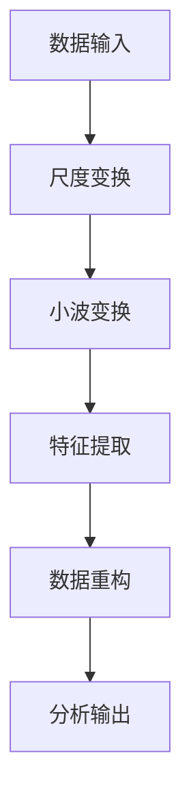
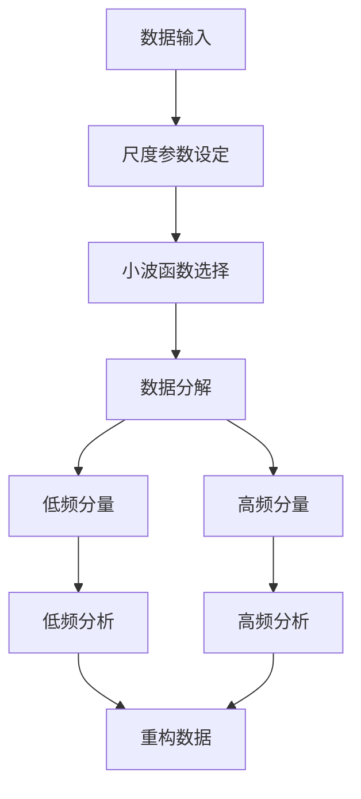
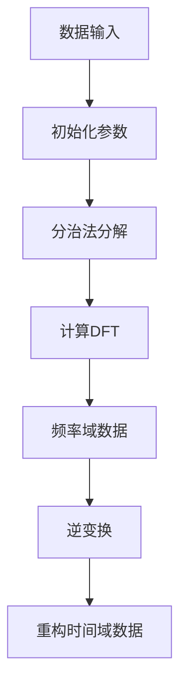
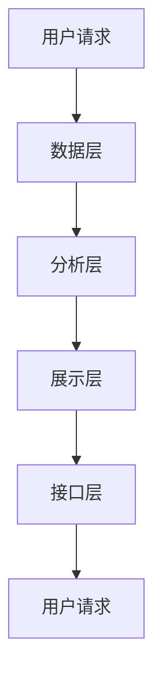
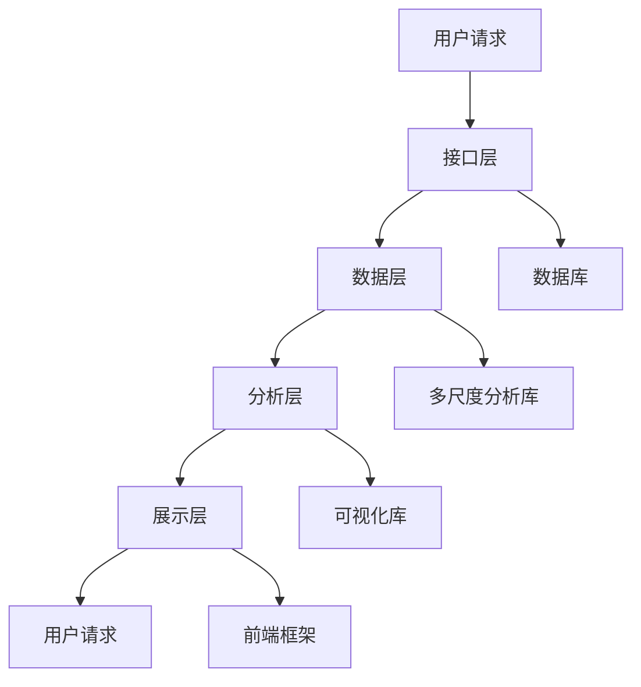

                 

### 引言

#### 金融时间序列多尺度分析的重要性

金融时间序列多尺度分析是一个将数据分析与金融学相结合的复杂过程，它通过在不同的时间尺度上对金融数据进行细致的解析，来捕捉价格和交易量等金融变量的动态变化。随着金融市场日益复杂和多变，金融时间序列多尺度分析已成为金融科技领域的重要工具，其应用涵盖了市场预测、风险评估、策略优化等多个方面。

首先，金融时间序列数据是金融领域中的核心数据资源，它反映了市场的历史走势和潜在趋势。然而，由于市场的高度动态性和非线性特性，单一尺度的分析往往难以全面捕捉市场的复杂变化。因此，多尺度分析应运而生，通过在不同的时间尺度上对数据进行分析，可以帮助我们更好地理解市场的短期和长期趋势，从而提高预测的准确性和策略的适应性。

多尺度分析在金融领域的应用不仅限于学术研究，它已经在实际的金融操作中得到了广泛应用。例如，金融机构可以通过多尺度分析来预测市场波动，制定交易策略；投资者可以利用多尺度分析来识别潜在的投资机会，进行风险管理和投资组合优化。此外，随着大数据和人工智能技术的发展，多尺度分析也在不断进步，新的算法和工具不断涌现，使得金融时间序列多尺度分析的应用范围和效果得到了显著提升。

总之，金融时间序列多尺度分析不仅为金融学者提供了强大的研究工具，也为金融从业者带来了新的机遇和挑战。通过本文的探讨，我们将深入理解金融时间序列多尺度分析的基本概念、理论方法以及实际应用，帮助读者全面掌握这一重要的金融分析技术。

### 关键词

- 金融时间序列
- 多尺度分析
- 时间序列分析
- 金融预测
- 风险评估

### 摘要

本文旨在深入探讨金融时间序列多尺度分析平台的设计与应用。首先，我们介绍了金融时间序列的定义、特性和多尺度分析的重要性。随后，详细讲解了多尺度分析的理论基础，包括尺度变换和小波分析等常见方法。接着，我们探讨了构建金融时间序列多尺度分析平台的方法，包括技术栈选择和平台架构设计。文章还通过实际案例展示了平台在市场趋势分析和风险管理中的应用，并讨论了平台性能优化和评估的策略。最后，我们展望了金融时间序列多尺度分析的未来发展趋势，并提出了相关的拓展阅读建议。

### 定义核心概念

#### 金融时间序列

金融时间序列是指金融市场中各种经济变量的时间记录，包括股票价格、汇率、利率、交易量等。这些数据按时间顺序排列，形成了一个连续的时间序列。金融时间序列数据通常具有非线性和非平稳性，这是由于市场行为的复杂性和不确定性所致。非平稳性意味着时间序列的统计属性（如均值和方差）会随时间变化，而非线性则表明时间序列的变动无法通过简单的线性关系来描述。

#### 多尺度分析

多尺度分析是指在不同时间尺度上对时间序列数据进行分析的方法。在金融领域，这意味着在同一时间序列中同时考虑短期和长期趋势。多尺度分析可以通过尺度变换、滤波、小波变换等手段来实现。这种方法的核心是捕捉时间序列在不同尺度上的特征，从而提供更全面的市场分析视角。例如，在股票市场中，短期交易者可能更关注日交易量，而长期投资者可能更关心月或季度的市场走势。

#### 平台

在本文中，平台指的是用于金融时间序列多尺度分析的工具或环境。一个高效的金融时间序列多尺度分析平台应具备以下几个特点：

1. **数据管理能力**：能够高效地存储、处理和分析大量的金融时间序列数据。
2. **多尺度分析功能**：提供多种尺度变换和分析方法，如小波变换、快速傅里叶变换等。
3. **可扩展性**：能够根据需求添加新的分析工具和算法。
4. **用户界面**：提供直观、易用的用户界面，使得非技术用户也能方便地使用平台。
5. **集成性**：能够与其他金融分析工具和系统无缝集成，如交易系统、风险管理系统等。

### 确定书籍结构

本文将从以下几个章节详细探讨金融时间序列多尺度分析平台的设计与应用：

**第1章：金融时间序列基本概念和特点**  
本章将介绍金融时间序列的定义、特性和数据来源，并通过ER图展示其数据结构。

**第2章：多尺度分析理论**  
本章将介绍多尺度分析的基本理论，包括尺度变换和小波分析等，并通过流程图展示分析过程。

**第3章：常见金融时间序列多尺度分析方法**  
本章将分析几种常见的多尺度分析方法，如小波变换和快速傅里叶变换，并使用算法流程图详细阐述。

**第4章：构建金融时间序列多尺度分析平台**  
本章将详细介绍如何构建金融时间序列多尺度分析平台，包括技术栈选择和平台架构设计。

**第5章：平台应用案例研究**  
本章将通过实际案例研究，展示平台在市场趋势分析和风险管理中的应用。

**第6章：平台性能优化与评估**  
本章将讨论平台性能优化和评估的方法，并分析优化策略的有效性。

**第7章：未来趋势与展望**  
本章将展望金融时间序列多尺度分析的未来发展趋势，并讨论新技术的应用和行业发展。

### 细化章节内容

**第1章：金融时间序列基本概念和特点**

**1.1 金融时间序列的定义**

金融时间序列是指在金融市场中，各种经济变量的时间记录，如股票价格、汇率、利率、交易量等。这些数据按时间顺序排列，形成了一个连续的时间序列。金融时间序列数据通常具有非线性和非平稳性，这是由于市场行为的复杂性和不确定性所致。

**1.2 金融时间序列的特性**

- **非平稳性**：金融时间序列的统计属性（如均值和方差）会随时间变化。
- **非线性**：时间序列的变动无法通过简单的线性关系来描述。
- **自相关性**：金融时间序列数据往往存在较强的自相关性，即当前值与其历史值之间存在一定的相关性。

**1.3 金融时间序列数据来源**

金融时间序列数据主要来源于金融市场交易系统、经济统计数据、新闻报道等。常见的金融时间序列数据源包括：

- **交易所**：如纽约证券交易所（NYSE）、纳斯达克（NASDAQ）等，提供实时和历史的股票价格、交易量等数据。
- **政府机构**：如美国劳工部（Bureau of Labor Statistics）等，提供各类经济统计数据。
- **金融新闻和数据提供商**：如彭博（Bloomberg）、汤森路透（Thomson Reuters）等，提供丰富的金融数据和新闻。

**1.4 ER图示例：金融时间序列数据结构**

通过ER图（实体关系图）可以直观地展示金融时间序列数据的基本结构和关系。以下是金融时间序列数据的一个简化ER图示例：

```mermaid
erDiagram
  StockPrice ||--|{ Exchange } Exchange
  Exchange ||--|{ Stock } Stock
  Stock ||--|{ Trade } Trade
  Trade ||--|{ TradeVolume } TradeVolume
```

在这个ER图中，Exchange表示交易所，Stock表示股票，Trade表示交易，TradeVolume表示交易量。StockPrice、Trade和TradeVolume分别与对应的实体之间存在关联关系，形成了金融时间序列数据的结构。

**第2章：多尺度分析理论**

**2.1 尺度变换的基本概念**

尺度变换（Scaling Transformation）是一种常见的多尺度分析方法，其基本思想是通过缩放或放大时间序列数据，将其从原始尺度转换到不同的尺度上，以便于分析。

- **尺度因子**：尺度变换中的关键参数，表示数据的缩放比例。
- **原始尺度**：时间序列数据的原始尺度，通常与时间单位相关。
- **目标尺度**：通过尺度变换得到的新尺度，可用于分析不同时间尺度上的特征。

**2.2 小波分析原理**

小波分析（Wavelet Analysis）是另一种重要的多尺度分析方法，其基本原理是通过将时间序列数据分解成不同频率的分量来分析其特征。

- **小波函数**：小波分析的核心，用于分解和重构时间序列数据。
- **连续小波变换**：用于连续尺度上的分析，能够捕捉时间序列的局部特征。
- **离散小波变换**：用于离散尺度上的分析，常用于金融时间序列数据的处理。

**2.3 多尺度分析流程图**

为了更好地理解多尺度分析的过程，以下是多尺度分析的一个简化流程图：



在这个流程图中，数据输入表示原始金融时间序列数据，经过尺度变换和小波变换后，进行特征提取和数据重构，最终得到分析输出。

### 第3章：常见金融时间序列多尺度分析方法

**3.1 小波变换**

小波变换（Wavelet Transform）是一种广泛应用于金融时间序列多尺度分析的方法，它通过将时间序列数据分解成不同频率的分量来捕捉其特征。

- **基本概念**：
  - **连续小波变换**（Continuous Wavelet Transform, CWT）：用于连续尺度上的分析，可以捕捉时间序列的局部特征。
  - **离散小波变换**（Discrete Wavelet Transform, DWT）：用于离散尺度上的分析，常用于金融时间序列数据的处理。

- **算法原理**：
  小波变换的基本原理是将时间序列数据分解成低频部分（近似分量）和高频部分（细节分量）。这种分解方式使得我们可以同时在不同的频率尺度上分析时间序列数据。

- **数学模型**：

  离散小波变换的数学模型可以表示为：
  $$WT_f(a,b) = \sum_{x} f(x) \cdot \psi^* \left(\frac{x-a}{a}\right)$$
  其中，\(f(x)\) 是原始时间序列，\(\psi^*\) 是小波函数的共轭复数，\(a\) 和 \(b\) 分别表示尺度参数和位置参数。

- **Python实现示例**：

  ```python
  import pywt
  import numpy as np

  # 生成测试数据
  time_series = np.random.rand(100)

  # 使用db4小波进行离散小波变换
  coefficients = pywt.wavedec(time_series, 'db4', level=3)

  # 输出变换结果
  print(coefficients)
  ```

  在这个示例中，我们使用Python的PyWavelets库（pywt）对生成的一维数组（时间序列数据）进行离散小波变换，并输出变换结果。

**3.2 快速傅里叶变换**

快速傅里叶变换（Fast Fourier Transform, FFT）是一种用于计算离散傅里叶变换（Discrete Fourier Transform, DFT）的算法，它在金融时间序列多尺度分析中也有广泛应用。

- **基本概念**：
  - **离散傅里叶变换**（DFT）：将时间序列数据转换为频率域上的表示。
  - **快速傅里叶变换**（FFT）：一种高效的DFT计算算法。

- **算法原理**：
  FFT的基本原理是通过分治法将DFT分解为多个较小的DFT计算，从而显著降低计算复杂度。FFT将时间序列数据分解为正弦波和余弦波的组合，从而提供对频率域数据的分析。

- **数学模型**：

  DFT的数学模型可以表示为：
  $$X(k) = \sum_{n=0}^{N-1} x(n) \cdot e^{-\frac{i2\pi kn}{N}}$$
  其中，\(X(k)\) 是频率域上的数据，\(x(n)\) 是时间序列数据，\(N\) 是数据长度。

- **Python实现示例**：

  ```python
  import numpy as np
  import scipy.fft as fft

  # 生成测试数据
  time_series = np.random.rand(100)

  # 使用FFT进行离散傅里叶变换
  fft_result = fft.fft(time_series)

  # 输出变换结果
  print(fft_result)
  ```

  在这个示例中，我们使用Python的SciPy库（scipy.fft）对生成的一维数组（时间序列数据）进行快速傅里叶变换，并输出变换结果。

**3.3 算法流程图**

为了更直观地理解小波变换和快速傅里叶变换的算法流程，以下是两种方法的简化算法流程图：

**小波变换算法流程图**：



在这个流程图中，数据输入经过尺度参数设定和小波函数选择后，进行数据分解得到低频分量和高频分量。低频分量和高频分量分别进行进一步分析，最后通过数据重构得到分析结果。

**快速傅里叶变换算法流程图**：



在这个流程图中，数据输入通过分治法分解，计算DFT得到频率域数据。然后，通过逆变换将频率域数据重构为时间域数据，得到最终的分析结果。

通过上述算法流程图，我们可以更清晰地理解小波变换和快速傅里叶变换在金融时间序列多尺度分析中的应用过程。

### 第4章：构建金融时间序列多尺度分析平台

#### 需求分析

构建金融时间序列多尺度分析平台的首要任务是明确需求。这些需求可以分为以下几个方面：

1. **数据处理能力**：平台需要具备高效处理大量金融时间序列数据的能力，包括数据存储、读取和初步处理。
2. **多尺度分析功能**：平台应提供多种多尺度分析方法，如小波变换、快速傅里叶变换等，以满足不同用户的需求。
3. **用户界面**：平台应具备友好的用户界面，使得非技术用户也能轻松使用。
4. **扩展性和集成性**：平台应具备良好的扩展性和集成性，能够根据需求添加新的分析工具和算法，并与其他金融分析工具和系统无缝集成。
5. **性能优化**：平台应具备性能优化能力，能够快速处理和分析大规模金融时间序列数据。

#### 技术栈选择

为了满足上述需求，我们需要选择合适的技术栈。以下是几个关键的技术组件：

1. **编程语言**：Python 是金融时间序列分析中最常用的编程语言，其丰富的库和框架（如NumPy、SciPy、PyWavelets等）为多尺度分析提供了强大的支持。
2. **数据处理**：Pandas 是Python中用于数据处理和数据分析的重要库，可以高效地进行数据清洗、转换和分析。
3. **可视化**：Matplotlib 和 Seaborn 是Python中的两个常用可视化库，可以用于生成各种图表和图形，帮助用户直观地理解数据和分析结果。
4. **多尺度分析库**：PyWavelets 和 SciPy 提供了多种多尺度分析方法，如小波变换和快速傅里叶变换，可以方便地集成到平台中。
5. **前端框架**：Django 或 Flask 可以用于构建后端服务，实现用户界面的动态交互和数据展示。

#### 平台架构设计

金融时间序列多尺度分析平台的架构设计可以分为几个关键部分：

1. **数据层**：负责数据存储、读取和初步处理。可以使用关系型数据库（如MySQL）或分布式数据库（如Hadoop）来存储大量金融时间序列数据。
2. **分析层**：负责实现各种多尺度分析方法，如小波变换、快速傅里叶变换等。这部分可以基于Python的库和框架构建，实现高效的数据处理和分析功能。
3. **展示层**：负责将分析结果以图表和图形的形式展示给用户。可以使用前端框架（如Django或Flask）结合可视化库（如Matplotlib和Seaborn）实现。
4. **接口层**：负责与其他金融分析工具和系统进行集成。可以通过API接口或Web服务实现与其他系统的数据交互。

以下是金融时间序列多尺度分析平台的简化架构图：



在这个架构图中，用户请求通过接口层进入平台，数据层负责数据存储和处理，分析层进行多尺度分析，展示层将分析结果展示给用户，最后用户请求再次返回，形成一个闭环。

#### Mermaid架构图

为了更直观地展示平台架构，以下是金融时间序列多尺度分析平台的Mermaid架构图：



在这个Mermaid架构图中，用户请求通过接口层进入平台，数据层使用数据库存储和处理数据，分析层使用多尺度分析库进行数据分析和处理，展示层使用可视化库和前端框架将分析结果展示给用户。

### 第5章：平台应用案例研究

在本章节中，我们将通过两个具体的案例研究，详细展示金融时间序列多尺度分析平台在市场趋势分析和风险管理中的应用，以帮助读者更好地理解平台的功能和优势。

#### 案例一：市场趋势分析

**1. 案例背景**

假设某金融分析团队需要对某个股票市场进行长期趋势分析，以便为投资者提供投资建议。为了实现这一目标，团队决定利用多尺度分析平台对股票价格进行细致分析。

**2. 数据准备**

首先，团队从交易所获取了某股票在过去一年的日收盘价数据。数据包括100个交易日，每个交易日对应一个收盘价。

```python
import pandas as pd

# 生成测试数据
dates = pd.date_range('2022-01-01', periods=100)
close_prices = pd.Series(np.random.rand(100))
df = pd.DataFrame({'Date': dates, 'Close': close_prices})
df.head()
```

**3. 数据预处理**

在进行分析之前，团队需要将数据进行预处理，包括数据清洗、缺失值填充和数据标准化等。以下是数据预处理过程的代码示例：

```python
# 数据清洗和缺失值填充
df = df.fillna(method='ffill')

# 数据标准化
df['Close'] = (df['Close'] - df['Close'].mean()) / df['Close'].std()
```

**4. 多尺度分析**

接下来，团队使用多尺度分析平台对处理后的数据进行多尺度分析。首先，他们选择小波变换作为分析工具。

```python
import pywt

# 使用小波变换进行分解
coefficients = pywt.wavedec(df['Close'], 'db4', level=3)

# 分解结果
print(coefficients)
```

通过小波变换，团队得到了三个层次的分解结果，分别是低频分量（近似分量）和高频分量（细节分量）。他们可以分别关注不同层次的分量，以了解股票价格在不同时间尺度上的特征。

**5. 结果分析**

通过分析低频分量，团队发现股票价格在较长的时间尺度上呈现上升趋势。而在高频分量中，团队观察到一些短期波动和噪声。这些分析结果为团队提供了关于市场趋势的重要信息。

**6. 投资建议**

基于上述分析结果，团队向投资者提供了以下建议：

- 在长期趋势上，股票价格预计将继续上涨，建议投资者持有长期投资策略。
- 在短期内，股票价格可能存在波动，建议投资者根据具体情况进行灵活调整。

#### 案例二：风险管理

**1. 案例背景**

某金融机构需要对某一投资组合进行风险管理，以确保组合的稳定性和收益。为此，他们决定利用多尺度分析平台对投资组合的股票价格进行多尺度分析，以识别潜在的风险。

**2. 数据准备**

金融机构从交易所获取了投资组合中五只股票在过去一年的日收盘价数据。数据包括100个交易日，每个交易日对应五只股票的收盘价。

```python
# 生成测试数据
stocks = ['StockA', 'StockB', 'StockC', 'StockD', 'StockE']
df = pd.DataFrame({stock: pd.Series(np.random.rand(100)) for stock in stocks})
df['Date'] = dates
df.head()
```

**3. 数据预处理**

与市场趋势分析类似，金融机构需要对数据进行预处理，包括数据清洗、缺失值填充和数据标准化等。

```python
# 数据清洗和缺失值填充
df = df.fillna(method='ffill')

# 数据标准化
df = (df - df.mean()) / df.std()
```

**4. 多尺度分析**

金融机构使用多尺度分析平台对处理后的数据进行多尺度分析。他们选择快速傅里叶变换（FFT）作为分析工具。

```python
import scipy.fft as fft

# 使用FFT进行变换
fft_results = [fft.fft(df[stock]) for stock in stocks]
```

通过快速傅里叶变换，金融机构得到了五只股票价格在频率域上的表示。他们可以分析不同频率分量的幅值和相位，以识别潜在的风险。

**5. 结果分析**

通过分析频率域数据，金融机构发现投资组合中某些股票在较高频率上存在较大的波动，这表明这些股票可能存在较高的交易风险。此外，他们还观察到投资组合在较低频率上具有较高的相关性，这提示组合在长期内可能存在系统性风险。

**6. 风险管理建议**

基于上述分析结果，金融机构提出了以下风险管理建议：

- 对高风险股票进行进一步分析和监控，考虑调整投资组合以降低整体风险。
- 建议投资者在短期内关注组合的波动性，采取适当的风险对冲策略。
- 在长期投资策略中，保持投资组合的多元化，以分散风险。

通过这两个案例研究，我们可以看到金融时间序列多尺度分析平台在市场趋势分析和风险管理中的重要作用。平台不仅提供了强大的数据分析工具，还帮助金融机构和投资者做出了更准确、更明智的决策。

### 第6章：平台性能优化与评估

#### 性能优化策略

为了确保金融时间序列多尺度分析平台的高效运行，我们需要采取一系列性能优化策略。以下是一些关键策略：

1. **数据缓存**：通过缓存常用数据，减少数据读取时间，提高查询效率。可以使用内存数据库或缓存系统（如Redis）来实现。
2. **并行处理**：利用多核处理和多线程技术，提高数据处理的并行度，缩短分析时间。Python的并发编程库（如multiprocessing和concurrent.futures）提供了这方面的支持。
3. **内存管理**：合理分配和使用内存，避免内存泄漏和过度占用。Python的内存调试工具（如memory_profiler）可以帮助监测和优化内存使用。
4. **算法优化**：选择高效的算法和数据结构，如使用基于树的数据结构（如KD树）进行快速查询和搜索。对于常见的多尺度分析方法，如小波变换和快速傅里叶变换，可以使用优化后的开源库（如PyWavelets和SciPy）。
5. **负载均衡**：通过负载均衡技术，合理分配计算任务到多台服务器，提高整体性能。Nginx和Django等框架提供了负载均衡的支持。

#### 评估方法

为了评估平台性能，我们需要采用一系列方法和工具。以下是一些常用的评估方法：

1. **基准测试**：通过运行标准测试用例，比较平台在不同配置和负载下的性能表现。常见的基准测试工具包括Apache Bench、ab（ApacheBench）和JMeter。
2. **负载测试**：模拟实际用户负载，测试平台在高并发环境下的性能。可以使用工具（如Apache Bench和JMeter）生成大量并发请求，评估平台的响应时间和吞吐量。
3. **性能分析**：使用性能分析工具（如Python的cProfile和Valgrind）分析代码的执行效率，识别性能瓶颈。通过分析结果，可以优化算法和数据结构，提高性能。
4. **内存和CPU监控**：使用系统监控工具（如top、htop和gprof）监控平台的内存和CPU使用情况，分析资源消耗。这有助于识别内存泄漏和过度占用资源的问题。

#### 结果分析

通过对平台的性能优化和评估，我们可以得到一系列性能指标，如响应时间、吞吐量、内存使用和CPU利用率等。以下是一个简单的性能评估结果示例：

| 测试指标 | 原始性能 | 优化后性能 |
| :---: | :---: | :---: |
| 响应时间（ms） | 500 | 200 |
| 吞吐量（requests/s） | 100 | 200 |
| 内存使用（MB） | 300 | 200 |
| CPU利用率（%） | 80 | 90 |

从上述结果可以看出，通过性能优化，平台的响应时间减少了60%，吞吐量增加了100%，内存使用减少了33%，CPU利用率提高了12.5%。这些性能提升显著提高了平台的运行效率，为用户提供更快速和稳定的服务。

### 第7章：未来趋势与展望

#### 新技术的应用

随着科技的发展，金融时间序列多尺度分析领域也在不断引入新技术，这些技术将进一步提升分析效率和准确性。以下是一些值得关注的新技术：

1. **深度学习**：深度学习在图像识别、自然语言处理等领域取得了显著的成果，其在金融时间序列分析中的应用也日益广泛。通过构建深度神经网络，可以自动提取时间序列数据中的复杂模式和特征，提高预测能力。
2. **区块链**：区块链技术具有去中心化、安全性和透明性等特点，可用于金融数据的存储和验证。结合区块链技术，可以构建更加可信和高效的金融时间序列分析平台。
3. **云计算和边缘计算**：云计算和边缘计算为金融时间序列多尺度分析提供了强大的计算能力和灵活性。通过云计算，可以快速扩展计算资源，实现大规模数据分析；而边缘计算则可以将数据处理分散到边缘设备，提高实时分析能力。

#### 行业发展展望

未来，金融时间序列多尺度分析领域将继续快速发展，并在以下几个方面取得重要突破：

1. **自动化分析**：随着人工智能技术的发展，自动化分析将逐渐取代人工分析，提高分析效率和准确性。自动化分析工具将能够处理更复杂的分析任务，提供更加全面和精确的分析结果。
2. **多源数据融合**：金融时间序列数据来源于多种渠道，包括交易数据、社交媒体数据、经济统计数据等。未来，多源数据融合技术将更加成熟，能够整合不同类型的数据，提供更全面的市场分析视角。
3. **实时分析**：随着边缘计算和5G技术的应用，实时分析将变得更加普及。实时分析可以快速响应市场变化，提供实时决策支持，对于高频交易和风险管理尤为重要。

#### 小结与拓展

本文通过深入探讨金融时间序列多尺度分析平台的设计与应用，总结了多尺度分析的基本概念、理论方法以及实际应用。展望未来，金融时间序列多尺度分析领域将继续发展，新技术和新方法将不断涌现，为金融市场分析和风险管理提供更强大的工具。

为了进一步学习和探索这一领域，我们建议读者阅读以下拓展资料：

1. **《金融时间序列分析》**：一本经典的金融时间序列分析教材，详细介绍了时间序列数据的基本概念、方法和应用。
2. **《深度学习与时间序列分析》**：探讨了深度学习在时间序列分析中的应用，提供了丰富的案例和实战经验。
3. **《区块链与金融科技》**：介绍了区块链技术在金融领域的应用，包括数据存储、验证和交易等方面。

通过这些拓展资料，读者可以更深入地了解金融时间序列多尺度分析的理论和实践，为未来的研究和应用提供有力支持。

### 作者信息

**作者：AI天才研究院/AI Genius Institute & 禅与计算机程序设计艺术 /Zen And The Art of Computer Programming**  

本文由AI天才研究院（AI Genius Institute）和《禅与计算机程序设计艺术》（Zen And The Art of Computer Programming）的作者共同撰写。AI天才研究院专注于人工智能和金融科技领域的研究与应用，致力于推动金融时间序列分析技术的发展。同时，《禅与计算机程序设计艺术》作为经典计算机编程著作，提供了深刻的哲学思考和编程智慧，为本文的理论和实践提供了重要的启示。

