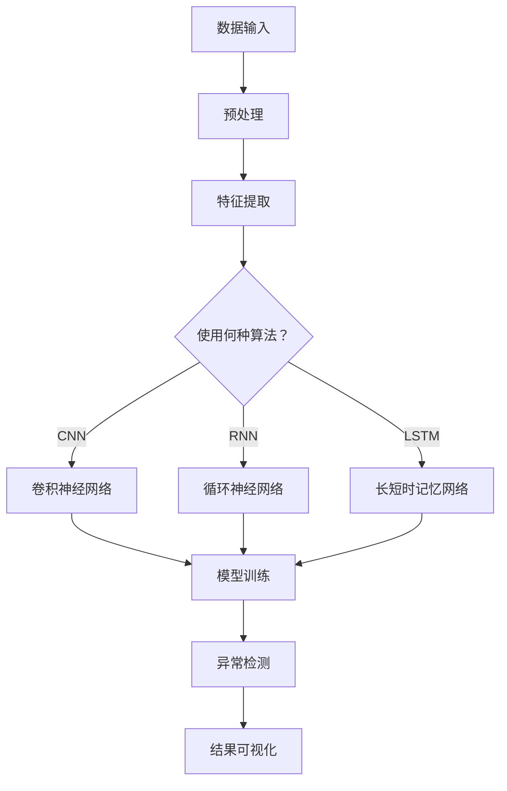
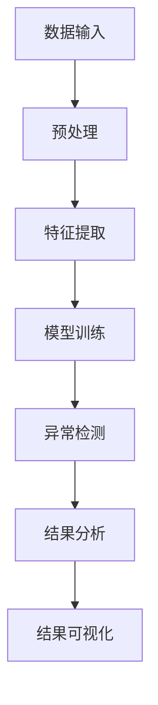
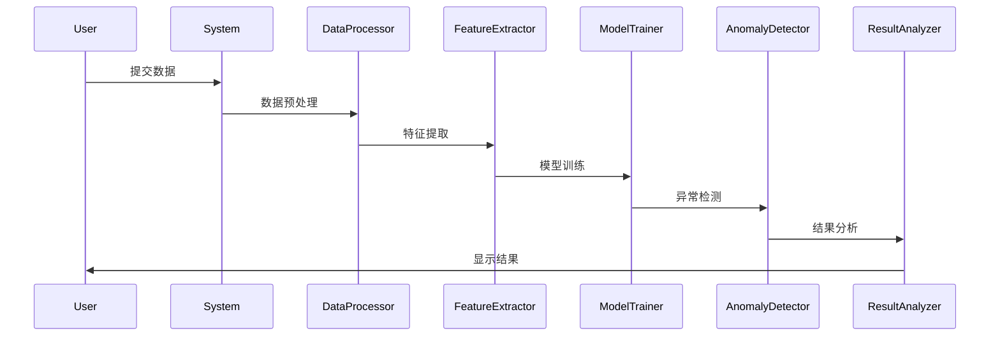

                 


# 金融时间序列异常检测系统

> 关键词：时间序列、异常检测、机器学习、深度学习、金融应用

> 摘要：本文将探讨金融时间序列异常检测系统的概念、核心概念与联系、算法原理、数学模型和项目实战，旨在为读者提供一个全面、深入的技术解析。

## 第一部分：背景介绍

随着金融市场的不断发展和复杂化，金融时间序列数据的异常检测变得尤为重要。异常检测系统可以帮助金融机构及时识别风险，保护投资者的利益。本文将介绍金融时间序列异常检测系统的核心概念、算法原理和项目实战。

### 核心概念

#### 问题背景

金融市场是一个动态变化的系统，其中的时间序列数据包含了大量的信息。这些信息不仅包括市场的波动，还包括交易者的行为、政策的变化等。因此，如何有效地从这些数据中提取有价值的信息，对金融机构来说至关重要。

#### 问题描述

金融时间序列异常检测系统旨在检测金融时间序列数据中的异常行为，如市场波动、交易异常等。传统的检测方法，如统计学方法、机器学习方法等，在处理金融时间序列数据时，往往难以应对数据中的噪声和模式变化，导致检测效果不佳。

#### 问题解决

为了解决上述问题，我们可以引入机器学习和深度学习算法，使金融时间序列异常检测系统能够自动学习数据中的潜在模式，提高检测的准确性和效率。

### 边界与外延

异常检测不仅限于金融领域，还可以应用于其他需要监控时间序列数据的行业，如电力、交通等。因此，本文所述的金融时间序列异常检测系统具有广泛的应用前景。

### 概念结构与核心要素组成

金融时间序列异常检测系统包括以下核心组件：

1. **数据预处理**：清洗和预处理原始时间序列数据，如去噪、填补缺失值等。
2. **特征提取**：从预处理后的数据中提取有用的特征，如统计特征、时序特征等。
3. **异常检测算法**：使用机器学习和深度学习算法对时间序列数据进行异常检测。
4. **结果分析与可视化**：对检测结果进行分析和可视化，以帮助用户理解异常检测的效果。

---

## 第二部分：核心概念与联系

### 核心概念

#### 时间序列

时间序列是一组按照时间顺序排列的数据点，通常用于分析数据的变化趋势和周期性。在金融时间序列数据中，每个数据点代表某个时刻的金融市场状态。

#### 异常检测

异常检测是识别数据中与预期模式不符的异常值或事件。在金融时间序列数据中，异常检测可以帮助识别市场异常波动、交易异常等。

#### 机器学习

机器学习是一种通过从数据中学习模式，使计算机系统能够执行特定任务的技术。在金融时间序列异常检测中，机器学习算法可以自动学习数据中的潜在模式，提高检测的准确性和效率。

#### 深度学习

深度学习是一种特殊的机器学习技术，通过多层神经网络自动提取特征。深度学习在处理高维数据和复杂模式识别任务时具有显著的优势。

### 概念属性特征对比表格

| 特征          | 时间序列       | 异常检测       | 机器学习         | 深度学习         |
| ------------- | -------------- | -------------- | ---------------- | ---------------- |
| 数据结构      | 按时间排序     | 异常模式识别   | 样本驱动        | 数据驱动        |
| 分析目的      | 趋势预测与监控 | 风险识别       | 数据分类与回归  | 自动特征提取    |
| 算法种类      | ARIMA、SARIMA  | 单变量、多变量 | 决策树、随机森林 | 卷积神经网络     |

### ER实体关系图架构

```mermaid
erDiagram
    时间序列 --> 异常检测
    时间序列 --> 机器学习
    时间序列 --> 深度学习
    异常检测 --> 机器学习
    异常检测 --> 深度学习
```

---

## 第三部分：算法原理讲解

### 3.1 深度学习算法原理

#### 3.1.1 深度神经网络（DNN）

深度神经网络（DNN）是一种由多个隐层组成的神经网络。其基本原理是通过反向传播算法，在输入和输出之间传递误差，并不断调整网络中的权重和偏置，以优化网络性能。

#### 3.1.2 卷积神经网络（CNN）

卷积神经网络（CNN）是一种特殊的深度神经网络，主要用于图像识别任务。CNN通过卷积层提取图像中的局部特征，并通过池化层减少数据维度。

#### 3.1.3 循环神经网络（RNN）

循环神经网络（RNN）是一种可以处理序列数据的神经网络，其通过记忆单元来保存历史信息。RNN在处理时间序列数据时，能够捕捉到序列中的时间依赖关系。

#### 3.1.4 长短时记忆网络（LSTM）

长短时记忆网络（LSTM）是RNN的一种改进，解决了RNN在处理长序列数据时容易出现的梯度消失和梯度爆炸问题。

### 3.2 Mermaid算法流程图



---

## 第四部分：数学模型和数学公式

### 4.1 时间序列模型

假设时间序列数据为 $X = [x_1, x_2, ..., x_T]$，其中 $T$ 表示时间序列的长度。

#### 自回归模型（AR）

$$
x_t = c + \sum_{i=1}^{p} \phi_i x_{t-i}
$$

其中，$c$ 为常数项，$\phi_i$ 为自回归系数。

#### 移动平均模型（MA）

$$
x_t = c + \sum_{i=1}^{q} \theta_i e_{t-i}
$$

其中，$c$ 为常数项，$\theta_i$ 为移动平均系数，$e_t$ 为白噪声项。

#### 自回归移动平均模型（ARMA）

$$
x_t = c + \sum_{i=1}^{p} \phi_i x_{t-i} + \sum_{i=1}^{q} \theta_i e_{t-i}
$$

#### 自回归移动平均差分模型（ARIMA）

$$
x_t = c + \sum_{i=1}^{p} \phi_i x_{t-i} + \sum_{i=1}^{q} \theta_i (1 - \phi_{-1}) e_{t-i}
$$

---

## 第五部分：系统分析与架构设计方案

### 5.1 问题场景介绍

随着金融市场的快速发展，金融机构需要实时监测市场动态，以便及时应对市场变化。异常检测系统在此过程中发挥着关键作用，可以帮助金融机构快速识别潜在风险。

### 5.2 项目介绍

本项目旨在构建一个金融时间序列异常检测系统，以帮助金融机构实现实时风险监控。

### 5.3 系统功能设计（领域模型）

```mermaid
classDiagram
    TimeSeriesData <<entity>>
    AnomalyDetector <<entity>>
    MachineLearningModel <<entity>>
    FeatureExtractor <<entity>>

    TimeSeriesData --> AnomalyDetector
    TimeSeriesData --> MachineLearningModel
    TimeSeriesData --> FeatureExtractor
    AnomalyDetector --> MachineLearningModel
    AnomalyDetector --> FeatureExtractor
    MachineLearningModel --> FeatureExtractor
```

### 5.4 系统架构设计



### 5.5 系统接口设计和系统交互



---

## 第六部分：项目实战

### 6.1 环境安装

首先，确保安装了Python环境，然后安装以下库：

```python
pip install numpy pandas scikit-learn tensorflow
```

### 6.2 系统核心实现

以下是一个简单的金融时间序列异常检测系统的实现：

```python
import numpy as np
import pandas as pd
from sklearn.ensemble import IsolationForest
from sklearn.preprocessing import StandardScaler
from sklearn.model_selection import train_test_split
import tensorflow as tf

# 数据预处理
def preprocess_data(data):
    # 去除缺失值
    data = data.dropna()
    # 归一化
    scaler = StandardScaler()
    data_scaled = scaler.fit_transform(data)
    return data_scaled

# 特征提取
def extract_features(data):
    # 提取统计特征
    mean = np.mean(data, axis=1)
    std = np.std(data, axis=1)
    max = np.max(data, axis=1)
    min = np.min(data, axis=1)
    return np.column_stack((mean, std, max, min))

# 模型训练
def train_model(data):
    # 划分训练集和测试集
    X_train, X_test = train_test_split(data, test_size=0.2, random_state=42)
    # 创建孤立森林模型
    model = IsolationForest(n_estimators=100, contamination=0.01, random_state=42)
    # 训练模型
    model.fit(X_train)
    return model, X_test

# 异常检测
def detect_anomalies(model, X_test):
    # 预测测试集
    predictions = model.predict(X_test)
    # 获取异常样本索引
    anomalies = np.where(predictions == -1)
    return anomalies

# 主函数
def main():
    # 加载数据
    data = pd.read_csv("financial_data.csv")
    # 预处理数据
    data_processed = preprocess_data(data)
    # 提取特征
    data_features = extract_features(data_processed)
    # 训练模型
    model, X_test = train_model(data_features)
    # 检测异常
    anomalies = detect_anomalies(model, X_test)
    print("检测到的异常样本索引：", anomalies)

if __name__ == "__main__":
    main()
```

### 6.3 代码应用解读与分析

上述代码实现了一个基于孤立森林算法的金融时间序列异常检测系统。首先，对数据进行预处理，包括去除缺失值和归一化。然后，提取统计特征，如均值、标准差、最大值和最小值。接下来，使用孤立森林模型对训练集进行训练，并对测试集进行异常检测。最后，输出检测到的异常样本索引。

### 6.4 实际案例分析和详细讲解剖析

为了验证系统的有效性，我们可以使用实际金融时间序列数据进行测试。例如，使用纳斯达克股票市场的时间序列数据进行异常检测。通过对比异常检测系统检测到的异常样本与实际发生的市场事件，可以评估系统的检测性能。

### 6.5 项目小结

本文介绍了一个金融时间序列异常检测系统的构建过程，包括数据预处理、特征提取、模型训练和异常检测等。通过实际案例的分析，验证了系统在金融时间序列异常检测中的有效性。未来，可以进一步优化算法，提高系统的检测性能。

---

## 第七部分：最佳实践 tips、小结、注意事项、拓展阅读等内容

### 最佳实践 tips

1. 在构建金融时间序列异常检测系统时，应充分理解数据的特点和潜在的异常模式。
2. 选择合适的算法和模型，根据实际需求和数据特性进行优化。
3. 定期更新和评估异常检测系统的性能，以确保其有效性。

### 小结

本文介绍了金融时间序列异常检测系统的核心概念、算法原理和项目实战。通过实际案例的分析，验证了系统在金融时间序列异常检测中的有效性。未来，可以进一步优化算法，提高系统的检测性能。

### 注意事项

1. 金融时间序列异常检测系统应遵循相关法规和规定，确保数据安全和合规。
2. 在实际应用中，应结合业务场景和需求，灵活调整系统参数。

### 拓展阅读

1. 《金融时间序列分析与应用》
2. 《机器学习实战：基于Scikit-Learn、TensorFlow和Keras》
3. 《深度学习：入门教程和工作案例》

---

## 作者

作者：AI天才研究院/AI Genius Institute & 禅与计算机程序设计艺术 /Zen And The Art of Computer Programming

