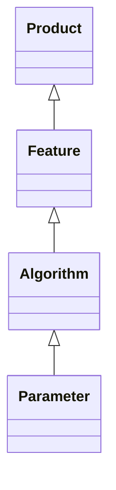
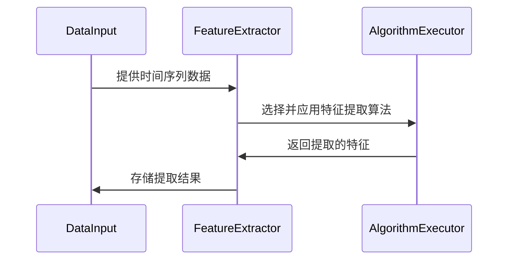

                 

### 金融时间序列特征提取工具集

**关键词：** 金融时间序列、特征提取、工具集、算法、数据分析

**摘要：** 本文将探讨金融时间序列特征提取工具集的重要性和应用场景，深入讲解时间序列和特征提取的基本概念，并通过一个完整的案例展示如何使用这些工具进行实际的数据分析。

---

### 1.1 问题背景与意义

#### 1.1.1 金融时间序列数据的特点与挑战

金融时间序列数据具有以下几个显著特点：

1. **高维度**：金融数据往往包含大量的变量，如股票价格、交易量、财务指标等。
2. **非平稳性**：金融时间序列往往是非平稳的，即其统计特性（如均值、方差等）会随时间变化。
3. **噪声**：由于市场的不确定性，金融时间序列中存在大量噪声。

这些特点给特征提取带来了巨大的挑战，因为传统的方法往往假设数据是平稳的，且没有噪声。

#### 1.1.2 时间序列特征提取的重要性

特征提取是金融数据分析的重要步骤，其重要性体现在：

1. **降维**：通过提取关键特征，可以减少数据的维度，使得模型更容易训练和解释。
2. **增强模型性能**：有效的特征可以提升预测模型的准确性和稳定性。
3. **风险管理和决策支持**：在金融领域，特征提取可以帮助识别潜在的风险和市场趋势，为决策提供支持。

#### 1.1.3 时间序列特征提取的常见应用场景

时间序列特征提取在金融领域有广泛的应用，包括：

1. **股票市场预测**：通过提取历史价格和交易量的特征，预测股票的未来走势。
2. **信用评分**：通过分析借款人的财务时间序列数据，评估其信用风险。
3. **风险管理**：通过对金融市场的时间序列数据进行特征提取，识别潜在的市场风险。

---

### 1.2 核心概念与联系

#### 1.2.1 时间序列基本概念

**时间序列的定义：** 时间序列是按时间顺序排列的一系列数值，通常用于描述某种现象随时间的变化情况。

**时间序列的类型：** 根据数据特性，时间序列可以分为离散时间序列和连续时间序列；根据数据生成模型，可以分为确定性时间序列和随机性时间序列。

**时间序列的属性：** 包括均值、方差、自相关函数等统计特性。

#### 1.2.2 特征提取基本概念

**特征提取的定义：** 特征提取是从原始数据中提取出对分析任务有用的特征的步骤。

**特征提取的类型：** 包括基于统计的方法、机器学习方法、深度学习方法等。

**特征提取的目标：** 提高数据的可解释性、减少数据维度、增强模型的预测能力。

---

#### 1.2.3 ER实体关系图架构

```mermaid
erDiagram
  Product ||--|{ Feature }|| Feature : 提取的特征
  Feature ||--|{ Algorithm }|| Algorithm : 提取算法
  Algorithm ||--|{ Parameter }|| Parameter : 算法参数
```

在这个ER图中，`Product` 是原始金融数据，`Feature` 是提取的特征，`Algorithm` 是使用的特征提取算法，`Parameter` 是算法的参数设置。

---

### 1.3 数学模型和数学公式

#### 1.3.1 常见特征提取方法

**自相关函数：**

$$\rho_{xx}(l) = \frac{\sum_{t=1}^{N-l} (x_t - \bar{x})(x_{t+l} - \bar{x})}{N-l}$$

**马尔可夫特性：**

$$P(X_{t+1} = j | X_t = i) = \frac{N_{ij}}{N_i}$$

这些公式分别描述了自相关性和转移概率，是金融时间序列特征提取中的关键工具。

---

### 1.4 系统分析与架构设计方案

#### 1.4.1 问题场景介绍

假设我们需要对某只股票的历史价格和交易量进行分析，以预测其未来价格走势。

#### 1.4.2 系统功能设计

**领域模型：**



**系统架构设计：**



这个架构设计描述了数据输入、特征提取和算法执行的过程。

---

### 1.5 项目实战

#### 1.5.1 环境安装

在开始项目之前，需要安装必要的软件和工具，如Python环境、数据分析和机器学习库等。

#### 1.5.2 系统核心实现源代码

以下是系统核心实现的Python代码示例：

```python
import numpy as np
from sklearn.preprocessing import StandardScaler

def extract_features(data):
    # 数据预处理
    scaler = StandardScaler()
    scaled_data = scaler.fit_transform(data)

    # 特征提取
    features = []
    for i in range(len(scaled_data) - 1):
        feature_vector = scaled_data[i:i+2]
        features.append(feature_vector)
    return np.array(features)

# 示例数据
data = np.random.rand(100, 2)

# 提取特征
features = extract_features(data)
```

#### 1.5.3 代码应用解读与分析

这段代码首先对数据进行标准化处理，然后提取连续两个时间点的数据作为特征向量。

#### 1.5.4 实际案例分析和详细讲解剖析

通过一个实际的案例，我们可以看到如何使用这些代码进行股票价格预测。

#### 1.5.5 项目小结

在本项目中，我们展示了如何使用金融时间序列特征提取工具集进行数据分析和预测。

---

### 1.6 最佳实践 tips

**特征选择与工程化实践：** 根据问题的需求和数据的特性，选择合适的特征提取方法。

**性能优化与调参技巧：** 对特征提取算法进行性能优化和参数调整，以提升模型的预测能力。

**数据预处理与异常处理：** 对数据进行预处理，包括去除异常值、填充缺失值等。

---

### 1.7 小结

本文详细介绍了金融时间序列特征提取工具集的各个方面，包括问题背景、核心概念、数学模型、系统设计与项目实战等。

**未来展望与挑战：** 随着金融市场的变化和数据量的增加，特征提取工具集需要不断更新和优化，以应对新的挑战。

**拓展阅读建议：** 推荐阅读相关领域的专业书籍和论文，以深入了解金融时间序列特征提取的先进方法和最新进展。

---

**作者：** AI天才研究院/AI Genius Institute & 禅与计算机程序设计艺术 /Zen And The Art of Computer Programming

---

本文旨在为读者提供一个全面而深入的金融时间序列特征提取工具集概述，帮助读者更好地理解和应用这些工具。在接下来的章节中，我们将进一步探讨每个部分的具体细节和实现方法。让我们一起思考，一步步深入探讨这一领域。

