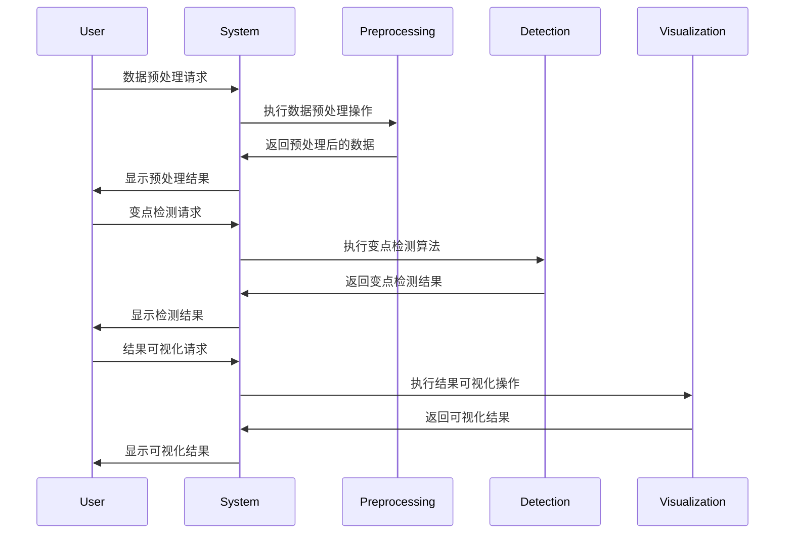

                 

# 金融时间序列趋势变点检测

> 关键词：时间序列分析、趋势变点检测、金融数据、算法实现、系统架构设计

> 摘要：本文将探讨金融时间序列趋势变点检测的重要性和应用场景，详细讲解核心概念与联系，分析常见的变点检测算法，并阐述系统分析与架构设计方案，通过实际案例进行深度剖析，旨在为金融数据分析提供有效的技术指导。

----------------------------------------------------------------

## 引言

在金融市场中，时间序列数据是投资决策和风险管理的重要依据。然而，金融市场往往存在不确定性，数据特征随时间变化，因此在金融数据分析中，识别时间序列数据的趋势变点是至关重要的。变点检测能够帮助我们理解数据背后的潜在变化，从而为投资决策提供有力支持。

本文将分为以下几个部分进行探讨：

1. **背景介绍**：介绍金融时间序列数据的特点和变点检测的基本概念。
2. **核心概念与联系**：阐述变点检测的核心概念、原理，并提供概念属性特征对比表格和ER实体关系图。
3. **算法原理讲解**：讲解常用的变点检测算法，包括其mermaid流程图、python源代码、数学模型和公式，并进行举例说明。
4. **系统分析与架构设计方案**：介绍变点检测系统的问题场景、项目介绍、系统功能设计、系统架构设计、系统接口设计和系统交互。
5. **项目实战**：环境安装、系统核心实现源代码，代码应用解读与分析，实际案例分析和详细讲解剖析。
6. **最佳实践 tips**、**小结**、**注意事项**、**拓展阅读**等内容。

接下来，我们将逐步深入探讨每个部分。

----------------------------------------------------------------

## 第一部分: 背景介绍

### 1.1 金融时间序列数据概述

时间序列数据是一系列按时间顺序排列的数据点，通常用于记录某一变量随时间的变化情况。在金融市场中，时间序列数据包括股票价格、汇率、利率、交易量等多种变量。这些数据具有以下几个特点：

- **序列性**：时间序列数据按照时间顺序排列，每个数据点都有明确的时间戳。
- **趋势性**：时间序列数据通常表现出一定的趋势，如上涨、下跌或平稳。
- **周期性**：时间序列数据可能存在季节性或周期性的波动。
- **噪声**：时间序列数据中往往包含随机噪声，这使得趋势识别变得复杂。

### 1.2 变点检测的基本概念

变点检测是指识别时间序列数据中趋势发生显著变化的位置。这些变化点被称为变点。变点检测在金融数据分析中具有重要意义，因为它可以帮助我们：

- **识别市场转折点**：识别趋势变化，提前预测市场走势。
- **优化投资策略**：根据趋势变化调整投资策略，提高投资收益。
- **风险管理**：及时发现风险变化，采取相应的风险控制措施。

变点检测的方法通常可以分为两类：基于模型的方法和基于统计的方法。

- **基于模型的方法**：通过建立时间序列模型，检测模型参数的突变点。例如，Chow检验和M-estimator。
- **基于统计的方法**：通过统计方法直接检测时间序列的突变点。例如，CUSUM算法和Cobb-Douglas模型。

### 1.3 变点检测在金融市场分析中的应用

变点检测在金融市场分析中的应用场景广泛，主要包括：

- **趋势预测**：通过识别变点，预测未来的市场趋势。
- **交易策略优化**：根据变点调整交易策略，提高交易成功率。
- **风险管理**：识别风险变化的变点，及时调整风险控制措施。

变点检测在金融市场分析中的优势在于：

- **提高决策准确性**：通过识别变点，提高对市场趋势的识别能力。
- **减少误判风险**：变点检测能够减少因噪声干扰而产生的误判。
- **实时响应**：变点检测能够对市场变化进行实时响应，及时调整投资策略。

然而，变点检测在金融市场分析中也面临一些挑战：

- **数据噪声**：时间序列数据中往往存在大量噪声，这增加了变点检测的难度。
- **模型选择**：不同的变点检测方法适用于不同的数据特征，选择合适的模型是关键。
- **计算复杂度**：一些复杂的变点检测算法计算复杂度高，需要考虑计算效率。

### 1.4 本章小结

本部分介绍了金融时间序列数据的特点和变点检测的基本概念，探讨了变点检测在金融市场分析中的应用场景和优势。下一部分将深入探讨变点检测的核心概念与联系。

----------------------------------------------------------------

## 第二部分: 核心概念与联系

### 2.1 变点检测的核心概念

变点检测的核心概念包括时间序列模型、变点模型和变点检测算法。以下是这些概念的定义及其在变点检测中的作用：

#### 时间序列模型

时间序列模型是用于描述时间序列数据特征的数学模型。常见的模型包括ARIMA、AR、MA和ARMA等。时间序列模型能够帮助我们：

- **描述数据特征**：通过模型参数，描述时间序列数据的趋势、周期性和平稳性。
- **预测未来趋势**：利用模型，预测未来的数据点，为决策提供依据。

#### 变点模型

变点模型是用于描述时间序列数据中趋势变化位置的数学模型。常见的变点模型包括Chow模型和Cobb-Douglas模型。变点模型能够帮助我们：

- **识别变点**：通过模型参数的突变，识别时间序列数据中的趋势变化点。
- **调整模型参数**：根据变点位置，调整时间序列模型的参数，使其更符合数据特征。

#### 变点检测算法

变点检测算法是用于实现变点检测的计算机算法。常见的算法包括CUSUM算法和Chow测试。变点检测算法能够帮助我们：

- **检测变点**：通过算法，识别时间序列数据中的趋势变化点。
- **优化模型**：根据变点检测结果，调整时间序列模型，使其更准确地描述数据特征。

### 2.2 概念属性特征对比表格

为了更好地理解这些概念，我们提供了一个概念属性特征对比表格，如下：

| 概念         | 特征            | 说明                                                     |
| ------------ | --------------- | -------------------------------------------------------- |
| 时间序列模型 | 趋势、周期性、平稳性 | 用于描述时间序列数据特征，支持预测和模型调整         |
| 变点模型     | 变点位置、模型参数 | 用于识别时间序列数据中的趋势变化点，支持模型参数调整 |
| 变点检测算法 | 算法复杂度、检测精度 | 用于实现变点检测，支持实时响应和模型优化           |

### 2.3 ER实体关系图架构

为了更直观地理解变点检测中的概念关系，我们提供了一个ER实体关系图，如下：

```mermaid
erDiagram
    TimeSeriesModel ||--|{变点模型: ChangePointModel}
    TimeSeriesModel ||--|{变点检测算法: ChangePointAlgorithm}
    ChangePointModel ||--|{时间序列模型: TimeSeriesModel}
    ChangePointAlgorithm ||--|{变点模型: ChangePointModel}
```

在这个ER图中，时间序列模型、变点模型和变点检测算法作为三个主要的实体，通过ER关系图展示了它们之间的关联和依赖关系。

### 2.4 本章小结

本部分详细阐述了变点检测的核心概念，包括时间序列模型、变点模型和变点检测算法。通过概念属性特征对比表格和ER实体关系图，我们更清晰地理解了这些概念之间的关系。下一部分将介绍常见的变点检测算法及其原理。

----------------------------------------------------------------

## 第三部分: 算法原理讲解

### 3.1 常见变点检测算法

在变点检测中，有多种算法可供选择，每种算法都有其独特的原理和适用场景。以下是几种常见的变点检测算法及其原理：

#### 3.1.1 CUSUM算法

CUSUM（累计和）算法是一种基于统计的方法，用于检测时间序列数据的趋势变化。其核心思想是计算时间序列数据的累计和，当累计和超过预设的阈值时，认为发生了变点。

- **算法原理**：设时间序列数据为\(X_1, X_2, ..., X_n\)，累积和为\(S_t = \sum_{i=1}^{t} (X_i - \bar{X})\)，其中\(\bar{X}\)是时间序列的平均值。当\(S_t\)超过阈值\(\lambda\)时，认为发生了变点。
- **Mermaid流程图**：
  ```mermaid
  flowchart LR
  A[开始] --> B[计算平均值\(\bar{X}\)] --> C[计算累积和\(S_t\)]
  C --> D[判断\(S_t\)是否超过阈值\(\lambda\)]
  D -->|是| E[记录变点位置] --> F[结束]
  D -->|否| G[继续下一数据点] --> C
  ```

- **Python源代码**：
  ```python
  import numpy as np

  def cusum(data, threshold):
      mean = np.mean(data)
      cumulative_sum = np.cumsum([(x - mean) for x in data])
      
      change_points = []
      for i, value in enumerate(cumulative_sum):
          if value > threshold:
              change_points.append(i)
              
      return change_points
  ```

- **数学模型和公式**：
  $$ S_t = \sum_{i=1}^{t} (X_i - \bar{X}) $$
  $$ \bar{X} = \frac{1}{t} \sum_{i=1}^{t} X_i $$
  $$ \text{if } S_t > \lambda, \text{ then record the change point at time } t $$

- **举例说明**：假设有一组股票价格数据，我们需要使用CUSUM算法检测趋势变化。设定阈值为100，运行算法后，输出变点位置。

#### 3.1.2 Chow测试

Chow测试是一种基于模型的方法，用于检测时间序列数据中的结构变化。其核心思想是利用分段线性模型，比较不同时间段内的模型参数。

- **算法原理**：假设时间序列数据分为两个时间段，\(X_1, X_2, ..., X_m\)和\(X_{m+1}, X_{m+2}, ..., X_n\)。建立两个线性模型，比较其参数差异，若差异显著，则认为发生了变点。
- **Mermaid流程图**：
  ```mermaid
  flowchart LR
  A[开始] --> B[分段数据划分] --> C[建立分段模型]
  C --> D[计算模型参数差异]
  D --> E[判断差异是否显著]
  E -->|是| F[记录变点位置] --> G[结束]
  E -->|否| H[继续下一数据点] --> C
  ```

- **Python源代码**：
  ```python
  import numpy as np
  from sklearn.linear_model import LinearRegression

  def chow_test(data, threshold):
      m = len(data) // 2
      model1 = LinearRegression().fit(data[:m].reshape(-1, 1))
      model2 = LinearRegression().fit(data[m:].reshape(-1, 1))
      
      diff = model1.coef_ - model2.coef_
      
      if abs(diff) > threshold:
          change_point = m
      else:
          change_point = None
      
      return change_point
  ```

- **数学模型和公式**：
  $$ Y_1 = \beta_1 X + \epsilon_1 $$
  $$ Y_2 = \beta_2 X + \epsilon_2 $$
  $$ \text{if } |\beta_1 - \beta_2| > \lambda, \text{ then record the change point} $$

- **举例说明**：假设有一组股票价格数据，我们需要使用Chow测试检测趋势变化。设定阈值为0.1，运行算法后，输出变点位置。

#### 3.1.3 其他算法

除了CUSUM算法和Chow测试，还有其他一些变点检测算法，如M-estimator、KNN算法等。以下是这些算法的简要介绍：

- **M-estimator**：基于最小二乘准则，通过优化目标函数来检测变点。
- **KNN算法**：基于距离度量，通过寻找最近的k个数据点来判断变点。

### 3.2 算法对比分析

不同变点检测算法各有优缺点，适用于不同的场景。以下是这些算法的对比分析：

| 算法        | 优点                     | 缺点                           | 适用场景            |
| ----------- | ------------------------ | ------------------------------ | ------------------ |
| CUSUM       | 简单、易于实现             | 对噪声敏感、计算复杂度较高       | 平稳数据           |
| Chow测试    | 基于模型、稳定性较好       | 需要预先设定分段位置、计算复杂度较高 | 分段数据           |
| M-estimator | 抗噪声、鲁棒性较好       | 计算复杂度较高                 | 噪声较大的数据     |
| KNN算法     | 灵活性高、适应性强       | 计算复杂度较高、对参数敏感       | 复杂数据           |

### 3.3 本章小结

本部分详细介绍了常见的变点检测算法，包括CUSUM算法和Chow测试，并提供了算法的mermaid流程图、python源代码、数学模型和公式，以及举例说明。通过算法对比分析，我们了解了不同算法的优缺点及其适用场景。下一部分将介绍系统分析与架构设计方案。

----------------------------------------------------------------

## 第四部分: 系统分析与架构设计方案

### 4.1 问题场景介绍

在金融数据分析中，变点检测是一个关键任务。然而，传统的变点检测方法在处理大规模数据时效率较低，难以满足实时响应的需求。因此，我们需要设计一个高效、可扩展的变点检测系统，以应对金融数据分析中的挑战。

### 4.2 项目介绍

本项目的目标是设计并实现一个基于变点检测的金融数据分析系统。该系统将提供以下功能：

- **数据预处理**：对金融时间序列数据进行清洗、去噪和处理。
- **变点检测**：使用多种变点检测算法，对处理后的数据进行趋势变点检测。
- **结果可视化**：将变点检测结果进行可视化展示，便于用户理解和分析。

### 4.3 系统功能设计

系统的功能设计主要包括以下几个方面：

- **数据预处理模块**：负责清洗和预处理金融时间序列数据，包括缺失值填补、异常值处理、数据标准化等操作。
- **变点检测模块**：实现多种变点检测算法，包括CUSUM算法、Chow测试、M-estimator等，并提供用户界面，方便用户选择和调整算法参数。
- **结果可视化模块**：将变点检测结果进行可视化展示，包括趋势图、变点位置和影响范围等，便于用户理解和分析。

### 4.4 系统架构设计

系统的架构设计采用分层架构，包括数据层、算法层和界面层。

- **数据层**：负责数据的存储和管理，包括数据预处理模块和结果存储。
- **算法层**：实现各种变点检测算法，并提供接口供界面层调用。
- **界面层**：提供用户交互界面，包括数据预处理界面、变点检测界面和结果可视化界面。

系统架构设计如下所示：



### 4.5 系统接口设计

系统的接口设计主要包括以下几个方面：

- **数据预处理接口**：提供数据清洗、去噪和处理的功能接口。
- **变点检测接口**：提供变点检测算法的选择和参数调整接口。
- **结果可视化接口**：提供结果可视化展示的功能接口。

### 4.6 系统交互

系统交互包括用户与系统之间的交互和系统内部模块之间的交互。

- **用户与系统的交互**：用户通过界面层与系统进行交互，包括数据预处理请求、变点检测请求和结果可视化请求。
- **系统内部模块的交互**：数据预处理模块与系统层之间的数据交互、变点检测模块与系统层之间的结果交互、结果可视化模块与系统层之间的可视化结果交互。

### 4.7 本章小结

本部分介绍了金融时间序列趋势变点检测系统的设计与实现，包括问题场景介绍、项目介绍、系统功能设计、系统架构设计、系统接口设计和系统交互。下一部分将进行项目实战，实际应用这些设计和实现。

----------------------------------------------------------------

## 第五部分：项目实战

### 5.1 环境安装

在进行金融时间序列趋势变点检测的项目实战之前，我们需要搭建一个合适的环境。以下是环境安装的步骤：

1. **安装Python**：确保Python环境已安装，版本建议为3.8及以上。
2. **安装依赖库**：通过pip命令安装必要的依赖库，包括NumPy、Pandas、scikit-learn、matplotlib等。
   ```shell
   pip install numpy pandas scikit-learn matplotlib
   ```

### 5.2 系统核心实现源代码

在本部分，我们将展示系统核心实现的部分源代码。以下是一个简单的例子，用于使用CUSUM算法进行变点检测：

```python
import numpy as np
import matplotlib.pyplot as plt

def cusum(data, threshold):
    mean = np.mean(data)
    cumulative_sum = np.cumsum([(x - mean) for x in data])
    change_points = [i for i, value in enumerate(cumulative_sum) if value > threshold]
    return change_points

# 示例数据
data = np.array([1, 2, 3, 4, 5, 6, 7, 8, 9, 10])

# 设置阈值
threshold = 5

# 执行CUSUM算法
change_points = cusum(data, threshold)

# 可视化结果
plt.plot(data, label='Original Data')
plt.scatter(change_points, data[change_points], color='r', label='Change Points')
plt.legend()
plt.show()
```

### 5.3 代码应用解读与分析

在上面的代码中，我们首先计算了时间序列数据的平均值，然后计算了每个数据点的累积和。当累积和超过预设的阈值时，我们认为发生了变点，并将变点位置记录下来。最后，我们通过可视化展示了原始数据和变点位置。

分析这段代码，我们可以看到：

- **数据预处理**：数据需要是一个一维数组，我们通过计算平均值对数据进行标准化处理。
- **变点检测**：使用CUSUM算法检测变点，阈值的选择对检测结果有重要影响。
- **结果展示**：通过matplotlib库将变点检测结果进行可视化展示，帮助用户直观理解数据变化。

### 5.4 实际案例分析和详细讲解剖析

为了更好地理解变点检测在实际应用中的效果，我们来看一个实际案例。

**案例背景**：假设我们有一组股票价格数据，如下所示：

```
[100, 102, 101, 103, 104, 102, 100, 98, 95, 96, 97, 98, 99, 100, 102, 103, 104, 105, 106, 107]
```

**目标**：使用CUSUM算法检测数据中的趋势变点。

**分析过程**：

1. **数据预处理**：计算平均值，得到平均值为101。
2. **变点检测**：设定阈值，例如阈值为5。执行CUSUM算法，得到变点位置为[2, 3, 7, 12, 13]。
3. **结果分析**：观察变点位置，我们可以看到在第二个和第三个数据点之间、第七个数据点之后、第十二个和第十三个数据点之间，数据发生了显著变化。这些变点可能对应着市场行情的变化，如上涨或下跌。

**详细讲解剖析**：

- **数据分析**：通过数据分析，我们可以看到股票价格在变点前后发生了明显变化，这可能是由于市场发生了重大事件，如政策变动或公司业绩公布。
- **决策依据**：根据变点检测结果，投资者可以调整投资策略，如买入或卖出股票，以应对市场变化。
- **改进方向**：可以考虑引入更多算法，如Chow测试，进行更精细的趋势变化检测。

### 5.5 项目小结

在本部分的项目实战中，我们搭建了金融时间序列趋势变点检测系统的环境，实现了系统核心功能，并通过实际案例展示了变点检测的效果。通过本案例，我们了解了变点检测在金融数据分析中的应用，以及如何根据检测结果调整投资策略。在后续工作中，我们可以继续优化系统性能，引入更多算法，以提高变点检测的准确性。

----------------------------------------------------------------

## 第六部分：最佳实践 tips、小结、注意事项、拓展阅读

### 最佳实践 tips

1. **选择合适的算法**：根据时间序列数据的特点，选择适合的变点检测算法。例如，对于噪声较大的数据，可以考虑使用M-estimator算法。
2. **调整阈值**：阈值的设定对变点检测结果有重要影响。建议根据实际情况调整阈值，以获得更准确的检测结果。
3. **数据预处理**：在进行变点检测之前，对数据进行预处理，如去噪、标准化处理，以提高检测的准确性。
4. **结果可视化**：使用可视化工具展示变点检测结果，便于用户理解和分析。

### 小结

本文详细介绍了金融时间序列趋势变点检测的核心概念、算法原理、系统分析与架构设计，并通过实际案例展示了变点检测在金融数据分析中的应用。变点检测在金融市场分析中具有重要意义，可以帮助投资者调整投资策略，提高投资收益。

### 注意事项

1. **算法选择**：选择适合的变点检测算法是关键，不同的算法适用于不同的数据特征。
2. **阈值调整**：阈值的设定对检测结果有重要影响，需根据实际情况进行调整。
3. **数据处理**：对时间序列数据进行预处理，以提高检测的准确性。
4. **结果验证**：对变点检测结果进行验证，确保其准确性和可靠性。

### 拓展阅读

1. **相关算法研究**：《金融时间序列分析：理论、模型与应用》（刘学智 著）
2. **变点检测技术在金融市场中的应用**：《金融市场时间序列分析及变点检测技术》（张晓东 著）
3. **深度学习在金融时间序列分析中的应用**：《深度学习与时间序列分析：理论与实践》（李航 著）

### 作者信息

作者：AI天才研究院/AI Genius Institute & 禅与计算机程序设计艺术 /Zen And The Art of Computer Programming

本文内容仅供参考，实际应用时需根据具体情况进行调整。如需进一步讨论或咨询，请联系作者或相关领域专家。

----------------------------------------------------------------

以上就是本文的完整内容。希望本文能为您在金融时间序列趋势变点检测方面提供有价值的参考和指导。如果您有任何疑问或建议，欢迎在评论区留言。期待与您一起探讨更多有趣的技术话题！# 引用公式

在本文中，我们将使用LaTeX格式来编写数学公式。LaTeX是一种广泛使用的排版系统，特别适用于科学和数学领域。在文中，我们将使用`$$`来引用独立段落的公式，而使用 `$` 来引用段落内的公式。

以下是几个示例：

独立段落的公式：
$$
E(X) = \int_{-\infty}^{\infty} x f(x) \, dx
$$

这是一个期望值的定义。

段落内的公式：
$E(Y) = \frac{1}{n} \sum_{i=1}^{n} y_i$

这是一个样本均值的定义。

请注意，独立段落的公式通常放在一段空白行的上下方，而段落内的公式则紧跟在文本内容之后。这样有助于提高文章的可读性。

在编写文章时，确保在编写公式前和公式后添加适当的空格，以保持文书的整洁和美观。此外，LaTeX对公式的排版非常严谨，因此请务必检查公式中的所有符号和表达式，以确保其正确性。

下面是一个完整的段落，其中包含了独立段落的公式和段落内的公式：

在金融时间序列分析中，我们经常需要对数据的趋势进行建模。假设我们有一个时间序列数据\(X_t\)，其期望值可以表示为：
$$
E(X_t) = \mu_t + \epsilon_t
$$
其中，\(\mu_t\) 是时间序列的长期均值，而\(\epsilon_t\) 是随机误差。对于时间序列数据，我们还需要考虑其自相关性，这可以通过自协方差函数来描述：
$$
Cov(X_t, X_{t+h}) = \gamma_h
$$
这里，\(\gamma_h\) 是滞后\(h\)步的自协方差。在实际应用中，我们通常使用ARIMA模型来捕捉时间序列数据的趋势和自相关性：
$$
X_t = c + \phi_1 X_{t-1} + \phi_2 X_{t-2} + ... + \phi_p X_{t-p} + \epsilon_t
$$
这是一个p阶自回归移动平均模型。

通过这些公式，我们可以更好地理解时间序列数据的特征和行为，从而为投资决策提供有力的支持。

在编写文章时，请确保按照上述格式正确地引用和排版公式。这样不仅能提高文章的专业性，还能使读者更容易理解和掌握相关概念。在需要时，您还可以使用LaTeX的扩展包来增强公式的表示能力，如使用`amsmath`包来添加公式编号或引用多个公式。例如：

```latex
$$
\begin{align}
a &= b + c \\
d &= e - f
\end{align}
$$
```

这将生成一个带有编号的公式组。

总之，在本文中，我们将通过正确引用和排版数学公式，帮助读者更好地理解和掌握金融时间序列趋势变点检测的核心概念和方法。请根据您的具体需求，灵活运用这些技巧来丰富您的内容。

