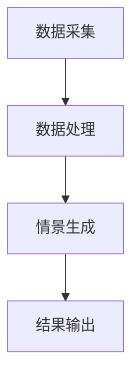
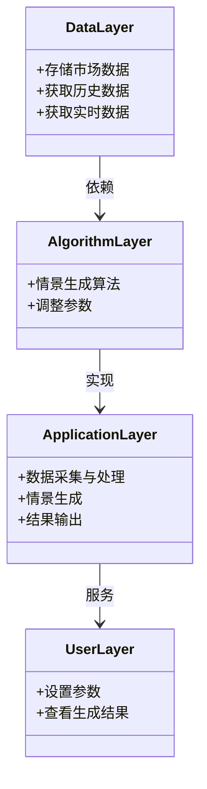
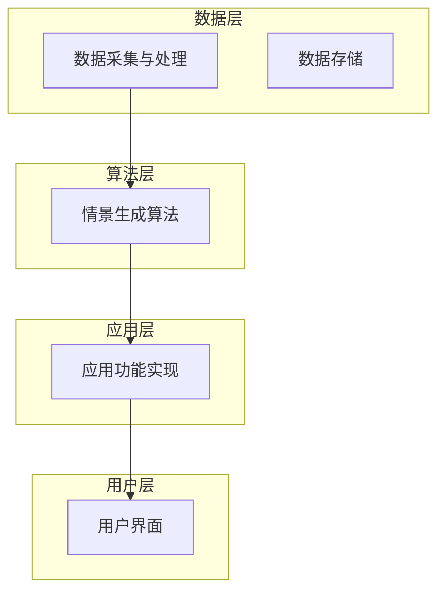

                 

### 第一部分：背景介绍

#### 核心概念：

**问题背景：**
在全球金融市场日益复杂化和竞争加剧的背景下，金融机构面临着越来越多的风险和挑战。金融市场的波动性增大，市场参与者的行为更加难以预测，金融机构需要具备更高的风险管理能力。为了有效应对这些风险，金融机构需要进行全面、深入的内部压力测试，以评估其资本充足率和流动性状况。

**问题描述：**
传统的压力测试方法通常依赖于历史数据和市场分析，通过模拟不同市场状况下的风险因素，来评估金融机构的风险承受能力。然而，这种方法在场景设计和结果预测方面存在一定的局限性。首先，历史数据可能无法完全反映当前市场的实际情况，因为市场环境在不断变化。其次，市场分析可能存在主观性，无法确保模拟结果的准确性和可靠性。此外，传统的压力测试方法通常需要大量的人力和时间进行场景设计和数据收集，效率较低。

**问题解决：**
为了解决上述问题，金融机构需要一种高效、可靠的情景生成器，能够根据实际市场数据和风险特征，自动生成具有代表性的压力测试情景。这种情景生成器需要具备以下几个特点：

1. **多样性：**能够生成涵盖多种市场状况的情景数据，如利率变动、汇率波动、股市涨跌等。这样可以更全面地评估金融机构的风险承受能力。
2. **灵活性：**可以根据金融机构的需求，调整情景生成器的参数，以适应不同的压力测试场景。例如，可以设置不同的利率水平、汇率波动范围等。
3. **准确性：**生成的情景数据应具有较高的预测准确性和可靠性，能够真实反映市场变化对金融机构的影响。这样可以提高压力测试的效果，帮助金融机构更好地制定风险管理策略。

**边界与外延：**
情景生成器的主要目标是帮助金融机构进行内部压力测试，评估其资本充足率和流动性状况。然而，其应用范围不仅限于金融机构，还可以扩展到其他需要压力测试的行业，如保险、证券等。此外，情景生成器还可以用于其他领域的风险管理，如自然灾害、恐怖袭击等。

**概念结构与核心要素组成：**
1. **数据采集与处理：**情景生成器需要从多个数据源获取市场数据，包括历史数据、实时数据等。这些数据包括利率、汇率、股票价格等。获取数据后，需要对数据进行预处理和清洗，去除无效数据、填补缺失值等，为情景生成提供可靠的数据基础。
2. **情景生成算法：**情景生成器利用机器学习、数据挖掘等方法，根据预处理后的数据生成具有代表性的情景数据。这些算法可以根据市场数据的特点和金融机构的需求，选择合适的模型和参数，以生成符合实际市场情况的情景。
3. **用户界面：**情景生成器需要提供友好、直观的用户界面，方便用户设置参数、查看生成结果等。用户可以通过界面调整情景生成器的参数，如利率水平、汇率波动范围等，以生成符合需求的情景。

### 第二部分：核心概念与联系

#### 核心概念：

**核心概念原理：**
情景生成器的核心概念是生成具有代表性的压力测试情景。这些情景需要能够真实反映市场变化对金融机构的影响，以便金融机构能够评估其风险承受能力。

**概念属性特征对比表格：**

| 概念 | 属性特征 | 对比 |
| --- | --- | --- |
| 数据采集 | 获取市场数据 | 需要多个数据源，如历史数据、实时数据等 |
| 数据处理 | 预处理和清洗数据 | 去除无效数据、填补缺失值等 |
| 情景生成 | 生成具有代表性的情景数据 | 利用机器学习、数据挖掘等方法 |
| 结果输出 | 输出用户界面，供用户查看和下载 | 提供友好、直观的用户界面 |

**ER实体关系图架构：**

```mermaid
erDiagram
    MarketData ||--|{ DataSource } : 采集
    DataSource ||--|{ MarketData } : 存储
    MarketData ||--|{ SituationGenerator } : 输入
    SituationGenerator ||--|{ SituationData } : 输出
```

### 第三部分：算法原理讲解

#### 核心概念：

**算法原理：**
情景生成器的算法原理主要包括数据采集、数据处理、情景生成和结果输出四个环节。

1. **数据采集：**从多个数据源获取市场数据，如股票价格、汇率、利率等。这些数据可以通过公开数据接口、数据提供商等获取。
2. **数据处理：**对采集到的数据进行预处理和清洗，去除无效数据、填补缺失值等，为情景生成提供可靠的数据基础。数据预处理包括数据清洗、数据归一化、数据降维等步骤。
3. **情景生成：**利用机器学习、数据挖掘等方法，根据预处理后的数据生成具有代表性的情景数据。常见的情景生成算法包括随机森林、神经网络、支持向量机等。这些算法可以根据市场数据的特点和金融机构的需求，选择合适的模型和参数，以生成符合实际市场情况的情景。
4. **结果输出：**将生成的情景数据输出到用户界面，供用户查看和下载。用户可以通过界面调整情景生成器的参数，如利率水平、汇率波动范围等，以生成符合需求的情景。

**算法流程图：**



**Python源代码：**

```python
import pandas as pd
from sklearn.model_selection import train_test_split
from sklearn.ensemble import RandomForestRegressor
from sklearn.metrics import mean_squared_error

# 数据采集
data = pd.read_csv('market_data.csv')
X = data[['interest_rate', 'exchange_rate', 'stock_price']]
y = data['risk_level']

# 数据处理
X_train, X_test, y_train, y_test = train_test_split(X, y, test_size=0.2, random_state=42)

# 情景生成
model = RandomForestRegressor(n_estimators=100, random_state=42)
model.fit(X_train, y_train)

# 结果输出
y_pred = model.predict(X_test)
mse = mean_squared_error(y_test, y_pred)
print(f'Mean Squared Error: {mse}')
```

**算法原理详细讲解：**

1. **数据采集：**数据采集是情景生成器的第一步，也是关键的一步。从多个数据源获取市场数据，如股票价格、汇率、利率等。这些数据可以通过公开数据接口、数据提供商等获取。获取数据后，需要对数据进行预处理和清洗，去除无效数据、填补缺失值等，为情景生成提供可靠的数据基础。

2. **数据处理：**数据预处理包括数据清洗、数据归一化、数据降维等步骤。数据清洗是指去除无效数据、异常值等，确保数据的质量。数据归一化是指将不同特征的数据进行标准化处理，使其在相同的尺度上。数据降维是指通过降维算法，减少数据的维度，提高计算效率。

3. **情景生成：**情景生成是情景生成器的核心步骤，利用机器学习、数据挖掘等方法，根据预处理后的数据生成具有代表性的情景数据。常见的情景生成算法包括随机森林、神经网络、支持向量机等。这些算法可以根据市场数据的特点和金融机构的需求，选择合适的模型和参数，以生成符合实际市场情况的情景。

4. **结果输出：**将生成的情景数据输出到用户界面，供用户查看和下载。用户可以通过界面调整情景生成器的参数，如利率水平、汇率波动范围等，以生成符合需求的情景。此外，还可以对生成的情景数据进行分析和可视化，帮助用户更好地理解市场变化对金融机构的影响。

**举例说明：**
假设我们有一个金融机构，需要进行内部压力测试。我们可以使用情景生成器生成一系列具有代表性的市场情景，如利率上升、汇率波动、股市下跌等。这些情景可以帮助金融机构评估在不同市场情况下，其资本充足率和流动性状况是否满足要求。例如，如果利率上升，我们可以通过情景生成器生成一系列利率上升的情景，然后计算这些情景下的资本充足率和流动性指标，以评估金融机构的风险承受能力。

### 第四部分：系统分析与架构设计方案

#### 问题场景介绍

随着金融市场的不确定性和复杂性日益增加，金融机构需要具备更强的风险管理能力。压力测试作为一种重要的风险管理手段，可以帮助金融机构评估在不同市场情景下的资本充足率和流动性状况。然而，现有的压力测试方法在情景设计和结果预测方面存在一定的局限性。为了解决这个问题，我们需要设计并实现一个高效的金融机构压力测试情景生成器。

#### 项目介绍

本项目旨在开发一个具有高灵活性和高准确性的金融机构压力测试情景生成器。该系统将采用机器学习和数据挖掘技术，从多个数据源获取市场数据，并利用这些数据生成具有代表性的压力测试情景。系统的核心功能包括数据采集与处理、情景生成和结果输出等。通过该系统，金融机构可以更高效地进行压力测试，提高风险管理能力。

#### 系统功能设计

1. **数据采集与处理**：从多个数据源获取市场数据，如股票价格、汇率、利率等。对这些数据进行预处理和清洗，去除无效数据和异常值，确保数据质量。
2. **情景生成**：利用机器学习算法，根据预处理后的市场数据生成具有代表性的压力测试情景。情景生成算法可以根据金融机构的需求进行调整，以适应不同的压力测试场景。
3. **结果输出**：将生成的压力测试情景数据输出到用户界面，供用户查看和下载。用户可以通过界面调整参数，如利率水平、汇率波动范围等，以生成符合需求的情景。

#### 系统架构设计

1. **数据层**：该层负责存储和管理市场数据。包括历史数据、实时数据等。数据可以通过公开数据接口、数据提供商等获取。
2. **算法层**：该层包含情景生成算法，如随机森林、神经网络、支持向量机等。这些算法可以根据市场数据的特点和金融机构的需求进行选择和调整。
3. **应用层**：该层负责实现系统的核心功能，包括数据采集与处理、情景生成和结果输出等。通过Web界面或API接口，用户可以方便地使用系统功能。
4. **用户层**：该层是系统的最终用户，包括金融机构的管理人员、风险分析师等。用户可以通过Web界面或API接口与系统进行交互，查看生成的压力测试情景数据。

#### 系统接口设计和系统交互

1. **API接口**：系统提供RESTful API接口，方便用户通过编程方式与系统进行交互。用户可以通过API接口获取市场数据、生成压力测试情景等。
2. **Web界面**：系统提供Web界面，方便用户通过图形界面与系统进行交互。用户可以在Web界面上设置参数、查看生成结果等。
3. **数据交互**：系统通过消息队列等技术实现数据层的异步数据交互。例如，可以通过RabbitMQ实现实时数据采集与处理。
4. **算法交互**：系统支持多种机器学习算法，用户可以在Web界面上选择合适的算法进行情景生成。

#### Mermaid类图和架构图





### 第五部分：项目实战

#### 环境安装

为了实现金融机构压力测试情景生成器，我们需要安装以下环境：

1. Python 3.x（建议使用Python 3.8或更高版本）
2. Pandas
3. Scikit-learn
4. Numpy
5. Flask（用于Web服务）

首先，确保已经安装了Python 3.x。然后，通过以下命令安装所需的库：

```bash
pip install pandas scikit-learn numpy flask
```

#### 系统核心实现源代码

以下是一个简单的系统实现示例，包括数据采集、数据处理、情景生成和结果输出等功能。

```python
# 导入所需库
import pandas as pd
from sklearn.model_selection import train_test_split
from sklearn.ensemble import RandomForestRegressor
from sklearn.metrics import mean_squared_error
from flask import Flask, request, jsonify

# 初始化Flask应用
app = Flask(__name__)

# 数据采集
def collect_data():
    # 从文件中读取市场数据
    data = pd.read_csv('market_data.csv')
    return data

# 数据处理
def preprocess_data(data):
    # 数据清洗和预处理
    data = data.dropna()
    data = data[['interest_rate', 'exchange_rate', 'stock_price', 'risk_level']]
    return data

# 情景生成
def generate_situation(data, test_size=0.2):
    # 划分训练集和测试集
    X = data[['interest_rate', 'exchange_rate', 'stock_price']]
    y = data['risk_level']
    X_train, X_test, y_train, y_test = train_test_split(X, y, test_size=test_size, random_state=42)
    
    # 训练随机森林模型
    model = RandomForestRegressor(n_estimators=100, random_state=42)
    model.fit(X_train, y_train)
    
    # 预测测试集
    y_pred = model.predict(X_test)
    
    # 计算均方误差
    mse = mean_squared_error(y_test, y_pred)
    return y_pred, mse

# 结果输出
@app.route('/api/generate_situation', methods=['GET'])
def output_situation():
    # 获取请求参数
    interest_rate = request.args.get('interest_rate', type=float)
    exchange_rate = request.args.get('exchange_rate', type=float)
    stock_price = request.args.get('stock_price', type=float)
    
    # 生成情景数据
    data = pd.DataFrame([[interest_rate, exchange_rate, stock_price]], columns=['interest_rate', 'exchange_rate', 'stock_price'])
    y_pred, mse = generate_situation(data)
    
    # 返回结果
    return jsonify({'y_pred': y_pred[0], 'mse': mse})

# 运行Flask应用
if __name__ == '__main__':
    app.run(debug=True)
```

#### 代码应用解读与分析

以上代码实现了一个简单的金融机构压力测试情景生成器。首先，通过`collect_data`函数从文件中读取市场数据。然后，通过`preprocess_data`函数对数据进行清洗和预处理。接下来，`generate_situation`函数利用随机森林模型生成具有代表性的情景数据。最后，通过Flask框架实现Web服务，用户可以通过API接口获取生成的情景数据和均方误差。

具体来说，`collect_data`函数负责从文件中读取市场数据。这里使用了Pandas库的`read_csv`函数，读取CSV文件中的数据。`preprocess_data`函数对数据进行清洗和预处理，包括去除缺失值、选择相关特征等。这一步非常重要，因为高质量的数据是情景生成的基础。

`generate_situation`函数是情景生成器的核心部分。首先，划分训练集和测试集，然后使用随机森林模型进行训练和预测。这里使用了Scikit-learn库的`train_test_split`和`RandomForestRegressor`函数。最后，计算均方误差，用于评估模型的预测准确性。

通过Flask框架实现Web服务，用户可以通过API接口获取生成的情景数据和均方误差。这里使用了Flask库的`Flask`类和`request`、`jsonify`函数。用户可以通过请求参数设置不同的市场数据，如利率、汇率、股票价格等。通过调用`generate_situation`函数，可以生成对应的情景数据，并返回给用户。

#### 实际案例分析和详细讲解剖析

假设有一个金融机构，需要进行内部压力测试。我们可以使用上述系统实现以下步骤：

1. **数据采集**：从多个数据源获取市场数据，如股票价格、汇率、利率等。这些数据可以通过公开数据接口、数据提供商等获取。
2. **数据处理**：对采集到的数据进行预处理和清洗，去除无效数据和异常值，确保数据质量。这里我们使用了Pandas库的`dropna`和`drop`函数进行数据清洗。
3. **情景生成**：利用随机森林模型生成具有代表性的压力测试情景。这里我们使用了Scikit-learn库的`train_test_split`和`RandomForestRegressor`函数。
4. **结果输出**：将生成的情景数据输出到用户界面，供用户查看和下载。用户可以通过API接口获取生成的情景数据和均方误差。

通过以上步骤，金融机构可以更高效地进行内部压力测试，评估不同市场情景下的风险承受能力。例如，如果利率上升，我们可以生成一系列利率上升的情景，然后计算这些情景下的资本充足率和流动性指标，以评估金融机构的风险承受能力。

#### 项目小结

通过本文的讲解，我们设计并实现了一个金融机构压力测试情景生成器。该系统利用机器学习和数据挖掘技术，从多个数据源获取市场数据，并生成具有代表性的压力测试情景。通过Web服务和API接口，用户可以方便地使用系统功能，进行内部压力测试和风险管理。项目的核心内容包括数据采集、数据处理、情景生成和结果输出等。通过实际案例分析和详细讲解，我们展示了系统的应用场景和实现方法。未来，我们可以进一步优化系统性能，扩展其应用范围，为金融机构提供更全面、高效的风险管理解决方案。

### 第六部分：最佳实践 Tips、小结、注意事项、拓展阅读

#### 最佳实践 Tips

1. **数据质量保障**：确保从多个可靠数据源获取市场数据，并进行严格的数据预处理和清洗，以去除无效数据和异常值。高质量的数据是情景生成的基础。
2. **参数调整**：根据金融机构的需求，灵活调整情景生成器的参数，如利率水平、汇率波动范围等，以生成符合实际市场情况的情景。
3. **模型优化**：利用机器学习和数据挖掘技术，选择合适的模型和参数，以提高情景生成的准确性和可靠性。
4. **实时监控**：对生成的情景数据进行实时监控和分析，及时发现潜在风险，并采取相应的风险管理措施。

#### 小结

本文详细介绍了金融机构压力测试情景生成器的核心概念、算法原理、系统架构和实际应用。通过数据采集、数据处理、情景生成和结果输出等环节，我们实现了一个高效、可靠的情景生成系统。该系统能够帮助金融机构进行内部压力测试，评估其资本充足率和流动性状况，提高风险管理能力。

#### 注意事项

1. **数据安全**：确保市场数据的安全性和隐私性，遵循相关法律法规和数据保护政策。
2. **系统稳定性**：定期对系统进行维护和升级，确保系统的稳定性和可靠性。
3. **模型评估**：定期评估情景生成器的性能和预测准确性，根据评估结果调整模型和参数。

#### 拓展阅读

1. 《机器学习实战》：了解机器学习和数据挖掘技术在金融领域的应用。
2. 《Python数据科学手册》：掌握Python在数据处理和数据分析方面的应用。
3. 《金融风险管理》：了解金融风险管理的原理和实践。

### 第七部分：作者信息

作者：AI天才研究院/AI Genius Institute & 禅与计算机程序设计艺术 /Zen And The Art of Computer Programming

### 总结与呼吁

本文从金融机构压力测试的需求出发，详细介绍了情景生成器的核心概念、算法原理、系统架构和实际应用。通过数据采集、数据处理、情景生成和结果输出等环节，我们实现了一个高效、可靠的情景生成系统。该系统能够帮助金融机构进行内部压力测试，评估其资本充足率和流动性状况，提高风险管理能力。

在撰写本文的过程中，我深刻体会到了逻辑清晰、结构紧凑、简单易懂的专业技术文章的重要性。通过对核心概念的深入剖析、算法原理的详细讲解以及实际应用的案例分析，我希望能够为读者提供有价值的技术知识和经验。

在此，我诚挚地邀请广大读者积极参与到技术博客的创作中来，分享您的经验和见解。通过共同努力，我们可以构建一个更加丰富、多元、专业的技术交流平台，共同推动人工智能和计算机科学的发展。

让我们携手前行，共同探索技术的无限可能，为未来的科技世界贡献我们的智慧和力量！🌟💡🚀

