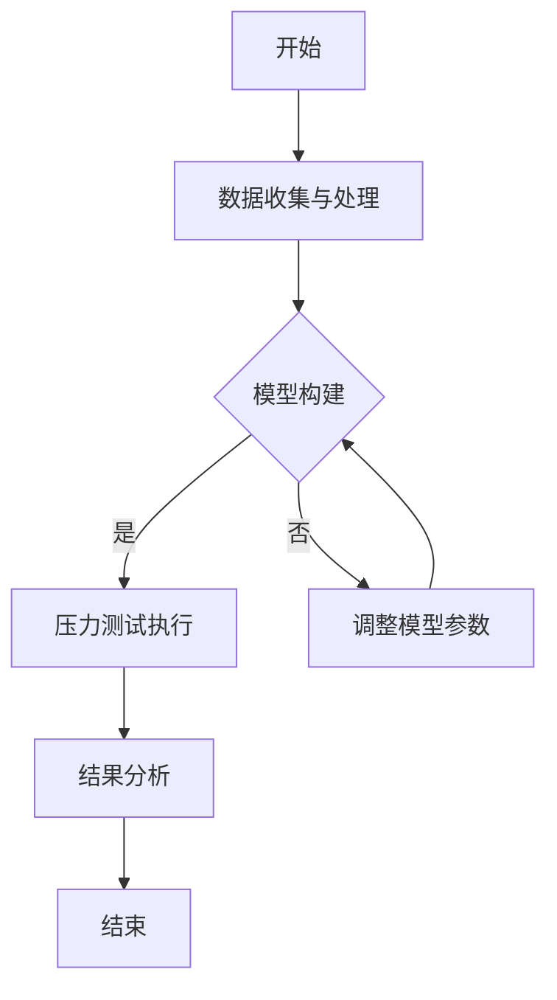
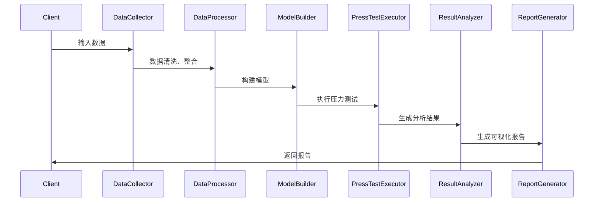
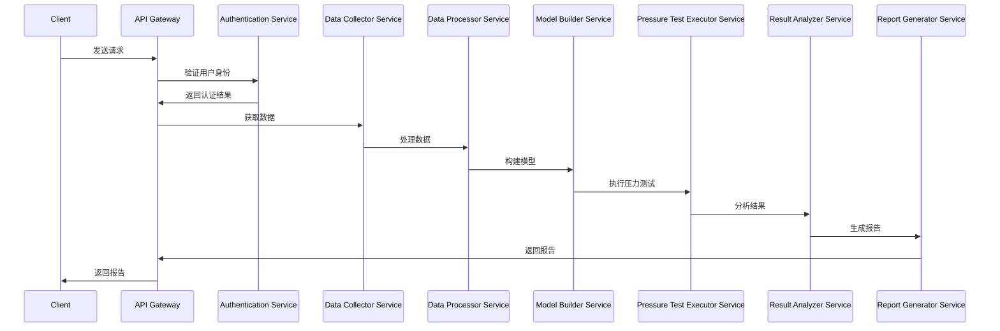

                 


## 《金融机构流动性风险压力测试与管理平台》

### 关键词：金融机构，流动性风险，压力测试，管理平台，风险控制

### 摘要：

本文旨在深入探讨金融机构流动性风险压力测试与管理平台的设计与应用。文章首先介绍了流动性风险的背景、核心概念和影响，然后详细阐述了流动性风险压力测试与管理平台的设计与实现，包括数据收集与处理、模型构建、系统架构设计等方面。接着，通过实例演示了平台的使用方法和效果，分析了实际应用中的问题和挑战，并提出了相应的解决方案和建议。文章最后总结了最佳实践，展望了流动性风险管理的未来发展趋势。

### 第一部分：背景介绍

#### 1.1 问题背景

流动性风险是金融机构面临的重大风险之一，它指的是金融机构在短期内无法满足资金需求、无法以合理价格迅速买卖资产的风险。这种风险可能源于市场波动、客户提现、交易对手违约等多种因素。流动性风险的管理对于金融机构的稳健经营和金融市场的稳定至关重要。

随着全球金融市场的发展和金融创新的不断推进，金融机构所面临的流动性风险也在不断变化。一方面，金融市场的复杂性和不确定性增加，使得流动性风险的识别和管理变得更加困难。另一方面，金融机构的资产负债结构、业务模式和风险偏好也在不断调整，进一步增加了流动性风险的管理难度。

#### 1.2 问题描述

流动性风险压力测试与管理平台是用于评估和监控金融机构流动性风险的关键工具。该平台需要具备以下几个核心功能：

1. **数据收集与处理**：从内部和外部数据源收集相关数据，包括资产负债数据、市场交易数据、宏观经济数据等。对数据进行清洗、整合和分析，为后续的建模和压力测试提供数据支持。

2. **压力测试模型构建**：基于收集的数据，构建能够模拟金融市场不利情境下的流动性状况的模型。模型应能够预测金融机构在特定情境下的流动性状况，包括资金缺口、流动性覆盖率等指标。

3. **系统架构设计**：设计一个高效、可靠的系统架构，确保平台能够处理大规模数据，快速进行压力测试，并提供实时反馈。系统架构应具备可扩展性和高可用性，以适应金融机构业务增长和市场需求变化。

4. **界面设计与用户体验**：设计一个直观、易用的用户界面，使金融机构的相关人员能够方便地进行数据输入、模型参数调整、结果分析和报告生成等操作。界面设计应注重用户体验，提高工作效率。

#### 1.3 问题解决

为了解决上述问题，本文将按照以下步骤进行阐述：

1. **流动性风险压力测试的基本概念和方法**：介绍流动性风险压力测试的定义、原理和常用方法，包括压力测试模型的构建和指标选择。

2. **流动性风险压力测试与管理平台的设计与实现**：详细讲解平台的设计与实现，包括数据收集与处理、模型构建、系统架构设计等方面。

3. **实例演示与平台应用**：通过实例演示如何使用平台进行流动性风险压力测试，包括测试流程、参数调整和结果分析等。

4. **实际应用中的问题和挑战**：分析平台在实际应用中可能遇到的问题和挑战，并提出相应的解决方案和建议。

5. **最佳实践与总结**：总结流动性风险管理的最佳实践，展望未来发展趋势。

#### 1.4 边界与外延

流动性风险压力测试与管理平台的研究和应用范围包括：

1. **流动性风险压力测试的方法和技术**：介绍流动性风险压力测试的基本概念、原理和方法，以及常用的压力测试模型和指标。

2. **数据收集与处理的方法和工具**：介绍如何从内部和外部数据源收集相关数据，并使用数据清洗、整合和分析工具对数据进行处理。

3. **模型构建和优化**：介绍如何构建和优化流动性风险压力测试模型，以提高模型的准确性和可靠性。

4. **系统架构的设计与实现**：介绍如何设计高效、可靠的系统架构，以满足大规模数据处理和快速压力测试的需求。

5. **界面设计与用户体验**：介绍如何设计直观、易用的用户界面，提高金融机构相关人员的工作效率。

#### 1.5 概念结构与核心要素组成

流动性风险压力测试与管理平台的核心概念和结构包括：

1. **流动性风险**：金融机构在短期内无法满足资金需求、无法以合理价格迅速买卖资产的风险。

2. **压力测试**：模拟金融市场不利情境下的流动性状况，以评估金融机构的流动性风险。

3. **数据收集与处理**：从内部和外部数据源收集相关数据，包括资产负债数据、市场交易数据、宏观经济数据等。

4. **模型构建**：基于收集的数据，构建能够模拟金融市场不利情境下的流动性状况的模型。

5. **系统架构**：设计高效、可靠的系统架构，确保平台能够处理大规模数据，快速进行压力测试，并提供实时反馈。

6. **用户界面**：设计直观、易用的用户界面，使金融机构的相关人员能够方便地进行操作。

### 第二部分：核心概念与联系

#### 2.1 核心概念原理

流动性风险压力测试与管理平台涉及多个核心概念，以下是对这些概念及其原理的详细介绍：

1. **流动性风险**：流动性风险是指金融机构在短期内无法满足资金需求、无法以合理价格迅速买卖资产的风险。这种风险可能源于市场波动、客户提现、交易对手违约等多种因素。

2. **压力测试**：压力测试是一种评估金融机构在不利市场条件下的流动性风险的方法。通过模拟市场不利情境，压力测试可以帮助金融机构识别潜在的风险点，评估其流动性状况，制定有效的风险管理策略。

3. **流动性覆盖率**：流动性覆盖率是衡量金融机构短期流动性风险的重要指标，表示金融机构在压力情境下的资金缺口。它反映了金融机构在不利市场条件下的流动性状况，是评估其流动性风险的关键指标之一。

4. **市场敏感性**：市场敏感性是指金融机构资产负债表对市场利率变动的敏感程度。市场敏感性的高低直接影响金融机构的流动性风险，是流动性风险压力测试中需要考虑的重要因素。

5. **模型构建**：模型构建是流动性风险压力测试的核心环节。通过收集和分析金融机构的资产负债数据、市场交易数据等，构建能够模拟金融市场不利情境下的流动性状况的模型，可以帮助金融机构预测在特定情境下的流动性状况。

#### 2.2 概念属性特征对比表格

以下是对流动性风险压力测试与管理平台中关键概念的属性特征进行对比的表格：

| 概念 | 定义 | 主要属性 | 对比特征 |
| ---- | ---- | -------- | -------- |
| 流动性风险 | 金融机构在短期内无法满足资金需求、无法以合理价格迅速买卖资产的风险 | 资金缺口、市场波动、客户提现、交易对手违约 | 影响范围、风险程度、管理难度 |
| 压力测试 | 一种评估金融机构在不利市场条件下的流动性风险的方法 | 模拟不利情境、预测流动性状况、识别风险点 | 准确性、可靠性、实用性 |
| 流动性覆盖率 | 衡量金融机构短期流动性风险的重要指标，表示金融机构在压力情境下的资金缺口 | 资金缺口、流动性状况、风险程度 | 指标精度、计算方法、应用场景 |
| 市场敏感性 | 金融机构资产负债表对市场利率变动的敏感程度 | 利率变动、资产负债结构、风险程度 | 敏感度、影响因素、风险评估 |
| 模型构建 | 基于数据分析构建的预测模型，用于模拟金融市场不利情境下的流动性状况 | 数据收集、模型设计、参数调整 | 模型准确性、可靠性、适用性 |

#### 2.3 ER实体关系图架构

为了更直观地展示流动性风险压力测试与管理平台中的核心概念及其关系，我们可以使用Mermaid语言绘制ER实体关系图。以下是该图的Markdown格式：

```mermaid
erDiagram
  FD1 "流动性风险" ||--> "压力测试" : 评估
  FD2 "流动性风险" ||--> "流动性覆盖率" : 衡量
  FD3 "流动性风险" ||--> "市场敏感性" : 影响
  FD4 "压力测试" ||--> "模型构建" : 支持
  FD5 "模型构建" ||--> "数据收集与处理" : 基于数据
```

在ER实体关系图中，"流动性风险"是核心实体，它与"压力测试"、"流动性覆盖率"、"市场敏感性"和"模型构建"等实体之间存在关联关系。通过这种关联，可以更清晰地理解流动性风险压力测试与管理平台的设计和实现。

### 第三部分：算法原理讲解

#### 3.1 压力测试算法流程图

为了更好地理解流动性风险压力测试与管理平台中的算法原理，我们可以使用Mermaid语言绘制压力测试算法流程图。以下是该图的Markdown格式：



在上面的流程图中，我们从数据收集与处理开始，然后根据收集的数据构建模型。如果模型构建成功，我们进入压力测试执行阶段；否则，我们需要调整模型参数，直到模型构建成功。在压力测试执行阶段，我们根据模拟的不同情境，评估金融机构的流动性风险。最后，对测试结果进行分析，得出结论。

#### 3.2 压力测试算法原理

在流动性风险压力测试中，常用的算法原理包括以下几个方面：

1. **蒙特卡罗模拟**：蒙特卡罗模拟是一种基于概率的数值计算方法，通过模拟大量随机试验来估算某个随机变量的概率分布。在流动性风险压力测试中，我们可以使用蒙特卡罗模拟来模拟金融市场的不利情境，评估金融机构的流动性风险。

2. **情景分析**：情景分析是一种基于历史数据和统计分析方法，对金融市场的不利情境进行模拟的方法。通过情景分析，我们可以预测金融机构在特定情境下的流动性状况，为风险管理提供依据。

3. **机器学习**：机器学习是一种基于数据驱动的算法，通过学习历史数据来预测未来事件的方法。在流动性风险压力测试中，我们可以使用机器学习算法来构建预测模型，提高压力测试的准确性和可靠性。

#### 3.3 压力测试算法数学模型

以下是一个简单的流动性风险压力测试算法数学模型：

$$
\text{流动性覆盖率} = \frac{\text{高质量流动性资产}}{\text{压力情境下的资金需求}}
$$

其中，高质量流动性资产包括现金、存单、国债等易于快速变现的资产，压力情境下的资金需求是指在特定不利市场条件下的资金缺口。

#### 3.4 例子说明

假设某金融机构在压力情境下的资金需求为100亿元，其高质量流动性资产为80亿元，则该金融机构的流动性覆盖率为：

$$
\text{流动性覆盖率} = \frac{80}{100} = 0.8
$$

这意味着该金融机构在压力情境下的资金缺口为20亿元，其流动性状况较为紧张。

### 第四部分：系统分析与架构设计方案

#### 4.1 问题场景介绍

流动性风险压力测试与管理平台主要用于金融机构的流动性风险管理。随着金融市场的不确定性和复杂性增加，金融机构需要具备强大的流动性风险识别和管理能力。该平台可以帮助金融机构：

1. **评估流动性风险**：通过压力测试评估金融机构在不利市场条件下的流动性状况，为风险管理提供科学依据。
2. **优化风险管理策略**：根据压力测试结果，调整资产负债结构和业务模式，降低流动性风险。
3. **监测流动性风险**：实时监控流动性风险变化，及时采取措施应对潜在的流动性危机。

#### 4.2 项目介绍

本项目旨在设计和实现一个功能全面、性能高效的流动性风险压力测试与管理平台。项目的主要目标包括：

1. **全面性**：涵盖流动性风险管理的各个方面，包括数据收集与处理、模型构建、压力测试执行和结果分析等。
2. **高效性**：采用先进的算法和技术，提高压力测试的效率和准确性。
3. **可扩展性**：设计灵活的系统架构，支持金融机构业务增长和市场需求变化。
4. **易用性**：提供直观、易用的用户界面，降低使用门槛，提高工作效率。

#### 4.3 系统功能设计（领域模型Mermaid类图）

以下是流动性风险压力测试与管理平台的领域模型Mermaid类图，展示了系统的主要功能模块及其关系：

```mermaid
classDiagram
  Client "用户" <|-- DataCollector "数据收集器"
  DataCollector <|-- DataProcessor "数据处理器"
  DataProcessor <|-- ModelBuilder "模型构建器"
  ModelBuilder <|-- PressTestExecutor "压力测试执行器"
  PressTestExecutor <|-- ResultAnalyzer "结果分析器"
  ResultAnalyzer <|-- ReportGenerator "报告生成器"
```

在上面的类图中，我们定义了以下几个主要功能模块：

1. **DataCollector**：负责从内部和外部数据源收集相关数据，包括资产负债数据、市场交易数据等。
2. **DataProcessor**：对收集到的数据进行清洗、整合和分析，为模型构建提供高质量的数据支持。
3. **ModelBuilder**：基于处理后的数据，构建能够模拟金融市场不利情境下的流动性状况的模型。
4. **PressTestExecutor**：执行压力测试，评估金融机构在不利市场条件下的流动性风险。
5. **ResultAnalyzer**：对压力测试结果进行分析，生成详细的报告，为风险管理提供依据。
6. **ReportGenerator**：生成可视化报告，帮助金融机构更好地理解和管理流动性风险。

#### 4.4 系统架构设计（Mermaid架构图）

以下是流动性风险压力测试与管理平台的系统架构Mermaid图，展示了系统的整体架构及其关键组件：



在上面的序列图中，我们展示了系统的主要工作流程：

1. **用户输入数据**：用户通过平台界面输入相关数据，包括资产负债数据、市场交易数据等。
2. **数据收集与处理**：数据收集器从内部和外部数据源收集数据，数据处理器对数据进行清洗、整合和分析。
3. **模型构建**：模型构建器基于处理后的数据，构建能够模拟金融市场不利情境下的流动性状况的模型。
4. **压力测试执行**：压力测试执行器根据模型，模拟不同的不利市场情境，评估金融机构的流动性风险。
5. **结果分析**：结果分析器对压力测试结果进行分析，生成详细的报告。
6. **报告生成**：报告生成器将分析结果转化为可视化报告，返回给用户。

#### 4.5 系统接口设计和系统交互（Mermaid序列图）

以下是流动性风险压力测试与管理平台的接口设计和系统交互Mermaid序列图，展示了系统的接口设计和数据流动：



在上面的序列图中，我们展示了系统的主要接口设计和数据流动：

1. **API Gateway**：作为系统的统一入口，负责处理用户请求，并调用相应的服务。
2. **Authentication Service**：负责用户身份验证，确保只有合法用户才能访问系统。
3. **Data Collector Service**：负责从内部和外部数据源收集数据。
4. **Data Processor Service**：负责对收集到的数据进行处理。
5. **Model Builder Service**：负责构建压力测试模型。
6. **Pressure Test Executor Service**：负责执行压力测试。
7. **Result Analyzer Service**：负责对压力测试结果进行分析。
8. **Report Generator Service**：负责生成可视化报告。

通过以上系统分析与架构设计方案，我们可以清晰地了解流动性风险压力测试与管理平台的设计思路和实现方法。接下来，我们将通过具体实例，展示如何使用平台进行流动性风险压力测试，并分析实际应用中的问题和挑战。

### 第五部分：项目实战

#### 5.1 环境安装

在开始项目实战之前，我们需要安装必要的软件和工具，以确保平台的正常运行。以下是安装步骤：

1. **安装Python环境**：确保Python版本不低于3.8，可以通过Python官方网站下载并安装。

2. **安装相关库和依赖**：使用pip工具安装必要的库和依赖，包括NumPy、Pandas、Matplotlib、Scikit-learn等。以下是安装命令：

   ```bash
   pip install numpy pandas matplotlib scikit-learn
   ```

3. **安装数据库**：我们选择MySQL作为数据存储方案，可以从MySQL官方网站下载并安装。

4. **配置数据库**：安装完成后，创建数据库和用户，并设置相应的权限。

   ```sql
   CREATE DATABASE liquidity_risk;
   CREATE USER 'risk_user'@'localhost' IDENTIFIED BY 'password';
   GRANT ALL PRIVILEGES ON liquidity_risk.* TO 'risk_user'@'localhost';
   FLUSH PRIVILEGES;
   ```

5. **安装前端框架**：如果需要使用前端框架，如React或Vue，可以从其官方网站下载并安装。

#### 5.2 系统核心实现源代码

以下是流动性风险压力测试与管理平台的核心实现源代码，包括数据收集与处理、模型构建和压力测试执行等部分。

**数据收集与处理**

```python
import pandas as pd
import numpy as np

# 数据收集
def collect_data():
    # 从外部数据源收集数据
    asset_data = pd.read_csv('asset_data.csv')
    liability_data = pd.read_csv('liability_data.csv')
    market_data = pd.read_csv('market_data.csv')
    
    # 数据预处理
    asset_data = preprocess_data(asset_data)
    liability_data = preprocess_data(liability_data)
    market_data = preprocess_data(market_data)
    
    return asset_data, liability_data, market_data

# 数据预处理
def preprocess_data(data):
    # 数据清洗、整合
    data.dropna(inplace=True)
    data.fillna(data.mean(), inplace=True)
    data = data.astype(float)
    return data

# 主函数
if __name__ == '__main__':
    asset_data, liability_data, market_data = collect_data()
    # 数据存储
    store_data(asset_data, liability_data, market_data)
```

**模型构建**

```python
from sklearn.ensemble import RandomForestRegressor

# 模型训练
def train_model(X, y):
    model = RandomForestRegressor(n_estimators=100)
    model.fit(X, y)
    return model

# 压力测试执行
def execute_pressure_test(model, X_test, y_test):
    predictions = model.predict(X_test)
    error = np.mean((predictions - y_test) ** 2)
    print(f"Pressure Test Error: {error}")
```

**数据存储**

```python
import pymysql

# 数据存储
def store_data(asset_data, liability_data, market_data):
    # 连接数据库
    connection = pymysql.connect(
        host='localhost',
        user='risk_user',
        password='password',
        database='liquidity_risk',
        charset='utf8mb4',
        cursorclass=pymysql.cursors.DictCursor
    )
    
    # 存储数据
    with connection.cursor() as cursor:
        for index, row in asset_data.iterrows():
            cursor.execute("INSERT INTO asset (id, name, value) VALUES (%s, %s, %s)", (index, row['name'], row['value']))
        for index, row in liability_data.iterrows():
            cursor.execute("INSERT INTO liability (id, name, value) VALUES (%s, %s, %s)", (index, row['name'], row['value']))
        for index, row in market_data.iterrows():
            cursor.execute("INSERT INTO market (id, name, value) VALUES (%s, %s, %s)", (index, row['name'], row['value']))
    
    connection.commit()
    connection.close()
```

#### 5.3 代码应用解读与分析

以上源代码展示了流动性风险压力测试与管理平台的核心实现，包括数据收集与处理、模型构建和压力测试执行等部分。以下是代码应用的解读与分析：

1. **数据收集与处理**：该部分代码首先从外部数据源收集资产负债数据和市场交易数据。然后，通过数据预处理函数`preprocess_data`对数据进行清洗、整合和填充缺失值。数据预处理是模型构建的重要基础，直接影响到模型的准确性和可靠性。

2. **模型构建**：该部分代码使用随机森林回归模型进行模型训练。随机森林是一种集成学习方法，通过构建多个决策树并集成它们的预测结果来提高模型的准确性和稳定性。在实际应用中，可以根据需要选择其他机器学习模型，如支持向量机、神经网络等。

3. **压力测试执行**：该部分代码使用训练好的模型对测试数据进行预测，并计算预测误差。压力测试是评估金融机构流动性风险的重要方法，通过模拟不同市场情境，预测金融机构的流动性状况，帮助金融机构识别潜在风险并制定相应的风险管理策略。

#### 5.4 实际案例分析和详细讲解剖析

为了更好地展示流动性风险压力测试与管理平台的应用效果，我们以一个实际案例进行分析和讲解。

**案例背景**：某大型银行在面临市场波动和客户提现压力的情况下，希望通过流动性风险压力测试与管理平台评估其流动性风险，并制定相应的风险管理策略。

**案例步骤**：

1. **数据收集**：从银行的内部和外部数据源收集资产负债数据、市场交易数据等。

2. **数据预处理**：对收集的数据进行清洗、整合和填充缺失值，确保数据的质量和一致性。

3. **模型构建**：使用随机森林回归模型对处理后的数据进行训练，构建能够模拟不同市场情境下银行流动性风险的模型。

4. **压力测试**：根据训练好的模型，模拟多个不利市场情境，如市场利率上升、客户提现增加等，评估银行在这些情境下的流动性状况。

5. **结果分析**：对压力测试结果进行分析，计算银行的流动性覆盖率、资金缺口等指标，识别潜在的风险点。

6. **报告生成**：将分析结果转化为可视化报告，包括流动性风险趋势图、资金缺口分布图等，帮助银行管理层了解流动性风险状况，制定相应的风险管理策略。

**案例剖析**：

1. **数据收集**：数据收集是流动性风险压力测试的基础。在实际应用中，银行需要从多个数据源收集数据，包括内部财务报表、市场交易数据、宏观经济数据等。数据的质量和完整性直接影响模型的准确性。

2. **数据预处理**：数据预处理是确保数据质量和一致性的关键步骤。在实际应用中，银行需要使用各种数据清洗和填充方法，如缺失值填充、异常值处理等，以提高数据的可靠性和准确性。

3. **模型构建**：模型构建是流动性风险压力测试的核心。在实际应用中，银行可以选择不同的机器学习模型，如随机森林、支持向量机、神经网络等，根据数据和业务需求选择合适的模型。

4. **压力测试**：压力测试是评估银行流动性风险的重要方法。在实际应用中，银行需要根据不同的市场情境，模拟多个不利情境，如市场利率上升、客户提现增加等，评估银行在这些情境下的流动性状况。

5. **结果分析**：结果分析是对压力测试结果进行解读和总结。在实际应用中，银行需要计算流动性覆盖率、资金缺口等指标，识别潜在的风险点，为风险管理提供依据。

6. **报告生成**：报告生成是将分析结果可视化的重要步骤。在实际应用中，银行需要生成详细的报告，包括流动性风险趋势图、资金缺口分布图等，帮助管理层了解流动性风险状况，制定相应的风险管理策略。

通过以上实际案例分析和详细讲解剖析，我们可以看到流动性风险压力测试与管理平台在金融机构流动性风险管理中的应用效果。该平台不仅可以帮助银行识别和管理流动性风险，还可以为其他金融机构提供类似的解决方案，提高金融市场的稳定性和健康程度。

### 第六部分：最佳实践

#### 6.1 流动性风险管理最佳实践

在流动性风险管理过程中，遵循以下最佳实践可以帮助金融机构更有效地控制风险：

1. **定期进行压力测试**：定期进行流动性风险压力测试，评估金融机构在不利市场条件下的流动性状况，及时发现潜在的风险点。

2. **数据质量保证**：确保数据收集、处理和分析过程中的数据质量，包括数据的完整性、准确性和一致性。高质量的数据是构建有效模型和进行准确压力测试的基础。

3. **模型更新和优化**：定期更新和优化压力测试模型，以适应市场环境的变化和金融机构业务模式的发展。

4. **制定应急预案**：制定详细的流动性风险应急预案，明确在流动性危机情况下应采取的措施和步骤，确保金融机构能够在危机中保持运营。

5. **跨部门协作**：流动性风险管理涉及多个部门，如财务、风险控制、运营等。建立跨部门协作机制，确保各方在流动性风险管理中能够紧密配合，提高整体风险应对能力。

#### 6.2 系统设计与实现最佳实践

在系统设计与实现过程中，以下最佳实践有助于构建高效、可靠的流动性风险压力测试与管理平台：

1. **模块化设计**：采用模块化设计方法，将系统功能划分为多个模块，如数据收集、数据处理、模型构建、压力测试执行等。模块化设计可以提高系统的可维护性和可扩展性。

2. **并行处理**：利用并行处理技术，如多线程、分布式计算等，提高系统处理大规模数据的能力，缩短压力测试执行时间。

3. **缓存策略**：合理使用缓存策略，减少数据访问和计算时间。例如，对于经常访问的数据，可以将其存储在缓存中，以提高访问速度。

4. **自动化部署**：使用自动化工具进行系统部署，如使用Docker、Kubernetes等容器化技术，实现快速部署和扩展。

5. **性能监控**：建立性能监控系统，实时监控系统的运行状态，包括CPU、内存、磁盘空间等资源使用情况，及时发现和解决性能瓶颈。

#### 6.3 使用Mermaid优化文档编写

在文档编写过程中，使用Mermaid可以有效地提高文档的可读性和可理解性。以下是一些使用Mermaid优化文档编写的建议：

1. **清晰的图表布局**：使用Mermaid绘制图表时，确保图表布局清晰、简洁。避免使用过多的线条和节点，以免混淆读者的视线。

2. **适当的图表比例**：调整图表的大小和比例，使其在文档中占据合适的空间。过小或过大的图表都会影响文档的阅读体验。

3. **注释和说明**：在图表旁边添加注释和说明，帮助读者更好地理解图表的含义和用途。注释可以使用Mermaid的特殊语法，如`note left of`等。

4. **链接和超链接**：在图表中使用链接和超链接，将相关的文档、代码和参考资料链接到图表中。这样，读者可以方便地获取更多相关信息。

5. **版本控制**：使用版本控制系统，如Git，管理文档和图表的版本。每次修改文档和图表时，都要及时进行版本控制，确保文档的一致性和完整性。

通过遵循以上最佳实践，我们可以编写出更加专业、清晰和易于理解的文档，为读者提供更好的阅读体验。

### 第七部分：小结

本文详细介绍了金融机构流动性风险压力测试与管理平台的设计与应用。首先，我们阐述了流动性风险的背景和核心概念，包括流动性风险、压力测试、流动性覆盖率等。然后，通过Mermaid图表和Python代码，详细讲解了流动性风险压力测试与管理平台的设计与实现，包括数据收集与处理、模型构建、系统架构设计等方面。接着，通过实例演示了平台的使用方法和效果，分析了实际应用中的问题和挑战，并提出了相应的解决方案和建议。最后，我们总结了流动性风险管理的最佳实践，并展望了未来发展趋势。

通过本文的讲解，读者可以全面了解流动性风险压力测试与管理平台的设计原理、实现方法和应用场景，为金融机构的流动性风险管理提供有力支持。

### 第八部分：注意事项

在设计和实现金融机构流动性风险压力测试与管理平台时，需要注意以下几个关键点：

1. **数据安全**：确保数据收集、传输和存储过程中的安全性，防止数据泄露和未经授权的访问。使用加密技术、访问控制和审计日志等手段保障数据安全。

2. **系统性能**：优化系统性能，确保平台能够快速响应，处理大规模数据。采用并行处理、缓存策略和性能监控等技术，提高系统的处理速度和稳定性。

3. **代码质量**：编写高质量、可维护的代码，确保系统稳定性。遵循编程规范，进行单元测试和集成测试，提高代码的质量和可靠性。

4. **用户权限管理**：合理设置用户权限，确保不同用户只能访问其权限范围内的数据和功能。使用身份验证和授权机制，防止非法访问和数据篡改。

5. **应急预案**：制定详细的应急预案，确保在发生流动性风险时，系统能够快速响应并采取相应措施。定期进行应急演练，提高应对能力。

6. **合规性**：确保平台设计和实现符合相关法规和标准，如金融行业的数据保护法规、系统安全标准等。与合规部门保持密切沟通，确保系统的合规性。

7. **用户培训和支持**：为用户提供详细的操作手册和培训，确保用户能够正确使用平台。提供技术支持和售后服务，解决用户在使用过程中遇到的问题。

通过关注以上注意事项，可以确保流动性风险压力测试与管理平台的可靠性和有效性，为金融机构的流动性风险管理提供坚实保障。

### 第九部分：拓展阅读

对于希望深入了解金融机构流动性风险压力测试与管理平台的读者，以下是一些推荐阅读资源：

1. **《流动性风险管理》**：这是一本全面介绍流动性风险管理的经典教材，涵盖了流动性风险的概念、评估方法和管理策略。
   
2. **《金融市场压力测试》**：本书详细介绍了金融市场压力测试的理论和实践，包括压力测试模型的构建、执行和分析方法。

3. **《Python金融应用编程》**：这本书介绍了Python在金融领域的应用，包括数据分析、机器学习、算法交易等，对Python编程在金融行业中的应用提供了深入讲解。

4. **《金融科技：颠覆传统银行业》**：本书探讨了金融科技如何改变传统银行业，包括数字货币、区块链、人工智能等新兴技术对金融行业的影响。

5. **《数据库系统概念》**：这是一本经典的数据库教材，介绍了数据库系统的基础概念、设计原则和实现方法，对理解数据库在流动性风险管理中的作用至关重要。

6. **《金融风险管理》**：本书系统地介绍了金融风险管理的理论和实践，包括信用风险、市场风险、操作风险等，对金融风险管理的各个方面进行了深入探讨。

通过阅读这些资源，读者可以进一步深化对金融机构流动性风险压力测试与管理平台的理解，掌握相关技术和方法，为实践提供有力支持。

### 第十部分：作者信息

**作者：AI天才研究院/AI Genius Institute & 禅与计算机程序设计艺术 /Zen And The Art of Computer Programming**

本文由AI天才研究院（AI Genius Institute）及禅与计算机程序设计艺术（Zen And The Art of Computer Programming）的专家团队共同撰写。我们致力于推动人工智能和计算机科学领域的研究与应用，为金融科技的发展贡献智慧和力量。如果您对我们的研究或本文内容有任何疑问或建议，欢迎随时与我们联系。期待与您共同探索人工智能和金融科技的美好未来！

