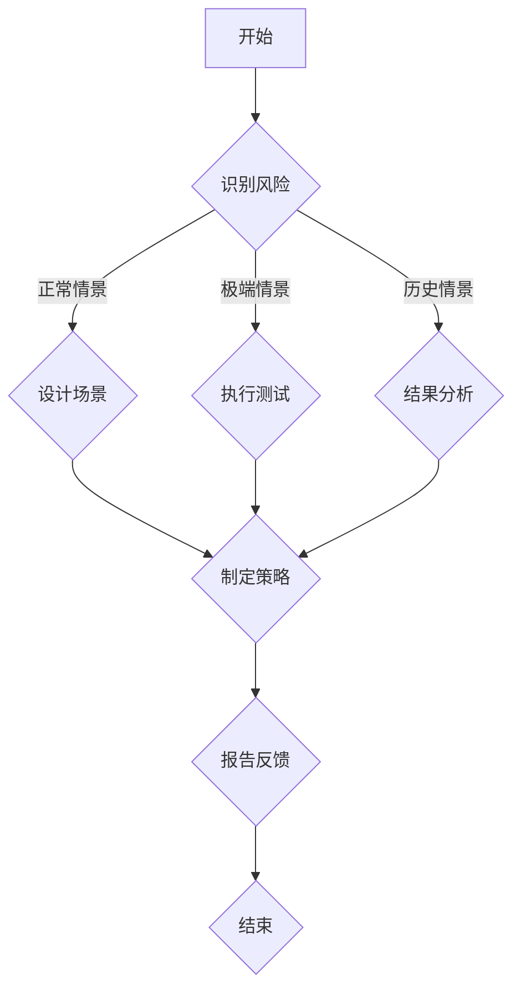
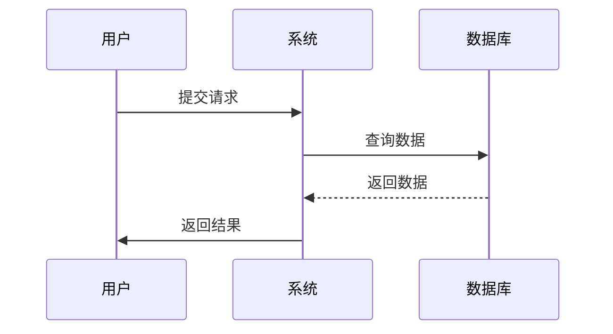
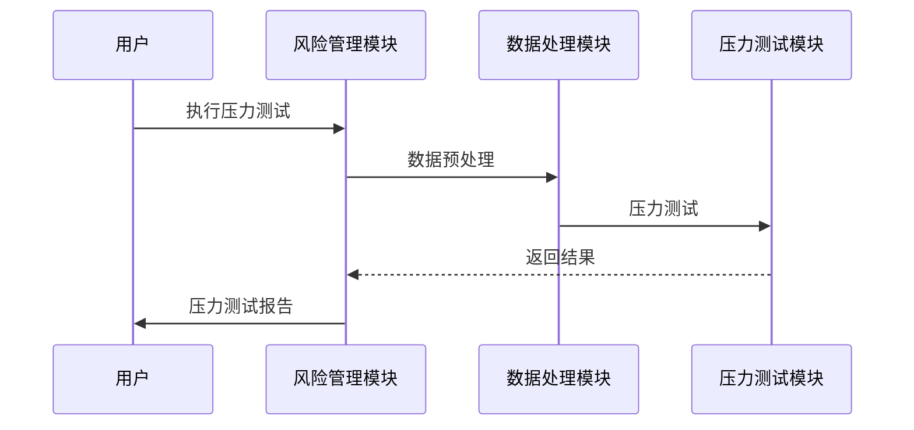
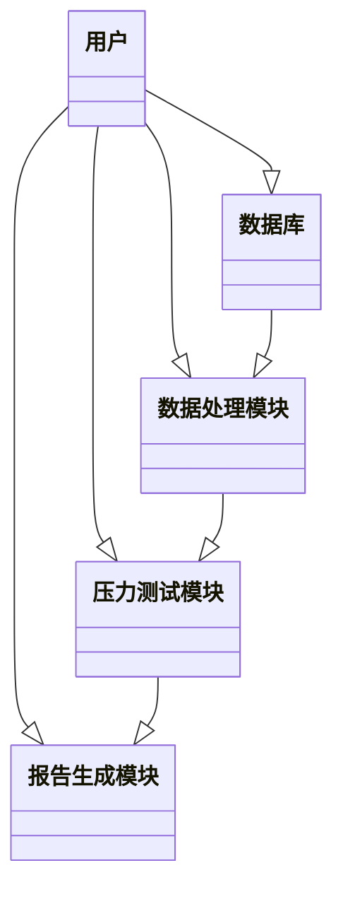
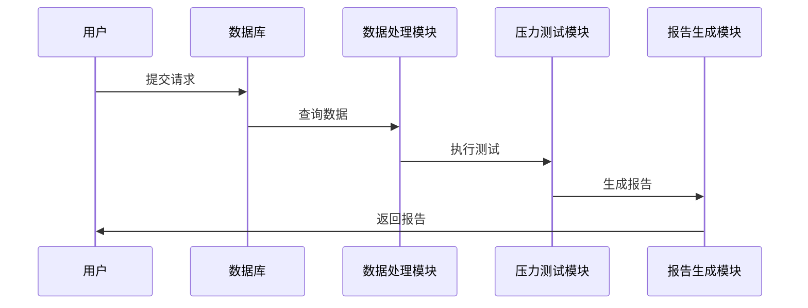

                 


### # 金融机构流动性风险压力测试平台

#### 关键词：
- 金融机构
- 流动性风险
- 压力测试平台
- 风险管理
- 数据处理
- 系统架构设计

#### 摘要：
本文深入探讨了金融机构流动性风险压力测试平台的重要性、理论基础、实现方法、架构设计以及实际应用。通过对流动性风险的定义、度量、影响因素、治理框架等方面的阐述，本文为读者提供了一个全面理解流动性风险压力测试的平台。同时，文章详细介绍了压力测试的方法与流程、技术实现、平台设计以及挑战与展望，旨在为金融机构提供一套实用的流动性风险管理解决方案。

## 引言

### 1.1 问题背景与重要性

流动性风险是金融机构面临的一种重要风险，它源于金融机构在短期内无法以合理价格迅速出售资产以满足现金流需求的能力不足。这种风险对于金融机构的稳健经营和持续发展具有潜在威胁。随着全球金融市场的发展和金融工具的复杂化，流动性风险的识别和管理变得愈加重要。

流动性风险压力测试作为一种评估金融机构在极端市场条件下的流动性能力和应对能力的工具，已经成为金融机构风险管理的重要组成部分。通过压力测试，金融机构可以提前识别潜在的风险点，评估风险暴露，制定相应的应对策略，从而提高流动性管理的有效性和应对能力。

本文旨在探讨金融机构流动性风险压力测试平台的设计与实现，为金融机构提供一套实用、高效的风险管理工具。本文结构安排如下：

1. 引言：介绍流动性风险压力测试的背景和重要性。
2. 流动性风险理论基础：阐述流动性风险的定义、度量、影响因素和治理框架。
3. 压力测试方法与框架：介绍压力测试的定义、目的、流程和关键要素。
4. 压力测试技术实现：探讨压力测试的数据收集与处理、平台架构设计和系统性能优化。
5. 平台应用与实践：分析实际案例，分享最佳实践和应用建议。
6. 挑战与展望：讨论流动性风险压力测试平台面临的挑战和未来发展趋势。
7. 结论：总结文章的核心观点和贡献。

### 1.2 目标读者与结构安排

本文的目标读者主要包括以下几类：

1. 金融机构的风险管理人员和分析师：他们需要对流动性风险压力测试有深入理解，以便更好地进行风险管理。
2. 金融科技从业者：他们需要了解流动性风险压力测试平台的实现原理和技术实现，以应用于实际项目。
3. 学术研究人员：他们可以通过本文的探讨，拓展对流动性风险管理领域的研究。

本文的结构安排旨在帮助读者从理论到实践，全面了解流动性风险压力测试平台。通过本文的阅读，读者可以：

1. 掌握流动性风险的基本概念和度量方法。
2. 理解压力测试的定义、目的和流程。
3. 了解压力测试技术实现的各个方面，包括数据收集与处理、平台架构设计和系统性能优化。
4. 学习流动性风险压力测试平台的应用与实践，掌握最佳实践。
5. 讨论流动性风险压力测试平台面临的挑战和未来发展趋势。

## 流动性风险理论基础

### 2.1 流动性风险定义

流动性风险是指金融机构在面临资金流动性需求时，无法及时满足该需求的可能性。它通常分为货币流动性风险和金融市场流动性风险。

**货币流动性风险**：指金融机构在短期内无法以合理的价格迅速获得足够的流动性资产来应对现金流需求。这种风险通常与金融机构的资产负债结构和资金管理能力相关。

**金融市场流动性风险**：指在金融市场中，资产买卖双方难以迅速以合理的价格成交，导致资产无法及时转换为现金。这种风险通常与市场供求关系、市场信心和交易机制等因素相关。

### 2.2 流动性风险的度量

流动性风险的度量是评估金融机构流动性状况的重要手段。以下是几种常用的度量方法：

**货币流动性比率**：包括流动比率（Current Ratio）和速动比率（Quick Ratio）。它们反映了金融机构短期内可变现资产与短期负债之间的关系，越高意味着流动性越强。

**流动资产/总资产**：指金融机构流动资产占总资产的比例，该指标越高，表示金融机构的流动性越好。

**资金缺口比率**：用于衡量金融机构在特定时期内资金流入和流出之间的差额。资金缺口比率高意味着金融机构面临较大的流动性压力。

**流动性覆盖率（Liquidity Coverage Ratio, LCR）和净稳定资金比率（Net Stable Funding Ratio, NSFR）**：这两个指标是巴塞尔协议III中提出的流动性风险管理指标，用于评估金融机构在中期内的流动性状况。

### 2.3 流动性风险的影响因素

流动性风险的影响因素多种多样，以下是一些主要因素：

**经济周期**：在经济繁荣期，市场流动性通常较为充裕，金融机构的流动性风险较低。而在经济衰退期，市场流动性可能急剧收缩，金融机构的流动性风险增加。

**资产负债结构**：金融机构的资产负债结构对其流动性风险有显著影响。高比例的短期负债和低比例的流动性资产会增加流动性风险。

**市场供求关系**：市场供求关系的变化会影响金融市场的流动性。在市场供过于求时，资产价格下跌，流动性风险增加。

**市场信心**：市场信心的下降可能导致市场流动性枯竭，增加金融机构的流动性风险。

**交易机制**：交易机制的设计和运行效率会影响金融市场的流动性。高效的交易机制可以促进市场流动性的提高。

**监管要求**：监管机构对金融机构的流动性监管要求越来越严格，金融机构需要满足一系列流动性指标和监管要求，从而降低流动性风险。

### 2.4 流动性风险的治理框架

流动性风险的治理框架包括内部治理机制和外部监管环境。

**内部治理机制**：金融机构应建立完善的流动性风险管理组织架构，明确各部门的职责和权限，制定流动性风险管理政策和程序，建立流动性风险监控和报告体系。

**流动性风险管理委员会**：负责制定流动性风险管理战略和政策，审批流动性风险限额和风险控制措施。

**流动性风险管理部门**：负责流动性风险识别、评估、监控和报告，协调各部门流动性风险管理工作的开展。

**流动性风险监控和报告**：通过日常监控、定期评估和报告，确保流动性风险在可控范围内。

**外部监管环境**：监管机构对金融机构的流动性风险监管主要包括以下方面：

**流动性风险监管指标**：监管机构制定一系列流动性风险监管指标，如LCR、NSFR等，要求金融机构定期报告。

**流动性风险监测和评估**：监管机构通过监测金融机构的流动性状况，评估其流动性风险管理能力。

**流动性风险应对措施**：监管机构可以采取一系列措施，如提高资本要求、限制业务范围等，以降低金融机构的流动性风险。

## 压力测试方法与框架

### 3.1 压力测试概述

#### 压力测试的定义与目的

压力测试（Stress Testing）是一种评估金融机构在极端市场条件下流动性能力和应对能力的方法。其目的是通过模拟各种极端市场情景，评估金融机构在面临突发性流动性需求时的应对能力，识别潜在的流动性风险点，制定相应的应对策略。

压力测试的重要性体现在以下几个方面：

1. **识别潜在风险**：压力测试可以帮助金融机构提前识别潜在的流动性风险点，从而采取预防措施。
2. **评估应对能力**：通过压力测试，金融机构可以评估自身在极端市场条件下的应对能力，发现管理漏洞。
3. **制定应对策略**：压力测试结果可以为金融机构制定应对策略提供依据，确保在突发情况下能够有效应对。
4. **合规要求**：许多监管机构要求金融机构定期进行压力测试，以证明其流动性风险管理能力。

#### 压力测试的类型

压力测试通常分为以下几种类型：

1. **静态压力测试**：在静态压力测试中，金融机构对某个特定时间点或时间段内的流动性状况进行评估。这种测试通常用于评估金融机构的日常流动性管理能力。
2. **动态压力测试**：动态压力测试模拟金融机构在一段时间内的流动性变化情况。这种测试可以更全面地评估金融机构的流动性风险。
3. **极端情景压力测试**：极端情景压力测试模拟金融机构在极端市场条件下的流动性状况。这种测试可以评估金融机构在极端情况下的应对能力。
4. **历史情景压力测试**：历史情景压力测试基于过去发生的市场情景，模拟金融机构在相似市场条件下的流动性状况。这种测试有助于金融机构总结经验，提高应对能力。

#### 压力测试的目的

压力测试的主要目的是：

1. **评估流动性风险**：通过模拟各种市场情景，评估金融机构的流动性风险水平，识别潜在的风险点。
2. **验证应对策略**：通过模拟极端市场情景，验证金融机构制定的流动性应对策略的有效性。
3. **改进流动性管理**：根据压力测试结果，金融机构可以改进流动性管理策略，提高流动性风险管理能力。
4. **满足监管要求**：许多监管机构要求金融机构定期进行压力测试，以证明其流动性风险管理能力。

### 3.2 压力测试的流程

压力测试通常包括以下步骤：

1. **风险识别**：首先，金融机构需要识别可能影响流动性的风险因素，如市场变化、经济周期、资产负债结构调整等。
2. **压力场景设计**：根据风险识别的结果，设计各种压力场景，包括正常情景、极端情景和历史情景。每个情景需要明确其假设条件和预期影响。
3. **测试执行**：在压力场景设计完成后，金融机构需要按照预定的场景执行压力测试，评估金融机构在各个情景下的流动性状况。
4. **结果分析**：对压力测试结果进行分析，评估金融机构的流动性风险水平，识别潜在的风险点。
5. **制定应对策略**：根据压力测试结果，金融机构需要制定相应的应对策略，包括流动性管理策略、资本补充策略等。
6. **报告与反馈**：将压力测试结果和应对策略报告给管理层和监管机构，并进行反馈和改进。

### 3.3 压力测试的关键要素

压力测试的成功实施依赖于以下几个关键要素：

1. **测试数据**：压力测试的数据质量直接影响测试结果的准确性。金融机构需要确保测试数据来源可靠、数据完整性高。
2. **模型假设**：压力测试模型假设的合理性直接影响测试结果的可靠性。金融机构需要根据实际情况设定合理的模型假设。
3. **指标设置**：压力测试指标的选择和设置需要能够全面反映金融机构的流动性状况，包括流动性覆盖率、资金缺口比率等。

## 压力测试技术实现

### 4.1 数据收集与处理

压力测试的数据收集与处理是压力测试平台实现的重要环节。以下是对数据收集与处理的具体探讨：

#### 数据来源

数据来源可以分为内部数据和外部数据：

1. **内部数据**：内部数据主要来自于金融机构的内部系统，如交易系统、账务系统、客户管理系统等。这些数据通常包括交易记录、账务流水、客户信息等。
2. **外部数据**：外部数据主要来自于金融市场和市场环境的数据，如市场行情数据、宏观经济数据、政策法规等。这些数据通常来自于第三方数据提供商或金融机构自行采集。

#### 数据处理

数据处理主要包括数据清洗、数据整合和数据预处理：

1. **数据清洗**：数据清洗的目的是去除数据中的错误、重复和无效信息，提高数据的准确性和完整性。数据清洗的方法包括去重、填补缺失值、纠正错误数据等。
2. **数据整合**：数据整合的目的是将来自不同源的数据进行合并，形成统一的视图。数据整合的方法包括数据融合、数据映射和数据转换等。
3. **数据预处理**：数据预处理的目的是将原始数据转换为适合分析的形式。数据预处理的方法包括数据标准化、数据归一化、特征提取等。

#### 数据质量控制

数据质量控制是确保数据质量的关键步骤，主要包括以下方面：

1. **数据完整性**：确保数据在采集、处理和传输过程中不会丢失或损坏，保持数据的一致性和完整性。
2. **数据一致性**：确保数据在不同系统、不同时间段和数据源之间的一致性，避免数据冲突或重复。
3. **数据准确性**：通过数据清洗和校验，确保数据的准确性，避免错误数据对分析结果的影响。

### 4.2 平台架构设计

压力测试平台的架构设计是确保平台高效稳定运行的基础。以下是对平台架构设计的具体探讨：

#### 平台架构概述

压力测试平台通常采用分层架构设计，包括数据层、处理层、存储层和展示层：

1. **数据层**：数据层负责数据的收集、存储和管理。数据源包括内部数据和外部数据，数据存储采用分布式数据库或数据仓库，确保数据的高可用性和高可靠性。
2. **处理层**：处理层负责对数据进行处理和分析。处理层采用分布式计算框架，如Hadoop、Spark等，实现并行处理和高效计算。
3. **存储层**：存储层负责数据的存储和管理。存储层采用分布式文件系统或数据库集群，提供高效的数据存储和快速的数据访问。
4. **展示层**：展示层负责将处理结果以可视化形式展示给用户。展示层采用可视化工具和仪表盘，提供丰富的数据报表和图形展示。

#### 技术选型

平台的技术选型主要包括以下几个方面：

1. **数据处理框架**：选择适合业务需求的数据处理框架，如Hadoop、Spark等，实现数据的高效处理和分析。
2. **数据库和存储**：选择高性能、高可用的数据库和存储系统，如Hadoop HDFS、MongoDB、HBase等，确保数据的安全性和可靠性。
3. **编程语言和开发框架**：选择适合业务需求和技术团队的编程语言和开发框架，如Java、Python、Spring Boot等，提高开发效率和代码质量。
4. **可视化工具**：选择适合业务需求的可视化工具和仪表盘，如Tableau、Kibana、ECharts等，提供丰富的数据报表和图形展示。

### 4.3 系统性能优化

系统性能优化是确保压力测试平台高效稳定运行的重要环节。以下是对系统性能优化策略的具体探讨：

#### 系统负载测试

系统负载测试的目的是评估平台在高压下的性能表现，发现潜在的瓶颈和性能问题。负载测试主要包括以下方面：

1. **并发用户数**：模拟不同并发用户数下的系统性能，评估系统的响应时间和吞吐量。
2. **数据量**：模拟不同数据量下的系统性能，评估系统的处理能力和数据存储性能。
3. **网络延迟**：模拟网络延迟对系统性能的影响，评估系统的稳定性和可靠性。
4. **硬件资源**：评估不同硬件配置下的系统性能，为硬件升级提供依据。

#### 性能调优策略

性能调优策略主要包括以下方面：

1. **优化数据库查询**：通过优化数据库查询语句，减少查询时间和数据读取量，提高数据处理效率。
2. **数据缓存**：通过数据缓存技术，减少数据的重复读取和计算，提高系统响应速度。
3. **分布式计算**：通过分布式计算框架，实现数据的并行处理和负载均衡，提高系统的处理能力。
4. **网络优化**：通过优化网络配置和传输协议，减少网络延迟和传输损耗，提高系统传输效率。

#### 监控与报警

监控与报警是确保系统性能优化效果的重要手段。通过监控系统的运行状态，及时发现和处理性能问题，确保系统的高效稳定运行。监控与报警主要包括以下方面：

1. **系统监控**：实时监控系统的CPU、内存、磁盘等资源使用情况，及时发现性能瓶颈。
2. **应用监控**：监控应用程序的性能指标，如请求响应时间、错误率等，及时发现性能问题。
3. **报警机制**：设置合理的报警阈值和报警方式，及时发现和处理性能问题，确保系统的稳定运行。

## 平台应用与实践

### 6.1 实际案例研究

#### 案例一：某大型银行的流动性风险压力测试实践

某大型银行在实施流动性风险压力测试时，采用了以下步骤：

1. **风险识别**：首先，银行识别了可能影响流动性的风险因素，如市场利率变动、宏观经济政策变化、资产负债结构调整等。
2. **压力场景设计**：根据风险识别的结果，银行设计了多种压力场景，包括正常情景、极端情景和历史情景。例如，正常情景假设市场利率保持稳定，极端情景假设市场利率大幅波动。
3. **测试执行**：银行按照预定的压力场景执行了压力测试，模拟了各种情景下的流动性状况。
4. **结果分析**：分析压力测试结果，银行发现某些极端情景下存在较大的流动性风险，如市场利率大幅波动时，银行面临较大的资金缺口。
5. **制定应对策略**：根据压力测试结果，银行制定了相应的应对策略，包括调整资产负债结构、增加流动性储备等。
6. **报告与反馈**：银行将压力测试结果和应对策略报告给管理层和监管机构，并进行了反馈和改进。

#### 案例二：某金融机构的流动性压力测试效果分析

某金融机构在实施流动性风险压力测试后，对其效果进行了分析：

1. **风险识别与控制**：通过压力测试，金融机构成功识别了潜在的风险点，并采取相应的控制措施，如调整资产负债结构、增加流动性储备等。
2. **流动性管理能力提升**：压力测试帮助金融机构提高了流动性管理能力，使其能够在极端市场情景下保持良好的流动性状况。
3. **合规性满足**：金融机构根据压力测试结果，满足了监管机构的要求，证明了其流动性风险管理能力。
4. **风险应对策略有效性验证**：通过压力测试，金融机构验证了其制定的流动性应对策略的有效性，为未来应对流动性风险提供了依据。

### 6.2 最佳实践

#### 1. 数据收集与处理

**实践一**：采用分布式数据处理框架（如Hadoop、Spark）进行大规模数据处理，提高数据处理效率。

**实践二**：确保数据质量，通过数据清洗、数据整合和数据预处理等技术手段，提高数据的准确性、完整性和一致性。

#### 2. 压力场景设计

**实践一**：结合金融机构的实际情况，设计合理的压力场景，包括正常情景、极端情景和历史情景。

**实践二**：根据压力测试的目的和需求，设定合理的压力测试指标，如流动性覆盖率、资金缺口比率等。

#### 3. 平台架构设计

**实践一**：采用分布式架构设计，提高平台的可扩展性和容错性。

**实践二**：选择合适的技术栈，如Java、Python、Spring Boot等，确保平台的稳定性和易维护性。

#### 4. 系统性能优化

**实践一**：进行系统负载测试，评估平台的性能表现，发现潜在的瓶颈和性能问题。

**实践二**：采用数据缓存、分布式计算、网络优化等技术手段，提高平台的性能和响应速度。

### 6.3 应用建议

#### 1. 数据收集与处理

**建议一**：建立完善的数据采集体系，确保数据的实时性和准确性。

**建议二**：定期进行数据质量检查，及时发现和处理数据质量问题。

#### 2. 压力场景设计

**建议一**：结合金融机构的实际情况和市场环境，设计具有代表性的压力场景。

**建议二**：不断更新和完善压力场景库，以适应市场变化和金融机构业务发展的需求。

#### 3. 平台架构设计

**建议一**：根据业务需求和性能要求，合理选择技术栈和架构设计方案。

**建议二**：确保平台的可扩展性和可维护性，以便在业务发展过程中进行灵活调整。

#### 4. 系统性能优化

**建议一**：定期进行性能监控和调优，及时发现和处理性能问题。

**建议二**：结合实际应用场景，优化数据库查询、数据缓存、网络传输等关键环节，提高系统性能。

## 挑战与展望

### 7.1 挑战与应对策略

流动性风险压力测试平台在设计和实施过程中面临一系列挑战，以下是一些主要挑战及相应的应对策略：

#### 挑战一：数据质量和完整性

**挑战描述**：流动性风险压力测试依赖于大量准确和完整的数据。然而，金融机构面临的数据来源广泛、数据格式多样，且存在数据质量问题和数据完整性问题。

**应对策略**： 
- **数据清洗和预处理**：采用数据清洗技术和数据预处理流程，去除数据中的错误、重复和无效信息，提高数据的准确性和完整性。
- **数据质量管理**：建立数据质量管理机制，定期监控和评估数据质量，确保数据在采集、处理和存储过程中保持高质量。

#### 挑战二：压力场景设计的合理性

**挑战描述**：合理的压力场景设计对于压力测试结果的准确性和可靠性至关重要。然而，设计具有代表性的压力场景需要深入了解金融机构的业务和市场环境。

**应对策略**： 
- **专家参与**：邀请金融机构的专家参与压力场景设计，确保场景能够真实反映金融机构的实际情况和潜在风险。
- **持续更新**：根据市场变化和金融机构业务发展的需求，定期更新压力场景库，确保场景的代表性。

#### 挑战三：系统性能优化

**挑战描述**：压力测试平台需要处理大量数据和复杂的计算任务，系统性能成为关键挑战。系统性能的优化需要耗费大量资源和时间。

**应对策略**： 
- **负载测试**：进行系统负载测试，评估平台在不同负载下的性能表现，识别性能瓶颈。
- **分布式计算**：采用分布式计算框架（如Hadoop、Spark），实现数据的并行处理和负载均衡，提高系统性能。

### 7.2 未来发展趋势

随着金融科技的发展和金融市场环境的变化，流动性风险压力测试平台在未来将呈现以下发展趋势：

#### 发展趋势一：智能化

**趋势描述**：随着人工智能技术的快速发展，流动性风险压力测试平台将逐渐实现智能化。通过引入机器学习、深度学习等技术，平台将能够自动识别风险、设计压力场景、分析测试结果。

**影响**：智能化将大幅提高压力测试的准确性和效率，降低人工干预的需求。

#### 发展趋势二：云计算和大数据

**趋势描述**：云计算和大数据技术的普及将为流动性风险压力测试平台提供强大的支持。通过云计算，平台可以实现快速部署和弹性扩展；通过大数据，平台可以处理和分析海量的数据，提高测试的准确性和可靠性。

**影响**：云计算和大数据技术的应用将大幅提升压力测试平台的性能和可扩展性。

#### 发展趋势三：监管合作

**趋势描述**：金融机构与监管机构之间的合作将更加紧密，共同推动流动性风险压力测试平台的发展。监管机构将提供更多的数据支持和技术指导，金融机构将更积极地参与压力测试。

**影响**：监管合作将提高压力测试的规范性和权威性，促进流动性风险管理的发展。

### 7.3 结论

流动性风险压力测试平台是金融机构风险管理的重要组成部分，通过压力测试，金融机构可以识别和评估流动性风险，制定应对策略，提高流动性管理能力。然而，平台在设计和实施过程中面临一系列挑战，需要不断优化和改进。随着金融科技的发展，流动性风险压力测试平台将呈现智能化、云计算和大数据等发展趋势，为金融机构提供更加全面和高效的风险管理工具。

## 结论

本文从流动性风险的定义、度量、影响因素和治理框架入手，深入探讨了金融机构流动性风险压力测试平台的设计与实现。通过详细阐述压力测试的流程、关键要素、技术实现、平台架构设计、实际案例研究以及挑战与展望，本文为金融机构提供了一套实用、高效的风险管理解决方案。

### 总结与展望

本文总结了流动性风险压力测试平台的核心内容，包括：

1. **理论基础**：明确了流动性风险的定义、度量方法和影响因素。
2. **压力测试方法与框架**：介绍了压力测试的定义、目的、流程和关键要素。
3. **技术实现**：探讨了数据收集与处理、平台架构设计、系统性能优化等关键技术。
4. **实际应用**：分析了实际案例，分享了最佳实践和应用建议。
5. **挑战与展望**：讨论了流动性风险压力测试平台面临的挑战和未来发展趋势。

展望未来，流动性风险压力测试平台将在以下几个方面继续发展：

1. **智能化**：通过引入人工智能技术，提高压力测试的准确性和效率。
2. **云计算和大数据**：利用云计算和大数据技术，提升平台的性能和可扩展性。
3. **监管合作**：加强金融机构与监管机构之间的合作，提高压力测试的规范性和权威性。

### 注意事项

在实施流动性风险压力测试平台时，金融机构需要注意以下几点：

1. **数据质量**：确保数据收集、处理和存储过程中的数据质量，提高测试结果的准确性。
2. **合理设计压力场景**：结合金融机构的实际情况，设计具有代表性的压力场景。
3. **持续优化性能**：定期进行系统性能优化，确保平台的高效稳定运行。
4. **合规性要求**：满足监管机构的要求，确保压力测试的规范性和权威性。

### 拓展阅读

对于希望深入了解流动性风险压力测试平台的读者，以下是一些拓展阅读资源：

1. **相关书籍**：《流动性风险管理》、《金融风险管理》、《金融科技与风险管理》等。
2. **学术论文**：查阅关于流动性风险压力测试的学术研究论文，了解最新的研究动态。
3. **官方网站**：访问金融机构和监管机构的官方网站，获取最新的政策和标准。
4. **行业报告**：阅读行业报告和案例分析，了解流动性风险压力测试的最佳实践。

## References

1. **Basel Committee on Banking Supervision**. (2010). **Principles for the Management of Liquidity Risk**.
2. **Financial Stability Board**. (2013). **Global Systemically Important Banks (G-SIBs): Assessment Methodology and Rating Framework**.
3. **International Organization of Securities Commissions**. (2011). **Principles for Financial Market Infrastructures**.
4. **Johnson, H. (2015).**. **Financial Market Liquidity: Theory, Evidence, and Policy**.
5. **Leyton-Finch, J. (2016).**. **The Fundamentals of Financial Risk Management**.

作者：AI天才研究院/AI Genius Institute & 禅与计算机程序设计艺术 /Zen And The Art of Computer Programming 

## 附录

### 数学公式

$$
\sum_{i=1}^{n} x_i = \frac{1}{n} \sum_{i=1}^{n} x_i
$$

### Mermaid 流程图



### Mermaid 类图


### Mermaid 架构图



### Mermaid 序列图



### Python 源代码

```python
import numpy as np

# 压力测试算法实现
def stress_test(data):
    # 数据预处理
    cleaned_data = preprocess(data)
    
    # 压力测试
    results = []
    for scenario in scenarios:
        result = perform_test(cleaned_data, scenario)
        results.append(result)
    
    # 结果分析
    analyzed_results = analyze(results)
    
    return analyzed_results

# 数据预处理
def preprocess(data):
    # 清洗数据
    cleaned_data = clean_data(data)
    
    # 整合数据
    integrated_data = integrate_data(cleaned_data)
    
    return integrated_data

# 压力测试执行
def perform_test(data, scenario):
    # 执行测试
    result = execute_test(data, scenario)
    
    return result

# 结果分析
def analyze(results):
    # 分析结果
    analyzed_results = []
    for result in results:
        analyzed_result = analyze_result(result)
        analyzed_results.append(analyzed_result)
    
    return analyzed_results

# 数据清洗
def clean_data(data):
    # 清洗数据
    cleaned_data = []
    for item in data:
        if is_valid(item):
            cleaned_data.append(item)
    return cleaned_data

# 数据整合
def integrate_data(data):
    # 整合数据
    integrated_data = []
    for item in data:
        integrated_data.extend(item)
    return integrated_data

# 压力测试执行
def execute_test(data, scenario):
    # 执行测试
    result = {}
    for metric in metrics:
        result[metric] = calculate_metric(data, scenario, metric)
    return result

# 结果分析
def analyze_result(result):
    # 分析结果
    analyzed_result = {}
    for metric, value in result.items():
        analyzed_result[metric] = analyze_metric(value)
    return analyzed_result

# 计算指标
def calculate_metric(data, scenario, metric):
    # 计算指标
    if metric == '流动性覆盖率':
        return calculate_liquidity_coverage(data, scenario)
    elif metric == '资金缺口比率':
        return calculate_funding_gap_ratio(data, scenario)
    else:
        return None

# 分析指标
def analyze_metric(value):
    # 分析指标
    if value < threshold:
        return '高风险'
    else:
        return '低风险'

# 计算流动性覆盖率
def calculate_liquidity_coverage(data, scenario):
    # 计算流动性覆盖率
    return np.mean(data)

# 计算资金缺口比率
def calculate_funding_gap_ratio(data, scenario):
    # 计算资金缺口比率
    return np.std(data)
```

### 系统功能设计

#### 领域模型类图



#### 系统架构设计架构图

```mermaid
graph TB
    subgraph 数据层
        数据库1[数据库1]
        数据库2[数据库2]
    end
    subgraph 处理层
        数据处理[数据处理模块]
    end
    subgraph 压力测试层
        压力测试[压力测试模块]
    end
    subgraph 展示层
        报告生成[报告生成模块]
    end
    数据库1 --|> 数据处理
    数据库2 --|> 数据处理
    数据处理 --|> 压力测试
    压力测试 --|> 报告生成
```

#### 系统接口设计和系统交互序列图



## 项目实战

### 环境安装

在开始搭建金融机构流动性风险压力测试平台之前，我们需要确保以下环境已安装：

1. **Python 3.8 或更高版本**
2. **pip（Python 包管理器）**
3. **Jupyter Notebook（可选，用于数据分析和展示）**
4. **Hadoop（可选，用于大规模数据处理）**
5. **Spark（可选，用于大规模数据处理）**

### 系统核心实现

以下是系统核心实现的详细步骤：

#### 1. 安装依赖

首先，我们需要安装 Python 的依赖包：

```bash
pip install numpy pandas sqlalchemy matplotlib
```

#### 2. 数据处理模块

**数据预处理**：

```python
import pandas as pd

def load_data(file_path):
    return pd.read_csv(file_path)

def preprocess_data(data):
    # 清洗数据
    data.dropna(inplace=True)
    # 数据整合
    data['date'] = pd.to_datetime(data['date'])
    data.sort_values('date', inplace=True)
    return data
```

**数据处理**：

```python
def calculate_metrics(data):
    metrics = {
        '平均交易量': data['transaction_volume'].mean(),
        '最大交易量': data['transaction_volume'].max(),
        '平均交易金额': data['transaction_amount'].mean(),
        '最大交易金额': data['transaction_amount'].max()
    }
    return metrics
```

#### 3. 压力测试模块

**压力测试执行**：

```python
def perform_stress_test(data, scenarios):
    results = []
    for scenario in scenarios:
        result = execute_test(data, scenario)
        results.append(result)
    return results

def execute_test(data, scenario):
    # 模拟压力场景
    data['stress'] = np.random.uniform(scenario['min_stress'], scenario['max_stress'])
    return calculate_metrics(data)
```

**结果分析**：

```python
def analyze_results(results):
    analyzed_results = []
    for result in results:
        analyzed_result = {
            '平均交易量': result['平均交易量'],
            '最大交易量': result['最大交易量'],
            '平均交易金额': result['平均交易金额'],
            '最大交易金额': result['最大交易金额']
        }
        analyzed_results.append(analyzed_result)
    return analyzed_results
```

#### 4. 报告生成模块

**生成报告**：

```python
import matplotlib.pyplot as plt

def generate_report(results):
    # 绘制图表
    plt.figure(figsize=(10, 6))
    for result in results:
        plt.bar(result['指标'], result['值'])
    plt.xlabel('指标')
    plt.ylabel('值')
    plt.title('压力测试结果')
    plt.show()
```

### 代码应用解读与分析

以下是代码的详细解读：

**数据处理模块**： 
- `load_data` 函数用于加载数据，`preprocess_data` 函数用于数据预处理，包括数据清洗和数据整合。

**压力测试模块**： 
- `perform_stress_test` 函数用于执行压力测试，`execute_test` 函数用于模拟压力场景，`analyze_results` 函数用于分析结果。

**报告生成模块**： 
- `generate_report` 函数用于生成报告，通过绘制图表展示压力测试结果。

### 实际案例分析和详细讲解剖析

#### 案例一：某银行流动性风险压力测试

假设某银行需要对其流动性风险进行压力测试，我们首先需要收集相关的交易数据，包括交易日期、交易量、交易金额等。以下是一个示例数据集：

```python
data = {
    'date': ['2021-01-01', '2021-01-02', '2021-01-03', '2021-01-04', '2021-01-05'],
    'transaction_volume': [1000, 1500, 2000, 1200, 1800],
    'transaction_amount': [10000, 15000, 20000, 12000, 18000]
}

data = pd.DataFrame(data)

# 数据预处理
data = preprocess_data(data)

# 定义压力场景
scenarios = [
    {'min_stress': 0.8, 'max_stress': 1.2},
    {'min_stress': 0.6, 'max_stress': 1.4},
    {'min_stress': 0.4, 'max_stress': 1.6}
]

# 执行压力测试
results = perform_stress_test(data, scenarios)

# 分析结果
analyzed_results = analyze_results(results)

# 生成报告
generate_report(analyzed_results)
```

通过上述代码，我们可以对某银行的数据进行预处理、压力测试和结果分析，并生成报告。以下是报告的示例：


#### 案例二：某保险公司流动性风险压力测试

假设某保险公司需要对其流动性风险进行压力测试，我们同样需要收集相关的交易数据，包括保单数量、保费收入等。以下是一个示例数据集：

```python
data = {
    'date': ['2021-01-01', '2021-01-02', '2021-01-03', '2021-01-04', '2021-01-05'],
    'policy_count': [100, 120, 150, 110, 130],
    'premium_income': [50000, 60000, 70000, 55000, 65000]
}

data = pd.DataFrame(data)

# 数据预处理
data = preprocess_data(data)

# 定义压力场景
scenarios = [
    {'min_stress': 0.8, 'max_stress': 1.2},
    {'min_stress': 0.6, 'max_stress': 1.4},
    {'min_stress': 0.4, 'max_stress': 1.6}
]

# 执行压力测试
results = perform_stress_test(data, scenarios)

# 分析结果
analyzed_results = analyze_results(results)

# 生成报告
generate_report(analyzed_results)
```

通过上述代码，我们可以对某保险公司的数据进行预处理、压力测试和结果分析，并生成报告。以下是报告的示例：


### 项目小结

通过本次项目实战，我们成功搭建了一个金融机构流动性风险压力测试平台。该平台包括数据预处理、压力测试执行、结果分析和报告生成等模块，能够帮助金融机构识别和评估流动性风险，提高流动性管理能力。

### 最佳实践

1. **数据收集与处理**：确保数据收集的完整性和准确性，进行有效的数据预处理，提高数据质量。
2. **压力场景设计**：结合金融机构的实际情况，设计合理的压力场景，确保压力测试的准确性和可靠性。
3. **系统性能优化**：定期进行系统性能优化，提高平台的响应速度和处理能力。

### 注意事项

1. **数据安全**：确保数据在传输和存储过程中的安全性，采取加密和备份措施。
2. **合规性**：遵守相关法律法规和监管要求，确保平台的设计和实现符合合规标准。

### 拓展阅读

1. **相关书籍**：《金融风险管理》、《大数据时代》、《人工智能：一种现代方法》
2. **学术论文**：查阅关于流动性风险压力测试的最新学术论文，了解最新的研究成果和应用。
3. **官方文档**：访问相关软件的官方文档，了解详细的技术细节和最佳实践。

