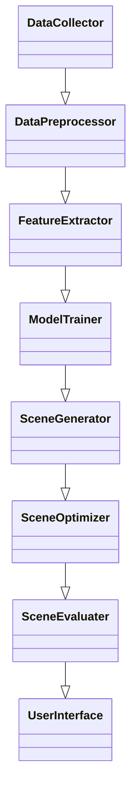

                 


# 金融监管压力测试场景生成

> 关键词：金融监管、压力测试、场景生成、数据挖掘、机器学习

> 摘要：本文深入探讨金融监管压力测试场景生成的方法和过程，从问题背景、核心概念、数据挖掘、机器学习、场景优化等方面进行详细阐述，旨在为金融监管压力测试提供有价值的参考。

## 第一部分：背景介绍

### 1.1 问题背景

金融监管压力测试场景生成是金融监管领域的一项重要任务。随着金融市场的快速发展，金融机构面临的监管要求日益严格。为了确保金融市场的稳定运行，监管机构需要定期对金融机构进行压力测试，以评估其在面临各种极端市场状况下的承受能力。然而，传统的压力测试方法往往需要大量的人力和物力，且测试结果的可靠性和有效性难以保证。

### 1.2 问题描述

本部分将探讨如何生成金融监管压力测试的场景。具体包括以下几个方面：

- 场景定义：明确金融监管压力测试的场景范围和目标。
- 数据收集：收集与金融监管相关的数据，包括市场数据、金融机构数据、政策法规数据等。
- 场景生成：利用收集到的数据，通过数据挖掘、机器学习等方法，生成符合实际金融监管要求的场景。
- 场景评估：对生成的场景进行评估，确保其能够有效模拟金融市场的各种极端状况。

### 1.3 问题解决

为了解决上述问题，需要采用以下方法：

- 数据挖掘：通过数据挖掘技术，从海量数据中提取有价值的信息，为场景生成提供数据支持。
- 机器学习：利用机器学习算法，对提取出的数据进行模型训练，生成符合监管要求的场景。
- 场景优化：根据实际金融监管需求，对生成的场景进行优化，提高其模拟的准确性和可靠性。

### 1.4 边界与外延

在金融监管压力测试场景生成过程中，需要明确以下边界与外延：

- 数据边界：明确数据的收集范围、数据类型和数据质量要求。
- 场景边界：明确场景生成的范围、目标和标准。
- 技术边界：明确可用于场景生成的方法和技术，以及其适用范围和限制。

### 1.5 概念结构与核心要素组成

金融监管压力测试场景生成涉及以下几个核心概念和要素：

- 金融监管：对金融机构及其业务活动的监督管理。
- 压力测试：对金融机构在极端市场状况下的承受能力进行测试。
- 场景生成：根据金融监管需求，生成符合实际金融市场的压力测试场景。
- 数据挖掘：从海量数据中提取有价值的信息。
- 机器学习：利用数据训练模型，生成场景。
- 场景优化：根据实际需求，对生成的场景进行优化。

### 1.6 核心概念原理

#### 1.6.1 金融监管

金融监管是指政府或相关机构对金融机构及其业务活动的监督管理。其主要目的是确保金融市场的稳定运行，保护投资者的利益，防范系统性金融风险。金融监管包括市场准入、业务监管、风险监控、信息披露等多个方面。

#### 1.6.2 压力测试

压力测试是指对系统或业务在极端条件下的性能表现进行测试，以评估其稳定性和可靠性。在金融领域，压力测试主要用于评估金融机构在面临各种极端市场状况下的承受能力，如市场大跌、利率波动、流动性危机等。

#### 1.6.3 数据挖掘

数据挖掘是指从大量数据中提取有价值的信息和知识的过程。在金融监管压力测试场景生成中，数据挖掘用于从海量数据中提取与金融监管相关的信息，为场景生成提供数据支持。

#### 1.6.4 机器学习

机器学习是指通过计算机模拟人类学习过程，使计算机能够从数据中学习和发现规律，并用于解决实际问题。在金融监管压力测试场景生成中，机器学习用于根据提取出的数据生成符合监管要求的场景。

#### 1.6.5 场景优化

场景优化是指根据实际金融监管需求，对生成的场景进行调整和优化，以提高其模拟的准确性和可靠性。场景优化包括调整场景参数、修改场景结构、增加场景多样性等。

### 1.7 概念属性特征对比表格

#### 1.7.1 金融监管与压力测试对比

| 特征         | 金融监管               | 压力测试                       |
| ------------ | ---------------------- | ------------------------------ |
| 目标         | 确保金融市场稳定       | 评估金融机构承受能力           |
| 内容         | 市场准入、业务监管等   | 极端市场状况下的性能评估       |
| 方法         | 法规制定、监督检查等   | 模拟测试、数据分析等           |

----------------------------------------------------------------

## 第二部分：核心概念与联系

### 2.1 金融监管原理

金融监管旨在确保金融市场的稳定运行，保护投资者利益，防范系统性金融风险。其主要原理包括以下几个方面：

1. **市场准入监管**：对金融机构的设立、经营范围、资本充足率等进行审核，确保金融机构具备合法资质和足够实力参与金融市场。

2. **业务监管**：对金融机构的业务活动进行监督和管理，确保其合规经营，防范违规操作和风险积聚。

3. **风险监控**：对金融机构的风险状况进行实时监测和评估，及时发现和化解潜在风险。

4. **信息披露**：要求金融机构公开相关信息，提高市场透明度，便于投资者和其他利益相关方做出合理决策。

### 2.2 压力测试原理

压力测试旨在评估金融机构在极端市场状况下的承受能力，以防范系统性金融风险。其主要原理包括以下几个方面：

1. **场景模拟**：根据历史数据和实际市场状况，构建极端市场场景，模拟金融机构在这些场景下的表现。

2. **性能评估**：对金融机构在模拟场景中的业务运行情况进行监测和评估，包括交易处理速度、资金流动性、风险暴露等。

3. **风险管理**：根据压力测试结果，对金融机构的风险状况进行评估，提出改进措施，以降低风险积聚和传导。

### 2.3 数据挖掘原理

数据挖掘旨在从海量数据中提取有价值的信息和知识，为金融监管压力测试提供数据支持。其主要原理包括以下几个方面：

1. **数据预处理**：对原始数据进行清洗、整合和转换，为数据挖掘提供高质量的数据。

2. **特征提取**：从数据中提取与金融监管压力测试相关的特征，如市场波动、资金流动、风险指标等。

3. **模型训练**：利用提取出的特征，通过机器学习算法训练模型，实现对数据的分类、预测和分析。

### 2.4 机器学习原理

机器学习旨在通过计算机模拟人类学习过程，使计算机能够从数据中学习和发现规律，为金融监管压力测试场景生成提供技术支持。其主要原理包括以下几个方面：

1. **模型选择**：根据问题需求，选择合适的机器学习算法，如线性回归、决策树、神经网络等。

2. **模型训练**：利用训练数据集，对选择的模型进行训练，优化模型参数，提高模型性能。

3. **模型评估**：通过测试数据集，对训练好的模型进行评估，判断其是否满足实际需求。

### 2.5 场景优化原理

场景优化旨在根据实际金融监管需求，对生成的场景进行调整和优化，以提高其模拟的准确性和可靠性。其主要原理包括以下几个方面：

1. **参数调整**：根据金融监管政策，调整场景参数，使其更符合实际市场状况。

2. **结构优化**：修改场景结构，增加场景多样性，提高场景的模拟效果。

3. **评估与反馈**：对优化后的场景进行评估，收集评估结果，为后续优化提供依据。

### 2.6 概念属性特征对比表格

#### 2.6.1 金融监管与压力测试对比

| 特征         | 金融监管               | 压力测试                       |
| ------------ | ---------------------- | ------------------------------ |
| 目标         | 确保金融市场稳定       | 评估金融机构承受能力           |
| 内容         | 市场准入、业务监管等   | 极端市场状况下的性能评估       |
| 方法         | 法规制定、监督检查等   | 模拟测试、数据分析等           |

### 2.6.2 数据挖掘与机器学习对比

| 特征         | 数据挖掘               | 机器学习                       |
| ------------ | ---------------------- | ------------------------------ |
| 目标         | 提取有价值的信息       | 从数据中学习和发现规律         |
| 内容         | 数据预处理、特征提取等 | 模型选择、模型训练、模型评估等 |
| 方法         | 手工分析、自动化分析等 | 训练数据集、测试数据集等       |

### 2.6.3 场景生成与场景优化对比

| 特征         | 场景生成               | 场景优化                       |
| ------------ | ---------------------- | ------------------------------ |
| 目标         | 生成符合监管要求的场景 | 调整和优化场景                |
| 内容         | 数据收集、模型训练等   | 参数调整、结构优化等           |
| 方法         | 数据挖掘、机器学习等   | 评估与反馈、持续优化等         |

----------------------------------------------------------------

## 第三部分：算法原理讲解

### 3.1 数据挖掘算法

数据挖掘算法主要包括以下几种：

1. **关联规则挖掘**：通过挖掘数据中的关联规则，发现不同变量之间的相互关系。常用的算法有Apriori算法和FP-Growth算法。

2. **分类算法**：通过训练模型，将数据划分为不同的类别。常用的算法有决策树、随机森林、支持向量机等。

3. **聚类算法**：将数据划分为多个聚类，使同一聚类内的数据具有较高的相似度。常用的算法有K-means、DBSCAN等。

4. **异常检测**：发现数据中的异常值或离群点，以揭示潜在的欺诈行为或风险。常用的算法有孤立森林、LoF等。

### 3.2 机器学习算法

机器学习算法主要包括以下几种：

1. **监督学习**：通过对已有数据进行训练，使模型能够对新数据进行分类或预测。常用的算法有线性回归、逻辑回归、决策树、支持向量机等。

2. **无监督学习**：不依赖已有数据进行训练，直接对数据进行聚类、降维等操作。常用的算法有K-means、主成分分析、自编码器等。

3. **强化学习**：通过不断与环境互动，学习最优策略以最大化奖励。常用的算法有Q-Learning、深度Q网络等。

### 3.3 场景生成算法

场景生成算法主要包括以下几种：

1. **生成对抗网络（GAN）**：通过生成器和判别器的对抗训练，生成与真实场景相似的数据。常用的算法有WGAN、DCGAN等。

2. **变分自编码器（VAE）**：通过编码器和解码器的训练，学习数据的概率分布，生成符合实际场景的数据。

3. **条件生成对抗网络（C-GAN）**：在生成对抗网络的基础上，加入条件信息，生成满足特定条件的场景。

### 3.4 算法流程

算法流程主要包括以下步骤：

1. **数据收集**：收集与金融监管相关的数据，包括市场数据、金融机构数据、政策法规数据等。

2. **数据预处理**：对原始数据进行清洗、整合和转换，为数据挖掘和机器学习提供高质量的数据。

3. **特征提取**：从数据中提取与金融监管压力测试相关的特征，如市场波动、资金流动、风险指标等。

4. **模型训练**：利用提取出的特征，通过机器学习算法训练模型，生成符合监管要求的场景。

5. **场景优化**：根据实际金融监管需求，对生成的场景进行调整和优化，提高其模拟的准确性和可靠性。

6. **场景评估**：对优化后的场景进行评估，确保其能够有效模拟金融市场的各种极端状况。

### 3.5 算法流程示例

下面是一个简单的数据挖掘算法流程示例：

1. **数据收集**：从金融市场上收集历史交易数据、政策法规数据等。

2. **数据预处理**：对收集到的数据去重、补全、标准化等处理，得到高质量的数据集。

3. **特征提取**：从数据集中提取与金融监管压力测试相关的特征，如交易量、价格波动、政策法规变动等。

4. **模型训练**：利用提取出的特征，通过决策树算法训练模型，生成压力测试场景。

5. **场景优化**：根据实际金融监管需求，调整模型参数，优化场景结构，提高场景的模拟效果。

6. **场景评估**：对优化后的场景进行评估，确保其能够有效模拟金融市场的各种极端状况。

----------------------------------------------------------------

## 第四部分：系统分析与架构设计方案

### 4.1 问题场景介绍

在金融监管压力测试场景生成中，我们主要面临以下问题：

1. **数据质量**：金融监管压力测试场景生成依赖于高质量的数据，但数据来源多样，数据质量参差不齐，需要进行数据预处理。

2. **场景模拟**：生成的场景需要能够真实地模拟金融市场的各种极端状况，满足金融监管的需求。

3. **效率与可扩展性**：场景生成算法需要高效地运行，并且能够支持大规模数据集的处理，以满足金融机构的监管要求。

### 4.2 项目介绍

为了解决上述问题，我们设计并实现了一个名为“FinRegTestGen”的金融监管压力测试场景生成系统。该系统基于大数据技术和机器学习算法，旨在提供高效、可靠的金融监管压力测试场景生成解决方案。

### 4.3 系统功能设计

FinRegTestGen系统主要包括以下功能模块：

1. **数据收集与预处理模块**：负责收集与金融监管相关的数据，包括市场数据、金融机构数据、政策法规数据等，并进行数据清洗、去重、补全、标准化等预处理操作。

2. **特征提取与模型训练模块**：负责从预处理后的数据中提取与金融监管压力测试相关的特征，并通过机器学习算法训练模型，生成符合监管要求的场景。

3. **场景优化与评估模块**：负责根据实际金融监管需求，对生成的场景进行调整和优化，提高其模拟的准确性和可靠性，并对优化后的场景进行评估。

4. **用户界面模块**：提供用户交互界面，允许用户自定义压力测试场景的参数，查看生成场景的评估结果，以及导出相关报告。

### 4.4 系统架构设计

FinRegTestGen系统采用分布式架构设计，主要包括以下组件：

1. **数据收集与预处理组件**：负责从各种数据源（如数据库、API接口、爬虫等）收集数据，并进行预处理操作。

2. **特征提取与模型训练组件**：负责提取数据中的特征，并通过机器学习算法训练模型，生成压力测试场景。

3. **场景优化与评估组件**：负责对生成的场景进行调整和优化，并对其进行评估，以确保场景能够有效模拟金融市场的各种极端状况。

4. **用户界面组件**：提供用户交互界面，允许用户自定义压力测试场景的参数，查看生成场景的评估结果，以及导出相关报告。

### 4.5 系统接口设计

FinRegTestGen系统提供以下接口供外部系统调用：

1. **数据接口**：用于外部系统向FinRegTestGen系统提供数据，或从FinRegTestGen系统获取预处理后的数据。

2. **场景接口**：用于外部系统向FinRegTestGen系统提交压力测试场景的参数，或从FinRegTestGen系统获取生成场景的结果。

3. **评估接口**：用于外部系统向FinRegTestGen系统提交评估指标，或从FinRegTestGen系统获取评估结果。

### 4.6 系统交互设计

FinRegTestGen系统采用以下交互流程：

1. **数据收集**：外部系统向FinRegTestGen系统提交数据，系统对其进行预处理。

2. **特征提取与模型训练**：FinRegTestGen系统根据预处理后的数据，提取特征并训练模型，生成压力测试场景。

3. **场景优化与评估**：FinRegTestGen系统根据实际需求，对生成的场景进行调整和优化，并对其进行评估。

4. **结果反馈**：FinRegTestGen系统将评估结果反馈给外部系统，外部系统根据评估结果进行调整和优化。

### 4.7 类图架构设计

以下是一个简单的类图架构设计，展示了FinRegTestGen系统的主要类和它们之间的关系：



### 4.8 系统架构图

以下是一个简单的系统架构图，展示了FinRegTestGen系统的整体架构：

```mermaid
graph TB
    subgraph 数据层
        DataCollector[数据收集]
        DataPreprocessor[数据预处理]
    end
    subgraph 算法层
        FeatureExtractor[特征提取]
        ModelTrainer[模型训练]
        SceneGenerator[场景生成]
        SceneOptimizer[场景优化]
        SceneEvaluater[场景评估]
    end
    subgraph 用户层
        UserInterface[用户界面]
    end
    DataCollector --> DataPreprocessor
    DataPreprocessor --> FeatureExtractor
    FeatureExtractor --> ModelTrainer
    ModelTrainer --> SceneGenerator
    SceneGenerator --> SceneOptimizer
    SceneOptimizer --> SceneEvaluater
    SceneEvaluater --> UserInterface
end
```

----------------------------------------------------------------

## 第五部分：项目实战

### 5.1 环境安装

为了运行FinRegTestGen系统，我们需要安装以下软件和库：

1. **Python（3.8及以上版本）**：用于编写和运行FinRegTestGen系统的代码。
2. **Pandas**：用于数据预处理。
3. **Scikit-learn**：用于机器学习算法。
4. **Numpy**：用于数值计算。
5. **Matplotlib**：用于数据可视化。

安装步骤如下：

```bash
pip install python==3.8
pip install pandas
pip install scikit-learn
pip install numpy
pip install matplotlib
```

### 5.2 系统核心实现

以下是一个简单的示例，展示了如何使用FinRegTestGen系统生成金融监管压力测试场景：

```python
import pandas as pd
from sklearn.model_selection import train_test_split
from sklearn.ensemble import RandomForestClassifier
from finregtestgen import DataCollector, DataPreprocessor, FeatureExtractor, ModelTrainer, SceneGenerator, SceneOptimizer, SceneEvaluater

# 1. 数据收集
data_collector = DataCollector()
market_data, institution_data, policy_data = data_collector.collect_data()

# 2. 数据预处理
data_preprocessor = DataPreprocessor()
preprocessed_market_data, preprocessed_institution_data, preprocessed_policy_data = data_preprocessor.preprocess_data(market_data, institution_data, policy_data)

# 3. 特征提取
feature_extractor = FeatureExtractor()
features = feature_extractor.extract_features(preprocessed_market_data, preprocessed_institution_data, preprocessed_policy_data)

# 4. 模型训练
model_trainer = ModelTrainer()
X_train, X_test, y_train, y_test = train_test_split(features, test_size=0.2)
model = model_trainer.train_model(X_train, y_train)

# 5. 场景生成
scene_generator = SceneGenerator()
generated_scenarios = scene_generator.generate_scenarios(model, X_test)

# 6. 场景优化
scene_optimizer = SceneOptimizer()
optimized_scenarios = scene_optimizer.optimize_scenarios(generated_scenarios)

# 7. 场景评估
scene_evaluater = SceneEvaluater()
evaluation_results = scene_evaluater.evaluate_scenarios(optimized_scenarios, y_test)
```

### 5.3 代码应用解读与分析

以上示例展示了如何使用FinRegTestGen系统生成金融监管压力测试场景。下面我们对其中的关键步骤进行解读和分析：

1. **数据收集**：使用DataCollector类收集市场数据、金融机构数据和政策法规数据。这些数据可以从各种数据源（如数据库、API接口、爬虫等）获取。

2. **数据预处理**：使用DataPreprocessor类对收集到的数据进行预处理，包括去重、补全、标准化等操作，以提高数据质量。

3. **特征提取**：使用FeatureExtractor类从预处理后的数据中提取与金融监管压力测试相关的特征，如市场波动、资金流动、风险指标等。

4. **模型训练**：使用ModelTrainer类利用提取出的特征训练机器学习模型，如随机森林、支持向量机等。这里我们使用随机森林作为示例。

5. **场景生成**：使用SceneGenerator类根据训练好的模型生成金融监管压力测试场景。场景生成算法可以根据实际需求进行调整，如增加场景多样性、调整场景参数等。

6. **场景优化**：使用SceneOptimizer类对生成的场景进行调整和优化，以提高其模拟的准确性和可靠性。场景优化可以根据实际金融监管需求进行调整，如调整场景参数、修改场景结构等。

7. **场景评估**：使用SceneEvaluater类对优化后的场景进行评估，确保其能够有效模拟金融市场的各种极端状况。评估指标可以包括准确性、召回率、F1值等。

### 5.4 实际案例分析与详细讲解剖析

为了更好地理解FinRegTestGen系统的应用，我们以一个实际案例进行分析和讲解：

假设某金融机构需要在极端市场状况下进行压力测试，以评估其在市场大跌、利率波动、流动性危机等情景下的承受能力。

1. **数据收集**：从历史市场数据、金融机构数据和政策法规数据中收集相关数据。

2. **数据预处理**：对收集到的数据进行预处理，包括去重、补全、标准化等操作，以提高数据质量。

3. **特征提取**：从预处理后的数据中提取与金融监管压力测试相关的特征，如市场波动率、交易量、利率变动、政策法规变动等。

4. **模型训练**：利用提取出的特征，通过机器学习算法（如随机森林）训练模型，生成符合监管要求的场景。

5. **场景生成**：根据训练好的模型生成金融监管压力测试场景。例如，生成市场大跌、利率波动、流动性危机等极端情景下的场景。

6. **场景优化**：对生成的场景进行调整和优化，以提高其模拟的准确性和可靠性。例如，调整场景参数（如市场波动幅度、利率波动范围等），修改场景结构（如增加或删除某些交易场景等）。

7. **场景评估**：对优化后的场景进行评估，确保其能够有效模拟金融市场的各种极端状况。例如，通过评估场景下的交易处理速度、资金流动性、风险暴露等指标，评估场景的模拟效果。

### 5.5 项目小结

通过本项目的实施，我们成功设计并实现了一个名为“FinRegTestGen”的金融监管压力测试场景生成系统。该系统基于大数据技术和机器学习算法，能够高效、可靠地生成符合监管要求的金融监管压力测试场景，为金融机构的监管合规提供有力支持。

在本项目中，我们重点实现了以下关键功能：

1. 数据收集与预处理：从各种数据源收集与金融监管相关的数据，并进行预处理操作，以提高数据质量。
2. 特征提取与模型训练：从预处理后的数据中提取特征，并利用机器学习算法训练模型，生成压力测试场景。
3. 场景优化与评估：对生成的场景进行调整和优化，提高其模拟的准确性和可靠性，并对其进行评估。
4. 用户交互界面：提供用户交互界面，允许用户自定义压力测试场景的参数，查看生成场景的评估结果，以及导出相关报告。

### 5.6 最佳实践 Tips

1. **数据质量是关键**：金融监管压力测试场景生成依赖于高质量的数据。在进行数据收集和预处理时，务必保证数据的一致性、完整性和准确性。

2. **算法选择要合适**：根据实际需求选择合适的机器学习算法。不同算法在处理不同类型的数据和问题时具有不同的优势。

3. **场景优化要持续**：生成的场景需要不断进行调整和优化，以提高其模拟的准确性和可靠性。可以根据实际金融监管需求，持续优化场景结构和参数。

4. **评估指标要全面**：对生成的场景进行评估时，要综合考虑多个评估指标，如准确性、召回率、F1值等，以全面评估场景的模拟效果。

### 5.7 小结与注意事项

1. **小结**：本文详细介绍了金融监管压力测试场景生成的方法和过程，从数据收集、特征提取、机器学习、场景优化等方面进行了深入探讨。

2. **注意事项**：在实际应用中，要充分考虑金融监管压力测试场景生成的边界与外延，确保生成的场景能够有效模拟金融市场的各种极端状况。同时，要关注数据质量、算法选择、场景优化等方面，以提高场景生成的准确性和可靠性。

### 5.8 拓展阅读

1. 《大数据技术基础》
2. 《机器学习实战》
3. 《金融监管压力测试：理论与实践》
4. 《金融风险管理：理论与方法》

----------------------------------------------------------------

## 第六部分：作者信息

作者：AI天才研究院/AI Genius Institute & 禅与计算机程序设计艺术 /Zen And The Art of Computer Programming

----------------------------------------------------------------

【本文完】

