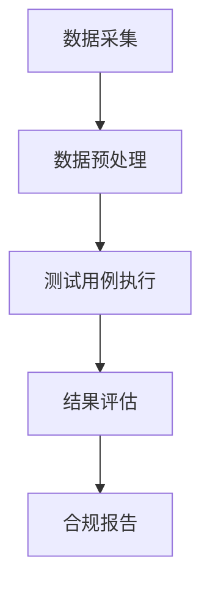
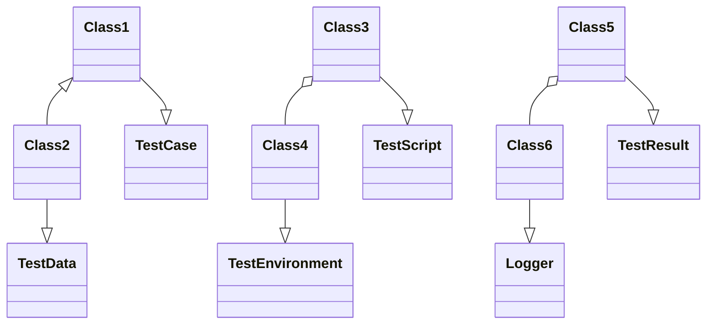
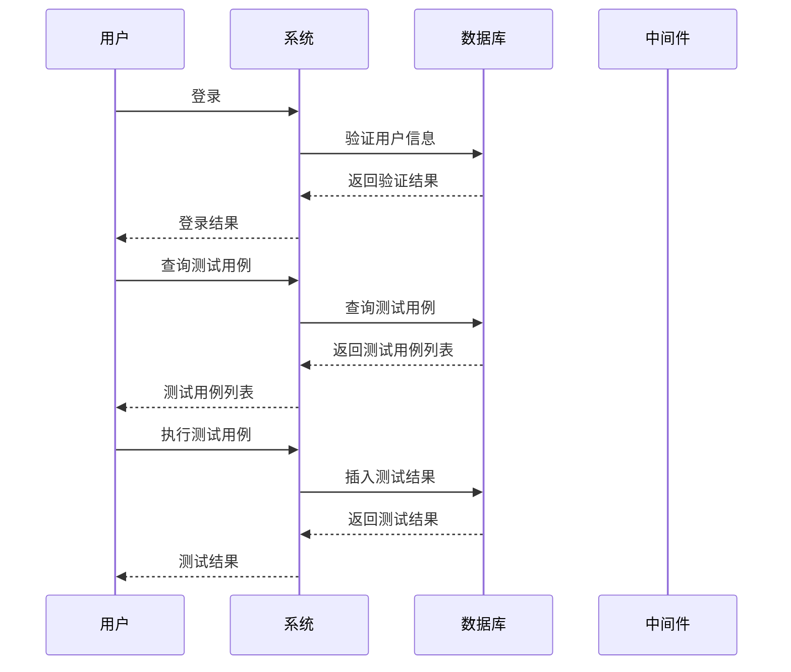
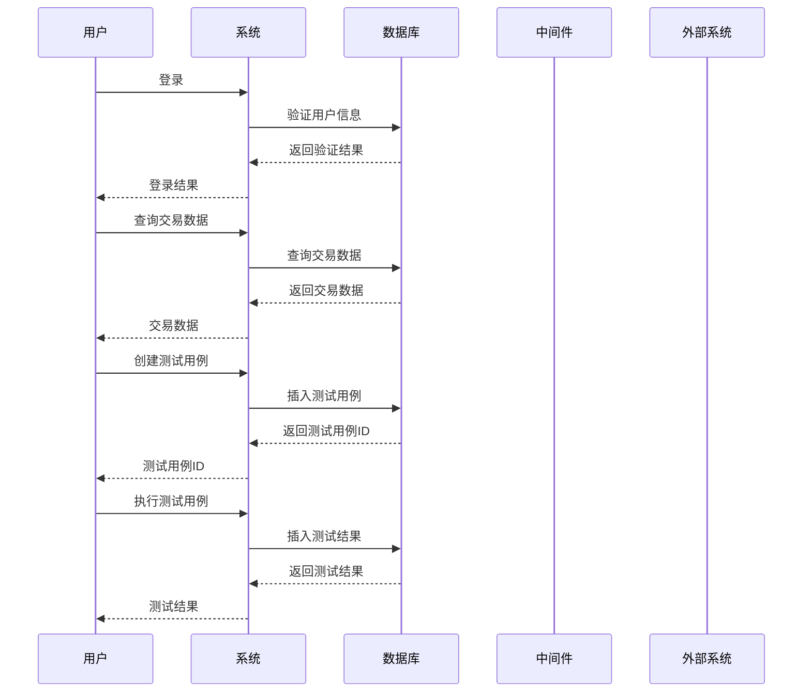

                 

### 《金融监管合规自动化测试平台》

#### 关键词：金融监管、合规自动化测试、平台设计、算法原理、项目实战

#### 摘要：
本文深入探讨了金融监管合规自动化测试平台的设计与应用。首先，我们从金融监管与合规的基本概念入手，分析金融行业所面临的监管挑战。接着，我们详细介绍了合规自动化测试的核心概念与优势，并通过对比表格和ER实体关系图，探讨了金融合规自动化测试的属性特征。随后，我们讲解了合规测试算法的原理，以及数学模型和公式的应用，并通过具体举例说明了算法的实际应用。在此基础上，文章进一步讨论了系统的功能设计、架构设计和接口设计，并分享了项目实战中的环境安装、核心实现以及案例分析。最终，我们总结了项目的优化方向，并提出了拓展阅读的建议。

### 第一部分：背景介绍

#### 第1章：金融监管与合规概述

#### 1.1.1 金融监管的概念与作用

金融监管是指通过法律法规和行政手段，对金融机构、金融市场和金融活动进行监督和管理的行为。金融监管的主要目的是维护金融市场的稳定，保护投资者权益，防范金融风险，促进金融业健康发展。

金融监管的主要作用包括：

1. **确保金融体系的稳定性**：通过监管，可以及时发现并处理金融机构的风险问题，防止金融体系的崩溃。
2. **保护投资者权益**：监管制度确保了投资者在金融交易中的合法权益，防止了欺诈、内幕交易等违法行为的出现。
3. **促进金融创新**：合理的监管制度可以鼓励金融机构进行创新，推动金融市场的繁荣发展。
4. **维护金融市场的公平、公正**：监管机构通过制定规则，确保金融市场的竞争环境公平，打击不公平交易，维护市场的公正性。

#### 1.1.2 合规的定义与重要性

合规是指金融机构和金融从业人员遵守相关法律法规、监管规定和内部管理政策的行为。合规是金融行业的基础，其重要性体现在以下几个方面：

1. **防范风险**：合规可以帮助金融机构识别潜在的风险，制定相应的风险管理策略，确保业务的合法性和安全性。
2. **提升声誉**：良好的合规记录可以提高金融机构的市场声誉，吸引更多的投资者和合作伙伴。
3. **增强竞争力**：合规可以促进金融机构规范运营，提高服务质量和效率，增强市场竞争力。
4. **满足监管要求**：合规是金融机构必须满足的监管要求，是进入市场的基本门槛。

#### 1.1.3 金融行业面临的监管挑战与机遇

金融行业的快速发展带来了诸多监管挑战，同时也带来了新的机遇。

1. **技术变革**：随着金融科技的快速发展，金融机构面临着新技术带来的合规挑战，如区块链、人工智能等。
2. **全球化**：金融行业的全球化趋势加剧了监管的复杂性，跨国业务的合规要求更高。
3. **合规成本**：随着监管要求的增加，金融机构的合规成本也在不断上升。
4. **机遇**：监管创新也为金融机构提供了新的发展机遇，如监管沙箱、数字货币等。

### 第2章：金融合规问题的背景与现状

#### 2.1.1 金融行业合规问题的演变

金融合规问题的发展历程可以分为以下几个阶段：

1. **传统监管阶段**：早期的金融合规主要集中在金融机构的合法性、透明性和风险管理上。
2. **金融科技阶段**：随着金融科技的兴起，合规问题变得更加复杂，包括数据保护、网络安全、交易透明度等。
3. **全球化阶段**：全球化带来了更多的合规挑战，如跨国业务的法律适用性、监管合作等。
4. **数字货币阶段**：数字货币和区块链技术的发展带来了新的合规问题，如反洗钱、消费者权益保护等。

#### 2.1.2 当前金融合规问题的现状分析

当前金融合规问题的现状表现为：

1. **监管趋严**：各国监管机构对金融合规的要求越来越严格，监管措施不断升级。
2. **合规成本上升**：金融机构需要投入大量资源来满足合规要求，包括人力、技术和资金等。
3. **合规创新**：金融机构在合规领域进行技术创新，如使用人工智能、大数据等技术提高合规效率和准确性。
4. **监管合作**：各国监管机构之间的合作不断加强，以应对全球金融合规挑战。

#### 2.1.3 合规问题对金融机构的影响

合规问题对金融机构的影响主要包括：

1. **运营成本**：合规要求增加了金融机构的运营成本，包括合规咨询、审计、培训等。
2. **业务发展**：合规问题可能会影响金融机构的业务发展，如合规限制可能会阻碍某些业务创新。
3. **声誉风险**：合规问题可能会损害金融机构的声誉，影响市场信心。
4. **法律风险**：合规问题可能导致金融机构面临法律风险，甚至面临巨额罚款。

### 第3章：金融合规自动化测试的概念与意义

#### 3.1.1 什么是合规自动化测试

合规自动化测试是一种通过自动化工具和算法，对金融机构的合规状况进行监测、评估和验证的过程。它旨在提高合规工作效率，减少人为错误，确保合规要求得到有效执行。

#### 3.1.2 合规自动化测试的优势

合规自动化测试具有以下优势：

1. **提高效率**：自动化测试可以快速、准确地执行大量测试任务，提高合规工作的工作效率。
2. **减少错误**：自动化测试可以减少人为错误，提高测试的准确性和一致性。
3. **成本节约**：自动化测试可以减少对人工的依赖，降低合规工作的成本。
4. **合规性保障**：自动化测试可以确保合规要求得到有效执行，降低合规风险。
5. **持续监测**：自动化测试可以持续监测合规状况，及时发现并处理合规问题。

#### 3.1.3 金融合规自动化测试的应用场景

金融合规自动化测试的应用场景包括：

1. **交易合规性验证**：对交易过程进行自动化监测，确保交易符合相关法规和合规要求。
2. **客户身份识别**：自动化验证客户身份，确保客户信息真实、准确。
3. **反洗钱监控**：自动化监测交易行为，识别可疑交易，防范洗钱风险。
4. **数据合规性检查**：自动化检查数据存储和处理过程，确保数据合规性。
5. **合规报告生成**：自动化生成合规报告，简化合规工作的报告流程。

### 第二部分：核心概念与联系

#### 第4章：金融合规自动化测试的核心概念

#### 4.1.1 自动化测试的原理

自动化测试是通过编写测试脚本和程序，自动化执行测试用例，验证系统功能是否符合预期的过程。其原理主要包括：

1. **测试脚本编写**：编写测试脚本，定义测试步骤和预期结果。
2. **自动化执行**：通过自动化工具执行测试脚本，模拟用户操作，验证系统功能。
3. **结果验证**：对比测试实际结果与预期结果，判断系统功能是否符合要求。

#### 4.1.2 合规测试的要素

合规测试的要素包括：

1. **合规要求**：明确合规测试的目标和标准，确保测试内容符合相关法规和合规要求。
2. **测试数据**：提供用于测试的数据，确保测试数据的真实性和代表性。
3. **测试工具**：选择合适的自动化测试工具，确保测试过程的效率和质量。
4. **测试脚本**：编写测试脚本，定义测试步骤和逻辑。
5. **测试环境**：搭建测试环境，确保测试过程的可重复性和一致性。

#### 4.1.3 自动化测试工具的选择

在选择自动化测试工具时，需要考虑以下因素：

1. **支持性**：测试工具是否支持金融机构的业务系统和测试需求。
2. **功能丰富性**：测试工具的功能是否丰富，是否能够满足合规测试的需求。
3. **易用性**：测试工具的界面是否友好，是否易于学习和使用。
4. **可维护性**：测试工具的代码是否可维护，是否易于更新和扩展。
5. **性能**：测试工具的性能是否高效，是否能够满足大规模测试的需求。

### 第5章：金融合规自动化测试的属性特征对比表格

#### 5.1.1 常见自动化测试工具对比

| 工具名称 | 支持性 | 功能丰富性 | 易用性 | 可维护性 | 性能 |
| --- | --- | --- | --- | --- | --- |
| Selenium | 高 | 高 | 一般 | 高 | 一般 |
| Appium | 高 | 高 | 一般 | 高 | 一般 |
| JMeter | 一般 | 高 | 一般 | 一般 | 高 |
| Postman | 高 | 中 | 高 | 高 | 一般 |

#### 5.1.2 金融合规自动化测试工具的优劣分析

在金融合规自动化测试中，不同测试工具的优劣表现如下：

1. **Selenium**：适用于Web应用的自动化测试，支持多种浏览器，功能丰富，易用性一般，但可维护性较高。
2. **Appium**：适用于移动应用的自动化测试，支持多种操作系统和设备，功能丰富，易用性一般，但可维护性较高。
3. **JMeter**：适用于性能测试，支持多种协议，功能丰富，但易用性一般，可维护性一般。
4. **Postman**：适用于API测试，功能丰富，易用性高，但支持性一般，可维护性较高。

### 第6章：金融合规自动化测试的ER实体关系图架构

#### 6.1.1 实体关系图的定义

实体关系图（Entity-Relationship Diagram，简称ER图）是数据库设计的一种工具，用于表示实体之间的关系。在金融合规自动化测试中，ER图可以用于表示测试涉及的各类实体及其关系。

#### 6.1.2 金融合规自动化测试的实体与关系

在金融合规自动化测试中，常见的实体包括：

1. **测试用例**：表示具体的测试任务，包括测试步骤、预期结果等。
2. **测试数据**：表示用于测试的数据，包括数据源、数据格式等。
3. **测试脚本**：表示执行测试用例的自动化脚本。
4. **测试环境**：表示测试所需的环境配置，包括操作系统、数据库、浏览器等。
5. **测试结果**：表示测试执行后的结果，包括通过/失败、错误信息等。

实体之间的关系包括：

1. **关联关系**：测试用例和测试数据之间存在关联关系，测试用例需要使用测试数据。
2. **执行关系**：测试脚本和测试用例之间存在执行关系，测试脚本执行测试用例。
3. **配置关系**：测试脚本和测试环境之间存在配置关系，测试脚本需要根据测试环境进行配置。
4. **反馈关系**：测试结果和测试用例之间存在反馈关系，测试结果用于评估测试用例的执行情况。

#### 6.1.3 ER实体关系图在测试中的应用

在金融合规自动化测试中，ER实体关系图可以用于以下方面：

1. **需求分析**：通过ER图可以直观地了解测试涉及的实体及其关系，有助于明确测试需求。
2. **系统设计**：通过ER图可以设计测试系统的架构，包括实体之间的关系和交互流程。
3. **测试用例编写**：通过ER图可以明确测试用例的关联关系，确保测试用例的完整性和准确性。
4. **测试执行**：通过ER图可以了解测试执行的流程和顺序，确保测试执行的顺利进行。
5. **测试评估**：通过ER图可以评估测试结果的准确性和完整性，及时发现和解决测试问题。

### 第三部分：算法原理讲解

#### 第7章：合规测试算法原理

#### 7.1.1 合规测试算法概述

合规测试算法是用于实现合规测试的核心算法，它通过分析数据、执行测试用例，评估金融机构的合规状况。合规测试算法通常包括以下几个步骤：

1. **数据采集**：从各种数据源采集与合规相关的数据，如交易记录、客户信息等。
2. **预处理**：对采集到的数据进行清洗、转换和标准化，确保数据的质量和一致性。
3. **测试用例执行**：根据预定义的测试用例，对预处理后的数据进行测试，验证其是否符合合规要求。
4. **结果评估**：对比测试结果与预期结果，评估金融机构的合规状况，生成合规报告。

#### 7.1.2 常见合规测试算法介绍

常见的合规测试算法包括：

1. **规则引擎算法**：通过预定义的合规规则，对数据进行匹配和判断，判断其是否符合合规要求。
2. **机器学习算法**：通过训练模型，对数据进行分类和预测，评估其合规性。
3. **数据挖掘算法**：通过分析数据，挖掘潜在的风险和异常，评估其合规性。
4. **统计分析算法**：通过统计分析，评估数据的分布、趋势和异常，判断其合规性。

#### 7.1.3 合规测试算法的mermaid流程图

以下是一个简单的合规测试算法mermaid流程图示例：



### 第8章：算法原理的数学模型和公式

#### 8.1.1 数学模型概述

在合规测试中，数学模型用于描述数据关系、算法逻辑和测试结果。常见的数学模型包括：

1. **概率模型**：用于描述数据的不确定性，如概率分布、条件概率等。
2. **决策模型**：用于描述决策过程，如决策树、贝叶斯网络等。
3. **优化模型**：用于优化资源分配、流程安排等，如线性规划、动态规划等。

#### 8.1.2 常见合规测试算法的数学公式

常见的合规测试算法的数学公式包括：

1. **规则引擎算法**：
   - 匹配度计算：$$\text{match\_score} = \sum_{i=1}^{n} \text{weight}_i \times \text{match}_i$$
   - 决策函数：$$\text{decision} = \text{threshold} \times \text{match\_score}$$

2. **机器学习算法**：
   - 决策边界：$$f(x) = \text{sign}(\text{w} \cdot \text{x} + \text{b})$$
   - 代价函数：$$J(\theta) = \frac{1}{2m} \sum_{i=1}^{m} (\text{h}_{\theta}(\text{x}_i) - \text{y}_i)^2$$

3. **数据挖掘算法**：
   - 聚类算法：$$\text{distance}(\text{p}, \text{c}) = \sqrt{\sum_{i=1}^{n} (\text{p}_i - \text{c}_i)^2}$$
   - 分割算法：$$\text{Gini}(\text{S}) = 1 - \sum_{i=1}^{n} \frac{1}{n} \times \sum_{j=1}^{k} |S_j|^2$$

#### 8.1.3 数学模型的应用与讲解

以下是数学模型在合规测试中的应用和讲解：

1. **规则引擎算法**：规则引擎算法通过预定义的合规规则，对数据进行匹配和判断。匹配度计算公式用于计算数据与规则之间的相似度，决策函数用于判断数据是否满足合规要求。

2. **机器学习算法**：机器学习算法通过训练模型，对数据进行分类和预测。决策边界公式描述了数据分类的边界，代价函数用于评估模型性能，指导模型调整。

3. **数据挖掘算法**：数据挖掘算法通过分析数据，挖掘潜在的风险和异常。聚类算法用于将相似数据分组，分割算法用于划分数据集，评估不同分割方式的优劣。

### 第9章：算法原理的举例说明

#### 9.1.1 举例说明的目的

举例说明的目的是通过具体的例子，阐述合规测试算法的原理和应用。通过实际案例，读者可以更好地理解算法的实现过程和实际效果。

#### 9.1.2 常见合规测试算法举例

以下是常见合规测试算法的举例：

1. **规则引擎算法**：

   **案例**：某金融机构的合规规则要求，信用卡交易金额不得超过10,000元。

   **公式**：$$\text{match\_score} = 10,000 \times \text{weight}_1 + 10,000 \times \text{weight}_2$$

   **解释**：假设两个规则权重相等，则数据与规则之间的匹配度计算为20,000。若匹配度大于决策阈值，则判断数据符合合规要求。

2. **机器学习算法**：

   **案例**：使用决策树算法判断某交易是否涉嫌洗钱。

   **公式**：$$f(x) = \text{sign}(\text{w} \cdot \text{x} + \text{b})$$

   **解释**：决策树通过训练数据集，构建分类模型。测试数据通过模型计算，得到预测结果。若预测结果为正类，则判断交易涉嫌洗钱。

3. **数据挖掘算法**：

   **案例**：使用聚类算法分析某金融机构的交易数据，识别潜在风险。

   **公式**：$$\text{distance}(\text{p}, \text{c}) = \sqrt{\sum_{i=1}^{n} (\text{p}_i - \text{c}_i)^2}$$

   **解释**：聚类算法将交易数据划分为多个簇。计算每个交易数据与聚类中心的距离，用于评估聚类效果。

#### 9.1.3 举例说明中的公式应用与讲解

以下是举例说明中的公式应用和讲解：

1. **规则引擎算法**：

   **应用**：匹配度计算公式用于计算交易金额与合规规则的相似度。

   **讲解**：匹配度越高，表示交易金额越接近合规要求。通过设定决策阈值，判断交易是否符合合规要求。

2. **机器学习算法**：

   **应用**：决策树模型用于判断交易是否涉嫌洗钱。

   **讲解**：决策树通过训练数据集，学习数据特征，构建分类模型。测试数据通过模型计算，得到预测结果，用于评估交易的合规性。

3. **数据挖掘算法**：

   **应用**：聚类算法用于分析交易数据，识别潜在风险。

   **讲解**：聚类算法将交易数据划分为多个簇，用于发现数据中的潜在模式和异常。

### 第四部分：系统分析与架构设计

#### 第10章：系统功能设计

#### 10.1.1 系统功能概述

金融合规自动化测试平台的功能主要包括：

1. **测试用例管理**：创建、编辑和执行测试用例，管理测试用例的版本和状态。
2. **测试数据管理**：导入、导出和清洗测试数据，确保测试数据的真实性和一致性。
3. **测试脚本管理**：编写、调试和运行测试脚本，管理测试脚本的版本和依赖。
4. **测试环境管理**：配置和管理测试环境，包括操作系统、数据库、浏览器等。
5. **测试结果分析**：收集、分析和展示测试结果，生成合规报告。
6. **日志和监控**：记录系统日志，监控系统运行状态，及时发现和处理异常。

#### 10.1.2 领域模型mermaid类图

以下是一个简单的金融合规自动化测试平台的领域模型mermaid类图示例：



### 第11章：系统架构设计

#### 11.1.1 系统架构概述

金融合规自动化测试平台的系统架构包括以下几个方面：

1. **前端**：用于展示系统功能和界面，与用户进行交互。
2. **后端**：用于处理业务逻辑、数据存储和系统管理。
3. **数据库**：用于存储测试数据、测试脚本、测试结果等。
4. **中间件**：用于实现系统的中间件功能，如消息队列、缓存等。
5. **外部系统**：与金融机构的其他系统进行数据交互，如交易系统、客户管理系统等。

#### 11.1.2 系统架构mermaid架构图

以下是一个简单的金融合规自动化测试平台的mermaid架构图示例：

```mermaid
graph TB
    subgraph Frontend
        Frontend[前端]
    end
    subgraph Backend
        Backend[后端]
        DB[数据库]
        Middleware[中间件]
        External[外部系统]
    end
    Frontend --|> Backend
    Backend --|> DB
    Backend --|> Middleware
    Backend --|> External
```

#### 11.1.3 系统架构设计的关键要素

在系统架构设计过程中，需要考虑以下关键要素：

1. **模块化**：将系统功能拆分为多个模块，提高系统的可维护性和可扩展性。
2. **安全性**：确保系统的数据和操作安全，防范数据泄露和网络攻击。
3. **性能**：优化系统的性能，确保系统在高并发场景下能够稳定运行。
4. **可扩展性**：设计灵活的架构，支持系统的扩展和升级。
5. **可维护性**：设计清晰的模块划分和接口规范，提高系统的可维护性。

### 第12章：系统接口设计

#### 12.1.1 系统接口概述

金融合规自动化测试平台的系统接口包括以下几个方面：

1. **用户接口**：用于用户与系统的交互，包括登录、注册、查询和操作等功能。
2. **数据接口**：用于系统的数据交互，包括数据导入、导出、查询和操作等功能。
3. **测试接口**：用于测试的执行和管理，包括测试用例的创建、执行和结果查询等功能。
4. **监控接口**：用于系统的监控和管理，包括系统日志、性能监控和异常报警等功能。

#### 12.1.2 系统接口设计mermaid序列图

以下是一个简单的金融合规自动化测试平台的mermaid序列图示例：



### 第13章：系统交互

#### 13.1.1 系统交互概述

金融合规自动化测试平台的系统交互主要包括用户与系统的交互、系统与系统的交互，以及系统内部模块之间的交互。系统交互的设计原则如下：

1. **用户友好**：确保用户能够方便、快捷地使用系统功能，提供友好的用户界面和操作指南。
2. **数据一致性**：确保系统内部数据和外部系统的数据一致性，避免数据不一致带来的问题。
3. **稳定性**：确保系统在处理大量请求时能够稳定运行，避免系统崩溃或性能下降。
4. **可扩展性**：设计灵活的系统交互架构，支持系统的扩展和升级。
5. **安全性**：确保系统交互过程中的数据安全和操作安全，防范网络攻击和数据泄露。

#### 13.1.2 系统交互mermaid序列图

以下是一个简单的金融合规自动化测试平台的mermaid序列图示例：



### 第五部分：项目实战

#### 第14章：项目环境安装

#### 14.1.1 环境准备

在开始金融合规自动化测试平台的项目开发之前，需要准备以下环境：

1. **操作系统**：Windows、Linux或MacOS
2. **编程语言**：Python
3. **数据库**：MySQL或PostgreSQL
4. **中间件**：Nginx或Apache
5. **前端框架**：Vue或React
6. **测试工具**：Selenium或Appium

#### 14.1.2 系统核心依赖安装

以下是金融合规自动化测试平台的核心依赖安装步骤：

1. **安装Python**：前往Python官网下载安装包，按照安装向导进行安装。
2. **安装数据库**：根据所选数据库（MySQL或PostgreSQL），下载安装包并按照安装向导进行安装。
3. **安装中间件**：根据所选中间件（Nginx或Apache），下载安装包并按照安装向导进行安装。
4. **安装前端框架**：根据所选前端框架（Vue或React），下载安装包并按照安装向导进行安装。
5. **安装测试工具**：根据所选测试工具（Selenium或Appium），下载安装包并按照安装向导进行安装。

#### 14.1.3 环境配置与调试

在安装完所需环境后，需要进行以下配置与调试：

1. **配置Python环境**：设置Python的环境变量，确保Python能够正常使用。
2. **配置数据库**：配置数据库用户和密码，创建数据库和表结构。
3. **配置中间件**：配置中间件服务，确保中间件能够正常启动。
4. **配置前端框架**：配置前端框架的目录结构和依赖，确保前端框架能够正常使用。
5. **配置测试工具**：配置测试工具的相关参数，确保测试工具能够正常使用。

### 第15章：系统核心实现

#### 15.1.1 系统核心模块设计

金融合规自动化测试平台的核心模块设计包括以下几个方面：

1. **用户管理模块**：用于管理用户信息，包括用户注册、登录、权限管理等。
2. **测试用例管理模块**：用于管理测试用例，包括测试用例的创建、编辑、执行和删除等。
3. **测试脚本管理模块**：用于管理测试脚本，包括测试脚本的编写、调试、运行和存储等。
4. **测试数据管理模块**：用于管理测试数据，包括测试数据的导入、导出、清洗和存储等。
5. **测试结果分析模块**：用于分析测试结果，包括测试结果的统计、分析和展示等。

#### 15.1.2 系统核心实现源代码

以下是金融合规自动化测试平台的核心实现源代码：

1. **用户管理模块**：

```python
# 用户管理模块
class UserManager:
    def __init__(self, db_connection):
        self.db_connection = db_connection

    def register_user(self, username, password):
        # 注册用户
        pass

    def login_user(self, username, password):
        # 用户登录
        pass

    def check_permissions(self, user_id, action):
        # 检查用户权限
        pass
```

2. **测试用例管理模块**：

```python
# 测试用例管理模块
class TestCaseManager:
    def __init__(self, db_connection):
        self.db_connection = db_connection

    def create_test_case(self, test_case_name, test_case_description):
        # 创建测试用例
        pass

    def edit_test_case(self, test_case_id, test_case_name, test_case_description):
        # 编辑测试用例
        pass

    def execute_test_case(self, test_case_id):
        # 执行测试用例
        pass

    def delete_test_case(self, test_case_id):
        # 删除测试用例
        pass
```

3. **测试脚本管理模块**：

```python
# 测试脚本管理模块
class TestScriptManager:
    def __init__(self, db_connection):
        self.db_connection = db_connection

    def create_test_script(self, test_case_id, test_script_name, test_script_content):
        # 创建测试脚本
        pass

    def edit_test_script(self, test_script_id, test_script_name, test_script_content):
        # 编辑测试脚本
        pass

    def run_test_script(self, test_script_id):
        # 运行测试脚本
        pass

    def delete_test_script(self, test_script_id):
        # 删除测试脚本
        pass
```

4. **测试数据管理模块**：

```python
# 测试数据管理模块
class TestDataManager:
    def __init__(self, db_connection):
        self.db_connection = db_connection

    def import_test_data(self, file_path):
        # 导入测试数据
        pass

    def export_test_data(self, file_path):
        # 导出测试数据
        pass

    def clean_test_data(self, data):
        # 清洗测试数据
        pass

    def store_test_data(self, data):
        # 存储测试数据
        pass
```

5. **测试结果分析模块**：

```python
# 测试结果分析模块
class TestResultAnalyzer:
    def __init__(self, db_connection):
        self.db_connection = db_connection

    def analyze_test_results(self, test_case_id):
        # 分析测试结果
        pass

    def generate_test_report(self, test_case_id):
        # 生成测试报告
        pass
```

#### 15.1.3 核心代码应用解读与分析

以下是金融合规自动化测试平台的核心代码应用解读与分析：

1. **用户管理模块**：

   用户管理模块主要用于管理用户信息，包括用户注册、登录和权限检查。注册用户时，将用户信息存储到数据库中；登录用户时，从数据库中验证用户身份；权限检查用于确保用户只能访问其权限范围内的功能。

2. **测试用例管理模块**：

   测试用例管理模块主要用于管理测试用例，包括创建、编辑、执行和删除。创建测试用例时，将测试用例信息存储到数据库中；编辑测试用例时，更新数据库中的测试用例信息；执行测试用例时，根据测试用例的执行结果更新数据库中的测试结果；删除测试用例时，从数据库中删除测试用例信息。

3. **测试脚本管理模块**：

   测试脚本管理模块主要用于管理测试脚本，包括创建、编辑、运行和删除。创建测试脚本时，将测试脚本信息存储到数据库中；编辑测试脚本时，更新数据库中的测试脚本信息；运行测试脚本时，根据测试脚本的执行结果更新数据库中的测试结果；删除测试脚本时，从数据库中删除测试脚本信息。

4. **测试数据管理模块**：

   测试数据管理模块主要用于管理测试数据，包括导入、导出、清洗和存储。导入测试数据时，从文件中读取测试数据并存储到数据库中；导出测试数据时，从数据库中读取测试数据并存储到文件中；清洗测试数据时，对测试数据进行清洗和处理；存储测试数据时，将清洗后的测试数据存储到数据库中。

5. **测试结果分析模块**：

   测试结果分析模块主要用于分析测试结果，包括生成测试报告。分析测试结果时，根据测试结果的统计数据生成测试报告；生成测试报告时，将测试报告信息存储到数据库中，并提供下载功能。

### 第16章：实际案例分析

#### 16.1.1 案例背景

某大型金融机构在实施金融合规自动化测试时，遇到了以下问题：

1. **测试用例数量庞大**：该金融机构拥有大量的测试用例，涉及多个业务模块，测试用例的管理和执行效率较低。
2. **测试数据质量不稳定**：测试数据的真实性、准确性和一致性较差，影响了测试结果的可靠性。
3. **测试脚本复用性低**：测试脚本之间缺乏关联，导致测试脚本的复用性较低，增加了开发工作量。
4. **测试结果分析不足**：测试结果的分析不够全面，无法准确评估金融合规状况。

#### 16.1.2 案例分析

针对以上问题，金融机构采取了以下解决方案：

1. **优化测试用例管理**：采用测试用例管理模块，实现测试用例的创建、编辑、执行和删除功能，提高测试用例的管理效率。
2. **提升测试数据质量**：引入数据清洗和处理工具，确保测试数据的真实性和准确性，提高测试数据的稳定性。
3. **提高测试脚本复用性**：采用测试脚本管理模块，实现测试脚本的编写、调试、运行和存储功能，提高测试脚本的复用性。
4. **完善测试结果分析**：采用测试结果分析模块，实现测试结果的统计、分析和展示功能，提高测试结果的分析准确性。

#### 16.1.3 案例详细讲解剖析

以下是对实际案例的详细讲解和剖析：

1. **测试用例管理**：

   通过测试用例管理模块，金融机构实现了对测试用例的集中管理和高效执行。测试用例管理模块提供了创建、编辑、执行和删除功能，确保测试用例的完整性和准确性。在创建测试用例时，可以输入测试用例的名称、描述、优先级等信息；在编辑测试用例时，可以修改测试用例的详细信息；在执行测试用例时，可以根据测试用例的执行结果更新数据库中的测试结果；在删除测试用例时，可以从数据库中删除测试用例信息。

2. **测试数据管理**：

   通过测试数据管理模块，金融机构实现了对测试数据的导入、导出、清洗和存储。测试数据管理模块提供了数据导入和导出功能，可以将测试数据从文件中导入到数据库中，也可以将数据库中的测试数据导出到文件中。在数据导入过程中，可以设置数据清洗规则，确保测试数据的真实性和准确性。在数据导出过程中，可以设置数据导出格式，方便数据的后续处理和分析。

3. **测试脚本管理**：

   通过测试脚本管理模块，金融机构实现了对测试脚本的编写、调试、运行和存储。测试脚本管理模块提供了测试脚本的创建、编辑和运行功能，确保测试脚本的一致性和可靠性。在创建测试脚本时，可以输入测试脚本的相关信息，如名称、描述、关联测试用例等；在编辑测试脚本时，可以修改测试脚本的相关信息；在运行测试脚本时，可以根据测试脚本的结果更新数据库中的测试结果。

4. **测试结果分析**：

   通过测试结果分析模块，金融机构实现了对测试结果的统计、分析和展示。测试结果分析模块提供了测试结果的统计功能，可以计算测试用例的通过率、失败率等指标；提供了测试结果的分析功能，可以分析测试结果的趋势和异常；提供了测试结果的展示功能，可以将测试结果以图表、报表等形式展示，方便管理人员查看和决策。

### 第17章：项目小结

#### 17.1.1 项目总结

金融合规自动化测试平台项目通过引入自动化测试工具和算法，实现了对金融机构合规状况的自动监测、评估和验证。项目主要成果包括：

1. **提高测试效率**：通过自动化测试，提高了测试用例的执行效率，减少了人为错误。
2. **降低合规成本**：通过自动化测试，降低了合规工作的成本，提高了合规工作效率。
3. **保障合规性**：通过自动化测试，确保了金融机构的合规要求得到有效执行，降低了合规风险。
4. **完善测试管理**：通过测试用例管理、测试脚本管理和测试结果分析等功能，实现了对测试工作的全面管理。

#### 17.1.2 优化与改进方向

在金融合规自动化测试平台的后续优化和改进中，可以从以下几个方面进行：

1. **提升测试覆盖率**：通过增加测试用例，提高测试覆盖率，确保更多的合规要求得到测试。
2. **优化测试工具**：根据业务需求，选择更合适的自动化测试工具，提高测试效率和质量。
3. **引入更多算法**：引入更多的合规测试算法，如机器学习算法、数据挖掘算法等，提高测试的准确性和可靠性。
4. **完善数据管理**：完善测试数据管理功能，提高测试数据的真实性和一致性，确保测试结果的可靠性。
5. **优化用户体验**：优化用户界面和操作流程，提高用户的操作体验，降低使用难度。

#### 17.1.3 拓展阅读

对于希望进一步了解金融合规自动化测试平台的读者，以下是一些拓展阅读资源：

1. **《金融合规自动化测试实践》**：该书详细介绍了金融合规自动化测试的实践方法和技术细节，适合金融行业的技术人员和管理人员阅读。
2. **《自动化测试实战》**：该书介绍了自动化测试的基本原理和实战技巧，适合自动化测试初学者和有一定基础的人员阅读。
3. **《机器学习在金融合规中的应用》**：该书探讨了机器学习在金融合规中的应用，包括算法原理、应用场景和实践案例，适合对机器学习感兴趣的读者阅读。

### 结束语

作者：AI天才研究院/AI Genius Institute & 禅与计算机程序设计艺术 /Zen And The Art of Computer Programming

本文从金融监管与合规的背景出发，介绍了金融合规自动化测试平台的设计与应用。通过详细的分析和讲解，阐述了合规自动化测试的核心概念、算法原理、系统架构和实际案例分析。金融合规自动化测试平台在提高测试效率、降低合规成本、保障合规性等方面具有显著优势，是金融行业合规管理的重要工具。希望本文对读者在金融合规自动化测试领域的探索和学习有所帮助。

