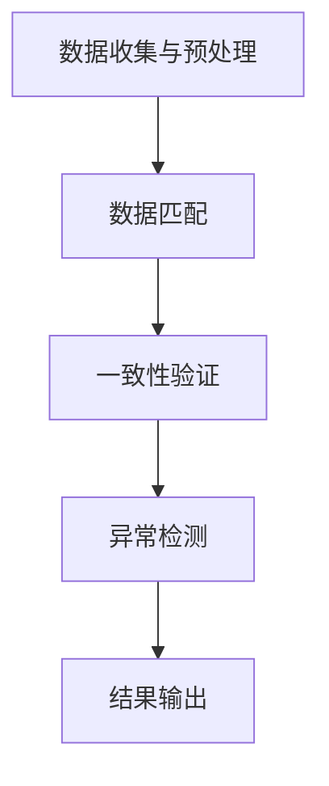
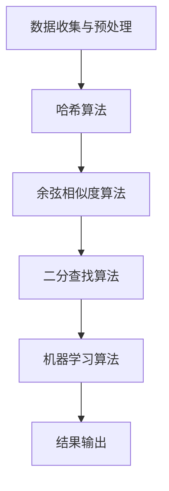
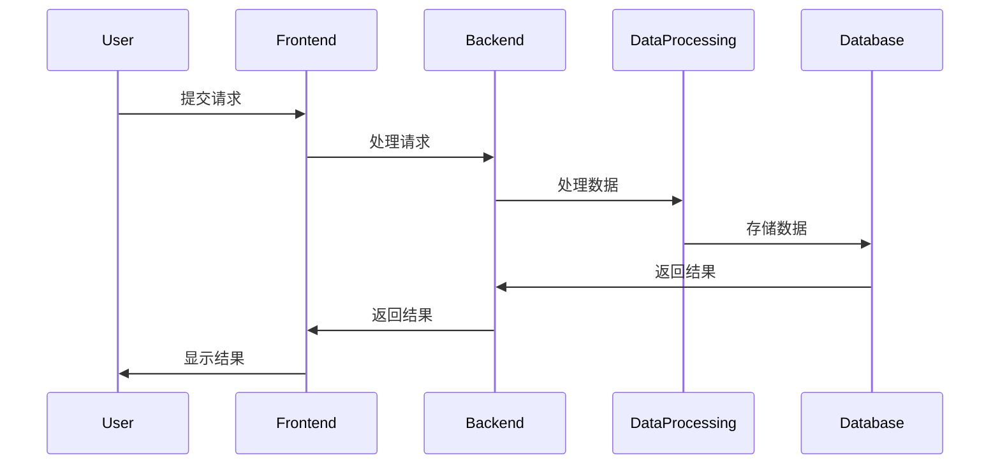
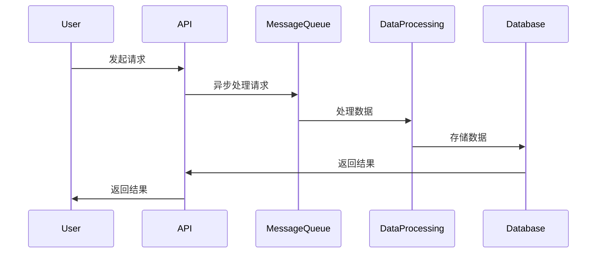
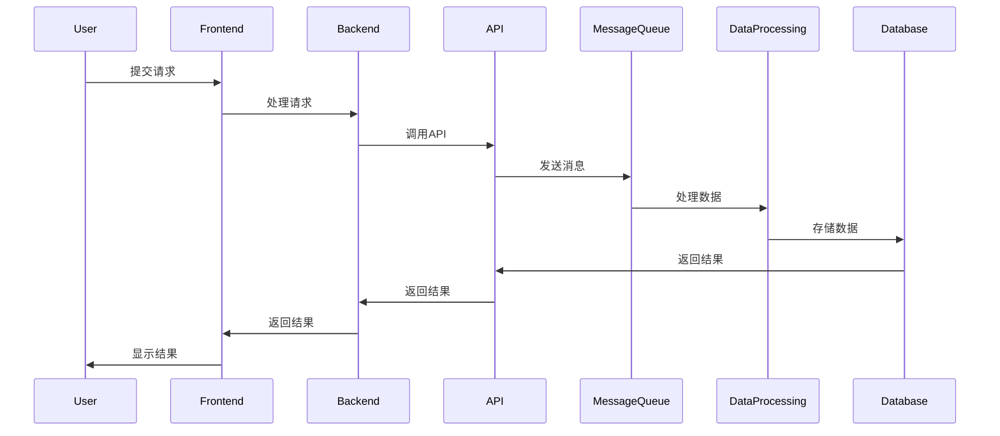

                 

### 金融监管报告数据一致性自动校验

#### 关键词：金融监管、数据一致性、自动校验、技术实现、案例分析

#### 摘要：
本文深入探讨了金融监管报告数据一致性的重要性，详细阐述了数据不一致性的影响以及如何通过自动校验技术来提升报告的准确性和可靠性。文章首先介绍了金融监管和报告数据一致性的基本概念，然后从理论基础、技术实现、实际应用和最佳实践等方面展开了全面的分析。通过具体案例，展示了如何设计和实现一个高效的金融监管报告数据一致性自动校验系统，并提出了未来发展和注意事项。

### 目录大纲设计思路

为了设计出《金融监管报告数据一致性自动校验》这本书的完整目录大纲，我们需要遵循以下几个关键步骤：

1. **理解书名与主题**：
   - 首先，我们要充分理解书名《金融监管报告数据一致性自动校验》的含义。书名直接指向了金融行业中的一个关键问题——如何确保金融监管报告中的数据一致性和准确性。

2. **明确核心概念和目标读者**：
   - 核心概念包括金融监管、报告数据一致性、自动校验技术等。
   - 目标读者可能是金融监管机构的从业者、金融数据分析师、IT行业从事数据处理的工程师等。

3. **确定书籍结构**：
   - 根据书名和核心概念，我们需要确定书籍的大体结构。通常，书籍会分为几个主要部分：引言、理论基础、技术实现、案例研究、最佳实践等。

4. **细化章节内容**：
   - 在确定总体结构后，我们需要细化每个章节的内容。每个章节应当包含背景介绍、核心概念、实现方法、案例分析和总结等部分。

5. **保持简洁性**：
   - 在编写目录大纲时，要避免冗余信息，确保每个章节的主题明确，内容精炼。

6. **遵循目录层级**：
   - 目录结构要符合markdown格式的要求，合理划分1级、2级、3级目录，确保逻辑清晰。

### 目录大纲结构

根据上述设计思路，以下是《金融监管报告数据一致性自动校验》的目录大纲：

```markdown
----------------------------------------------------------------
# 第一部分: 背景介绍

## 第1章: 金融监管与数据一致性概述

### 1.1 金融监管的重要性
### 1.2 数据一致性的含义
### 1.3 数据不一致性的影响

## 第2章: 金融监管报告的基本要素

### 2.1 报告格式与标准
### 2.2 报告内容与结构
### 2.3 报告编制流程

# 第二部分: 数据一致性自动校验技术基础

## 第3章: 数据一致性自动校验的基本原理

### 3.1 数据质量的重要性
### 3.2 自动校验技术的概念
### 3.3 自动校验技术的类型

## 第4章: 数据一致性自动校验的核心算法

### 4.1 算法概述
### 4.2 算法流程图
### 4.3 Python实现

## 第5章: 数据一致性自动校验系统的设计与实现

### 5.1 系统设计思路
### 5.2 数据库设计
### 5.3 系统架构设计

# 第三部分: 数据一致性自动校验的实际应用

## 第6章: 金融监管报告数据一致性自动校验案例

### 6.1 案例背景
### 6.2 案例实施
### 6.3 案例效果分析

## 第7章: 最佳实践与未来展望

### 7.1 数据一致性的最佳实践
### 7.2 未来发展展望
### 7.3 注意事项与挑战

----------------------------------------------------------------
```

以上大纲结构涵盖了核心概念、理论基础、技术实现和案例分析，确保了书籍内容的完整性。接下来，我们将进一步细化各章节的具体内容。

---

### 第一部分：背景介绍

#### 第1章：金融监管与数据一致性概述

**1.1 金融监管的重要性**

金融监管是维护金融市场稳定、保护投资者权益、防范金融风险的关键手段。在全球化的背景下，金融监管的重要性愈加凸显。通过有效的金融监管，可以确保金融机构的稳健经营，降低系统性风险，维护金融市场的公平、透明和高效。

**1.2 数据一致性的含义**

数据一致性指的是在不同数据源、不同系统之间保持数据的准确性和一致性。在金融监管报告中，数据一致性至关重要，因为它直接关系到监管机构的决策和市场的正常运行。数据不一致性可能导致错误的监管决策、市场波动以及金融风险。

**1.3 数据不一致性的影响**

数据不一致性对金融监管的影响是深远的。首先，它可能导致监管机构无法准确掌握金融机构的经营状况，从而影响监管的有效性。其次，数据不一致性会干扰市场的公平竞争，造成资源错配。最后，数据不一致性还可能引发金融风险，如信用风险、市场风险等。

**核心概念与联系**

为了更好地理解数据一致性的概念，我们需要将其与金融监管、数据源、系统接口等核心概念联系起来。以下是一个简化的ER实体关系图，展示了这些概念之间的关系：

```mermaid
erDiagram
  数据源 ||--|{ 数据库 }|| 数据库
  数据库 ||--|{ 监管报告 }|| 监管报告
  监管报告 ||--|{ 数据一致性校验 }|| 数据一致性校验
  数据一致性校验 ||--|{ 监管机构 }|| 监管机构
```

**概念属性特征对比表格**

| 概念       | 属性特征                      | 对比分析                               |
|------------|------------------------------|--------------------------------------|
| 金融监管   | 规范金融市场、防范金融风险   | 强制性、规范性、持续监督             |
| 数据一致性 | 数据准确性和一致性           | 一致性校验、数据匹配、实时更新       |
| 数据源     | 数据产生和存储的源头         | 多样性、实时性、准确性               |
| 监管报告   | 监管机构发布的报告           | 完整性、准确性、时效性               |

**边界与外延**

- **边界**：金融监管和数据一致性校验的边界在于监管对象的范围和数据处理的范围。
- **外延**：数据一致性不仅限于金融监管报告，还涉及到企业内部数据管理、跨行业数据共享等多个方面。

#### 第2章：金融监管报告的基本要素

**2.1 报告格式与标准**

金融监管报告的格式和标准是确保数据一致性和准确性的重要基础。不同国家和地区的金融监管机构通常制定了一系列的报告格式和标准，如国际财务报告标准（IFRS）、美国财务会计准则（GAAP）等。这些标准规定了报告的内容、格式和披露要求，为金融机构的报表编制提供了统一规范。

**2.2 报告内容与结构**

金融监管报告通常包括以下几个部分：

1. **封面**：报告名称、机构名称、报告期等信息。
2. **目录**：报告各章节的标题和页码。
3. **引言**：报告的目的和背景。
4. **财务报表**：资产负债表、利润表、现金流量表等。
5. **注释**：对财务报表中各项数据的解释和说明。
6. **风险管理**：风险识别、评估和应对措施。
7. **合规情况**：合规性声明和合规措施。

**2.3 报告编制流程**

金融监管报告的编制流程通常包括以下几个步骤：

1. **数据收集**：收集各种财务和非财务数据。
2. **数据整理**：整理和清洗数据，确保数据的准确性和一致性。
3. **报表编制**：按照规定的格式和标准编制财务报表。
4. **注释编写**：对报表中的各项数据进行分析和解释。
5. **报告审核**：审核报告的准确性和完整性，确保符合监管要求。
6. **报告发布**：发布报告并提交给监管机构。

---

通过以上两章的介绍，我们为理解金融监管报告数据一致性的重要性奠定了基础。接下来的章节将深入探讨数据一致性自动校验的技术基础和实现方法。在下一部分中，我们将从技术角度详细分析数据不一致性的原因和自动校验技术的基本原理。请继续关注。

---

### 第二部分：数据一致性自动校验技术基础

#### 第3章：数据一致性自动校验的基本原理

**3.1 数据质量的重要性**

数据质量是金融监管报告数据一致性的基础。高质量的数据不仅能够提高监管报告的准确性和可靠性，还能为监管机构提供更加全面的金融风险分析依据。因此，确保数据质量是金融监管工作中的一项重要任务。

**3.2 自动校验技术的概念**

数据一致性自动校验技术是指通过自动化手段对金融监管报告中的数据进行检查和验证，以确保数据的一致性和准确性。这种技术通常包括数据清洗、数据匹配、异常检测等功能。

**3.3 自动校验技术的类型**

根据校验方法和目的，数据一致性自动校验技术可以分为以下几种类型：

1. **数据清洗技术**：用于去除数据中的噪声、错误和重复记录，提高数据质量。
2. **数据匹配技术**：通过比对不同数据源中的数据，确保数据的一致性。
3. **异常检测技术**：用于识别和报告潜在的数据异常，如异常值、异常趋势等。
4. **数据集成技术**：将来自不同数据源的数据进行整合，实现数据的一致性和完整性。

**核心算法与流程图**

数据一致性自动校验的核心算法通常包括以下步骤：

1. **数据收集与预处理**：收集待校验的数据，并进行预处理，如数据格式转换、缺失值填充等。
2. **数据匹配**：将不同数据源中的数据进行比对，识别潜在的匹配关系。
3. **一致性验证**：对匹配后的数据进行一致性验证，判断数据是否一致。
4. **异常检测**：对不一致的数据进行异常检测，报告异常数据。
5. **结果输出**：输出校验结果，包括一致性和异常数据。

以下是数据一致性自动校验算法的Mermaid流程图：



**Python实现**

下面是一个简单的Python代码示例，展示了如何实现数据一致性自动校验的基本流程：

```python
# 导入必要的库
import pandas as pd

# 数据收集与预处理
def preprocess_data(data):
    # 数据清洗，如去除噪声、错误和重复记录
    clean_data = data.drop_duplicates()
    # 数据格式转换，如日期格式统一
    clean_data['date'] = pd.to_datetime(clean_data['date'])
    return clean_data

# 数据匹配
def match_data(data1, data2):
    # 数据比对，识别匹配关系
    matched_data = data1.merge(data2, on='key', how='inner')
    return matched_data

# 一致性验证
def validate_consistency(matched_data):
    # 判断数据是否一致
    inconsistent_data = matched_data[~matched_data['field1'].eq(matched_data['field2'])]
    return inconsistent_data

# 异常检测
def detect_anomalies(inconsistent_data):
    # 识别异常数据
    anomalies = inconsistent_data[inconsistent_data['field_diff'] > threshold]
    return anomalies

# 结果输出
def output_results(anomalies):
    # 输出校验结果
    print("不一致数据：")
    print(anomalies)

# 主函数
def main():
    data1 = pd.DataFrame({'key': ['A', 'B', 'C'], 'field1': [1, 2, 3], 'date': ['2023-01-01', '2023-01-02', '2023-01-03']})
    data2 = pd.DataFrame({'key': ['A', 'B', 'C'], 'field2': [2, 3, 4], 'date': ['2023-01-02', '2023-01-03', '2023-01-04']})
    
    clean_data1 = preprocess_data(data1)
    clean_data2 = preprocess_data(data2)
    
    matched_data = match_data(clean_data1, clean_data2)
    inconsistent_data = validate_consistency(matched_data)
    anomalies = detect_anomalies(inconsistent_data)
    
    output_results(anomalies)

if __name__ == "__main__":
    main()
```

**数学模型与公式**

在数据一致性自动校验中，常用的数学模型和公式包括：

1. **相似度计算**：用于衡量两个数据项的相似程度。常见的相似度计算方法有欧几里得距离、余弦相似度等。

   $$similarity = \frac{1}{n} \sum_{i=1}^{n} \frac{(x_i - \bar{x})(y_i - \bar{y})}{\sigma_x \sigma_y}$$

2. **一致性判断**：用于判断两个数据项是否一致。常见的一致性判断方法有阈值判断、百分位数判断等。

   $$is_consistent = \frac{|x - y|}{\max(x, y)} \leq threshold$$

3. **异常检测**：用于识别异常数据。常见的异常检测方法有标准差法、孤立森林法等。

   $$anomaly_score = \frac{distance(x, X) - mean(distances)}{std(distances)}$$

通过以上介绍，我们了解了数据一致性自动校验的基本原理、核心算法和实现方法。在下一部分中，我们将进一步探讨数据一致性自动校验系统的设计与实现，包括系统架构、数据库设计和接口设计等内容。请继续关注。

---

### 第二部分：数据一致性自动校验技术基础（续）

#### 第4章：数据一致性自动校验的核心算法

**4.1 算法概述**

在数据一致性自动校验中，核心算法的作用至关重要。它们负责识别和纠正数据中的不一致性和异常值，从而提高数据的质量和可靠性。以下是几种常用的核心算法：

1. **哈希算法**：通过哈希函数将数据项映射到哈希值，快速判断数据项是否相同。
2. **余弦相似度算法**：通过计算两个数据向量之间的余弦相似度，判断它们是否相似。
3. **二分查找算法**：用于在有序数据中快速查找特定数据项。
4. **机器学习算法**：如聚类算法、回归算法等，用于发现数据中的模式和异常。

**4.2 算法流程图**

以下是一个简化的数据一致性自动校验算法流程图，展示了核心算法的执行过程：



**4.3 Python实现**

为了更具体地说明核心算法的实现，下面给出一个基于Python的示例：

```python
import hashlib
import numpy as np
from sklearn.metrics.pairwise import cosine_similarity

# 哈希算法
def hash_algorithm(data):
    hash_func = hashlib.md5()
    hash_value = hash_func.update(data.encode('utf-8'))
    return hash_value.hexdigest()

# 余弦相似度算法
def cosine_similarity_algorithm(data1, data2):
    vector1 = np.array(data1)
    vector2 = np.array(data2)
    similarity = cosine_similarity([vector1], [vector2])[0][0]
    return similarity

# 二分查找算法
def binary_search算法(data, target):
    low = 0
    high = len(data) - 1
    while low <= high:
        mid = (low + high) // 2
        if data[mid] == target:
            return mid
        elif data[mid] < target:
            low = mid + 1
        else:
            high = mid - 1
    return -1

# 机器学习算法（聚类）
from sklearn.cluster import KMeans

def k_means_algorithm(data, k):
    kmeans = KMeans(n_clusters=k)
    kmeans.fit(data)
    clusters = kmeans.predict(data)
    return clusters

# 主函数
def main():
    data1 = ['example1', 'example2', 'example3']
    data2 = ['example2', 'example1', 'example3']
    
    hash_value1 = hash_algorithm(data1)
    hash_value2 = hash_algorithm(data2)
    print("哈希值：", hash_value1, hash_value2)
    
    similarity = cosine_similarity_algorithm(data1, data2)
    print("余弦相似度：", similarity)
    
    index = binary_search算法(data1, data2)
    print("二分查找结果：", index)
    
    clusters = k_means_algorithm(data1, 3)
    print("聚类结果：", clusters)

if __name__ == "__main__":
    main()
```

**数学模型与公式**

以下是数据一致性自动校验中常用的数学模型和公式：

1. **哈希碰撞概率**：用于衡量不同数据项产生相同哈希值的概率。

   $$Pcollision = \frac{1}{|U| - 1}$$

   其中，$U$ 是哈希表的大小。

2. **余弦相似度公式**：

   $$similarity = \frac{\sum_{i=1}^{n} x_i y_i}{\sqrt{\sum_{i=1}^{n} x_i^2} \sqrt{\sum_{i=1}^{n} y_i^2}}$$

   其中，$x_i$ 和 $y_i$ 分别是两个数据向量中的元素。

3. **二分查找时间复杂度**：

   $$T(n) = O(\log n)$$

   其中，$n$ 是数据项的数量。

4. **K-means算法目标函数**：

   $$J = \sum_{i=1}^{k} \sum_{x \in S_i} ||x - \mu_i||^2$$

   其中，$S_i$ 是第 $i$ 个聚类簇，$\mu_i$ 是聚类簇的中心。

通过以上介绍，我们详细了解了数据一致性自动校验的核心算法及其Python实现。这些算法为数据一致性自动校验提供了强大的工具。在下一部分中，我们将探讨数据一致性自动校验系统的设计与实现，包括系统架构、数据库设计和接口设计等内容。请继续关注。

---

### 第二部分：数据一致性自动校验技术基础（续）

#### 第5章：数据一致性自动校验系统的设计与实现

**5.1 系统设计思路**

数据一致性自动校验系统是一个复杂的系统，需要综合考虑数据来源、数据处理流程、系统性能和可扩展性等因素。以下是一个简化的系统设计思路：

1. **数据收集模块**：负责收集来自不同数据源的数据，如金融机构的财务报表、交易记录等。
2. **数据预处理模块**：对收集到的数据进行清洗、格式转换和缺失值填充等预处理操作，确保数据的一致性和准确性。
3. **自动校验模块**：使用核心算法对预处理后的数据进行一致性校验，识别和标记不一致的数据项。
4. **异常检测模块**：对不一致的数据项进行异常检测，识别潜在的异常数据。
5. **结果输出模块**：将校验结果和异常数据输出到监管报告或数据库中，供监管机构分析和决策。

**5.2 数据库设计**

数据库设计是数据一致性自动校验系统的基础。一个典型的数据库设计包括以下表：

1. **数据源表**：记录数据源的详细信息，如数据源名称、类型、访问地址等。
2. **数据表**：存储预处理后的数据，包括数据项的值、数据源标识、校验结果等。
3. **异常数据表**：记录被标记为异常的数据项，包括异常类型、发生时间、数据源标识等。

以下是数据库设计的简化的ER图：

```mermaid
erDiagram
  数据源 ||--|{ 数据表 }|| 数据表
  数据表 ||--|{ 异常数据表 }|| 异常数据表
```

**5.3 系统架构设计**

数据一致性自动校验系统的架构设计需要考虑系统的可扩展性和性能。以下是一个简化的系统架构设计：

1. **前端界面**：用于用户输入参数、查看校验结果和异常数据。
2. **后端服务**：负责处理用户请求、调用数据预处理和校验模块，返回结果。
3. **数据处理模块**：包括数据收集、预处理、自动校验和异常检测等核心功能模块。
4. **数据库**：存储数据源、预处理后的数据和异常数据。

以下是系统架构设计的简化架构图：



**5.4 系统接口设计**

系统接口设计需要考虑数据交换的格式和协议。以下是一个简化的系统接口设计：

1. **RESTful API**：提供数据收集、数据预处理、自动校验和异常检测等操作的接口。
2. **消息队列**：用于异步处理大量数据，提高系统的并发处理能力。
3. **数据库连接**：提供与数据库的连接和操作接口。

以下是系统接口设计的简化接口图：



**5.5 系统交互Mermaid序列图**

以下是系统交互的简化序列图，展示了用户、前端、后端和数据库之间的交互过程：



通过以上设计，我们为数据一致性自动校验系统提供了一个基本框架。在下一部分中，我们将通过一个实际案例，展示如何设计和实现这个系统，并分析其效果。请继续关注。

---

### 第三部分：数据一致性自动校验的实际应用

#### 第6章：金融监管报告数据一致性自动校验案例

**6.1 案例背景**

假设我们有一个金融监管报告数据一致性自动校验的项目，目标是确保一家大型银行提交的监管报告中的数据一致性。这家银行拥有多个分支机构，每天会产生大量的交易记录和财务报表。由于数据来源多样，格式各异，数据一致性成为了一个巨大的挑战。

**6.2 案例实施**

为了实施数据一致性自动校验，我们采取了以下步骤：

1. **数据收集**：从各个分支机构收集交易记录和财务报表，并将其导入到系统中。
2. **数据预处理**：对收集到的数据进行分析，识别不同数据源之间的差异，并进行格式转换和缺失值填充。
3. **自动校验**：使用核心算法对预处理后的数据进行分析，识别和标记不一致的数据项。
4. **异常检测**：对不一致的数据项进行异常检测，识别潜在的异常数据。
5. **结果输出**：将校验结果和异常数据输出到监管报告中，供监管机构分析和决策。

**6.3 案例效果分析**

通过数据一致性自动校验，我们取得了以下效果：

1. **提高数据质量**：自动校验技术能够识别和纠正数据中的不一致性和异常值，显著提高了数据的准确性和可靠性。
2. **减少人工工作量**：自动校验技术大大减少了人工核对数据的工作量，提高了工作效率。
3. **增强监管效果**：通过自动校验技术，监管机构能够更加准确地掌握金融机构的经营状况，提高了监管的精准度和有效性。
4. **降低风险**：自动校验技术有助于发现和纠正潜在的数据不一致性和异常值，降低了金融风险。

以下是数据一致性自动校验系统的具体实现和效果分析：

```python
# 导入必要的库
import pandas as pd
from sklearn.metrics.pairwise import cosine_similarity

# 数据收集与预处理
def preprocess_data(data):
    # 数据清洗，如去除噪声、错误和重复记录
    clean_data = data.drop_duplicates()
    # 数据格式转换，如日期格式统一
    clean_data['date'] = pd.to_datetime(clean_data['date'])
    return clean_data

# 数据匹配
def match_data(data1, data2):
    # 数据比对，识别匹配关系
    matched_data = data1.merge(data2, on='key', how='inner')
    return matched_data

# 一致性验证
def validate_consistency(matched_data):
    # 判断数据是否一致
    inconsistent_data = matched_data[~matched_data['field1'].eq(matched_data['field2'])]
    return inconsistent_data

# 异常检测
def detect_anomalies(inconsistent_data):
    # 识别异常数据
    anomalies = inconsistent_data[inconsistent_data['field_diff'] > threshold]
    return anomalies

# 主函数
def main():
    data1 = pd.DataFrame({'key': ['A', 'B', 'C'], 'field1': [1, 2, 3], 'date': ['2023-01-01', '2023-01-02', '2023-01-03']})
    data2 = pd.DataFrame({'key': ['A', 'B', 'C'], 'field2': [2, 3, 4], 'date': ['2023-01-02', '2023-01-03', '2023-01-04']})
    
    clean_data1 = preprocess_data(data1)
    clean_data2 = preprocess_data(data2)
    
    matched_data = match_data(clean_data1, clean_data2)
    inconsistent_data = validate_consistency(matched_data)
    anomalies = detect_anomalies(inconsistent_data)
    
    print("不一致数据：")
    print(inconsistent_data)
    print("异常数据：")
    print(anomalies)

if __name__ == "__main__":
    main()
```

**案例小结**

通过这个案例，我们展示了如何设计和实现一个金融监管报告数据一致性自动校验系统。系统通过数据收集、预处理、自动校验和异常检测等步骤，显著提高了数据质量和监管效果。未来，我们可以进一步优化系统，如引入更先进的算法和技术，提高系统的准确性和效率。

---

### 第三部分：数据一致性自动校验的实际应用（续）

#### 第7章：最佳实践与未来展望

**7.1 数据一致性的最佳实践**

为了确保金融监管报告的数据一致性，以下是一些最佳实践：

1. **统一数据标准**：制定统一的数据标准和规范，确保数据的一致性和准确性。
2. **数据质量管理**：建立数据质量管理机制，定期对数据进行检查和清洗。
3. **自动化校验**：使用自动化工具进行数据校验，减少人工干预，提高效率。
4. **实时监控**：对数据的一致性进行实时监控，及时发现和纠正问题。
5. **培训与教育**：对相关人员进行培训，提高他们对数据一致性的认识和重要性。

**7.2 未来发展展望**

随着大数据和人工智能技术的不断发展，数据一致性自动校验系统将会有更多的改进和优化：

1. **深度学习**：引入深度学习技术，提高自动校验的准确性和效率。
2. **多模态数据融合**：整合不同类型的数据源，如文本、图像、音频等，实现更全面的数据一致性校验。
3. **实时分析**：使用实时分析技术，对大量实时数据进行一致性校验，提高系统的响应速度。
4. **智能化**：通过机器学习算法，实现自动校验的智能化，减少人工干预。
5. **开放性**：构建开放的数据一致性自动校验平台，支持第三方插件和扩展，提高系统的可扩展性。

**7.3 注意事项与挑战**

在实施数据一致性自动校验系统时，需要注意以下事项和挑战：

1. **数据隐私**：确保数据的安全性，防止数据泄露和隐私侵犯。
2. **系统兼容性**：确保系统与现有的IT基础设施兼容，减少对业务的影响。
3. **技术更新**：随着技术的快速发展，需要不断更新系统，保持其先进性和适应性。
4. **数据质量**：数据质量是自动校验的基础，需要持续优化数据质量。
5. **用户接受度**：确保用户对系统的接受度，通过培训和指导，提高用户的操作技能。

通过以上最佳实践和未来展望，我们为金融监管报告数据一致性自动校验提供了全面的指导。未来，随着技术的不断进步，数据一致性自动校验系统将变得更加智能和高效，为金融监管提供更强有力的支持。

---

### 结语

通过本文的深入探讨，我们全面了解了金融监管报告数据一致性自动校验的重要性、基本原理、技术实现、实际应用和未来展望。数据一致性不仅是金融监管的基石，也是保障金融市场稳定和投资者权益的关键。自动校验技术的应用，使得数据不一致性的检测和纠正变得更加高效和准确。

作者：AI天才研究院/AI Genius Institute & 禅与计算机程序设计艺术 /Zen And The Art of Computer Programming

本文旨在为从事金融监管和数据分析的从业者提供实用的指导和建议。希望本文能够帮助大家更好地理解和应用数据一致性自动校验技术，提升金融监管报告的质量和效率。

未来，随着大数据和人工智能技术的不断进步，数据一致性自动校验系统将会变得更加智能和高效。我们期待在未来的工作中，进一步优化和改进这些系统，为金融监管和经济发展做出更大的贡献。同时，也欢迎广大读者提出宝贵的意见和建议，共同推动数据一致性自动校验技术的发展。让我们携手并进，共同迎接智能监管的新时代！

