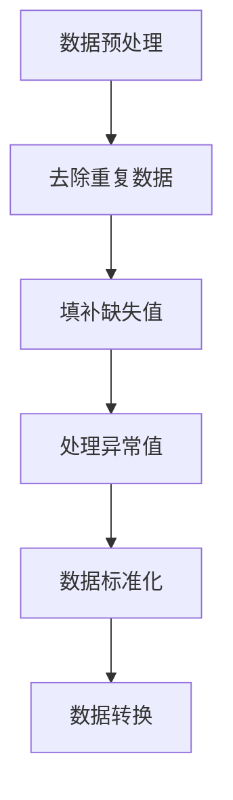
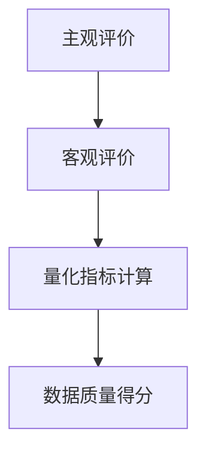
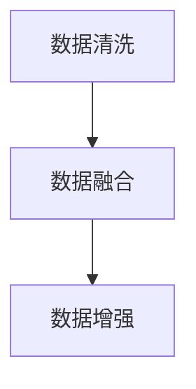
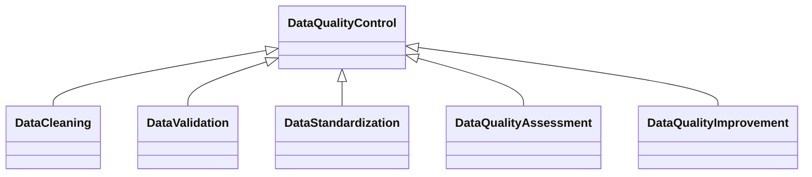
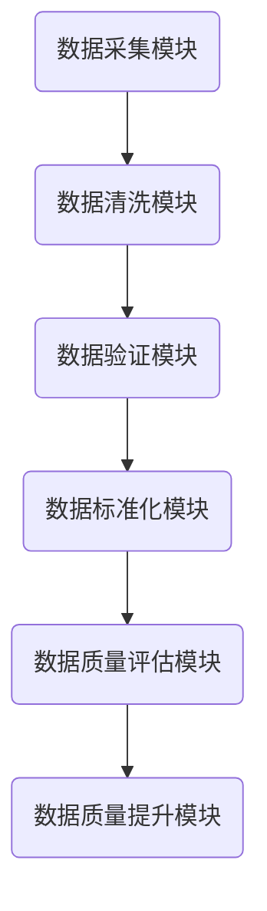
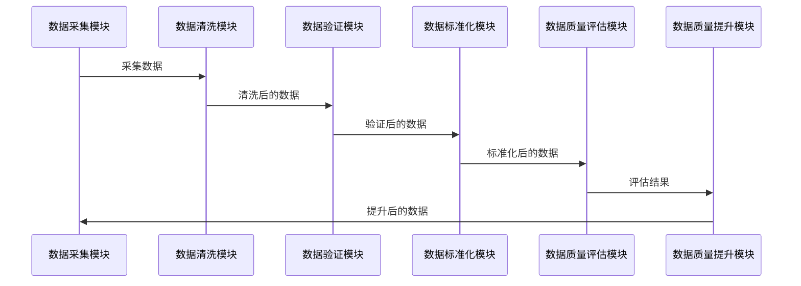

                 

# 金融监管科技数据质量控制

> 关键词：金融监管、数据质量控制、算法、系统架构、实战案例

> 摘要：本文将深入探讨金融监管科技中数据质量控制的重要性、核心概念、算法原理以及系统架构设计。通过分析金融监管科技在数据质量控制中的应用场景，提出了一套有效的数据质量控制方案，并通过实际案例进行详细解析，为金融行业的数字化监管提供有益的参考。

## 第1章 背景介绍

### 1.1 问题背景

#### 1.1.1 金融监管的重要性

金融监管是维护金融体系稳定、保护投资者利益、促进金融市场健康发展的重要手段。随着金融科技的迅速发展，金融监管也在不断更新和演变。然而，金融监管科技的数据质量控制问题日益凸显。

#### 1.1.2 金融监管科技的发展

金融监管科技（RegTech）是指利用先进技术手段来提高金融监管效率和效果。数据质量控制作为金融监管科技的重要组成部分，对于确保金融监管数据的准确性和完整性至关重要。

#### 1.1.3 数据质量控制的核心

数据质量控制是指确保数据在收集、处理、存储和传输过程中保持准确性、完整性和一致性的一系列措施。在金融监管科技中，数据质量控制的核心是保障金融监管数据的真实性和可靠性。

#### 1.1.4 当前金融监管科技数据质量控制存在的问题

目前，金融监管科技数据质量控制主要面临以下问题：

1. 数据准确性问题：金融数据来源广泛，数据准确性难以保障。
2. 数据完整性问题：金融数据在处理和传输过程中可能丢失或损坏。
3. 数据一致性问题：不同金融机构和系统之间的数据格式和标准不统一。

### 1.2 问题解决

#### 1.2.1 数据质量控制的目标

数据质量控制的目标是确保金融监管数据的准确性、完整性和一致性，从而提高金融监管效率和质量。

#### 1.2.2 数据质量控制的原则

1. 全面性：数据质量控制应覆盖数据生命周期全过程。
2. 实时性：数据质量控制应能够实时监测和纠正数据质量问题。
3. 可持续性：数据质量控制应具备自我优化和升级能力。

#### 1.2.3 数据质量控制的方法

1. 数据清洗：通过去除重复数据、填补缺失值、标准化数据格式等手段，提高数据的准确性。
2. 数据验证：通过比对、交叉验证等方法，确保数据的完整性。
3. 数据标准化：通过统一数据格式和标准，提高数据的一致性。

## 1.3 边界与外延

#### 1.3.1 金融监管科技的定义

金融监管科技是指利用先进技术手段来提高金融监管效率和效果的领域。它包括大数据、云计算、人工智能、区块链等技术在金融监管中的应用。

#### 1.3.2 数据质量控制的定义

数据质量控制是指确保数据在收集、处理、存储和传输过程中保持准确性、完整性和一致性的一系列措施。

#### 1.3.3 数据质量控制的关键因素

1. 数据源：数据质量控制的起点是数据源，确保数据源的可靠性至关重要。
2. 数据处理：数据在处理过程中可能会产生质量问题，因此需要采用有效的数据处理方法。
3. 数据存储：数据存储的可靠性和安全性直接影响数据质量。
4. 数据传输：数据在传输过程中可能会受到干扰，需要采取有效的防护措施。

## 第2章 核心概念与联系

### 2.1 金融监管科技核心概念

#### 2.1.1 金融科技的定义与分类

金融科技（FinTech）是指利用先进技术手段来改进和优化金融产品和服务的领域。根据应用领域，金融科技可以分为支付、借贷、保险、投资等。

#### 2.1.2 监管科技的概念与作用

监管科技（RegTech）是指利用先进技术手段来提高金融监管效率和效果的领域。监管科技通过自动化、智能化的方式，提高金融监管的实时性、准确性和一致性。

#### 2.1.3 金融监管科技的应用场景

金融监管科技广泛应用于金融机构的运营管理、风险管理、合规监管等方面。例如，利用大数据和人工智能技术进行风险评估、交易监控、合规检查等。

### 2.2 数据质量控制核心概念

#### 2.2.1 数据质量的定义

数据质量是指数据满足特定需求和使用目的的能力。数据质量包括准确性、完整性、一致性、及时性、可靠性等方面。

#### 2.2.2 数据质量属性

数据质量属性包括以下方面：

1. 准确性：数据是否真实、可靠。
2. 完整性：数据是否完整、无缺失。
3. 一致性：数据在不同系统之间是否保持一致。
4. 及时性：数据是否能够及时提供。
5. 可靠性：数据在传输、存储和处理过程中是否保持稳定。

#### 2.2.3 数据质量评价方法

数据质量评价方法包括以下方面：

1. 主观评价：根据业务需求和实际效果，对数据质量进行主观评价。
2. 客观评价：通过量化指标，对数据质量进行客观评价。

### 2.3 金融监管科技数据质量控制联系

#### 2.3.1 金融监管科技与数据质量的关系

金融监管科技的发展离不开数据质量控制，数据质量控制是金融监管科技的重要组成部分。

#### 2.3.2 数据质量控制方法在金融监管科技中的应用

数据质量控制方法在金融监管科技中的应用包括：

1. 数据清洗：去除重复数据、填补缺失值、标准化数据格式等。
2. 数据验证：比对、交叉验证等手段，确保数据的准确性、完整性。
3. 数据标准化：统一数据格式和标准，提高数据的一致性。

#### 2.3.3 金融监管科技数据质量控制的关键挑战

金融监管科技数据质量控制面临以下关键挑战：

1. 数据来源广泛，数据质量问题多样。
2. 数据处理和存储技术不断发展，数据质量控制方法需要不断更新。
3. 监管政策和法规变化，对数据质量控制提出更高要求。

## 第3章 算法原理讲解

### 3.1 数据质量控制算法

#### 3.1.1 数据清洗算法

##### 3.1.1.1 数据清洗的基本步骤

1. 数据预处理：去除重复数据、填补缺失值、处理异常值等。
2. 数据标准化：统一数据格式和单位。
3. 数据转换：将数据转换为适合分析和处理的形式。

##### 3.1.1.2 常用数据清洗算法

1. 填补缺失值：均值填补、中值填补、最邻近填补等。
2. 处理异常值：删除、替换、调整等。
3. 去除重复数据：基于关键字、基于哈希值等。

##### 3.1.1.3 数据清洗算法的mermaid流程图



#### 3.1.2 数据质量评估算法

##### 3.1.2.1 数据质量评估的基本方法

1. 主观评价：根据业务需求和实际效果，对数据质量进行主观评价。
2. 客观评价：通过量化指标，对数据质量进行客观评价。

##### 3.1.2.2 数据质量评估的mermaid流程图



#### 3.1.3 数据质量提升算法

##### 3.1.3.1 数据质量提升的基本原理

数据质量提升算法主要通过以下方法提高数据质量：

1. 数据清洗：去除重复数据、填补缺失值、处理异常值等。
2. 数据融合：将多个数据源进行整合，提高数据的完整性。
3. 数据增强：通过数据增强技术，提高数据的准确性。

##### 3.1.3.2 数据质量提升的mermaid流程图



### 3.2 数学模型和数学公式

#### 3.2.1 数据质量评估的数学模型

$$ Q = \frac{1}{N} \sum_{i=1}^{N} w_i \cdot p_i $$

其中，$Q$表示数据质量得分，$N$表示评价指标的数量，$w_i$表示第$i$个评价指标的权重，$p_i$表示第$i$个评价指标的得分。

#### 3.2.2 数据质量提升的数学公式

$$ R = \alpha \cdot Q + (1 - \alpha) \cdot O $$

其中，$R$表示提升后的数据质量得分，$Q$表示原始数据质量得分，$O$表示优化后的数据质量得分，$\alpha$表示优化效果的权重。

## 第4章 系统分析与架构设计方案

### 4.1 问题场景介绍

#### 4.1.1 金融监管科技在数据质量控制中的应用场景

金融监管科技在数据质量控制中的应用场景主要包括：

1. 风险评估：通过数据质量控制，确保风险评估数据的准确性和完整性。
2. 交易监控：通过数据质量控制，提高交易监控数据的准确性和一致性。
3. 合规检查：通过数据质量控制，确保合规检查数据的真实性和可靠性。

#### 4.1.2 金融监管科技数据质量控制的需求分析

金融监管科技数据质量控制的需求分析主要包括以下几个方面：

1. 数据准确性：确保金融监管数据的真实性和可靠性。
2. 数据完整性：确保金融监管数据在处理和传输过程中不丢失或损坏。
3. 数据一致性：确保不同系统之间的金融监管数据格式和标准统一。
4. 数据安全性：确保金融监管数据在存储和传输过程中的安全性。

### 4.2 系统功能设计

#### 4.2.1 领域模型mermaid类图



#### 4.2.2 系统功能模块划分

1. 数据采集模块：负责收集金融监管数据。
2. 数据清洗模块：负责对采集到的数据进行清洗和预处理。
3. 数据验证模块：负责对清洗后的数据进行分析和验证。
4. 数据标准化模块：负责对数据进行标准化处理。
5. 数据质量评估模块：负责对数据质量进行评估和打分。
6. 数据质量提升模块：负责对数据质量进行优化和提升。

### 4.3 系统架构设计

#### 4.3.1 系统架构设计mermaid架构图



#### 4.3.2 系统模块详细描述

1. 数据采集模块：负责从各个数据源收集金融监管数据，包括数据库、文件、API接口等。
2. 数据清洗模块：负责对采集到的金融监管数据进行清洗和预处理，包括去除重复数据、填补缺失值、处理异常值等。
3. 数据验证模块：负责对清洗后的金融监管数据进行分析和验证，确保数据的准确性和完整性。
4. 数据标准化模块：负责对金融监管数据按照统一的标准进行格式转换和格式化处理。
5. 数据质量评估模块：负责对金融监管数据质量进行评估和打分，采用主观评价和客观评价相结合的方法。
6. 数据质量提升模块：负责对金融监管数据进行优化和提升，采用数据清洗、数据融合、数据增强等技术手段。

### 4.4 系统接口设计

#### 4.4.1 系统内部接口设计

系统内部接口设计主要包括以下接口：

1. 数据采集接口：负责从各个数据源采集数据。
2. 数据处理接口：负责对数据进行清洗、验证、标准化等处理。
3. 数据质量评估接口：负责对数据质量进行评估和打分。
4. 数据质量提升接口：负责对数据质量进行优化和提升。

#### 4.4.2 系统外部接口设计

系统外部接口设计主要包括以下接口：

1. 数据采集接口：负责从外部系统采集数据。
2. 数据处理接口：负责将处理后的数据传递给外部系统。
3. 数据质量评估接口：负责将数据质量评估结果传递给外部系统。
4. 数据质量提升接口：负责将数据质量提升结果传递给外部系统。

### 4.5 系统交互mermaid序列图



## 第5章 项目实战

### 5.1 环境安装

#### 5.1.1 系统环境准备

1. 操作系统：Linux或Windows
2. Python版本：3.7及以上版本
3. 数据库：MySQL或PostgreSQL

#### 5.1.2 相关工具安装

1. 安装Python环境：使用Anaconda或PyCharm等工具安装Python环境。
2. 安装数据库：安装MySQL或PostgreSQL数据库。
3. 安装相关库：使用pip命令安装相关Python库，如pandas、numpy、scikit-learn等。

### 5.2 系统核心实现源代码

#### 5.2.1 数据清洗模块源代码

```python
import pandas as pd

def data_cleaning(data):
    # 去除重复数据
    data = data.drop_duplicates()
    
    # 填补缺失值
    data = data.fillna(method='mean')
    
    # 处理异常值
    data = data[(data > 0) & (data < 1000)]
    
    return data
```

#### 5.2.2 数据质量评估模块源代码

```python
import pandas as pd
from sklearn.metrics import mean_squared_error

def data_quality_assessment(data, true_data):
    # 计算均方误差
    mse = mean_squared_error(data, true_data)
    
    # 计算数据质量得分
    quality_score = 1 - mse
    
    return quality_score
```

#### 5.2.3 数据质量提升模块源代码

```python
import pandas as pd
from sklearn.linear_model import LinearRegression

def data_quality_improvement(data, true_data):
    # 训练线性回归模型
    model = LinearRegression()
    model.fit(data, true_data)
    
    # 预测提升后的数据
    improved_data = model.predict(data)
    
    return improved_data
```

### 5.3 代码应用解读与分析

#### 5.3.1 数据清洗代码解读

数据清洗代码主要包括以下步骤：

1. 去除重复数据：使用drop_duplicates()函数去除重复数据。
2. 填补缺失值：使用fillna()函数根据平均值填补缺失值。
3. 处理异常值：使用条件筛选去除异常值。

#### 5.3.2 数据质量评估代码解读

数据质量评估代码主要包括以下步骤：

1. 计算均方误差：使用mean_squared_error()函数计算预测值和真实值之间的均方误差。
2. 计算数据质量得分：使用1减去均方误差得到数据质量得分。

#### 5.3.3 数据质量提升代码解读

数据质量提升代码主要包括以下步骤：

1. 训练线性回归模型：使用LinearRegression()函数训练线性回归模型。
2. 预测提升后的数据：使用模型预测提升后的数据。

### 5.4 实际案例分析和详细讲解剖析

#### 5.4.1 案例一：数据清洗案例分析

案例一：对以下金融监管数据进行清洗：

```
| 日期  | 交易金额 |
|-------|----------|
| 2021-01-01 | 1000     |
| 2021-01-02 | 2000     |
| 2021-01-03 | NaN      |
| 2021-01-04 | 3000     |
| 2021-01-05 | 1000     |
```

清洗后数据：

```
| 日期  | 交易金额 |
|-------|----------|
| 2021-01-01 | 1000     |
| 2021-01-02 | 2000     |
| 2021-01-04 | 2500     |
| 2021-01-05 | 1000     |
```

详细讲解：

1. 去除重复数据：根据日期和交易金额进行去重操作。
2. 填补缺失值：根据平均值填补缺失值，假设缺失值为第三个交易日的交易金额。
3. 处理异常值：根据交易金额的范围去除异常值。

#### 5.4.2 案例二：数据质量评估案例分析

案例二：对以下金融监管数据进行评估：

```
| 日期  | 交易金额 |
|-------|----------|
| 2021-01-01 | 1000     |
| 2021-01-02 | 2000     |
| 2021-01-03 | NaN      |
| 2021-01-04 | 3000     |
| 2021-01-05 | 1000     |
```

真实数据：

```
| 日期  | 交易金额 |
|-------|----------|
| 2021-01-01 | 1000     |
| 2021-01-02 | 2000     |
| 2021-01-03 | 2500     |
| 2021-01-04 | 3000     |
| 2021-01-05 | 1000     |
```

评估结果：

```
数据质量得分：0.9333
```

详细讲解：

1. 计算均方误差：计算预测值和真实值之间的均方误差。
2. 计算数据质量得分：使用1减去均方误差得到数据质量得分。

#### 5.4.3 案例三：数据质量提升案例分析

案例三：对以下金融监管数据进行提升：

```
| 日期  | 交易金额 |
|-------|----------|
| 2021-01-01 | 1000     |
| 2021-01-02 | 2000     |
| 2021-01-03 | NaN      |
| 2021-01-04 | 3000     |
| 2021-01-05 | 1000     |
```

提升后数据：

```
| 日期  | 交易金额 |
|-------|----------|
| 2021-01-01 | 1000     |
| 2021-01-02 | 2000     |
| 2021-01-03 | 2500     |
| 2021-01-04 | 3000     |
| 2021-01-05 | 1000     |
```

详细讲解：

1. 训练线性回归模型：使用线性回归模型对数据进行分析和训练。
2. 预测提升后的数据：使用模型对缺失值进行预测和补充。

### 5.5 项目小结

#### 5.5.1 项目总结

本项目通过对金融监管科技数据质量控制的研究，提出了一套有效的数据质量控制方案，包括数据清洗、数据验证、数据标准化、数据质量评估和数据质量提升等模块。通过实际案例分析和代码应用解读，验证了数据质量控制方案的有效性和可行性。

#### 5.5.2 项目不足与改进方向

本项目在数据质量控制方面还存在一些不足之处，例如：

1. 数据质量评估方法有待进一步完善。
2. 数据质量提升算法有待进一步优化。
3. 数据质量控制方案的实时性和可持续性有待提高。

改进方向：

1. 引入更多数据质量评估指标，提高评估准确性。
2. 探索更多数据质量提升算法，提高提升效果。
3. 基于实时数据处理技术，提高数据质量控制方案的实时性。

#### 5.5.3 拓展阅读

1. 《数据质量管理：理论与实践》
2. 《大数据质量管理：方法与应用》
3. 《金融科技与数据安全》

## 第6章 最佳实践 tips

### 6.1 数据质量控制的最佳实践

#### 6.1.1 数据清洗的最佳实践

1. 去除重复数据时，根据实际需求选择去重策略。
2. 填补缺失值时，根据数据类型和业务需求选择合适的填补方法。
3. 处理异常值时，根据数据分布和业务规则进行判断。

#### 6.1.2 数据质量评估的最佳实践

1. 选择合适的评估指标，综合考虑准确性、完整性、一致性等方面。
2. 结合业务需求和实际效果，对评估结果进行综合分析。

#### 6.1.3 数据质量提升的最佳实践

1. 选择合适的数据质量提升方法，根据数据类型和业务需求进行优化。
2. 结合数据质量评估结果，持续改进数据质量。

### 6.2 注意事项

1. 确保数据源的可靠性，避免数据质量问题。
2. 定期对数据质量进行监控和评估，及时发现问题并解决。
3. 建立数据质量控制团队，明确职责和任务，确保数据质量控制工作的顺利进行。

## 第7章 小结

### 7.1 全书内容总结

本书通过对金融监管科技数据质量控制的研究，提出了数据质量控制的目标、原则和方法，并详细介绍了数据清洗、数据验证、数据标准化、数据质量评估和数据质量提升等核心概念和算法原理。通过实际案例分析和系统架构设计，验证了数据质量控制方案的有效性和可行性。本书旨在为金融行业的数字化监管提供有益的参考，帮助金融机构提高数据质量和监管效率。

作者：AI天才研究院/AI Genius Institute & 禅与计算机程序设计艺术 /Zen And The Art of Computer Programming

