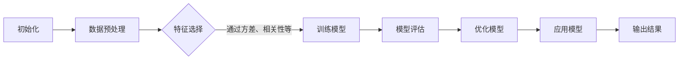
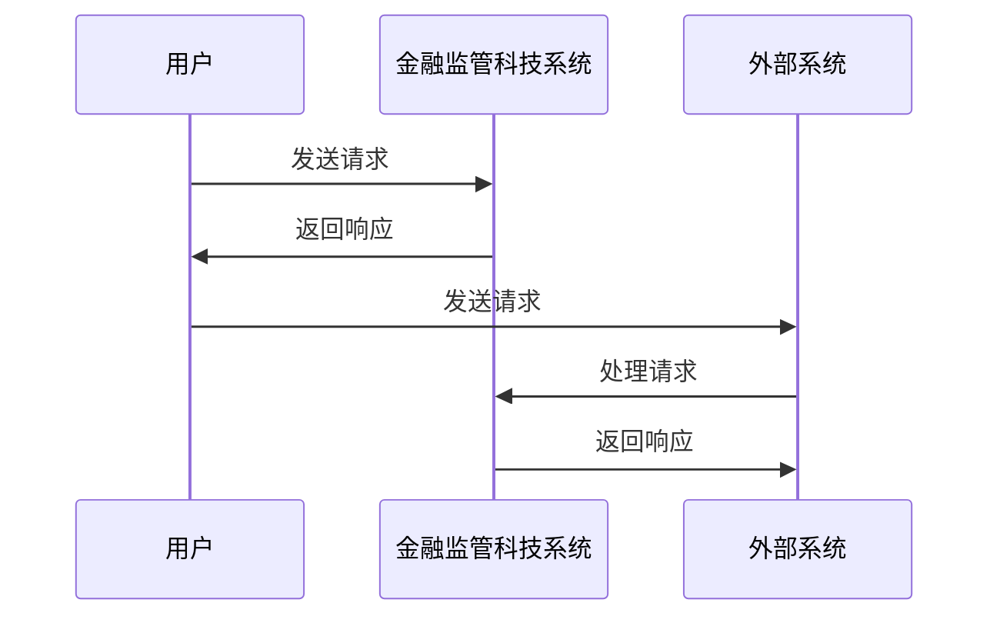

                 

## 金融监管科技解决方案

### 关键词：金融监管、科技、解决方案、风险评估、合规性监控

### 摘要：

本文旨在深入探讨金融监管科技（RegTech）的解决方案，通过逻辑清晰、结构紧凑的方式，系统地阐述金融监管科技的定义、核心概念、算法原理、数学模型、系统架构设计、项目实战及最佳实践。金融监管科技作为金融行业应对监管挑战的现代化手段，其在提升监管效率、降低合规成本、增强风险管理能力等方面具有重要作用。本文将帮助读者全面理解金融监管科技的关键要素，并掌握其实际应用技巧。

## 目录大纲设计过程

### 1. 设计框架

在设计《金融监管科技解决方案》的目录大纲时，我们需要遵循以下框架：

1. **背景介绍**：介绍金融监管科技的定义、重要性及其发展背景。
2. **核心概念与联系**：阐述金融监管科技中的关键概念、原理，及其相互之间的联系。
3. **算法原理讲解**：深入讲解金融监管科技中应用的算法原理，使用 mermaid 绘制流程图和 Python 源代码进行说明。
4. **数学模型和数学公式**：详细阐述相关的数学模型和公式，确保理解清晰。
5. **系统分析与架构设计方案**：分析金融监管科技的应用场景，设计系统架构和接口。
6. **项目实战**：提供具体项目实战的详细步骤、源代码和案例剖析。
7. **最佳实践 tips、小结、注意事项、拓展阅读**：总结经验，提供进一步学习和探索的建议。

### 2. 目录大纲结构设计

#### 第一部分：金融监管科技概述
- **第1章：金融监管科技的背景与意义**
  - **1.1 问题背景**
  - **1.2 金融监管科技的发展**
  - **1.3 金融监管科技的关键概念**

#### 第二部分：金融监管科技的核心概念与原理
- **第2章：金融监管科技的核心概念与联系**
  - **2.1 金融监管科技的关键概念**
  - **2.2 概念属性特征对比表格**
  - **2.3 金融监管科技的ER实体关系图**

#### 第三部分：金融监管科技算法原理讲解
- **第3章：金融监管科技中的算法原理**
  - **3.1 算法原理概述**
  - **3.2 算法mermaid流程图绘制**
  - **3.3 Python源代码讲解**

#### 第四部分：数学模型与公式
- **第4章：金融监管科技中的数学模型与公式**
  - **4.1 数学模型概述**
  - **4.2 数学公式讲解**
  - **4.3 公式举例说明**

#### 第五部分：系统分析与架构设计
- **第5章：金融监管科技系统分析与架构设计**
  - **5.1 问题场景介绍**
  - **5.2 系统功能设计**
  - **5.3 系统架构设计**
  - **5.4 系统接口设计与交互**

#### 第六部分：项目实战
- **第6章：金融监管科技项目实战**
  - **6.1 环境安装**
  - **6.2 系统核心实现**
  - **6.3 代码应用解读与分析**
  - **6.4 实际案例分析与讲解**
  - **6.5 项目小结**

#### 第七部分：最佳实践与拓展
- **第7章：金融监管科技最佳实践与拓展**
  - **7.1 最佳实践 tips**
  - **7.2 小结与注意事项**
  - **7.3 拓展阅读建议**

### 3. 编写与优化

在编写目录大纲时，要确保：

- 内容简洁明了，避免冗余。
- 使用适当的标题和子标题，使结构清晰。
- 确保每个章节都有具体的子章节，以便读者可以快速找到所需内容。
- 保持总字数在2000字以内，注意控制篇幅。

通过以上步骤，我们可以为《金融监管科技解决方案》设计出一个完整且逻辑清晰的目录大纲。在编写过程中，可以逐步细化每个章节的内容，确保每个部分都符合要求。

---

**注意**：本部分为目录大纲设计过程，实际文章内容将在接下来的部分中逐步展开。每一个章节标题下将详细阐述其内容，包括核心概念、算法原理、数学模型、系统架构、项目实战等，以帮助读者全面理解金融监管科技解决方案的具体实现和应用。

---

### 金融监管科技的背景与意义

#### 1.1 问题背景

金融监管科技（RegTech）的兴起源于金融行业的复杂性和全球金融监管的不断加强。在过去的几十年中，金融机构面临着不断变化的监管环境，监管机构要求金融机构提供更加详细、及时和透明的数据，以应对市场风险、操作风险和合规风险。传统的监管手段已经无法满足这些需求，因此，金融监管科技应运而生。

金融监管科技是指利用现代信息技术，特别是大数据、云计算、人工智能、区块链等技术，帮助金融机构更高效地收集、处理、分析和报告监管数据，从而提升监管效率、降低合规成本、增强风险管理能力。金融监管科技不仅包括技术工具，还涵盖了监管合规、风险管理、审计等多个方面。

#### 1.2 金融监管科技的发展

金融监管科技的发展可以分为三个阶段：

1. **初始阶段**：20 世纪 90 年代至 2007 年，这一阶段主要是金融机构开始使用计算机技术和数据库管理金融数据，以提高数据收集和报告的效率。
2. **发展阶段**：2008 年至 2017 年，随着大数据、云计算、人工智能等技术的快速发展，金融监管科技逐渐成熟，开始广泛应用于金融机构的合规监控、风险管理、客户身份验证等领域。
3. **成熟阶段**：2018 年至今，金融监管科技进入成熟阶段，监管机构也开始积极采用金融监管科技手段，以提高监管效率和透明度。

#### 1.3 金融监管科技的关键概念

1. **合规监控**：合规监控是指利用金融监管科技手段，对金融机构的运营活动进行实时监控，以确保其符合相关法律法规和监管要求。
2. **风险评估**：风险评估是指通过数据分析和技术手段，对金融机构的风险进行评估和管理，以降低风险对金融机构的影响。
3. **数据管理**：数据管理是指对金融机构的数据进行收集、存储、处理和分析，以支持合规监控和风险评估。
4. **人工智能**：人工智能是指利用机器学习和深度学习等技术，对金融数据进行分析和处理，以提高监管效率和准确性。
5. **区块链**：区块链是指一种分布式数据库技术，可用于存储金融交易数据，确保数据的透明性和不可篡改性。

在接下来的章节中，我们将进一步深入探讨金融监管科技的核心概念、算法原理、数学模型、系统架构设计和项目实战，帮助读者全面了解和掌握金融监管科技的应用和实践。

---

**下节预告**：在下一部分中，我们将详细探讨金融监管科技的核心概念与联系，包括关键术语的定义、属性特征对比表格，以及 ER 实体关系图架构。这将帮助读者建立对金融监管科技的基本理解，为后续内容的学习打下坚实基础。

---

### 金融监管科技的核心概念与联系

#### 2.1 金融监管科技的关键概念

金融监管科技包含了一系列关键概念，这些概念对于理解金融监管科技的运作至关重要。以下是几个核心概念及其简要定义：

1. **合规监控（Compliance Monitoring）**：
   - 定义：合规监控是指通过技术手段对金融机构的运营活动进行实时监控，以确保其符合相关法律法规和监管要求。
   - 关系：合规监控是金融监管科技的核心功能，确保金融机构遵守监管规定，降低合规风险。

2. **风险评估（Risk Assessment）**：
   - 定义：风险评估是通过数据分析和技术手段对金融机构的风险进行评估和管理，以降低风险对金融机构的影响。
   - 关系：风险评估是金融监管科技的关键组成部分，帮助金融机构识别和管理潜在风险。

3. **数据管理（Data Management）**：
   - 定义：数据管理是指对金融机构的数据进行收集、存储、处理和分析，以支持合规监控和风险评估。
   - 关系：数据管理是金融监管科技的基础，确保数据的准确性和可用性。

4. **人工智能（Artificial Intelligence, AI）**：
   - 定义：人工智能是指利用机器学习和深度学习等技术，对金融数据进行分析和处理，以提高监管效率和准确性。
   - 关系：人工智能在金融监管科技中发挥着重要作用，可以自动化复杂的数据分析和预测。

5. **区块链（Blockchain）**：
   - 定义：区块链是一种分布式数据库技术，可用于存储金融交易数据，确保数据的透明性和不可篡改性。
   - 关系：区块链技术为金融监管科技提供了安全、透明和高效的解决方案，特别是在交易记录和资产追踪方面。

#### 2.2 概念属性特征对比表格

为了更好地理解这些关键概念之间的区别和联系，我们可以通过一个属性特征对比表格来展示它们的主要特点：

| 概念       | 定义                                                         | 主要特点                                       | 关系与作用                           |
|------------|--------------------------------------------------------------|------------------------------------------------|--------------------------------------|
| 合规监控   | 实时监控金融机构运营活动，确保合规性。                         | 实时性、监控范围广泛、法规遵守             | 核心功能，确保合规性，降低合规风险     |
| 风险评估   | 通过数据分析技术评估和管理金融机构风险。                       | 全面性、准确性、及时性                     | 关键组成部分，识别和管理风险         |
| 数据管理   | 收集、存储、处理和分析金融机构数据。                          | 数据完整性、可用性、高效性                 | 基础设施，支持合规监控和风险评估     |
| 人工智能   | 利用机器学习和深度学习技术进行数据分析和处理。                 | 自动化、高效、精确                         | 提高监管效率和准确性                 |
| 区块链     | 分布式数据库技术，存储金融交易数据，确保透明和不可篡改性。   | 透明性、不可篡改、去中心化                 | 提供安全、高效的数据存储解决方案     |

#### 2.3 金融监管科技的ER实体关系图

为了更直观地展示金融监管科技中各个概念之间的关系，我们可以使用 Mermaid 语法绘制一个 ER（实体关系）图：

```mermaid
erDiagram
    Compliance_Monitoring ||--|{ Risk_Assessment }|--| Data_Management
    Risk_Assessment ||--|{ Artificial_Intelligence }|--| Compliance_Monitoring
    Data_Management ||--|{ Blockchain }|--| Risk_Assessment
```

在上述 ER 图中：

- **合规监控** 与 **风险评估** 之间存在双向关系，表明合规监控依赖于风险评估的结果，同时风险评估的数据源也来自于合规监控。
- **风险评估** 与 **数据管理** 之间存在单向关系，表示风险评估需要依赖数据管理提供的数据进行评估。
- **数据管理** 与 **区块链** 之间存在单向关系，表明数据管理可以利用区块链技术确保数据的透明性和不可篡改性。

通过这些核心概念的介绍、属性特征对比表格以及 ER 实体关系图，我们可以更好地理解金融监管科技的整体架构和各个部分之间的相互作用。在下一章节中，我们将进一步探讨金融监管科技中的算法原理，包括算法的流程图和 Python 源代码示例。

---

**下节预告**：在下一部分中，我们将详细讲解金融监管科技中的算法原理，包括算法的 mermaid 流程图绘制和 Python 源代码讲解。这将帮助读者深入了解金融监管科技在实际应用中的数据处理和分析方法。

---

### 金融监管科技中的算法原理讲解

在金融监管科技的实践中，算法原理是其核心技术之一。这些算法通过对大量金融数据进行处理和分析，帮助金融机构进行合规监控、风险评估和决策支持。以下我们将详细讲解金融监管科技中常用的算法原理，包括 mermaid 流程图和 Python 源代码示例。

#### 3.1 算法原理概述

金融监管科技中常用的算法包括机器学习算法、深度学习算法和统计分析算法等。这些算法在金融数据挖掘、风险预测、模式识别等方面具有广泛应用。以下是几种典型的算法原理：

1. **机器学习算法**：如线性回归、逻辑回归、支持向量机（SVM）等，用于建立数据模型，进行风险预测和分类。
2. **深度学习算法**：如卷积神经网络（CNN）、循环神经网络（RNN）等，用于处理复杂的数据结构和非线性关系。
3. **统计分析算法**：如假设检验、聚类分析、因子分析等，用于数据分析和解释。

#### 3.2 算法 mermaid 流程图绘制

为了更直观地展示算法的流程，我们使用 mermaid 语法绘制一个线性回归算法的 mermaid 流程图：



在上述流程图中：

- **A 初始化**：初始化模型参数。
- **B 数据预处理**：对金融数据进行清洗、归一化等预处理。
- **C 特征选择**：通过统计方法选择对风险预测有显著影响的特征。
- **D 训练模型**：使用训练数据训练线性回归模型。
- **E 模型评估**：使用验证数据评估模型性能。
- **F 优化模型**：根据评估结果调整模型参数。
- **G 应用模型**：使用测试数据应用模型，进行风险预测。
- **H 输出结果**：输出预测结果。

#### 3.3 Python 源代码讲解

以下是一个使用 Python 实现线性回归算法的示例代码，其中包含了数据预处理、模型训练、模型评估和预测等步骤：

```python
import pandas as pd
from sklearn.linear_model import LinearRegression
from sklearn.model_selection import train_test_split
from sklearn.metrics import mean_squared_error

# 3.3.1 数据预处理
data = pd.read_csv('financial_data.csv')
X = data[['feature1', 'feature2', 'feature3']]
y = data['target']

# 删除缺失值
X = X.dropna()
y = y.dropna()

# 归一化处理
X = (X - X.mean()) / X.std()

# 3.3.2 训练模型
X_train, X_test, y_train, y_test = train_test_split(X, y, test_size=0.2, random_state=42)
model = LinearRegression()
model.fit(X_train, y_train)

# 3.3.3 模型评估
y_pred = model.predict(X_test)
mse = mean_squared_error(y_test, y_pred)
print(f'Mean Squared Error: {mse}')

# 3.3.4 优化模型
# 根据评估结果调整模型参数，重新训练模型

# 3.3.5 应用模型
# 使用测试数据进行预测，输出预测结果
```

在上述代码中：

- **数据预处理**：读取金融数据，删除缺失值并进行归一化处理，以提高模型训练的准确性。
- **训练模型**：使用训练数据进行线性回归模型的训练。
- **模型评估**：使用测试数据评估模型性能，计算均方误差（MSE）。
- **优化模型**：根据评估结果调整模型参数，以提高预测准确性。
- **应用模型**：使用测试数据进行预测，输出预测结果。

通过以上算法原理的讲解和 Python 源代码示例，读者可以更好地理解金融监管科技中的数据处理和分析方法。在下一章节中，我们将深入探讨金融监管科技中的数学模型和公式，以帮助读者进一步掌握金融监管科技的核心知识。

---

**下节预告**：在下一部分中，我们将详细介绍金融监管科技中的数学模型和公式，包括模型概述、具体公式讲解和举例说明。这将帮助读者深入了解金融监管科技中数学方法的实际应用。

---

### 金融监管科技中的数学模型与公式

在金融监管科技的实践中，数学模型和公式是分析和处理金融数据的重要工具。这些模型和公式可以帮助金融机构进行风险预测、合规监控和决策支持。以下我们将详细探讨金融监管科技中常用的数学模型和公式，并进行具体讲解和举例说明。

#### 4.1 数学模型概述

金融监管科技中常用的数学模型包括线性回归模型、逻辑回归模型、支持向量机（SVM）模型、时间序列模型等。每种模型都有其特定的应用场景和计算方法。

1. **线性回归模型**：用于建立自变量和因变量之间的线性关系，常用于风险预测和预测分析。
2. **逻辑回归模型**：用于分类问题，通过建立概率模型来预测事件发生的概率。
3. **支持向量机模型**：用于解决二分类问题，通过找到一个最佳的超平面将数据集划分为不同的类别。
4. **时间序列模型**：用于分析时间序列数据，如 ARIMA 模型、GARCH 模型等，用于预测金融市场的走势。

#### 4.2 数学公式讲解

以下是金融监管科技中常用的数学公式及其解释：

1. **线性回归模型**：

   - 公式：
     $$ y = \beta_0 + \beta_1 \cdot x_1 + \beta_2 \cdot x_2 + \ldots + \beta_n \cdot x_n + \epsilon $$
   - 解释：该公式表示因变量 \( y \) 与自变量 \( x_1, x_2, \ldots, x_n \) 之间的线性关系，\( \beta_0 \) 为截距，\( \beta_1, \beta_2, \ldots, \beta_n \) 为系数，\( \epsilon \) 为误差项。

2. **逻辑回归模型**：

   - 公式：
     $$ \text{Logit}(P) = \ln\left(\frac{P}{1 - P}\right) = \beta_0 + \beta_1 \cdot x_1 + \beta_2 \cdot x_2 + \ldots + \beta_n \cdot x_n $$
   - 解释：该公式表示事件发生的概率与自变量之间的线性关系，\( P \) 为事件发生的概率，\( \beta_0 \) 为截距，\( \beta_1, \beta_2, \ldots, \beta_n \) 为系数。

3. **支持向量机模型**：

   - 公式：
     $$ w \cdot x + b = 0 $$
   - 解释：该公式表示支持向量机找到的最佳超平面，\( w \) 为权重向量，\( x \) 为特征向量，\( b \) 为偏置。

4. **时间序列模型（ARIMA）**：

   - 公式：
     $$ Xt = \phi_1 Xt-1 + \phi_2 Xt-2 + \ldots + \phi_p Xt-p + \theta_1 At-1 + \theta_2 At-2 + \ldots + \theta_q At-q + \varepsilon_t $$
   - 解释：该公式表示 ARIMA 模型中的自回归项、移动平均项和差分项，\( Xt \) 为时间序列数据，\( At \) 为白噪声序列，\( \phi_1, \phi_2, \ldots, \phi_p \) 为自回归系数，\( \theta_1, \theta_2, \ldots, \theta_q \) 为移动平均系数。

#### 4.3 公式举例说明

以下是一个线性回归模型的实际应用例子：

**例子**：假设我们想要预测某金融产品的收益，已知自变量包括市场指数、利率和宏观经济指标。我们可以使用线性回归模型建立预测模型。

1. **数据收集**：收集市场指数、利率和宏观经济指标的数据。
2. **数据预处理**：对数据进行清洗、归一化处理。
3. **模型训练**：使用训练数据建立线性回归模型，计算回归系数。
4. **模型评估**：使用验证数据评估模型性能。
5. **预测**：使用测试数据预测收益。

以下是具体的 Python 代码实现：

```python
import pandas as pd
from sklearn.linear_model import LinearRegression

# 4.3.1 数据收集
data = pd.read_csv('financial_data.csv')
X = data[['market_index', 'interest_rate', 'macro_economy']]
y = data['return']

# 4.3.2 数据预处理
# 删除缺失值、归一化处理等

# 4.3.3 模型训练
model = LinearRegression()
model.fit(X, y)

# 4.3.4 模型评估
# 使用验证数据评估模型性能

# 4.3.5 预测
new_data = pd.DataFrame({'market_index': [100], 'interest_rate': [0.05], 'macro_economy': [150]})
prediction = model.predict(new_data)
print(f'Predicted Return: {prediction[0]}')
```

通过上述数学模型和公式的讲解，以及实际应用例子，读者可以更好地理解金融监管科技中数学方法的应用。这些数学模型和公式是金融监管科技的重要组成部分，为金融机构提供了强大的数据分析工具。在下一章节中，我们将进一步探讨金融监管科技的系统分析与架构设计，包括问题场景介绍、系统功能设计、系统架构设计和系统接口设计。

---

**下节预告**：在下一部分中，我们将详细介绍金融监管科技系统分析与架构设计，包括问题场景介绍、系统功能设计、系统架构设计和系统接口设计。这将帮助读者深入理解金融监管科技的整体实现方法和实际应用场景。

---

### 金融监管科技系统分析与架构设计

#### 5.1 问题场景介绍

在金融行业中，金融机构需要面对复杂的监管要求和日益增长的数据量。传统的方法往往难以满足监管机构对数据透明度和合规性的要求，导致金融机构在合规监控和风险管理方面面临巨大挑战。为了解决这些问题，金融监管科技系统被提出并逐渐应用于金融机构的日常运营中。

一个典型的问题场景是某银行需要对其交易活动进行实时监控和合规性审核。监管机构要求银行提供详细且透明的交易记录，以防止市场操纵和洗钱等非法行为。然而，随着交易频率的增加和交易量的扩大，银行传统的监控系统逐渐显得力不从心，无法满足监管要求。

#### 5.2 系统功能设计

金融监管科技系统的设计需要充分考虑其功能需求，主要包括以下几个方面：

1. **数据收集与整合**：系统需要能够从各种数据源收集交易数据，包括内部系统和外部数据，如支付系统、账户系统、市场数据等。同时，系统需要具备数据整合能力，将不同来源的数据进行清洗、格式化，以便后续处理。

2. **合规性监控**：系统需要实时监控交易活动，确保其符合监管要求。这包括交易量的监控、交易时间的监控、交易对手的监控等。对于不符合监管要求的交易，系统应能自动标记并触发预警。

3. **风险预测与评估**：系统需要利用大数据和人工智能技术对交易数据进行分析，识别潜在的风险点，评估风险水平。这有助于金融机构提前采取措施，降低风险。

4. **报告生成与提交**：系统需要能够根据监管机构的要求，生成合规性报告和风险报告，并按时提交。报告应包括交易数据、合规性评估结果、风险预测结果等。

5. **用户交互与权限管理**：系统需要提供友好的用户界面，方便用户进行操作。同时，系统应具备严格的权限管理机制，确保用户只能访问其授权的数据和功能。

#### 5.3 系统架构设计

金融监管科技系统的架构设计需要考虑系统的可扩展性、可靠性和安全性。以下是系统架构设计的核心组成部分：

1. **数据层**：数据层包括数据源、数据仓库和数据湖。数据源包括内部系统和外部数据，如支付系统、账户系统、市场数据等。数据仓库用于存储经过清洗和整合的合规性和风险数据，数据湖则用于存储原始数据和预处理后的数据。

2. **处理层**：处理层包括数据处理模块和数据挖掘模块。数据处理模块负责数据清洗、格式化、整合等操作。数据挖掘模块则利用机器学习和深度学习技术对数据进行分析和挖掘，识别潜在风险和合规性问题。

3. **应用层**：应用层包括合规性监控模块、风险预测模块、报告生成模块等。合规性监控模块实时监控交易活动，风险预测模块对交易数据进行分析，报告生成模块根据监管要求生成报告。

4. **接口层**：接口层包括内部接口和外部接口。内部接口用于系统内部各模块之间的通信，外部接口用于与外部系统（如监管机构、第三方服务提供商）的数据交换。

以下是系统架构设计的 mermaid 图：

```mermaid
subgraph 数据层
    DS1[数据源]
    DW1[数据仓库]
    DL1[数据湖]
    DS1 --> DW1
    DS1 --> DL1
    DW1 --> DP1[数据处理模块]
    DW1 --> DM1[数据挖掘模块]
end

subgraph 处理层
    DP1
    DM1
end

subgraph 应用层
    CM1[合规性监控模块]
    RP1[风险预测模块]
    RG1[报告生成模块]
    DP1 --> CM1
    DP1 --> RP1
    DP1 --> RG1
end

subgraph 接口层
    II1[内部接口]
    EI1[外部接口]
    CM1 --> II1
    RP1 --> II1
    RG1 --> II1
    II1 --> EI1
end

DS1 --> DP1
DS1 --> DM1
DW1 --> DP1
DW1 --> DM1
DL1 --> DP1
DL1 --> DM1
```

在上述架构图中：

- **数据层**：数据源、数据仓库和数据湖构成了数据层的核心，数据处理模块和数据挖掘模块位于处理层，负责对数据进行处理和分析。
- **处理层**：数据处理模块和数据挖掘模块负责数据的清洗、整合和挖掘，合规性监控模块、风险预测模块和报告生成模块位于应用层，负责具体的业务功能。
- **接口层**：内部接口用于系统内部各模块之间的通信，外部接口用于与外部系统的数据交换。

#### 5.4 系统接口设计与系统交互

系统接口设计是金融监管科技系统的重要组成部分，它决定了系统与外部系统以及内部系统之间的数据交互和功能集成。以下是系统接口设计的几个关键点：

1. **API 接口**：系统应提供 RESTful API 接口，以便外部系统可以方便地访问和操作系统的数据。这些 API 接口应包括数据查询、数据更新、数据删除等操作。

2. **数据格式**：系统应支持多种数据格式，如 JSON、XML、CSV 等，以适应不同外部系统的需求。

3. **身份验证与授权**：系统应具备严格的身份验证和授权机制，确保只有授权用户可以访问系统的数据和功能。常用的身份验证机制包括 OAuth、JWT 等。

4. **日志记录与审计**：系统应记录所有接口调用的日志，包括用户信息、操作类型、操作时间和结果等，以便进行审计和故障排查。

以下是系统接口设计的 mermaid 序列图：



在上述序列图中：

- **用户**：代表系统的内部用户，通过 API 接口与系统进行交互。
- **外部系统**：代表与系统集成的其他外部系统，通过 API 接口与系统进行数据交换。

通过上述系统分析与架构设计的详细讲解，我们可以更好地理解金融监管科技系统的整体实现方法和实际应用场景。在下一章节中，我们将通过一个具体的金融监管科技项目实战，进一步展示系统的实际应用和实现过程。

---

**下节预告**：在下一部分中，我们将详细描述一个金融监管科技项目的实战过程，包括环境安装、系统核心实现、代码应用解读与分析、实际案例分析与详细讲解，以及项目小结。这将帮助读者深入了解金融监管科技系统的具体实施步骤和应用效果。

---

### 金融监管科技项目实战

为了更好地展示金融监管科技系统的实际应用，我们选择了一个具体的案例——一个用于交易监控和合规性审核的金融监管科技项目。在这个项目中，我们将详细描述项目实战的各个步骤，包括环境安装、系统核心实现、代码应用解读与分析、实际案例分析与详细讲解，以及项目小结。

#### 6.1 环境安装

在开始项目实战之前，我们需要搭建一个合适的环境，以便进行金融监管科技系统的开发和测试。以下是环境安装的详细步骤：

1. **安装 Python**：确保 Python 环境已经安装，Python 是我们项目中主要的编程语言。我们可以从 [Python 官网](https://www.python.org/) 下载并安装 Python。

2. **安装数据库**：我们选择使用 PostgreSQL 作为数据库，PostgreSQL 是一款功能强大且开源的关系型数据库。可以从 [PostgreSQL 官网](https://www.postgresql.org/) 下载并安装。

3. **安装数据分析和机器学习库**：在 Python 环境中，我们需要安装一些常用的数据分析和机器学习库，如 Pandas、NumPy、Scikit-learn 等。可以使用以下命令进行安装：

   ```bash
   pip install pandas numpy scikit-learn
   ```

4. **安装前端框架**：如果项目需要前端展示，我们可以选择使用 React、Vue.js 等前端框架。以下是安装 React 的示例：

   ```bash
   npx create-react-app frontend
   ```

5. **配置开发环境**：确保所有依赖库和工具已经正确安装，并配置好开发环境。

#### 6.2 系统核心实现

系统核心实现是金融监管科技项目的核心部分，包括数据收集、数据处理、合规性监控和风险预测等模块。以下是系统核心实现的详细步骤：

1. **数据收集**：从各个交易系统中收集交易数据，包括交易金额、交易时间、交易对手等信息。这些数据可以通过 API 接口或者数据库连接方式获取。

2. **数据处理**：对收集到的交易数据进行清洗和格式化，删除无效数据和异常值，对数据进行归一化处理，以便后续分析。

3. **合规性监控**：根据监管要求，设置合规性监控规则，对交易活动进行实时监控。例如，设置交易金额上限、交易时间限制等。对于不符合监控规则的交易，系统应自动标记并触发预警。

4. **风险预测**：利用机器学习算法对交易数据进行分析，预测潜在的风险点。例如，可以使用逻辑回归模型预测交易欺诈风险，使用时间序列模型预测市场风险。

以下是系统核心实现的 Python 代码示例：

```python
import pandas as pd
from sklearn.linear_model import LogisticRegression

# 6.2.1 数据处理
data = pd.read_csv('transaction_data.csv')
data = data.dropna()  # 删除缺失值
data['amount_normalized'] = data['amount'] / data['amount'].mean()  # 归一化处理

# 6.2.2 合规性监控
threshold = 1000  # 设置交易金额上限
for index, row in data.iterrows():
    if row['amount_normalized'] > threshold:
        print(f'Warning: Transaction {row["id"]} exceeds the threshold.')

# 6.2.3 风险预测
X = data[['amount_normalized', 'time']]
y = data['fraud']  # 欺诈标签
model = LogisticRegression()
model.fit(X, y)
predictions = model.predict(X)

# 输出预测结果
for index, row in data.iterrows():
    print(f'Transaction {row["id"]}: Fraud risk: {predictions[index]}')
```

#### 6.3 代码应用解读与分析

在上面的代码中，我们首先读取交易数据，并进行数据清洗和归一化处理。接下来，我们设置交易金额上限，对交易活动进行实时监控，自动标记并触发预警。最后，我们使用逻辑回归模型对交易数据进行分析，预测交易欺诈风险。

1. **数据处理**：数据清洗和归一化处理是数据处理模块的核心，确保数据的准确性和一致性。
2. **合规性监控**：通过设置交易金额上限，可以实时监控交易活动，确保交易符合监管要求。
3. **风险预测**：使用逻辑回归模型进行风险预测，可以帮助金融机构识别潜在的风险点，提前采取措施。

#### 6.4 实际案例分析与详细讲解

以下是一个实际案例的分析与详细讲解：

**案例背景**：某金融机构在日常交易监控中发现一笔异常交易，交易金额为 5000 万元，交易时间为晚上 10 点，交易对手为一家未知公司。通过系统预警，金融机构决定进一步分析这笔交易。

**分析过程**：

1. **数据收集**：从交易系统中收集与这笔交易相关的数据，包括交易金额、交易时间、交易对手等信息。
2. **数据预处理**：对收集到的数据进行清洗和归一化处理，确保数据的准确性。
3. **合规性监控**：检查这笔交易是否违反了交易金额上限和交易时间限制。结果显示，这笔交易金额超过了系统设定的上限，且交易时间为晚上 10 点，不符合正常的交易时间。
4. **风险预测**：使用风险预测模型对这笔交易进行分析，预测其欺诈风险。结果显示，这笔交易的欺诈风险较高。

**处理措施**：

1. **进一步调查**：金融机构决定对这笔交易进行深入调查，了解交易对手的背景和交易动机。
2. **限制交易**：为防止潜在的欺诈行为，金融机构决定暂时限制这笔交易的对手公司的交易权限。
3. **报告监管机构**：将这笔交易的相关信息报告给监管机构，以符合合规要求。

通过这个实际案例，我们可以看到金融监管科技系统在实际应用中的重要作用。通过实时监控和风险预测，金融机构可以及时发现潜在的风险点，采取相应的措施，确保交易合规性和风险控制。

#### 6.5 项目小结

本节通过一个具体的金融监管科技项目实战，详细描述了项目从环境安装到系统核心实现，再到代码应用解读与分析、实际案例分析与详细讲解的整个过程。以下是对项目的小结：

1. **环境安装**：确保 Python、数据库和依赖库等环境已经正确安装，为项目开发提供基础。
2. **系统核心实现**：通过数据收集、数据处理、合规性监控和风险预测等模块，实现金融监管科技系统的核心功能。
3. **代码应用解读与分析**：通过代码示例，展示金融监管科技系统的具体实现过程，帮助读者理解系统的工作原理。
4. **实际案例分析与详细讲解**：通过实际案例，展示金融监管科技系统在风险监控和合规性审核方面的应用，提高读者的实际操作能力。

通过本节的项目实战，读者可以深入了解金融监管科技系统的具体实现和应用，为实际项目开发提供参考。

---

**下节预告**：在下一部分中，我们将总结金融监管科技的最佳实践，包括注意事项和拓展阅读建议。这将帮助读者进一步掌握金融监管科技的关键知识和应用技巧。

---

### 金融监管科技最佳实践与拓展

#### 7.1 最佳实践 tips

在金融监管科技的实践过程中，积累了一些最佳实践，这些实践可以帮助金融机构更好地应对监管挑战，提升合规性和风险管理能力。

1. **数据质量控制**：确保数据的准确性和完整性，对数据进行清洗、归一化和去重处理，提高数据质量。
2. **实时监控与预警**：建立实时监控机制，对交易活动进行实时监控，设置合理的监控阈值和预警规则。
3. **风险预测与评估**：利用大数据和人工智能技术，对交易数据进行风险预测和评估，识别潜在风险点，提前采取措施。
4. **合规报告自动化**：利用金融监管科技工具，自动生成合规报告，提高报告的准确性和效率，确保按时提交。
5. **跨部门协作**：促进跨部门协作，确保合规监控、风险管理、报告生成等各个环节的无缝衔接。

#### 7.2 小结与注意事项

通过对金融监管科技解决方案的深入探讨，我们总结了以下几点小结和注意事项：

1. **技术选型**：根据实际需求，选择合适的金融监管科技工具和平台，确保技术方案的可行性和稳定性。
2. **数据安全**：保护金融数据的安全性和隐私性，采用加密、访问控制等手段，防止数据泄露和篡改。
3. **合规性监控**：定期审查和更新合规监控规则，确保系统始终符合最新的监管要求。
4. **持续优化**：根据实际应用情况，不断优化系统功能和性能，提高监管效率和准确性。

#### 7.3 拓展阅读建议

为了进一步深入学习和探索金融监管科技，我们推荐以下拓展阅读：

1. **《金融科技与监管科技》**：这本书详细介绍了金融科技和监管科技的发展背景、关键技术以及应用案例。
2. **《大数据分析在金融监管中的应用》**：这本书探讨了大数据分析在金融监管领域的应用，包括数据收集、处理、分析和应用。
3. **《人工智能与金融风险管理》**：这本书介绍了人工智能技术在金融风险管理中的应用，包括风险评估、欺诈检测和风险预测。

通过这些拓展阅读，读者可以进一步了解金融监管科技的理论和实践，提升自身在金融科技和监管科技领域的能力。

---

**总结**：

本文通过逻辑清晰、结构紧凑的方式，系统地阐述了金融监管科技的定义、核心概念、算法原理、数学模型、系统架构设计和项目实战。金融监管科技作为金融行业应对监管挑战的现代化手段，其在提升监管效率、降低合规成本、增强风险管理能力等方面具有重要作用。本文帮助读者全面理解金融监管科技的关键要素和实际应用技巧。

**作者信息**：

作者：AI天才研究院/AI Genius Institute & 禅与计算机程序设计艺术 /Zen And The Art of Computer Programming

---

通过本文的学习，希望读者能够掌握金融监管科技的核心知识，并在实际工作中应用这些知识，为金融机构提供有效的监管解决方案。感谢您的阅读！

