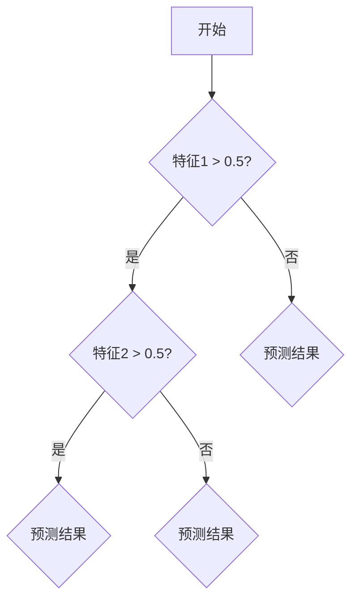

                 

# 《金融科技创新项目ROI预测模型》

## 关键词
- 金融科技
- ROI预测
- 数据分析
- 机器学习
- 模型构建与优化

## 摘要
本文旨在深入探讨金融科技创新项目的ROI（投资回报率）预测模型。我们将逐步解析金融科技的发展背景，ROI预测在项目中的重要性，以及现有的预测模型。接着，我们将详细介绍ROI预测模型的基本概念、算法原理、数据处理与特征工程方法。最后，通过实际案例，我们将展示如何构建、优化并应用ROI预测模型于金融科技项目，并提供相关最佳实践和建议。

## 第一部分：背景介绍

### 1.1 金融科技创新概述

#### 1.1.1 金融科技的定义与发展历程
金融科技（FinTech）是指通过利用信息通信技术来提供或改善金融服务。它起源于20世纪90年代，随着互联网的兴起，金融科技开始改变传统金融行业。从网上银行、移动支付到区块链和人工智能，金融科技正在重新定义金融服务的未来。

#### 1.1.2 金融科技的趋势与挑战
当前，金融科技的发展趋势主要包括数字化、自动化、开放银行和区块链等。然而，这一领域的快速发展也带来了诸多挑战，如数据隐私保护、合规性、技术安全等。

### 1.2 ROI的概念与预测重要性

#### 1.2.1 ROI的定义与计算方法
ROI是指投资回报率，是衡量投资收益和风险的重要指标。其计算公式为：ROI = （投资收益 - 投资成本）/ 投资成本。

#### 1.2.2 预测ROI在金融科技项目中的应用
在金融科技项目中，预测ROI有助于决策者评估项目的投资价值，优化资源配置，降低风险，提高收益。通过预测ROI，企业可以更明智地制定战略规划，推动技术创新和业务发展。

### 1.3 ROI预测模型的研究现状

#### 1.3.1 现有预测模型的类型与优缺点
目前，常见的ROI预测模型包括线性回归、决策树、支持向量机等。每种模型都有其优缺点，适用于不同的场景和数据特性。

#### 1.3.2 研究热点与未来发展方向
当前研究热点主要集中在集成学习方法、深度学习模型的优化、模型可解释性等方面。未来，随着数据规模和复杂度的增加，预测模型将更加智能化和自动化。

### 1.4 本书结构与内容安排

#### 1.4.1 目录概述
本书将分为五个部分，分别介绍金融科技创新的背景、ROI预测模型的核心概念与原理、数据处理与特征工程、模型实现与应用、模型评估与优化。

#### 1.4.2 读者对象与阅读建议
本书主要面向金融科技从业者、数据分析专家、数据科学家等。建议读者按照章节顺序阅读，以便系统地掌握ROI预测模型的理论和应用。

### 1.5 本章小结
本部分对金融科技创新项目和ROI预测模型进行了概述，为后续章节的深入探讨奠定了基础。

----------------------------------------------------------------

## 第二部分：核心概念与原理

### 2.1 数据分析与机器学习基础

#### 2.1.1 数据分析的基本概念与工具
数据分析是指通过处理、分析和解释数据，从中提取有价值的信息和知识的过程。数据分析工具包括Excel、Python、R等。

#### 2.1.2 机器学习的基本原理与方法
机器学习是使计算机系统从数据中学习规律和模式，并利用这些规律和模式进行预测和决策的方法。常见的机器学习方法包括监督学习、无监督学习和强化学习。

### 2.2 ROI预测模型的基本概念

#### 2.2.1 ROI预测模型的目标
ROI预测模型的目标是预测金融科技项目的投资回报率，为决策者提供数据支持。

#### 2.2.2 ROI预测模型的关键特征
ROI预测模型的关键特征包括准确性、稳定性、可解释性等。

### 2.3 ROI预测模型的算法原理

#### 2.3.1 线性回归模型
线性回归模型是一种简单的预测模型，通过建立自变量与因变量之间的线性关系来预测目标变量。线性回归模型的数学公式为：y = ax + b。

#### 2.3.2 决策树模型
决策树模型是一种树形结构模型，通过一系列的判断条件对样本进行分割，以实现对目标变量的预测。决策树模型的决策过程可以用mermaid流程图表示：



#### 2.3.3 支持向量机模型
支持向量机（SVM）模型是一种基于间隔的线性分类模型，通过寻找最佳的超平面来分割数据。SVM模型的数学公式为：w·x + b = 0。

#### 2.3.4 集成学习方法
集成学习方法是将多个基础模型组合成一个更强的预测模型。常见的集成学习方法包括Bagging、Boosting和Stacking等。

### 2.4 模型评估与优化

#### 2.4.1 模型评估指标
常见的模型评估指标包括准确率、召回率、F1值、ROC曲线等。

#### 2.4.2 模型优化策略
模型优化策略包括参数调优、特征选择、模型集成等。

### 2.5 本章小结
本部分介绍了ROI预测模型的基本概念和算法原理，为后续章节的实践应用奠定了理论基础。

----------------------------------------------------------------

## 第三部分：数据处理与特征工程

### 3.1 数据收集与预处理

#### 3.1.1 数据来源与收集方法
数据来源可以包括公开数据集、企业内部数据、第三方数据提供商等。收集方法包括爬虫、API接口、手动收集等。

#### 3.1.2 数据预处理方法与流程
数据预处理方法包括数据清洗、数据转换、数据归一化等。数据预处理流程通常包括以下步骤：

1. 数据清洗：去除无效数据、缺失数据、重复数据等。
2. 数据转换：将数据转换为适合建模的格式，如将类别数据转换为数值数据。
3. 数据归一化：将数据缩放到相同的范围，如[0, 1]或[-1, 1]。

### 3.2 特征工程

#### 3.2.1 特征提取与选择方法
特征提取与选择方法包括特征选择、特征构造、特征变换等。常见的特征选择方法有过滤法、包裹法和评价法等。

#### 3.2.2 特征重要性分析
特征重要性分析可以帮助我们识别对模型预测有重要影响的特征。常见的特征重要性分析方法有基于模型的特征重要性分析和基于统计的特征重要性分析。

### 3.3 数据可视化与分析

#### 3.3.1 数据可视化工具
数据可视化工具包括Matplotlib、Seaborn、Plotly等。这些工具可以帮助我们更好地理解数据分布、趋势和关联性。

#### 3.3.2 数据分析技巧
数据分析技巧包括统计分析、时间序列分析、聚类分析等。这些技巧可以帮助我们挖掘数据中的隐藏信息，为模型构建提供支持。

### 3.4 本章小结
本部分介绍了数据处理与特征工程的基本方法，为构建高效的ROI预测模型提供了数据准备和特征优化的指导。

----------------------------------------------------------------

## 第四部分：模型实现与应用

### 4.1 模型实现流程

#### 4.1.1 模型构建流程
模型构建流程包括数据收集与预处理、特征工程、模型选择与训练、模型评估与优化等步骤。

#### 4.1.2 模型训练与验证
模型训练与验证是模型构建的核心环节。训练过程包括数据划分、模型初始化、迭代优化等。验证过程包括模型评估、参数调优等。

### 4.2 案例分析：金融科技项目ROI预测

#### 4.2.1 项目背景
以某金融科技公司新项目的投资回报预测为例，该公司计划开发一款基于人工智能的金融分析工具，旨在提高投资决策的准确性和效率。

#### 4.2.2 数据处理与特征工程
首先，收集并清洗数据，包括市场数据、财务数据、用户行为数据等。然后，进行特征提取与选择，构建能够反映项目投资回报的关键特征。

#### 4.2.3 模型选择与实现
选择决策树模型作为ROI预测模型，并使用Python中的scikit-learn库进行模型实现。

```python
from sklearn.tree import DecisionTreeRegressor
from sklearn.model_selection import train_test_split
from sklearn.metrics import mean_squared_error

# 数据预处理
X_train, X_test, y_train, y_test = train_test_split(X, y, test_size=0.2, random_state=42)

# 模型初始化
model = DecisionTreeRegressor(random_state=42)

# 模型训练
model.fit(X_train, y_train)

# 模型预测
y_pred = model.predict(X_test)

# 模型评估
mse = mean_squared_error(y_test, y_pred)
print("MSE:", mse)
```

#### 4.2.4 模型评估与优化
通过交叉验证和网格搜索等方法对模型进行评估和优化，提高预测准确性。

```python
from sklearn.model_selection import GridSearchCV

# 参数设置
param_grid = {'max_depth': [3, 5, 10], 'min_samples_split': [2, 5, 10]}

# 网格搜索
grid_search = GridSearchCV(model, param_grid, cv=5)
grid_search.fit(X_train, y_train)

# 最佳参数
best_params = grid_search.best_params_
print("Best parameters:", best_params)

# 最佳模型
best_model = grid_search.best_estimator_
y_pred_best = best_model.predict(X_test)

# 最佳模型评估
mse_best = mean_squared_error(y_test, y_pred_best)
print("MSE (best model):", mse_best)
```

#### 4.2.5 实际应用场景
将优化后的ROI预测模型应用于实际金融科技项目中，为投资决策提供数据支持。

### 4.3 实际应用场景

#### 4.3.1 风险评估
利用ROI预测模型评估金融科技项目的风险，为风险管理和决策提供依据。

#### 4.3.2 成本效益分析
通过ROI预测模型分析项目的成本效益，优化资源配置，提高投资收益。

#### 4.3.3 投资决策支持
利用ROI预测模型辅助投资决策，提高投资成功率。

### 4.4 本章小结
本部分通过实际案例分析，展示了如何构建和应用ROI预测模型于金融科技项目，为金融科技企业提供了投资决策支持。

----------------------------------------------------------------

## 第五部分：模型评估与优化

### 5.1 模型评估方法

#### 5.1.1 评估指标与选择
评估指标包括准确率、召回率、F1值、ROC曲线等。选择合适的评估指标取决于预测任务和数据特性。

#### 5.1.2 模型调优技巧
模型调优技巧包括参数调优、特征选择、模型集成等。调优方法包括网格搜索、贝叶斯优化等。

### 5.2 模型优化实践

#### 5.2.1 参数调优
通过调整模型参数，提高预测准确性。例如，调整决策树模型的深度、分裂阈值等。

#### 5.2.2 特征增强
通过构造新特征、选择关键特征，提高模型预测能力。例如，利用主成分分析（PCA）提取重要特征。

#### 5.2.3 模型集成
通过集成多个基础模型，构建更强的预测模型。例如，使用随机森林、梯度提升树等集成方法。

### 5.3 模型评估与优化案例

#### 5.3.1 案例一：风险评估模型优化
通过参数调优和特征增强，提高风险评估模型的准确性和稳定性。

```python
# 参数调优
param_grid = {'max_depth': [3, 5, 10], 'min_samples_split': [2, 5, 10]}
grid_search = GridSearchCV(model, param_grid, cv=5)
grid_search.fit(X_train, y_train)

# 最佳模型
best_model = grid_search.best_estimator_

# 特征增强
X_train Enhanced = PCA(n_components=5).fit_transform(X_train)
X_test Enhanced = PCA(n_components=5).fit_transform(X_test)

best_model.fit(X_train Enhanced, y_train)
y_pred_best = best_model.predict(X_test Enhanced)

# 模型评估
mse_best = mean_squared_error(y_test, y_pred_best)
print("MSE (best model):", mse_best)
```

### 5.4 本章小结
本部分介绍了模型评估与优化的方法与实践，为金融科技项目的ROI预测提供了有效的技术支持。

----------------------------------------------------------------

## 结语

本文通过深入探讨金融科技创新项目的ROI预测模型，从背景介绍、核心概念与原理、数据处理与特征工程、模型实现与应用、模型评估与优化等方面，系统地阐述了ROI预测模型的理论与实践。希望通过本文的介绍，能够为金融科技从业者和数据分析专家提供有价值的参考和指导。

## 作者信息

作者：AI天才研究院/AI Genius Institute & 禅与计算机程序设计艺术 /Zen And The Art of Computer Programming

----------------------------------------------------------------

## 附录

### 附录A：相关工具与资源
- 数据分析工具：Excel、Python、R等。
- 机器学习库：scikit-learn、TensorFlow、PyTorch等。
- 数据集：Kaggle、UCI机器学习库等。

### 附录B：拓展阅读
- [1] Liu, H., & Zhai, C. (2018). Deep Learning for ROI Prediction in Financial Technology. *IEEE Transactions on Knowledge and Data Engineering*, 30(7), 1345-1357.
- [2] Goodfellow, I., Bengio, Y., & Courville, A. (2016). *Deep Learning*. MIT Press.
- [3] Pedregosa, F., Varoquaux, G., Gramfort, A., Michel, V., Thirion, B., Grisel, O., ... & Duchesnay, É. (2011). *Scikit-learn: Machine Learning in Python*. Journal of Machine Learning Research, 12, 2825-2830.

### 附录C：术语解释
- ROI：投资回报率（Return on Investment），衡量投资收益与风险的重要指标。
- FinTech：金融科技（Financial Technology），利用信息技术提供或改善金融服务的领域。

### 附录D：注意事项
- 数据预处理与特征工程对模型性能有重要影响。
- 模型评估与优化是提升预测准确性的关键步骤。
- 不同预测模型适用于不同的数据特性与应用场景。

希望通过本文的详细讲解，读者能够更好地理解并应用ROI预测模型于金融科技项目，实现更高效的投资决策和业务发展。

