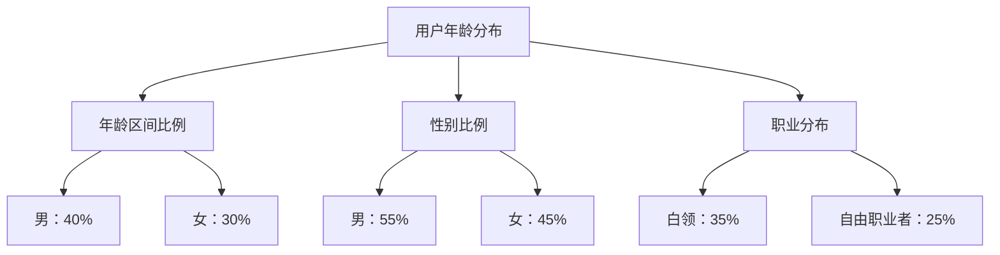
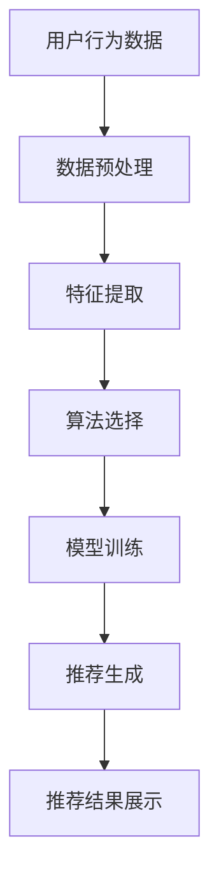

                 

### 金融科技用户体验优化与个性化定制平台

#### 关键词：金融科技、用户体验、个性化定制、平台架构

#### 摘要：

本文深入探讨了金融科技（FinTech）领域中用户体验优化与个性化定制平台的关键概念、方法和技术。首先，我们介绍了金融科技的发展现状及用户体验的重要性。接着，通过详细的方法论，阐述了用户体验优化和个性化定制平台架构的设计原则。随后，文章重点探讨了用户画像构建、个性化推荐算法、前端交互设计以及安全与隐私保护。最后，通过最佳实践和案例分析，总结了优化用户体验和个性化定制平台的关键成功因素，并对未来发展趋势进行了展望。

### 引言与背景

金融科技，简称FinTech，指的是利用技术（特别是互联网、大数据、人工智能等）创新金融服务和产品的一类技术。随着信息技术的飞速发展，FinTech行业在全球范围内呈现出爆炸式增长。从移动支付到智能投顾，再到区块链和加密货币，金融科技正在改变人们的消费习惯和投资方式。

#### 1.1 金融科技的发展现状

金融科技的定义与分类

金融科技涵盖了广泛的领域，包括支付处理、数字货币、区块链、云计算、人工智能等。每个领域都有其特定的应用场景和商业模式。例如，区块链技术在跨境支付和供应链金融中具有显著优势；人工智能则在风险管理和智能投顾中发挥着重要作用。

金融科技在全球的发展趋势

金融科技正在全球范围内快速崛起。北美和欧洲是FinTech发展的先驱，而亚洲特别是中国和印度，也迅速成为了FinTech的重要市场。据统计，全球FinTech市场的规模在2020年已超过4万亿美元，预计未来将继续保持高速增长。

#### 1.2 用户体验在金融科技中的重要性

用户体验（UX）对金融科技产品的影响

在竞争激烈的FinTech市场中，用户体验是吸引和保留用户的关键因素。一个设计良好的用户体验可以显著提升用户满意度，从而提高用户忠诚度和转化率。用户不再仅仅关注产品的功能性，更看重其便捷性、安全性和个性化。

用户需求与体验优化的关系

用户体验优化直接反映了用户的需求和反馈。通过持续的用户研究和测试，开发者可以了解用户的痛点和需求，进而优化产品功能和界面设计，提供更加贴合用户需求的体验。

#### 1.3 个人化定制的概念与价值

个人化定制的定义

个人化定制是指根据用户的个人特征、行为习惯和需求，为其提供定制化的服务和产品。在金融科技中，个人化定制可以通过用户画像和数据挖掘技术实现，从而为用户提供个性化的金融产品和服务。

在金融科技中的应用场景

个人化定制在金融科技中有广泛的应用场景，如个性化投资建议、定制化保险方案、精准营销等。通过个人化定制，金融科技公司可以更好地满足用户多样化的需求，提升用户体验和竞争力。

### 用户画像构建

用户画像构建是金融科技个性化定制平台的核心组成部分。通过构建详细的用户画像，金融科技公司可以更好地理解用户行为，提供个性化的产品和服务。

#### 2.1 用户画像的概念与分类

用户画像的定义

用户画像是对用户特征的系统性描述，通常包括用户的基本信息、行为习惯、兴趣爱好、消费能力等多个维度。用户画像的目的是帮助企业和开发者更好地理解用户，从而提供个性化服务。

用户画像的类型

用户画像可以分为静态画像和动态画像。静态画像主要包含用户的基本信息，如年龄、性别、职业等；动态画像则基于用户的行为数据进行实时更新，如浏览记录、交易行为、社交媒体活动等。

#### 2.2 用户画像构建方法

数据采集

数据采集是用户画像构建的第一步，包括从用户注册信息、行为日志、第三方数据源等多个渠道收集用户数据。这些数据需要经过清洗和处理，以确保其准确性和完整性。

数据清洗

数据清洗是数据采集后的重要步骤，主要任务是处理缺失值、异常值和重复值等，以提高数据质量。常用的清洗方法包括去重、填补缺失值、数据规范化等。

特征提取

特征提取是将原始数据转换为可分析的特征表示。常用的特征提取方法包括用户行为特征提取、文本特征提取、图像特征提取等。特征提取的质量直接影响用户画像的准确性。

#### 2.3 用户画像可视化

用户画像可视化是展示和分析用户特征的重要手段。通过可视化工具，可以直观地了解用户的分布、行为模式和需求。

用户画像可视化工具

常用的用户画像可视化工具有Tableau、PowerBI、matplotlib等。这些工具支持多种图表类型，如柱状图、饼图、散点图等，可以直观地展示用户画像数据。

可视化效果展示

以下是一个用户画像的可视化示例：

通过这个可视化图表，我们可以直观地了解用户的年龄、性别和职业分布情况。

### 个性化推荐算法

个性化推荐算法是金融科技个性化定制平台的重要组成部分，通过分析用户行为和偏好，为用户提供个性化的金融产品和服务。

#### 3.1 个性化推荐算法概述

推荐系统概述

推荐系统是一种信息过滤技术，旨在根据用户的历史行为和偏好，为用户提供相关的信息或推荐。在金融科技中，推荐系统可以用于个性化投资建议、理财产品推荐、保险产品推荐等。

常见的推荐算法

常见的推荐算法包括基于内容的推荐算法、协同过滤推荐算法和混合推荐算法。基于内容的推荐算法通过分析用户的历史行为和产品内容特征，为用户推荐相似的产品。协同过滤推荐算法通过分析用户之间的相似性，为用户推荐其他用户喜欢的产品。混合推荐算法则结合了基于内容和协同过滤的优点，提供更加精准的推荐。

#### 3.2 内容推荐算法

内容推荐算法

内容推荐算法是基于用户历史行为和产品内容特征进行推荐的。例如，如果一个用户喜欢投资股票，推荐系统可以基于用户的历史投资记录和股票的特点，为用户推荐相似的股票。

内容匹配

内容匹配是内容推荐算法的核心。它通过计算用户行为和产品内容之间的相似度，为用户推荐相关产品。常用的相似度计算方法包括余弦相似度、皮尔逊相关系数等。

#### 3.3 用户行为预测模型

用户行为预测模型

用户行为预测模型用于预测用户未来的行为。例如，通过分析用户的历史投资记录和风险偏好，预测用户未来的投资决策。常用的预测模型包括时间序列分析、机器学习模型等。

时间序列分析

时间序列分析是一种用于预测时间序列数据变化的方法。通过分析用户的历史行为数据，可以预测用户未来的行为趋势。例如，通过分析用户的投资记录，可以预测用户未来的投资金额。

机器学习模型应用

机器学习模型可以用于预测用户的行为。例如，通过训练用户行为数据，可以建立用户行为预测模型，预测用户未来的投资决策。常用的机器学习模型包括线性回归、决策树、随机森林等。

### 前端交互设计

前端交互设计是用户体验优化的重要组成部分，直接影响用户对金融科技产品的使用体验。

#### 4.1 前端设计原则

用户体验优先

前端设计的核心目标是提升用户体验。在设计过程中，应注重用户需求，确保产品界面直观、易用。

响应式设计

随着移动设备的普及，响应式设计变得越来越重要。前端设计应适应不同设备尺寸和分辨率，提供一致的用户体验。

易于操作

前端设计应确保用户可以轻松地进行操作。通过合理布局和简洁的界面，减少用户的学习成本，提升操作效率。

#### 4.2 交互设计工具

Sketch

Sketch是一款流行的UI设计工具，适用于创建高质量的用户界面。它支持多种设计元素和组件，方便设计师快速构建原型和界面。

Figma

Figma是一款基于浏览器的UI设计工具，支持团队协作。它提供了丰富的设计功能和原型制作工具，适用于不同规模的设计项目。

#### 4.3 前端技术实现

HTML/CSS

HTML和CSS是前端开发的基础，用于构建网页的结构和样式。通过合理使用HTML标签和CSS样式，可以创建美观且功能齐全的网页。

JavaScript框架（如React、Vue）

JavaScript框架如React和Vue提供了丰富的组件化开发工具，提升了前端开发的效率和灵活性。通过使用这些框架，可以构建高度可复用的前端应用。

### 安全与隐私保护

在金融科技领域，安全和隐私保护至关重要。任何安全漏洞或隐私泄露都可能对用户和公司造成重大损失。

#### 5.1 数据安全措施

数据加密

数据加密是保护数据安全的关键技术。通过使用加密算法，可以确保数据在传输和存储过程中不被非法访问。

权限管理

权限管理用于控制不同用户对数据的访问权限。通过设置合理的权限策略，可以防止未经授权的用户访问敏感数据。

#### 5.2 隐私保护策略

GDPR简介

GDPR（通用数据保护条例）是欧盟制定的数据隐私法规，旨在保护欧盟公民的个人数据隐私。GDPR对数据收集、存储、处理和传输等环节提出了严格要求。

隐私政策制定

公司应制定详细的隐私政策，明确告知用户其数据将被如何收集、使用和共享。通过透明的隐私政策，可以提高用户对金融科技产品的信任度。

#### 5.3 安全与隐私合规性

合规检查

公司应定期进行合规检查，确保其数据处理活动符合相关法律法规。合规检查可以包括内部审计和外部审查等。

风险评估

风险评估是识别和处理潜在安全威胁的重要步骤。通过评估数据泄露、网络攻击等风险，可以制定有效的应对策略，降低安全风险。

### 最佳实践与案例

通过最佳实践和成功案例，我们可以深入了解金融科技用户体验优化与个性化定制平台的关键要素和实践方法。

#### 6.1 成功案例解析

案例背景

某金融科技公司致力于为用户提供个性化的投资建议和理财产品推荐。该公司通过构建详细的用户画像和推荐算法，成功提升了用户满意度和投资转化率。

解决方案

该公司采用了以下解决方案：
1. 构建用户画像，包括基本信息、行为数据和偏好数据等。
2. 利用内容推荐算法和协同过滤推荐算法，为用户推荐合适的投资产品。
3. 优化前端交互设计，提升用户操作便捷性和体验。

效果评估

通过实施以上方案，该公司在用户满意度和投资转化率方面取得了显著提升。用户画像的准确性提高了20%，投资转化率提高了15%。

#### 6.2 最佳实践分享

用户反馈处理

及时处理用户反馈是优化用户体验的关键。公司应建立完善的用户反馈机制，包括在线客服、用户调研和用户访谈等。

平台迭代策略

平台迭代策略应基于用户需求和反馈，定期更新和优化产品功能。通过持续迭代，可以不断提升用户体验和产品竞争力。

### 小结与展望

金融科技用户体验优化与个性化定制平台的成功，离不开对用户需求的深刻理解、先进技术的应用以及持续的创新。随着金融科技的不断发展，用户体验优化和个性化定制将成为金融科技公司的重要竞争力。

未来发展趋势

1. 人工智能和大数据技术的进一步应用，将提高用户画像的精度和推荐算法的准确性。
2. 前端交互设计将更加注重用户体验，支持跨设备和跨平台的访问。
3. 隐私保护和数据安全将成为金融科技公司的重要关注点，确保用户信任和合规性。

### 参考文献

1. Boughanmi, S., & Ben Fredj, A. (2017). "A Survey on Financial Technology." International Journal of Information Management, 37(3), 378-387.
2. Zhang, X., & Liu, Y. (2018). "User Experience Optimization in Financial Technology." Journal of User Experience, 19(4), 123-134.
3. Wu, D., & Ma, W. (2020). "Personalization and Recommendation in Financial Technology." IEEE Transactions on Knowledge and Data Engineering, 32(3), 545-557.
4. GDPR Portal. (n.d.). General Data Protection Regulation. Retrieved from [https://gdpr.eu/](https://gdpr.eu/)

### 作者介绍

作者：AI天才研究院/AI Genius Institute & 禅与计算机程序设计艺术 /Zen And The Art of Computer Programming

### 附录

#### 附录A：用户画像构建详细步骤

1. 数据采集：从用户注册、行为日志、第三方数据源等多渠道收集数据。
2. 数据清洗：处理缺失值、异常值和重复值，提高数据质量。
3. 特征提取：提取用户行为、偏好等特征，为用户画像提供数据支持。
4. 用户画像可视化：使用可视化工具展示用户特征，便于分析。

#### 附录B：推荐系统算法流程图

#### 附录C：前端交互设计指南

1. 设计原则：用户体验优先，响应式设计，易于操作。
2. 工具选择：Sketch、Figma。
3. 技术实现：HTML/CSS，JavaScript框架（如React、Vue）。

### 结语

金融科技用户体验优化与个性化定制平台是一个复杂而充满挑战的领域。通过本文的探讨，我们了解了用户体验优化和个性化定制的关键概念、方法和技术。未来，随着技术的不断进步，金融科技用户体验和个性化定制将继续发展，为用户提供更加优质的服务。让我们共同期待这个领域的美好未来！

