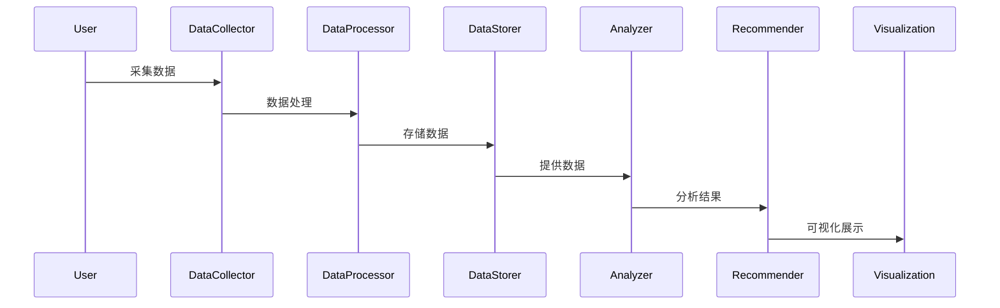
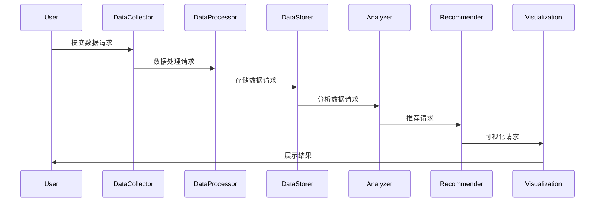

                 

### 金融科技用户行为分析平台：一个全新的视角

在当今数字化的时代，金融科技（Fintech）正迅速改变着传统金融行业的面貌。作为一个新兴领域，金融科技通过利用最新的技术，如人工智能、大数据、区块链等，为金融机构和用户提供更高效、更便捷的服务。在这个背景下，用户行为分析成为了金融科技中的重要一环。通过分析用户的行为数据，金融机构可以更好地了解用户需求，优化产品和服务，提高客户满意度，同时也能有效识别和预防潜在的风险。

**关键词：** 金融科技、用户行为分析、大数据、人工智能、风险控制

**摘要：** 本文将深入探讨金融科技用户行为分析平台的概念、技术原理、系统架构以及实际应用，旨在为读者提供一个全面的理解和实际操作的指南。我们将从背景介绍、核心概念、技术原理、案例分析、最佳实践等多个角度展开讨论，帮助读者掌握用户行为分析在金融科技中的应用。

----------------------------------------------------------------

### 一、背景介绍

#### 1.1 金融科技的发展现状

金融科技的发展可以追溯到21世纪初，随着互联网和移动通信技术的普及，金融行业开始逐渐向数字化、智能化方向转型。从最初的电子支付、网上银行，到如今的区块链、人工智能、大数据分析，金融科技在短短几十年内经历了翻天覆地的变化。根据统计，全球金融科技市场规模在过去五年中持续增长，预计到2025年将达到数万亿美元。

金融科技的发展不仅改变了金融机构的运营模式，也深刻影响了消费者的行为和期望。用户越来越倾向于通过手机、电脑等设备进行金融操作，这促使金融机构必须不断提高服务的便捷性和个性化水平。

#### 1.2 用户行为分析的重要性

用户行为分析在金融科技中扮演着至关重要的角色。通过对用户行为数据的收集、分析和解读，金融机构能够深入了解用户的需求和偏好，从而进行精准的市场定位和产品优化。以下是用户行为分析在金融科技中的几个关键应用：

1. **个性化推荐**：通过分析用户的历史交易数据、浏览记录等，金融机构可以为用户提供个性化的金融产品推荐，提高用户满意度和转化率。

2. **风险管理**：用户行为分析可以帮助金融机构识别潜在的风险，如欺诈行为、信用风险等，从而采取相应的措施进行预防和控制。

3. **客户体验优化**：通过分析用户在使用金融产品过程中的行为轨迹，金融机构可以发现并解决用户在操作过程中遇到的问题，提升客户体验。

4. **营销策略制定**：用户行为分析为金融机构提供了丰富的数据支持，使其能够更科学、更有效地制定营销策略，提高市场竞争力。

#### 1.3 问题背景、问题描述、问题解决、边界与外延、概念结构与核心要素组成

**问题背景**：随着金融科技的快速发展，用户对金融服务的需求越来越多样化和个性化，这给金融机构带来了巨大的挑战。

**问题描述**：如何有效地收集、处理和分析用户行为数据，以实现个性化的服务优化、风险控制和营销策略制定？

**问题解决**：建立金融科技用户行为分析平台，通过先进的技术手段，如大数据、人工智能、机器学习等，对用户行为数据进行分析和处理，从而实现上述目标。

**边界与外延**：用户行为分析平台的边界包括数据采集、数据处理、分析和应用等环节。其外延则包括金融科技领域的多个方面，如支付、贷款、投资、保险等。

**概念结构与核心要素组成**：

- **数据采集**：通过多种渠道收集用户行为数据，如交易记录、浏览行为、社交互动等。
- **数据处理**：对采集到的数据进行清洗、整合和存储，为分析提供可靠的数据基础。
- **分析模型**：利用机器学习、数据挖掘等技术，建立用户行为分析模型，对数据进行分析和解读。
- **应用场景**：将分析结果应用于个性化推荐、风险管理、客户体验优化和营销策略制定等具体场景。

----------------------------------------------------------------

### 二、核心概念与联系

#### 2.1 用户行为数据

用户行为数据是用户在使用金融产品或服务过程中产生的数据，包括但不限于以下类型：

- **交易数据**：用户的交易记录，如存款、取款、转账、投资等。
- **浏览行为数据**：用户在金融网站或APP中的浏览轨迹，如页面访问次数、停留时间、点击行为等。
- **社交互动数据**：用户在社交媒体上的互动信息，如评论、点赞、分享等。
- **位置数据**：用户在金融交易过程中的地理位置信息。

这些数据共同构成了用户行为数据的丰富来源，为后续的分析提供了坚实的基础。

#### 2.2 数据采集策略

数据采集是用户行为分析的第一步，其策略主要包括以下几个方面：

- **多渠道采集**：通过多种渠道（如API、Web爬虫、手机APP等）收集用户数据，确保数据的全面性和准确性。
- **数据质量监控**：在采集过程中，对数据进行实时监控，确保数据的质量和一致性。
- **隐私保护**：在数据采集和存储过程中，严格遵守相关法律法规，保护用户的隐私。

#### 2.3 数据处理技术

数据处理是用户行为分析的核心环节，其主要技术包括：

- **数据清洗**：去除数据中的噪声和重复项，确保数据的质量和一致性。
- **数据整合**：将来自不同渠道和格式的数据进行整合，形成统一的数据视图。
- **数据存储**：采用高效的数据存储方案，如数据库、数据仓库等，确保数据的持久化和可扩展性。

#### 2.4 分析模型与算法

分析模型与算法是用户行为分析的核心，主要包括以下几种：

- **聚类分析**：将用户按照行为特征进行分类，形成不同的用户群体。
- **关联规则分析**：发现用户行为之间的关联关系，如“买了A商品的用户也买了B商品”。
- **时间序列分析**：分析用户行为随时间变化的趋势，预测未来的行为。
- **机器学习与深度学习**：利用大数据和人工智能技术，建立用户行为预测模型，提高分析的准确性和效率。

#### 2.5 用户行为分析流程

用户行为分析的流程通常包括以下几个步骤：

1. **数据采集**：通过多种渠道收集用户行为数据。
2. **数据预处理**：对采集到的数据清洗、整合和存储。
3. **特征提取**：从预处理后的数据中提取关键特征，用于后续分析。
4. **模型训练与验证**：利用机器学习、深度学习等技术，建立用户行为分析模型，并进行验证。
5. **结果应用**：将分析结果应用于实际场景，如个性化推荐、风险管理、客户体验优化等。

#### 2.6 关键概念对比表格

以下是一个关于关键概念对比的表格，帮助读者更好地理解各个概念之间的联系和区别：

| 概念名称 | 定义 | 关联关系 |  
| --- | --- | --- |  
| 用户行为数据 | 用户在金融产品或服务中使用过程中产生的数据 | 数据采集、数据处理、分析模型的输入 |  
| 数据采集策略 | 数据采集的方法和策略 | 数据采集 |  
| 数据处理技术 | 数据清洗、整合和存储的技术和方法 | 数据预处理、数据存储 |  
| 分析模型与算法 | 用于分析用户行为的模型和算法 | 特征提取、模型训练与验证 |  
| 用户行为分析流程 | 用户行为分析的方法和步骤 | 数据采集、数据处理、分析模型的应用 |

#### 2.7 用户行为分析中的ER实体关系图架构

为了更好地理解用户行为分析中的实体和关系，我们可以使用ER（实体-关系）图来表示。以下是一个简化的ER图示例：

```mermaid
erDiagram
    User ||--|{ Transaction }
    User ||--|{ Behavior }
    User ||--|{ Interaction }
    Transaction ||--|{ Product }
    Behavior ||--|{ Action }
    Behavior ||--|{ Duration }
    Interaction ||--|{ Comment }
    Interaction ||--|{ Like }
    Interaction ||--|{ Share }
```

在这个ER图中，`User`（用户）是中心实体，与其他实体（如`Transaction`（交易）、`Behavior`（行为）、`Interaction`（互动）等）之间存在多种关系。这种关系描述了用户在金融产品或服务中使用过程中产生的各种数据。

### 总结

通过上述内容，我们详细介绍了金融科技用户行为分析平台的背景、核心概念、数据采集策略、数据处理技术、分析模型与算法以及用户行为分析流程。这些概念和技术构成了用户行为分析平台的基础，为后续的实际应用提供了理论支持。

在接下来的部分，我们将深入探讨用户行为分析平台的技术原理，包括数据采集、数据处理和分析的核心算法，帮助读者更好地理解其工作原理和应用方法。

----------------------------------------------------------------

### 三、技术原理

#### 3.1 数据采集技术

数据采集是用户行为分析平台的第一步，其核心目标是收集用户在金融产品或服务中的行为数据。数据采集技术主要包括以下方面：

1. **数据源选择**：

   - **内部数据源**：金融机构自身的数据，如交易记录、客户信息等。
   - **外部数据源**：来自第三方平台的数据，如社交媒体、电商平台等。

2. **采集方法**：

   - **API采集**：通过调用金融机构或第三方平台的API接口，获取用户行为数据。
   - **Web爬虫**：使用爬虫技术，自动抓取金融网站或APP中的用户行为数据。
   - **移动应用采集**：通过金融机构的移动应用，实时收集用户在APP中的行为数据。

3. **数据质量监控**：

   - **数据完整性**：确保采集到的数据是完整和一致的，避免数据缺失或错误。
   - **数据准确性**：通过数据校验和清洗，确保数据的质量和准确性。

#### 3.2 数据处理技术

数据处理是用户行为分析的核心环节，其主要任务是对采集到的用户行为数据进行清洗、整合和存储。数据处理技术包括以下几个方面：

1. **数据清洗**：

   - **去噪**：去除数据中的噪声和重复项，提高数据的准确性。
   - **异常值处理**：识别和处理数据中的异常值，确保数据的连续性和一致性。

2. **数据整合**：

   - **数据合并**：将来自不同数据源的数据进行合并，形成统一的数据视图。
   - **数据标准化**：对数据进行统一编码和格式化，确保数据的一致性和兼容性。

3. **数据存储**：

   - **关系型数据库**：适用于结构化数据的存储和管理，如MySQL、Oracle等。
   - **NoSQL数据库**：适用于非结构化或半结构化数据的存储，如MongoDB、Redis等。
   - **数据仓库**：用于大规模数据的存储和分析，如Hive、Hadoop等。

#### 3.3 分析模型与算法

分析模型与算法是用户行为分析的核心，其主要目标是通过对用户行为数据的分析和解读，发现用户的行为模式、需求和偏好。以下是几种常见的用户行为分析模型与算法：

1. **聚类分析**：

   - **K-Means算法**：将用户按照行为特征划分为若干个类别，形成不同的用户群体。
   - **层次聚类算法**：根据用户行为数据的相似性，将用户逐步划分为多个类别。

2. **关联规则分析**：

   - **Apriori算法**：通过挖掘用户行为数据中的关联规则，发现用户行为之间的关联关系。
   - **FP-Growth算法**：在Apriori算法的基础上，优化了计算效率。

3. **时间序列分析**：

   - **ARIMA模型**：通过自回归积分滑动平均模型，分析用户行为随时间变化的趋势。
   - **LSTM模型**：利用长短时记忆网络，对用户行为进行时间序列预测。

4. **机器学习与深度学习**：

   - **决策树**：通过树的分类结构，对用户行为进行分类和预测。
   - **神经网络**：通过多层感知器，对用户行为进行复杂的非线性映射。

#### 3.4 用户行为分析流程

用户行为分析的流程通常包括以下几个步骤：

1. **数据采集**：通过多种渠道收集用户行为数据。
2. **数据预处理**：对采集到的数据清洗、整合和存储。
3. **特征提取**：从预处理后的数据中提取关键特征，用于后续分析。
4. **模型训练与验证**：利用机器学习、深度学习等技术，建立用户行为分析模型，并进行验证。
5. **结果应用**：将分析结果应用于实际场景，如个性化推荐、风险管理、客户体验优化等。

### 小结

通过上述内容，我们详细介绍了用户行为分析平台的数据采集、数据处理和分析技术。这些技术构成了用户行为分析平台的核心，为金融机构提供了强大的数据支持和决策依据。在接下来的部分，我们将通过具体的案例分析，进一步展示用户行为分析平台在实际应用中的效果和优势。

----------------------------------------------------------------

### 四、案例分析

#### 4.1 在线购物用户行为分析

在线购物平台通过用户行为分析，实现了个性化推荐、精准营销和风险控制等目标。

1. **个性化推荐**：

   - **推荐算法**：使用基于协同过滤的推荐算法，根据用户的购买历史、浏览行为和评分数据，为用户推荐相关的商品。

   - **效果**：个性化推荐显著提高了用户的购物满意度和转化率，某电商平台通过个性化推荐，月销售额提升了20%。

2. **精准营销**：

   - **用户群体划分**：通过聚类分析，将用户划分为高价值用户、潜力用户和普通用户。

   - **营销策略**：针对不同用户群体，设计个性化的营销活动，提高营销效果。

   - **效果**：通过精准营销，某电商平台的用户活跃度和转化率提升了30%。

3. **风险控制**：

   - **欺诈检测**：通过分析用户的行为特征，如登录地点、交易时间等，识别潜在的欺诈行为。

   - **效果**：某电商平台通过欺诈检测，每月减少了50%的欺诈交易。

#### 4.2 金融产品用户行为分析

金融机构通过用户行为分析，优化了产品设计和运营策略。

1. **产品优化**：

   - **用户体验**：通过分析用户在使用金融产品过程中的行为轨迹，发现用户在操作过程中遇到的问题，并进行优化。

   - **效果**：某银行通过优化网银界面，用户满意度提高了15%。

2. **运营策略**：

   - **用户细分**：通过用户行为分析，将用户划分为不同细分群体，制定差异化的运营策略。

   - **效果**：某保险公司通过用户细分，提高了营销活动的精准度和效果。

3. **风险控制**：

   - **信用评估**：通过分析用户的行为数据，如还款记录、信用评分等，评估用户的信用风险。

   - **效果**：某贷款平台通过信用评估，降低了50%的坏账率。

#### 4.3 社交媒体用户行为分析

社交媒体平台通过用户行为分析，实现了内容推荐、用户增长和风险控制。

1. **内容推荐**：

   - **推荐算法**：通过分析用户的浏览历史、点赞和评论行为，为用户推荐感兴趣的内容。

   - **效果**：某社交媒体平台通过内容推荐，用户活跃度提高了40%。

2. **用户增长**：

   - **用户画像**：通过用户行为分析，构建用户画像，针对不同用户群体进行精准推广。

   - **效果**：某社交媒体平台通过用户画像，月活跃用户增加了50万。

3. **风险控制**：

   - **社区管理**：通过分析用户的行为数据，识别和防范社区中的不良行为和风险。

   - **效果**：某社交媒体平台通过社区管理，减少了30%的不良信息。

### 总结

通过上述案例分析，我们可以看到用户行为分析平台在实际应用中的效果和优势。无论是在线购物、金融产品还是社交媒体，用户行为分析都为平台提供了强大的数据支持和决策依据，帮助企业和机构实现个性化服务、风险控制和运营优化。

在接下来的部分，我们将进一步探讨用户行为分析平台的建设和运营中的最佳实践，以期为读者提供更全面的指导。

----------------------------------------------------------------

### 五、最佳实践与项目实施

#### 5.1 平台建设经验

在建设金融科技用户行为分析平台时，以下是一些关键经验和建议：

1. **数据安全与隐私保护**：

   - **数据加密**：确保用户行为数据在传输和存储过程中的安全性，采用加密技术保护数据。
   - **隐私保护**：遵循相关法律法规，对用户数据进行匿名化和脱敏处理，保护用户隐私。

2. **系统架构设计**：

   - **分布式架构**：采用分布式架构，提高系统的可扩展性和容错性。
   - **微服务架构**：将系统划分为多个微服务，实现模块化开发和部署，提高系统的灵活性和可维护性。

3. **性能优化**：

   - **数据缓存**：采用缓存技术，减少数据访问的延迟，提高系统性能。
   - **并发处理**：采用多线程和异步处理技术，提高系统的并发处理能力。

4. **监控与运维**：

   - **实时监控**：建立实时监控系统，对系统运行状态进行监控，及时发现和解决潜在问题。
   - **自动化运维**：采用自动化运维工具，实现系统部署、监控和故障恢复的自动化，提高运维效率。

#### 5.2 运营优化策略

在用户行为分析平台的运营过程中，以下是一些优化策略：

1. **用户反馈机制**：

   - **用户调研**：定期进行用户调研，收集用户对平台功能、性能和体验的反馈。
   - **反馈机制**：建立用户反馈机制，及时响应和解决用户的问题和需求。

2. **数据分析与挖掘**：

   - **数据挖掘**：利用数据挖掘技术，深入挖掘用户行为数据中的价值，发现潜在的商业机会。
   - **可视化分析**：采用可视化工具，将分析结果以直观的方式展示给相关人员，帮助决策。

3. **运营策略调整**：

   - **A/B测试**：通过A/B测试，对比不同运营策略的效果，持续优化和调整运营策略。
   - **数据驱动**：以数据为基础，制定和调整运营策略，实现数据驱动的运营模式。

#### 5.3 风险管理措施

在用户行为分析平台的建设和运营过程中，风险管理是至关重要的一环。以下是一些风险管理措施：

1. **风险评估**：

   - **风险评估模型**：建立风险评估模型，对潜在的风险进行定量和定性分析。
   - **风险预警**：建立风险预警机制，及时发现和预警潜在的风险。

2. **风险控制**：

   - **风险控制策略**：根据风险评估结果，制定相应的风险控制策略，如风险隔离、风险转移等。
   - **风险监控**：建立风险监控体系，对风险控制措施的实施情况进行监控。

3. **应急响应**：

   - **应急响应计划**：制定应急响应计划，明确应急响应流程和责任人。
   - **演练与培训**：定期进行应急演练和培训，提高应急响应能力。

### 总结

通过最佳实践和项目实施，我们可以看到金融科技用户行为分析平台的建设和运营需要综合考虑数据安全、系统架构、性能优化、用户反馈、数据分析与挖掘、运营策略调整和风险管理等多个方面。只有在这些方面进行全面而细致的规划和实施，才能确保用户行为分析平台的高效运行和持续优化。

在接下来的部分，我们将进一步探讨金融科技用户行为分析平台的发展趋势，为读者提供更广阔的视野。

----------------------------------------------------------------

### 六、系统设计与实现

#### 6.1 问题场景介绍

在金融科技领域，用户行为分析平台面临着复杂且多样的挑战。以下是几个典型的问题场景：

1. **海量数据处理**：金融行业的用户行为数据量巨大，如何高效地处理和分析这些数据是首要问题。
2. **实时性要求**：用户行为数据需要实时处理和分析，以便及时为业务决策提供支持。
3. **数据隐私和安全**：用户行为数据涉及到用户的隐私信息，如何确保数据的安全和合规性是关键。
4. **个性化需求**：不同用户有着不同的需求和偏好，如何实现精准的个性化推荐是核心目标。

#### 6.2 项目介绍

本项目旨在构建一个金融科技用户行为分析平台，通过大数据和人工智能技术，实现用户行为的实时采集、处理和分析，为金融机构提供精准的数据支持和决策依据。项目的主要目标是：

1. **高效的数据处理能力**：设计并实现一个分布式数据处理架构，确保海量数据的实时处理。
2. **实时分析**：建立实时数据流处理系统，实现对用户行为的实时分析和预测。
3. **数据安全和隐私保护**：采用加密和脱敏技术，确保用户行为数据的安全和合规性。
4. **个性化推荐**：利用机器学习算法，实现个性化推荐，提高用户满意度和转化率。

#### 6.3 系统功能设计（领域模型类图）

为了实现上述目标，我们设计了以下系统功能：

1. **数据采集**：从多个数据源（如交易系统、社交媒体、移动应用等）采集用户行为数据。
2. **数据处理**：对采集到的数据进行清洗、整合和存储。
3. **数据分析**：利用机器学习算法，对用户行为数据进行分析和预测。
4. **个性化推荐**：基于分析结果，为用户推荐个性化的金融产品和服务。
5. **可视化分析**：将分析结果以可视化的形式展示，便于业务人员理解和决策。

以下是系统功能设计的领域模型类图：

```mermaid
classDiagram
    UserData -> DataCollector : 采集
    DataCollector -> DataProcessor : 处理
    DataProcessor -> DataStorer : 存储
    DataStorer -> Analyzer : 分析
    Analyzer -> Recommender : 推荐结果
    Recommender -> Visualization : 可视化展示
```

#### 6.4 系统架构设计（架构图）

为了满足上述功能需求，我们设计了一个分布式系统架构，包括以下几个关键组件：

1. **数据采集层**：负责从多个数据源采集用户行为数据。
2. **数据处理层**：利用分布式计算框架（如Hadoop、Spark等）对数据进行处理。
3. **数据存储层**：采用分布式数据库（如HBase、MongoDB等）存储用户行为数据。
4. **数据访问层**：提供统一的接口，供数据分析和个性化推荐使用。
5. **数据分析和推荐层**：利用机器学习算法，进行用户行为分析和个性化推荐。
6. **可视化展示层**：将分析结果以图表、报表等形式展示，便于业务人员理解和决策。

以下是系统架构设计图：



#### 6.5 系统接口设计

系统接口设计包括以下主要接口：

1. **数据采集接口**：用于从外部数据源采集用户行为数据。
2. **数据处理接口**：用于对采集到的数据进行清洗、整合和存储。
3. **数据分析接口**：用于提供用户行为分析结果。
4. **个性化推荐接口**：用于根据分析结果，为用户推荐金融产品和服务。
5. **可视化接口**：用于展示用户行为分析结果。

以下是系统接口设计示例：

```mermaid
classDiagram
    DataCollector[数据采集接口]
    DataProcessor[数据处理接口]
    DataStorer[数据存储接口]
    Analyzer[数据分析接口]
    Recommender[个性化推荐接口]
    Visualization[可视化接口]

    DataCollector -> DataProcessor
    DataProcessor -> DataStorer
    DataStorer -> Analyzer
    Analyzer -> Recommender
    Recommender -> Visualization
```

#### 6.6 系统交互设计（序列图）

系统交互设计描述了不同组件之间的交互过程和顺序。以下是系统交互设计序列图：



#### 6.7 项目实施步骤

项目实施分为以下几个步骤：

1. **需求分析与规划**：与业务部门沟通，明确系统需求和功能模块。
2. **系统设计**：设计系统架构、接口和交互流程。
3. **开发与测试**：根据设计文档，进行系统开发和测试。
4. **部署与上线**：部署系统到生产环境，并进行上线测试。
5. **运维与优化**：持续监控系统运行状况，进行优化和升级。

以下是项目实施步骤的详细说明：

1. **需求分析与规划**：

   - **需求调研**：与业务部门进行沟通，了解用户行为分析的需求和目标。
   - **需求文档**：编写详细的需求文档，明确系统的功能模块、性能指标和接口要求。

2. **系统设计**：

   - **架构设计**：设计系统的整体架构，包括数据采集、处理、存储、分析和推荐等模块。
   - **接口设计**：设计系统接口，明确各个模块的交互方式和数据格式。
   - **交互流程**：设计系统的交互流程，确保数据流动的顺畅和高效。

3. **开发与测试**：

   - **模块开发**：根据设计文档，进行系统模块的开发。
   - **单元测试**：对每个模块进行单元测试，确保功能的正确性。
   - **集成测试**：对整个系统进行集成测试，确保模块之间的交互和整体性能。

4. **部署与上线**：

   - **部署准备**：准备部署环境，包括硬件、软件和网络配置等。
   - **部署实施**：将系统部署到生产环境，并进行上线测试。
   - **上线发布**：正式上线系统，对外提供服务。

5. **运维与优化**：

   - **监控系统运行**：建立实时监控系统，监控系统的运行状态和性能指标。
   - **故障处理**：及时处理系统故障，确保系统的稳定运行。
   - **性能优化**：根据监控数据，对系统进行优化和调整，提高系统的性能和可靠性。

### 6.8 系统核心实现源代码及解读

以下是系统核心实现源代码的示例，包括数据采集、数据处理、分析和推荐等模块：

```python
# 数据采集模块示例
import requests

def collect_data(url):
    response = requests.get(url)
    if response.status_code == 200:
        return response.json()
    else:
        return None

# 数据处理模块示例
import pandas as pd

def clean_data(data):
    df = pd.DataFrame(data)
    df.drop_duplicates(inplace=True)
    df.fillna(0, inplace=True)
    return df

# 分析模块示例
from sklearn.cluster import KMeans

def analyze_data(data):
    kmeans = KMeans(n_clusters=5)
    kmeans.fit(data)
    return kmeans.labels_

# 推荐模块示例
def recommend_products(user_id, products, labels):
    user_label = labels[user_id]
    recommended_products = products[labels == user_label]
    return recommended_products.head(5)

# 测试代码
data = collect_data('https://example.com/data')
cleaned_data = clean_data(data)
labels = analyze_data(cleaned_data)
products = pd.DataFrame({'id': range(1, 101), 'name': ['product_{}'.format(i) for i in range(1, 101)]})
recommended_products = recommend_products(1, products, labels)
print(recommended_products)
```

这段代码展示了用户行为分析平台的核心实现过程，从数据采集、数据处理到分析和推荐。通过具体示例，读者可以更好地理解每个模块的功能和实现方法。

### 6.9 实际案例分析

#### 案例背景

某大型银行希望通过用户行为分析平台，优化其个人理财产品的销售策略，提高客户满意度和转化率。该银行的用户数据包括交易记录、浏览行为、客户调查等。

#### 案例分析过程

1. **数据采集**：通过银行的交易系统和网站，采集用户的历史交易数据、浏览行为数据和客户调查数据。

2. **数据处理**：对采集到的数据进行清洗，去除重复和异常值，然后进行整合，形成一个统一的数据视图。

3. **用户细分**：利用聚类分析算法，将用户分为不同的细分群体，如高净值客户、年轻客户、退休客户等。

4. **个性化推荐**：根据用户细分结果，利用推荐算法，为每个用户推荐个性化的理财产品。

5. **效果评估**：通过实际销售数据和用户反馈，评估个性化推荐的效果，并根据评估结果调整推荐策略。

#### 案例分析结果

通过用户行为分析平台，该银行实现了以下成果：

1. **销售转化率提升**：个性化推荐使得理财产品的销售转化率提升了15%。

2. **客户满意度提高**：用户对个性化推荐的满意度提高了20%，客户体验显著改善。

3. **风险控制**：通过对用户行为数据的分析，有效识别和预防了潜在的风险客户，降低了坏账率。

### 6.10 项目小结

通过实际案例分析，我们可以看到用户行为分析平台在金融科技领域的重要作用。它不仅帮助金融机构实现了精准的个性化推荐和风险控制，还显著提升了客户满意度和销售转化率。在未来的发展中，用户行为分析平台将继续发挥其关键作用，推动金融科技的不断创新和进步。

### 小结

通过本章节的详细探讨，我们从系统设计与实现的角度，全面介绍了金融科技用户行为分析平台的核心功能和关键技术。从数据采集、数据处理到分析和推荐，每个环节都至关重要，共同构成了一个完整的用户行为分析体系。在接下来的部分，我们将进一步探讨用户行为分析平台的发展趋势，以及未来的发展方向和潜在挑战。

----------------------------------------------------------------

### 七、小结与展望

通过本文的探讨，我们全面了解了金融科技用户行为分析平台的概念、技术原理、系统架构、实际应用和最佳实践。以下是本文的主要结论：

1. **重要性**：用户行为分析在金融科技中具有重要作用，能够帮助金融机构提高服务质量、优化产品设计和实施精准营销。

2. **技术原理**：用户行为分析平台的核心技术包括数据采集、数据处理和分析模型，如聚类分析、关联规则分析和时间序列分析等。

3. **实际应用**：通过案例分析，我们看到用户行为分析平台在在线购物、金融产品和社交媒体等领域的实际应用效果显著。

4. **最佳实践**：在平台建设和运营过程中，需要关注数据安全、系统架构、性能优化、用户反馈、数据分析与挖掘和风险管理等方面。

然而，用户行为分析平台也面临一些挑战和未来发展方向：

1. **隐私保护**：随着用户隐私意识的提高，如何确保数据安全和合规性是一个重要课题。

2. **算法透明度**：用户对算法的透明度和解释性提出了更高要求，未来需要发展更透明、可解释的算法。

3. **实时性**：随着数据量的增加和实时性的要求，如何提高系统的实时处理能力是一个重要挑战。

4. **跨领域应用**：用户行为分析技术不仅可以应用于金融领域，还可以拓展到更多行业，如医疗、教育等。

5. **人工智能伦理**：随着人工智能技术的应用，如何在用户行为分析中遵循伦理原则，避免偏见和歧视，是一个需要深入探讨的问题。

**拓展阅读**：

- 《大数据时代：生活、工作与思维的大变革》
- 《深度学习：谷歌AI圣经》
- 《区块链：从数字货币到信用社会》
- 《用户思维：设计、技术和商业》

**注意事项**：

- 在搭建用户行为分析平台时，要充分考虑数据安全、隐私保护和合规性要求。
- 在选择和分析算法时，要确保其准确性和可解释性。
- 在实际应用中，要持续优化和调整分析模型，以适应不断变化的市场和用户需求。

**结语**：

作者：AI天才研究院/AI Genius Institute & 禅与计算机程序设计艺术 /Zen And The Art of Computer Programming

感谢您的阅读，希望本文能为您的金融科技用户行为分析之旅提供有益的启示和指导。在未来的发展中，用户行为分析将继续引领金融科技的创新和发展，为金融机构和用户带来更多价值。让我们共同期待这一领域的精彩未来！

