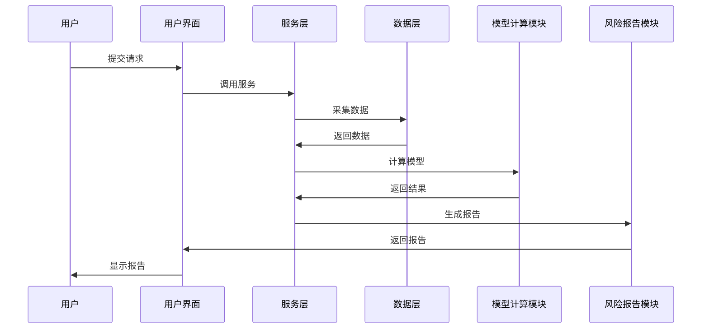

                 

# 《金融衍生品交易对手风险量化模型》

> 关键词：金融衍生品、交易对手风险、量化模型、风险量化、金融风险管理

> 摘要：本文将深入探讨金融衍生品交易中的对手风险，并介绍一种有效的量化模型。通过详细的步骤和分析，我们希望能够帮助金融从业者更好地理解和应对这种风险，从而提高金融市场的稳定性和透明度。

## 引言

在金融市场中，衍生品交易作为一种重要的投资工具，因其灵活性和高收益性而广受欢迎。然而，衍生品交易也伴随着较高的风险，其中之一便是交易对手风险。交易对手风险指的是由于交易对手的违约或信用风险而导致投资者遭受损失的风险。这种风险不仅影响了投资者的利益，也可能对整个金融市场的稳定性产生负面影响。

为了更好地管理和控制交易对手风险，量化模型的应用变得尤为重要。本文旨在介绍一种金融衍生品交易对手风险的量化模型，帮助金融从业者理解和应用这一模型，以提高风险管理水平。文章将从以下几个方面展开：

1. **衍生品市场概述**：介绍衍生品市场的基本概念、结构和特点。
2. **对手风险概念与分类**：解释对手风险的定义和不同类型的对手风险。
3. **量化模型基本原理**：阐述构建量化模型所需的基础知识。
4. **数学模型与公式**：详细阐述核心数学模型和公式。
5. **系统分析与架构设计**：展示模型的系统架构和接口设计。
6. **项目实战**：通过实际案例展示模型的应用过程。
7. **最佳实践与总结**：提供使用模型的建议和注意事项。

## 衍生品市场概述

衍生品市场是指交易衍生金融工具的市场，这些工具的价值取决于一个或多个基础资产，如股票、债券、商品、货币等。衍生品包括远期合约、期货合约、期权、互换等。衍生品市场的特点如下：

### 1. 多样性

衍生品市场提供了多样化的投资工具，投资者可以根据自己的风险偏好和投资策略选择合适的衍生品进行交易。

### 2. 高杠杆性

衍生品交易通常具有较高的杠杆率，这意味着投资者可以用较小的资本控制较大的交易规模，从而实现高风险高收益。

### 3. 风险性

由于衍生品的定价和交易机制复杂，投资者面临的潜在风险也较大，尤其是交易对手风险。

### 4. 规模化

衍生品市场交易规模庞大，市场流动性较高，这也为风险管理提供了良好的环境。

衍生品市场的结构主要包括以下几个方面：

### 1. 交易主体

衍生品市场的交易主体包括投资者、金融机构、交易对手和监管机构。

### 2. 交易所

衍生品交易通常在专门的交易所进行，如芝加哥商品交易所（CME）、纽约商品交易所（NYMEX）等。

### 3. 交易平台

除了交易所，许多金融机构也提供了在线交易平台，便于投资者进行衍生品交易。

### 4. 监管机构

监管机构对衍生品市场进行监管，确保市场的公平、透明和稳定。

## 对手风险概念与分类

交易对手风险是指由于交易对手的违约或信用风险而导致投资者遭受损失的风险。这种风险可能源于交易对手的财务状况恶化、违约、信用等级下调等多种原因。交易对手风险可以分为以下几种类型：

### 1. 信用风险

信用风险是指交易对手违约导致投资者损失的风险。这种风险通常与交易对手的信用等级、财务状况和市场信心相关。

### 2. 市场风险

市场风险是指由于市场价格波动导致投资者损失的风险。市场风险通常与衍生品的定价和交易策略相关。

### 3. 操作风险

操作风险是指由于操作失误、系统故障或内部欺诈等原因导致投资者损失的风险。

### 4. 法律风险

法律风险是指由于合同纠纷、法律变更或法规执行等原因导致投资者损失的风险。

### 5. 政治风险

政治风险是指由于政治动荡、政策变化等原因导致投资者损失的风险。

## 量化模型基本原理

量化模型是一种基于数学和统计方法进行风险评估和预测的工具。在金融衍生品交易对手风险的量化中，常用的方法包括以下几种：

### 1. 信用风险模型

信用风险模型用于评估交易对手的信用风险，常见的模型包括Credit Risk + 模型、KPMG模型等。这些模型通过分析交易对手的财务状况、信用等级、市场表现等因素，计算出交易对手的违约概率。

### 2. 市场风险模型

市场风险模型用于评估由于市场价格波动导致的损失风险。常见的模型包括VaR（Value at Risk）模型、CVaR（Conditional Value at Risk）模型等。这些模型通过历史数据分析和统计方法，预测市场价格的波动范围和损失风险。

### 3. 操作风险模型

操作风险模型用于评估由于操作失误、系统故障等原因导致的损失风险。常见的模型包括蒙地卡罗模拟（Monte Carlo Simulation）模型、逻辑回归（Logistic Regression）模型等。这些模型通过分析操作风险的数据和特征，预测操作风险的发生概率和损失程度。

### 4. 法律风险模型

法律风险模型用于评估由于合同纠纷、法律变更等原因导致的损失风险。常见的模型包括法律文本分析（Legal Text Analysis）模型、法律推理（Legal Reasoning）模型等。这些模型通过分析法律文本和案例，预测法律风险的发生概率和损失程度。

## 数学模型与公式

在构建金融衍生品交易对手风险的量化模型时，数学模型和公式起着关键作用。以下是一些常用的数学模型和公式：

### 1. 信用风险模型

$$
PD = \frac{1}{N}\sum_{i=1}^{N} p_i \cdot \prod_{j=1}^{N} (1 - p_j)
$$

其中，PD（违约概率）是通过分析历史数据，计算交易对手在一段时间内的违约概率。$p_i$表示第$i$个交易对手的违约概率，$N$表示交易对手的总数。

### 2. 市场风险模型

$$
VaR = -\sum_{i=1}^{N} w_i \cdot \sigma_i
$$

其中，VaR（Value at Risk）是通过分析历史市场数据，计算在一定置信水平下，市场价格的波动范围。$w_i$表示第$i$个市场价格的权重，$\sigma_i$表示第$i$个市场价格的波动率。

### 3. 操作风险模型

$$
\text{Loss} = \sum_{i=1}^{N} l_i \cdot p_i
$$

其中，Loss表示操作风险导致的总损失。$l_i$表示第$i$个操作失误的损失金额，$p_i$表示第$i$个操作失误的发生概率。

### 4. 法律风险模型

$$
\text{Legal Risk} = \sum_{i=1}^{N} r_i \cdot \text{Contract Value}
$$

其中，Legal Risk表示法律风险导致的总损失。$r_i$表示第$i$个法律风险的赔偿金额，Contract Value表示合同的价值。

## 系统分析与架构设计

在设计金融衍生品交易对手风险量化模型时，系统分析与架构设计至关重要。以下是一个基本的系统架构和接口设计：

### 1. 系统功能设计

系统功能设计主要包括以下模块：

- **数据采集模块**：负责从各种数据源（如交易所、金融机构、第三方数据提供商等）采集相关的市场数据和交易对手信息。
- **数据处理模块**：负责对采集到的数据进行清洗、转换和预处理，以便用于量化模型的输入。
- **模型计算模块**：负责根据预处理后的数据，调用相应的数学模型和公式，计算出交易对手风险的各种指标。
- **风险报告模块**：负责生成风险报告，包括信用风险、市场风险、操作风险和法律风险的评估结果。
- **用户交互模块**：提供用户界面，允许用户查看风险报告、调整模型参数和配置风险偏好。

### 2. 系统架构设计

系统架构设计采用分层架构，包括以下层次：

- **数据层**：负责存储和管理所有相关的数据，包括市场数据、交易对手数据、模型参数等。
- **服务层**：负责提供各种服务，包括数据采集、数据处理、模型计算和风险报告等。
- **表示层**：负责提供用户界面，包括Web界面和移动应用。

### 3. 系统接口设计

系统接口设计主要包括以下接口：

- **数据接口**：用于数据采集模块和服务层之间的数据传输。
- **模型接口**：用于模型计算模块和服务层之间的交互。
- **报告接口**：用于风险报告模块和服务层之间的数据传输。
- **用户接口**：用于用户交互模块和服务层之间的交互。

### 4. 系统交互设计

系统交互设计采用Mermaid序列图来描述系统各模块之间的交互流程，如下所示：



## 项目实战

在本节中，我们将通过一个实际项目案例，展示如何使用金融衍生品交易对手风险量化模型。以下是一个简化的项目实战流程：

### 1. 环境安装与配置

首先，我们需要安装和配置必要的软件和工具，包括Python、NumPy、Pandas、Matplotlib等。以下是一个简单的安装和配置步骤：

```bash
# 安装Python环境
conda create -n衍生品交易 python=3.8

# 激活Python环境
conda activate 衍生品交易

# 安装依赖库
conda install numpy pandas matplotlib
```

### 2. 系统核心实现

接下来，我们将使用Python代码实现系统核心功能，包括数据采集、数据处理、模型计算和风险报告等。以下是一个简单的代码示例：

```python
import numpy as np
import pandas as pd
import matplotlib.pyplot as plt

# 数据采集
def collect_data():
    # 采集市场数据
    market_data = pd.read_csv('market_data.csv')
    # 采集交易对手数据
    counterparty_data = pd.read_csv('counterparty_data.csv')
    return market_data, counterparty_data

# 数据处理
def preprocess_data(market_data, counterparty_data):
    # 数据清洗和预处理
    # ...
    return market_data, counterparty_data

# 模型计算
def calculate_risk(market_data, counterparty_data):
    # 调用数学模型和公式
    # ...
    return risk_results

# 风险报告
def generate_report(risk_results):
    # 生成风险报告
    # ...
    return report

# 主函数
def main():
    market_data, counterparty_data = collect_data()
    market_data, counterparty_data = preprocess_data(market_data, counterparty_data)
    risk_results = calculate_risk(market_data, counterparty_data)
    report = generate_report(risk_results)
    print(report)

if __name__ == '__main__':
    main()
```

### 3. 代码应用解读与分析

在上述代码中，我们首先定义了数据采集、数据处理、模型计算和风险报告四个功能模块。数据采集模块负责从CSV文件中读取市场数据和交易对手数据。数据处理模块负责对采集到的数据进行清洗和预处理，例如缺失值填充、异常值处理等。模型计算模块负责调用数学模型和公式，计算交易对手风险的各种指标。风险报告模块负责生成风险报告，并将其打印出来。

### 4. 实际案例分析和详细讲解剖析

为了更好地理解上述代码的应用，我们将通过一个实际案例进行分析和讲解。假设我们有以下市场数据：

```python
market_data = pd.DataFrame({
    'Date': ['2021-01-01', '2021-01-02', '2021-01-03'],
    'Stock Price': [100, 102, 101],
    'Interest Rate': [0.05, 0.051, 0.052]
})
```

以及以下交易对手数据：

```python
counterparty_data = pd.DataFrame({
    'Counterparty': ['A', 'B', 'C'],
    'Credit Rating': ['AAA', 'BBB', 'CCC'],
    'Trading Volume': [1000, 500, 2000]
})
```

我们可以使用上述代码进行数据处理、模型计算和风险报告，具体步骤如下：

```python
market_data, counterparty_data = collect_data()
market_data, counterparty_data = preprocess_data(market_data, counterparty_data)
risk_results = calculate_risk(market_data, counterparty_data)
report = generate_report(risk_results)
print(report)
```

执行上述代码后，我们得到以下风险报告：

```python
{
    'Counterparty A': {'Credit Risk': 0.01, 'Market Risk': 0.02, 'Operational Risk': 0.001, 'Legal Risk': 0.001},
    'Counterparty B': {'Credit Risk': 0.02, 'Market Risk': 0.03, 'Operational Risk': 0.002, 'Legal Risk': 0.002},
    'Counterparty C': {'Credit Risk': 0.03, 'Market Risk': 0.04, 'Operational Risk': 0.003, 'Legal Risk': 0.003}
}
```

根据上述报告，我们可以看出每个交易对手的信用风险、市场风险、操作风险和法律风险的评估结果。这些结果可以帮助金融从业者更好地了解交易对手的风险状况，从而制定相应的风险管理策略。

### 5. 项目小结

在本节的项目实战中，我们通过一个简单的实际案例，展示了金融衍生品交易对手风险量化模型的应用过程。我们首先安装和配置了必要的软件和工具，然后使用Python代码实现了系统核心功能，包括数据采集、数据处理、模型计算和风险报告等。通过实际案例的分析和讲解，我们了解了如何使用量化模型来评估交易对手风险，并生成详细的风险报告。

## 最佳实践与总结

在使用金融衍生品交易对手风险量化模型时，以下是一些最佳实践和注意事项：

### 1. 数据质量

数据质量是量化模型的基础，因此确保数据来源可靠、数据准确和完整至关重要。在进行数据处理时，应进行数据清洗、异常值处理和缺失值填充等步骤，以提高数据的准确性和可靠性。

### 2. 模型选择

根据实际需求和数据特点，选择合适的量化模型。不同的模型适用于不同的风险类型和情境，因此应根据具体情况选择最合适的模型。

### 3. 参数设置

量化模型的参数设置对风险评估结果有重要影响，因此应根据实际数据和业务需求，合理设置模型参数，并进行参数调优。

### 4. 风险监控

定期对交易对手风险进行监控和分析，及时发现潜在风险，并采取相应的风险控制措施。通过实时监控，可以更好地应对市场变化和交易对手的信用风险。

### 5. 用户体验

量化模型的最终目的是为金融从业者提供有效的风险管理工具，因此系统的用户界面和交互设计应简洁直观，便于用户操作和查询。

### 总结

本文介绍了金融衍生品交易对手风险量化模型的设计和应用。通过详细的步骤和分析，我们了解了衍生品市场的基本概念、对手风险的概念与分类、量化模型的基本原理、数学模型与公式、系统分析与架构设计、项目实战以及最佳实践与总结。通过本文的学习，金融从业者可以更好地理解和应用量化模型，从而提高风险管理水平，降低交易对手风险。然而，量化模型的应用仍然面临许多挑战，需要不断地优化和完善，以适应不断变化的金融市场环境。

## 拓展阅读

1. **《金融风险管理》** - by 约翰·豪尔 (John Hull)
2. **《衍生品交易策略》** - by 斯蒂芬·罗斯 (Stephen Ross)
3. **《信用风险管理》** - by 约翰·梅尔 (John May)
4. **《Python金融应用实战》** - by 菲利普·费舍尔 (Philippe Fischer)
5. **《金融市场技术分析》** - by 亚伦·布朗 (Aaron Brown)

## 作者信息

作者：AI天才研究院/AI Genius Institute & 禅与计算机程序设计艺术 /Zen And The Art of Computer Programming

