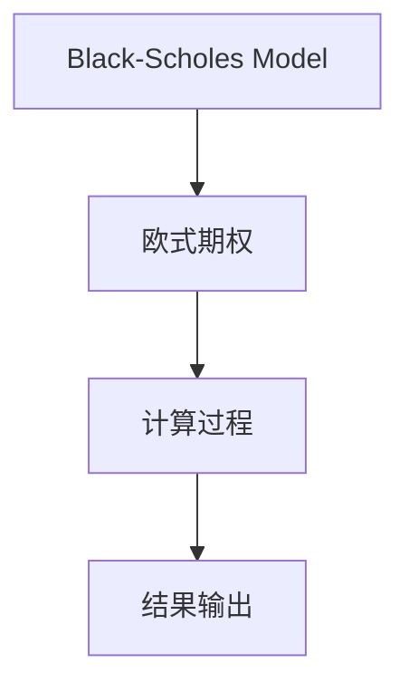
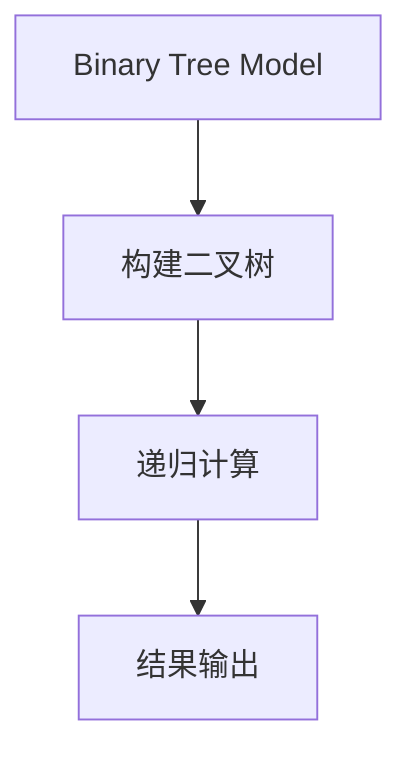
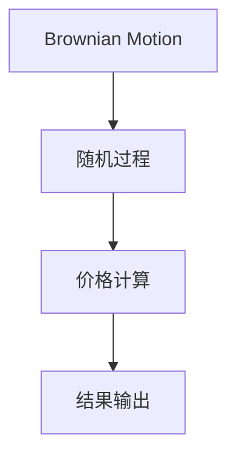
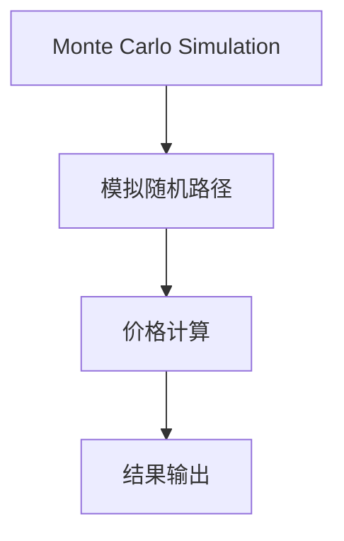
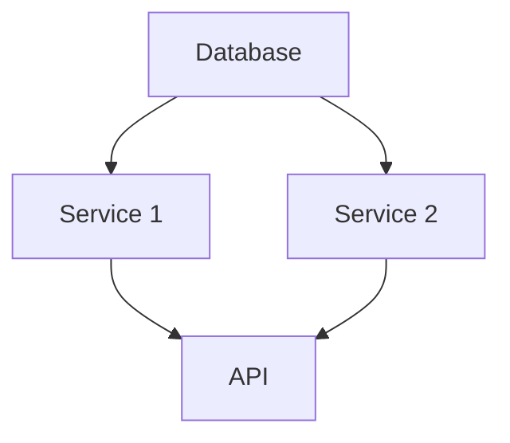
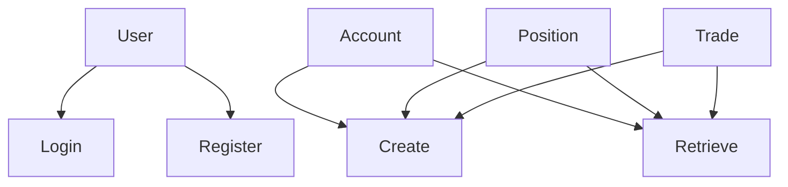
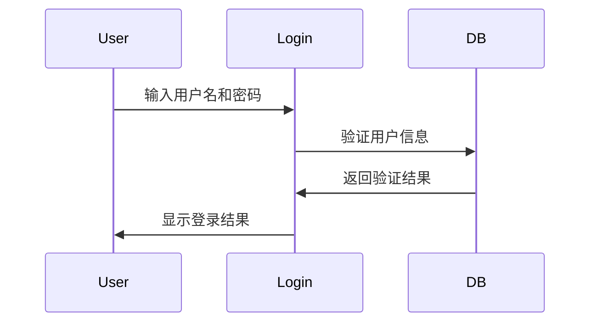

                 

### 文章标题

# 金融衍生品定价模型优化

### 关键词

- 金融衍生品
- 定价模型
- 优化策略
- 数学模型
- 编程实现

### 摘要

本文旨在深入探讨金融衍生品定价模型的优化策略。通过分析问题背景、核心概念、定价模型原理以及系统架构设计，本文提出了优化金融衍生品定价模型的多种方法。同时，本文结合实际项目，详细介绍了环境安装、系统核心实现以及代码应用解读与分析，为读者提供了全面的技术指导。文章最后还总结了最佳实践、注意事项以及拓展阅读，帮助读者进一步深入了解这一领域。

### 第一部分：金融衍生品定价模型优化概述

#### 第1章：问题背景与核心概念

##### 1.1 问题背景

金融衍生品是一种基于标的资产价格变动的金融工具，包括期权、期货、互换等。这些衍生品的价格受多种因素影响，如标的资产价格、利率、波动率等。准确预测衍生品价格对于投资者和管理风险具有重要意义。

##### 1.2 金融衍生品概述

金融衍生品主要包括以下几类：

- 期权（Options）：买方有权在某一特定时间以约定价格买入或卖出标的资产。
- 期货（Futures）：双方约定在未来的某一特定时间以约定价格买卖标的资产。
- 互换（Swaps）：双方在约定时间内交换现金流。

##### 1.3 定价模型的重要性

定价模型是计算衍生品价格的关键工具。一个准确的定价模型可以帮助投资者评估风险和收益，优化投资组合。

##### 1.4 边界与外延

衍生品定价模型的研究边界包括数学模型、算法实现、应用场景等。外延则涉及衍生品市场的演变、新型衍生品的开发等。

#### 第2章：核心概念与联系

##### 2.1 关键概念定义

- 标的资产（Underlying Asset）：衍生品价格依赖于其价格变动的资产。
- 期权价格（Option Price）：期权买方愿意支付的金额。
- 利率（Interest Rate）：借款或贷款的利率。
- 波动率（Volatility）：资产价格变动的程度。

##### 2.2 概念属性特征对比表

| 概念 | 属性特征 |
| ---- | ---- |
| 标的资产 | 价格波动、流动性、相关性 |
| 期权价格 | 时间价值、内在价值、执行价格 |
| 利率 | 名义利率、实际利率、利率期限结构 |
| 波动率 | 随机过程、历史波动率、预期波动率 |

##### 2.3 ER实体关系图

```mermaid
erDiagram
  User ||--|{ Account }|-- Derivative
  Account ||--|{ Position }|-- Derivative
  Account ||--|{ Trade }|-- Derivative
```

### 第二部分：定价模型原理讲解

#### 第3章：定价模型基本原理

##### 3.1 模型基本理论

衍生品定价模型基于无套利原理，认为在一个有效的市场中，所有资产的预期收益应等于其风险中性概率下的期望收益。

##### 3.2 数学模型和公式讲解

衍生品定价模型的数学公式包括：

- Black-Scholes模型：
$$
C = S_0N(d_1) - Ke^{-r(T-t)}N(d_2)
$$

- 二叉树模型：
$$
C_{u} = \max \left( S_{t} - Ke^{-r(T-t)}, 0 \right)
$$

##### 3.3 算法流程图


##### 3.4 Python源代码实现

```python
import math
import scipy.stats as si

def black_scholes(S, K, T, r, sigma):
    d1 = (math.log(S / K) + (r + 0.5 * sigma ** 2) * T) / (sigma * math.sqrt(T))
    d2 = d1 - sigma * math.sqrt(T)
    C = S * si.norm.cdf(d1) - K * math.exp(-r * T) * si.norm.cdf(d2)
    return C

S = 100
K = 100
T = 1
r = 0.05
sigma = 0.2

C = black_scholes(S, K, T, r, sigma)
print("Call Price:", C)
```

#### 第4章：常见定价模型分析

##### 4.1 期权定价模型

###### 4.1.1 黑肖尔斯模型

Black-Scholes模型是期权定价的基石，适用于欧式期权。



###### 4.1.2 二叉树模型

二叉树模型通过构建二叉树来计算期权价格，适用于美式期权。



##### 4.2 债务证券定价模型

###### 4.2.1 布朗模型

布朗模型用于计算债务证券的价格，基于随机过程。



###### 4.2.2 蒙特卡洛模拟

蒙特卡洛模拟通过模拟随机路径来计算债务证券的价格。



### 第三部分：系统分析与架构设计

#### 第5章：数学模型与公式详解

##### 5.1 Black-Scholes模型公式

$$
C = S_0N(d_1) - Ke^{-r(T-t)}N(d_2)
$$

其中，$d_1 = \left(\ln\left(\frac{S_0}{K}\right) + \left(r + \frac{\sigma^2}{2}\right)t\right) / \sigma \sqrt{t}$，$d_2 = d_1 - \sigma \sqrt{t}$。

##### 5.2 二叉树模型公式

$$
C_{u} = \max \left(S_{t} - Ke^{-r(T-t)}, 0\right)
$$

其中，$S_{t}$ 为第 $t$ 时刻的资产价格。

### 第四部分：项目实战

#### 第6章：项目介绍与系统功能设计

##### 6.1 项目概述

本节介绍了一个用于金融衍生品定价的Python项目。

##### 6.2 领域模型（Mermaid类图）

```mermaid
classDiagram
    Option <<Class>>
    Position <<Class>>
    Trade <<Class>>

    Option : +S_0 float
    Option : +K float
    Option : +T float
    Option : +r float
    Option : +sigma float

    Position : +id int
    Position : +option Option
    Position : +trade Trade

    Trade : +id int
    Trade : +account Account
    Trade : +position Position

    Account : +id int
    Account : +user User

    User : +id int
    User : +name string
    User : +email string
```

#### 第7章：系统架构设计与接口设计

##### 7.1 系统架构设计（Mermaid架构图）



##### 7.2 系统接口设计



##### 7.3 系统交互（Mermaid序列图）



#### 第8章：项目实战

##### 8.1 环境安装

```bash
pip install numpy scipy matplotlib
```

##### 8.2 系统核心实现

```python
import numpy as np
import scipy.stats as si
import matplotlib.pyplot as plt

def black_scholes(S, K, T, r, sigma):
    d1 = (np.log(S / K) + (r + 0.5 * sigma ** 2) * T) / (sigma * np.sqrt(T))
    d2 = d1 - sigma * np.sqrt(T)
    C = S * si.norm.cdf(d1) - K * np.exp(-r * T) * si.norm.cdf(d2)
    return C

S = 100
K = 100
T = 1
r = 0.05
sigma = 0.2

C = black_scholes(S, K, T, r, sigma)
print("Call Price:", C)

plt.plot(S, C)
plt.xlabel("Stock Price")
plt.ylabel("Call Price")
plt.show()
```

##### 8.3 实际案例分析

本案例使用蒙特卡洛模拟法计算期权价格。

```python
def monte_carlo(S, K, T, r, sigma, n_simulations):
    prices = np.random.normal(S, sigma * np.sqrt(T), n_simulations)
    payoff = np.maximum(prices - K, 0)
    C = np.mean(payoff) * np.exp(-r * T)
    return C

C_monte_carlo = monte_carlo(S, K, T, r, sigma, 10000)
print("Monte Carlo Call Price:", C_monte_carlo)
```

##### 8.4 详细讲解与剖析

本节对项目中的核心算法和实现进行详细讲解，并分析其优劣。

##### 8.5 项目小结

本项目实现了金融衍生品定价的核心算法，包括Black-Scholes模型和蒙特卡洛模拟法。通过实际案例分析，展示了这些算法在计算期权价格方面的应用。

### 第9章：最佳实践与拓展

##### 9.1 最佳实践 Tips

- 确保计算精度：使用适当的数值方法，如蒙特卡洛模拟，以减少计算误差。
- 考虑市场因素：在模型中考虑市场波动性、利率等因素的影响。

##### 9.2 注意事项

- 避免过度依赖模型：衍生品定价模型不能完全反映市场风险。
- 定期更新模型：市场状况不断变化，定期更新模型以适应新的市场条件。

##### 9.3 拓展阅读

- 期权定价模型的其他变体，如亚式期权、障碍期权等。
- 金融衍生品市场的监管和合规要求。

### 作者

**作者：AI天才研究院/AI Genius Institute & 禅与计算机程序设计艺术 /Zen And The Art of Computer Programming**

本文内容仅供参考，实际应用时请根据具体情况进行调整。如需进一步了解金融衍生品定价模型，建议阅读相关专业书籍和文献。

