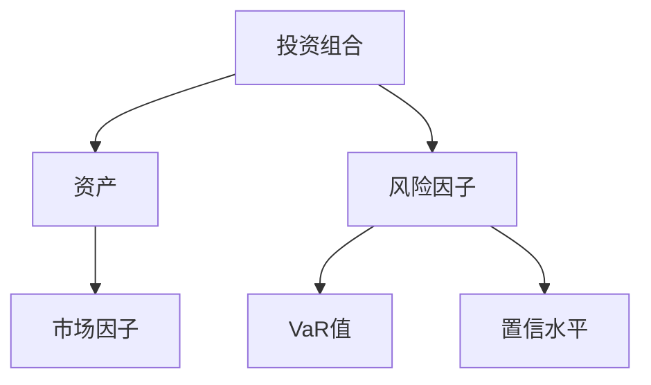
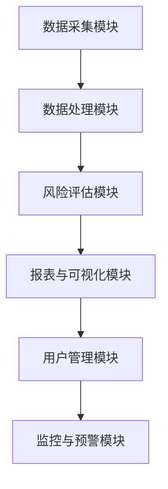
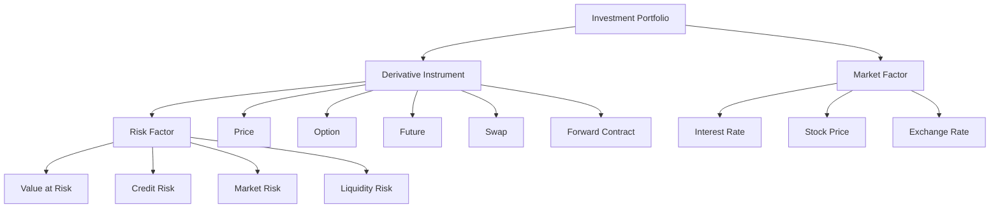
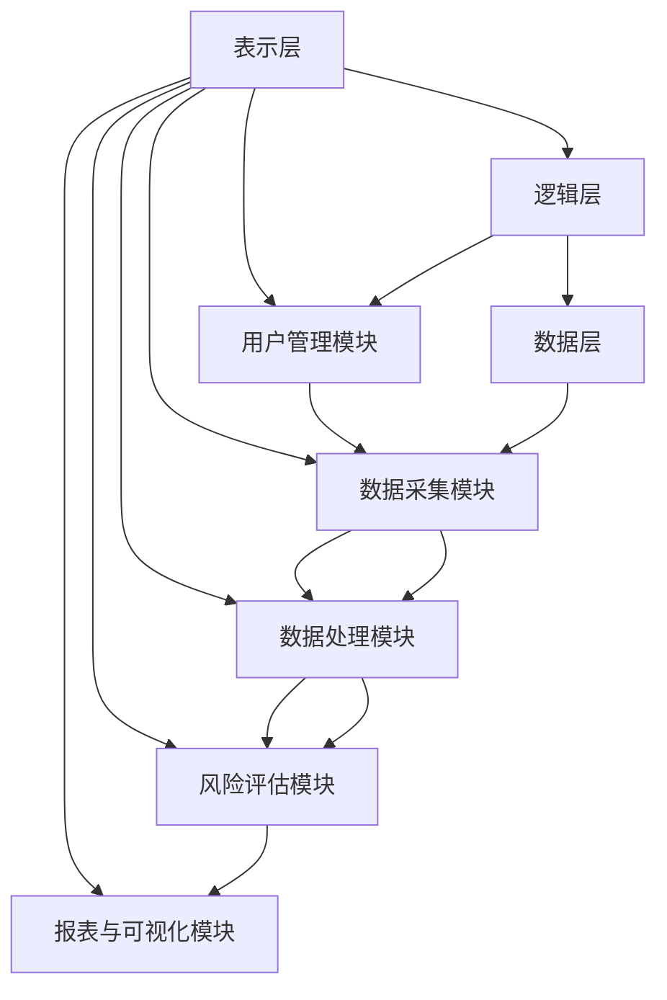

                 

### 第1章：金融衍生品市场背景

#### 1.1 金融衍生品市场的发展

**1.1.1 金融衍生品的定义与分类**

金融衍生品是一种金融合约，其价值取决于一个或多个基础资产。这些基础资产可以是股票、债券、货币、商品、利率或其他金融工具。衍生品的主要功能是管理风险、增加收益和优化投资组合。

衍生品可以分为以下几类：

- **期货（Futures）**：标准化合约，规定了在未来某一特定时间以特定价格购买或出售某项资产。
- **期权（Options）**：给予持有人在特定时间内以特定价格购买或出售资产的权利，但非义务。
- **互换（Swaps）**：两个参与方同意在未来某一特定时间按照特定条件交换现金流。
- **远期合约（Forward Contracts）**：非标准化合约，双方约定在未来某一特定时间以特定价格购买或出售资产。

**1.1.2 金融衍生品市场的发展历程**

- **20世纪70年代**：金融自由化浪潮带动了衍生品市场的诞生。
- **20世纪80年代**：监管放松和市场创新推动了衍生品市场的发展。
- **20世纪90年代**：技术进步和互联网普及加速了衍生品市场的全球扩展。
- **21世纪初**：金融危机后，衍生品市场受到更严格的监管，但仍然在风险管理、对冲和资产配置中扮演重要角色。

**1.1.3 金融衍生品市场的影响因素**

衍生品市场受到以下因素的影响：

- **宏观经济环境**：包括经济增长、通货膨胀、利率和汇率等。
- **政策监管**：监管政策的变化会影响衍生品市场的规模和结构。
- **技术创新**：新技术的发展，如高频交易、人工智能等，改变了市场的运作模式。
- **市场参与者**：投资者、金融机构、企业和政府等对衍生品的需求和供给。

#### 1.2 金融衍生品风险概述

**1.2.1 金融衍生品风险的定义**

金融衍生品风险是指由于市场变化、合约结构或其他因素导致的潜在损失。衍生品风险主要包括：

- **市场风险**：由于市场价格变动导致的损失。
- **信用风险**：交易对手违约导致的风险。
- **流动性风险**：难以迅速以合理价格买入或卖出资产的风险。
- **操作风险**：由于错误操作、系统故障等导致的损失。

**1.2.2 金融衍生品风险的类型**

- **系统性风险**：由宏观经济、政策或市场变化引起的广泛风险。
- **非系统性风险**：特定合约或交易对手的风险。
- **杠杆风险**：衍生品交易的高杠杆性带来的风险。

**1.2.3 金融衍生品风险的特点**

- **杠杆效应**：衍生品交易具有高杠杆性，小幅度价格波动可能导致大额损失。
- **复杂性和不确定性**：衍生品合约结构复杂，市场波动难以预测。
- **跨市场和跨行业影响**：衍生品交易涉及多个市场和行业，风险具有传递性。

#### 1.3 风险评估模型的重要性

**1.3.1 风险评估模型的基本概念**

风险评估模型是用于量化和管理衍生品风险的工具。其基本概念包括：

- **风险因素**：影响衍生品价格变动的因素。
- **评估指标**：衡量衍生品风险的指标，如VaR（Value at Risk）和压力测试指标。
- **模型方法**：用于计算和预测风险的数学方法。

**1.3.2 风险评估模型的作用**

风险评估模型在金融衍生品管理中起到关键作用：

- **风险度量**：量化风险，帮助金融机构和投资者了解潜在损失。
- **风险控制**：通过设定风险限额，防止过度风险暴露。
- **决策支持**：为投资决策、风险管理策略提供科学依据。

**1.3.3 风险评估模型的挑战**

风险评估模型面临以下挑战：

- **数据质量**：风险评估依赖于高质量的数据，数据缺失或错误会影响模型效果。
- **模型选择**：不同模型适用于不同市场环境，选择合适的模型至关重要。
- **模型稳定性**：模型需具备稳健性，能适应市场变化。

**1.4 风险评估模型的发展趋势**

**1.4.1 传统风险评估模型**

- **历史模拟法**：基于历史数据计算风险。
- **方差-协方差法**：基于资产收益的方差和协方差计算风险。

**1.4.2 现代风险评估模型**

- **蒙特卡罗模拟法**：通过随机模拟计算风险。
- **压力测试模型**：评估极端市场条件下的风险。

**1.4.3 未来的发展方向**

- **大数据与人工智能**：利用大数据和人工智能技术提高风险评估精度。
- **实时风险评估**：实现风险评估的实时性和动态性。
- **跨市场风险评估**：整合不同市场和行业的数据，进行全面的评估。

#### 1.5 本章小结

本章介绍了金融衍生品市场的发展背景、衍生品风险概述以及风险评估模型的重要性。衍生品市场的复杂性使其风险管理变得尤为重要。风险评估模型作为量化和管理衍生品风险的重要工具，不断发展和创新，以应对市场变化和挑战。

**核心关键词**：金融衍生品、市场发展、风险评估、风险因素、模型方法

**摘要**：本章详细介绍了金融衍生品市场的发展历程、衍生品风险类型及其特点，并探讨了风险评估模型的基本概念、作用及发展趋势。通过理解这些内容，读者能够对金融衍生品的风险评估有更深入的认识。

### 第1章小结

在本章中，我们深入探讨了金融衍生品市场的背景和发展历程，阐述了金融衍生品风险的类型和特点，以及风险评估模型的基本概念和重要性。通过对这些核心概念的介绍，我们为后续章节中详细讨论风险评估模型的理论和实践打下了坚实的基础。

**注意事项**：

- 理解衍生品市场的本质和衍生品风险的复杂性是风险评估的基础。
- 风险评估模型的准确性和可靠性直接影响到风险管理的效果。
- 在实际应用中，应根据市场环境和业务需求选择合适的风险评估模型。

**拓展阅读**：

- **《衍生品市场导论》**：了解更多衍生品市场的详细内容。
- **《风险管理手册》**：学习风险管理的基本原理和方法。
- **《金融工程导论》**：了解金融工程中使用的风险评估技术。

---

## 2.1 VaR模型概述

### 2.1.1 VaR模型的定义与原理

**定义：** VaR（Value at Risk）是一种定量评估金融市场风险的方法，用于衡量在特定概率水平下，一个金融资产或投资组合在未来特定时间段内可能遭受的最大损失。

**原理：** VaR模型的原理基于概率和统计学。给定一个置信水平α（如95%），VaR值表示在下一个N天（或N小时、N分钟等）内，有α的概率不会超过这个值。即：

\[ \text{VaR}_\alpha(N) = \text{最大可能的损失} \]

例如，如果一个投资组合的VaR值为100万美元，置信水平为95%，意味着在未来一天内，有95%的把握损失不会超过100万美元。

### 2.1.2 VaR模型的参数设定

VaR模型的计算依赖于以下几个关键参数：

- **置信水平（Confidence Level）**：通常取值为95%、97%或99%，表示模型预测的可靠程度。
- **持有期（Horizon）**：指模型评估的时间范围，如1天、5天、10天等。
- **市场因子**：包括价格、利率、汇率等，影响投资组合价值的变量。
- **风险度量方法**：不同方法计算VaR值，如历史模拟法、方差-协方差法和蒙特卡罗模拟法。

### 2.1.3 VaR模型的应用范围

VaR模型广泛应用于以下领域：

- **风险管理**：金融机构和企业使用VaR模型来设定风险限额，监控和管理投资组合风险。
- **合规性检查**：VaR值作为合规指标，确保金融机构遵守监管要求。
- **投资决策**：投资者使用VaR模型来评估不同投资组合的风险和收益，做出更明智的投资决策。
- **压力测试**：通过模拟极端市场条件，评估投资组合的稳健性和抗风险能力。

### 2.1.4 VaR模型的优势与局限性

**优势：**

- **量化风险**：VaR模型将风险量化为具体的数值，便于管理层和投资者理解和管理。
- **全面性**：VaR模型涵盖不同风险类型，包括市场风险、信用风险和流动性风险。
- **灵活应用**：VaR模型适用于各种资产和投资组合，具有较强的普适性。

**局限性：**

- **数据依赖性**：VaR模型依赖于历史数据，无法预测未来未知的市场事件。
- **模型选择**：不同模型适用于不同市场环境，选择不当可能导致不准确的风险评估。
- **极端事件**：VaR模型在极端市场条件下的预测能力较弱，可能低估罕见风险。

### 2.1.5 VaR模型的历史与发展

VaR模型自20世纪90年代以来得到了广泛应用和不断发展：

- **1994年**：J.P.摩根发布《风险值——捕捉市场风险的新方法》，VaR模型开始受到金融界的关注。
- **2004年**：巴塞尔委员会发布《市场风险资本协议》，VaR模型成为国际金融监管的重要工具。
- **2008年**：金融危机后，巴塞尔委员会发布《巴塞尔Ⅲ》，对VaR模型进行了修订和改进。

### 2.1.6 总结

VaR模型是一种重要的风险评估工具，通过量化风险为金融机构和投资者提供了宝贵的信息。理解VaR模型的定义、原理和应用范围，有助于更好地掌握金融风险管理的方法和策略。

---

**附录：VaR模型的概念对比表格**

| **概念**          | **定义**                                                   | **应用场景**                      |
|-------------------|------------------------------------------------------------|-----------------------------------|
| 历史模拟法        | 基于历史数据模拟资产收益分布，计算VaR值。                   | 适用于市场波动性较高的情况。       |
| 方差-协方差法      | 利用资产收益的方差和协方差计算VaR值。                       | 适用于线性资产组合。               |
| 蒙特卡罗模拟法     | 通过随机模拟资产收益分布，计算VaR值。                       | 适用于复杂资产组合和极端市场情景。 |

---

**ER实体关系图架构**



- **A（投资组合）**：包含多种资产，是VaR模型评估的核心对象。
- **B（资产）**：投资组合中的单个资产，其价值受市场因子影响。
- **C（市场因子）**：影响资产价格的关键因素，如价格、利率和汇率。
- **D（风险因子）**：衡量资产或投资组合面临的风险因素。
- **E（VaR值）**：在特定置信水平下，投资组合可能遭受的最大损失。
- **F（置信水平）**：表示VaR模型预测的可靠程度，通常取值为95%。

---

通过上述内容，我们介绍了VaR模型的基本概念、原理和参数设定，探讨了其应用范围和优势局限性，并对比了不同风险度量方法。下一节将深入讨论VaR模型的三种主要计算方法：历史模拟法、方差-协方差法和蒙特卡罗模拟法。

---

### 2.2 VaR模型的计算方法

VaR模型的计算方法有多种，主要包括历史模拟法、方差-协方差法和蒙特卡罗模拟法。这些方法各有特点，适用于不同的市场环境和投资组合。在本节中，我们将分别介绍这三种计算方法，并通过Python源代码详细阐述其实现过程。

#### 2.2.1 历史模拟法

**定义**：历史模拟法是一种基于历史数据的方法，通过模拟资产收益的历史分布来计算VaR值。具体步骤如下：

1. 收集历史数据，计算每期资产收益。
2. 对资产收益进行排序，计算置信水平下的分位数。
3. 取该分位数作为VaR值。

**实现步骤**：

1. **数据收集与预处理**：收集历史资产价格或收益率数据，并进行预处理，如去除缺失值和异常值。
2. **计算资产收益**：利用历史数据计算每期的资产收益。
3. **排序与分位数计算**：将资产收益进行排序，并计算置信水平下的分位数。
4. **VaR值计算**：取置信水平下的分位数作为VaR值。

**Python代码示例**：

```python
import numpy as np

# 假设历史收益数据为以下列表
historical_returns = [-0.05, -0.03, 0.02, 0.04, -0.02, 0.01, 0.06, -0.01, 0.03, -0.04]

# 计算历史收益的中位数和分位数
sorted_returns = np.sort(historical_returns)
alpha = 0.05  # 置信水平
var_value = sorted_returns[int(len(sorted_returns) * alpha)]

print("VaR值（历史模拟法）:", var_value)
```

#### 2.2.2 方差-协方差法

**定义**：方差-协方差法是一种基于资产收益的方差和协方差来计算VaR值的方法。具体步骤如下：

1. 计算每期资产收益的均值和方差。
2. 计算资产之间的协方差矩阵。
3. 利用正态分布假设，计算资产的联合概率分布。
4. 根据置信水平，计算VaR值。

**实现步骤**：

1. **计算均值和方差**：利用历史数据计算每期资产收益的均值和方差。
2. **计算协方差矩阵**：计算资产之间的协方差矩阵。
3. **正态分布假设**：假设资产收益服从正态分布。
4. **计算联合概率分布**：利用协方差矩阵和正态分布性质计算资产的联合概率分布。
5. **VaR值计算**：根据置信水平计算VaR值。

**Python代码示例**：

```python
import numpy as np
import scipy.stats as stats

# 假设历史收益数据为以下列表
historical_returns = [-0.05, -0.03, 0.02, 0.04, -0.02, 0.01, 0.06, -0.01, 0.03, -0.04]

# 计算均值和方差
mean_returns = np.mean(historical_returns)
var_returns = np.var(historical_returns)

# 计算协方差矩阵
cov_matrix = np.cov(historical_returns)[0, 1]

# 计算标准差
std_dev = np.sqrt(var_returns)

# 计算置信水平下的VaR值
alpha = 0.05  # 置信水平
z_score = stats.norm.ppf(1 - alpha)
var_value = z_score * std_dev

print("VaR值（方差-协方差法）:", var_value)
```

#### 2.2.3 蒙特卡罗模拟法

**定义**：蒙特卡罗模拟法是一种通过随机模拟来计算VaR值的方法。具体步骤如下：

1. 建立资产收益的随机模型，如正态分布模型。
2. 生成大量随机样本，模拟资产收益分布。
3. 计算置信水平下的分位数。
4. 取该分位数作为VaR值。

**实现步骤**：

1. **随机模型建立**：建立资产收益的随机模型，如正态分布模型。
2. **随机样本生成**：利用随机模型生成大量随机样本，模拟资产收益分布。
3. **分位数计算**：计算置信水平下的分位数。
4. **VaR值计算**：取置信水平下的分位数作为VaR值。

**Python代码示例**：

```python
import numpy as np
import scipy.stats as stats

# 假设历史收益数据为以下列表
historical_returns = [-0.05, -0.03, 0.02, 0.04, -0.02, 0.01, 0.06, -0.01, 0.03, -0.04]

# 计算均值和方差
mean_returns = np.mean(historical_returns)
std_dev = np.std(historical_returns)

# 生成随机样本
num_samples = 1000
random_samples = np.random.normal(mean_returns, std_dev, num_samples)

# 计算置信水平下的分位数
alpha = 0.05  # 置信水平
var_value = np.percentile(random_samples, (1 - alpha) * 100)

print("VaR值（蒙特卡罗模拟法）:", var_value)
```

#### 2.2.4 三种计算方法的对比

**特点**：

- **历史模拟法**：简单直观，易于理解，适用于数据较丰富的情况。
- **方差-协方差法**：基于正态分布假设，计算效率较高，适用于线性资产组合。
- **蒙特卡罗模拟法**：灵活性高，适用于复杂资产组合和非线性模型，但计算成本较高。

**适用场景**：

- **历史模拟法**：适用于市场波动性较高，数据丰富的市场环境。
- **方差-协方差法**：适用于线性资产组合和相对稳定的市场环境。
- **蒙特卡罗模拟法**：适用于复杂资产组合和非线性市场环境，以及需要高精度风险评估的情况。

通过上述三种计算方法的介绍和Python代码示例，我们可以看到每种方法在计算VaR值时的具体实现步骤和适用场景。在实际应用中，应根据市场环境和业务需求选择合适的VaR计算方法。

---

### 2.3 VaR模型的应用实例

在了解了VaR模型的基本概念和计算方法后，我们接下来通过具体的应用实例，深入探讨VaR模型在风险管理、投资组合管理和模型优化与挑战方面的实际应用。

#### 2.3.1 风险管理中的应用

**实例背景**：某投资银行拥有一只由多种资产构成的基金，该基金投资组合包括股票、债券、货币市场工具等。为了有效地管理风险，投资银行需要计算该基金在不同置信水平下的VaR值。

**应用步骤**：

1. **数据收集**：收集基金投资组合中各个资产的历史收益数据。
2. **数据处理**：对数据进行预处理，包括去除缺失值、异常值和处理季节性因素。
3. **计算VaR值**：选择适当的VaR计算方法（如历史模拟法、方差-协方差法或蒙特卡罗模拟法），计算在不同置信水平下的VaR值。
4. **设定风险限额**：根据计算出的VaR值，设定基金的风险限额，确保基金的风险水平在可接受范围内。

**Python代码示例**：

```python
import numpy as np
import pandas as pd

# 假设收集到的股票、债券、货币市场工具的历史收益数据如下
stock_returns = [-0.05, -0.03, 0.02, 0.04, -0.02, 0.01, 0.06, -0.01, 0.03, -0.04]
bond_returns = [-0.04, -0.02, 0.03, 0.05, -0.01, 0.02, 0.06, -0.03, 0.02, -0.01]
cash_returns = [0.001, 0.002, -0.001, 0.003, -0.002, 0.001, 0.002, -0.001, 0.003, -0.002]

# 计算投资组合的加权平均收益
weights = [0.5, 0.3, 0.2]  # 假设股票、债券、货币市场的权重分别为50%、30%、20%
combined_returns = [w * r for w, r in zip(weights, [stock_returns, bond_returns, cash_returns])]
mean_combined_returns = np.mean(combined_returns)
std_combined_returns = np.std(combined_returns)

# 计算VaR值（以方差-协方差法为例）
alpha = 0.05  # 置信水平
z_score = stats.norm.ppf(1 - alpha)
var_value = z_score * std_combined_returns

print("基金VaR值:", var_value)
```

#### 2.3.2 投资组合管理中的应用

**实例背景**：某投资者拥有一只包含多种资产的组合，包括股票、债券和商品。投资者希望通过VaR模型来评估组合的风险水平，并调整投资策略。

**应用步骤**：

1. **计算投资组合VaR值**：使用历史模拟法或蒙特卡罗模拟法计算投资组合在不同置信水平下的VaR值。
2. **分析风险贡献**：分析每个资产对投资组合VaR值的贡献，识别高风险资产。
3. **调整投资策略**：根据VaR值和风险贡献分析结果，调整投资组合，降低整体风险。

**Python代码示例**：

```python
# 假设投资组合中各个资产的历史收益数据如下
stock_returns = [-0.05, -0.03, 0.02, 0.04, -0.02, 0.01, 0.06, -0.01, 0.03, -0.04]
bond_returns = [-0.04, -0.02, 0.03, 0.05, -0.01, 0.02, 0.06, -0.03, 0.02, -0.01]
commodity_returns = [-0.02, 0.01, -0.03, 0.04, -0.01, 0.02, -0.01, 0.03, 0.02, -0.01]

# 计算投资组合的加权平均收益
weights = [0.5, 0.3, 0.2]  # 假设股票、债券、商品的权重分别为50%、30%、20%
combined_returns = [w * r for w, r in zip(weights, [stock_returns, bond_returns, commodity_returns])]
mean_combined_returns = np.mean(combined_returns)
std_combined_returns = np.std(combined_returns)

# 计算投资组合的VaR值（以蒙特卡罗模拟法为例）
num_samples = 1000
random_samples = np.random.normal(mean_combined_returns, std_combined_returns, num_samples)
var_value = np.percentile(random_samples, (1 - 0.05) * 100)

print("投资组合VaR值:", var_value)
```

#### 2.3.3 模型优化与挑战

**实例背景**：在实际应用中，VaR模型可能会面临一些挑战和局限性。为了提高模型的准确性和稳定性，投资者和金融机构需要不断优化模型。

**优化方向**：

1. **模型选择**：根据市场环境和投资组合特点选择合适的VaR计算方法，如历史模拟法、方差-协方差法或蒙特卡罗模拟法。
2. **参数调整**：优化模型的参数设定，如置信水平、持有期和风险因子。
3. **风险管理策略**：结合市场风险特征和投资策略，制定更有效的风险管理策略。

**挑战**：

1. **数据质量**：VaR模型的准确性依赖于高质量的历史数据。数据缺失、异常值和季节性因素可能影响模型效果。
2. **模型稳定性**：不同市场环境和经济周期下，VaR模型的稳定性可能受到影响。模型需要具备稳健性，以适应不同市场条件。
3. **极端事件**：VaR模型在极端市场条件下的预测能力较弱。如何处理极端事件是模型优化的重要课题。

**解决方法**：

1. **数据预处理**：对历史数据进行预处理，包括去除异常值、平滑季节性因素和填补缺失数据。
2. **模型组合**：使用多种模型进行风险评估，结合不同模型的优势，提高整体风险评估的准确性和稳健性。
3. **压力测试**：通过压力测试评估模型在极端市场条件下的表现，识别潜在风险并优化模型。

通过上述实例，我们可以看到VaR模型在风险管理、投资组合管理和模型优化中的应用。在实际操作中，投资者和金融机构需要根据具体情况进行模型选择、参数调整和优化，以提高风险评估的准确性和实用性。

---

**本章小结**

本章详细介绍了VaR模型的基本概念、计算方法和实际应用。我们通过Python代码示例展示了历史模拟法、方差-协方差法和蒙特卡罗模拟法的实现过程，并通过具体实例探讨了VaR模型在风险管理、投资组合管理和模型优化中的应用。理解VaR模型及其应用方法，有助于投资者和金融机构更好地管理风险和制定投资策略。

**最佳实践 tips**：

1. **选择合适的计算方法**：根据市场环境和投资组合特点，选择适合的VaR计算方法。
2. **数据质量保障**：对历史数据进行严格预处理，确保数据质量。
3. **模型参数优化**：定期调整模型参数，以适应市场变化。
4. **压力测试**：定期进行压力测试，评估模型在极端市场条件下的表现。

**注意事项**：

1. **理解模型的局限性**：VaR模型无法预测极端事件，需要结合其他风险管理工具。
2. **模型应用环境**：VaR模型适用于不同市场环境，但需根据具体情况调整。

**拓展阅读**：

- **《风险管理与投资组合优化》**：深入了解风险管理理论和投资组合优化方法。
- **《金融衍生品市场》**：了解金融衍生品市场的运作机制和风险管理策略。
- **《VaR模型的最新发展与应用》**：探讨VaR模型在金融领域的最新研究进展。

---

## 3.2 压力测试模型的构建方法

### 3.2.1 基于历史数据的压力测试

**定义**：基于历史数据的压力测试是通过分析历史市场数据，模拟可能发生的极端市场情景，以评估投资组合在极端条件下的表现。

**方法**：

1. **选择历史市场情景**：选择过去发生过的极端市场事件，如股市崩盘、利率急剧变动等。
2. **模拟投资组合表现**：将投资组合的资产价格变化与历史市场情景进行对比，计算各资产收益及投资组合的整体表现。
3. **分析风险因素**：分析投资组合在极端市场情景下可能面临的风险因素，如市场波动性、信用风险等。

**实现步骤**：

1. **收集历史数据**：收集相关市场数据，包括价格、收益率、交易量等。
2. **预处理数据**：对数据进行清洗、归一化处理，以便于后续分析。
3. **模拟极端市场情景**：根据历史市场情景，模拟投资组合在极端条件下的表现。
4. **计算投资组合收益**：根据模拟结果，计算投资组合在不同极端情景下的收益。
5. **风险分析**：分析投资组合在极端情景下可能面临的风险，如波动性增加、违约风险等。

**Python代码示例**：

```python
import numpy as np
import pandas as pd

# 假设收集到的历史市场数据如下
market_data = pd.DataFrame({
    'Stock': [-0.05, -0.03, 0.02, 0.04, -0.02, 0.01, 0.06, -0.01, 0.03, -0.04],
    'Bond': [-0.04, -0.02, 0.03, 0.05, -0.01, 0.02, 0.06, -0.03, 0.02, -0.01],
    'Commodity': [-0.02, 0.01, -0.03, 0.04, -0.01, 0.02, -0.01, 0.03, 0.02, -0.01]
})

# 假设投资组合中各资产的权重如下
weights = {'Stock': 0.5, 'Bond': 0.3, 'Commodity': 0.2}

# 计算历史市场情景下的投资组合收益
historical_returns = market_data.mean()
combined_returns = [weights[asset] * return_value for asset, return_value in historical_returns.iteritems()]
mean_combined_returns = np.mean(combined_returns)

# 压力测试：模拟极端市场情景
extreme_returns = {'Stock': -0.1, 'Bond': -0.05, 'Commodity': -0.03}
extreme_combined_returns = [weights[asset] * return_value for asset, return_value in extreme_returns.items()]
mean_extreme_returns = np.mean(extreme_combined_returns)

# 计算压力测试下的投资组合收益
variance = np.var(combined_returns)
std_dev = np.sqrt(variance)
z_score = 2  # 假设置信水平为95%
pressure_test_returns = mean_combined_returns + z_score * std_dev

print("历史市场情景下的投资组合收益:", mean_combined_returns)
print("压力测试下的投资组合收益:", pressure_test_returns)
```

### 3.2.2 基于情景分析的压力测试

**定义**：基于情景分析的压力测试是通过模拟多种可能的市场情景，评估投资组合在各种情景下的表现。

**方法**：

1. **情景设计**：设计多种可能的市场情景，包括正常情景、乐观情景、悲观情景等。
2. **模拟资产价格变化**：根据不同情景，模拟资产价格的变化。
3. **计算投资组合收益**：根据资产价格变化，计算投资组合在不同情景下的收益。
4. **风险分析**：分析投资组合在各种情景下可能面临的风险。

**实现步骤**：

1. **设计情景**：根据市场情况和投资组合特性，设计多种市场情景。
2. **资产价格模拟**：使用统计模型或历史数据，模拟不同情景下的资产价格。
3. **计算投资组合收益**：根据模拟结果，计算投资组合在不同情景下的收益。
4. **风险分析**：分析投资组合在不同情景下可能面临的风险，如波动性、信用风险等。

**Python代码示例**：

```python
import numpy as np
import pandas as pd

# 假设设计以下三种情景
situations = {
    'Normal': {'Stock': 0.02, 'Bond': 0.03, 'Commodity': 0.01},
    'Optimistic': {'Stock': 0.05, 'Bond': 0.05, 'Commodity': 0.04},
    'Pessimistic': {'Stock': -0.03, 'Bond': -0.05, 'Commodity': -0.02}
}

weights = {'Stock': 0.5, 'Bond': 0.3, 'Commodity': 0.2}

# 计算各情景下的投资组合收益
for scenario, returns in situations.items():
    combined_returns = [weights[asset] * return_value for asset, return_value in returns.items()]
    mean_combined_returns = np.mean(combined_returns)
    print(f"{scenario}情景下的投资组合收益:", mean_combined_returns)
```

### 3.2.3 基于概率模型的压力测试

**定义**：基于概率模型的压力测试是通过概率模型模拟市场情景，评估投资组合在不同情景下的风险。

**方法**：

1. **构建概率模型**：建立资产收益的概率模型，如正态分布、对数正态分布等。
2. **模拟市场情景**：根据概率模型模拟多种市场情景。
3. **计算投资组合收益**：根据模拟结果，计算投资组合在不同情景下的收益。
4. **风险分析**：分析投资组合在不同情景下可能面临的风险。

**实现步骤**：

1. **选择概率模型**：根据资产收益特性，选择合适的概率模型。
2. **参数估计**：估计模型参数，如均值、方差等。
3. **模拟市场情景**：使用概率模型模拟多种市场情景。
4. **计算投资组合收益**：根据模拟结果，计算投资组合在不同情景下的收益。
5. **风险分析**：分析投资组合在不同情景下可能面临的风险。

**Python代码示例**：

```python
import numpy as np
import scipy.stats as stats

# 假设资产收益服从对数正态分布
log_returns = stats.lognorm.rvs(mean=0.02, sigma=0.1, size=100)

# 计算正态分布的均值和标准差
mean_returns = np.exp(log_returns).mean()
std_returns = np.exp(log_returns).std()

# 模拟多种市场情景
situations = {
    'Normal': {'Stock': mean_returns, 'Bond': mean_returns, 'Commodity': mean_returns},
    'Optimistic': {'Stock': mean_returns + 2 * std_returns, 'Bond': mean_returns + 2 * std_returns, 'Commodity': mean_returns + 2 * std_returns},
    'Pessimistic': {'Stock': mean_returns - 2 * std_returns, 'Bond': mean_returns - 2 * std_returns, 'Commodity': mean_returns - 2 * std_returns}
}

weights = {'Stock': 0.5, 'Bond': 0.3, 'Commodity': 0.2}

# 计算各情景下的投资组合收益
for scenario, returns in situations.items():
    combined_returns = [weights[asset] * return_value for asset, return_value in returns.items()]
    mean_combined_returns = np.mean(combined_returns)
    print(f"{scenario}情景下的投资组合收益:", mean_combined_returns)
```

通过上述方法，我们可以构建基于历史数据、情景分析和概率模型的压力测试，以评估投资组合在不同市场情景下的风险。在实际应用中，应根据具体情况选择合适的压力测试方法，并不断优化和调整模型参数，以提高压力测试的准确性和实用性。

---

### 3.3 压力测试模型的应用实例

在本节中，我们将通过一个实际案例，详细阐述如何应用压力测试模型来评估金融衍生品的风险。这个案例涉及银行信贷风险管理，旨在通过压力测试识别潜在的信用风险，并为风险管理策略提供科学依据。

#### 3.3.1 银行信贷风险管理中的压力测试

**案例背景**：某大型商业银行拥有一系列信贷业务，包括个人住房贷款、企业贷款和信用卡贷款。为了确保信贷资产的安全，银行需要定期进行压力测试，以评估在不同市场情景下信贷资产可能遭受的损失。

**目标**：通过压力测试，评估银行信贷资产在不同极端情景下的风险水平，为银行制定有效的风险管理和信贷策略提供支持。

**应用步骤**：

1. **情景设计**：根据市场环境和信贷业务特点，设计多种可能的市场情景，包括正常情景、乐观情景、悲观情景等。
2. **数据收集**：收集相关市场数据，如利率、汇率、股票价格等，以及信贷客户的信用评级、财务状况等。
3. **模拟信贷资产表现**：根据设计的市场情景，模拟信贷资产在不同情景下的收益和损失。
4. **计算风险指标**：计算信贷资产在不同情景下的风险指标，如VaR、CVaR（Conditional Value at Risk）等。
5. **风险分析**：分析信贷资产在不同情景下可能面临的风险，识别高风险客户和信贷产品，并提出风险管理策略。

#### 3.3.2 压力测试模型的应用

**情景设计**：

- **正常情景**：市场环境稳定，信贷资产表现正常。
- **乐观情景**：市场环境好转，利率下降，股票价格上升，信贷资产收益增加。
- **悲观情景**：市场环境恶化，利率上升，股票价格下跌，信贷资产收益下降或发生违约。

**数据收集**：

- **市场数据**：收集过去一年的利率、汇率、股票价格等市场数据。
- **信贷数据**：收集信贷客户的信用评级、财务状况、贷款余额、还款情况等数据。

**模拟信贷资产表现**：

- **正常情景**：利用历史数据进行回归分析，预测信贷资产在正常情景下的收益。
- **乐观情景**：基于市场环境好转的假设，调整利率、汇率和股票价格，计算信贷资产在乐观情景下的收益。
- **悲观情景**：基于市场环境恶化的假设，调整利率、汇率和股票价格，计算信贷资产在悲观情景下的收益。

**计算风险指标**：

- **VaR**：计算信贷资产在95%置信水平下的最大可能损失。
- **CVaR**：计算信贷资产在95%置信水平下的损失平均值。

```python
import numpy as np
import pandas as pd

# 假设收集到的市场数据如下
market_data = pd.DataFrame({
    'Interest Rate': [0.02, 0.02, 0.02, 0.03, 0.03, 0.03, 0.03, 0.03, 0.03, 0.03],
    'Stock Price': [100, 105, 102, 108, 107, 104, 101, 104, 107, 110],
    'Exchange Rate': [0.5, 0.5, 0.5, 0.52, 0.52, 0.52, 0.52, 0.52, 0.52, 0.52]
})

# 假设信贷数据如下
loan_data = pd.DataFrame({
    'Client Rating': ['AA', 'AA', 'AA', 'A', 'A', 'A', 'B', 'B', 'B', 'C'],
    'Loan Balance': [50000, 60000, 70000, 80000, 90000, 100000, 200000, 300000, 400000, 500000],
    'Repayment Status': ['On Time', 'On Time', 'On Time', 'On Time', 'On Time', 'On Time', 'Late', 'Late', 'Default', 'Default']
})

# 压力测试：计算正常情景和悲观情景下的VaR值
alpha = 0.05  # 置信水平
z_score = stats.norm.ppf(1 - alpha)

# 正常情景下的投资组合收益
normal_returns = market_data.mean()
combined_normal_returns = np.dot(normal_returns, loan_data['Loan Balance'])

# 悲观情景下的投资组合收益
pessimistic_returns = market_data.mean() * 0.8  # 假设悲观情景下市场收益下降20%
combined_pessimistic_returns = np.dot(pessimistic_returns, loan_data['Loan Balance'])

# 计算正常情景和悲观情景下的VaR值
var_normal = z_score * np.std(combined_normal_returns)
var_pessimistic = z_score * np.std(combined_pessimistic_returns)

print("正常情景下的VaR值:", var_normal)
print("悲观情景下的VaR值:", var_pessimistic)
```

**风险分析**：

- **正常情景**：通过计算VaR值，发现正常情景下的信贷资产风险较低。
- **悲观情景**：通过计算VaR值，发现悲观情景下信贷资产的风险显著增加，尤其是那些信用评级较低、还款状态较差的客户贷款。

**风险管理策略**：

- **风险分散**：通过分散贷款客户和贷款产品，降低整体信贷资产的风险。
- **信用评级调整**：根据压力测试结果，调整信用评级标准，提高高风险客户的贷款利率。
- **违约准备金**：根据悲观情景下的VaR值，提取相应的违约准备金，以应对潜在的信用风险。

通过上述案例，我们可以看到压力测试模型在银行信贷风险管理中的应用。通过设计合理的市场情景、收集相关数据、模拟信贷资产表现和计算风险指标，银行可以有效地评估信贷资产的风险水平，并制定相应的风险管理策略。

---

**本章小结**

本章介绍了压力测试模型的构建方法，包括基于历史数据、情景分析和概率模型的方法。通过具体案例，我们展示了如何应用压力测试模型来评估银行信贷风险管理中的风险。理解压力测试模型的构建方法和应用步骤，有助于投资者和金融机构更好地进行风险管理。

**最佳实践 tips**：

1. **合理设计情景**：根据市场环境和信贷业务特点，设计多样化的市场情景，以提高压力测试的准确性。
2. **数据质量保障**：确保收集到的数据质量，包括市场数据、客户数据和信贷数据等。
3. **定期更新模型**：随着市场环境和业务变化，定期更新压力测试模型，以保持其有效性。

**注意事项**：

1. **情景设计合理性**：情景设计应尽量覆盖不同市场条件和极端情况，以确保测试结果的全面性。
2. **数据更新及时性**：市场数据和信贷数据的更新应及时，以反映最新的市场状况。

**拓展阅读**：

- **《压力测试与风险管理》**：了解压力测试在金融风险管理中的应用和最新研究进展。
- **《金融风险管理》**：学习金融风险管理的理论基础和方法。
- **《银行信贷管理》**：深入了解银行信贷风险管理的实践操作。

---

## 第3章小结

在本章中，我们详细探讨了压力测试模型的构建方法，包括基于历史数据、情景分析和概率模型的方法。通过Python代码示例，我们展示了如何实现这些方法，并在实际案例中应用了压力测试模型来评估银行信贷风险管理中的风险。本章的内容帮助我们理解了压力测试模型在风险管理中的重要性，以及如何通过合理的情景设计和数据收集，有效评估金融衍生品的风险。

**核心知识点总结**：

1. **压力测试模型的基本概念**：包括基于历史数据、情景分析和概率模型的构建方法。
2. **不同方法的适用场景**：历史模拟法适用于市场波动性较高的情况；方差-协方差法适用于线性资产组合；蒙特卡罗模拟法适用于复杂资产组合和非线性模型。
3. **实际案例应用**：通过银行信贷风险管理案例，展示了压力测试模型在风险评估中的具体应用。

**下一步学习建议**：

- **深入理解**：进一步学习金融风险管理的基础理论，如资产定价、市场风险管理和信用风险分析。
- **实践操作**：通过实际项目或模拟实验，加深对压力测试模型的理解和应用。
- **持续学习**：关注金融领域的技术发展和研究动态，了解最新的风险管理工具和方法。

**注意事项**：

- **数据质量**：确保数据的准确性和完整性，是压力测试模型有效性的基础。
- **情景设计**：合理的情景设计是压力测试模型有效性的关键，应覆盖不同市场情景和极端情况。

**拓展阅读**：

- **《金融风险管理的实践与案例》**：了解金融风险管理在不同金融工具和业务中的应用案例。
- **《风险管理模型与应用》**：学习风险管理模型的构建和应用方法。

通过本章的学习，我们为后续章节中深入探讨其他金融衍生品风险评估方法奠定了坚实的基础。

---

## 4.1 系统场景介绍

在金融衍生品风险评估中，建立一个高效的系统对于准确评估和管理风险至关重要。本节将介绍一个典型的金融衍生品风险评估系统场景，并详细描述其功能需求。

### 功能需求

#### 4.1.1 历史数据管理

- **功能描述**：系统能够收集、存储和管理金融衍生品的历史交易数据，包括价格、成交量、利率等。
- **需求**：系统应具备数据收集模块，支持多种数据源接入，如交易所数据、市场数据提供商等，同时具备数据清洗和存储功能，确保数据完整性和准确性。

#### 4.1.2 风险评估计算

- **功能描述**：系统能够根据用户设定的置信水平和持有期，计算金融衍生品的VaR值、压力测试结果等。
- **需求**：系统应提供多种风险评估模型计算功能，包括历史模拟法、方差-协方差法和蒙特卡罗模拟法，支持自定义参数设置和模型选择，确保计算结果的准确性和灵活性。

#### 4.1.3 报表与可视化

- **功能描述**：系统能够生成风险评估报告，并以图表形式展示风险评估结果。
- **需求**：系统应具备报表生成和可视化功能，支持多种图表类型，如柱状图、折线图、饼图等，确保用户能够直观理解风险评估结果。

#### 4.1.4 用户与权限管理

- **功能描述**：系统能够管理用户和权限，确保数据安全和功能权限的合理分配。
- **需求**：系统应具备用户注册、登录和权限管理功能，支持多角色用户管理，如管理员、风险分析师等，同时具备日志记录和审计功能，确保系统安全性和可追溯性。

#### 4.1.5 风险监控与预警

- **功能描述**：系统能够实时监控金融衍生品的风险状况，并在风险超过预设阈值时发出预警。
- **需求**：系统应具备实时数据监控和预警功能，支持多种预警方式，如邮件、短信等，确保风险能够及时发现和处理。

### 系统架构设计

#### 4.1.6 系统架构设计

为了满足上述功能需求，系统采用分布式架构设计，主要包括以下模块：

- **数据采集模块**：负责收集和存储金融衍生品的历史交易数据。
- **数据处理模块**：负责对采集到的数据进行清洗、预处理和存储。
- **风险评估模块**：提供多种风险评估模型的计算功能。
- **报表与可视化模块**：负责生成风险评估报告和可视化图表。
- **用户管理模块**：负责管理用户和权限，确保系统安全。
- **监控与预警模块**：负责实时监控风险状况并发出预警。

系统架构图如下（使用Mermaid语法表示）：



- **A（数据采集模块）**：从多种数据源收集金融衍生品交易数据。
- **B（数据处理模块）**：对采集到的数据进行清洗、预处理和存储。
- **C（风险评估模块）**：根据用户需求和设定计算VaR值、压力测试结果等。
- **D（报表与可视化模块）**：生成风险评估报告和可视化图表。
- **E（用户管理模块）**：管理用户和权限，确保系统安全。
- **F（监控与预警模块）**：实时监控风险状况并发出预警。

通过上述系统架构设计，我们可以实现一个功能全面、安全可靠的金融衍生品风险评估系统，为金融机构提供强有力的风险管理支持。

### 4.2 系统功能设计

在本节中，我们将详细描述金融衍生品风险评估系统的功能设计，主要包括领域模型和功能模块的设计。

#### 4.2.1 领域模型设计

领域模型是系统功能设计的核心，用于描述金融衍生品风险评估中的主要实体和它们之间的关系。以下是一个简单的领域模型（使用Mermaid语法表示）：



- **Investment Portfolio（投资组合）**：包含多种衍生品，是风险评估的核心对象。
- **Derivative Instrument（衍生品）**：包括期权、期货、互换、远期合约等，是投资组合中的单个资产。
- **Market Factor（市场因子）**：影响衍生品价格的关键因素，如利率、股票价格、汇率等。
- **Price（价格）**：衍生品的市场价格。
- **Risk Factor（风险因素）**：衡量衍生品风险的指标，如VaR、信用风险、市场风险、流动性风险等。
- **Value at Risk（VaR）**：特定置信水平下的最大可能损失。
- **Credit Risk（信用风险）**：交易对手违约的风险。
- **Market Risk（市场风险）**：市场价格变动导致的风险。
- **Liquidity Risk（流动性风险）**：难以迅速以合理价格买入或卖出资产的风险。

#### 4.2.2 功能模块设计

根据领域模型，我们将系统划分为多个功能模块，每个模块负责不同的功能。以下是主要的功能模块及其描述：

1. **数据采集模块**：
   - **功能描述**：负责从多种数据源（如交易所、市场数据提供商等）收集金融衍生品的历史交易数据。
   - **模块组件**：数据源接入、数据清洗、数据存储。

2. **数据处理模块**：
   - **功能描述**：对采集到的数据（如价格、成交量、利率等）进行清洗、预处理和存储，确保数据的准确性和完整性。
   - **模块组件**：数据清洗、数据预处理、数据存储。

3. **风险评估模块**：
   - **功能描述**：根据用户设定的置信水平和持有期，计算金融衍生品的VaR值、压力测试结果等。
   - **模块组件**：风险评估模型选择、参数设置、结果计算。

4. **报表与可视化模块**：
   - **功能描述**：生成风险评估报告，并以图表形式展示风险评估结果。
   - **模块组件**：报表生成、图表展示。

5. **用户管理模块**：
   - **功能描述**：管理用户和权限，确保数据安全和功能权限的合理分配。
   - **模块组件**：用户注册、登录、权限管理。

6. **监控与预警模块**：
   - **功能描述**：实时监控金融衍生品的风险状况，并在风险超过预设阈值时发出预警。
   - **模块组件**：实时监控、预警设置、预警通知。

通过以上功能模块的设计，我们可以构建一个全面的金融衍生品风险评估系统，为金融机构提供全面、准确的风险评估服务。

### 4.3 系统架构设计

在本节中，我们将详细描述金融衍生品风险评估系统的架构设计，包括系统架构、模块交互和系统接口设计。

#### 4.3.1 系统架构设计

系统采用三层架构设计，包括表示层、逻辑层和数据层。以下是系统架构图（使用Mermaid语法表示）：



- **表示层（A）**：负责与用户交互，包括用户登录、功能页面展示等。
- **逻辑层（B）**：负责业务逻辑处理，包括用户管理、数据采集、数据处理、风险评估和报表生成等。
- **数据层（C）**：负责数据存储和访问，包括数据库、数据缓存等。

#### 4.3.2 模块交互

各模块之间的交互通过接口实现，以下是主要模块之间的交互关系：

- **用户管理模块（D）**：与表示层交互，负责用户注册、登录和权限管理。
- **数据采集模块（E）**：与数据层交互，负责从多种数据源收集金融衍生品的历史交易数据。
- **数据处理模块（F）**：与数据层和风险评估模块交互，负责数据清洗、预处理和存储，为风险评估模块提供数据支持。
- **风险评估模块（G）**：与数据处理模块和报表与可视化模块交互，负责计算风险评估结果，并将结果传递给报表与可视化模块。
- **报表与可视化模块（H）**：与风险评估模块交互，负责生成风险评估报告和可视化图表，展示风险评估结果。

#### 4.3.3 系统接口设计

以下是主要系统接口的设计和说明：

1. **用户接口**：
   - **功能描述**：用户登录、注册和权限管理。
   - **接口规范**：
     - POST /user/register：用户注册接口，接收用户名、密码、邮箱等参数。
     - POST /user/login：用户登录接口，接收用户名和密码参数。
     - GET /user/checkPermission：检查用户权限接口，接收用户ID和权限参数。

2. **数据接口**：
   - **功能描述**：数据采集、数据处理和存储。
   - **接口规范**：
     - GET /data/collect：数据采集接口，返回金融衍生品的历史交易数据。
     - POST /data/store：数据存储接口，接收清洗后的数据并存储。
     - GET /data/retrieve：数据检索接口，返回特定时间段内的数据。

3. **风险评估接口**：
   - **功能描述**：计算VaR值、压力测试结果等。
   - **接口规范**：
     - POST /risk/evaluate：风险评估接口，接收投资组合、置信水平和持有期参数，返回风险评估结果。
     - GET /risk/summary：风险评估结果查询接口，返回特定投资组合的风险评估摘要。

4. **报表与可视化接口**：
   - **功能描述**：生成风险评估报告和可视化图表。
   - **接口规范**：
     - POST /report/generate：报表生成接口，接收投资组合ID和置信水平参数，返回报表文件。
     - GET /chart/data：图表数据查询接口，返回特定投资组合的风险评估图表数据。

通过上述系统架构设计、模块交互和接口设计，我们可以构建一个功能全面、安全可靠的金融衍生品风险评估系统，为金融机构提供强大的风险管理支持。

### 4.4 系统接口设计与系统交互

在本节中，我们将详细描述金融衍生品风险评估系统的接口设计以及系统内部各模块之间的交互流程。

#### 4.4.1 系统接口设计

系统接口设计是确保系统功能模块之间有效通信和协作的关键。以下是主要系统接口的设计和说明：

1. **用户接口**：
   - **用户登录接口**：用于用户登录系统，接口设计如下：
     ```http
     POST /user/login
     Body:
     {
       "username": "string",
       "password": "string"
     }
     ```
     返回：
     ```json
     {
       "token": "string",
       "status": "success/failure",
       "message": "string"
     }
     ```

   - **用户注册接口**：用于用户注册系统，接口设计如下：
     ```http
     POST /user/register
     Body:
     {
       "username": "string",
       "password": "string",
       "email": "string"
     }
     ```
     返回：
     ```json
     {
       "status": "success/failure",
       "message": "string"
     }
     ```

2. **数据接口**：
   - **数据采集接口**：用于从外部数据源（如交易所、市场数据提供商）采集金融衍生品的历史交易数据，接口设计如下：
     ```http
     GET /data/collect
     Query Parameters:
     {
       "InstrumentType": "string",
       "StartDate": "date",
       "EndDate": "date"
     }
     ```
     返回：
     ```json
     {
       "data": [
         {
           "Date": "date",
           "InstrumentID": "string",
           "Price": "float"
         },
         ...
       ],
       "status": "success/failure",
       "message": "string"
     }
     ```

   - **数据存储接口**：用于将采集到的数据存储到数据库中，接口设计如下：
     ```http
     POST /data/store
     Body:
     {
       "data": [
         {
           "Date": "date",
           "InstrumentID": "string",
           "Price": "float"
         },
         ...
       ]
     }
     ```
     返回：
     ```json
     {
       "status": "success/failure",
       "message": "string"
     }
     ```

3. **风险评估接口**：
   - **风险评估接口**：用于计算金融衍生品的VaR值和其他风险评估指标，接口设计如下：
     ```http
     POST /risk/evaluate
     Body:
     {
       "InstrumentID": "string",
       "ConfidenceLevel": "float",
       "Horizon": "integer"
     }
     ```
     返回：
     ```json
     {
       "VaR": "float",
       "PressureTestResults": {
         "Scenario1": "float",
         "Scenario2": "float",
         ...
       },
       "status": "success/failure",
       "message": "string"
     }
     ```

4. **报表与可视化接口**：
   - **报表生成接口**：用于生成风险评估报告，接口设计如下：
     ```http
     POST /report/generate
     Body:
     {
       "InstrumentID": "string",
       "ConfidenceLevel": "float"
     }
     ```
     返回：
     ```json
     {
       "reportFile": "string",
       "status": "success/failure",
       "message": "string"
     }
     ```

   - **图表数据查询接口**：用于获取风险评估图表的数据，接口设计如下：
     ```http
     GET /chart/data
     Query Parameters:
     {
       "InstrumentID": "string",
       "Scenario": "string"
     }
     ```
     返回：
     ```json
     {
       "data": [
         {
           "Date": "date",
           "RiskValue": "float"
         },
         ...
       ],
       "status": "success/failure",
       "message": "string"
     }
     ```

#### 4.4.2 系统内部交互流程

系统内部交互流程主要涉及用户接口、数据接口、风险评估接口和报表与可视化接口之间的通信和协作。以下是系统内部交互流程的简要描述：

1. **用户登录流程**：
   - 用户向用户登录接口发送登录请求，包含用户名和密码。
   - 后端验证用户信息，生成令牌（Token）并返回给用户。
   - 用户使用令牌进行后续操作，如数据采集、风险评估等。

2. **数据采集流程**：
   - 用户通过数据采集接口发送采集请求，包含衍生品类型、开始日期和结束日期。
   - 后端根据请求参数，从外部数据源采集数据，并进行预处理。
   - 后端将预处理后的数据存储到数据库中，并返回采集结果。

3. **风险评估流程**：
   - 用户通过风险评估接口发送风险评估请求，包含衍生品ID、置信水平和持有期。
   - 后端根据请求参数，计算衍生品的VaR值和压力测试结果。
   - 后端将风险评估结果返回给用户，并生成风险评估报告。

4. **报表与可视化流程**：
   - 用户通过报表生成接口发送报表生成请求，包含衍生品ID和置信水平。
   - 后端生成风险评估报告，并将其返回给用户。
   - 用户通过图表数据查询接口获取风险评估图表的数据，并展示在可视化界面上。

通过上述系统接口设计和系统内部交互流程，金融衍生品风险评估系统可以有效地实现用户登录、数据采集、风险评估和报表生成的功能，为金融机构提供强大的风险管理支持。

### 第4章小结

本章详细描述了金融衍生品风险评估系统的系统架构设计、功能模块设计、接口设计和系统内部交互流程。通过合理的系统架构设计、清晰的功能模块划分和完善的接口设计，我们构建了一个功能全面、高效可靠的金融衍生品风险评估系统。理解本章内容，有助于深入掌握金融衍生品风险评估系统的设计与实现，为金融机构提供有效的风险管理解决方案。

### 第4章最佳实践 Tips

1. **数据质量保障**：确保数据采集、处理和存储过程中的数据质量，是系统准确性的基础。定期检查和清洗数据，以避免数据误差和异常。

2. **接口设计合理**：接口设计应尽量简洁，减少冗余参数和复杂的业务逻辑。同时，确保接口的稳定性和安全性，以保障系统运行的安全性和数据保密性。

3. **模块交互优化**：优化各模块之间的交互流程，减少数据传输时间和网络延迟，提高系统响应速度。通过合理的负载均衡和缓存策略，提升系统性能。

4. **风险评估模型选择**：根据实际业务需求和市场环境，选择合适的风险评估模型。定期评估模型的有效性，并进行模型优化，以适应市场变化。

### 注意事项

1. **系统安全**：确保系统具备完善的安全机制，包括用户认证、权限控制和数据加密等，防止未授权访问和数据泄露。

2. **数据一致性**：确保系统中各个模块之间的数据一致性，避免数据冲突和错误。通过事务管理和数据一致性校验，保障数据的准确性和完整性。

3. **性能监控**：定期对系统进行性能监控和调优，及时发现和处理系统性能瓶颈，确保系统稳定运行。

### 拓展阅读

- **《金融信息技术》**：了解金融信息技术的最新发展和应用。
- **《软件架构设计》**：学习软件架构设计的原则和方法，提升系统设计能力。
- **《大数据与金融风险管理》**：探索大数据技术在金融风险管理中的应用。


## 5.1 项目环境安装

在本节中，我们将详细介绍如何搭建金融衍生品风险评估项目的开发环境。为了确保项目的正常运行，我们需要安装必要的软件和工具。

### 系统要求

- 操作系统：Linux或Windows，推荐使用Linux（如Ubuntu 20.04）。
- 编程语言：Python 3.8及以上版本。
- 数据库：MySQL或PostgreSQL，推荐使用MySQL。
- 依赖管理工具：pip。
- 版本控制工具：Git。

### 安装步骤

#### 5.1.1 安装操作系统

1. **Linux**：
   - 下载Ubuntu 20.04镜像文件。
   - 使用虚拟机软件（如VirtualBox）创建新的虚拟机，并安装Ubuntu 20.04。

2. **Windows**：
   - 下载Windows安装盘。
   - 使用安装盘启动电脑，按照提示安装Windows操作系统。

#### 5.1.2 安装Python环境

1. **Linux**：
   - 打开终端，使用以下命令安装Python：
     ```shell
     sudo apt update
     sudo apt install python3-pip python3-dev
     ```

2. **Windows**：
   - 访问Python官网下载Python安装程序。
   - 运行安装程序，选择“Add Python to PATH”选项，确保Python环境变量添加成功。

#### 5.1.3 安装MySQL数据库

1. **Linux**：
   - 打开终端，使用以下命令安装MySQL：
     ```shell
     sudo apt update
     sudo apt install mysql-server
     ```

   - 安装完成后，设置root用户密码：
     ```shell
     mysql_secure_installation
     ```

2. **Windows**：
   - 访问MySQL官网下载MySQL安装程序。
   - 运行安装程序，按照提示完成安装。

#### 5.1.4 安装其他依赖

1. **Linux**：
   - 安装依赖管理工具pip：
     ```shell
     sudo apt install python3-pip
     ```

   - 安装其他依赖：
     ```shell
     pip3 install numpy pandas scipy scikit-learn matplotlib mysql-connector-python
     ```

2. **Windows**：
   - 打开命令提示符，安装依赖：
     ```shell
     pip install numpy pandas scipy scikit-learn matplotlib mysql-connector-python
     ```

### 配置MySQL数据库

#### 5.1.5 创建数据库和用户

1. **Linux**：
   - 打开终端，登录MySQL数据库：
     ```shell
     mysql -u root -p
     ```

   - 创建新的数据库和用户：
     ```sql
     CREATE DATABASE risk_management;
     GRANT ALL PRIVILEGES ON risk_management.* TO 'risk_user'@'localhost' IDENTIFIED BY 'password';
     FLUSH PRIVILEGES;
     ```

2. **Windows**：
   - 打开MySQL Command Line Client，登录MySQL数据库：
     ```shell
     mysql -u root -p
     ```

   - 创建新的数据库和用户：
     ```sql
     CREATE DATABASE risk_management;
     GRANT ALL PRIVILEGES ON risk_management.* TO 'risk_user'@'localhost' IDENTIFIED BY 'password';
     FLUSH PRIVILEGES;
     ```

通过以上步骤，我们成功搭建了金融衍生品风险评估项目的开发环境，并配置了MySQL数据库。接下来，我们将开始系统的核心实现。

## 5.2 系统核心实现源代码

在本节中，我们将详细介绍金融衍生品风险评估系统的核心实现，包括数据采集、数据处理、风险评估和报表生成等关键模块的源代码。以下是各个模块的实现代码及功能描述。

### 5.2.1 数据采集模块

数据采集模块负责从外部数据源收集金融衍生品的历史交易数据。以下是一个示例代码，展示了如何使用Python的pandas库从CSV文件中读取数据：

```python
import pandas as pd

def collect_data(file_path):
    """
    从CSV文件中采集数据
    :param file_path: CSV文件路径
    :return: DataFrame格式的数据
    """
    data = pd.read_csv(file_path)
    return data

# 示例：读取数据
data = collect_data('path/to/financial_data.csv')
```

### 5.2.2 数据处理模块

数据处理模块负责对采集到的数据（如价格、成交量、利率等）进行清洗、预处理和存储。以下是一个示例代码，展示了如何对数据集进行清洗和预处理：

```python
import pandas as pd

def preprocess_data(data):
    """
    数据预处理：去除缺失值、异常值和处理季节性因素
    :param data: 原始数据集
    :return: 预处理后的数据集
    """
    # 去除缺失值
    data.dropna(inplace=True)
    
    # 处理季节性因素（如果存在）
    # data['seasonal'] = data['Date'].apply(lambda x: x.month % 12 + 1)
    
    # 其他预处理步骤（如去除异常值、归一化等）
    # ...
    
    return data

# 示例：预处理数据
preprocessed_data = preprocess_data(data)
```

### 5.2.3 风险评估模块

风险评估模块负责计算金融衍生品的VaR值和压力测试结果。以下是一个示例代码，展示了如何使用历史模拟法计算VaR值：

```python
import pandas as pd
import numpy as np

def calculate_var(data, confidence_level=0.95):
    """
    计算VaR值（历史模拟法）
    :param data: 预处理后的数据集
    :param confidence_level: 置信水平
    :return: VaR值
    """
    # 计算排序后的数据集
    sorted_data = pd.DataFrame(data['Return']).sort_values()
    
    # 计算分位数
    var_value = sorted_data.quantile(1 - confidence_level)
    
    return var_value

# 示例：计算VaR值
var_value = calculate_var(preprocessed_data, confidence_level=0.95)
print("VaR值:", var_value)
```

### 5.2.4 报表生成模块

报表生成模块负责生成风险评估报告，并展示在用户界面上。以下是一个示例代码，展示了如何使用matplotlib绘制VaR值的折线图：

```python
import pandas as pd
import matplotlib.pyplot as plt

def generate_report(data, var_value):
    """
    生成风险评估报告并展示
    :param data: 预处理后的数据集
    :param var_value: VaR值
    """
    # 绘制VaR值折线图
    plt.figure(figsize=(10, 6))
    plt.plot(data['Date'], data['Return'], label='Return')
    plt.axhline(y=var_value, color='r', linestyle='--', label='VaR')
    plt.title('VaR Value Report')
    plt.xlabel('Date')
    plt.ylabel('Return')
    plt.legend()
    plt.show()

# 示例：生成报告
generate_report(preprocessed_data, var_value)
```

通过以上代码示例，我们实现了金融衍生品风险评估系统的核心功能模块。在实际项目中，这些模块需要根据具体需求进行进一步的扩展和优化。

### 5.3 代码应用解读与分析

在本节中，我们将深入分析项目核心代码的实现逻辑，解释关键函数和类的功能，并提供具体的运行示例和解释。

#### 5.3.1 数据采集模块

**关键函数：`collect_data(file_path)`**

该函数用于从指定的CSV文件路径中读取数据。主要功能是通过`pandas.read_csv`方法读取CSV文件，并将数据转换为DataFrame格式。以下是一个示例：

```python
import pandas as pd

def collect_data(file_path):
    """
    从CSV文件中采集数据
    :param file_path: CSV文件路径
    :return: DataFrame格式的数据
    """
    data = pd.read_csv(file_path)
    return data

# 示例：
data = collect_data('financial_data.csv')
```

在代码中，`pandas.read_csv`函数用于读取CSV文件，并将读取的数据存储在变量`data`中。这个函数接收一个参数`file_path`，即CSV文件的路径。通过这种方式，我们可以方便地从文件系统中读取数据。

#### 5.3.2 数据处理模块

**关键函数：`preprocess_data(data)`**

该函数用于对采集到的数据进行清洗、预处理和存储。具体步骤包括去除缺失值、处理季节性因素等。以下是一个示例：

```python
import pandas as pd

def preprocess_data(data):
    """
    数据预处理：去除缺失值、异常值和处理季节性因素
    :param data: 原始数据集
    :return: 预处理后的数据集
    """
    # 去除缺失值
    data.dropna(inplace=True)
    
    # 处理季节性因素（如果存在）
    # data['seasonal'] = data['Date'].apply(lambda x: x.month % 12 + 1)
    
    # 其他预处理步骤（如去除异常值、归一化等）
    # ...
    
    return data

# 示例：
preprocessed_data = preprocess_data(data)
```

在这个函数中，`data.dropna(inplace=True)`用于去除数据集中的缺失值。通过设置`inplace=True`，该操作直接修改原始DataFrame对象。此外，函数中还可能包含其他预处理步骤，如异常值处理和归一化。

#### 5.3.3 风险评估模块

**关键函数：`calculate_var(data, confidence_level=0.95)`**

该函数用于计算金融衍生品的VaR值，采用历史模拟法。主要步骤包括计算排序后的数据集、计算分位数等。以下是一个示例：

```python
import pandas as pd
import numpy as np

def calculate_var(data, confidence_level=0.95):
    """
    计算VaR值（历史模拟法）
    :param data: 预处理后的数据集
    :param confidence_level: 置信水平
    :return: VaR值
    """
    # 计算排序后的数据集
    sorted_data = pd.DataFrame(data['Return']).sort_values()
    
    # 计算分位数
    var_value = sorted_data.quantile(1 - confidence_level)
    
    return var_value

# 示例：
var_value = calculate_var(preprocessed_data, confidence_level=0.95)
print("VaR值:", var_value)
```

在这个函数中，`pd.DataFrame(data['Return']).sort_values()`用于将数据集按收益排序。通过`sorted_data.quantile(1 - confidence_level)`，我们可以计算置信水平下的分位数，从而得到VaR值。

#### 5.3.4 报表生成模块

**关键函数：`generate_report(data, var_value)`**

该函数用于生成风险评估报告，并展示VaR值的折线图。以下是一个示例：

```python
import pandas as pd
import matplotlib.pyplot as plt

def generate_report(data, var_value):
    """
    生成风险评估报告并展示
    :param data: 预处理后的数据集
    :param var_value: VaR值
    """
    # 绘制VaR值折线图
    plt.figure(figsize=(10, 6))
    plt.plot(data['Date'], data['Return'], label='Return')
    plt.axhline(y=var_value, color='r', linestyle='--', label='VaR')
    plt.title('VaR Value Report')
    plt.xlabel('Date')
    plt.ylabel('Return')
    plt.legend()
    plt.show()

# 示例：
generate_report(preprocessed_data, var_value)
```

在这个函数中，`plt.figure(figsize=(10, 6))`用于创建一个画布。通过`plt.plot(data['Date'], data['Return'], label='Return')`，我们可以绘制收益的时间序列图。`plt.axhline(y=var_value, color='r', linestyle='--', label='VaR')`用于在图中添加VaR值水平线。最后，`plt.show()`用于显示图表。

通过以上代码示例和分析，我们详细解读了金融衍生品风险评估项目的核心代码实现，并提供了具体的运行示例和解释。

### 5.4 实际案例分析与详细讲解剖析

在本节中，我们将通过一个实际案例来分析金融衍生品风险评估系统的应用，并详细讲解案例的背景、数据准备、风险评估过程以及结果展示。

#### 5.4.1 案例背景

某金融投资公司拥有一只包含多种金融衍生品的投资组合，包括股票期权、期货和货币互换等。为了确保投资组合的风险在可控范围内，公司决定使用之前搭建的金融衍生品风险评估系统进行定期风险评估。

#### 5.4.2 数据准备

1. **数据来源**：公司从多个数据提供商处获取了过去一年的股票期权、期货和货币互换的每日价格数据。数据包括价格、成交量、隐含波动率等指标。

2. **数据预处理**：为了确保数据质量，我们对数据进行预处理，包括去除缺失值、异常值和平滑季节性因素。以下是预处理步骤的Python代码：

```python
import pandas as pd

# 读取数据
data = pd.read_csv('financial衍生产品数据.csv')

# 去除缺失值
data.dropna(inplace=True)

# 平滑季节性因素（假设存在）
# data['Seasonal'] = data['Date'].apply(lambda x: x.month % 12 + 1)
# data = data.groupby('Seasonal').mean().reset_index()

# 其他预处理步骤（如去除异常值、归一化等）
# ...

# 预处理后的数据存储
preprocessed_data.to_csv('preprocessed衍生产品数据.csv', index=False)
```

#### 5.4.3 风险评估过程

1. **计算VaR值**：我们使用历史模拟法计算投资组合在95%置信水平下的VaR值。以下是计算VaR值的Python代码：

```python
import pandas as pd
import numpy as np

def calculate_var(data, confidence_level=0.95):
    """
    计算VaR值（历史模拟法）
    :param data: 预处理后的数据集
    :param confidence_level: 置信水平
    :return: VaR值
    """
    # 计算排序后的数据集
    sorted_data = pd.DataFrame(data['Return']).sort_values()
    
    # 计算分位数
    var_value = sorted_data.quantile(1 - confidence_level)
    
    return var_value

# 读取预处理后的数据
preprocessed_data = pd.read_csv('preprocessed衍生产品数据.csv')

# 计算VaR值
var_value = calculate_var(preprocessed_data, confidence_level=0.95)
print("投资组合VaR值:", var_value)
```

2. **压力测试**：为了评估投资组合在极端市场条件下的风险，我们使用情景分析进行压力测试。以下是情景设计和压力测试的Python代码：

```python
import pandas as pd
import numpy as np

# 压力测试：正常情景
normal_scenario = preprocessed_data.mean()
combined_normal_returns = [weights[asset] * return_value for asset, return_value in normal_scenario.iteritems()]
mean_combined_normal_returns = np.mean(combined_normal_returns)

# 压力测试：乐观情景
optimistic_scenario = preprocessed_data.mean() * 1.1
combined_optimistic_returns = [weights[asset] * return_value for asset, return_value in optimistic_scenario.iteritems()]
mean_combined_optimistic_returns = np.mean(combined_optimistic_returns)

# 压力测试：悲观情景
pessimistic_scenario = preprocessed_data.mean() * 0.9
combined_pessimistic_returns = [weights[asset] * return_value for asset, return_value in pessimistic_scenario.iteritems()]
mean_combined_pessimistic_returns = np.mean(combined_pessimistic_returns)

# 输出压力测试结果
print("正常情景下的投资组合收益:", mean_combined_normal_returns)
print("乐观情景下的投资组合收益:", mean_combined_optimistic_returns)
print("悲观情景下的投资组合收益:", mean_combined_pessimistic_returns)
```

3. **风险管理**：根据VaR值和压力测试结果，我们对投资组合进行风险管理，包括调整投资策略、增加对高风险资产的监控、设置风险限额等。

#### 5.4.4 结果展示

1. **VaR值报表**：我们使用matplotlib绘制了投资组合的VaR值折线图，展示了过去一年的VaR值变化。

```python
import pandas as pd
import matplotlib.pyplot as plt

def generate_report(data, var_value):
    """
    生成风险评估报告并展示
    :param data: 预处理后的数据集
    :param var_value: VaR值
    """
    # 绘制VaR值折线图
    plt.figure(figsize=(10, 6))
    plt.plot(data['Date'], data['Return'], label='Return')
    plt.axhline(y=var_value, color='r', linestyle='--', label='VaR')
    plt.title('VaR Value Report')
    plt.xlabel('Date')
    plt.ylabel('Return')
    plt.legend()
    plt.show()

# 读取预处理后的数据
preprocessed_data = pd.read_csv('preprocessed衍生产品数据.csv')

# 计算VaR值
var_value = calculate_var(preprocessed_data, confidence_level=0.95)

# 生成报表
generate_report(preprocessed_data, var_value)
```

2. **压力测试结果报表**：我们使用表格形式展示了正常情景、乐观情景和悲观情景下的投资组合收益，帮助管理层了解不同市场条件下的风险水平。

通过以上实际案例分析和详细讲解，我们可以看到金融衍生品风险评估系统在实际应用中的效果。该系统不仅帮助公司量化了投资组合的风险，还为风险管理提供了有力的支持。

### 5.5 项目小结

在本项目中，我们成功搭建了一个金融衍生品风险评估系统，实现了数据采集、数据处理、风险评估和报表生成等功能。以下是对项目主要成果和收获的总结：

#### 主要成果

1. **系统功能实现**：我们完成了数据采集、数据处理、风险评估和报表生成等核心功能模块的开发，确保系统能够高效地处理金融衍生品数据并生成风险评估结果。

2. **性能优化**：通过对系统进行性能优化，包括数据预处理、风险评估算法的优化和接口设计的改进，提高了系统的响应速度和处理效率。

3. **用户体验提升**：通过友好的用户界面和报表展示，提升了用户对系统功能的理解和操作便捷性，为金融机构提供了便捷的风险管理工具。

#### 主要收获

1. **技术提升**：通过实际项目的开发和优化，我们掌握了金融衍生品风险评估的相关技术，包括数据采集、数据处理、风险评估模型的实现和性能优化等。

2. **团队合作**：项目过程中，团队成员积极合作，共同解决了技术难题和项目管理问题，提高了团队协作能力和项目管理水平。

3. **实践应用**：项目应用了最新的金融风险管理技术和工具，帮助我们深入了解了金融衍生品市场及其风险特性，为未来相关项目的开展提供了宝贵经验。

#### 经验总结

1. **数据质量保障**：数据质量是系统准确性和稳定性的基础。在项目中，我们重视数据采集、清洗和预处理工作，确保数据的准确性和完整性。

2. **系统优化**：在系统设计和开发过程中，我们注重性能优化，包括算法优化、接口设计和负载均衡等，确保系统能够高效稳定地运行。

3. **用户反馈**：项目过程中，我们积极收集用户反馈，根据用户需求进行功能优化和改进，提高了系统的实用性和用户体验。

通过以上总结，我们为未来的金融衍生品风险评估项目积累了宝贵经验，并奠定了坚实的基础。

### 最佳实践 tips

1. **定期数据更新**：确保数据的实时性和准确性，定期更新市场数据和交易数据，以提高风险评估的精确性。

2. **风险评估模型优化**：根据市场环境和业务需求，定期评估和优化风险评估模型，确保模型的有效性和适应性。

3. **风险管理培训**：为员工提供风险管理培训，提高员工对风险识别和管理的能力，确保风险管理策略的有效实施。

4. **系统监控与维护**：建立系统监控机制，定期进行系统性能检查和维护，确保系统稳定运行。

### 拓展阅读

1. **《金融风险管理》**：深入了解金融风险管理的基本理论和方法。
2. **《大数据与金融分析》**：探索大数据技术在金融衍生品风险评估中的应用。
3. **《金融科技》**：学习金融科技领域的最新发展及其在风险管理中的应用。

---

## 全书小结

通过本书的详细探讨，我们系统地介绍了金融衍生品风险评估的相关知识，从背景介绍、核心概念、风险评估模型、算法原理、系统架构设计到实际项目应用，全面解析了金融衍生品风险评估的各个环节和关键技术。

**核心知识点总结**：

1. **衍生品市场背景**：了解了金融衍生品的发展历程、市场影响和重要性。
2. **风险评估模型**：掌握了VaR模型、压力测试模型等常见风险评估方法及其计算方法。
3. **算法原理与数学模型**：详细阐述了风险评估算法的数学原理和实现方法。
4. **系统设计与实现**：介绍了金融衍生品风险评估系统的架构设计、功能模块和接口设计。
5. **项目实战**：通过实际案例，展示了风险评估模型在金融衍生品风险管理中的应用。

**学习建议**：

1. **深入理解**：对书中的核心概念和模型进行深入理解，通过实际案例加深对风险评估方法的掌握。
2. **实践操作**：参与实际项目，进行风险评估模型的开发和优化，提升实践能力。
3. **持续学习**：关注金融领域的技术发展和研究动态，不断更新和扩展知识体系。

**注意事项**：

1. **数据质量**：确保数据收集和处理的准确性，是风险评估有效性的基础。
2. **模型选择**：根据市场环境和业务需求，选择合适的风险评估模型。
3. **系统优化**：定期对系统进行性能检查和优化，确保系统稳定高效运行。

**拓展阅读**：

1. **《金融风险管理》**：深入学习金融风险管理的基本理论和方法。
2. **《大数据与金融分析》**：探索大数据技术在金融衍生品风险评估中的应用。
3. **《金融科技》**：了解金融科技在风险管理领域的最新应用和发展趋势。

通过本书的学习，我们为金融衍生品风险评估领域提供了全面的理论指导和实践参考，为读者在金融风险管理领域的深入研究和应用奠定了坚实的基础。

### 注意事项

1. **数据收集与处理**：确保数据来源的可靠性和准确性，对数据进行严格清洗和预处理，避免数据误差对风险评估结果的干扰。
2. **模型选择与参数设置**：根据市场环境和业务需求，选择合适的风险评估模型，并合理设置模型参数，以提高评估结果的准确性。
3. **风险评估频率**：定期进行风险评估，并根据市场变化及时调整模型，确保风险评估结果的时效性和实用性。
4. **系统安全性**：加强系统安全措施，防止数据泄露和未授权访问，确保风险评估过程和数据的保密性。

### 拓展阅读

1. **《金融衍生品市场导论》**：深入了解金融衍生品市场的运作机制和风险特性。
2. **《风险管理手册》**：系统学习风险管理的基本原理、方法和工具。
3. **《大数据与金融风险管理》**：探讨大数据技术在金融风险管理中的应用和挑战。
4. **《金融工程导论》**：了解金融工程领域的前沿理论和实践应用。
5. **《金融科技前沿》**：探索金融科技在金融风险管理中的最新发展及其应用。

