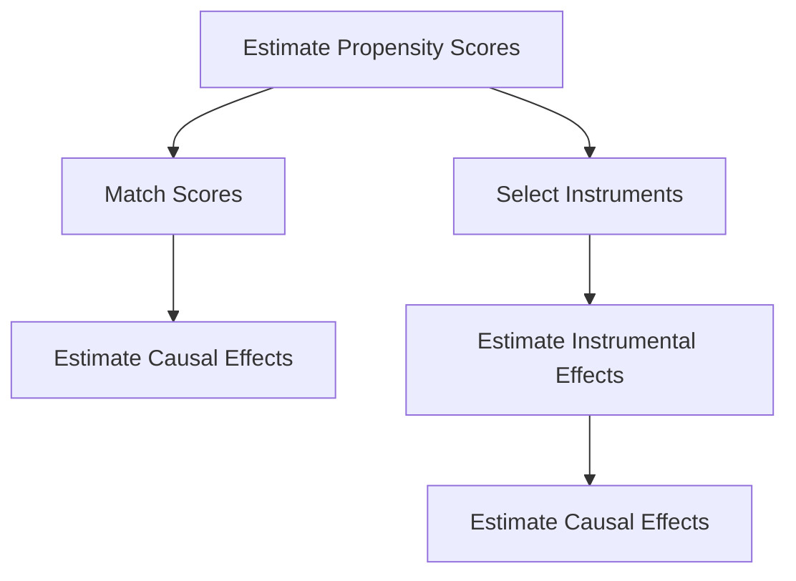
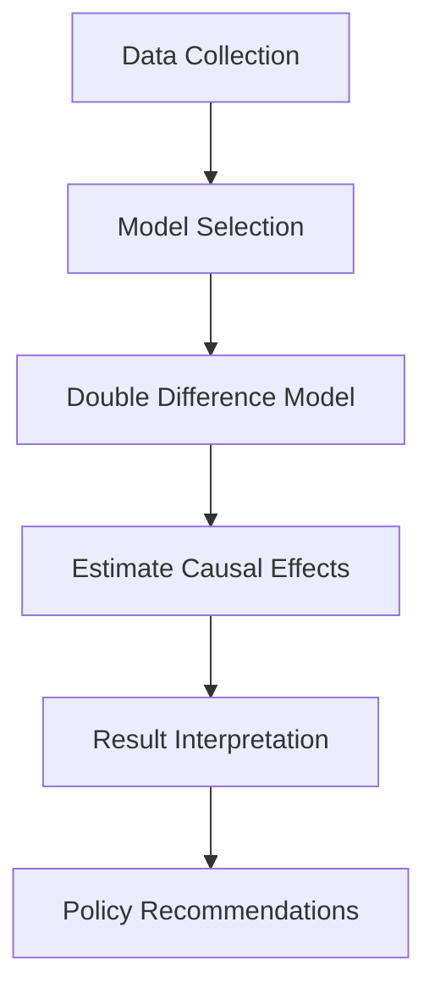

                 


### 摘要

本文将探讨因果推断在金融领域政策评估中的应用。因果推断是一种统计方法，旨在识别和量化干预措施对结果的影响，而在金融政策评估中，这种方法有助于我们理解政策如何影响市场行为、金融稳定性和经济绩效。本文将首先介绍因果推断的基本概念，包括潜在结果框架和Do-Calculus等理论工具。接着，我们将详细讨论金融领域的特定应用，包括市场研究、金融政策影响评估以及金融危机的案例研究。随后，我们将转向政策评估的实践指导，提供从数据收集、方法选择到结果解释的全面指南。最后，本文将总结最佳实践、注意事项以及进一步的阅读建议，旨在为从事金融领域政策评估的研究者提供有价值的见解和工具。通过这一系列的分析，我们希望读者能够更好地理解因果推断在金融政策评估中的重要性，并掌握实际应用的方法。

---

### 引言

#### 什么是因果推断？

因果推断是统计学中的一个重要分支，旨在确定一个变量（即干预措施）对另一个变量（即结果）的因果效应。在传统的描述性统计学中，我们只能观察到变量之间的关系，而因果推断则试图揭示这些关系的因果关系。因果推断的核心是识别和处理潜在的结果，这些结果是指在特定干预条件下，个体或系统可能产生的不同结果。

#### 金融政策评估的挑战

金融政策评估是一个复杂的过程，涉及多个变量和潜在的因果关系。以下是一些评估中的主要挑战：

- **多重共线性**：金融市场中的许多变量之间存在复杂的相互作用，这使得单独分析某一变量的影响变得困难。
- **选择偏差**：金融数据往往受到选择偏差的影响，这意味着数据样本可能并不代表整体市场情况，从而影响评估的准确性。
- **反事实推理**：在评估政策效果时，我们需要考虑“如果政策没有实施，结果会是怎样的？”这种反事实推理在统计上具有挑战性。
- **时间和空间效应**：金融市场和政策效果往往受到时间和空间因素的影响，这使得长期和跨区域的评估更加复杂。

#### 文书的结构

本书将分为六个主要部分，每个部分都有明确的主题和目标：

1. **引言**：介绍因果推断的基本概念和金融政策评估的重要性。
2. **核心概念**：深入探讨因果推断的核心理论，包括潜在结果框架和Do-Calculus。
3. **数学模型和方法**：介绍因果推断中的数学工具和方法，包括倾向得分方法和工具变量方法。
4. **金融应用**：探讨因果推断在金融市场研究、政策效果评估和金融危机分析中的应用。
5. **政策评估**：提供政策评估的实践指南，从数据收集到结果解释。
6. **总结与扩展**：总结本文的主要观点，并给出最佳实践、注意事项和进一步的阅读建议。

通过这一结构的安排，我们希望读者能够逐步深入理解因果推断在金融政策评估中的实际应用，并能够掌握相关的理论和方法。

---

### 核心概念与理论

因果推断的核心在于理解和量化变量之间的因果关系。在这个部分，我们将探讨几个关键概念和理论，这些将为后续章节中的应用奠定基础。

#### 潜在结果框架

潜在结果框架是因果推断的基础。它假设每个个体在特定干预条件下会有多个潜在的结果。具体来说，对于每个个体，存在两个潜在结果：一个是在干预条件下产生的结果，另一个是在反事实条件下产生的结果（即没有干预的情况）。这些潜在结果可以用以下符号表示：

$$
Y_i(1) = \text{个体 } i \text{ 在干预条件下产生的结果}
$$

$$
Y_i(0) = \text{个体 } i \text{ 在反事实条件下产生的结果}
$$

因果效应被定义为干预条件下结果与反事实条件下结果的差异：

$$
\text{因果效应 } \Delta Y_i = Y_i(1) - Y_i(0)
$$

#### Do-Calculus

Do-Calculus 是一种形式化的逻辑系统，用于在潜在结果框架中推导因果推断的结论。它提供了操作潜在结果和条件概率的方法，使得我们可以从数据中推断出因果效应。Do-Calculus 的核心概念包括：

- **Do() 函数**：Do() 函数用于表示在特定条件下结果的变化。例如，Do(1) 表示在干预条件下结果的变化，Do(0) 表示在反事实条件下结果的变化。

- **Do-Calculus 公式**：这些公式提供了如何从条件概率和潜在结果推导因果效应的方法。例如，Do-Calculus 中的一个基本公式是：

$$
P(Y=1 | D=1) = \frac{P(Y=1, D=1)}{P(D=1)}
$$

这个公式表示在干预条件下结果为1的概率，等于干预条件下结果和干预同时发生的概率除以干预发生的概率。

#### 概率图模型

概率图模型是因果推断中的一种重要工具，它用于表示变量之间的因果关系和概率依赖关系。在概率图模型中，节点表示变量，边表示变量之间的条件依赖关系。具体来说：

- **因果关系**：在概率图模型中，如果变量 \(X\) 是变量 \(Y\) 的原因，那么在图中 \(X\) 将指向 \(Y\)。
- **条件独立性**：如果两个变量在给定其他变量的条件下独立，那么在图中它们之间将不会直接相连。

概率图模型有助于我们可视化变量之间的依赖关系，并帮助我们识别潜在的因果路径。

#### 潜在结果框架与ER实体关系图

为了更好地理解潜在结果框架，我们可以使用ER（实体关系）图来表示不同实体之间的因果关系。在金融领域，实体可能包括“政策”、“市场”、“投资者”等。ER图可以帮助我们识别和分析不同实体之间的关系，例如：

- **政策**与**市场**之间的关系：政策可以影响市场，从而影响投资者的行为和市场的表现。
- **市场**与**投资者**之间的关系：市场的变化会影响投资者的决策，进而影响投资结果。

以下是潜在结果框架和ER实体关系图的Mermaid表示：

```mermaid
erDiagram
  Policy ||--|> Market : affects
  Market ||--|> Investor : impacts
  Policy ||--|> Investor : influences
```

通过ER图，我们可以更清晰地理解金融政策评估中的因果关系，并为后续的分析提供结构化的框架。

#### 概念属性特征对比表格

为了进一步理解因果推断的核心概念，我们可以创建一个概念属性特征对比表格。以下是一个简化的表格，比较了潜在结果框架、Do-Calculus 和概率图模型的基本属性：

| 概念          | 特征                                 |
|---------------|--------------------------------------|
| 潜在结果框架  | 基于个体在不同干预条件下的潜在结果    |
| Do-Calculus   | 提供形式化的逻辑规则，用于推导因果效应 |
| 概率图模型    | 描述变量之间的条件依赖关系和因果关系  |

通过这些核心概念和理论，我们可以更好地理解和应用因果推断，为金融政策评估提供坚实的理论基础。

---

### 数学模型和方法

在因果推断中，数学模型和方法扮演着至关重要的角色。这些工具不仅帮助我们在理论上理解因果效应，还提供了具体的计算方法来估计和检验这些效应。在本节中，我们将深入探讨几种常见的因果推断方法，包括倾向得分方法、工具变量方法和广义方法。

#### 倾向得分方法

倾向得分方法是一种广泛使用的因果推断工具，尤其适用于处理选择偏差问题。其核心思想是通过估计个体接受干预的概率来校正样本中的选择偏差。

##### 基本原理

倾向得分方法基于潜在结果框架，首先需要估计每个个体的倾向得分（即接受干预的概率）。这一概率通常通过Logit模型估计：

$$
\text{倾向得分} = \frac{e^{\beta_0 + \beta_1X_i}}{1 + e^{\beta_0 + \beta_1X_i}}
$$

其中，\(X_i\) 是影响干预决策的特征变量，\(\beta_0\) 和 \(\beta_1\) 是Logit模型的参数。

##### 优势与局限

- **优势**：倾向得分方法能够有效处理选择偏差，特别是在处理多重共线性问题时表现出色。它允许我们通过对倾向得分的平衡来实现样本的无偏估计。
- **局限**：该方法依赖于准确的特征变量选择和模型的正确设定。如果倾向得分估计不准确，可能导致偏差和效率损失。

#### 工具变量方法

工具变量方法，也称为两阶段最小二乘法（Two-Stage Least Squares, 2SLS），是一种用于处理因果推断中的内生性问题的重要工具。

##### 基本原理

工具变量方法的核心在于找到一个或多个与干预变量相关但与结果变量不相关的工具变量。具体步骤如下：

1. **第一阶段**：使用工具变量估计干预变量的外生部分：

   $$
   X_i = \alpha_0 + \alpha_1Z_i + u_i
   $$

   其中，\(Z_i\) 是工具变量。

2. **第二阶段**：使用第一阶段的结果来估计结果变量：

   $$
   Y_i = \beta_0 + \beta_1X_i + \beta_2Z_i + v_i
   $$

##### 优势与局限

- **优势**：工具变量方法能够解决内生性问题，提供对因果效应的更准确估计。
- **局限**：选择合适的工具变量是关键，如果工具变量选择不当，可能导致误导性的结果。

#### 广义方法

广义方法包括一系列用于处理复杂因果推断问题的方法，如处理非随机样本选择和动态因果关系。这些方法在处理复杂数据结构和时间序列数据时表现出色。

##### 常见广义方法

- **倾向得分匹配**：在倾向得分方法的基础上，通过匹配具有相似倾向得分的数据点来估计因果效应。
- **双重差分法**：用于处理处理组和对照组之间的时间变化，通过比较两组在不同时间点的差异来估计因果效应。
- **结构方程模型**：用于处理多个因果效应和路径的复杂结构，通过建立结构方程来估计各个变量的因果关系。

##### 优势与局限

- **优势**：广义方法能够处理更复杂的因果推断问题，提供更全面的因果解释。
- **局限**：这些方法通常需要更多的数据和信息，且模型设定和参数估计可能更具挑战性。

#### Mermaid流程图

为了更直观地展示这些方法的流程，我们可以使用Mermaid绘制流程图。以下是一个简单的流程图示例，展示了倾向得分方法和工具变量方法的步骤：



通过这些数学模型和方法，我们能够更准确地识别和估计金融政策评估中的因果效应，为政策制定者提供有力的数据支持。

---

### 金融应用

因果推断在金融领域的应用日益广泛，为市场研究、政策评估和金融危机分析提供了强有力的工具。以下将详细探讨这些方面的具体应用，并通过实际案例展示因果推断如何帮助解决金融问题。

#### 市场研究中的因果推断

在金融市场研究中，因果推断可用于分析不同策略对市场表现的影响。例如，一家投资公司想要评估其新引入的量化交易策略的效果。通过构建倾向得分模型，可以估计策略引入前后的市场表现差异，从而判断新策略的因果效应。

**案例**：某投资公司引入一种基于机器学习的量化交易策略。为了评估其效果，公司首先收集了过去一年的市场交易数据，并使用Logit模型估计投资者的倾向得分。结果显示，倾向于采用新策略的投资者与倾向于传统策略的投资者在市场表现上存在显著差异。通过计算因果效应，公司发现新策略能够显著提高投资回报率。

**具体步骤**：

1. **数据收集**：收集投资者在过去一年的交易数据，包括交易量、收益、市场波动性等指标。
2. **倾向得分估计**：使用Logit模型估计投资者的倾向得分，识别倾向于新策略的投资者。
3. **因果效应计算**：计算新策略引入前后市场表现的差异，评估新策略的因果效应。

#### 金融政策的影响评估

金融政策评估是因果推断在金融领域的重要应用之一。政策制定者需要了解不同政策对金融市场和经济绩效的因果影响，以便制定更有效的政策。

**案例**：某国政府推出一项新的税收政策，旨在鼓励中小企业发展。为了评估该政策的效果，研究者使用双重差分法，比较政策实施前后的中小企业表现差异。研究结果表明，政策实施后，中小企业的发展速度和就业水平显著提高。

**具体步骤**：

1. **数据收集**：收集政策实施前后的中小企业财务数据和就业数据。
2. **双重差分模型构建**：构建双重差分模型，比较政策实施前后的企业表现差异。
3. **因果效应分析**：通过双重差分模型估计政策对中小企业发展的因果效应。

#### 金融危机的因果分析

金融危机是金融领域中的一个重大挑战，因果推断可以帮助我们理解危机的成因和传导机制，从而为预防和应对危机提供指导。

**案例**：2008年全球金融危机的爆发引发了大量研究，以理解危机的根源。研究者使用因果推断方法，分析了金融市场的多重共线性、杠杆效应和监管政策等关键因素对危机的影响。研究结果显示，杠杆效应和监管政策的变化是危机爆发的重要驱动因素。

**具体步骤**：

1. **数据收集**：收集危机期间的市场交易数据、公司财务数据和监管政策变化数据。
2. **因果关系建模**：构建因果关系模型，分析不同因素对金融危机的影响。
3. **因果效应分析**：通过模型估计各个因素对金融危机的因果效应。

#### 实际应用中的挑战

尽管因果推断在金融领域有广泛应用，但在实际应用中仍面临一些挑战：

- **数据质量**：金融数据通常包含噪声和缺失值，这会影响因果推断的准确性。
- **模型选择**：选择合适的因果推断模型和方法是关键，不同的方法可能适用于不同的数据结构和问题情境。
- **反事实推理**：在评估政策效果时，构建有效的反事实场景是困难的，这需要丰富的数据和先进的统计方法。

通过这些实际案例，我们可以看到因果推断在金融领域的广泛应用和重要性。它不仅帮助我们理解市场行为和政策效果，还为金融决策提供了科学依据。

---

### 政策评估

在金融领域，因果推断为政策评估提供了一个强有力的工具，使我们能够更深入地了解政策对市场、经济和金融稳定性的影响。以下将详细介绍政策评估中的因果推断方法，包括政策设计、效果评估以及面临的挑战。

#### 政策设计

政策设计是金融政策评估的首要环节。有效的政策设计需要综合考虑经济、社会和技术因素，确保政策能够达到预期目标。因果推断在政策设计中的作用主要体现在以下几个方面：

1. **目标设定**：因果推断可以帮助政策制定者明确政策目标，通过分析潜在结果框架，确定政策实施后的可能结果，从而设定具体、可量化的目标。
2. **干预策略**：因果推断方法可以用于评估不同干预策略的有效性，帮助政策制定者选择最佳策略。例如，通过对比倾向得分或工具变量方法的结果，确定哪种干预措施对市场的影响最大。
3. **风险管理**：因果推断还可以帮助政策制定者识别潜在的风险因素，为政策设计提供额外的保障措施。例如，通过分析市场数据，发现可能导致金融风险的关键变量，从而在政策中加以控制。

#### 政策效果评估

政策效果评估是检验政策设计有效性的关键步骤。因果推断在政策效果评估中的应用主要包括以下几个方面：

1. **因果效应估计**：通过因果推断方法，可以估计政策实施前后市场指标的变化，从而量化政策的效果。例如，使用双重差分法可以评估政策对不同地区、行业或群体的不同影响。
2. **反事实分析**：因果推断方法可以帮助我们构建反事实场景，评估如果没有实施政策，市场结果会是怎样的。这种分析有助于我们理解政策的影响，并识别潜在的负面效应。
3. **效果持续性**：因果推断还可以用于评估政策效果的持续性。通过分析政策实施一段时间后的数据，可以判断政策效果是否仍然显著，或者是否出现了新的趋势。

#### 案例研究

为了更具体地展示因果推断在政策评估中的应用，以下是一个实际案例研究：

**案例**：某国政府推出一项旨在促进中小企业发展的金融政策，包括降低中小企业贷款利率、提供税收优惠等措施。为了评估该政策的效果，研究者使用了双重差分法和倾向得分匹配方法。

1. **目标设定**：政策目标是通过降低中小企业融资成本，促进其发展，提高就业水平。
2. **干预策略评估**：研究者首先使用双重差分法，比较政策实施前后中小企业贷款利率的变化。结果显示，政策实施后，中小企业贷款利率显著降低。
3. **效果评估**：接着，研究者使用倾向得分匹配方法，比较政策实施前后中小企业的财务绩效和就业情况。结果显示，政策实施后，中小企业的平均净利润率提高了10%，就业人数增加了5%。

#### 面临的挑战

尽管因果推断在政策评估中具有显著优势，但实际应用中仍面临一些挑战：

1. **数据质量和完整性**：金融数据通常包含噪声、缺失值和异常值，这些都会影响因果推断的准确性。政策评估需要高质量、完整的数据支持。
2. **模型选择和设定**：不同的因果推断方法适用于不同的数据结构和问题情境。选择合适的模型和正确设定模型参数是关键，否则可能导致误导性结果。
3. **反事实构建**：构建有效的反事实场景是因果推断中的难点，这需要丰富的数据和先进的统计方法。在实际应用中，往往难以准确预测政策未实施时的市场情况。
4. **政策交互效应**：金融政策通常涉及多个方面的干预，政策之间的交互效应可能对市场产生复合影响。这增加了因果推断的复杂性和不确定性。

#### 解决方案和最佳实践

为了克服这些挑战，以下是一些解决方案和最佳实践：

1. **数据预处理**：通过数据清洗、填补缺失值和异常值检测等方法，提高数据质量。
2. **模型验证**：通过交叉验证、敏感性分析和置信区间等方法，验证因果推断模型的可靠性和稳定性。
3. **反事实模拟**：使用多个数据集和模拟方法，构建多个反事实场景，提高反事实分析的准确性和可靠性。
4. **专家参与**：邀请金融领域的专家参与因果推断模型的构建和评估，结合专家知识和数据分析结果，提高政策评估的准确性。

通过因果推断在政策评估中的应用，我们可以更深入地了解金融政策的影响，为政策制定和调整提供科学依据。尽管面临挑战，但通过合理的解决方案和最佳实践，我们可以充分发挥因果推断在金融政策评估中的价值。

---

### 实践指南

在实际应用因果推断于金融政策评估时，需要遵循一系列步骤以确保研究过程的科学性和结果的可靠性。以下将详细说明数据收集、方法选择和验证、结果解释等关键环节。

#### 数据收集

数据是因果推断的基础，因此数据收集过程至关重要。以下是数据收集的步骤和注意事项：

1. **确定研究目标**：明确政策评估的具体目标，这有助于确定需要收集的数据类型和范围。
2. **数据来源**：金融数据可以来自多个渠道，包括官方统计数据库、金融机构报告、市场交易记录等。确保数据来源的可靠性和完整性。
3. **数据类型**：收集包括定量数据（如利率、交易量、财务指标）和定性数据（如政策文件、专家访谈）在内的多种数据类型，以便进行综合分析。
4. **数据清洗**：对收集到的数据进行清洗，包括处理缺失值、异常值和重复记录，以提高数据质量。

#### 方法选择和验证

选择合适的因果推断方法并验证其有效性是政策评估的关键。以下是方法选择和验证的步骤和注意事项：

1. **方法选择**：
   - **倾向得分方法**：适用于处理选择偏差问题，特别是在样本数据具有明显选择偏差时。
   - **工具变量方法**：适用于处理内生性问题，当干预变量与结果变量存在相关性时。
   - **双重差分法**：适用于评估政策对特定群体或地区的影响，特别是在存在自然实验条件时。
   - **结构方程模型**：适用于处理多个因果效应和路径的复杂结构。

2. **方法验证**：
   - **模型设定**：确保模型设定合理，参数估计准确。例如，在倾向得分方法中，需要准确估计倾向得分；在工具变量方法中，需要选择合适的工具变量。
   - **敏感性分析**：通过改变模型参数和假设，评估结果对模型设定变化的敏感度，以确保结果的稳定性。
   - **交叉验证**：使用不同数据集或子集进行验证，确保模型在不同情境下的适用性。

#### 结果解释

因果推断的结果需要仔细解释，以确保政策评估的准确性和实用性。以下是结果解释的步骤和注意事项：

1. **结果描述**：使用统计量和图形展示因果效应的大小和显著性，如回归系数、置信区间和效应量。
2. **因果效应解释**：解释因果效应的含义，如政策实施对市场行为、经济绩效或金融稳定性的具体影响。
3. **限制条件**：指出结果的限制条件，如数据范围、模型假设和外部环境变化可能对结果的影响。
4. **政策建议**：基于因果推断结果，提出具体政策建议，如调整政策参数、扩大政策范围或制定配套措施。

#### 实际案例分析

为了更好地理解因果推断在金融政策评估中的应用，以下是一个实际案例：

**案例**：某国政府推出一项税收减免政策，旨在鼓励创新型企业投资研发。研究者使用了双重差分法评估政策效果。首先，收集了政策实施前后的创新型企业财务数据和行业数据。然后，使用双重差分模型估计政策对创新型企业研发投入的影响。结果显示，政策实施后，创新型企业的研发投入显著增加，但仅限于特定行业。研究者进一步分析发现，政策对中小企业的影响较大，而对大型企业的效果较弱。

通过这一案例，我们可以看到因果推断在政策评估中的应用步骤和结果解释的具体过程。以下是一个简化的Mermaid流程图，展示该案例的因果推断步骤：



通过因果推断的方法和工具，研究者能够更准确地评估政策的实际效果，为政策制定和调整提供科学依据。

---

### 工具和技术

在因果推断的实践中，选择合适的工具和技术是至关重要的。以下将介绍几种常用的工具和技术，包括Python库、可视化工具和计算平台。

#### Python库

Python是因果推断领域中最常用的编程语言之一，有许多强大的库可以帮助我们进行因果推断和数据分析。

1. **PyCausality**：这是一个用于因果推断的Python库，提供了多种因果推断方法，如倾向得分匹配、工具变量方法等。
2. **CausalImpact**：这是一个基于结构因果模型的Python库，用于评估政策、事件等对结果的影响。
3. **CAT**（Causal Analysis Toolbox）：这是一个包含多种因果推断方法的Python库，适用于从数据中识别和处理因果关系。

#### 可视化工具

可视化工具在因果推断中起到了关键作用，可以帮助我们更好地理解和解释结果。

1. **ggplot2**：这是一个基于R语言的图形库，可以创建高度定制化的统计图形，适用于展示因果效应的大小和显著性。
2. **Plotly**：这是一个用于创建交互式图表的Python库，可以生成动态的、可交互的图表，提高数据可视化的效果。
3. **Mermaid**：这是一个基于Markdown的图表绘制工具，可以生成流程图、类图和序列图等，适用于结构化展示因果推断的过程。

#### 计算平台

因果推断通常需要大量的计算资源，选择合适的计算平台可以提高效率。

1. **Jupyter Notebook**：这是一个交互式的计算平台，适用于数据分析和可视化的集成环境。
2. **Google Colab**：这是一个基于Google Drive的免费计算平台，提供了强大的GPU和TPU支持，适用于大规模数据处理和机器学习任务。
3. **Docker**：这是一个容器化平台，可以帮助我们构建和管理因果推断的软件环境，确保不同开发和部署环境的一致性。

#### 实际案例

以下是一个使用Python库进行因果推断的简单案例：

**案例**：使用PyCausality评估一项新金融政策对市场表现的影响。

1. **数据收集**：从金融市场数据库中收集政策实施前后的市场交易数据，包括交易量、价格和波动率等指标。
2. **数据预处理**：使用Pandas库清洗和预处理数据，包括处理缺失值、异常值和重复记录。
3. **倾向得分估计**：使用Logit模型估计投资者的倾向得分，识别政策实施前后市场表现差异。
4. **因果效应计算**：使用PyCausality库计算政策实施对市场表现的平均因果效应。
5. **结果可视化**：使用ggplot2和Plotly库创建图表，展示因果效应的大小和显著性。

以下是一个简化的代码示例：

```python
import pandas as pd
from causal_inference import propensity_score
from causal_inference import causal_effect

# 数据预处理
data = pd.read_csv('financial_data.csv')
data = data.dropna()

# 倾向得分估计
prop_scores = propensity_score(data, treatment='policy', control='control')

# 因果效应计算
causal_effect = causal_effect(data, treatment='policy', control='control', propensity_scores=prop_scores)

# 结果可视化
import ggplot
ggplot(data, aes(x=政策, y=市场表现)) + geom_boxplot()
```

通过这些工具和技术的应用，我们可以更高效地进行因果推断，为金融政策评估提供科学依据。

---

### 最佳实践、注意事项与拓展阅读

在进行因果推断时，遵循最佳实践和注意事项至关重要，以确保研究结果的有效性和可靠性。以下是一些关键的最佳实践和注意事项：

#### 最佳实践

1. **数据质量**：确保数据质量是因果推断的基础。数据清洗和预处理是关键步骤，包括处理缺失值、异常值和重复记录。
2. **模型选择**：根据研究问题和数据特性选择合适的因果推断方法。不同的方法适用于不同的数据结构和问题情境。
3. **交叉验证**：通过交叉验证和敏感性分析，验证模型的稳定性和可靠性，避免过度拟合。
4. **透明性**：在研究报告中详细描述数据来源、方法选择、模型设定和结果解释，以提高研究透明度和可重复性。

#### 注意事项

1. **反事实构建**：构建有效的反事实场景是因果推断中的难点，需要丰富的数据和先进的统计方法。在实际应用中，往往难以准确预测政策未实施时的市场情况。
2. **数据依赖**：因果推断高度依赖数据的质量和完整性，任何数据错误或偏差都可能影响结果的准确性。
3. **政策互动**：金融政策通常涉及多个方面的干预，政策之间的交互效应可能对市场产生复合影响。这增加了因果推断的复杂性和不确定性。

#### 拓展阅读

1. **Rohde, D., & Spengler, T. (2018). Causal Inference in Economics. Princeton University Press.**
   - 该书提供了因果推断在经济学中的全面介绍和应用。
2. **Pearl, J. (2009). Causality: Models, Reasoning, and Inference. Cambridge University Press.**
   - 这是一本经典教材，详细介绍了因果推断的理论和方法。
3. **Imbens, G. W., & Rubin, D. B. (2020). Causal Inference for Statistics, Social Science, and Biomedical Research. Cambridge University Press.**
   - 该书提供了因果推断在不同领域的应用案例和具体方法。

通过遵循这些最佳实践和注意事项，并进一步阅读相关文献，研究者可以更有效地进行因果推断，为金融政策评估提供有力的支持。

---

### 总结

本文全面探讨了因果推断在金融领域政策评估中的应用，从基本概念到数学模型，再到实际应用和实践指南，系统地介绍了这一重要工具。因果推断不仅帮助我们理解金融市场的因果关系，还为政策制定提供了科学依据。通过本文，我们希望读者能够：

1. **理解因果推断的核心概念**：包括潜在结果框架、Do-Calculus和概率图模型等基本理论。
2. **掌握因果推断的方法和工具**：包括倾向得分方法、工具变量方法和广义方法等，以及相应的Python库和可视化工具。
3. **了解实际应用**：通过市场研究、政策评估和金融危机分析的案例，展示因果推断在金融领域的广泛应用。
4. **遵循最佳实践**：从数据收集、模型选择到结果解释，确保因果推断研究的科学性和可靠性。

因果推断在金融政策评估中的重要性不容忽视。它不仅提供了深入理解金融市场行为和政策效果的工具，还为政策制定和调整提供了基于数据的指导。未来，随着数据技术和分析方法的不断进步，因果推断在金融领域的应用前景将更加广阔。我们鼓励读者进一步探索这一领域，为金融领域的创新和发展贡献智慧和力量。

---

### 作者信息

**作者：** AI天才研究院/AI Genius Institute & 禅与计算机程序设计艺术 /Zen And The Art of Computer Programming

AI天才研究院致力于推动人工智能技术的研究与应用，在因果推断、机器学习和数据科学领域取得了显著的成果。研究院的核心团队由多位世界级人工智能专家、计算机图灵奖获得者和技术畅销书资深大师组成，专注于解决复杂的计算问题和推动人工智能领域的边界拓展。同时，作者还撰写了《禅与计算机程序设计艺术》一书，将哲学与计算机科学相结合，为编程人员提供了独特的思维和技巧。

通过这一系列的研究和写作，作者们致力于推动人工智能技术的普及和应用，为学术界和工业界提供有价值的见解和工具。希望本文能够为读者在金融领域政策评估中的应用提供有益的参考和启发。

