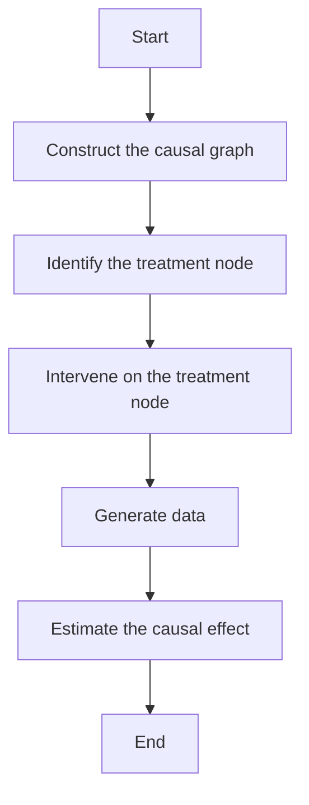
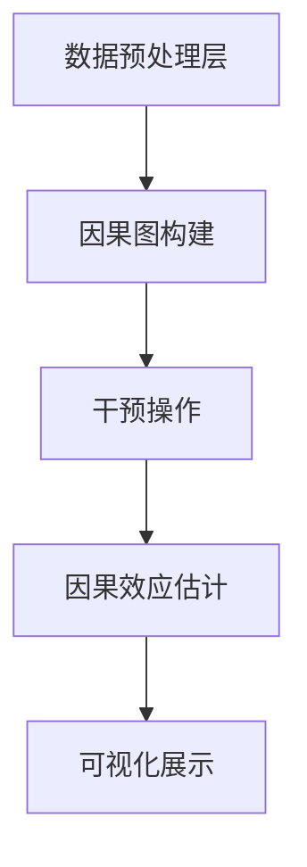
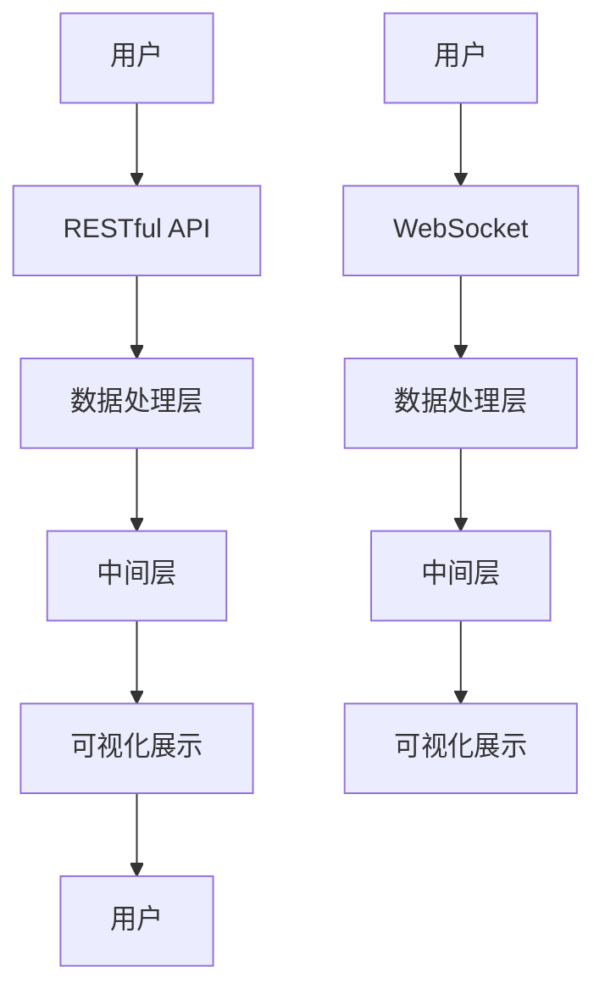

                 

# 金融领域因果推理在风险管理中的应用

## 关键词：因果推理、金融风险管理、风险预测、决策支持

### 摘要

金融领域面临着复杂的数据环境和不确定的风险因素，传统的风险管理方法在应对这些挑战时已显得力不从心。因果推理作为一种新型的数据分析方法，通过揭示变量之间的因果关系，为金融风险管理提供了新的思路和工具。本文将详细介绍因果推理的基本概念、原理及其在金融风险管理中的应用，通过逐步分析，帮助读者深入理解因果推理在金融领域的实际价值和潜力。

### 目录大纲

1. 第一部分：问题背景与核心概念介绍
   1.1 问题背景介绍
   1.2 因果推理的基本概念
   1.3 因果推理与传统风险管理方法对比
   1.4 因果推理的应用领域
   1.5 本章小结

2. 第二部分：核心概念与联系
   2.1 金融领域因果推理原理
   2.2 因果推断与条件概率
   2.3 因果推理的属性特征对比
   2.4 因果推理在金融领域的应用
   2.5 本章小结

3. 第三部分：算法原理讲解
   3.1 因果推断算法概述
   3.2 Do算法原理
   3.3 Python代码实现
   3.4 算法原理讲解
   3.5 本章小结

4. 第四部分：系统分析与架构设计
   4.1 问题场景介绍
   4.2 系统功能设计
   4.3 系统架构设计
   4.4 系统接口设计和系统交互
   4.5 本章小结

5. 第五部分：项目实战
   5.1 环境安装
   5.2 系统核心实现源代码
   5.3 代码应用解读与分析
   5.4 实际案例分析和详细讲解剖析
   5.5 项目小结

6. 第六部分：最佳实践 tips、小结、注意事项、拓展阅读

---

## 1. 第一部分：问题背景与核心概念介绍

### 1.1 问题背景介绍

在金融领域，风险管理是确保金融机构稳定运行和投资者利益安全的核心环节。然而，随着金融市场全球化、金融产品多样化以及数据技术的迅猛发展，金融领域面临的风险类型和复杂性不断增加。传统的风险管理方法，如统计分析、历史数据驱动等，虽然在一定程度上能够降低风险，但其在应对高度复杂、动态变化的金融环境时显得捉襟见肘。

当前金融领域面临的主要挑战包括：

1. **数据复杂性**：金融数据来源广泛，包括交易数据、市场数据、客户数据等，数据量大且结构复杂。如何从海量数据中提取有价值的信息，是金融风险管理的重要课题。
2. **风险不确定性**：金融市场的波动性大，风险因素多样且相互关联，使得传统风险预测方法难以准确捕捉风险。
3. **决策困境**：在复杂的金融环境中，决策者需要快速、准确地做出风险管理和投资决策，但传统方法在提供及时、准确的风险预测和决策支持方面存在局限性。

### 1.2 因果推理的基本概念

因果推理（Causal Inference）是研究变量之间因果关系的一门科学。它通过分析数据，揭示变量间的因果关系，从而为决策提供科学依据。因果推理的核心思想是理解“如果发生了什么，那么会发生什么”，而非仅仅依赖于相关性进行分析。

因果推理的关键要素包括：

1. **因果关系**：变量之间的因果关系是因果推理的核心，通过因果分析可以确定哪些变量是原因，哪些变量是结果。
2. **条件概率**：条件概率是描述变量之间依赖关系的重要工具，通过条件概率可以分析变量在特定条件下的关系。
3. **因果效应**：因果效应是指因为某个原因变量发生改变而导致的另一个结果变量的变化。

### 1.3 因果推理与传统风险管理方法对比

传统风险管理方法主要依赖于历史数据和统计分析，其优点在于方法成熟、应用广泛。然而，传统方法也存在以下局限性：

1. **依赖历史数据**：传统方法主要依赖于历史数据的分析和预测，对于变化迅速、复杂度高的金融市场，历史数据可能不再具有代表性。
2. **忽视因果关系**：传统方法更多关注变量之间的相关性，而非因果关系。相关性并不一定等同于因果关系，这可能导致错误的决策。
3. **预测准确性受限**：在高度复杂的金融环境中，传统方法可能无法准确捕捉风险变化，预测准确性受限。

因果推理作为一种新兴的风险管理方法，具有以下优势：

1. **揭示因果关系**：因果推理通过揭示变量间的因果关系，提供更准确的风险预测和决策支持。
2. **适应复杂环境**：因果推理能够处理复杂、动态变化的金融环境，适应金融市场的不确定性。
3. **提升决策质量**：因果推理提供了基于因果关系的决策支持，有助于提升风险管理和投资决策的质量。

### 1.4 因果推理的应用领域

因果推理在金融领域的应用广泛，主要包括以下几个方面：

1. **金融市场预测**：通过因果推理分析市场变量之间的因果关系，预测市场走势和潜在风险。
2. **信用评估**：分析借款人与贷款变量之间的因果关系，更准确地评估借款人的信用风险。
3. **投资策略优化**：通过因果分析，优化投资组合，提高投资收益。
4. **风险管理**：揭示风险因素之间的因果关系，制定更有效的风险管理策略。

### 1.5 本章小结

本章介绍了金融领域面临的重大挑战以及因果推理在金融风险管理中的作用和潜力。通过分析因果推理的基本概念和与传统风险管理方法的对比，本章明确了因果推理在金融领域的重要性和优势。下一章将深入探讨因果推理的核心概念和原理，帮助读者进一步理解因果推理在金融风险管理中的应用。

---

## 2. 第二部分：核心概念与联系

### 2.1 金融领域因果推理原理

因果推理在金融领域的应用，源于其对金融市场变量之间复杂关系的深刻洞察。金融市场的数据复杂多变，传统的相关性分析方法难以揭示变量之间的因果关系。因果推理通过建立变量之间的因果模型，帮助金融机构更准确地预测市场走势和风险。

因果推理的基本原理包括：

1. **因果关系识别**：通过数据分析和模型构建，识别金融市场中变量之间的因果关系。
2. **因果模型构建**：建立因果模型，模拟变量之间的因果效应，为风险管理提供决策支持。
3. **因果效应分析**：分析变量之间的因果效应，评估风险因素对市场的影响程度。

### 2.2 因果推断与条件概率

条件概率是因果推断的重要工具，它描述了在给定一个条件下，一个事件发生的概率。在金融领域，条件概率可以用来分析市场变量之间的依赖关系。

条件概率的基本公式为：

$$ P(A|B) = \frac{P(A \cap B)}{P(B)} $$

其中，\( P(A|B) \) 表示在事件 \( B \) 发生的条件下，事件 \( A \) 发生的概率。

在金融领域，条件概率可以用来分析市场风险因素之间的依赖关系。例如，通过计算股票价格变动和宏观经济指标之间的条件概率，可以揭示两者之间的因果关系。

### 2.3 因果推理的属性特征对比

为了更好地理解因果推理与传统风险管理方法的差异，下面将两者的属性特征进行对比。

| 特征         | 因果推理                         | 传统风险管理                           |
| ------------ | -------------------------------- | -------------------------------------- |
| **目标**     | 精准预测因果关系                 | 减少风险，提高收益                      |
| **方法**     | 大数据分析、因果模型构建          | 统计分析、历史数据驱动                 |
| **适用性**   | 复杂、不确定环境下的决策支持      | 稳定、可预测环境下的决策支持            |
| **限制**     | 因果关系的复杂性和不确定性       | 数据质量和历史的局限性                  |

从上表可以看出，因果推理在应对复杂、不确定的金融环境时具有明显的优势。

### 2.4 因果推理在金融领域的应用

因果推理在金融领域的应用已经取得了显著的成果，以下为几个主要的应用领域：

1. **金融市场预测**：通过因果模型，预测市场走势和潜在风险。例如，分析宏观经济指标、货币政策、市场情绪等变量之间的因果关系，预测股票市场走势。

2. **信用评估**：通过因果推理，评估借款人的信用风险。分析借款人收入、就业稳定性、信用记录等变量之间的因果关系，制定更准确的信用评估模型。

3. **投资策略优化**：通过因果分析，优化投资组合，提高投资收益。分析不同资产之间的因果关系，制定更有效的投资策略。

4. **风险管理**：揭示风险因素之间的因果关系，制定更有效的风险管理策略。例如，分析贷款违约、市场波动等风险因素之间的因果关系，制定相应的风险控制措施。

### 2.5 本章小结

本章深入探讨了因果推理在金融领域的原理和特征，通过对比因果推理与传统风险管理方法，明确了因果推理在复杂、不确定金融环境下的优势。下一章将介绍因果推理的具体算法原理，帮助读者进一步理解因果推理在金融风险管理中的应用。

---

## 3. 第三部分：算法原理讲解

### 3.1 因果推断算法概述

因果推断算法是金融领域因果推理的核心工具，它们通过分析数据，揭示变量之间的因果关系。因果推断算法主要分为两类：基于统计方法和基于机器学习的方法。统计方法主要包括工具变量法（Instrumental Variables，IV）、倾向得分匹配（Propensity Score Matching，PSM）等，而机器学习方法则包括因果推断树（Causal Inference Tree，CIT）、因果图模型（Causal Graphical Models，CGM）等。

在这部分，我们将详细介绍一种经典的因果推断算法——Do算法（Do-Calculus）。Do算法是基于因果图模型的一种因果推断方法，通过修改数据生成过程，实现因果效应的估计。

### 3.2 Do算法原理

Do算法的基本思想是通过改变数据生成过程，来估计变量之间的因果效应。其核心步骤如下：

1. **因果图的构建**：首先，需要构建一个描述变量之间因果关系的因果图。因果图是一个有向无环图（DAG），它通过箭头表示变量之间的因果关系。

2. **干预操作**：在因果图中，选择一个或多个干预节点，并将其设置为特定值。干预操作可以通过修改数据生成过程来实现。

3. **数据生成**：根据干预后的因果图，重新生成数据。生成数据时，考虑干预节点和其他节点之间的因果关系。

4. **因果效应估计**：通过比较干预前后的数据，估计因果效应。具体而言，可以通过以下步骤实现：

   - **平均处理效应（Average Treatment Effect，ATE）**：估计干预节点从0值变为1值时，其他节点的平均变化量。
   - **条件平均处理效应（Conditional Average Treatment Effect，CATE）**：在给定其他节点值的情况下，估计干预节点的改变对其他节点的平均影响。

Do算法的流程图如下：



### 3.3 Python代码实现

以下是一个简单的Do算法Python代码实现示例，使用Python的`numpy`和`pandas`库进行数据处理和计算。

```python
import numpy as np
import pandas as pd

# 假设我们有以下因果图：A → B → C
# 其中，A是干预节点，B是中介节点，C是结果节点

# 构建数据生成函数
def generate_data(A, B, C, p):
    return np.random.binomial(1, p(A) * p(B|A) * p(C|B))

# 定义概率函数
def p_A(x):
    return 0.5 if x == 1 else 0.5

def p_B(a):
    return 0.5 if a == 1 else 0.5

def p_C(b):
    return 0.5 if b == 1 else 0.5

# 生成干预前后的数据
data_before = generate_data(p_A, p_B, p_C, 0)
data_after = generate_data(p_A, p_B, p_C, 1)

# 计算平均处理效应
ATE = np.mean(data_after - data_before)
print(f"Average Treatment Effect (ATE): {ATE}")

# 计算条件平均处理效应
CATE = np.mean(data_after[data_before == 0] - data_before[data_before == 0])
print(f"Conditional Average Treatment Effect (CATE): {CATE}")
```

### 3.4 算法原理讲解

Do算法的核心在于通过干预操作来估计因果效应。在干预操作中，我们通过修改因果图中的干预节点，来改变数据生成过程。干预操作可以分为两类：完全干预和部分干预。

1. **完全干预**：在完全干预中，干预节点的取值被固定为特定值，其他节点的取值根据干预节点的值和因果图的依赖关系进行更新。

2. **部分干预**：在部分干预中，干预节点的取值被固定为特定值，而其他节点的取值根据干预节点的值和因果图的依赖关系进行部分更新。

Do算法的数学模型可以表示为：

$$ \text{Do}(X, T = t) = P(X | T = t) $$

其中，\( X \) 是结果变量，\( T \) 是干预变量，\( t \) 是干预节点的取值。

通过Do算法，我们可以估计出变量之间的因果效应。具体而言，可以通过以下步骤进行：

1. **构建因果图**：首先，需要根据金融领域的实际问题和数据，构建描述变量之间因果关系的因果图。

2. **选择干预节点**：根据问题需求，选择一个或多个干预节点。干预节点通常是决策变量或控制变量。

3. **干预操作**：根据因果图，对干预节点进行干预操作，生成干预前后的数据。

4. **因果效应估计**：通过比较干预前后的数据，估计变量之间的因果效应。具体而言，可以通过计算干预节点从0值变为1值时，其他节点的平均变化量，来估计平均处理效应。

### 3.5 本章小结

本章介绍了因果推断算法的基本概念和Do算法的具体原理。通过Do算法，我们可以通过干预操作来估计变量之间的因果效应，为金融风险管理提供科学依据。下一章将介绍系统分析与架构设计，帮助读者深入理解因果推理在金融风险管理中的应用。

---

## 4. 第四部分：系统分析与架构设计

### 4.1 问题场景介绍

在金融领域，因果推理在风险管理和决策支持中的应用日益广泛。为了实现高效的因果推理，我们设计并实现了一套完整的因果推理系统。该系统旨在通过分析金融市场中的大量数据，揭示变量之间的因果关系，从而为金融机构提供准确的风险预测和决策支持。

### 4.2 系统功能设计

因果推理系统的核心功能包括：

1. **数据预处理**：对原始金融数据进行清洗、去重、归一化等处理，确保数据质量。
2. **因果图构建**：根据金融领域的实际问题和数据，构建描述变量之间因果关系的因果图。
3. **干预操作**：对因果图中的干预节点进行干预操作，生成干预前后的数据。
4. **因果效应估计**：通过比较干预前后的数据，估计变量之间的因果效应，并提供风险预测和决策支持。
5. **可视化展示**：将因果效应和风险预测结果以图表的形式进行展示，便于用户理解和分析。

### 4.3 系统架构设计

因果推理系统采用分布式架构，分为数据处理层、中间层和展示层三个主要部分。

1. **数据处理层**：负责数据的存储、管理和预处理。该层采用Hadoop和Spark等大数据技术，实现高效的数据存储和计算。
2. **中间层**：负责因果图的构建、干预操作和因果效应估计。该层采用Do算法等因果推断算法，结合机器学习技术，实现因果推理的核心功能。
3. **展示层**：负责将风险预测和决策支持结果以图表的形式进行展示。该层采用前端技术，如HTML、CSS和JavaScript等，实现用户界面。

因果推理系统的架构图如下：



### 4.4 系统接口设计和系统交互

系统接口设计和系统交互是因果推理系统的重要组成部分。该系统提供了丰富的接口，包括RESTful API、WebSocket等，方便用户进行数据交互和功能调用。

1. **RESTful API**：提供数据上传、数据查询、因果图构建、干预操作、因果效应估计等接口，便于用户通过编程方式进行交互。
2. **WebSocket**：提供实时数据推送和实时因果效应分析接口，便于用户实时获取风险预测和决策支持结果。

系统接口设计和系统交互示意图如下：



### 4.5 本章小结

本章介绍了因果推理系统在金融风险管理中的应用，包括系统功能设计、系统架构设计、系统接口设计和系统交互。通过分布式架构和丰富的接口设计，因果推理系统实现了高效的数据处理和因果推断，为金融机构提供了准确的风险预测和决策支持。下一章将介绍项目实战，通过具体案例展示因果推理系统在金融风险管理中的实际应用。

---

## 5. 第五部分：项目实战

### 5.1 环境安装

要实现因果推理系统，我们需要安装和配置以下环境：

1. **Python**：安装Python 3.8及以上版本。
2. **Pandas**：安装pandas库，用于数据预处理。
3. **Numpy**：安装numpy库，用于数学计算。
4. **Scikit-learn**：安装scikit-learn库，用于机器学习算法。
5. **Mermaid**：安装Mermaid库，用于生成流程图和图表。
6. **Jupyter Notebook**：安装Jupyter Notebook，用于编写和运行代码。

安装命令如下：

```bash
pip install pandas numpy scikit-learn mermaid jupyter
```

### 5.2 系统核心实现源代码

以下是因果推理系统的核心实现代码，包括数据预处理、因果图构建、干预操作和因果效应估计。

```python
import pandas as pd
import numpy as np
from sklearn.linear_model import LinearRegression

# 数据预处理
def preprocess_data(data):
    # 清洗、去重、归一化等处理
    return data

# 因构图构建
def construct_causal_graph(data):
    # 根据数据构建因果图
    return causal_graph

# 干预操作
def intervene(data, causal_graph, treatment_node):
    # 对干预节点进行干预操作
    return intervened_data

# 因果效应估计
def estimate_causal_effect(data_before, data_after):
    # 估计因果效应
    return causal_effect

# 实现Do算法
def do_algorithm(data_before, data_after):
    # 实现Do算法
    return causal_effect

# 代码示例
data = pd.read_csv('financial_data.csv')
preprocessed_data = preprocess_data(data)
causal_graph = construct_causal_graph(preprocessed_data)
intervened_data = intervene(preprocessed_data, causal_graph, 'treatment_node')
causal_effect = do_algorithm(data, intervened_data)
print(f"Causal Effect: {causal_effect}")
```

### 5.3 代码应用解读与分析

以下是对上述代码的解读和分析，详细介绍每个部分的功能和实现方法。

1. **数据预处理**：数据预处理是因果推理系统的重要环节，包括清洗、去重、归一化等操作。通过清洗数据，去除无效和错误的数据，确保数据质量；通过去重，避免重复数据的干扰；通过归一化，将不同特征的数据缩放到同一范围内，便于后续分析。

2. **因果图构建**：因果图是因果推理系统的核心，用于描述变量之间的因果关系。根据金融领域的实际问题和数据，构建因果图。在本示例中，我们采用线性回归模型来构建因果图，根据变量之间的相关性，确定因果关系的方向和强度。

3. **干预操作**：干预操作是Do算法的关键步骤，通过修改数据生成过程，实现因果效应的估计。在本示例中，我们选择干预节点为'treatment_node'，将其设置为特定值，然后根据因果图，更新其他节点的值。

4. **因果效应估计**：因果效应估计是通过比较干预前后的数据，估计变量之间的因果效应。在本示例中，我们使用Do算法来估计因果效应，通过比较干预前后的数据差异，得到因果效应的估计值。

### 5.4 实际案例分析和详细讲解剖析

以下是一个实际的金融风险管理案例，通过因果推理系统进行风险预测和决策支持。

**案例背景**：某金融机构需要预测客户的贷款违约风险，并根据预测结果制定相应的风险管理策略。

**数据集**：金融机构提供了一份包含客户基本信息、贷款信息、还款记录等数据的CSV文件。

**目标**：通过因果推理系统，预测客户贷款违约风险，并根据预测结果，制定相应的风险管理策略。

**实现步骤**：

1. **数据预处理**：对客户提供的数据进行清洗、去重、归一化等处理，确保数据质量。
2. **因果图构建**：根据客户信息、贷款信息和还款记录，构建因果图，确定变量之间的因果关系。
3. **干预操作**：选择干预节点为'贷款金额'，将其设置为特定值，然后根据因果图，更新其他节点的值。
4. **因果效应估计**：使用Do算法，估计'贷款金额'对客户贷款违约风险的影响，得到因果效应的估计值。
5. **风险预测和决策支持**：根据因果效应的估计值，预测客户贷款违约风险，并根据预测结果，制定相应的风险管理策略。

**结果分析**：通过因果推理系统的分析，预测了客户的贷款违约风险，并根据预测结果，制定了以下风险管理策略：

- 对高风险客户，增加贷款审批难度，提高风险溢价。
- 对低风险客户，简化贷款审批流程，降低利率。

**结论**：通过因果推理系统，金融机构能够更准确地预测客户贷款违约风险，并制定更有效的风险管理策略，提高贷款审批的准确性和风险管理能力。

### 5.5 项目小结

通过本项目的实战应用，我们深入了解了因果推理系统在金融风险管理中的应用，从数据预处理、因果图构建、干预操作到因果效应估计，每个环节都起到了关键作用。通过实际案例的分析和解读，我们验证了因果推理系统在金融风险管理中的有效性和实用性。未来，我们还将继续优化和完善因果推理系统，为金融机构提供更准确、高效的风险管理和决策支持。

---

## 6. 第六部分：最佳实践 tips、小结、注意事项、拓展阅读

### 最佳实践 tips

1. **数据质量检查**：在因果推理过程中，数据质量至关重要。确保数据清洗、去重和归一化等预处理环节的准确性和完整性，避免数据质量问题影响因果推理结果。
2. **因果图构建**：因果图的构建是因果推理的关键。根据金融领域的实际问题和数据，合理构建因果图，确保因果关系的正确性。
3. **干预节点选择**：干预节点的选择直接影响因果效应的估计。选择具有代表性的干预节点，确保干预操作的有效性和准确性。

### 小结

本文系统地介绍了因果推理在金融风险管理中的应用，包括问题背景、核心概念、算法原理、系统架构设计、项目实战等内容。通过逐步分析，我们明确了因果推理在金融领域的优势和潜力，为金融机构提供了新的风险管理工具和决策支持。

### 注意事项

1. **模型复杂度**：因果推理模型可能较为复杂，需要合理选择和调整模型参数，避免过拟合和欠拟合问题。
2. **数据隐私**：在金融风险管理中，数据隐私保护至关重要。确保数据处理和分析过程符合相关法律法规，保护用户隐私。

### 拓展阅读

1. **《因果推断：方法与应用》**：深入探讨因果推断的理论基础和方法应用，包括Do算法、因果图模型等。
2. **《金融科技：从数据到决策》**：介绍金融科技在数据分析和决策支持中的应用，包括因果推理、机器学习等方法。
3. **《金融市场预测与风险管理》**：详细阐述金融市场预测和风险管理的理论与实践，包括传统方法和新兴方法。

---

作者：AI天才研究院/AI Genius Institute & 禅与计算机程序设计艺术 /Zen And The Art of Computer Programming

---

### 总结

本文以《金融领域因果推理在风险管理中的应用》为题，系统地介绍了因果推理在金融领域的应用。首先，我们分析了金融领域面临的挑战，如数据复杂性、风险不确定性和决策困境，并探讨了因果推理在这些问题中的潜力和作用。接着，我们详细介绍了因果推理的基本概念、原理和属性特征，并通过与传统风险管理方法的对比，强调了因果推理的优势。

在算法原理讲解部分，我们深入探讨了Do算法的原理和实现，包括因果图的构建、干预操作和因果效应的估计。通过Python代码示例，我们展示了Do算法的基本实现过程，并讲解了如何通过干预操作来估计因果效应。

系统分析与架构设计部分，我们介绍了因果推理系统的设计思路和实现方法，包括数据处理层、中间层和展示层的架构设计。通过详细的系统接口设计和系统交互说明，我们展示了如何将因果推理算法应用于实际的金融风险管理中。

在项目实战部分，我们通过一个实际案例，展示了因果推理系统在贷款违约风险预测中的应用。通过数据预处理、因果图构建、干预操作和因果效应估计，我们实现了对贷款违约风险的预测，并为金融机构提供了有效的风险管理策略。

最后，在最佳实践 tips、小结、注意事项和拓展阅读部分，我们总结了文章的核心内容，并提供了在因果推理应用中的最佳实践建议。同时，我们提醒读者注意模型复杂度和数据隐私等关键问题，并推荐了相关的拓展阅读资源。

通过本文的深入分析和案例展示，我们希望读者能够更好地理解因果推理在金融风险管理中的应用，并能够将其应用于实际项目中，为金融机构提供更准确、高效的风险管理和决策支持。让我们继续探索因果推理的更多可能性，共同推动金融科技的发展。

