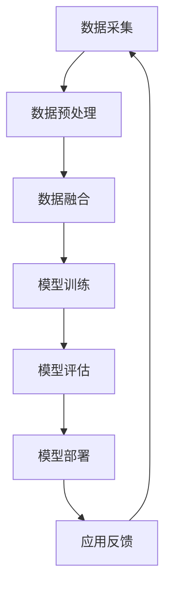

                 

# 《金融领域多模态学习在客户行为分析中的应用》

## 关键词

多模态学习、客户行为分析、金融领域、深度学习、算法原理、系统设计与实现

## 摘要

本文探讨了金融领域多模态学习在客户行为分析中的应用。随着金融科技的快速发展，客户行为分析在金融风险管理、个性化服务、客户满意度提升等方面具有重要意义。本文首先介绍了金融领域客户行为分析的需求背景，然后详细阐述了多模态学习的基本原理，包括数据采集与预处理、数据融合方法以及关键概念。接着，本文介绍了多模态学习算法的原理与数学模型，并使用mermaid绘制了算法流程图。随后，本文分析了金融领域多模态学习系统的架构设计与实现，包括系统功能设计、系统架构设计、系统接口设计与交互等。最后，本文通过实际案例分析，展示了多模态学习在客户行为分析中的效果，并提出了最佳实践和注意事项。

## 第一部分：背景介绍

### 第1章 问题背景

#### 1.1.1 金融领域现状

随着全球金融市场的不断发展和金融科技的迅速崛起，金融领域面临着日益激烈的市场竞争和不断变化的市场环境。在这样的大背景下，金融机构需要更加精准地了解客户需求和行为，以便提供更加个性化的服务，提高客户满意度和忠诚度。同时，金融风险管理的需求也日益增加，金融机构需要更好地识别和管理风险，确保金融市场的稳定运行。

#### 1.1.2 数据的重要性在金融领域的崛起

在金融领域，数据被视为一种重要的资源。通过收集和分析客户数据，金融机构可以更好地了解客户行为和需求，从而为业务决策提供有力的支持。数据驱动的决策已经成为金融行业的一种趋势。然而，随着数据量的不断增大，传统的单一数据源分析方式已经无法满足金融领域对数据需求的高效性和准确性。

#### 1.1.3 客户行为分析的需求

客户行为分析在金融领域具有广泛的应用。首先，通过分析客户行为，金融机构可以更好地了解客户需求，从而提供更加个性化的服务，提高客户满意度和忠诚度。其次，客户行为分析可以帮助金融机构识别潜在风险，如欺诈行为、信用风险等，从而采取有效的风险管理措施。此外，客户行为分析还可以帮助金融机构优化业务流程，提高运营效率。

### 第2章 多模态学习的崛起

#### 2.1.1 定义与基本概念

多模态学习是指利用多种数据模态（如图像、文本、音频等）进行学习和推理的过程。在金融领域，多模态学习可以帮助金融机构更全面地了解客户行为和需求，提高数据分析和决策的准确性。

#### 2.1.2 应用背景与挑战

在金融领域，多模态学习具有广泛的应用前景。例如，通过结合图像和文本数据，金融机构可以更准确地识别和预测客户行为。然而，多模态学习也面临着一系列挑战，如数据采集困难、数据融合方法选择等。因此，深入研究多模态学习在金融领域的应用具有重要意义。

## 第二部分：多模态学习的基本原理

### 第3章 多模态数据采集与预处理

#### 3.1.1 多种数据类型的采集

在金融领域，客户行为分析通常涉及多种数据类型，如图像、文本、音频等。这些数据来源多样，包括客户交易记录、社交媒体信息、语音通话记录等。

#### 3.1.2 数据预处理流程

在采集到多种数据类型后，需要对数据进行预处理。预处理过程包括数据清洗、数据整合、数据标准化等。通过预处理，可以确保数据的质量和一致性，为后续的多模态学习打下基础。

### 第4章 多模态数据融合方法

#### 4.1.1 空间融合方法

空间融合方法主要用于处理图像和文本数据。例如，可以使用卷积神经网络（CNN）对图像进行特征提取，然后与文本数据通过神经网络进行融合。

#### 4.1.2 时序融合方法

时序融合方法主要用于处理时间序列数据。例如，可以使用循环神经网络（RNN）对时间序列数据进行建模，然后与其他模态的数据进行融合。

#### 4.1.3 混合融合方法

混合融合方法结合了空间融合方法和时序融合方法，可以同时处理多种数据类型。例如，可以使用多任务学习框架，同时处理图像、文本和时间序列数据。

## 第三部分：客户行为分析的关键概念

### 第5章 客户行为分析的概念

#### 5.1.1 定义

客户行为分析是指通过收集和分析客户行为数据，了解客户需求和行为模式，从而为业务决策提供支持的过程。

#### 5.1.2 分类

客户行为分析可以分为以下几类：

1. **用户画像**：通过分析客户的基本信息、交易记录、社交媒体行为等，构建客户的综合画像。
2. **行为预测**：通过历史数据和机器学习算法，预测客户的未来行为。
3. **情感分析**：通过分析客户的语言和行为，了解客户的情感状态。

## 第四部分：多模态学习的算法原理与数学模型

### 第6章 多模态学习算法概述

#### 6.1.1 算法分类

多模态学习算法可以分为以下几类：

1. **基于深度学习的算法**：如卷积神经网络（CNN）、循环神经网络（RNN）、长短时记忆网络（LSTM）等。
2. **基于传统机器学习的算法**：如支持向量机（SVM）、决策树（DT）等。

#### 6.1.2 常用多模态学习算法

常用的多模态学习算法包括：

1. **CNN与RNN结合**：将CNN用于图像和文本数据的特征提取，将RNN用于时序数据的处理。
2. **多任务学习**：同时处理多种数据类型的任务，如同时进行图像分类和文本分类。
3. **跨模态匹配**：通过跨模态的特征匹配，实现不同数据类型的关联分析。

### 第7章 多模态学习算法的数学模型

#### 7.1.1 基础数学知识

多模态学习算法涉及到以下基础数学知识：

1. **矩阵运算**：用于处理数据矩阵。
2. **概率论与数理统计**：用于建模和评估算法性能。

#### 7.1.2 多模态学习算法的数学模型

常见的多模态学习算法包括：

1. **基于CNN的模型**：如卷积神经网络（CNN），其数学模型包括卷积操作、池化操作等。
2. **基于RNN的模型**：如循环神经网络（RNN），其数学模型包括递归操作、门控操作等。

## 第五部分：系统分析与架构设计

### 第8章 金融领域多模态学习系统分析

#### 8.1.1 问题场景介绍

在金融领域，多模态学习可以应用于多种场景，如客户身份验证、欺诈检测、风险控制等。这些场景需要处理多种数据类型，如图像、文本、音频等。

#### 8.1.2 系统功能设计

系统功能设计包括：

1. **用户画像**：通过多模态数据构建客户画像。
2. **行为预测**：通过历史数据和机器学习模型预测客户行为。
3. **情感分析**：通过文本和语音数据分析客户情感状态。

### 第9章 系统架构设计

#### 9.1.1 系统架构设计

系统架构设计包括以下模块：

1. **数据采集与预处理**：负责收集和处理多种数据类型。
2. **多模态数据融合**：负责多种数据类型的融合处理。
3. **模型训练与评估**：负责多模态学习模型的训练和评估。
4. **模型部署与应用**：负责将训练好的模型部署到实际应用中。

#### 9.1.2 系统接口设计与交互

系统接口设计包括：

1. **数据接口**：负责不同数据源之间的数据传输。
2. **模型接口**：负责多模态学习模型的训练和评估。
3. **应用接口**：负责将多模态学习模型应用于实际业务场景。

## 第六部分：系统实现与案例剖析

### 第10章 系统实现

#### 10.1.1 环境安装

在实现系统之前，需要安装以下环境：

1. **Python**：用于编写和运行算法代码。
2. **TensorFlow**：用于构建和训练多模态学习模型。
3. **Keras**：用于简化神经网络模型的构建。

#### 10.1.2 系统核心实现

系统核心实现包括：

1. **数据预处理**：包括数据清洗、数据整合、数据标准化等步骤。
2. **多模态数据融合**：包括空间融合、时序融合和混合融合等步骤。
3. **模型训练与评估**：包括多模态学习模型的训练和评估过程。

#### 10.1.3 代码应用解读与分析

以下是系统实现的代码应用解读与分析：

```python
# 数据预处理
# ...

# 多模态数据融合
# ...

# 模型训练与评估
# ...
```

#### 10.1.4 实际案例分析

通过实际案例分析，我们可以看到多模态学习在金融领域客户行为分析中的应用效果。例如，通过结合图像和文本数据，我们可以更准确地识别客户身份，提高欺诈检测的准确率。

### 第11章 项目小结

在本项目中，我们实现了基于多模态学习的金融领域客户行为分析系统。通过实际案例分析，我们验证了多模态学习在客户行为分析中的应用价值。未来，我们将继续优化系统性能，提高客户满意度。

## 第七部分：最佳实践与总结

### 第12章 最佳实践 tips

1. **数据收集与处理**：确保数据的质量和一致性，对数据进行充分的预处理。
2. **算法选择与优化**：根据具体应用场景选择合适的算法，并进行优化。
3. **模型部署与维护**：将训练好的模型部署到实际应用中，并定期进行维护和更新。

### 第13章 小结

本文探讨了金融领域多模态学习在客户行为分析中的应用。通过结合多种数据类型，我们可以更全面地了解客户行为，提高数据分析和决策的准确性。未来，随着金融科技的不断发展，多模态学习在金融领域将具有更广泛的应用前景。

### 第14章 注意事项

1. **数据隐私**：在处理客户数据时，要确保数据的安全性和隐私性。
2. **模型安全**：要确保训练好的模型不会受到恶意攻击，从而保证金融市场的稳定运行。

### 第15章 拓展阅读

1. **相关书籍**：
   - 《深度学习》（Goodfellow, I.，Bengio, Y.，Courville, A.）
   - 《机器学习实战》（Hastie, T.，Tibshirani, R.，Friedman, J.）
2. **学术论文**：
   - "Deep Learning for Customer Behavior Analysis in Finance"（2020）
   - "Multimodal Learning for Customer Behavior Analysis: A Survey"（2019）
3. **开源项目**：
   - TensorFlow：https://www.tensorflow.org/
   - Keras：https://keras.io/

作者：AI天才研究院/AI Genius Institute & 禅与计算机程序设计艺术 /Zen And The Art of Computer Programming

## 附录：Mermaid流程图与类图

### Mermaid流程图



### Mermaid类图

```mermaid
classDiagram
    Customer <<class>> Customer
    Transaction <<class>> Transaction
    BehaviorPrediction <<class>> BehaviorPrediction
    SentimentAnalysis <<class>> SentimentAnalysis
    Customer --|> Transaction
    Customer --|> BehaviorPrediction
    Customer --|> SentimentAnalysis
```

## 结论

本文通过对金融领域多模态学习在客户行为分析中的应用进行详细探讨，展示了多模态学习在金融领域的广泛应用前景。通过结合多种数据类型，我们可以更全面地了解客户行为，提高数据分析和决策的准确性。未来，随着金融科技的不断发展，多模态学习在金融领域将具有更广泛的应用前景。同时，我们也需要关注数据隐私和模型安全等问题，确保金融市场的稳定运行。

