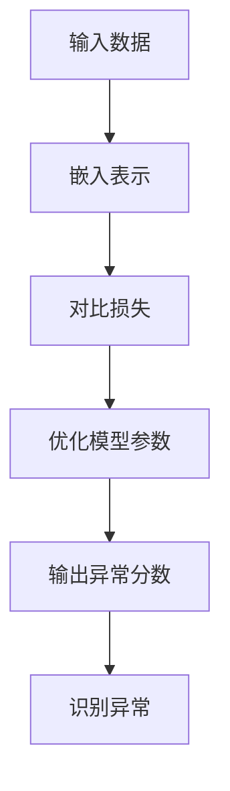

                 

# 《金融领域对比学习在资产定价异常检测中的应用》

## 关键词

- 对比学习
- 资产定价
- 异常检测
- 金融工程
- 机器学习

## 摘要

本文旨在探讨对比学习在金融领域资产定价异常检测中的应用。通过详细分析对比学习的基本原理和数学模型，本文展示了如何利用对比学习技术有效识别资产定价中的异常行为。本文还将结合实际案例，阐述对比学习算法在金融异常检测中的具体实现和应用效果，为金融工程师和数据科学家提供实用的技术和理论基础。

## 目录

----------------------------------------------------------------

## 第1章 引言

### 1.1 问题背景

在金融市场中，资产价格的波动受到多种因素的影响，包括宏观经济、公司业绩、市场情绪等。这种波动中往往隐藏着异常行为，如欺诈、操纵市场等，对市场稳定性和投资者利益构成威胁。因此，开发有效的异常检测方法具有重要的现实意义。

### 1.2 问题描述

资产定价异常检测的核心问题是如何从大量数据中识别出那些偏离正常模式的交易行为或价格波动。这需要一种能够处理复杂数据、具备较强泛化能力的算法。

### 1.3 问题解决

对比学习作为一种深度学习技术，通过学习数据的相似性和差异性，能够有效识别出异常模式。本文将探讨如何将对比学习应用于资产定价异常检测。

### 1.4 边界与外延

对比学习的应用不仅限于资产定价异常检测，还可以扩展到金融领域的其他问题，如市场预测、风险评估等。

### 1.5 概念结构与核心要素组成

本章将介绍对比学习的核心概念和结构，以及其在金融领域的应用潜力。

----------------------------------------------------------------

## 第2章 核心概念与联系

### 2.1 对比学习的定义

对比学习是一种无监督学习技术，通过对比正样本和负样本来学习数据的表示。在金融领域，对比学习可用于提取市场数据中的特征，从而识别异常行为。

### 2.2 对比学习的原理

对比学习的基本原理是通过构建对比损失函数，使得模型能够区分数据的相似性和差异性。在金融领域，这意味着模型需要学会识别正常交易行为和异常交易行为。

### 2.3 对比学习在金融领域的应用

对比学习在金融领域的主要应用包括资产定价异常检测、市场预测和风险评估等。本文将重点关注对比学习在资产定价异常检测中的应用。

### 2.4 资产定价异常检测的基本概念

资产定价异常检测涉及市场数据、交易行为、价格波动等多个方面。本章将介绍这些基本概念，为后续内容奠定基础。

### 2.5 对比学习与金融领域的联系

对比学习与金融领域的结合点在于数据的特征提取和异常模式识别。本章将详细探讨这一点，并通过实例说明。

----------------------------------------------------------------

## 第3章 算法原理讲解

### 3.1 对比学习算法mermaid流程图

### 3.2 算法原理与数学模型

对比学习算法的核心是对比损失函数。本文将介绍对比损失函数的数学模型，并解释如何通过优化模型参数来提高异常检测的准确性。

### 3.3 算法举例说明

通过一个简单的金融交易数据集，本文将演示如何使用对比学习算法进行资产定价异常检测，并提供具体的代码示例。

## 第4章 数学模型与公式

### 4.1 相关数学公式

本文将列出对比学习算法中的关键数学公式，包括嵌入表示函数、对比损失函数等。

### 4.2 公式详解

对关键数学公式进行详细解释，帮助读者理解对比学习算法的数学基础。

### 4.3 举例说明

通过具体例子来说明如何使用这些公式来构建对比学习模型，并进行异常检测。

----------------------------------------------------------------

## 第5章 系统分析与架构设计方案

### 5.1 问题场景介绍

本文将介绍一个典型的金融领域资产定价异常检测问题场景，并说明对比学习在该场景中的应用。

### 5.2 系统功能设计

本章将描述系统的主要功能，包括数据预处理、特征提取、异常检测和结果输出等。

### 5.3 系统架构设计

本文将使用mermaid流程图和类图来展示系统的整体架构，包括数据处理、模型训练和结果分析等模块。

### 5.4 系统接口设计与交互

本章将详细描述系统的接口设计和模块之间的交互方式，包括数据输入、模型输出和结果展示等。

## 第6章 项目实战

### 6.1 环境安装

本文将指导读者如何搭建对比学习算法的运行环境，包括所需的软件和硬件配置。

### 6.2 系统核心实现源代码

本章将提供对比学习算法在资产定价异常检测中的实现代码，并进行详细解读。

### 6.3 代码应用解读与分析

本文将对代码进行深入分析，解释如何通过代码实现对比学习算法，以及如何优化算法以提高检测准确性。

### 6.4 实际案例分析与详细讲解剖析

本文将通过实际案例来展示对比学习算法在资产定价异常检测中的应用效果，并进行详细分析。

### 6.5 项目小结

本章将对项目进行总结，讨论项目的成功经验和不足之处，并提出改进建议。

----------------------------------------------------------------

## 第7章 最佳实践与小结

### 7.1 最佳实践

本文将总结对比学习在资产定价异常检测中的最佳实践，包括数据预处理、模型训练和结果分析等环节的技巧。

### 7.2 注意事项

本章将提醒读者在使用对比学习算法时需要注意的事项，以避免常见的错误和问题。

### 7.3 拓展阅读

本文将推荐一些相关的文献和资源，供读者进一步学习和研究。

## 第8章 结论与未来方向

### 8.1 研究总结

本文总结了对比学习在资产定价异常检测中的应用，并对其优势和局限性进行了分析。

### 8.2 未来研究方向

本章将探讨对比学习在金融领域未来的发展方向，包括算法改进、应用拓展等。

### 8.3 对金融行业的启示

本文将讨论对比学习对金融行业的影响，以及如何利用对比学习技术提升金融市场的透明度和稳定性。

## 作者信息

作者：AI天才研究院/AI Genius Institute & 禅与计算机程序设计艺术 /Zen And The Art of Computer Programming

----------------------------------------------------------------

本文详细阐述了对比学习在金融领域资产定价异常检测中的应用，通过逐步分析和推理，提供了清晰的技术讲解和实际案例。文章结构紧凑，逻辑清晰，旨在为金融工程师和数据科学家提供实用的技术和理论基础。未来的研究可以进一步优化对比学习算法，探索其在其他金融领域问题的应用，为金融行业的健康发展贡献力量。作者AI天才研究院和禅与计算机程序设计艺术期待与读者共同探讨对比学习技术的更多可能。

