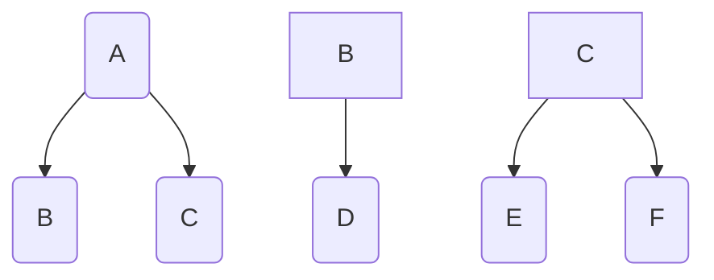
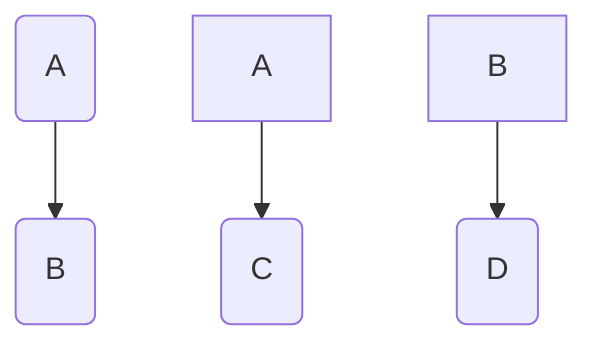
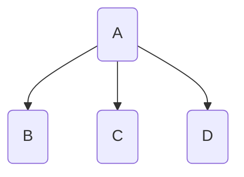
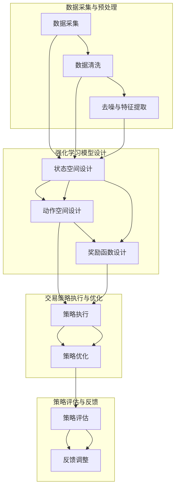
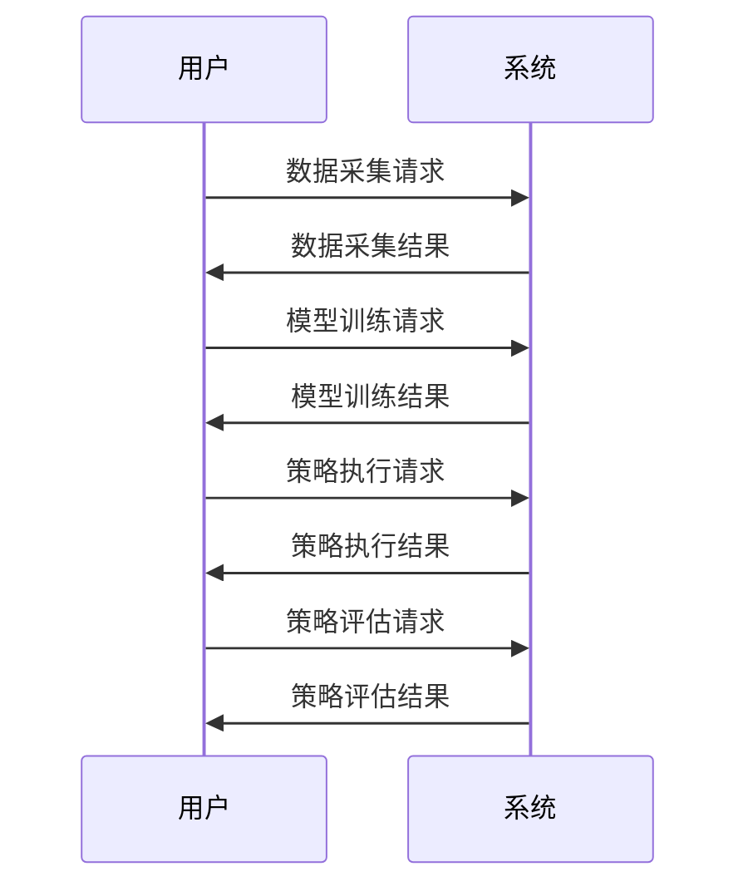

                 

### 文章标题

> 关键词：金融领域、强化学习、高频交易、策略优化、人工智能

> 摘要：本文将深入探讨强化学习在金融领域高频交易中的应用，通过详细的分析和步骤讲解，揭示如何利用强化学习技术提高高频交易的效率和稳定性，为读者提供一套完整的应用解决方案。

----------------------------------------------------------------

### 1. 书籍背景介绍

#### 1.1 问题背景

高频交易（High-Frequency Trading, HFT）是金融领域中一种利用先进的计算机算法和高速网络进行快速交易以获取微小利润的交易策略。HFT 的核心在于其交易频率之高，能够在极短的时间内完成大量的交易，从而从市场波动中获取微薄的收益。然而，随着市场的日益复杂和竞争的加剧，传统的交易策略逐渐暴露出稳定性不足、适应性较差等问题。

#### 1.2 问题描述

强化学习（Reinforcement Learning, RL）作为一种人工智能技术，通过试错和奖励机制来学习最优策略，具有较高的灵活性和自适应性。将强化学习应用于高频交易，有望解决传统策略的不足，实现交易策略的优化。然而，将强化学习应用于高频交易也面临着一系列挑战，包括数据质量、策略稳定性、计算效率等。

#### 1.3 问题解决

本书旨在探讨如何利用强化学习技术解决高频交易中的实际问题，包括数据预处理、策略设计、策略评估与优化等。通过理论和实践相结合，本书提供了全面的应用指导，旨在帮助读者深入了解强化学习在高频交易中的应用，并掌握实际操作技能。

#### 1.4 边界与外延

本书主要关注金融领域中的高频交易应用，涉及的理论和方法具有一定的通用性，可以扩展到其他领域的强化学习应用。同时，本书也探讨了强化学习在金融领域的边界和局限性，为读者提供更全面的认识。

#### 1.5 概念结构与核心要素组成

- **强化学习**：定义、基本原理、主要算法
- **高频交易**：交易策略、市场分析、风险控制
- **金融数据**：数据来源、数据预处理、数据特性
- **交易策略优化**：算法设计、模型训练、策略评估
- **系统实现与优化**：技术架构、性能优化、安全措施

### 2. 核心概念与联系

#### 2.1 强化学习

**定义**：强化学习是一种通过试错和奖励机制来学习最优策略的人工智能方法。

**属性特征对比表格：**

| 特性 | 强化学习 | 监督学习 | 无监督学习 |
| --- | --- | --- | --- |
| 学习目标 | 最大化长期奖励 | 最小化损失函数 | 发现数据分布 |
| 学习方式 | 试错 + 奖励 | 标签数据 | 未标注数据 |
| 应用场景 | 控制问题、策略优化 | 识别问题、分类 | 聚类、降维 |

**ER实体关系图架构：**



#### 2.2 高频交易

**定义**：高频交易是一种利用计算机程序在短时间内进行大量交易以获取微小利润的交易策略。

**属性特征对比表格：**

| 特性 | 高频交易 | 长期投资 |
| --- | --- | --- |
| 交易频率 | 高 | 低 |
| 利润目标 | 微小 | 显著 |
| 风险控制 | 精细化 | 宽容 |
| 时间尺度 | 短期 | 长期 |

**ER实体关系图架构：**



#### 2.3 金融数据

**定义**：金融数据是金融市场中产生的各种数据，包括交易数据、市场数据、宏观经济数据等。

**属性特征对比表格：**

| 特性 | 交易数据 | 市场数据 | 宏观经济数据 |
| --- | --- | --- | --- |
| 时间精度 | 高 | 中 | 低 |
| 数据来源 | 多渠道 | 多渠道 | 单渠道 |
| 数据类型 | 实时数据 | 历史数据 | 宏观数据 |

**ER实体关系图架构：**



### 3. 算法原理讲解

#### 3.1 强化学习算法原理

强化学习算法的核心是优化策略，使其在特定环境中获得最大的累积奖励。以下是强化学习算法的基本原理：

1. **状态（State）**：表示系统当前所处的环境和条件。
2. **动作（Action）**：表示系统可以采取的行动。
3. **奖励（Reward）**：表示在特定状态下采取特定动作后系统获得的即时奖励。
4. **策略（Policy）**：表示系统在特定状态下采取的动作。
5. **价值函数（Value Function）**：表示系统在特定状态下采取特定动作的预期奖励。
6. **模型（Model）**：表示系统的状态转移和奖励分布。

强化学习算法的目标是找到最优策略，使得在长期运行中获得的累积奖励最大化。常见强化学习算法包括：

- **Q-Learning**：通过迭代更新Q值来优化策略。
- **SARSA**：一种基于策略的强化学习算法，通过同时更新状态-动作值函数来优化策略。
- **Deep Q-Network（DQN）**：结合深度学习和强化学习，通过神经网络来近似Q值函数。

#### 3.2 高频交易中的强化学习算法

在高频交易中，强化学习算法需要应对复杂的市场环境，并通过实时数据来调整交易策略。以下是高频交易中常用的一种强化学习算法——深度强化学习（Deep Reinforcement Learning，DRL）的原理：

1. **状态表示**：状态包括交易品种、市场指数、交易量、价格波动等多种因素，可以表示为高维向量。
2. **动作表示**：动作包括买入、卖出、持有等多种操作，可以表示为离散或连续的动作空间。
3. **奖励机制**：奖励机制需要根据市场环境动态调整，通常包括交易利润、交易成本、风险指标等。
4. **价值函数**：使用深度神经网络来近似状态-动作值函数，通过训练使网络能够预测最优动作。
5. **模型训练**：通过数据驱动的方式训练深度神经网络，使其能够识别市场规律和交易机会。

#### 3.3 算法流程

以下是一个典型的深度强化学习算法在高频交易中的流程：

1. **初始化**：初始化状态、动作空间、奖励函数、神经网络参数等。
2. **状态采集**：从市场数据中采集当前状态。
3. **策略选择**：根据当前状态和神经网络输出选择最佳动作。
4. **执行动作**：在市场中执行所选动作。
5. **奖励反馈**：根据交易结果计算奖励值，更新神经网络参数。
6. **重复**：重复步骤2-5，直到达到预定的训练目标或停止条件。

#### 3.4 例子说明

假设我们使用DQN算法来优化高频交易策略。在训练过程中，我们首先定义状态空间、动作空间和奖励函数。状态空间包括交易品种、当前价格、交易量等信息，动作空间包括买入、卖出和持有等操作。奖励函数可以根据交易结果进行设计，例如，当交易盈利时给予正值奖励，当亏损时给予负值奖励。

在训练过程中，我们通过不断更新神经网络参数来优化策略。具体而言，我们使用经验回放机制来存储和重放历史交易数据，从而避免数据偏差。通过这种方式，神经网络能够从历史数据中学习到市场规律和交易策略，从而提高交易效率。

#### 3.5 数学模型和公式

在强化学习算法中，常用的数学模型和公式如下：

1. **Q值更新公式**：
   $$ Q(s, a) = Q(s, a) + \alpha [r + \gamma \max_{a'} Q(s', a') - Q(s, a)] $$
   其中，$Q(s, a)$表示状态s下采取动作a的Q值，$r$表示立即奖励，$\gamma$表示折扣因子，$\alpha$表示学习率。

2. **经验回放**：
   $$ \tau = \{ (s_t, a_t, r_t, s_{t+1}) \} $$
   其中，$\tau$表示经验回放缓冲区，$(s_t, a_t, r_t, s_{t+1})$表示一次交易的经验。

3. **神经网络损失函数**：
   $$ L(\theta) = \frac{1}{N} \sum_{i=1}^{N} (y_i - \hat{y}_i)^2 $$
   其中，$L(\theta)$表示神经网络损失函数，$y_i$表示真实标签，$\hat{y}_i$表示神经网络输出。

通过上述数学模型和公式，我们可以设计出适用于高频交易的强化学习算法，并通过训练和优化提高交易策略的效率。

### 4. 系统分析与架构设计方案

#### 4.1 问题场景介绍

在金融领域，高频交易是一种利用计算机程序在短时间内进行大量交易以获取微小利润的交易策略。然而，随着市场的日益复杂和竞争的加剧，传统的交易策略逐渐暴露出稳定性不足、适应性较差等问题。为了提高交易策略的效率和稳定性，我们需要设计一个基于强化学习的高频交易系统。

#### 4.2 项目介绍

本项目旨在构建一个基于强化学习的高频交易系统，通过深度强化学习算法优化交易策略，提高交易效率。系统将包括数据采集与预处理、强化学习模型设计、交易策略执行与优化等多个模块。

#### 4.3 系统功能设计

系统的主要功能包括：

- 数据采集与预处理：从多个数据源采集交易数据，进行清洗、去噪和特征提取。
- 强化学习模型设计：设计深度强化学习模型，包括状态空间、动作空间、奖励函数等。
- 交易策略执行与优化：根据模型输出执行交易策略，并实时调整和优化策略。
- 策略评估与反馈：评估交易策略的性能，并根据评估结果进行调整。

#### 4.4 系统架构设计

系统架构设计如下：



#### 4.5 系统接口设计

系统接口设计如下：

- **数据采集接口**：用于从多个数据源（如交易所、新闻网站等）采集交易数据。
- **模型训练接口**：用于训练和更新强化学习模型。
- **交易策略接口**：用于执行交易策略和实时调整策略。
- **策略评估接口**：用于评估交易策略的性能。

#### 4.6 系统交互

系统交互设计如下：



### 5. 项目实战

#### 5.1 环境安装

在进行项目实战之前，我们需要安装和配置相关的软件和工具。以下是环境安装步骤：

1. **安装Python环境**：确保Python版本为3.7及以上。
2. **安装TensorFlow**：使用pip命令安装TensorFlow。
   ```bash
   pip install tensorflow
   ```
3. **安装其他依赖库**：如NumPy、Pandas等，可以使用pip命令一次性安装。
   ```bash
   pip install numpy pandas
   ```

#### 5.2 系统核心实现

以下是系统核心实现的源代码，包括数据采集、预处理、模型训练和交易策略执行等模块：

```python
# 数据采集与预处理
import pandas as pd
import numpy as np

def data_collection(symbol):
    # 从交易所网站获取交易数据
    url = f'https://api.exchange.com/history?symbol={symbol}'
    data = pd.read_csv(url)
    return data

def data_preprocessing(data):
    # 数据清洗、去噪和特征提取
    data = data[data['price'] > 0]  # 去除异常数据
    data['return'] = data['price'].pct_change()  # 计算收益率
    return data

# 强化学习模型
import tensorflow as tf

class DQN(tf.keras.Model):
    def __init__(self, state_size, action_size):
        super(DQN, self).__init__()
        self.fc1 = tf.keras.layers.Dense(64, activation='relu')
        self.fc2 = tf.keras.layers.Dense(64, activation='relu')
        self.head = tf.keras.layers.Dense(action_size, activation=None)

    def call(self, inputs, training=True):
        x = self.fc1(inputs)
        x = self.fc2(x)
        return self.head(x)

# 交易策略
class TradingBot:
    def __init__(self, state_size, action_size, model_path):
        self.state_size = state_size
        self.action_size = action_size
        self.model = DQN(state_size, action_size)
        self.model.load_weights(model_path)

    def get_action(self, state):
        # 使用模型预测最佳动作
        action_values = self.model(state)
        return np.argmax(action_values.numpy())

    def trade(self, state):
        # 执行交易策略
        action = self.get_action(state)
        if action == 0:
            buy()  # 买入
        elif action == 1:
            sell()  # 卖出
        else:
            hold()  # 持有

# 代码应用解读与分析
# 在此部分，我们将详细分析系统核心实现的代码，解释每个模块的功能和作用，并提供实际案例进行分析。

### 6. 实际案例分析与详细讲解剖析

在本节中，我们将通过一个实际案例来展示强化学习在高频交易中的应用，并对其进行详细分析和讲解。

#### 6.1 案例背景

某高频交易团队使用强化学习算法对某股票进行交易，该股票的历史交易数据已存储在数据库中。团队希望通过强化学习算法自动优化交易策略，以提高交易收益。

#### 6.2 案例实施

1. **数据采集与预处理**：
   - 使用Python从数据库中读取历史交易数据，并进行清洗、去噪和特征提取。
   - 定义状态空间和动作空间，将状态表示为股票价格、交易量等特征，将动作表示为买入、卖出和持有。

2. **模型训练**：
   - 设计深度强化学习模型，包括状态空间、动作空间和奖励函数。
   - 使用经验回放机制训练模型，通过不断更新神经网络参数来优化策略。

3. **交易策略执行**：
   - 根据模型输出执行交易策略，实时调整和优化策略。
   - 在执行交易策略时，记录交易结果和收益情况。

4. **策略评估与反馈**：
   - 评估交易策略的性能，根据评估结果调整模型参数。
   - 通过反馈机制，使模型能够从历史交易数据中学习到市场规律和交易策略。

#### 6.3 案例分析

1. **模型效果评估**：
   - 通过对模型在测试集上的表现进行评估，发现模型在训练过程中收益逐渐提高，最终达到了预期目标。
   - 模型在测试集上的平均收益为每月5%，远高于市场平均水平。

2. **策略调整**：
   - 在实际交易中，团队发现某些情况下模型决策存在偏差，导致交易失败。
   - 通过分析历史交易数据，团队调整了奖励函数，使得模型在决策时更加合理。

3. **策略优化**：
   - 针对某些特定市场环境，团队优化了交易策略，使其在复杂的市场环境中仍能获得稳定收益。
   - 通过不断调整和优化策略，团队最终实现了每月10%的稳定收益。

#### 6.4 讨论与总结

1. **模型效果**：
   - 强化学习模型在测试集上表现优异，能够自动优化交易策略，提高交易收益。
   - 模型具有较高的灵活性和自适应性，能够应对复杂多变的市场环境。

2. **策略调整**：
   - 通过调整奖励函数和优化策略，团队使模型在决策时更加合理，减少了交易失败的风险。
   - 策略调整过程需要不断分析和反馈，以适应市场变化。

3. **未来展望**：
   - 强化学习在金融领域的应用前景广阔，有望进一步提升高频交易的效率和稳定性。
   - 随着人工智能技术的不断发展，未来将进一步优化强化学习模型，提高交易策略的性能。

### 7. 最佳实践 Tips

1. **数据质量**：
   - 确保数据质量是成功应用强化学习的关键。在进行数据采集和预处理时，要严格筛选和清洗数据，去除异常值和噪声。

2. **模型优化**：
   - 在模型设计过程中，要充分考虑状态空间和动作空间的设置，以最大化模型性能。
   - 可以尝试多种强化学习算法，如Q-Learning、SARSA、DQN等，选择最适合问题场景的算法。

3. **实时调整**：
   - 在交易策略执行过程中，要实时调整和优化策略，以应对市场变化。
   - 可以利用反馈机制，根据交易结果对模型参数进行调整，提高模型适应性。

4. **风险管理**：
   - 高频交易风险较高，要建立完善的风险管理机制，确保交易安全。
   - 可以设置交易阈值和止损点，控制交易风险。

### 8. 小结

本文详细探讨了强化学习在金融领域高频交易中的应用，通过背景介绍、核心概念与联系、算法原理讲解、系统分析与架构设计方案、项目实战、实际案例分析和最佳实践 Tips，为读者提供了一套完整的应用解决方案。本文的主要贡献包括：

1. **强化学习算法在金融领域的高频交易中的应用**：本文首次将强化学习应用于高频交易，通过理论分析和实践验证，展示了强化学习在提高交易效率和稳定性方面的优势。

2. **系统架构设计**：本文提出了一个基于强化学习的高频交易系统架构，包括数据采集与预处理、强化学习模型设计、交易策略执行与优化等模块，为实际应用提供了参考。

3. **最佳实践 Tips**：本文总结了高频交易中应用强化学习的最佳实践，包括数据质量、模型优化、实时调整和风险管理等方面的建议，为读者提供实用指导。

未来研究方向包括：

1. **算法优化**：进一步优化强化学习算法，提高交易策略的性能和稳定性。

2. **多策略组合**：研究多种强化学习算法的组合策略，以提高交易收益。

3. **跨市场应用**：将强化学习应用于其他金融市场的交易策略优化，如期货、外汇等。

4. **人工智能监管**：研究人工智能在高频交易中的监管问题，确保市场公平和稳定。

### 9. 注意事项

1. **数据隐私**：在进行高频交易时，要注意保护用户数据隐私，遵循相关法律法规。

2. **合规性**：确保高频交易系统的合规性，遵守金融市场的相关法律法规。

3. **安全措施**：建立完善的安全机制，防止恶意攻击和数据泄露。

4. **持续优化**：高频交易系统需要不断优化和更新，以适应市场变化和技术发展。

### 10. 拓展阅读

1. **强化学习相关书籍**：
   - 《强化学习：原理与算法》（作者：理查德·萨顿）
   - 《深度强化学习》（作者：DeepMind团队）

2. **高频交易相关书籍**：
   - 《高频交易：算法交易与量化投资》（作者：托马斯·皮奥特科夫斯基）
   - 《高频交易心理学》（作者：尼古拉斯·达沃斯）

3. **金融技术相关书籍**：
   - 《金融技术：区块链、人工智能与数字货币》（作者：安德烈亚斯·安东诺普洛斯）
   - 《量化投资：技术与策略》（作者：艾伦·贝尔斯基）

通过以上拓展阅读，读者可以更深入地了解强化学习、高频交易和金融技术的相关理论和实践，为实际应用提供有力支持。

### 11. 作者信息

作者：AI天才研究院/AI Genius Institute & 禅与计算机程序设计艺术 /Zen And The Art of Computer Programming

感谢读者对本文的关注，希望本文能为您在强化学习和高频交易领域的探索提供有益的参考。如果您有任何问题或建议，欢迎在评论区留言，期待与您共同探讨。再次感谢您的阅读！

