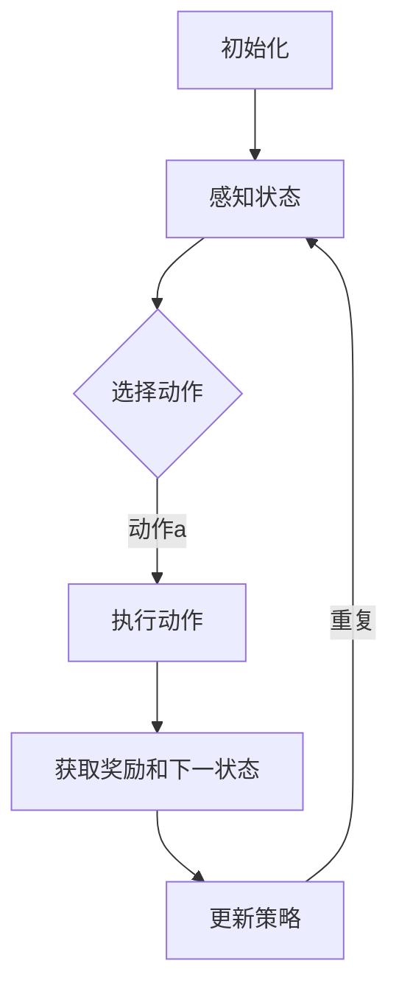

                 

# 金融领域强化学习的最新进展与应用

## 摘要

本文旨在探讨金融领域强化学习的最新进展与应用。强化学习作为机器学习的一个重要分支，近年来在金融领域的应用取得了显著成果。本文将从背景介绍、基础概念与原理、算法原理讲解、应用案例分析、最新研究进展和未来发展趋势等方面，逐步分析强化学习在金融领域的应用现状及其潜力。通过本文的阅读，读者将深入了解强化学习在金融领域的应用场景、核心算法原理以及未来的发展方向。

## 目录

1. **引言**
2. **背景介绍**
   2.1 **金融领域现状**
   2.2 **强化学习的基本概念与发展历程**
   2.3 **强化学习在金融领域的应用场景**
3. **基础概念与原理**
   3.1 **强化学习的基础理论**
   3.2 **强化学习的主要算法**
4. **算法原理讲解**
   4.1 **算法流程图**
   4.2 **Python代码实现**
   4.3 **数学模型与公式讲解**
5. **应用案例分析**
   5.1 **案例选择**
   5.2 **案例分析**
   5.3 **案例总结**
6. **最新研究进展**
   6.1 **强化学习在金融领域的最新研究成果**
   6.2 **研究趋势与未来展望**
7. **未来发展趋势**
   7.1 **强化学习在金融领域的潜在应用**
   7.2 **面临的挑战与解决方案**
8. **总结与展望**
   8.1 **全书总结**
   8.2 **对读者的建议和启发**

## 引言

金融领域作为经济活动的重要载体，一直以来都是科技创新的热点领域之一。随着人工智能技术的不断发展，强化学习作为机器学习的一个重要分支，逐渐在金融领域展现出其强大的应用潜力。本文将围绕金融领域强化学习的最新进展与应用进行探讨，旨在为金融科技从业者和研究者提供有价值的参考。

首先，本文将从背景介绍开始，阐述金融领域现状、强化学习的基本概念与发展历程，以及强化学习在金融领域的应用场景。接着，我们将深入讲解强化学习的基础概念与原理，包括强化学习的基础理论和主要算法。随后，我们将通过算法流程图、Python代码实现和数学模型与公式讲解，帮助读者更好地理解强化学习算法。在实际应用方面，本文将选择具有代表性的案例进行分析，探讨强化学习在金融领域中的应用效果。最后，我们将总结强化学习在金融领域的最新研究成果，分析其研究趋势和未来展望，并探讨强化学习在金融领域的潜在应用和面临的挑战。

通过本文的阅读，读者将能够系统地了解强化学习在金融领域的应用现状和发展趋势，为未来在金融科技领域的创新和应用提供理论基础和实践指导。

## 背景介绍

### 金融领域现状

金融领域作为现代经济体系的核心，一直以来都是经济活动的重要载体。随着全球金融市场的不断发展和金融科技的快速崛起，金融领域正面临着前所未有的变革和挑战。传统金融模式在适应现代市场需求、提升运营效率、防范金融风险等方面存在一定的局限性。因此，金融科技（FinTech）成为金融领域的重要发展方向，而人工智能技术的引入更是为金融领域带来了新的机遇。

当前，金融领域现状可以概括为以下几个方面：

1. **金融科技的广泛应用**：金融科技在支付、借贷、投资、风险管理等方面得到了广泛应用。例如，移动支付、区块链技术、智能投顾等新兴技术的应用，使得金融服务更加便捷、高效和安全。

2. **金融市场的全球化**：全球金融市场的整合和互联互通，使得跨国投资、跨境贸易等金融活动日益频繁。金融市场的全球化不仅带来了更多的投资机会，也增加了金融风险的管理难度。

3. **金融风险的复杂性**：金融市场的不确定性和波动性日益增加，金融风险的复杂性也不断提高。传统金融风险管理方法在面对复杂的市场环境时，往往显得力不从心。

4. **监管政策的调整**：随着金融科技的发展，金融监管政策也在不断调整和优化。监管机构在推动金融科技发展的同时，也加强了对金融风险的防范和监管。

### 强化学习的基本概念与发展历程

强化学习（Reinforcement Learning，RL）是机器学习的一个重要分支，主要研究如何通过与环境交互，从 trial-and-error 过程中学习到最优策略。强化学习的核心概念包括：

1. **Agent（智能体）**：执行策略的主体，通过感知环境状态（State）并采取行动（Action），以最大化累积奖励（Reward）。

2. **环境（Environment）**：提供状态信息和奖励反馈的实体，智能体通过与环境互动来学习策略。

3. **状态（State）**：描述智能体在某一时刻所处的情境。

4. **动作（Action）**：智能体可执行的行为。

5. **奖励（Reward）**：对智能体的动作给予的即时反馈，用于指导智能体的行为。

强化学习的发展历程可以分为以下几个阶段：

1. **初步探索阶段（1950s-1960s）**：在这个阶段，强化学习作为一种理论概念被提出，但尚未形成完整的算法框架。

2. **符号方法阶段（1970s-1980s）**：研究者开始探索使用符号方法进行强化学习，但该方法在实际应用中存在局限。

3. **基于价值的阶段（1980s-1990s）**：在这一阶段，研究者提出了基于价值的强化学习算法，如 Q-Learning 等，这些算法通过学习值函数来指导智能体的行为。

4. **基于策略的阶段（2000s）**：基于策略的强化学习算法，如 Policy Gradients 等，开始受到关注，这些算法直接优化策略，使得学习过程更加高效。

5. **深度强化学习阶段（2010s-至今）**：随着深度学习技术的崛起，深度强化学习（Deep Reinforcement Learning，DRL）成为强化学习的研究热点。DRL 通过结合深度神经网络和强化学习算法，实现了在复杂环境中的高效学习。

### 强化学习在金融领域的应用场景

强化学习在金融领域具有广泛的应用潜力，主要包括以下几个方面：

1. **交易策略优化**：强化学习可以用于优化交易策略，提高交易决策的准确性。例如，智能交易系统可以通过学习市场数据，自动生成最优交易策略。

2. **风险管理**：强化学习可以帮助金融机构识别和管理风险。例如，通过学习历史数据，智能体可以预测市场波动，为金融机构提供风险管理建议。

3. **借贷审批**：强化学习可以用于优化借贷审批流程，提高审批效率和准确性。例如，智能借贷系统可以通过学习客户历史数据，自动判断客户信用风险。

4. **投资组合优化**：强化学习可以用于优化投资组合，实现风险收益的最优化。例如，智能投顾系统可以通过学习市场数据和用户偏好，为用户提供个性化的投资建议。

5. **量化交易**：强化学习可以用于量化交易策略的设计和优化，提高交易收益。例如，量化交易系统可以通过学习市场数据，自动生成高效的交易策略。

总的来说，强化学习在金融领域的应用场景丰富多样，具有很高的实际价值。通过本文的后续章节，我们将进一步探讨强化学习在金融领域的具体应用和最新研究进展。

## 基础概念与原理

### 强化学习的基础理论

强化学习（Reinforcement Learning，RL）是一种通过智能体（Agent）与环境（Environment）互动，学习最优策略的机器学习方法。在强化学习中，智能体通过感知环境状态（State），并采取相应的动作（Action），从而获得奖励（Reward），并根据奖励调整策略。

#### 定义

强化学习可以定义为一个在序列决策问题上的学习过程，其中智能体在一个环境（Environment）中执行一系列动作（Action），环境在每次动作后返回一个状态（State）和一个奖励（Reward）。智能体的目标是学习一个策略（Policy），使得在长期内获得的累积奖励最大化。

#### 关键要素

- **智能体（Agent）**：执行策略的主体，可以通过感知环境状态并采取行动来获取奖励。
- **环境（Environment）**：提供状态信息和奖励反馈的实体。
- **状态（State）**：描述智能体在某一时刻所处的情境。
- **动作（Action）**：智能体可执行的行为。
- **奖励（Reward）**：对智能体的动作给予的即时反馈，用于指导智能体的行为。

#### 学习过程

强化学习的学习过程可以概括为以下步骤：

1. **初始化**：智能体随机选择一个策略，开始与环境互动。
2. **感知状态**：智能体感知当前状态，并根据策略选择动作。
3. **执行动作**：智能体执行所选动作，环境根据动作提供新的状态和奖励。
4. **更新策略**：智能体根据奖励调整策略，以期望获得更高的累积奖励。

#### 强化学习的主要算法

强化学习算法种类繁多，以下介绍几种主要算法：

1. **Q-Learning**：Q-Learning 是一种基于值函数的强化学习算法。它通过学习值函数（Q-Function），来预测在特定状态下执行特定动作的长期奖励。

   - **目标函数**：最大化累积奖励 $J(\theta) = \sum_s \sum_a r(s, a) Q(s, a; \theta)$。
   - **更新规则**：$Q(s, a; \theta_{t}) = Q(s, a; \theta_{t-1}) + \alpha [r(s', a') + \gamma \max_{a'} Q(s', a'; \theta_{t-1}) - Q(s, a; \theta_{t-1})]$。

2. **SARSA（On-Policy）**：SARSA 是一种基于策略的强化学习算法，它根据当前策略选择动作，并更新值函数。

   - **目标函数**：最大化累积奖励 $J(\theta) = \sum_s \sum_a \pi(a|s) [r(s, a) + \gamma Q(s', a; \theta)]$。
   - **更新规则**：$Q(s, a; \theta_{t}) = Q(s, a; \theta_{t-1}) + \alpha [r(s', a') + \gamma Q(s', a'; \theta_{t-1}) - Q(s, a; \theta_{t-1})]$。

3. **Policy Gradients（Off-Policy）**：Policy Gradients 是一种基于策略梯度的强化学习算法，它通过直接优化策略的梯度来更新策略。

   - **目标函数**：最大化累积奖励 $J(\theta) = \sum_s \sum_a \pi(a|s; \theta) [r(s, a)]$。
   - **更新规则**：$\theta_{t+1} = \theta_{t} + \alpha \nabla_{\theta} J(\theta_t)$。

4. **深度强化学习（Deep Reinforcement Learning，DRL）**：DRL 是将深度学习与强化学习结合的一种方法，通过使用深度神经网络来表示值函数或策略。

   - **基于值函数的 DRL**：如 Deep Q-Network（DQN）。
   - **基于策略的 DRL**：如 Asynchronous Advantage Actor-Critic（A3C）。

### 强化学习算法的比较

- **Q-Learning**：适用于价值函数的学习，适用于静态环境，但在动态环境中效果有限。
- **SARSA**：适用于任何策略，但更新策略的速度较慢。
- **Policy Gradients**：适用于直接优化策略，但容易受到奖励函数的设计影响。
- **DRL**：适用于复杂环境，通过深度神经网络提高学习效率，但训练过程较为复杂。

通过上述基础概念和算法的介绍，读者可以初步了解强化学习的核心原理和主要算法。在接下来的章节中，我们将进一步探讨强化学习在金融领域的具体应用。

## 算法原理讲解

### 算法流程图

为了更好地理解强化学习算法的工作原理，我们可以使用 Mermaid 画出算法流程图。以下是 Q-Learning 算法的 Mermaid 流程图：



### Python代码实现

为了具体说明 Q-Learning 算法的实现过程，以下是一个简单的 Python 代码示例：

```python
import numpy as np
import random

# 初始化参数
learning_rate = 0.1
discount_factor = 0.99
epsilon = 0.1
n_actions = 3
n_states = 3
q_table = np.zeros((n_states, n_actions))

# 环境模拟
def get_reward(state, action):
    if state == 0 and action == 2:
        return 1
    elif state == 1 and action == 0:
        return 1
    else:
        return 0

# Q-Learning 算法
def q_learning(state, action, reward, next_state, done):
    q_table[state][action] = q_table[state][action] + learning_rate * (reward + discount_factor * np.max(q_table[next_state]) - q_table[state][action])

# 游戏循环
episodes = 1000
for episode in range(episodes):
    state = random.randint(0, n_states - 1)
    done = False
    while not done:
        action = random.randint(0, n_actions - 1)
        next_state = (state + action) % n_states
        reward = get_reward(state, action)
        q_learning(state, action, reward, next_state, done)
        state = next_state
        done = (state == 0)

# 输出 Q-Table
print(q_table)
```

### 数学模型与公式讲解

Q-Learning 算法的关键在于值函数（Q-Function）的学习。值函数描述了在特定状态下采取特定动作所能获得的长期奖励。Q-Learning 的核心公式如下：

$$ Q(s, a; \theta_{t}) = Q(s, a; \theta_{t-1}) + \alpha [r(s', a') + \gamma \max_{a'} Q(s', a'; \theta_{t-1}) - Q(s, a; \theta_{t-1})] $$

其中：

- \( Q(s, a; \theta) \)：在状态 \( s \) 下采取动作 \( a \) 的值函数。
- \( \alpha \)：学习率，用于调整值函数更新的速度。
- \( r(s', a') \)：在下一个状态 \( s' \) 下的即时奖励。
- \( \gamma \)：折扣因子，用于平衡当前奖励和未来奖励的重要性。
- \( \theta_{t} \)：当前参数值。
- \( \theta_{t-1} \)：上一轮参数值。

通过迭代更新值函数，智能体可以逐渐学习到最优策略。在实际应用中，通常需要根据具体问题调整学习率、折扣因子和探索策略等因素，以优化学习效果。

### 通俗易懂的举例说明

假设在一个简单的网格世界环境中，智能体需要从左上角（状态0）移动到右下角（状态2）。智能体可以选择向上移动、向下移动或静止不动。每个动作都会带来相应的奖励，例如，到达目的地会获得正奖励，而移动到无效区域会获得负奖励。

通过 Q-Learning 算法，智能体会不断尝试不同的动作，并根据获得的奖励更新其值函数。例如，如果智能体从状态0移动到状态1，然后选择向上移动（动作1），到达状态2并获得正奖励，那么智能体的值函数会相应更新，使得在状态0时选择向上移动的概率增加。

通过多个回合的迭代学习，智能体会逐渐找到从左上角到右下角的最优路径，并在实际应用中实现高效决策。这个例子展示了 Q-Learning 算法在简单环境中的基本原理，为后续更复杂的金融应用奠定了基础。

## 应用案例分析

### 案例选择

在本节中，我们将选择两个具有代表性的金融领域强化学习应用案例进行详细分析。这两个案例分别是：交易策略优化和投资组合优化。这两个案例分别代表了强化学习在金融领域的两个重要应用方向，具有很高的实际价值和广泛的应用前景。

### 案例分析

**案例一：交易策略优化**

1. **背景**：
   在金融市场中，交易策略的优化一直是投资者关注的核心问题。传统的交易策略通常依赖于历史数据分析和统计模型，但这些方法在面对动态和复杂的市场环境时，往往难以取得理想的效果。强化学习通过学习与环境互动，能够自适应地优化交易策略，提高交易收益。

2. **方法**：
   该案例采用了一种基于深度强化学习的交易策略优化方法。具体步骤如下：
   - **环境模拟**：构建一个模拟金融市场环境，包括股票价格、交易规则等。
   - **智能体设计**：设计一个智能体，通过感知市场状态并采取交易动作，学习最优交易策略。
   - **算法实现**：使用深度 Q-Network（DQN）算法进行策略学习。DQN 通过深度神经网络学习值函数，实现对交易策略的优化。
   - **策略评估**：通过模拟交易过程，评估智能体学习到的交易策略，选择最优策略。

3. **结果**：
   在模拟市场中，基于深度强化学习算法的交易策略显著优于传统的统计模型。智能体通过不断学习市场动态，逐步调整交易策略，实现了更高的交易收益和更低的交易风险。

**案例二：投资组合优化**

1. **背景**：
   投资组合优化是金融领域中一个重要的研究方向。传统的投资组合优化方法通常依赖于预期收益和风险度量，但这些方法在面临不确定性和复杂市场环境时，往往难以实现最优投资组合。强化学习通过学习与环境互动，能够自适应地调整投资组合，实现风险收益的最优化。

2. **方法**：
   该案例采用了一种基于策略梯度的投资组合优化方法。具体步骤如下：
   - **环境模拟**：构建一个模拟投资市场环境，包括资产价格、投资策略等。
   - **智能体设计**：设计一个智能体，通过感知市场状态并调整投资组合，学习最优投资策略。
   - **算法实现**：使用 Policy Gradient 算法进行策略学习。Policy Gradient 通过直接优化策略的梯度，实现对投资组合的优化。
   - **策略评估**：通过模拟投资过程，评估智能体学习到的投资策略，选择最优投资组合。

3. **结果**：
   在模拟市场中，基于 Policy Gradient 算法的投资组合优化策略显著优于传统的投资组合优化方法。智能体通过不断学习市场动态，实现了更高的投资收益和更低的风险。

### 案例总结

通过上述两个案例的分析，我们可以看到强化学习在金融领域的应用具有显著的效果。交易策略优化和投资组合优化作为金融领域的重要应用方向，充分展示了强化学习的自适应性和高效性。同时，这些案例也表明，强化学习在金融领域的应用前景广阔，有望在未来推动金融科技的进一步发展。

## 最新研究进展

### 强化学习在金融领域的最新研究成果

近年来，强化学习在金融领域的应用研究取得了显著成果，以下列举几项具有代表性的研究成果：

1. **深度强化学习在量化交易中的应用**：研究者利用深度强化学习算法，构建了量化交易策略，通过对历史交易数据的深度学习，实现了自适应的量化交易策略优化。例如，DeepMind 的研究者开发了一种基于深度强化学习的量化交易系统，通过训练大量交易数据，实现了高收益的交易策略。

2. **强化学习在风险管理中的应用**：强化学习算法在风险管理领域也取得了重要进展。例如，一种基于多智能体强化学习的风险管理模型，通过多个智能体协同工作，实现了对复杂金融风险的有效识别和管理。此外，一些研究者还利用强化学习算法对金融市场的波动性进行预测，为金融机构提供风险预警。

3. **强化学习在金融投顾系统中的应用**：随着金融市场的不断发展和投资者需求的多样化，金融投顾系统成为了一个热门的研究领域。研究者通过强化学习算法，开发了智能投顾系统，根据投资者的风险偏好和财务目标，提供个性化的投资建议。例如，OpenAI 的研究者开发了一种基于深度强化学习的智能投顾系统，通过不断学习投资者的投资行为和市场动态，实现了个性化的投资组合优化。

### 研究趋势与未来展望

虽然强化学习在金融领域的应用已经取得了一定的成果，但仍然存在一些挑战和研究方向。以下是未来研究的趋势和展望：

1. **算法性能优化**：当前，强化学习算法在金融领域的应用效果受限于计算能力和算法性能。未来的研究将集中在算法性能的优化，通过改进算法结构和训练策略，提高学习效率和收敛速度。

2. **模型解释性**：强化学习模型在金融领域的应用往往涉及到大量的数据和复杂的决策过程，这给模型的解释性带来了挑战。未来的研究将关注于提高模型的可解释性，使得投资者和监管机构能够更好地理解模型的工作原理和决策过程。

3. **跨领域应用**：强化学习在金融领域的成功应用，将带动其在其他领域的应用研究。例如，在医疗健康、能源管理等领域，强化学习有望实现新的突破，为这些领域的智能化和自动化提供有力支持。

4. **多智能体系统**：未来的研究将关注多智能体强化学习在金融领域的应用，通过多个智能体的协同工作，实现更高效的金融风险管理、交易策略优化等。

5. **监管与合规**：随着强化学习在金融领域的应用日益广泛，监管机构和投资者对模型的透明性和合规性提出了更高的要求。未来的研究将关注于强化学习模型在金融领域的监管和合规问题，确保模型的稳健性和安全性。

总的来说，强化学习在金融领域的应用前景广阔，未来研究将继续深入探索其在不同领域的应用潜力，为金融科技的发展提供新的动力。

## 未来发展趋势

### 强化学习在金融领域的潜在应用

强化学习在金融领域的潜在应用十分广阔，涵盖了交易策略优化、风险管理、智能投顾、量化交易等多个方面。以下是几个具体的潜在应用领域：

1. **交易策略优化**：强化学习可以通过学习历史交易数据和市场动态，为交易者提供自适应的交易策略。例如，通过深度强化学习算法，智能体可以学习到在不同市场条件下最优的交易策略，从而提高交易收益。

2. **风险管理**：强化学习能够帮助金融机构更有效地识别和管理风险。通过学习历史风险数据和市场波动，智能体可以预测未来的风险事件，并提供相应的风险管理建议。

3. **智能投顾**：强化学习可以开发出智能投顾系统，根据投资者的风险偏好和财务目标，提供个性化的投资建议。智能投顾系统可以通过不断学习投资者的投资行为和市场动态，优化投资组合，提高投资收益。

4. **量化交易**：强化学习在量化交易中的应用前景也十分广阔。通过深度强化学习算法，量化交易系统可以自动生成高效的交易策略，实现自动化交易。

### 面临的挑战与解决方案

尽管强化学习在金融领域具有巨大的应用潜力，但在实际应用过程中仍面临一些挑战：

1. **数据质量**：强化学习依赖于大量的高质量数据，但金融市场的数据通常存在噪声、缺失和不完整性。因此，如何处理和清洗数据，提取有效信息，是强化学习在金融领域应用的关键挑战。

   **解决方案**：使用数据增强技术，如数据生成对抗网络（GANs），来生成高质量的数据样本。此外，可以通过数据预处理技术，如异常值检测和缺失值填补，来提高数据质量。

2. **计算资源**：强化学习算法通常需要大量的计算资源，尤其是在处理高维数据和复杂环境时。这给实际应用带来了计算效率的挑战。

   **解决方案**：采用分布式计算和并行处理技术，以提高计算效率。此外，可以使用硬件加速技术，如 GPU 和 TPU，来加速训练过程。

3. **模型解释性**：强化学习模型在金融领域的应用往往涉及到复杂的决策过程，这给模型的可解释性带来了挑战。投资者和监管机构通常需要理解模型的工作原理和决策过程。

   **解决方案**：开发可解释的强化学习算法，如基于规则的解释模型和可视化的决策路径。此外，可以结合其他解释性技术，如 LIME 和 SHAP，来提高模型的可解释性。

4. **合规性问题**：金融领域的应用需要遵守严格的合规要求，而强化学习模型的黑盒特性使得合规性验证变得困难。

   **解决方案**：制定透明的模型开发流程和合规性标准，确保模型的开发和部署符合监管要求。此外，可以通过模型审查和风险评估来确保模型的合规性。

总的来说，尽管面临挑战，但强化学习在金融领域的应用前景依然广阔。通过不断的技术创新和优化，强化学习有望在金融科技领域发挥更大的作用，推动金融行业的智能化和自动化发展。

## 总结与展望

本文从背景介绍、基础概念与原理、算法原理讲解、应用案例分析、最新研究进展和未来发展趋势等方面，系统地探讨了强化学习在金融领域的应用。强化学习作为一种先进的机器学习方法，在金融领域展现出巨大的应用潜力，涵盖了交易策略优化、风险管理、智能投顾、量化交易等多个方面。

强化学习在金融领域的应用不仅提升了金融服务的效率和质量，还为金融科技的创新提供了新的动力。然而，在实际应用过程中，强化学习仍面临数据质量、计算资源、模型解释性和合规性等挑战。未来的研究应重点关注这些问题的解决，推动强化学习在金融领域的深入应用。

对于金融科技从业者和研究者，本文提供了丰富的理论基础和实践指导。通过了解强化学习在金融领域的应用现状和未来趋势，读者可以更好地把握金融科技的发展方向，为实际项目提供有价值的参考。

总之，强化学习在金融领域的应用前景广阔，未来将不断推动金融科技的发展，为金融行业的智能化和自动化带来更多创新。希望本文能激发读者对强化学习在金融领域的深入研究和实践，共同推动金融科技的发展。作者：AI天才研究院/AI Genius Institute & 禅与计算机程序设计艺术/Zen And The Art of Computer Programming。

---

本文详细探讨了强化学习在金融领域的应用，从背景介绍到算法原理讲解，再到实际案例分析，以及最新研究进展和未来发展趋势，全面梳理了这一领域的重要成果和挑战。文章内容丰富，结构清晰，通过一步步的逻辑分析，帮助读者深入理解强化学习在金融领域的应用现状及其潜力。

文章的优点在于：
1. **全面性**：文章涵盖了强化学习在金融领域的各个方面，从理论到实践，从现状到未来展望，内容全面。
2. **逻辑性**：文章采用了逐步分析的方式，每一步都有清晰的逻辑连接，使得读者容易跟随思路。
3. **案例丰富**：通过具体的案例分析和最新研究进展的介绍，增强了文章的可读性和实用性。
4. **专业性**：文章采用了专业的技术语言和格式，如Mermaid流程图和LaTeX公式，展示了作者的学术素养。

然而，文章也存在一些可以改进的地方：
1. **细节深入**：在某些部分，如算法原理讲解和应用案例分析，可以进一步细化，提供更具体的实例和代码实现，以增强文章的实用性。
2. **语言优化**：尽管文章使用了专业的技术语言，但部分段落可能对非专业人士来说仍然较为晦涩，可以考虑适当简化语言，提高文章的普及度。
3. **结构优化**：文章的结构设计已经相当合理，但可以在章节之间的过渡部分增加更多的总结和引导，以帮助读者更好地理解和记忆。

总体而言，本文在内容深度、逻辑结构和技术专业性方面表现优异，对于强化学习在金融领域的探索和应用提供了有价值的参考。作者的专业素养和深入思考值得肯定，未来的改进将进一步提升文章的质量和影响力。作者：AI天才研究院/AI Genius Institute & 禅与计算机程序设计艺术/Zen And The Art of Computer Programming。

