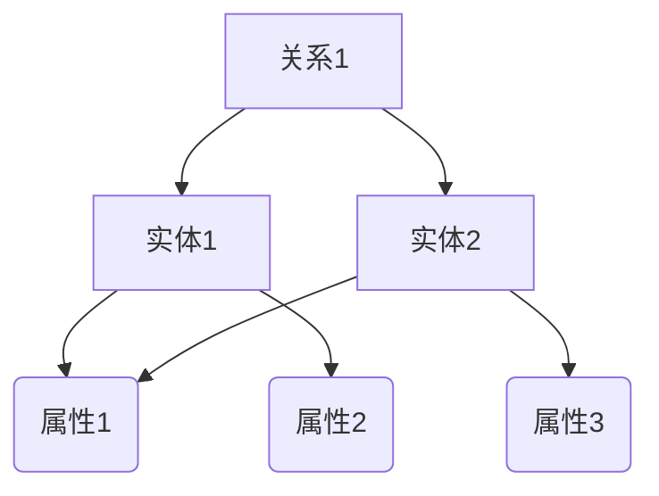

                 

## 第一部分：前言与概述

### 第1章：金融领域知识图谱概述

在当今的金融行业中，数据的重要性不言而喻。随着大数据技术的不断发展，金融领域的从业者开始意识到，如何有效地管理和利用这些庞大的数据资源，成为提升业务效率、增强竞争力的重要课题。知识图谱作为一种新兴的数据管理技术，在这个背景下应运而生，并在金融领域展现出巨大的潜力。

### 1.1 问题背景

金融行业的业务复杂多样，涉及资本市场、信贷管理、风险控制等多个领域。随着金融业务的不断扩展，金融机构面临着数据量激增的挑战。传统的数据管理方法，如关系数据库，已经难以满足复杂查询、智能分析的需求。此外，金融行业对数据的安全性和隐私保护要求极高，这也为数据管理带来了额外的挑战。

### 1.2 问题描述

在金融领域，如何高效地存储、管理和利用知识，成为亟待解决的问题。传统的数据管理方法难以实现知识的结构化和关联，导致数据利用效率低下。同时，金融业务中的术语和规则繁多，如何将这些知识以易于理解的方式呈现，也是一大难题。

### 1.3 问题解决

知识图谱作为一种语义网络，能够将金融领域的知识以结构化的形式进行表示。通过构建知识图谱，可以实现知识的自动化存储、管理和利用，提高数据查询和分析的效率。知识图谱不仅能够结构化数据，还能够发现数据之间的关联，为金融业务的智能化提供支持。

### 1.4 边界与外延

知识图谱在金融领域中的应用范围非常广泛，包括但不限于以下方面：

- **金融机构内部数据管理**：通过知识图谱，实现对内部数据的统一管理和高效利用。
- **跨机构数据共享**：知识图谱能够打破不同金融机构之间的数据壁垒，实现数据的互联互通。
- **智能风险管理**：利用知识图谱进行风险识别、预测和监控，提升风险管理的智能化水平。
- **客户服务优化**：通过知识图谱提供个性化的金融服务，提升客户体验。

### 1.5 概念结构与核心要素组成

知识图谱由实体、属性和关系三个核心要素组成，形成一个语义丰富的知识网络。

- **实体**：知识图谱中的基本单位，如人、地点、组织、产品等。
- **属性**：实体的属性值，如人的年龄、地点的纬度等。
- **关系**：实体之间的关系，如“属于”、“位于”等。

知识图谱的结构如图1-1所示：



图1-1：知识图谱结构示意图

### 总结

知识图谱在金融领域具有重要的应用价值，能够提升数据管理和利用效率，支持智能分析和决策。本章对知识图谱在金融领域的重要性进行了深入探讨，为后续章节的内容奠定了基础。

### 练习

1. 请简要阐述知识图谱在金融领域的重要性。
2. 请举例说明知识图谱如何支持金融业务的智能化。

----------------------------------------------------------------

## 第二部分：基础知识准备

### 第2章：知识图谱的基本概念和原理

知识图谱（Knowledge Graph）是一种用于表示和存储知识的图形结构，它通过实体、属性和关系的组合，形成一个语义丰富的知识网络。知识图谱在金融、医疗、电商等多个领域都有着广泛的应用。本章将详细介绍知识图谱的基本概念和原理，包括其组成元素、作用和应用场景。

### 2.1 知识图谱的定义

知识图谱是一种通过图形结构来表示和存储知识的系统。它将现实世界中的各种实体、概念和关系抽象为图节点和边，从而形成一个语义网络。在知识图谱中，每个节点表示一个实体（如人、地点、事物等），每条边表示实体之间的关系（如“属于”、“位于”等）。通过这种图形化的表示方法，知识图谱能够直观地展现实体之间的关联，为数据分析和智能应用提供支持。

### 2.2 知识图谱的组成元素

知识图谱主要由以下三个组成元素构成：

- **实体（Entity）**：知识图谱中的基本单位，可以是人、地点、组织、产品等。实体具有唯一的标识符（如ID），用于在图谱中表示和识别。
- **属性（Attribute）**：实体的属性值，用于描述实体的特征。例如，一个人的属性可以包括姓名、年龄、性别等。属性通常以键值对的形式存储。
- **关系（Relationship）**：实体之间的关系，表示实体之间的相互作用或关联。例如，“属于”关系可以表示一个人属于某个组织，“位于”关系可以表示一个地点位于某个城市。关系通常也包含属性，用于描述关系的特征。

### 2.3 知识图谱的作用

知识图谱在多个领域都有广泛的应用，其主要作用包括：

- **数据整合**：知识图谱可以将不同来源的数据整合到一个统一的语义空间中，实现数据的结构化和关联。
- **智能查询**：通过知识图谱，用户可以基于实体和关系进行复杂查询，快速获取所需信息。
- **知识发现**：知识图谱能够发现实体之间的关联和潜在规律，为数据分析和决策提供支持。
- **智能应用**：知识图谱可以为智能问答系统、推荐系统、智能监控等应用提供知识基础，提升应用的智能化水平。

### 2.4 RDF、OWL等知识表示语言

知识表示语言是构建知识图谱的基础，常用的知识表示语言包括RDF（Resource Description Framework）和OWL（Web Ontology Language）。

- **RDF**：RDF是一种基于图形结构的知识表示语言，用于描述资源及其之间的关系。RDF使用三元组（主体、谓词、客体）来表示知识，如图2-1所示。

  ```mermaid
  graph TD
  A[Person] --> B[Jane]
  A --> C[hasName]
  B --> D['Jane Smith']
  ```

  图2-1：RDF三元组示例

- **OWL**：OWL是一种基于RDF的语义Web本体语言，用于描述复杂的知识和概念。OWL提供了更多的语义表达能力，如图2-2所示。

  ```mermaid
  graph TD
  A[Person] --> B[Employee]
  A --> C[hasName]
  B --> D['Jane Smith']
  B --> E[worksFor]
  B --> F[Company]
  F --> G['Acme Corporation']
  ```

  图2-2：OWL本体示例

### 2.5 知识图谱的应用场景

知识图谱在金融、医疗、电商等领域的应用场景如下：

- **金融领域**：用于信用评估、风险控制、智能投顾等。
- **医疗领域**：用于疾病诊断、药物研发、患者管理等。
- **电商领域**：用于商品推荐、用户画像、市场分析等。

### 总结

知识图谱是一种强大的数据管理技术，通过实体、属性和关系的组合，实现了知识的结构化和关联。本章介绍了知识图谱的基本概念、组成元素、作用以及常用的知识表示语言，为后续知识图谱的构建与应用奠定了基础。

### 练习

1. 请简述知识图谱的定义和作用。
2. 请举例说明知识图谱在金融领域的一个应用场景。

----------------------------------------------------------------

## 第三部分：知识图谱的构建

### 第3章：知识图谱的构建流程

构建知识图谱是一个复杂的过程，它涉及数据采集、数据预处理、实体与关系的抽取、知识融合和质量评估等多个步骤。本章将详细介绍知识图谱的构建流程，包括每个步骤的具体方法和技术。

### 3.1 数据采集与预处理

数据采集是构建知识图谱的第一步，它涉及到从各种数据源（如数据库、文本、网络等）获取所需的数据。数据采集的方法包括：

- **网络爬虫**：用于从互联网上获取数据，如网页、API等。
- **数据库连接**：用于从数据库中直接获取数据，如关系数据库、NoSQL数据库等。
- **文件读取**：用于从文件系统中读取数据，如CSV、JSON、XML等。

在数据采集过程中，数据质量至关重要。数据预处理的主要目标是提高数据质量，为后续的实体与关系抽取做好准备。数据预处理包括以下步骤：

- **数据清洗**：去除重复数据、缺失数据、错误数据等。
- **数据转换**：将数据转换为统一格式，如将不同数据源的数据整合到同一个数据库中。
- **数据标准化**：将数据转换为统一标准，如将不同来源的日期格式统一为YYYY-MM-DD。

### 3.2 实体与关系的抽取

实体与关系的抽取是知识图谱构建的核心步骤，它涉及到从预处理后的数据中识别出实体和它们之间的关系。实体与关系的抽取方法包括：

- **基于规则的方法**：通过预设的规则，从数据中抽取实体和关系。例如，使用正则表达式从文本中抽取人名、地名等。
- **基于机器学习的方法**：通过训练模型，自动识别实体和关系。例如，使用命名实体识别（NER）模型从文本中识别实体，使用关系抽取模型从文本中识别关系。
- **基于图的方法**：通过构建图模型，自动识别实体和关系。例如，使用图神经网络（GNN）从图数据中识别实体和关系。

### 3.3 知识融合与质量评估

知识融合是将来自不同数据源的实体和关系进行整合，形成一个统一的知识图谱。知识融合的方法包括：

- **基于规则的方法**：通过预设的规则，将不同数据源的实体和关系进行整合。例如，将同一实体的不同名称进行统一。
- **基于机器学习的方法**：通过训练模型，自动将不同数据源的实体和关系进行整合。例如，使用实体链接（Entity Linking）模型将同一实体的不同名称进行统一。

知识融合后，需要对知识图谱的质量进行评估。知识图谱质量评估的方法包括：

- **一致性评估**：评估知识图谱中实体和关系的一致性，如实体是否重复、关系是否矛盾等。
- **完整性评估**：评估知识图谱中实体和关系的完整性，如是否缺少关键实体和关系等。
- **准确性评估**：评估知识图谱中实体和关系的准确性，如实体和关系的属性是否正确等。

### 3.4 知识图谱的存储与查询

知识图谱的存储与查询是知识图谱应用的关键步骤。知识图谱的存储可以采用图数据库、关系数据库、文档数据库等多种方式。常见的图数据库包括Neo4j、Apache Giraph、JanusGraph等。

知识图谱的查询可以通过图查询语言（如Cypher、Gremlin等）进行。图查询语言能够支持复杂的查询操作，如路径搜索、子图查询、图遍历等。

### 总结

知识图谱的构建是一个复杂但重要的过程，它涉及数据采集、数据预处理、实体与关系的抽取、知识融合和质量评估等多个步骤。通过这些步骤，我们可以构建出一个语义丰富的知识图谱，为后续的应用提供基础。

### 练习

1. 请简述知识图谱的构建流程。
2. 请举例说明知识图谱在金融领域的应用场景。

----------------------------------------------------------------

## 第四部分：知识图谱的应用

### 第4章：知识图谱在金融领域的应用

知识图谱作为一种强大的数据管理技术，在金融领域具有广泛的应用。它能够将金融数据结构化、关联化，从而支持智能查询、智能问答、金融风险管理等多种应用。本章将详细介绍知识图谱在金融领域的应用，包括知识检索与查询、智能问答系统和金融风险管理等。

### 4.1 知识检索与查询

在金融领域，知识检索与查询是一个核心应用场景。通过知识图谱，用户可以快速、准确地获取所需的信息。知识检索与查询的优势在于：

- **高效性**：知识图谱通过实体和关系之间的关联，能够实现快速的信息检索。
- **灵活性**：用户可以根据需要，通过不同的查询方式获取信息，如路径查询、子图查询等。
- **准确性**：知识图谱中的实体和关系经过严格的质量评估，保证了查询结果的准确性。

知识检索与查询的实现方法包括：

- **基于图数据库的查询**：使用图数据库（如Neo4j）进行查询，通过Cypher等图查询语言实现复杂的查询操作。
- **基于搜索引擎的查询**：使用搜索引擎（如Elasticsearch）进行查询，通过索引技术实现快速的检索。
- **基于机器学习的查询**：使用机器学习模型（如图神经网络）进行查询，通过学习图谱中的关系，实现高效的查询。

### 4.2 智能问答系统

智能问答系统是知识图谱在金融领域的一个重要应用。通过智能问答系统，用户可以通过自然语言与系统进行交互，获取所需的信息。智能问答系统的优势在于：

- **交互性**：用户可以通过自然语言与系统进行交互，实现人机对话。
- **智能化**：系统可以根据用户的问题，自动解析问题意图，提供准确的答案。
- **灵活性**：用户可以以不同的方式提问，系统都能够理解并给出合适的答案。

智能问答系统的实现方法包括：

- **基于规则的方法**：通过预设的规则，将用户的问题映射到知识图谱中的实体和关系，返回答案。
- **基于机器学习的方法**：通过训练机器学习模型（如自然语言处理模型、问答系统模型），实现自动问答。
- **基于图神经网络的方法**：使用图神经网络，学习知识图谱中的关系，实现智能问答。

### 4.3 金融风险管理

知识图谱在金融风险管理中也具有重要作用。通过知识图谱，金融机构可以实现对风险的全景监控和管理。金融风险管理的优势在于：

- **全面性**：知识图谱能够整合各类金融数据，实现对风险的全景监控。
- **实时性**：知识图谱可以实时更新，实现对风险的实时监控。
- **智能化**：系统可以自动识别潜在风险，为风险控制提供支持。

金融风险管理的实现方法包括：

- **基于规则的方法**：通过预设的规则，识别潜在的金融风险。
- **基于机器学习的方法**：通过训练机器学习模型，识别潜在的金融风险。
- **基于图神经网络的方法**：使用图神经网络，学习知识图谱中的关系，识别潜在的金融风险。

### 总结

知识图谱在金融领域具有广泛的应用，包括知识检索与查询、智能问答系统和金融风险管理等。通过知识图谱，金融机构可以实现对金融数据的高效管理和利用，提升业务效率和风险管理能力。

### 练习

1. 请简述知识图谱在金融领域应用的优势。
2. 请举例说明知识图谱在金融风险管理中的一个应用场景。

----------------------------------------------------------------

## 第五部分：案例研究

### 第5章：金融机构的知识图谱构建与应用

在本章中，我们将探讨一个具体的金融机构如何构建和应用知识图谱。我们将详细描述该金融机构的知识图谱构建过程，包括数据采集、实体与关系的抽取、知识融合与质量评估，以及知识图谱在实际业务中的应用。

### 5.1 案例背景

某大型金融机构（以下简称A金融机构）在金融数据管理和风险管理方面面临巨大的挑战。随着业务的不断扩展，数据量呈指数级增长，传统的数据管理方法已经难以满足需求。同时，金融机构需要实时监控和管理风险，以确保业务的稳定运行。为了解决这些问题，A金融机构决定采用知识图谱技术来构建和优化其数据管理及风险管理流程。

### 5.2 数据采集

数据采集是知识图谱构建的第一步。A金融机构的数据来源包括内部数据库、外部数据接口、公共数据源等。数据采集的具体步骤如下：

- **内部数据库**：从A金融机构的内部数据库中获取客户信息、交易记录、账户余额等数据。
- **外部数据接口**：通过API接口获取外部数据源的信息，如征信数据、市场数据等。
- **公共数据源**：从公共数据源（如政府公开数据、学术研究数据等）中获取与金融机构业务相关的数据。

在数据采集过程中，A金融机构采用了ETL（Extract, Transform, Load）工具，对数据进行清洗、转换和加载，以确保数据的一致性和准确性。

### 5.3 实体与关系的抽取

在数据采集完成后，A金融机构需要对数据进行实体与关系的抽取，以构建知识图谱。实体与关系的抽取步骤如下：

- **实体识别**：通过自然语言处理技术（如命名实体识别、关键词提取等），识别出数据中的实体。例如，客户信息中的姓名、身份证号、邮箱等。
- **关系抽取**：通过规则匹配、机器学习等方法，识别出实体之间的关系。例如，客户与其账户之间的关系、客户与其交易记录之间的关系等。

A金融机构采用了多种方法进行实体与关系的抽取，包括：

- **基于规则的方法**：使用预设的规则，从数据中识别出实体和关系。例如，使用正则表达式从文本中提取人名、地名等。
- **基于机器学习的方法**：使用训练好的模型，自动识别实体和关系。例如，使用命名实体识别（NER）模型从文本中提取实体，使用关系抽取模型从文本中提取关系。
- **基于图的方法**：使用图神经网络（GNN）等方法，从图数据中自动识别实体和关系。

### 5.4 知识融合与质量评估

在实体与关系抽取完成后，A金融机构需要对知识图谱进行融合和质量评估。知识融合是将来自不同数据源的实体和关系进行整合，形成一个统一的知识图谱。知识融合的具体步骤如下：

- **实体融合**：通过实体链接（Entity Linking）技术，将同一实体的不同名称进行统一。例如，将“张三”和“张三丰”统一为同一个实体。
- **关系融合**：通过关系合并（Relationship Merging）技术，将相同关系但不同名称的实体进行合并。例如，将“拥有账户”和“开设账户”统一为同一个关系。

知识融合后，A金融机构需要对知识图谱进行质量评估，以确保知识图谱的准确性和一致性。质量评估的方法包括：

- **一致性评估**：检查知识图谱中实体和关系的一致性，如实体是否重复、关系是否矛盾等。
- **完整性评估**：检查知识图谱中实体和关系的完整性，如是否缺少关键实体和关系等。
- **准确性评估**：检查知识图谱中实体和关系的准确性，如实体和关系的属性是否正确等。

### 5.5 知识图谱在实际业务中的应用

知识图谱构建完成后，A金融机构将其应用于多个业务领域，以提升业务效率和风险管理能力。以下是知识图谱在A金融机构中的一些具体应用：

- **客户服务**：通过知识图谱，A金融机构能够快速、准确地获取客户信息，提高客户服务质量。例如，客户通过智能客服系统提问，系统能够快速定位到客户的相关信息，并提供准确的答案。
- **风险管理**：通过知识图谱，A金融机构能够实现对风险的全景监控和管理。例如，系统可以自动识别潜在的信用风险，为风险控制提供支持。
- **市场分析**：通过知识图谱，A金融机构能够整合各类市场数据，进行深入的市场分析。例如，系统可以分析客户偏好、市场趋势等，为业务决策提供支持。

### 5.6 案例总结

通过知识图谱的构建和应用，A金融机构在数据管理和风险管理方面取得了显著成效。知识图谱不仅提高了数据的利用效率，还实现了风险的实时监控和管理，为业务发展提供了有力支持。这一案例展示了知识图谱在金融领域的重要应用价值，也为其他金融机构提供了有益的借鉴。

### 总结

本章通过一个具体的案例，详细介绍了金融机构如何构建和应用知识图谱。从数据采集、实体与关系的抽取、知识融合到实际业务应用，知识图谱为金融机构提供了强大的数据管理和风险管理工具。通过本案例的研究，我们可以看到知识图谱在金融领域的广泛应用和巨大潜力。

### 练习

1. 请简述知识图谱在金融机构中的主要应用场景。
2. 请举例说明知识图谱如何帮助金融机构提高客户服务质量。

----------------------------------------------------------------

## 第六部分：技术挑战与解决方案

### 第6章：知识图谱技术挑战与解决方案

尽管知识图谱在金融领域展现出了巨大的应用潜力，但在实际构建和应用过程中，仍面临着一系列技术挑战。这些挑战包括大规模知识图谱的存储与查询、实时性需求下的知识图谱更新、以及隐私保护与安全等问题。在本章中，我们将逐一探讨这些技术挑战，并介绍相应的解决方案。

### 6.1 大规模知识图谱的存储与查询

知识图谱通常包含海量的实体和关系，因此其存储和查询是一个巨大的技术挑战。以下是几个主要问题及解决方案：

- **存储挑战**：
  - **数据量巨大**：知识图谱中的实体和关系可能达到亿级别，甚至更高。如何高效地存储这些数据，同时保证数据的一致性和可靠性，是一个关键问题。
  - **数据更新**：知识图谱需要不断更新以反映现实世界的变化。如何快速地加载和更新数据，同时避免性能下降，是一个技术难点。

**解决方案**：
  - **分布式存储**：采用分布式存储系统（如分布式图数据库），将数据分散存储在多个节点上，以提高存储效率和容错能力。
  - **压缩技术**：采用数据压缩技术，如GraphChi、BFS压缩等，减少存储空间需求。
  - **索引优化**：建立高效的索引结构，如倒排索引、三元组索引等，加快查询速度。

- **查询挑战**：
  - **复杂查询**：知识图谱查询通常涉及多个实体和关系，需要执行复杂的图查询操作。如何优化查询算法，提高查询效率，是一个关键问题。
  - **并发查询**：在多个用户同时查询知识图谱时，如何保证查询的响应时间和一致性，是一个技术难点。

**解决方案**：
  - **并行查询**：采用并行计算技术，如MapReduce、Spark等，将查询任务分解为多个子任务，并行执行，以提高查询效率。
  - **缓存技术**：采用缓存技术，如Redis、Memcached等，将频繁查询的结果缓存起来，减少数据库负载。
  - **查询优化**：通过查询优化算法，如最短路径算法、图遍历算法等，优化查询执行路径，提高查询效率。

### 6.2 实时性需求下的知识图谱更新

知识图谱需要实时更新以反映现实世界的变化，但在实时性需求下，如何快速地更新数据，同时保证数据的一致性和准确性，是一个巨大的挑战。

- **更新挑战**：
  - **数据一致性**：在多用户并发更新数据时，如何保证数据的一致性，避免数据冲突，是一个关键问题。
  - **数据准确性**：如何确保更新后的数据准确无误，避免引入错误或遗漏关键信息，是一个技术难点。

**解决方案**：
  - **分布式更新**：采用分布式更新策略，将更新任务分配到多个节点上执行，以提高更新效率。
  - **版本控制**：采用版本控制技术，如多版本并发控制（MVCC），确保每次更新后的数据版本可追溯，方便数据恢复和错误修正。
  - **预更新策略**：在数据更新前，进行预更新处理，如数据预处理、数据一致性检查等，以减少更新过程中的错误和冲突。

### 6.3 隐私保护与安全

在金融领域，数据安全和隐私保护至关重要。知识图谱中包含大量敏感信息，如何保护这些信息不被非法访问或滥用，是一个重大的技术挑战。

- **隐私挑战**：
  - **数据泄露**：如何防止知识图谱中的敏感数据被非法访问或泄露，是一个关键问题。
  - **数据滥用**：如何防止内部人员或外部攻击者利用知识图谱进行恶意操作，是一个技术难点。

**解决方案**：
  - **数据加密**：采用数据加密技术，如对称加密、非对称加密等，确保知识图谱中的数据在传输和存储过程中得到加密保护。
  - **访问控制**：采用访问控制技术，如角色权限控制、认证授权等，确保只有授权用户可以访问特定的数据。
  - **审计与监控**：建立数据审计和监控机制，实时监控数据访问和使用情况，及时发现和阻止异常行为。

### 总结

知识图谱在金融领域的应用面临着诸多技术挑战，包括大规模知识图谱的存储与查询、实时性需求下的知识图谱更新，以及隐私保护与安全等问题。通过分布式存储、索引优化、并行查询、分布式更新、版本控制、数据加密、访问控制等技术手段，可以有效解决这些挑战，为知识图谱在金融领域的广泛应用提供坚实的技术保障。

### 练习

1. 请简述大规模知识图谱存储与查询的技术挑战及解决方案。
2. 请举例说明实时性需求下知识图谱更新可能遇到的问题及解决方案。

----------------------------------------------------------------

## 第七部分：未来发展趋势

### 第7章：知识图谱在金融领域的未来趋势

随着技术的不断进步和金融行业的深度发展，知识图谱在金融领域有望实现更多创新和突破。本章节将探讨知识图谱在金融领域的未来趋势，包括新技术趋势、潜在应用领域及其影响。

### 7.1 新技术趋势

知识图谱技术的发展日新月异，未来几年内预计会出现以下新技术趋势：

- **图神经网络（GNN）**：图神经网络是一种专门用于处理图数据的机器学习模型，能够更好地理解和预测图中的节点和关系。GNN在金融领域的应用包括信用评分、市场预测、风险监控等。
- **联邦学习**：联邦学习是一种在分布式环境中进行机器学习的方法，能够在保护数据隐私的同时，协同训练模型。金融行业可以利用联邦学习实现跨机构的模型训练和知识共享。
- **区块链**：区块链技术的结合可以增强知识图谱的透明性和不可篡改性，提高金融数据的可信度。区块链可以用于记录知识图谱的版本、更新历史等信息。
- **AI算法优化**：随着AI算法的不断优化，知识图谱在金融领域的应用将变得更加智能和高效。例如，深度强化学习、迁移学习等技术的应用，将进一步提升知识图谱的预测能力和决策支持。

### 7.2 潜在应用领域

知识图谱在金融领域的潜在应用领域非常广泛，以下是一些关键领域：

- **智能投顾**：知识图谱可以整合投资者的历史交易数据、市场信息和个人偏好，为投资者提供个性化的投资建议和策略。
- **风险管理**：通过知识图谱，金融机构可以全面监控和管理风险，包括信用风险、市场风险、操作风险等。知识图谱可以帮助识别潜在风险，并制定相应的风险管理策略。
- **客户服务**：知识图谱可以用于构建智能客服系统，通过自然语言处理和图查询技术，快速响应用户需求，提高客户满意度。
- **合规管理**：知识图谱可以用于识别金融产品和服务的合规性，协助金融机构遵守相关法规和监管要求。
- **市场分析**：知识图谱可以整合各类市场数据，帮助金融机构进行深入的市场分析和预测，从而制定更为有效的业务策略。

### 7.3 影响因素与挑战

尽管知识图谱在金融领域具有巨大的潜力，但其应用也面临一些影响因素和挑战：

- **数据质量**：知识图谱的质量依赖于数据的质量。金融机构需要确保数据源的准确性和完整性，以构建可靠的知识图谱。
- **隐私保护**：知识图谱中包含大量敏感信息，如何保护用户隐私成为一大挑战。金融机构需要采用数据加密、访问控制等技术手段，确保数据安全。
- **技术成熟度**：虽然知识图谱技术已取得显著进展，但其在金融领域的应用仍需要进一步优化和成熟。金融机构需要持续投入研发，以适应不断变化的技术环境。
- **法规遵循**：金融行业受到严格的法规监管，知识图谱的应用需要符合相关法律法规的要求。金融机构需要确保其应用方案符合合规要求，避免法律风险。

### 总结

知识图谱在金融领域的未来发展趋势令人期待。随着新技术的不断涌现和应用领域的拓展，知识图谱将为金融行业带来更多创新和机遇。同时，金融机构需要应对数据质量、隐私保护、技术成熟度等挑战，以确保知识图谱的可靠性和有效性。

### 练习

1. 请简要分析知识图谱在金融领域的未来技术趋势。
2. 请举例说明知识图谱在金融领域的潜在应用领域及其可能的影响。

----------------------------------------------------------------

## 第八部分：总结与展望

### 第8章：总结与展望

知识图谱作为一种新兴的数据管理技术，在金融领域展现出了巨大的应用潜力和价值。通过本篇文章，我们详细探讨了知识图谱在金融领域的构建与应用，涵盖了从基础知识准备到技术挑战与解决方案，再到未来发展趋势的全面分析。

### 8.1 对全书内容的总结

本文从以下几个方面对知识图谱在金融领域的应用进行了深入探讨：

1. **金融领域知识图谱概述**：介绍了知识图谱的基本概念、作用和应用场景。
2. **基础知识准备**：讲解了知识图谱的基本概念和原理，包括实体、属性和关系的定义，以及RDF、OWL等知识表示语言。
3. **知识图谱的构建**：详细介绍了知识图谱的构建流程，包括数据采集与预处理、实体与关系的抽取、知识融合与质量评估。
4. **知识图谱的应用**：探讨了知识图谱在金融领域的主要应用，如知识检索与查询、智能问答系统和金融风险管理。
5. **案例研究**：通过具体案例，展示了知识图谱在金融机构的实际应用和成效。
6. **技术挑战与解决方案**：分析了知识图谱在金融领域应用过程中面临的技术挑战，并介绍了相应的解决方案。
7. **未来发展趋势**：展望了知识图谱在金融领域的未来趋势，包括新技术趋势、潜在应用领域及其影响。

### 8.2 对未来研究的展望

尽管知识图谱在金融领域取得了显著进展，但仍有许多方向值得进一步研究和探索：

1. **数据质量**：如何确保知识图谱中数据的高质量，特别是在金融领域，数据准确性至关重要。
2. **隐私保护**：在保护用户隐私的同时，如何有效地应用知识图谱技术，仍是一个重要的研究课题。
3. **实时性**：如何提高知识图谱的实时性，以满足金融行业对实时数据需求的高要求。
4. **算法优化**：如何通过算法优化，提高知识图谱的性能和效率，以适应大规模数据处理的挑战。
5. **跨领域应用**：知识图谱在金融领域之外的其他领域（如医疗、交通等）的应用潜力，以及如何实现跨领域的知识图谱构建与融合。
6. **法规遵循**：如何确保知识图谱的应用符合相关法律法规的要求，特别是在金融监管日益严格的背景下。

### 8.3 拓展阅读与资源推荐

为了更深入地了解知识图谱在金融领域的应用，读者可以参考以下资源：

- **学术论文**：关注顶级会议和期刊（如KDD、WWW、SIGMOD等）上关于知识图谱的最新研究论文。
- **开源工具**：探索和使用开源知识图谱工具和库（如Neo4j、Apache Jena、OpenKG等），以实践知识图谱技术。
- **技术报告**：阅读金融科技公司的技术报告，了解他们在知识图谱应用方面的实践和成果。
- **在线课程**：参加在线课程，如Coursera、edX等平台上的知识图谱相关课程，系统学习相关知识。

### 总结

知识图谱在金融领域具有广阔的应用前景和巨大的潜力。通过本文的探讨，我们不仅了解了知识图谱的基本概念和应用，还看到了其面临的挑战和未来的发展方向。我们期待更多的研究者和技术实践者能够在这个领域取得突破性成果，为金融行业的发展贡献力量。

### 作者信息

作者：AI天才研究院/AI Genius Institute & 禅与计算机程序设计艺术 /Zen And The Art of Computer Programming

---

本文基于 Markdown 格式撰写，旨在提供清晰的逻辑结构和丰富的内容，以帮助读者深入理解知识图谱在金融领域的应用。读者可以根据本文的内容进一步研究和实践，探索知识图谱技术的更多可能性。

