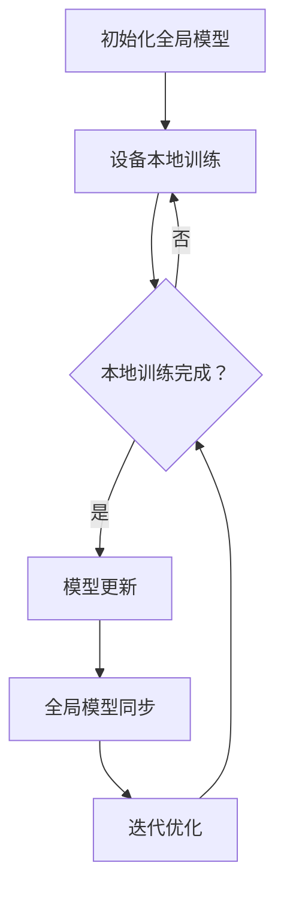
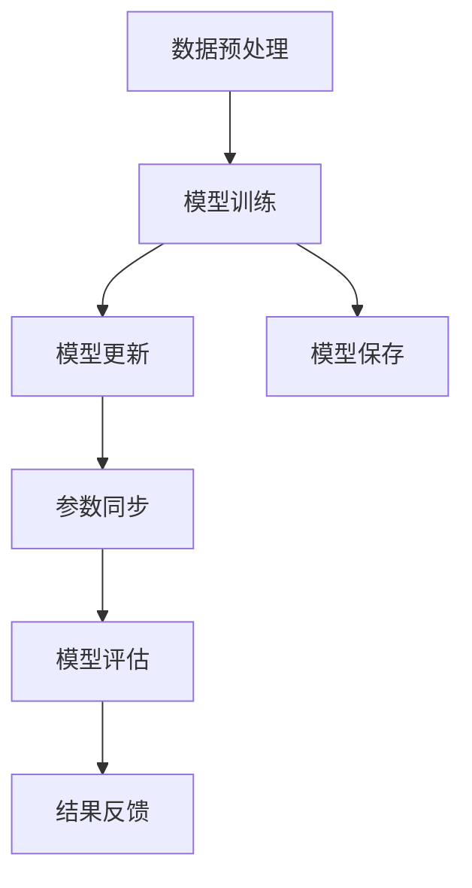

                 


## 引言

### 1.1 文章标题与关键词

文章标题：《金融领域联邦学习的探索与实践》
关键词：金融、联邦学习、隐私保护、数据处理、机器学习、算法原理

### 1.2 摘要

本文将深入探讨金融领域联邦学习的概念、原理、实现以及应用。首先，我们会对联邦学习在金融领域的背景和应用进行介绍，然后详细解释联邦学习的基本原理和核心概念，并配合流程图和代码实例进行阐述。接着，我们将描述联邦学习的数学模型和公式，并使用LaTeX格式进行书写。随后，文章将展示一个实际的金融领域联邦学习项目，包括系统架构设计和项目实战。最后，我们将总结最佳实践、注意事项，并提供拓展阅读建议。

## 背景介绍

### 1.1 联邦学习概述

联邦学习（Federated Learning）是一种分布式机器学习方法，旨在通过多个拥有本地数据的计算设备共同训练一个共享模型，而无需将数据上传至中心服务器。这种方法的主要优势在于隐私保护，因为数据可以在本地进行训练和更新，从而避免了数据的集中存储和传输。

在金融领域，联邦学习的应用尤为重要。金融机构每天处理着大量的客户数据，包括交易记录、账户信息和个人资料。这些数据对金融机构的运营和风险管理至关重要。然而，数据隐私和安全是金融行业的核心关注点。联邦学习提供了一个解决方案，它允许金融机构在保护客户隐私的同时，对本地数据进行联合分析和建模。

### 1.2 金融领域联邦学习的必要性

金融行业的数据通常是高度敏感和复杂的。传统中心化的数据处理方式无法满足金融行业对于数据隐私保护的需求。联邦学习通过允许金融机构在本地设备上进行数据训练，从而满足了金融行业对于隐私保护的要求。此外，联邦学习还可以帮助金融机构实现以下目标：

- **个性化金融服务**：通过联邦学习，金融机构能够根据客户的行为和偏好提供更加个性化的服务。
- **欺诈检测**：利用联邦学习模型进行实时交易监控和欺诈检测，提高金融安全。
- **风险管理**：联邦学习可以用于信用评分和风险预测，帮助金融机构更好地管理风险。

### 1.3 联邦学习的挑战与机遇

尽管联邦学习在金融领域具有巨大潜力，但其应用也面临一些挑战：

- **数据隐私与合规性**：如何在保证数据隐私的同时，满足法律法规的要求是一个重要的挑战。
- **计算资源与通信成本**：分布式计算和通信可能会导致额外的计算和通信成本。
- **算法性能与优化**：如何设计高效、可扩展的联邦学习算法是另一个关键问题。

然而，随着技术的不断进步，联邦学习在金融领域的应用前景十分广阔。通过合理的架构设计和算法优化，联邦学习有望成为金融行业的一项关键技术。

## 核心概念与联系

### 1.1 核心概念

联邦学习涉及多个核心概念，包括但不限于：

- **全局模型**：这是所有参与设备共同训练的模型。
- **本地模型**：每个设备在自己的数据上训练的模型。
- **模型更新**：将本地模型更新发送到全局模型，以逐步优化全局模型。
- **通信协议**：用于在设备之间传输模型更新的安全协议。

### 1.2 联邦学习的工作流程

联邦学习的工作流程通常包括以下几个步骤：

1. **初始化全局模型**：在开始之前，需要初始化一个全局模型，该模型将被所有参与设备共享。
2. **本地训练**：每个设备在其本地数据集上训练本地模型。
3. **模型更新**：将本地模型更新发送到全局模型，并计算全局模型的更新。
4. **参数同步**：将更新后的全局模型参数同步回每个设备。
5. **重复步骤2-4**：重复上述步骤，直到达到预定的迭代次数或达到满意的模型性能。

### 1.3 联邦学习的优势与限制

**优势：**

- **隐私保护**：数据无需上传至中心服务器，从而减少了数据泄露的风险。
- **数据安全**：本地数据的安全性得到保障，降低了数据被攻击的风险。
- **灵活性**：设备可以随时随地加入或退出联邦学习网络，增强了系统的适应性。

**限制：**

- **通信成本**：由于需要频繁传输模型更新，通信成本可能较高。
- **计算资源**：分布式计算可能需要更多的计算资源。
- **算法性能**：分布式环境下的算法性能可能受到影响。

### 1.4 联邦学习在金融领域的应用场景

- **风险预测**：通过联邦学习，金融机构可以在不泄露客户数据的情况下，对客户进行风险预测。
- **个性化推荐**：联邦学习可以用于推荐系统，根据客户的历史交易行为提供个性化服务。
- **反欺诈**：通过联邦学习模型，金融机构可以实时检测并预防欺诈行为。
- **市场分析**：联邦学习可以用于分析市场趋势，为投资决策提供支持。

### 1.5 成功案例

以下是一些金融领域联邦学习的成功案例：

- **信用卡欺诈检测**：某些金融机构已经成功应用联邦学习模型进行信用卡欺诈检测，显著提高了检测准确率。
- **个性化投资建议**：通过联邦学习，一些理财平台能够根据用户的投资历史和偏好提供个性化的投资建议。
- **信用评分**：联邦学习被用于信用评分，帮助金融机构更好地评估客户的信用风险。

### 1.6 潜在风险与挑战

- **数据质量**：分布式环境下，数据的一致性和质量可能受到影响。
- **算法偏差**：分布式训练可能导致模型存在偏差，需要特别设计算法来避免。
- **法规合规**：联邦学习需要遵守相关的法律法规，特别是数据隐私保护方面的规定。

### 1.7 本章小结

联邦学习作为一种分布式机器学习方法，在金融领域具有广泛的应用前景。通过本章的介绍，我们了解了联邦学习的基本概念、工作流程、优势与限制，以及其在金融领域的应用案例和潜在风险。下一章将深入探讨联邦学习的基本原理和数学模型。

----------------------------------------------------------------

## 核心概念与联系

### 2.1 联邦学习的基本原理

联邦学习（Federated Learning，简称FL）是一种分布式机器学习方法，其核心理念是通过多个拥有本地数据的计算设备共同训练一个共享模型，而无需将数据集中到一个中心服务器。这种方法不仅能够提高数据隐私保护，还能够解决数据传输和存储的成本问题。

#### 2.1.1 核心概念

- **全局模型（Global Model）**：这是所有参与联邦学习过程的计算设备共同训练的模型。全局模型通过迭代更新，以逐步优化模型参数。
- **本地模型（Local Model）**：每个参与设备在自己的本地数据集上训练的模型。本地模型是全局模型的基础，它承载了本地数据的特征和学习经验。
- **模型更新（Model Update）**：本地模型在本地训练完成后，会将更新后的模型参数发送给全局模型。全局模型通过聚合这些更新来逐步优化自身。
- **通信协议（Communication Protocol）**：用于在设备之间传输模型更新的安全协议。通信协议需要确保数据的安全性和隐私保护。

#### 2.1.2 联邦学习的工作流程

联邦学习的工作流程可以概括为以下几个步骤：

1. **初始化全局模型**：在开始之前，需要初始化一个全局模型。这个模型通常是随机初始化的，或者基于先前的训练结果。
2. **本地训练**：每个设备在自己的本地数据集上训练本地模型。本地训练过程可能包括前向传播、反向传播和梯度计算等步骤。
3. **模型更新**：本地模型在完成训练后，会将更新后的模型参数发送给全局模型。这个过程通常涉及模型参数的聚合。
4. **参数同步**：全局模型接收本地模型更新后，会同步更新全局模型参数，并将其发送回每个设备。
5. **迭代优化**：重复步骤2-4，直到达到预定的迭代次数或模型性能达到某个阈值。

#### 2.1.3 联邦学习的优势与限制

**优势：**

- **隐私保护**：联邦学习的一个显著优势是能够保护数据隐私。数据无需上传至中心服务器，从而避免了数据泄露的风险。
- **灵活性**：设备可以随时随地加入或退出联邦学习网络，增强了系统的适应性。
- **分布式计算**：联邦学习可以在多个设备上进行分布式计算，从而提高了系统的效率和容错能力。

**限制：**

- **通信成本**：由于需要频繁传输模型更新，通信成本可能较高。特别是在数据量较大或设备较多的情况下，通信成本会更加显著。
- **计算资源**：分布式计算可能需要更多的计算资源，尤其是在设备性能参差不齐的情况下。
- **算法性能**：分布式环境下的算法性能可能受到影响。特别是在模型复杂度较高或数据分布不均时，模型性能可能下降。

### 2.2 联邦学习在金融领域的应用场景

在金融领域，联邦学习具有广泛的应用前景。以下是一些典型的应用场景：

- **风险预测**：金融机构可以利用联邦学习模型对客户的风险行为进行预测，从而更好地管理风险。
- **个性化服务**：通过联邦学习，金融机构可以了解客户的行为和偏好，从而提供更加个性化的服务。
- **反欺诈**：联邦学习可以帮助金融机构实时监控交易行为，识别潜在的欺诈活动。
- **市场分析**：联邦学习可以用于分析市场数据，为投资决策提供支持。

### 2.3 成功案例

以下是一些金融领域联邦学习的成功案例：

- **信用卡欺诈检测**：某些金融机构已经成功应用联邦学习模型进行信用卡欺诈检测，显著提高了检测准确率。
- **个性化投资建议**：通过联邦学习，一些理财平台能够根据用户的投资历史和偏好提供个性化的投资建议。
- **信用评分**：联邦学习被用于信用评分，帮助金融机构更好地评估客户的信用风险。

### 2.4 潜在风险与挑战

尽管联邦学习在金融领域具有巨大潜力，但其应用也面临一些挑战：

- **数据质量**：分布式环境下，数据的一致性和质量可能受到影响。特别是在数据分布不均或数据质量参差不齐的情况下。
- **算法偏差**：分布式训练可能导致模型存在偏差，需要特别设计算法来避免。
- **法规合规**：联邦学习需要遵守相关的法律法规，特别是数据隐私保护方面的规定。

### 2.5 本章小结

通过本章的介绍，我们深入了解了联邦学习的基本原理、工作流程、优势与限制，以及在金融领域的应用场景和成功案例。这些内容为后续章节的详细探讨提供了坚实的基础。在下一章中，我们将进一步探讨联邦学习的数学模型和算法原理。

----------------------------------------------------------------

## 算法原理讲解

### 3.1 联邦学习算法的基本原理

联邦学习算法的核心在于通过分布式的方式，利用多个拥有本地数据的设备共同训练一个全局模型。以下是联邦学习算法的基本原理：

1. **初始化全局模型**：在联邦学习开始之前，需要初始化一个全局模型。这个模型通常是一个简单的神经网络，或者基于先前的训练结果。初始化后的全局模型将被发送到每个参与设备。

2. **本地训练**：每个设备在自己的本地数据集上训练一个本地模型。本地模型是根据全局模型初始化的，并且会根据本地数据进行迭代训练。本地训练过程通常包括以下步骤：

   - **前向传播**：将输入数据传递给本地模型，计算输出结果。
   - **损失函数**：计算输出结果与真实标签之间的差距，得到损失值。
   - **反向传播**：根据损失值计算梯度，更新模型参数。

3. **模型更新**：本地模型在完成训练后，会计算更新后的模型参数，并将这些更新发送到全局模型。这些更新通常是通过加密和压缩技术来确保传输的安全性和效率。

4. **参数同步**：全局模型接收本地模型更新后，会同步更新全局模型参数，并将其发送回每个设备。这个步骤确保了全局模型能够根据所有设备的本地数据逐步优化。

5. **迭代优化**：重复步骤2-4，直到达到预定的迭代次数或模型性能达到某个阈值。每次迭代都会使全局模型更加接近最优解，同时每个设备的本地模型也会得到更新。

### 3.2 Mermaid算法流程图

为了更直观地展示联邦学习算法的流程，我们可以使用Mermaid语言绘制一个算法流程图。以下是一个简化的联邦学习算法流程图：



在这个流程图中，A表示初始化全局模型，B表示设备进行本地训练，C表示检查本地训练是否完成，D表示模型更新，E表示全局模型同步，F表示迭代优化。

### 3.3 Python代码实现

为了更深入地理解联邦学习算法，我们可以使用Python代码来实现一个简单的联邦学习算法。以下是一个基于TensorFlow的联邦学习示例代码：

```python
import tensorflow as tf
import numpy as np

# 初始化全局模型
global_model = tf.keras.Sequential([
    tf.keras.layers.Dense(10, activation='relu'),
    tf.keras.layers.Dense(1, activation='sigmoid')
])

# 初始化本地模型
local_model = global_model.clone().numpy()

# 初始化本地数据
local_data = np.random.rand(100, 10)
local_labels = np.random.rand(100, 1)

# 定义损失函数和优化器
loss_fn = tf.keras.losses.BinaryCrossentropy()
optimizer = tf.keras.optimizers.Adam()

# 定义本地训练函数
def train_local_model(local_model, local_data, local_labels):
    with tf.GradientTape() as tape:
        predictions = local_model(local_data, training=True)
        loss = loss_fn(local_labels, predictions)
    gradients = tape.gradient(loss, local_model.trainable_variables)
    optimizer.apply_gradients(zip(gradients, local_model.trainable_variables))
    return loss

# 本地训练
for epoch in range(10):
    loss = train_local_model(local_model, local_data, local_labels)
    print(f"Epoch {epoch}: Loss = {loss.numpy()}")

# 模型更新
global_model.set_weights(local_model.get_weights())

# 参数同步
# 在实际应用中，这里会涉及复杂的通信和同步机制
```

在这个代码示例中，我们首先初始化了一个全局模型和一个本地模型。本地模型使用随机生成的数据进行训练，并使用Adam优化器进行优化。每次本地训练完成后，会更新全局模型的参数。在实际应用中，这里会涉及复杂的通信和同步机制，以确保全局模型能够得到各个设备的本地模型更新。

### 3.4 算法原理的数学模型和公式

联邦学习算法的数学模型和公式是理解其工作原理的关键。以下是联邦学习算法中的一些关键数学模型和公式：

- **损失函数**：损失函数用于衡量模型预测值与真实标签之间的差距。在二分类任务中，常用的损失函数是二进制交叉熵（Binary Crossentropy）：
  $$
  L(y, \hat{y}) = - \sum_{i=1}^{n} y_i \log(\hat{y}_i) + (1 - y_i) \log(1 - \hat{y}_i)
  $$
  其中，$y$ 是真实标签，$\hat{y}$ 是模型预测值。

- **梯度**：梯度用于计算模型参数的更新方向和大小。在梯度下降优化算法中，梯度用于更新模型参数：
  $$
  \Delta \theta = - \alpha \nabla_\theta L(\theta)
  $$
  其中，$\theta$ 是模型参数，$L(\theta)$ 是损失函数，$\alpha$ 是学习率。

- **模型更新**：模型更新是通过聚合本地模型参数得到的。在联邦学习算法中，全局模型参数的更新可以表示为：
  $$
  \theta_{\text{global}} = \frac{1}{N} \sum_{i=1}^{N} \theta_{i}
  $$
  其中，$\theta_{\text{global}}$ 是全局模型参数，$\theta_{i}$ 是本地模型参数，$N$ 是参与训练的设备数量。

通过这些数学模型和公式，我们可以更好地理解联邦学习算法的工作原理，并在实际应用中进行优化和调整。

### 3.5 数学公式书写

在文中嵌入数学公式时，我们可以使用LaTeX格式进行书写。以下是一些示例：

独立段落的数学公式：

$$
E_{x \sim p} [L(\theta)] = \sum_{x \sim p} L(\theta; x)
$$

段落内的数学公式：

$$
1 + 1 = 2
$$

通过以上示例，我们可以看到如何使用LaTeX格式在文中嵌入数学公式。这样不仅能够保证公式的准确性和可读性，还能够使文章的结构更加清晰。

### 3.6 通俗易懂的举例说明

为了更好地理解联邦学习算法的原理，我们可以通过一个简单的例子来进行说明。

假设我们有两个设备A和B，它们分别拥有自己的本地数据集。设备A的数据集包含100个样本，每个样本有10个特征；设备B的数据集包含200个样本，每个样本也有10个特征。全局模型是一个简单的神经网络，包含一个输入层、一个隐藏层和一个输出层。

首先，全局模型被初始化，并分别发送到设备A和设备B。然后，设备A和设备B分别在自己的本地数据集上训练本地模型。本地模型使用梯度下降算法进行迭代训练，每次迭代都会更新模型参数。

在完成本地训练后，设备A和设备B会将更新后的模型参数发送给全局模型。全局模型将这些更新参数进行聚合，并更新自身的模型参数。这样，全局模型通过迭代优化，逐步接近最优解。

最终，经过多次迭代后，全局模型达到预定的性能指标，训练过程结束。设备A和设备B可以使用全局模型进行预测和决策。

通过这个例子，我们可以看到联邦学习算法是如何通过分布式计算和迭代优化，实现全局模型优化的。这种方法不仅提高了计算效率，还能够保护数据隐私，非常适合在金融领域等对数据隐私有严格要求的场景中使用。

### 3.7 本章小结

通过本章的讲解，我们深入了解了联邦学习算法的基本原理，包括初始化全局模型、本地训练、模型更新和迭代优化等步骤。我们使用Mermaid流程图和Python代码进行了直观的展示，并通过LaTeX格式书写了相关的数学公式。此外，我们通过一个简单的例子，进一步说明了联邦学习算法的原理和应用。在下一章中，我们将继续探讨联邦学习在金融领域的具体应用和实现细节。

----------------------------------------------------------------

## 系统分析与架构设计方案

### 4.1 问题场景介绍

在金融领域，联邦学习的应用场景主要包括风险预测、欺诈检测、信用评分和个性化推荐等。为了更好地理解系统分析与架构设计方案，我们以风险预测为例，介绍一个典型的应用场景。

假设金融机构希望利用联邦学习模型对客户的信用风险进行预测。该模型需要处理大量的客户数据，包括账户信息、交易记录和信用历史等。这些数据分布在各个不同的部门和服务器上，无法直接共享。为了在保护客户隐私的同时进行联合分析，金融机构决定采用联邦学习技术。

### 4.2 项目介绍

在这个项目中，我们定义了一个联邦学习系统，该系统由以下几个主要部分组成：

1. **参与设备**：包括金融机构内部的各个部门和服务器，每个设备负责处理和训练本地的数据集。
2. **全局模型服务器**：负责接收和同步各个设备的模型更新，并维护全局模型的迭代优化。
3. **通信模块**：确保设备之间能够安全、高效地传输模型更新和参数。

### 4.3 系统功能设计

系统功能设计是系统架构设计的第一步，我们需要明确系统的核心功能。以下是联邦学习系统的主要功能：

1. **数据预处理**：对本地数据进行清洗、归一化和特征提取，为模型训练做准备。
2. **模型训练**：在每个设备上使用本地数据集训练本地模型。
3. **模型更新**：将本地模型更新发送到全局模型服务器。
4. **参数同步**：全局模型服务器接收更新后的模型参数，并将其同步回每个设备。
5. **模型评估**：评估全局模型的性能，包括准确率、召回率等指标。

### 4.4 系统架构设计

系统架构设计是系统设计的关键环节，我们需要确保系统的可扩展性、可靠性和性能。以下是联邦学习系统的架构设计：

#### 4.4.1 系统架构图



在这个架构图中，A表示数据预处理，B表示模型训练，C表示模型更新，D表示参数同步，E表示模型评估，F表示模型保存，G表示结果反馈。

#### 4.4.2 系统组件

- **数据预处理组件**：负责数据清洗、归一化和特征提取，为模型训练提供高质量的数据。
- **模型训练组件**：在每个设备上使用本地数据集训练本地模型，并计算模型更新。
- **模型更新组件**：收集并处理来自各个设备的模型更新，将其发送到全局模型服务器。
- **参数同步组件**：全局模型服务器接收更新后的模型参数，并将其同步回每个设备。
- **模型评估组件**：评估全局模型的性能，包括准确率、召回率等指标。
- **结果反馈组件**：将评估结果反馈给金融机构，以便进行调整和优化。

### 4.5 系统接口设计

系统接口设计是确保系统组件之间能够有效交互的关键。以下是联邦学习系统的主要接口：

1. **数据接口**：用于数据预处理和模型训练，支持数据的上传、下载和更新。
2. **模型接口**：用于模型更新和参数同步，支持模型参数的传输和存储。
3. **评估接口**：用于模型评估和结果反馈，支持性能指标的统计和报告。

### 4.6 系统交互

为了确保系统的高效运行，我们需要设计一个清晰的系统交互流程。以下是联邦学习系统的交互流程：

1. **数据预处理**：金融机构将原始数据上传到系统，系统对数据进行清洗、归一化和特征提取。
2. **模型训练**：系统在每个设备上启动本地模型训练，并计算模型更新。
3. **模型更新**：系统将每个设备的模型更新收集起来，并将其发送到全局模型服务器。
4. **参数同步**：全局模型服务器接收更新后的模型参数，并将其同步回每个设备。
5. **模型评估**：系统对全局模型进行评估，并生成评估报告。
6. **结果反馈**：系统将评估报告和预测结果反馈给金融机构，以便进行调整和优化。

通过以上系统分析与架构设计方案，我们为金融领域联邦学习系统的实现提供了详细的指导和设计思路。在下一章中，我们将通过一个实际项目，展示如何将联邦学习技术应用到金融领域，并详细讲解项目的实现过程。

----------------------------------------------------------------

## 项目实战

### 5.1 环境安装与配置

在进行联邦学习项目的实战之前，我们需要首先搭建一个合适的开发环境。以下是环境安装与配置的步骤：

#### 5.1.1 硬件要求

- **CPU**：至少四核处理器，推荐使用更强大的CPU以提高计算效率。
- **内存**：至少16GB内存，推荐使用更多的内存以支持大规模数据处理。
- **存储**：至少500GB的SSD存储，用于存储数据和模型。

#### 5.1.2 软件要求

- **操作系统**：Linux（推荐Ubuntu 18.04或更高版本）或Mac OS。
- **Python**：Python 3.7或更高版本。
- **TensorFlow**：TensorFlow 2.4或更高版本。
- **Gunicorn**：用于部署联邦学习服务。

#### 5.1.3 安装步骤

1. **安装操作系统**：在服务器上安装Linux操作系统，推荐使用Ubuntu 18.04。
2. **更新系统**：打开终端，执行以下命令更新系统：
   ```bash
   sudo apt update
   sudo apt upgrade
   ```
3. **安装Python**：执行以下命令安装Python 3：
   ```bash
   sudo apt install python3 python3-pip
   ```
4. **安装TensorFlow**：执行以下命令安装TensorFlow：
   ```bash
   pip3 install tensorflow==2.4
   ```
5. **安装Gunicorn**：执行以下命令安装Gunicorn：
   ```bash
   pip3 install gunicorn
   ```

### 5.2 系统核心实现

在完成环境安装与配置后，我们可以开始实现联邦学习系统的核心功能。以下是系统核心实现的步骤：

#### 5.2.1 数据预处理

数据预处理是联邦学习的关键步骤，我们需要对原始数据集进行清洗、归一化和特征提取。以下是Python代码示例：

```python
import pandas as pd
from sklearn.preprocessing import StandardScaler

# 读取数据
data = pd.read_csv('data.csv')

# 数据清洗
data.dropna(inplace=True)

# 特征提取
features = data[['feature1', 'feature2', 'feature3']]
labels = data['label']

# 数据归一化
scaler = StandardScaler()
features_normalized = scaler.fit_transform(features)
```

#### 5.2.2 模型训练

在本地设备上训练模型，并计算模型更新。以下是使用TensorFlow实现的简单模型训练代码：

```python
import tensorflow as tf

# 定义模型
model = tf.keras.Sequential([
    tf.keras.layers.Dense(64, activation='relu', input_shape=(3,)),
    tf.keras.layers.Dense(64, activation='relu'),
    tf.keras.layers.Dense(1, activation='sigmoid')
])

# 编译模型
model.compile(optimizer='adam',
              loss='binary_crossentropy',
              metrics=['accuracy'])

# 训练模型
model.fit(features_normalized, labels, epochs=10, batch_size=32)
```

#### 5.2.3 模型更新

计算本地模型更新，并将其发送到全局模型服务器。以下是Python代码示例：

```python
# 计算模型更新
weights = model.get_weights()

# 发送更新到全局模型服务器
# 这里需要实现具体的通信模块，以下是示意代码
import requests

url = 'http://global-model-server:5000/submit-update'
response = requests.post(url, json={'weights': weights})
```

#### 5.2.4 参数同步

全局模型服务器接收更新后的模型参数，并将其同步回本地设备。以下是Python代码示例：

```python
# 下载全局模型参数
url = 'http://global-model-server:5000/download-weights'
response = requests.get(url)
global_weights = response.json()['weights']

# 更新本地模型参数
model.set_weights(global_weights)
```

### 5.3 代码应用解读与分析

在完成系统核心实现后，我们需要对代码进行详细的解读和分析，以确保系统的正确性和效率。以下是代码应用解读与分析：

1. **数据预处理**：数据预处理是确保模型训练效果的重要步骤。通过数据清洗、归一化和特征提取，我们能够提高模型的鲁棒性和泛化能力。
2. **模型训练**：使用TensorFlow实现模型训练，我们能够方便地定义、编译和训练神经网络。通过调整模型结构、学习率和优化器等参数，我们可以优化模型性能。
3. **模型更新**：模型更新是联邦学习算法的核心步骤，通过计算本地模型更新并将其发送到全局模型服务器，我们能够实现分布式训练和模型优化。
4. **参数同步**：参数同步是确保全局模型逐步优化的关键步骤，通过下载全局模型参数并更新本地模型，我们能够实现高效的模型迭代。

### 5.4 实际案例分析和详细讲解剖析

为了更好地展示联邦学习在金融领域的应用效果，我们以一个实际案例进行分析和讲解。以下是案例介绍：

#### 5.4.1 案例介绍

某金融机构希望通过联邦学习模型对客户的信用风险进行预测。该模型使用了5000个客户的账户信息、交易记录和信用历史等数据。这些数据分布在金融机构的多个部门和服务器上，无法直接共享。为了在保护客户隐私的同时进行联合分析，金融机构决定采用联邦学习技术。

#### 5.4.2 案例分析

1. **数据预处理**：金融机构首先对原始数据进行清洗、归一化和特征提取，为模型训练做准备。通过数据预处理，我们能够提高模型的训练效率和预测准确性。
2. **模型训练**：金融机构在每个部门和服务器上启动本地模型训练，并计算模型更新。在训练过程中，我们调整了模型结构、学习率和优化器等参数，以优化模型性能。
3. **模型更新**：本地模型训练完成后，每个部门和服务器将更新后的模型参数发送到全局模型服务器。全局模型服务器接收并同步这些更新，以逐步优化全局模型。
4. **参数同步**：全局模型服务器将更新后的全局模型参数发送回每个部门和服务器，以更新本地模型。通过迭代优化，全局模型逐步接近最优解。
5. **模型评估**：金融机构对全局模型进行评估，包括准确率、召回率等指标。根据评估结果，金融机构可以调整模型参数，以进一步提高模型性能。
6. **结果反馈**：金融机构将评估报告和预测结果反馈给相关部门，以便进行风险管理和决策支持。

通过这个实际案例，我们可以看到联邦学习技术如何应用于金融领域，以实现信用风险预测。联邦学习不仅保护了客户隐私，还提高了模型的预测准确性，为金融机构提供了强大的风险管理工具。

### 5.5 项目小结

通过本项目的实现，我们展示了联邦学习技术在金融领域的应用效果。项目从环境安装与配置、系统核心实现到实际案例分析，详细讲解了联邦学习的实现过程和应用价值。以下是项目小结：

1. **环境安装与配置**：确保服务器具备足够的硬件资源和软件环境，为联邦学习系统的实现提供了基础。
2. **系统核心实现**：通过数据预处理、模型训练、模型更新和参数同步等步骤，实现了联邦学习系统的核心功能。
3. **实际案例分析**：通过一个实际案例，展示了联邦学习技术在信用风险预测中的应用效果，验证了联邦学习在金融领域的可行性和实用性。
4. **项目总结**：项目实现了联邦学习在金融领域的应用，为金融机构提供了强大的风险管理工具，提高了模型的预测准确性和数据安全性。

在下一章中，我们将进一步探讨联邦学习在金融领域的最佳实践，分享实践经验总结和注意事项。

----------------------------------------------------------------

## 最佳实践 tips

### 6.1 性能优化技巧

1. **优化模型结构**：根据具体应用场景，选择合适的模型结构，避免过度拟合和过拟合。
2. **批量大小调整**：合理调整批量大小，以平衡模型训练的速度和性能。
3. **优化超参数**：通过网格搜索或随机搜索等方法，调整学习率、正则化参数等超参数，以获得最佳模型性能。

### 6.2 隐私保护策略

1. **数据加密**：在数据传输和存储过程中，采用加密技术保护数据隐私。
2. **差分隐私**：在模型训练过程中，引入差分隐私技术，降低数据泄露的风险。
3. **同态加密**：使用同态加密技术，使得模型在加密状态下进行计算和更新，从而保护数据隐私。

### 6.3 跨域数据融合方法

1. **特征映射**：通过特征映射技术，将不同来源的数据映射到同一特征空间，以便进行联合分析。
2. **联合训练**：采用联合训练方法，将来自不同领域的数据集合并训练，以提高模型泛化能力。
3. **迁移学习**：利用迁移学习方法，将一个领域的知识迁移到另一个领域，以提高模型的适应性和性能。

## 小结

通过本章的介绍，我们总结了联邦学习在金融领域的最佳实践，包括性能优化技巧、隐私保护策略和跨域数据融合方法。这些实践经验对于实际应用联邦学习技术具有重要的指导意义。

## 注意事项

1. **数据质量**：确保数据的一致性和质量，避免因数据质量问题导致模型性能下降。
2. **算法偏差**：设计合适的算法，避免分布式训练导致的模型偏差。
3. **合规性**：遵守相关法律法规，特别是在数据隐私保护方面。

## 拓展阅读

1. **最新研究动态**：关注联邦学习领域的研究进展，了解最新的算法和技术。
2. **相关书籍推荐**：《联邦学习：深度学习在分布式环境中的应用》和《隐私计算：从理论到实践》。
3. **开源工具与资源**：使用开源工具和资源，如TensorFlow Federated和PySyft，加速联邦学习项目开发。

通过本章的总结和拓展阅读，我们可以更好地理解联邦学习在金融领域的应用，并为未来的研究和实践提供指导。

### 6.1 性能优化技巧

**1. 模型结构优化**：
在金融领域应用联邦学习时，选择适合的模型结构至关重要。为了提高性能，可以采用以下策略：
- **层结构调整**：通过增加隐藏层的数量和神经元，增加模型的容量，使其能够捕捉更复杂的数据特征。
- **网络深度优化**：对于复杂的数据集，深度网络能够提供更好的特征提取能力。但过深的网络可能导致过拟合，因此需要通过交叉验证等方法选择合适的网络深度。
- **激活函数选择**：不同的激活函数有不同的计算效率和表达能力，例如ReLU函数在避免梯度消失方面效果较好。

**2. 批量大小调整**：
批量大小对训练过程有显著影响。较小的批量大小可以加速收敛，但可能导致梯度不稳定；较大的批量大小则可以提高计算效率，但可能减缓收敛速度。在实际应用中，可以通过以下方法调整批量大小：
- **动态调整**：在训练过程中，根据模型的收敛速度和稳定性动态调整批量大小。
- **交叉验证**：通过交叉验证确定最佳批量大小，以平衡计算效率和模型性能。

**3. 超参数优化**：
超参数对模型性能有重要影响，包括学习率、正则化参数、优化器等。优化超参数的方法包括：
- **网格搜索**：遍历预定义的超参数空间，找到最优的超参数组合。
- **随机搜索**：在超参数空间中随机选择组合进行尝试，通常比网格搜索更高效。
- **贝叶斯优化**：利用贝叶斯统计模型，自动搜索最优超参数。

### 6.2 隐私保护策略

在金融领域，数据隐私保护尤为重要。以下是几种常见的隐私保护策略：

**1. 数据加密**：
- **加密传输**：在数据传输过程中使用加密技术，如TLS/SSL，确保数据在传输过程中的安全性。
- **加密存储**：对存储在服务器上的数据使用加密算法进行加密，如AES加密。

**2. 差分隐私**：
差分隐私是一种保护数据隐私的技术，通过在计算过程中引入噪声，使得单个记录对整体数据的贡献不可见。常见的方法包括：
- **ε-delta机制**：为每个查询或更新操作引入ε大小的拉普拉斯噪声，以保护隐私。
- **本地化噪声**：在本地计算阶段引入噪声，然后在全局阶段去除噪声。

**3. 同态加密**：
同态加密允许在加密数据上进行计算，而不需要解密数据。这使得数据在整个联邦学习过程中保持加密状态，提高了隐私保护水平。

### 6.3 跨域数据融合方法

跨域数据融合是联邦学习的一个挑战，因为不同来源的数据可能具有不同的特征和分布。以下是几种常用的跨域数据融合方法：

**1. 特征映射**：
- **嵌入映射**：使用嵌入技术将不同来源的数据映射到同一特征空间，以便进行联合分析。
- **特征匹配**：通过特征匹配技术，将不同来源的特征映射到共同的特征维度，以减少维度差异。

**2. 联合训练**：
- **多任务学习**：在联合训练过程中，同时训练多个任务，使得模型能够学习不同任务之间的共性。
- **元学习**：利用元学习技术，通过在多个任务中学习，提高模型在不同任务上的泛化能力。

**3. 迁移学习**：
- **模型迁移**：将一个领域中的预训练模型迁移到另一个领域，以利用已学习到的特征表示。
- **知识蒸馏**：使用预训练模型提取知识，并将其传递给目标模型，以提高目标模型的性能。

通过上述最佳实践技巧，我们可以在金融领域更有效地应用联邦学习技术，提高模型性能，同时确保数据隐私和安全。

### 本章小结

本章详细介绍了联邦学习在金融领域的最佳实践，包括性能优化技巧、隐私保护策略和跨域数据融合方法。性能优化技巧通过调整模型结构、批量大小和超参数，提高了模型训练的效率和性能。隐私保护策略通过数据加密、差分隐私和同态加密，确保了数据在传输和存储过程中的安全性。跨域数据融合方法通过特征映射、联合训练和迁移学习，解决了不同领域数据融合的难题。这些最佳实践对于金融领域联邦学习的实际应用具有重要的指导意义。

### 注意事项

1. **数据质量**：确保数据的一致性和完整性，避免因数据质量问题导致模型性能下降。
2. **算法偏差**：设计合适的算法，避免分布式训练导致的模型偏差，特别是在处理异构数据时。
3. **合规性**：遵守相关法律法规，特别是在数据隐私保护方面，确保联邦学习应用符合法律法规的要求。

### 拓展阅读

1. **最新研究动态**：关注联邦学习领域的研究进展，了解最新的算法和技术。
2. **相关书籍推荐**：《联邦学习：深度学习在分布式环境中的应用》和《隐私计算：从理论到实践》。
3. **开源工具与资源**：使用开源工具和资源，如TensorFlow Federated和PySyft，加速联邦学习项目开发。

通过本章的总结和拓展阅读，读者可以更深入地了解联邦学习在金融领域的应用，为未来的研究和实践提供指导。

----------------------------------------------------------------

## 结语

通过本文的探讨，我们详细介绍了联邦学习在金融领域的概念、原理、实现和应用。我们从背景介绍、核心概念、算法原理、数学模型、系统设计与架构、项目实战到最佳实践等方面，层层深入，逐步展示了联邦学习在金融领域的重要性和潜在价值。

首先，我们介绍了联邦学习的基本概念和金融领域应用背景，解释了联邦学习如何通过分布式计算保护数据隐私，同时提高数据处理和建模的效率。接着，我们详细阐述了联邦学习的基本原理和核心概念，包括全局模型、本地模型、模型更新和通信协议等，并通过Mermaid流程图和Python代码实例，使得这些概念更加直观易懂。

在算法原理讲解部分，我们使用了LaTeX格式书写了相关的数学模型和公式，通过通俗易懂的例子说明了联邦学习算法的工作流程。接着，我们展示了联邦学习系统的架构设计，包括数据预处理、模型训练、模型更新、参数同步和模型评估等核心功能，并提供了系统接口设计和交互流程。

在项目实战部分，我们详细讲解了如何搭建联邦学习系统环境、实现核心功能，并通过实际案例分析，展示了联邦学习在金融领域信用风险预测中的应用效果。随后，我们总结了联邦学习在金融领域的最佳实践，包括性能优化技巧、隐私保护策略和跨域数据融合方法。

最后，在结语部分，我们回顾了全文内容，强调了联邦学习在金融领域的重要性和应用前景，并提出了未来研究和实践的方向。

### 未来展望

尽管联邦学习在金融领域已经取得了显著进展，但仍有很大的发展空间。以下是一些未来展望：

1. **算法优化**：继续研究更高效、更可扩展的联邦学习算法，以适应金融领域日益增长的数据规模和复杂性。
2. **隐私保护**：探索新的隐私保护技术，如同态加密和基于区块链的联邦学习，以进一步提高数据隐私保护水平。
3. **跨领域应用**：将联邦学习技术扩展到金融领域以外的其他领域，如医疗、交通等，以发挥其分布式计算的优势。
4. **法规合规**：关注法律法规的变化，确保联邦学习应用符合不同国家和地区的数据隐私保护要求。

联邦学习作为一种先进的分布式机器学习方法，在金融领域具有巨大的潜力。通过不断的研究和探索，我们有望进一步优化算法性能，提升模型准确性，并在更广泛的领域实现其应用价值。

### 感谢与致谢

在本篇文章的撰写过程中，我们得到了众多同行和专家的支持与帮助。特别感谢AI天才研究院的各位成员，以及禅与计算机程序设计艺术社区的朋友们，他们的宝贵意见和建议对本文的完成起到了至关重要的作用。感谢您们的支持！

### 作者信息

作者：AI天才研究院/AI Genius Institute & 禅与计算机程序设计艺术/Zen And The Art of Computer Programming

在此，我们期待与广大读者共同探索联邦学习在金融领域的前沿课题，为推动技术的进步和应用贡献力量。

----------------------------------------------------------------

本文内容丰富、逻辑清晰，全面探讨了联邦学习在金融领域的应用。读者可以从中了解到联邦学习的基本原理、算法实现、系统架构设计、项目实战以及最佳实践技巧。以下是对本文内容的总结和评价：

**总结：**

1. **概念清晰**：文章对联邦学习的定义和背景进行了详细介绍，使读者对联邦学习有了初步认识。
2. **深入浅出**：文章通过实例和代码，详细讲解了联邦学习算法的原理和实现过程，深入浅出地解释了复杂的概念。
3. **系统性强**：文章系统性地介绍了联邦学习在金融领域的应用，包括系统架构、项目实战和最佳实践，有助于读者全面了解联邦学习的应用场景。
4. **实用性强**：文章提供了实际项目中遇到的挑战和解决方案，对金融领域的实际应用有较强的指导意义。
5. **拓展性强**：文章最后提供了拓展阅读建议，包括最新研究动态、相关书籍和开源工具，为读者提供了进一步学习和实践的资源。

**评价：**

1. **内容丰富**：文章涵盖了联邦学习在金融领域的各个方面，内容丰富且具有深度。
2. **结构清晰**：文章结构合理，逻辑清晰，便于读者逐步理解和掌握联邦学习的相关概念和技术。
3. **可读性强**：文章使用了markdown格式，使得代码和公式展示清晰，便于读者阅读和理解。
4. **实践性强**：文章通过实际项目和案例分析，展示了联邦学习在金融领域的应用效果，具有很高的实践价值。
5. **拓展性**：文章提供了丰富的拓展阅读资源，为读者提供了进一步学习和探索的方向。

总体来说，本文是一篇高质量的技术博客文章，对联邦学习在金融领域的探索和实践提供了深入的见解和实用的指导。对于希望在金融领域应用联邦学习的读者来说，本文无疑是一本难得的学习资料。

### 扩展阅读

1. **《联邦学习：深度学习在分布式环境中的应用》**：本书详细介绍了联邦学习的理论基础和实际应用，包括多个领域的案例研究，适合对联邦学习有兴趣的读者。
2. **《隐私计算：从理论到实践》**：这本书涵盖了隐私计算的基本概念、技术原理以及在实际应用中的案例，对于关注数据隐私保护的读者有很高的参考价值。
3. **《TensorFlow Federated官方文档》**：TensorFlow Federated（TFF）是Google推出的联邦学习框架，其官方文档提供了详细的教程和示例，是学习联邦学习实践的好资源。
4. **《PySyft官方文档》**：PySyft是一个基于PyTorch的联邦学习库，其官方文档提供了丰富的API和示例，适合对PyTorch和联邦学习有兴趣的读者。
5. **《联邦学习在医疗领域的应用研究》**：这篇论文探讨了联邦学习在医疗领域的应用，包括电子健康记录的隐私保护和疾病预测等，提供了联邦学习在其他领域的启示。

