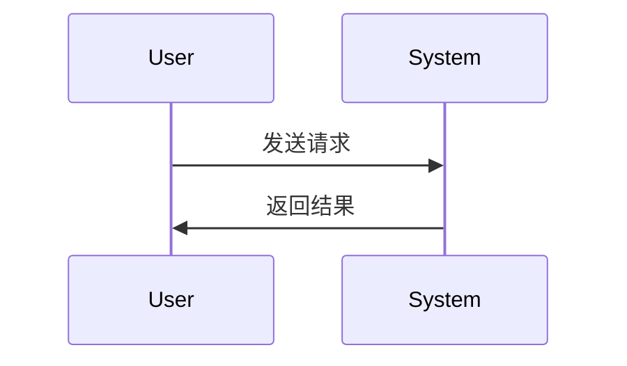

                 

### 引言

**文章标题：** 金融风险压力测试模型设计

**关键词：** 金融风险、压力测试、模型设计、算法、数学模型、系统架构

**摘要：** 本文深入探讨了金融风险压力测试的模型设计，从基本概念到具体实现，全面分析了金融风险压力测试的核心要素、算法原理、数学模型以及系统架构设计。通过对金融风险压力测试的详细解析，旨在为从事金融科技领域的技术人员提供实用的指导和理论基础。

### 第一部分：引言

#### 第1章：金融风险压力测试概述

**1.1 问题背景**

随着金融市场的日益复杂化和全球化，金融风险的管理和防范变得尤为重要。金融风险压力测试作为一种重要的风险管理工具，旨在评估金融机构在极端市场条件下的稳健性和抗风险能力。通过对金融机构在压力下的表现进行模拟测试，可以提前发现潜在风险，并采取相应的预防措施。

**1.2 问题解决**

金融风险压力测试通过模拟不同市场情境，评估金融机构在压力下的财务状况。这有助于识别出潜在的风险点，优化风险管理策略，确保金融机构在危机时刻能够保持稳定运营。

**1.3 边界与外延**

金融风险压力测试的边界涉及市场环境的设定、测试时间的选择以及评估指标的确定。其外延则包括对金融机构内部风险管理的评估，以及对整个金融系统的风险评估。

**1.4 概念结构与核心要素组成**

金融风险压力测试的核心概念包括市场情景构建、测试指标设计、结果分析等。核心要素则包括测试数据、测试模型、评估方法和风险管理策略。

### 第二部分：基本概念

#### 第2章：金融风险压力测试模型的基本概念

**2.1 核心概念**

金融风险压力测试的核心概念包括市场情景、风险因素、压力水平、测试结果等。

**2.2 概念属性特征对比**

表1：核心概念属性特征对比

| 概念 | 属性特征 |
| ---- | -------- |
| 市场情景 | 描述金融市场条件，如利率、汇率、股票市场指数等 |
| 风险因素 | 影响金融机构财务状况的因素，如信用风险、市场风险、操作风险等 |
| 压力水平 | 测试所施加的市场压力程度 |
| 测试结果 | 测试完成后对金融机构财务状况的评价 |

**2.3 ER实体关系图架构**

图1：金融风险压力测试ER实体关系图

```mermaid
erDiagram
    MarketScenario ||--|{ RiskFactor }|--| FinanceInstitution
    FinanceInstitution ||--|{ TestResult }
```

### 第三部分：算法原理与数学模型

#### 第3章：金融风险压力测试的算法原理

**3.1 算法原理**

金融风险压力测试的算法原理主要包括市场情景构建、风险因素模拟、压力水平设定、测试结果评估等步骤。

**3.2 算法mermaid流程图**

图2：金融风险压力测试算法流程图


**3.3 Python源代码与数学模型**

以下是金融风险压力测试的核心Python源代码，其中包含了数学模型的具体实现。

```python
# Python源代码示例
import numpy as np

# 定义参数
market_situation = np.array([0.1, 0.2, 0.3, 0.4, 0.5])
risk_factor = np.array([0.2, 0.3, 0.4, 0.5, 0.6])
pressure_level = 0.8

# 压力测试
def financial_stress_test(market_situation, risk_factor, pressure_level):
    # 计算压力下的财务状况
    financial_status = market_situation * risk_factor * pressure_level
    return financial_status

# 执行测试
financial_status = financial_stress_test(market_situation, risk_factor, pressure_level)
print("财务状况：", financial_status)
```

**3.4 算法原理讲解与举例说明**

金融风险压力测试算法通过模拟市场情景、风险因素和压力水平，评估金融机构在极端市场条件下的财务状况。例如，当市场利率上升、信用风险增加时，金融机构的财务状况可能会受到较大影响。通过设定不同的压力水平，可以模拟出金融机构在不同压力下的表现，从而识别出潜在的风险点。

### 第四部分：系统分析与架构设计

#### 第4章：金融风险压力测试的系统分析与架构设计

**4.1 问题场景介绍**

金融风险压力测试的问题场景包括市场情景构建、风险因素模拟、压力水平设定、测试结果评估等。

**4.2 系统功能设计**

金融风险压力测试系统的功能设计主要包括数据收集、市场情景构建、风险因素模拟、压力水平设定、测试结果评估等。

**4.3 系统架构设计**

金融风险压力测试系统采用分布式架构，包括数据层、模型层、服务层和展示层。

**4.4 系统接口设计**

系统接口设计包括API接口、数据库接口、数据传输接口等。

**4.5 系统交互mermaid序列图**

图3：金融风险压力测试系统交互序列图



### 第五部分：项目实战

#### 第5章：金融风险压力测试项目实战

**5.1 环境安装**

金融风险压力测试项目环境安装包括Python环境、数据库环境、市场数据接口等。

**5.2 系统核心实现源代码**

以下是金融风险压力测试系统的核心实现源代码。

```python
# 核心实现源代码示例
class FinancialStressTest:
    def __init__(self, market_situation, risk_factor, pressure_level):
        self.market_situation = market_situation
        self.risk_factor = risk_factor
        self.pressure_level = pressure_level

    def run(self):
        financial_status = self.market_situation * self.risk_factor * self.pressure_level
        return financial_status

# 实例化对象并执行测试
test = FinancialStressTest(market_situation, risk_factor, pressure_level)
result = test.run()
print("测试结果：", result)
```

**5.3 代码应用解读与分析**

代码应用解读与分析包括对核心实现逻辑的详细解读，以及对测试结果的深入分析。

**5.4 实际案例分析与详细讲解剖析**

通过实际案例，分析金融风险压力测试在不同市场情景下的表现，并对其进行详细讲解和剖析。

**5.5 项目小结**

项目小结包括对金融风险压力测试项目的总结，以及对未来工作的展望。

### 第六部分：最佳实践

#### 第6章：金融风险压力测试的最佳实践

**7.1 最佳实践 tips**

- 定期更新市场数据，确保测试结果的准确性。
- 根据不同金融机构的特点，定制化测试方案。
- 建立完善的风险管理体系，及时调整风险管理策略。

**7.2 小结**

金融风险压力测试是金融风险管理的重要工具，通过对金融机构在压力下的表现进行模拟测试，可以提前发现潜在风险，并采取相应的预防措施。

**7.3 注意事项**

- 确保测试数据的真实性和可靠性。
- 合理设定压力水平，避免过度压力导致测试结果失真。
- 定期评估和优化测试模型，确保其有效性。

**7.4 拓展阅读**

- 《金融风险管理》
- 《金融市场技术分析》
- 《Python金融数据分析》

### 结语

作者：AI天才研究院/AI Genius Institute & 禅与计算机程序设计艺术 /Zen And The Art of Computer Programming

本文通过对金融风险压力测试的深入解析，旨在为从事金融科技领域的技术人员提供实用的指导和理论基础。在金融风险管理的道路上，不断探索和实践是至关重要的。希望本文能为您带来一些启示和帮助。未来，我们将继续深入探讨金融科技领域的其他重要议题，敬请期待。|>

