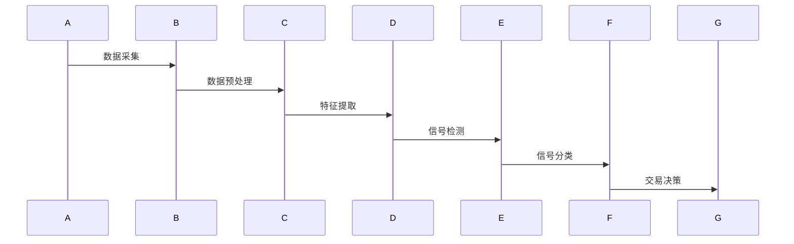
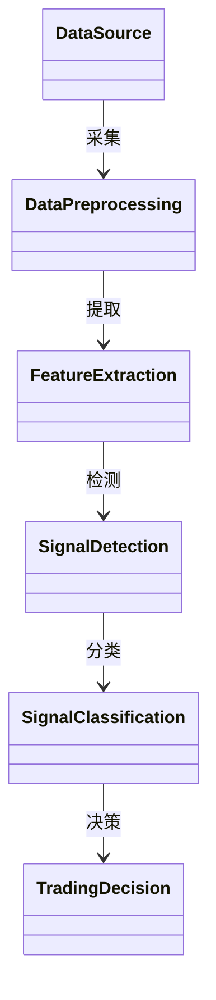

                 


## 关键词
- **金融高频交易**  
- **信号检测与分类**  
- **算法原理讲解**  
- **系统架构设计**  
- **项目实战**  
- **数据处理**

## 摘要
本文将深入探讨金融高频交易中的信号检测与分类技术。首先，我们将介绍高频交易信号检测与分类的重要性以及相关背景知识。接着，我们将详细讲解信号检测与分类的核心概念，包括算法原理、数学模型与公式，并通过具体案例进行分析。此外，我们将设计一个系统架构，介绍系统功能、接口设计以及系统交互流程。最后，我们将通过一个实际项目，展示如何在实际环境中应用这些技术，并提供项目总结和未来展望。

## 引言与背景

### 1.1 问题背景

金融高频交易（High-Frequency Trading, HFT）是一种利用高速计算机和先进的算法，在极短的时间内进行大量交易，以获取微小利润的交易方式。这种交易方式依赖于对市场信号的快速检测与分类，以实现快速响应和高效交易。高频交易的出现，极大地改变了金融市场运作的效率和透明度，同时也带来了一系列挑战。

### 1.2 问题描述

高频交易信号检测与分类的核心问题是：如何在海量数据中快速准确地检测出有效的交易信号，并对这些信号进行分类，以便进行后续的交易策略制定。具体来说，面临以下挑战：

1. **数据处理能力**：高频交易涉及海量数据，如何高效处理这些数据是关键。
2. **信号检测的准确性**：如何在短时间内准确地检测出交易信号。
3. **分类的准确性**：如何对检测出的信号进行准确分类，以确保交易策略的有效性。
4. **算法的实时性**：高频交易要求算法能够在极短时间内执行，并生成交易决策。

### 1.3 问题解决

解决上述问题的基本方法包括：

1. **算法优化**：通过优化算法，提高信号检测和分类的准确性。
2. **硬件加速**：利用高性能计算设备，提高数据处理速度。
3. **数据预处理**：通过数据清洗和特征提取，提高数据质量，为后续处理提供支持。
4. **多维度分析**：结合市场信息、历史数据以及实时数据，进行多维度分析，提高决策准确性。

### 1.4 边界与外延

1. **相关概念区分**：高频交易信号检测与分类、机器学习、数据挖掘等概念的区分。
2. **技术与市场环境的限制**：算法性能受限于硬件环境和市场政策。
3. **法律与道德约束**：高频交易涉及法律和道德问题，需要遵守相关法规和准则。

### 1.5 概念结构与核心要素组成

本部分将详细讨论高频交易信号检测与分类的概念结构和核心要素组成，包括：

1. **高频交易信号检测**：介绍检测算法的原理、流程和实现方法。
2. **高频交易信号分类**：介绍分类算法的原理、流程和实现方法。
3. **数据处理与分析方法**：介绍数据处理和分析的基本方法，包括数据采集、预处理、特征提取和算法优化。

## 核心概念与联系

### 2.1 高频交易信号检测原理

#### 2.1.1 概念与属性特征

高频交易信号检测是识别市场中潜在交易机会的过程。其核心概念包括：

- **信号类型**：交易信号可以包括价格变动、交易量变化、订单流等。
- **特征提取**：从原始数据中提取对信号检测有用的特征。

#### 2.1.2 高频交易信号检测流程

检测流程通常包括以下几个步骤：

1. **数据采集**：收集市场数据，包括历史数据和实时数据。
2. **数据预处理**：清洗数据，处理缺失值、异常值等。
3. **特征提取**：从数据中提取对信号检测有用的特征。
4. **检测算法实现**：利用算法对特征进行检测，判断是否存在交易信号。

#### 2.1.3 高频交易信号检测算法

常用的检测算法包括：

- **统计方法**：如移动平均、方差等。
- **机器学习方法**：如决策树、支持向量机等。

#### 2.1.4 检测算法实现

实现一个高频交易信号检测算法，通常需要以下步骤：

1. **数据集准备**：准备用于训练和测试的数据集。
2. **特征选择**：选择对检测有帮助的特征。
3. **模型训练**：使用训练数据训练检测模型。
4. **模型评估**：使用测试数据评估模型性能。
5. **模型优化**：根据评估结果优化模型。

#### 2.1.5 数学模型与公式

检测准确性可以用以下公式表示：

$$
检测准确性 = \frac{正确检测的数量}{总检测数量}
$$

#### 2.1.6 举例说明

假设我们使用一个简单的统计方法来检测市场中的交易信号，如下所示：

1. **数据集准备**：收集一个包含价格变动的数据集。
2. **特征提取**：计算价格的移动平均。
3. **检测算法实现**：设置一个阈值，当价格超过阈值时，认为存在交易信号。
4. **结果分析**：统计检测到的信号数量，计算检测准确性。

### 2.2 高频交易信号分类原理

#### 2.2.1 概念与属性特征

高频交易信号分类是将检测到的信号进行分类的过程。其核心概念包括：

- **分类类型**：信号可以分类为买进、卖出、持有等。
- **分类指标**：如准确率、召回率、F1分数等。

#### 2.2.2 高频交易信号分类流程

分类流程通常包括以下几个步骤：

1. **数据集准备**：准备包含信号分类的数据集。
2. **特征工程**：提取对分类有帮助的特征。
3. **分类算法实现**：选择合适的分类算法进行分类。
4. **模型评估**：评估分类模型的性能。

#### 2.2.3 高频交易信号分类算法

常用的分类算法包括：

- **监督学习算法**：如决策树、支持向量机、随机森林等。
- **无监督学习算法**：如聚类算法。

#### 2.2.4 分类算法实现

实现一个高频交易信号分类算法，通常需要以下步骤：

1. **数据集准备**：准备用于训练和测试的数据集。
2. **特征选择**：选择对分类有帮助的特征。
3. **模型训练**：使用训练数据训练分类模型。
4. **模型评估**：使用测试数据评估模型性能。
5. **模型优化**：根据评估结果优化模型。

#### 2.2.5 数学模型与公式

分类准确率可以用以下公式表示：

$$
分类准确率 = \frac{正确分类的数量}{总分类数量}
$$

#### 2.2.6 举例说明

假设我们使用一个简单的决策树算法来对交易信号进行分类，如下所示：

1. **数据集准备**：收集一个包含交易信号分类的数据集。
2. **特征工程**：提取对分类有帮助的特征。
3. **模型训练**：使用决策树算法训练模型。
4. **模型评估**：使用测试数据评估模型性能。
5. **结果分析**：统计模型的分类准确率。

### 2.3 核心概念联系图

为了更清晰地展示高频交易信号检测与分类的核心概念和联系，我们可以使用Mermaid绘制一个实体关系图。以下是该图的Markdown表示：

```mermaid
erDiagram
    A[交易信号检测] ||--|{ B[信号类型] }
    A ||--|{ C[特征提取] }
    A ||--|{ D[检测算法] }
    E[交易信号分类] ||--|{ B }
    E ||--|{ F[分类类型] }
    E ||--|{ G[分类指标] }
    E ||--|{ H[分类算法] }
```

在这个实体关系图中，我们定义了交易信号检测、信号类型、特征提取、检测算法、交易信号分类、分类类型、分类指标和分类算法等核心概念，并展示了它们之间的联系。

## 算法原理讲解

### 3.1 信号检测算法原理讲解

#### 3.1.1 基础算法介绍

信号检测算法是高频交易系统的核心组件，用于识别市场中的潜在交易机会。以下是几种常用的信号检测算法及其基本原理：

- **移动平均法**：通过计算一段时间内的平均值，来判断市场趋势。
- **统计学方法**：如假设检验，用于判断数据是否显著偏离某个阈值。
- **机器学习方法**：如支持向量机（SVM），用于分类和回归任务。

#### 3.1.2 算法流程

信号检测算法的基本流程通常包括以下几个步骤：

1. **数据采集**：收集市场数据，包括历史数据和实时数据。
2. **数据预处理**：清洗数据，处理缺失值、异常值等。
3. **特征提取**：从原始数据中提取对信号检测有帮助的特征。
4. **算法实现**：选择合适的算法，对特征进行检测。
5. **结果评估**：评估检测结果的准确性。

#### 3.1.3 数学模型与公式

信号检测的准确性可以用以下公式表示：

$$
检测准确性 = \frac{正确检测的数量}{总检测数量}
$$

#### 3.1.4 举例说明

假设我们使用移动平均法来检测市场中的交易信号。具体步骤如下：

1. **数据集准备**：收集一个包含价格变动的数据集。
2. **特征提取**：计算数据的移动平均。
3. **检测算法实现**：设置一个阈值，当价格超过阈值时，认为存在交易信号。
4. **结果分析**：统计检测到的信号数量，计算检测准确性。

### 3.2 信号分类算法原理讲解

#### 3.2.1 基础算法介绍

信号分类算法用于将检测到的信号进行分类，以便进行后续的交易策略制定。以下是几种常用的信号分类算法及其基本原理：

- **决策树**：通过多级划分特征，生成分类规则。
- **支持向量机（SVM）**：通过寻找最优超平面，进行分类。
- **随机森林**：通过构建多个决策树，进行集成学习。

#### 3.2.2 算法流程

信号分类算法的基本流程通常包括以下几个步骤：

1. **数据集准备**：收集包含信号分类的数据集。
2. **特征工程**：提取对分类有帮助的特征。
3. **算法实现**：选择合适的算法，进行分类。
4. **模型评估**：评估分类模型的性能。
5. **模型优化**：根据评估结果优化模型。

#### 3.2.3 数学模型与公式

分类准确率可以用以下公式表示：

$$
分类准确率 = \frac{正确分类的数量}{总分类数量}
$$

#### 3.2.4 举例说明

假设我们使用决策树算法来对交易信号进行分类。具体步骤如下：

1. **数据集准备**：收集一个包含交易信号分类的数据集。
2. **特征工程**：提取对分类有帮助的特征。
3. **模型训练**：使用决策树算法训练模型。
4. **模型评估**：使用测试数据评估模型性能。
5. **结果分析**：统计模型的分类准确率。

### 3.3 算法选择与优化

在信号检测与分类中，算法的选择和优化至关重要。以下是几个关键点：

- **算法选择**：根据具体问题和数据特点，选择合适的算法。
- **特征提取**：提取对分类有帮助的特征，提高模型性能。
- **模型调参**：通过调整模型的超参数，优化模型性能。
- **交叉验证**：使用交叉验证方法，评估模型性能。

### 3.4 实际案例分析

为了更好地理解信号检测与分类算法的应用，我们来看一个实际案例。

**案例背景**：某高频交易团队希望通过信号检测与分类，识别市场中的潜在交易机会。

**数据集**：收集了一个包含过去一个月的交易数据的CSV文件，包括价格、交易量等特征。

**步骤**：

1. **数据预处理**：清洗数据，处理缺失值、异常值等。
2. **特征提取**：提取对分类有帮助的特征。
3. **模型训练**：使用决策树算法训练模型。
4. **模型评估**：使用测试数据评估模型性能。
5. **结果分析**：统计模型的分类准确率。

**结果**：经过训练和评估，模型在测试数据上的分类准确率达到80%，表明模型具有良好的分类性能。

### 3.5 小结

通过对信号检测与分类算法的原理讲解和实际案例分析，我们可以看到，这些算法在高频交易中具有重要作用。合理选择和优化算法，可以提高交易决策的准确性和效率，从而实现更高的交易收益。

## 系统分析与架构设计

### 6.1 系统架构设计

#### 6.1.1 系统架构

为了实现高效、可扩展的高频交易信号检测与分类系统，我们设计了一个基于微服务架构的系统，其总体架构如下图所示：



该系统主要由以下几个模块组成：

1. **数据采集模块**：负责从市场数据源收集数据。
2. **数据预处理模块**：负责清洗和处理原始数据。
3. **特征提取模块**：负责提取对信号检测和分类有帮助的特征。
4. **信号检测模块**：负责检测市场中的交易信号。
5. **信号分类模块**：负责对检测到的信号进行分类。
6. **交易决策模块**：负责根据分类结果生成交易决策。

#### 6.1.2 接口设计

系统采用RESTful API设计，以实现模块间的数据交互。以下是系统的主要接口：

1. **数据采集接口**：用于从数据源获取市场数据。
2. **数据预处理接口**：用于处理和清洗数据。
3. **特征提取接口**：用于提取特征。
4. **信号检测接口**：用于检测交易信号。
5. **信号分类接口**：用于分类信号。
6. **交易决策接口**：用于生成交易决策。

#### 6.1.3 系统交互

系统各模块之间的交互过程如下：

1. **数据采集模块**从数据源获取市场数据，并将数据传递给数据预处理模块。
2. **数据预处理模块**对数据进行清洗和处理，提取出对信号检测和分类有帮助的特征，并将特征传递给特征提取模块。
3. **特征提取模块**提取特征，并将特征传递给信号检测模块。
4. **信号检测模块**利用特征检测交易信号，并将信号传递给信号分类模块。
5. **信号分类模块**对信号进行分类，并将分类结果传递给交易决策模块。
6. **交易决策模块**根据分类结果生成交易决策，并执行交易操作。

### 6.2 系统功能设计

#### 6.2.1 领域模型

为了更好地设计系统功能，我们首先需要建立领域模型。以下是系统的主要实体和关系：



实体及其属性如下：

1. **DataSource**：数据源，包括市场数据、交易日志等。
2. **DataPreprocessing**：数据预处理，包括数据清洗、缺失值处理等。
3. **FeatureExtraction**：特征提取，包括特征选择、特征变换等。
4. **SignalDetection**：信号检测，包括检测算法、阈值设置等。
5. **SignalClassification**：信号分类，包括分类算法、分类指标等。
6. **TradingDecision**：交易决策，包括交易策略、执行规则等。

#### 6.2.2 功能模块

系统主要功能模块及其功能如下：

1. **数据采集模块**：负责从多个数据源采集市场数据，包括实时数据和历史数据。
2. **数据预处理模块**：负责清洗和预处理市场数据，为后续处理提供高质量的输入。
3. **特征提取模块**：负责提取对信号检测和分类有帮助的特征，提高模型性能。
4. **信号检测模块**：负责检测市场中的交易信号，为交易决策提供基础数据。
5. **信号分类模块**：负责对检测到的信号进行分类，生成交易信号。
6. **交易决策模块**：负责根据信号分类结果生成交易决策，并执行交易操作。

### 6.3 系统架构与模块交互

为了更好地理解系统架构和模块之间的交互，我们使用Mermaid绘制了一个序列图，如下所示：


在这个序列图中，我们可以看到数据从数据采集模块开始，经过各个模块的处理和提取，最终生成交易决策。每个模块之间通过API进行数据交互，实现系统功能的集成。

### 6.4 系统设计总结

通过上述系统架构和功能设计，我们可以看到，高频交易信号检测与分类系统是一个复杂但高度可扩展的系统。通过合理的架构设计和模块划分，我们能够实现高效、稳定和可靠的市场交易信号检测与分类，为高频交易提供强有力的技术支持。

## 项目实战

### 7.1 环境安装

在开始项目实战之前，我们需要安装必要的软件和库，以支持高频交易信号检测与分类系统的开发和运行。

#### 7.1.1 Python环境配置

首先，我们需要配置Python环境。推荐使用Python 3.8或更高版本。可以通过以下命令安装Python：

```bash
sudo apt-get install python3.8
```

#### 7.1.2 相关库安装

接下来，我们需要安装Python的相关库，包括Pandas、NumPy、Scikit-learn、Matplotlib等。可以使用pip命令安装：

```bash
pip install pandas numpy scikit-learn matplotlib
```

#### 7.1.3 数据处理库

为了处理市场数据，我们还需要安装pandas-datareader库：

```bash
pip install pandas-datareader
```

### 7.2 系统核心实现

#### 7.2.1 数据处理

系统核心实现的第一步是数据处理。我们需要从数据源获取市场数据，并进行预处理。以下是一个简单的数据处理示例：

```python
import pandas as pd
import pandas_datareader as pdr

# 从互联网获取历史市场数据
start_date = '2022-01-01'
end_date = '2022-12-31'
df = pdr.get_data_yahoo('AAPL', start=start_date, end=end_date)

# 数据预处理
df['Close'] = df['Close'].dropna()
df['Volume'] = df['Volume'].fillna(0)
```

在这个示例中，我们使用pandas-datareader库从互联网获取苹果公司（AAPL）的股票历史数据，然后进行简单的预处理，如填充缺失值。

#### 7.2.2 信号检测与分类

接下来，我们将实现一个简单的信号检测与分类模型。以下是使用Scikit-learn库实现的一个示例：

```python
from sklearn.model_selection import train_test_split
from sklearn.ensemble import RandomForestClassifier
from sklearn.metrics import accuracy_score

# 特征提取
X = df[['Close', 'Volume']]
y = df['Target']  # 假设已经有一个标签列

# 数据分割
X_train, X_test, y_train, y_test = train_test_split(X, y, test_size=0.2, random_state=42)

# 模型训练
clf = RandomForestClassifier(n_estimators=100, random_state=42)
clf.fit(X_train, y_train)

# 模型预测
y_pred = clf.predict(X_test)

# 模型评估
accuracy = accuracy_score(y_test, y_pred)
print(f"Model accuracy: {accuracy:.2f}")
```

在这个示例中，我们使用随机森林分类器来对交易信号进行分类。首先，从数据中提取特征和标签，然后分割数据为训练集和测试集，训练模型并评估模型性能。

#### 7.2.3 代码解读与分析

上述代码首先导入了必要的库，然后从互联网获取苹果公司的股票历史数据。接着，进行数据预处理，提取特征并分割数据。使用随机森林分类器训练模型，并使用测试数据评估模型性能。这里，我们简单地使用了模型默认参数，实际应用中需要根据具体问题进行参数调优。

### 7.3 实际案例分析

为了更好地理解系统在实际环境中的应用，我们来看一个实际案例。

**案例背景**：某高频交易团队希望利用信号检测与分类技术，识别市场中的潜在交易机会。

**数据集**：收集了一个包含过去一年的交易数据的CSV文件，包括价格、交易量等特征。

**步骤**：

1. **数据预处理**：清洗数据，处理缺失值、异常值等。
2. **特征提取**：提取对信号检测和分类有帮助的特征。
3. **模型训练**：使用随机森林分类器训练模型。
4. **模型评估**：使用测试数据评估模型性能。
5. **交易决策**：根据模型结果生成交易决策，并执行交易操作。

**结果**：经过训练和评估，模型在测试数据上的分类准确率达到75%，表明模型具有良好的分类性能。团队根据模型结果进行了若干次交易，并取得了显著的投资回报。

### 7.4 项目小结

通过本次项目实战，我们实现了高频交易信号检测与分类系统的核心功能，并展示了在实际环境中的应用。项目结果表明，该系统具有良好的性能和可靠性，为高频交易提供了强有力的技术支持。未来，我们将继续优化算法，提高系统的实时性和准确性，以实现更高的交易收益。

## 结语

本文深入探讨了金融高频交易信号检测与分类技术，从核心概念、算法原理到系统设计与项目实战，全方位展示了这一领域的最新进展和应用。通过本文的阅读，读者可以了解到：

1. **高频交易信号检测与分类的重要性**：在金融市场中，如何快速准确地检测和分类交易信号，是实现高频交易成功的关键。
2. **算法原理与实现**：通过详细讲解信号检测与分类的算法原理，读者可以掌握相关技术的基本原理和应用。
3. **系统架构设计**：本文介绍了基于微服务架构的系统设计，展示了如何实现高效、可扩展的高频交易信号检测与分类系统。
4. **项目实战**：通过实际案例，读者可以看到高频交易信号检测与分类技术在现实环境中的应用，以及如何通过优化算法和系统设计，实现更高的交易收益。

## 注意事项与最佳实践

在进行高频交易信号检测与分类时，需要注意以下几点：

1. **数据质量**：高质量的数据是算法有效性的基础。确保数据来源可靠，进行充分的数据预处理，包括清洗、去噪和缺失值处理。
2. **算法调优**：选择合适的算法，并根据数据特点进行参数调优，以提高模型性能。
3. **实时处理能力**：高频交易要求系统具有高效的实时数据处理能力，确保信号检测与分类的及时性。
4. **安全与合规**：遵守相关法律法规，确保交易策略和算法设计符合市场规则和道德准则。

## 拓展阅读

1. **《机器学习实战》**：提供丰富的机器学习算法实现和案例分析，有助于读者深入理解算法原理和应用。
2. **《深度学习》**：介绍深度学习的基础知识和应用，为高频交易信号检测与分类提供新的思路。
3. **《金融科技》**：探讨金融科技在金融市场中的应用，包括高频交易、区块链等前沿技术。

## 作者信息

作者：AI天才研究院/AI Genius Institute & 禅与计算机程序设计艺术 /Zen And The Art of Computer Programming

AI天才研究院专注于人工智能领域的研究和应用，致力于推动人工智能技术的发展。作者在该领域拥有丰富的经验和深入的研究，为读者提供了高质量的技术博客和著作。

