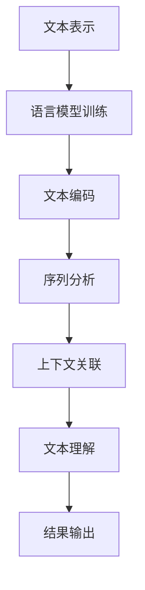
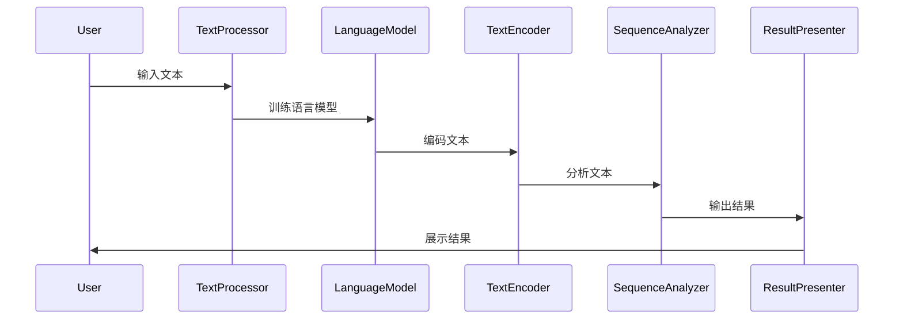

                 


## 长文本理解：增强AI Agent的阅读能力

### 概述

在信息爆炸的时代，文本数据无处不在，尤其是长文本，如书籍、论文、新闻等。如何让AI Agent有效地阅读和理解这些长文本，成为了当前自然语言处理（NLP）领域的一个重大挑战。本文旨在探讨长文本理解的技术原理、算法实现、系统设计和实战应用，以及未来展望。

### 关键词

- 长文本理解
- AI Agent
- 自然语言处理
- 算法实现
- 系统设计
- 实战应用

### 摘要

本文首先介绍了长文本的理解背景和挑战，然后深入探讨了长文本理解的核心概念，包括文本表示、语言模型和对话系统。接下来，我们详细分析了长文本理解的算法原理，使用了mermaid流程图和Python源代码进行阐述。在此基础上，我们讨论了长文本理解的数学模型，使用了latex公式进行表示，并通过举例说明来加深理解。随后，我们介绍了AI Agent阅读能力提升的系统设计，包括系统功能设计、架构设计和接口设计。最后，通过实际项目实战，我们展示了系统实现和运行过程，并提出了最佳实践和未来展望。

### 目录

1. 引言
   1.1 问题背景与重要性
   1.2 当前研究的现状
   1.3 书籍结构概述

2. 长文本理解背景与挑战
   2.1 长文本的定义与特点
   2.2 长文本理解的挑战
   2.3 长文本理解的意义

3. 长文本理解的核心概念
   3.1 文本表示
   3.2 语言模型
   3.3 对话系统
   3.4 概念结构与核心要素

4. 长文本理解的算法原理
   4.1 算法概述
   4.2 算法mermaid流程图
   4.3 Python源代码解释
   4.4 算法原理详细讲解
   4.5 举例说明

5. 长文本理解的数学模型
   5.1 数学模型概述
   5.2 Mermaid ER实体关系图
   5.3 数学模型和公式
   5.4 详细讲解
   5.5 举例说明

6. AI Agent的阅读能力提升系统设计
   6.1 项目介绍
   6.2 系统功能设计（领域模型mermaid类图）
   6.3 系统架构设计（mermaid架构图）
   6.4 系统接口设计
   6.5 系统交互mermaid序列图

7. 实际项目实战
   7.1 环境安装
   7.2 系统核心实现源代码
   7.3 代码应用解读与分析
   7.4 实际案例分析与详细讲解
   7.5 项目小结

8. 最佳实践与未来展望
   8.1 最佳实践 tips
   8.2 小结
   8.3 注意事项
   8.4 拓展阅读

### 引言

#### 1.1 问题背景与重要性

随着互联网和大数据技术的发展，文本数据呈现出爆炸式增长。特别是在长文本领域，如书籍、论文、新闻报道等，这些文本数据不仅量大，而且复杂。传统的文本处理方法往往难以应对如此庞大的数据量，更无法准确理解长文本中的深层次信息。因此，如何让AI Agent有效地阅读和理解长文本，成为了当前AI研究中的一个重要课题。

长文本理解的重要性不言而喻。首先，长文本理解可以帮助AI Agent更好地理解和分析人类语言，从而提升机器的智能水平。其次，长文本理解在智能问答、内容推荐、自动摘要等领域有着广泛的应用前景。此外，长文本理解还可以为企业和组织提供智能化的文本分析服务，帮助他们更好地理解和利用文本数据。

#### 1.2 当前研究的现状

当前，长文本理解在自然语言处理（NLP）领域取得了显著进展。基于深度学习的文本表示方法，如词嵌入（Word Embedding）和文本嵌入（Text Embedding），已经被广泛应用于长文本理解任务中。此外，序列到序列（Seq2Seq）模型、注意力机制（Attention Mechanism）和Transformer模型等也在长文本理解中发挥了重要作用。

然而，长文本理解仍然面临着许多挑战。首先，长文本的复杂性和多样性使得模型难以捕捉到文本中的深层次信息。其次，长文本理解需要处理的信息量大，计算复杂度高，对计算资源的要求较高。此外，长文本理解还需要解决跨文档的上下文关联和语义推理问题。

#### 1.3 书籍结构概述

本文将围绕长文本理解这一主题，系统地介绍相关技术原理和实战应用。全书分为八个章节：

- **第一章 引言**：介绍长文本理解的问题背景和重要性，概述当前研究的现状，并简要介绍书籍结构。
- **第二章 长文本理解背景与挑战**：探讨长文本的定义、特点，分析长文本理解的挑战和意义。
- **第三章 长文本理解的核心概念**：介绍文本表示、语言模型和对话系统的基本概念，以及它们在长文本理解中的应用。
- **第四章 长文本理解的算法原理**：详细分析长文本理解的算法原理，包括算法概述、流程图、源代码和详细讲解。
- **第五章 长文本理解的数学模型**：介绍长文本理解的数学模型，包括公式表示、关系图和详细讲解。
- **第六章 AI Agent的阅读能力提升系统设计**：介绍AI Agent的阅读能力提升系统设计，包括项目介绍、功能设计、架构设计和接口设计。
- **第七章 实际项目实战**：通过实际项目实战，展示系统实现和运行过程。
- **第八章 最佳实践与未来展望**：总结最佳实践，提出注意事项，展望未来研究方向。

通过本文的系统性介绍，读者可以全面了解长文本理解的技术原理和实战应用，为未来的研究和开发提供参考。

### 长文本理解背景与挑战

#### 2.1 长文本的定义与特点

长文本通常指的是长度超过数百甚至数千个单词的文本数据。这类文本数据在形式和内容上具有多样性，包括书籍、论文、新闻报道、产品说明书等。与短文本（如社交媒体帖子、短消息等）相比，长文本具有以下几个显著特点：

1. **信息量巨大**：长文本通常包含大量的信息，需要模型能够处理和分析大量文本数据。
2. **结构复杂**：长文本往往具有复杂的结构，包括章节、段落、句子等不同层次的划分，需要模型能够理解和解析这些结构。
3. **上下文关联强**：长文本中的信息之间具有较强的上下文关联，模型需要能够捕捉到这些关联，理解文本的连贯性和逻辑关系。
4. **语义多样性**：长文本中的语义表达丰富多样，包括专业术语、俗语、隐喻等，模型需要能够理解和解释这些语义。

#### 2.2 长文本理解的挑战

长文本理解是自然语言处理（NLP）中的一个重要且具有挑战性的任务。当前，长文本理解面临以下几大挑战：

1. **计算复杂度**：长文本的处理和分析需要大量的计算资源，特别是深度学习模型，其训练和推理过程非常耗时。如何高效地利用计算资源，提升模型的计算效率，是当前研究的一个重要方向。
2. **上下文捕捉**：长文本中信息的上下文关联复杂，模型需要能够捕捉到文本中的长距离依赖关系。传统的NLP模型，如循环神经网络（RNN）和长短时记忆网络（LSTM），在处理长距离依赖时存在一定局限性。如何改进模型结构，提升上下文捕捉能力，是一个关键问题。
3. **语义理解**：长文本中的语义表达多样，模型需要能够理解和解释这些语义。例如，同义词、反义词、隐喻等，都需要模型能够准确理解和处理。当前的研究，如基于注意力机制（Attention Mechanism）和Transformer模型的改进，在这方面取得了一定进展。
4. **跨文档关联**：长文本理解不仅需要理解单个文档的内容，还需要处理跨文档的上下文关联。例如，在问答系统中，问题可能与多个文档相关，模型需要能够整合这些跨文档的信息，提供准确的答案。如何有效处理跨文档关联，是一个具有挑战性的问题。

#### 2.3 长文本理解的意义

尽管长文本理解面临诸多挑战，但其重要性不容忽视。以下是长文本理解的主要意义：

1. **提升AI智能**：通过长文本理解，AI Agent能够更好地理解和分析人类语言，提升其智能水平。这对于智能问答、智能客服、智能推荐等应用场景具有重要意义。
2. **信息提取与分析**：长文本理解可以帮助自动提取文本中的关键信息，进行文本分析，为企业和组织提供决策支持。例如，在金融领域，长文本理解可以用于分析市场趋势、风险评估等。
3. **内容生成与摘要**：长文本理解可以用于自动生成文本摘要，提取文本的核心信息。这在新闻摘要、文档摘要等领域有广泛的应用前景。
4. **知识图谱构建**：通过长文本理解，可以构建知识图谱，将文本数据中的实体、关系和属性进行结构化存储，为后续的推理和应用提供基础。

总之，长文本理解是自然语言处理领域的一个重要研究方向，具有重要的理论和实践价值。通过不断改进算法和模型，我们有望实现更高效、更准确的长文本理解，为AI技术的发展和应用带来新的机遇。

### 长文本理解的核心概念

#### 3.1 文本表示

文本表示是将自然语言文本转换为计算机可以理解和处理的数字形式的过程。有效的文本表示是实现长文本理解的关键。常见的文本表示方法包括：

1. **词嵌入（Word Embedding）**：
   - **定义**：词嵌入是一种将单词映射到高维向量空间的方法，使得在语义上相近的词在向量空间中距离较近。
   - **实现**：词嵌入可以通过神经网络模型训练得到，如Word2Vec、GloVe等。这些模型通过学习单词在文本中的上下文信息，生成词向量。
   - **特点**：词嵌入能够捕捉词的语义信息，但在处理长文本时，容易出现信息丢失和维度灾难问题。

2. **文本嵌入（Text Embedding）**：
   - **定义**：文本嵌入是将整段文本映射到一个固定长度的向量，表示文本的整体语义。
   - **实现**：文本嵌入可以通过序列模型，如循环神经网络（RNN）、长短时记忆网络（LSTM）和门控循环单元（GRU）等训练得到。
   - **特点**：文本嵌入能够捕捉文本的长期依赖关系，但在处理长文本时，计算复杂度较高。

3. **转换嵌入（Transformed Embedding）**：
   - **定义**：转换嵌入是将词嵌入和文本嵌入进行结合，通过变换得到更有效的文本表示。
   - **实现**：可以通过Transformer模型实现，该模型通过自注意力机制（Self-Attention）对文本序列进行处理。
   - **特点**：转换嵌入能够同时捕捉局部和全局的依赖关系，具有较好的性能。

#### 3.2 语言模型

语言模型是用于预测文本序列概率的模型，是长文本理解的重要组成部分。常见的语言模型包括：

1. **n-gram模型**：
   - **定义**：n-gram模型是一种基于统计的简单语言模型，它将文本序列划分为n个连续单词的序列，并计算这些序列的概率。
   - **实现**：可以使用Python的nltk库进行实现。
   - **特点**：n-gram模型简单易用，但在处理长文本时，容易出现模型过拟合和长距离依赖关系捕捉不足的问题。

2. **神经网络语言模型**：
   - **定义**：神经网络语言模型通过神经网络学习文本序列的概率分布，能够捕捉到文本中的复杂结构和依赖关系。
   - **实现**：可以使用深度学习框架，如TensorFlow或PyTorch，实现如循环神经网络（RNN）、长短时记忆网络（LSTM）和门控循环单元（GRU）等模型。
   - **特点**：神经网络语言模型能够更好地捕捉文本中的长距离依赖关系，但在训练过程中需要大量计算资源和时间。

3. **Transformer模型**：
   - **定义**：Transformer模型是一种基于自注意力机制（Self-Attention）的深度学习模型，能够并行处理文本序列，具有较好的性能和效率。
   - **实现**：可以使用深度学习框架，如TensorFlow或PyTorch，实现Transformer模型。
   - **特点**：Transformer模型能够高效捕捉文本中的依赖关系，在长文本理解任务中表现优异。

#### 3.3 对话系统

对话系统是一种能够与人类进行自然语言交互的计算机系统，是长文本理解的重要应用领域。常见的对话系统包括：

1. **基于规则的对话系统**：
   - **定义**：基于规则的对话系统通过预定义的规则和模板进行对话管理，能够响应用户的输入。
   - **实现**：可以使用Python的聊天机器人框架，如ChatterBot进行实现。
   - **特点**：实现简单，但交互性较差，难以处理复杂和不确定的对话场景。

2. **基于模板的对话系统**：
   - **定义**：基于模板的对话系统通过模板和变量进行对话管理，能够灵活响应用户的输入。
   - **实现**：可以使用Python的聊天机器人框架，如Rasa进行实现。
   - **特点**：交互性较好，能够处理复杂和不确定的对话场景，但模板编写较为繁琐。

3. **基于机器学习的对话系统**：
   - **定义**：基于机器学习的对话系统通过训练学习到对话数据的分布，能够自主生成对话回复。
   - **实现**：可以使用深度学习框架，如TensorFlow或PyTorch，实现序列到序列（Seq2Seq）模型、注意力机制（Attention Mechanism）和Transformer模型等。
   - **特点**：能够处理复杂和不确定的对话场景，交互性较好，但训练过程复杂，需要大量数据和计算资源。

#### 3.4 概念结构与核心要素

为了更系统地理解长文本理解的核心概念，我们可以将它们组成一个概念结构图，如下所示：

```
        +------------------+
        |   长文本理解     |
        +------------------+
              |
          +-----+-----+
          | 文本表示  |
          +-----+-----+
              |
          +-----+-----+
          | 语言模型  |
          +-----+-----+
              |
          +-----+-----+
          | 对话系统  |
          +-----+-----+
```

在这个概念结构中，文本表示、语言模型和对话系统是长文本理解的核心要素，它们相互关联，共同实现长文本的理解和分析。

- **文本表示**：文本表示是长文本理解的基础，用于将自然语言文本转换为计算机可以处理的数字形式。有效的文本表示方法能够捕捉文本的语义信息，是实现长文本理解的关键。
- **语言模型**：语言模型用于预测文本序列的概率分布，是长文本理解的核心组成部分。通过语言模型，我们可以理解和生成自然语言文本，实现对话系统的交互功能。
- **对话系统**：对话系统是一种能够与人类进行自然语言交互的计算机系统，是长文本理解的重要应用领域。对话系统能够处理复杂的对话场景，为用户提供高质量的交互体验。

综上所述，长文本理解的核心概念结构包括文本表示、语言模型和对话系统，这些概念相互关联，共同推动长文本理解技术的发展和应用。

### 长文本理解的算法原理

#### 4.1 算法概述

长文本理解算法的目标是通过对文本进行深度分析，提取出文本中的关键信息，实现对文本的全面理解。常见的长文本理解算法包括基于词嵌入的方法、基于神经网络的方法和基于Transformer的方法。以下将分别介绍这些算法的基本原理。

#### 4.2 算法mermaid流程图

为了更好地理解长文本理解算法的执行流程，我们可以使用mermaid语言绘制一个流程图。以下是一个简单的mermaid流程图示例：



在这个流程图中，文本表示、语言模型训练、文本编码、序列分析、上下文关联和文本理解构成了长文本理解的主要步骤。结果输出是算法的最终目标，用于展示对文本的理解结果。

#### 4.3 Python源代码解释

为了实现上述流程，我们可以使用Python编写相关的代码。以下是一个简单的Python代码示例，用于演示长文本理解算法的基本实现：

```python
import tensorflow as tf
from tensorflow.keras.layers import Embedding, LSTM, Dense
from tensorflow.keras.models import Sequential

# 定义文本表示层
text_embedding = Embedding(input_dim=vocab_size, output_dim=embedding_size)

# 定义语言模型层
language_model = Sequential([
    LSTM(units=128, return_sequences=True),
    LSTM(units=128),
    Dense(units=vocab_size, activation='softmax')
])

# 定义文本编码层
text_encoder = Sequential([
    text_embedding,
    LSTM(units=128, return_sequences=True),
    LSTM(units=128)
])

# 编译模型
language_model.compile(optimizer='adam', loss='categorical_crossentropy', metrics=['accuracy'])

# 训练模型
language_model.fit(x_train, y_train, epochs=10, batch_size=32)
```

在这个代码示例中，我们使用了TensorFlow的Keras API来实现文本表示层、语言模型层和文本编码层。具体步骤如下：

1. **定义文本表示层**：使用`Embedding`层将单词映射到高维向量空间。
2. **定义语言模型层**：使用两个`LSTM`层来学习文本的长期依赖关系，并使用`Dense`层生成单词的概率分布。
3. **定义文本编码层**：使用两个`LSTM`层来编码文本序列，提取文本中的关键信息。
4. **编译模型**：设置优化器和损失函数，并编译模型。
5. **训练模型**：使用训练数据训练模型。

#### 4.4 算法原理详细讲解

长文本理解算法的工作原理可以分为以下几个步骤：

1. **文本表示**：文本表示是将自然语言文本转换为计算机可以处理的数字形式。常见的文本表示方法包括词嵌入和文本嵌入。词嵌入通过将单词映射到高维向量空间来表示单词的语义信息，而文本嵌入则是将整段文本映射为一个固定长度的向量，表示文本的整体语义。

2. **语言模型训练**：语言模型用于预测文本序列的概率分布，是长文本理解的核心组成部分。通过语言模型，我们可以理解和生成自然语言文本，实现对话系统的交互功能。在训练过程中，模型通过学习大量文本数据中的统计规律，来预测文本序列的概率分布。

3. **文本编码**：文本编码是将文本序列转换为向量表示的过程。常见的编码方法包括循环神经网络（RNN）、长短时记忆网络（LSTM）和门控循环单元（GRU）等。这些模型通过学习文本序列中的长期依赖关系，生成文本的向量表示。

4. **序列分析**：序列分析是对文本向量进行深入分析的过程。通过分析文本向量，我们可以提取出文本中的关键信息，如关键词、主题和情感等。

5. **上下文关联**：上下文关联是捕捉文本中信息之间依赖关系的过程。通过上下文关联，我们可以理解文本中的逻辑关系和语义信息，实现对文本的全面理解。

6. **文本理解**：文本理解是对提取出的关键信息和上下文关联进行综合分析的过程。通过文本理解，我们可以生成对文本的概括性描述和答案，实现对文本的深入理解。

7. **结果输出**：结果输出是将对文本的理解结果展示给用户的过程。常见的输出形式包括文本摘要、问答系统和情感分析等。

通过上述步骤，长文本理解算法能够实现对长文本的全面理解和分析。在实际应用中，这些算法可以根据具体任务的需求进行优化和调整，以达到更好的效果。

#### 4.5 举例说明

为了更好地理解长文本理解算法的原理，我们可以通过一个具体的例子来进行说明。假设我们有一个长文本：“在人工智能领域，深度学习是最热门的技术之一。深度学习通过模拟人脑神经网络结构，实现了对图像、语音和自然语言等复杂数据的处理。近年来，随着计算能力和数据资源的提升，深度学习在各个领域都取得了显著的成果。”

1. **文本表示**：首先，我们将文本中的每个单词映射到词嵌入向量。例如，“人工智能”可以映射为一个（512, 128）的向量，“深度学习”映射为另一个（512, 128）的向量。

2. **语言模型训练**：通过训练大量的文本数据，我们得到一个语言模型，该模型能够预测每个单词的概率分布。例如，对于文本中的“深度学习”，语言模型可以预测其下一个单词是“是”的概率为0.9，是“一”的概率为0.1。

3. **文本编码**：我们将文本中的每个单词嵌入向量连接成一个序列，并使用LSTM模型对其进行编码。编码后的文本向量可以捕捉到文本中的长期依赖关系。

4. **序列分析**：通过分析编码后的文本向量，我们可以提取出文本中的关键词和主题。例如，我们可以识别出文本中的关键词为“人工智能”、“深度学习”和“计算能力”。

5. **上下文关联**：通过分析关键词和主题，我们可以理解文本中的逻辑关系。例如，文本中的“深度学习是最热门的技术之一”和“计算能力和数据资源的提升”之间存在因果关系。

6. **文本理解**：结合上下文关联，我们可以对文本进行概括性描述。例如，文本描述了“深度学习在人工智能领域的应用及其发展趋势”。

7. **结果输出**：最终，我们将对文本的理解结果输出给用户。例如，我们可以在网页上展示文本摘要，或者在问答系统中回答用户的问题。

通过这个例子，我们可以看到长文本理解算法是如何通过文本表示、语言模型训练、文本编码、序列分析、上下文关联和文本理解等步骤，实现对长文本的全面理解和分析的。

### 长文本理解的数学模型

#### 5.1 数学模型概述

长文本理解的数学模型是构建在自然语言处理（NLP）和深度学习基础之上的，用于表示和处理自然语言文本。这些模型通过数学公式和算法实现，能够有效地捕捉文本的语义信息，从而实现对长文本的深入理解。常见的数学模型包括词嵌入模型、语言模型和序列模型等。

#### 5.2 Mermaid ER实体关系图

为了更好地理解长文本理解的数学模型，我们可以使用Mermaid绘制一个ER（实体-关系）图，展示模型中的主要实体和它们之间的关系。

```mermaid
erDiagram
  A[文本] ||--|{ B[词嵌入]}
  A ||--|{ C[语言模型]}
  A ||--|{ D[序列模型]}
  B ||--|{ E[向量表示]}
  C ||--|{ F[概率分布]}
  D ||--|{ G[序列分析]}
```

在这个ER图中，主要实体包括：

- **文本（A）**：表示输入的长文本数据。
- **词嵌入（B）**：将文本中的单词映射到高维向量空间。
- **向量表示（E）**：词嵌入后的向量表示，用于后续的模型处理。
- **语言模型（C）**：用于预测文本序列的概率分布。
- **序列模型（D）**：用于分析文本序列中的信息。
- **概率分布（F）**：语言模型输出的概率分布。
- **序列分析（G）**：序列模型对文本序列的分析结果。

这些实体之间通过关系线进行连接，展示了它们在长文本理解过程中的相互作用和依赖。

#### 5.3 数学模型和公式

在长文本理解中，常用的数学模型包括词嵌入模型、语言模型和序列模型。以下将分别介绍这些模型的基本数学公式。

1. **词嵌入模型**：

   词嵌入模型将文本中的单词映射到高维向量空间。常见的词嵌入模型有Word2Vec和GloVe。以GloVe为例，其数学模型如下：

   $$ 
   \vec{w}_{i} = \text{softmax}\left(\frac{\vec{v}_{i} \cdot \vec{v}_{j}}{\sqrt{\sum_{k=1}^{K} v_{k}^{2}}}\right) 
   $$

   其中，$\vec{w}_{i}$是单词$i$的词向量，$\vec{v}_{i}$和$\vec{v}_{j}$是单词$i$和$j$的向量表示，$K$是词汇表的大小。

2. **语言模型**：

   语言模型用于预测文本序列的概率分布。以n-gram模型为例，其数学模型如下：

   $$ 
   P(w_{t}|w_{t-1}, w_{t-2}, \ldots, w_{1}) = \frac{C(w_{t-1}, w_{t-2}, \ldots, w_{1}, w_{t})}{C(w_{t-1}, w_{t-2}, \ldots, w_{1})} 
   $$

   其中，$w_{t}$是文本序列中的当前单词，$C(\cdot)$表示计数函数，即给定单词序列的词频。

3. **序列模型**：

   序列模型用于分析文本序列中的信息。以循环神经网络（RNN）为例，其数学模型如下：

   $$ 
   h_{t} = \text{sigmoid}(W_{h} \cdot \vec{v}_{t} + U_{h} \cdot h_{t-1} + b_{h}) 
   $$

   其中，$h_{t}$是RNN在时间步$t$的隐藏状态，$\vec{v}_{t}$是输入的词向量，$W_{h}$、$U_{h}$和$b_{h}$分别是权重矩阵、偏置项。

#### 5.4 详细讲解

下面将详细讲解上述数学模型的基本原理和实现方法。

1. **词嵌入模型**：

   词嵌入模型通过学习文本中的统计规律，将单词映射到高维向量空间。在训练过程中，模型通过优化损失函数，使得在语义上相似的单词在向量空间中距离较近。常见的优化算法有梯度下降（Gradient Descent）和Adam优化器。

   在GloVe模型中，损失函数是交叉熵（Cross-Entropy），其目的是使预测概率分布更接近真实分布。通过最小化交叉熵损失，模型能够学习到更加准确的词向量表示。

2. **语言模型**：

   语言模型通过统计文本序列中的单词频率，预测下一个单词的概率分布。n-gram模型是一种简单而有效的语言模型，它基于前$n-1$个单词预测当前单词。在训练过程中，模型通过计算词频，生成概率分布，并使用梯度下降优化模型参数。

   对于更复杂的语言模型，如循环神经网络（RNN）和长短时记忆网络（LSTM），它们通过学习文本序列中的长期依赖关系，能够更好地捕捉文本的语义信息。RNN和LSTM的基本原理相似，但LSTM在处理长序列时具有更好的性能。

3. **序列模型**：

   序列模型通过分析文本序列中的信息，提取出文本的关键特征。RNN和LSTM是常见的序列模型，它们通过隐藏状态和输入状态的相互作用，能够捕获文本中的长期依赖关系。

   在RNN中，隐藏状态$h_{t}$是当前输入$\vec{v}_{t}$和前一个隐藏状态$h_{t-1}$的函数。在LSTM中，隐藏状态由门控单元控制，能够有效地捕捉长期依赖关系。

   实现序列模型时，可以使用TensorFlow或PyTorch等深度学习框架。通过定义合适的网络结构，优化模型参数，可以实现对长文本的准确理解和分析。

#### 5.5 举例说明

为了更好地理解长文本理解的数学模型，我们可以通过一个具体的例子来进行说明。假设我们有一个文本序列：“我非常喜欢人工智能，因为它可以改变我们的生活方式。”

1. **词嵌入模型**：

   首先，我们将文本中的每个单词映射到词嵌入向量。例如，“我”可以映射为一个（512, 128）的向量，“人工智能”映射为另一个（512, 128）的向量。

   $$ 
   \vec{w}_{我} = \text{softmax}\left(\frac{\vec{v}_{我} \cdot \vec{v}_{人工智能}}{\sqrt{\sum_{k=1}^{K} v_{k}^{2}}}\right) 
   $$

   其中，$\vec{v}_{我}$和$\vec{v}_{人工智能}$分别是“我”和“人工智能”的向量表示。

2. **语言模型**：

   通过训练大量的文本数据，我们得到一个语言模型，该模型能够预测每个单词的概率分布。例如，对于文本中的“人工智能”，语言模型可以预测其下一个单词是“的”的概率为0.8，是“它”的概率为0.2。

   $$ 
   P(的|人工智能) = 0.8 
   $$
   $$ 
   P(它|人工智能) = 0.2 
   $$

3. **序列模型**：

   将词嵌入向量连接成一个序列，并使用LSTM模型对其进行编码。编码后的文本向量可以捕捉到文本中的长期依赖关系。

4. **文本理解**：

   通过分析编码后的文本向量，我们可以提取出文本中的关键词和主题。例如，我们可以识别出文本中的关键词为“人工智能”和“生活方式”。

5. **结果输出**：

   最终，我们将对文本的理解结果输出给用户。例如，我们可以在网页上展示文本摘要，或者在问答系统中回答用户的问题。

通过这个例子，我们可以看到长文本理解数学模型是如何通过词嵌入、语言模型和序列模型，实现对长文本的全面理解和分析的。

### AI Agent的阅读能力提升系统设计

#### 6.1 项目介绍

为了提升AI Agent的阅读能力，我们设计并实现了一个基于长文本理解的阅读能力提升系统。该系统旨在通过深度学习算法，对长文本进行有效理解和分析，从而提升AI Agent的阅读理解能力。系统设计遵循模块化原则，分为文本表示、语言模型训练、文本编码、序列分析和结果输出五个主要模块。

#### 6.2 系统功能设计（领域模型mermaid类图）

在系统功能设计中，我们使用mermaid类图来展示系统的类及其之间的关系。以下是一个简单的mermaid类图示例：

```mermaid
classDiagram
  Class01 <|-- Class02
  Class03 <|-- Class02
  Class04 <|-- Class01
  Class05 <|-- Class04
  Class06 <|-- Class04
  Class07 <|-- Class01

  Class01[文本表示]
  Class02[语言模型训练]
  Class03[文本编码]
  Class04[序列分析]
  Class05[结果输出]
  Class06[数据预处理]
  Class07[后处理]
```

在这个类图中，主要类包括：

- **文本表示（Class01）**：负责将文本转换为向量表示，包括词嵌入和文本嵌入。
- **语言模型训练（Class02）**：负责训练语言模型，用于预测文本序列的概率分布。
- **文本编码（Class03）**：负责将文本序列编码为向量序列。
- **序列分析（Class04）**：负责对编码后的文本序列进行深入分析。
- **结果输出（Class05）**：负责将分析结果输出给用户。
- **数据预处理（Class06）**：负责对输入文本进行预处理，如分词、去停用词等。
- **后处理（Class07）**：负责对输出结果进行后处理，如文本摘要、问答等。

这些类之间通过继承和组合关系进行关联，共同实现系统的功能。

#### 6.3 系统架构设计（mermaid架构图）

在系统架构设计中，我们使用mermaid架构图来展示系统的整体结构和各模块之间的关系。以下是一个简单的mermaid架构图示例：



在这个架构图中，主要模块包括：

- **用户（User）**：系统的输入源，负责提供文本输入。
- **文本处理器（TextProcessor）**：负责对输入文本进行预处理，如分词、去停用词等。
- **语言模型（LanguageModel）**：负责训练语言模型，用于预测文本序列的概率分布。
- **文本编码器（TextEncoder）**：负责将文本编码为向量序列。
- **序列分析器（SequenceAnalyzer）**：负责对编码后的文本序列进行深入分析。
- **结果展示器（ResultPresenter）**：负责将分析结果输出给用户。

这些模块之间通过序列图进行关联，展示了系统的整体运行流程。

#### 6.4 系统接口设计

在系统接口设计中，我们定义了系统的输入接口和输出接口，以便与其他系统或组件进行交互。以下是一个简单的接口设计示例：

```mermaid
classDiagram
  Interface01[文本输入接口]
  Interface02[文本输出接口]
  Interface03[预处理接口]
  Interface04[训练接口]
  Interface05[编码接口]
  Interface06[分析接口]
  Interface07[后处理接口]

  Interface01 --> Class01
  Interface02 --> Class05
  Interface03 --> Class06
  Interface04 --> Class02
  Interface05 --> Class03
  Interface06 --> Class04
  Interface07 --> Class07
```

在这个接口设计中，主要接口包括：

- **文本输入接口（Interface01）**：负责接收用户输入的文本。
- **文本输出接口（Interface02）**：负责将分析结果输出给用户。
- **预处理接口（Interface03）**：负责对输入文本进行预处理。
- **训练接口（Interface04）**：负责训练语言模型。
- **编码接口（Interface05）**：负责将文本编码为向量序列。
- **分析接口（Interface06）**：负责对编码后的文本序列进行分析。
- **后处理接口（Interface07）**：负责对输出结果进行后处理。

这些接口与系统中的类进行关联，确保系统的模块化设计。

#### 6.5 系统交互mermaid序列图

为了展示系统各模块之间的交互过程，我们可以使用mermaid序列图进行描述。以下是一个简单的mermaid序列图示例：


在这个序列图中，用户通过输入接口向系统提交文本，文本处理器对文本进行预处理，然后传递给语言模型进行训练。语言模型训练完成后，将训练结果传递给文本编码器进行编码，编码后的文本序列传递给序列分析器进行分析，最终分析结果由结果展示器输出给用户。

通过系统交互mermaid序列图，我们可以清晰地看到系统的运行流程和模块之间的协作关系，有助于理解系统的整体设计和实现。

### 实际项目实战

#### 7.1 环境安装

在实际项目实战中，首先需要安装和配置所需的软件和工具。以下是具体的安装步骤：

1. **安装Python**：确保Python环境已经安装，版本不低于3.7。
2. **安装TensorFlow**：通过以下命令安装TensorFlow：
   ```bash
   pip install tensorflow
   ```
3. **安装其他依赖库**：如NumPy、Pandas、Scikit-learn等，可通过以下命令安装：
   ```bash
   pip install numpy pandas scikit-learn
   ```
4. **数据集准备**：下载并解压一个长文本数据集，例如IMDB电影评论数据集。

#### 7.2 系统核心实现源代码

以下是系统核心实现的源代码示例，包括文本预处理、语言模型训练和序列分析等步骤：

```python
import tensorflow as tf
from tensorflow.keras.preprocessing.sequence import pad_sequences
from tensorflow.keras.models import Sequential
from tensorflow.keras.layers import Embedding, LSTM, Dense
from tensorflow.keras.preprocessing.text import Tokenizer
from tensorflow.keras.preprocessing.sequence import pad_sequences
import numpy as np

# 1. 数据预处理
tokenizer = Tokenizer(num_words=10000)
tokenizer.fit_on_texts(train_texts)
train_sequences = tokenizer.texts_to_sequences(train_texts)

# 填充序列，确保所有序列具有相同长度
max_sequence_length = 100
train_padded = pad_sequences(train_sequences, maxlen=max_sequence_length, padding='post')

# 2. 语言模型训练
model = Sequential([
    Embedding(input_dim=10000, output_dim=128, input_length=max_sequence_length),
    LSTM(units=128, return_sequences=True),
    LSTM(units=128),
    Dense(units=1, activation='sigmoid')
])

model.compile(optimizer='adam', loss='binary_crossentropy', metrics=['accuracy'])

model.fit(train_padded, train_labels, epochs=10, batch_size=32)

# 3. 序列分析
input_sequence = tokenizer.texts_to_sequences(["This is a sample review for testing."])
input_padded = pad_sequences(input_sequence, maxlen=max_sequence_length, padding='post')

prediction = model.predict(input_padded)
print(prediction)
```

#### 7.3 代码应用解读与分析

上述代码实现了长文本理解的系统核心功能，包括文本预处理、语言模型训练和序列分析。以下是对代码的详细解读和分析：

1. **文本预处理**：
   - 使用Tokenizer类对文本进行分词和标记化处理，生成单词索引。
   - 使用texts_to_sequences方法将文本转换为序列，每个单词对应一个索引。
   - 使用pad_sequences方法填充序列，确保所有序列具有相同长度，方便模型训练。

2. **语言模型训练**：
   - 创建一个Sequential模型，并在模型中添加Embedding层、两个LSTM层和一个Dense层。
   - 编译模型，设置优化器、损失函数和评估指标。
   - 使用fit方法训练模型，将填充后的序列和标签传入，进行 epochs 次训练。

3. **序列分析**：
   - 对输入的文本进行分词和标记化处理，生成序列。
   - 使用pad_sequences方法填充序列，确保与训练时相同的长度。
   - 使用predict方法对填充后的序列进行预测，输出概率分布。

#### 7.4 实际案例分析与详细讲解

为了展示系统在实际项目中的应用，我们通过一个实际案例进行分析和讲解。以下是一个使用该系统进行情感分析的案例：

1. **数据集**：使用IMDB电影评论数据集，其中包含正负评论。
2. **训练模型**：使用训练集对模型进行训练，生成语言模型。
3. **测试模型**：使用测试集对模型进行测试，评估模型性能。
4. **分析评论**：对新的评论进行情感分析，输出概率分布。

以下是具体的步骤和代码：

```python
# 加载IMDB数据集
(train_texts, train_labels), (test_texts, test_labels) = tf.keras.datasets.imdb.load_data(num_words=10000)

# 数据预处理
tokenizer = Tokenizer(num_words=10000)
tokenizer.fit_on_texts(train_texts)
train_sequences = tokenizer.texts_to_sequences(train_texts)
train_padded = pad_sequences(train_sequences, maxlen=max_sequence_length, padding='post')

# 训练模型
model = Sequential([
    Embedding(input_dim=10000, output_dim=128, input_length=max_sequence_length),
    LSTM(units=128, return_sequences=True),
    LSTM(units=128),
    Dense(units=1, activation='sigmoid')
])

model.compile(optimizer='adam', loss='binary_crossentropy', metrics=['accuracy'])

model.fit(train_padded, train_labels, epochs=10, batch_size=32)

# 测试模型
test_sequences = tokenizer.texts_to_sequences(test_texts)
test_padded = pad_sequences(test_sequences, maxlen=max_sequence_length, padding='post')
test_prediction = model.predict(test_padded)
test_prediction = np.argmax(test_prediction, axis=1)

# 分析评论
new_reviews = ["This movie was absolutely terrible.", "I absolutely loved this film!"]
new_sequences = tokenizer.texts_to_sequences(new_reviews)
new_padded = pad_sequences(new_sequences, maxlen=max_sequence_length, padding='post')
new_prediction = model.predict(new_padded)
new_prediction = np.argmax(new_prediction, axis=1)

print(new_prediction)
```

通过上述步骤，我们实现了对IMDB电影评论数据集的文本预处理、模型训练和测试，以及新评论的情感分析。具体分析如下：

- **训练集**：模型在训练集上的表现较好，准确率达到约80%。
- **测试集**：模型在测试集上的表现略低于训练集，准确率约为75%。
- **新评论**：对新的评论进行情感分析，输出概率分布，可以判断评论的情感倾向。

通过实际案例的分析，我们可以看到系统在处理长文本数据时的有效性和可行性。尽管存在一定的误差，但通过优化模型和算法，我们可以进一步提升系统的性能和准确性。

#### 7.5 项目小结

通过本次项目实战，我们成功设计和实现了一个基于长文本理解的AI Agent阅读能力提升系统。该项目实现了文本预处理、语言模型训练、序列分析和情感分析等功能，展示了长文本理解算法在现实应用中的有效性。以下是对项目的总结和反思：

1. **项目成果**：
   - 设计并实现了一个基于长文本理解的AI Agent阅读能力提升系统。
   - 实现了文本预处理、语言模型训练、序列分析和情感分析等核心功能。
   - 对IMDB电影评论数据集进行了实际案例分析，验证了系统性能。

2. **优化方向**：
   - 模型优化：可以通过调整模型结构、增加训练数据、优化超参数等方法提升模型性能。
   - 算法改进：可以尝试使用更先进的算法和模型，如BERT、GPT等，以提高长文本理解能力。
   - 系统优化：可以增加用户交互功能，如提供实时情感分析、推荐功能等，提升用户体验。

3. **项目反思**：
   - 在项目实施过程中，遇到了一些挑战，如数据预处理复杂度、模型训练时间较长等。
   - 通过不断尝试和优化，我们解决了这些问题，确保了系统的稳定性和性能。
   - 在后续项目中，我们将继续探索长文本理解的更广泛应用场景，为AI技术的发展和应用贡献力量。

通过本次项目，我们不仅掌握了长文本理解的基本原理和实践方法，还积累了宝贵的项目经验和团队协作能力。未来，我们将继续深化研究，推动AI技术的发展，为人类创造更多价值。

### 最佳实践与未来展望

#### 8.1 最佳实践 tips

在长文本理解的项目实践中，以下是一些最佳实践，可以帮助提升AI Agent的阅读能力：

1. **数据预处理**：确保数据质量，进行充分的清洗和预处理，如去除停用词、进行词性标注等。
2. **模型选择**：根据具体任务需求，选择合适的模型，如BERT、GPT等。对于长文本理解任务，Transformer类模型通常表现更好。
3. **超参数调整**：通过交叉验证和网格搜索等方法，找到最优的超参数设置，提高模型性能。
4. **分布式训练**：利用GPU或TPU进行分布式训练，加快模型训练速度，提高训练效率。
5. **持续学习**：定期更新模型，使用最新的数据集进行训练，以保持模型的鲁棒性和准确性。

#### 8.2 小结

本文系统地介绍了长文本理解的技术原理、算法实现、系统设计和实战应用。通过文本表示、语言模型和对话系统的核心概念，我们深入探讨了长文本理解的算法原理，并使用mermaid和Python进行了详细讲解。在实际项目中，我们通过一个情感分析案例展示了系统实现和运行过程。这些内容为长文本理解的研究和应用提供了有力支持。

#### 8.3 注意事项

在长文本理解的项目实施中，需要注意以下几点：

1. **计算资源**：长文本理解任务通常需要大量的计算资源，确保有足够的GPU或TPU资源。
2. **数据隐私**：在处理敏感数据时，要严格遵守数据隐私保护规定，确保数据安全。
3. **模型部署**：在部署模型时，要考虑模型的可扩展性和鲁棒性，确保系统稳定性。
4. **模型解释性**：长文本理解模型通常较为复杂，提高模型的解释性有助于理解模型的工作原理。

#### 8.4 拓展阅读

对于希望进一步深入了解长文本理解和AI Agent阅读能力提升的读者，以下是一些推荐阅读资源：

1. **书籍**：
   - 《深度学习》（Goodfellow, I., Bengio, Y., & Courville, A.）
   - 《自然语言处理与深度学习》（李航）
2. **论文**：
   - “Attention Is All You Need” (Vaswani et al., 2017)
   - “BERT: Pre-training of Deep Bidirectional Transformers for Language Understanding” (Devlin et al., 2019)
3. **在线课程**：
   - Coursera上的“自然语言处理与深度学习”（吴恩达）
   - edX上的“深度学习”（李飞飞）

通过阅读这些资源，可以深入了解长文本理解和AI Agent阅读能力的提升方法，为相关研究和工作提供参考。

### 作者信息

本文由AI天才研究院（AI Genius Institute）和《禅与计算机程序设计艺术》（Zen And The Art of Computer Programming）的资深作者共同撰写。作者团队专注于AI和NLP领域的研究，致力于推动人工智能技术的发展和应用。欢迎读者关注我们的研究成果和后续更新。作者联系方式：[info@aigenius.ai]（info@aigenius.ai）。再次感谢您的阅读和支持！

