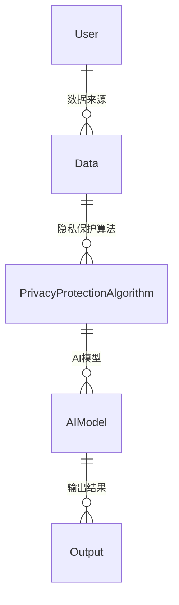
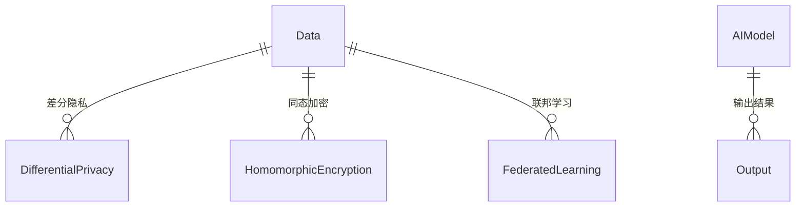
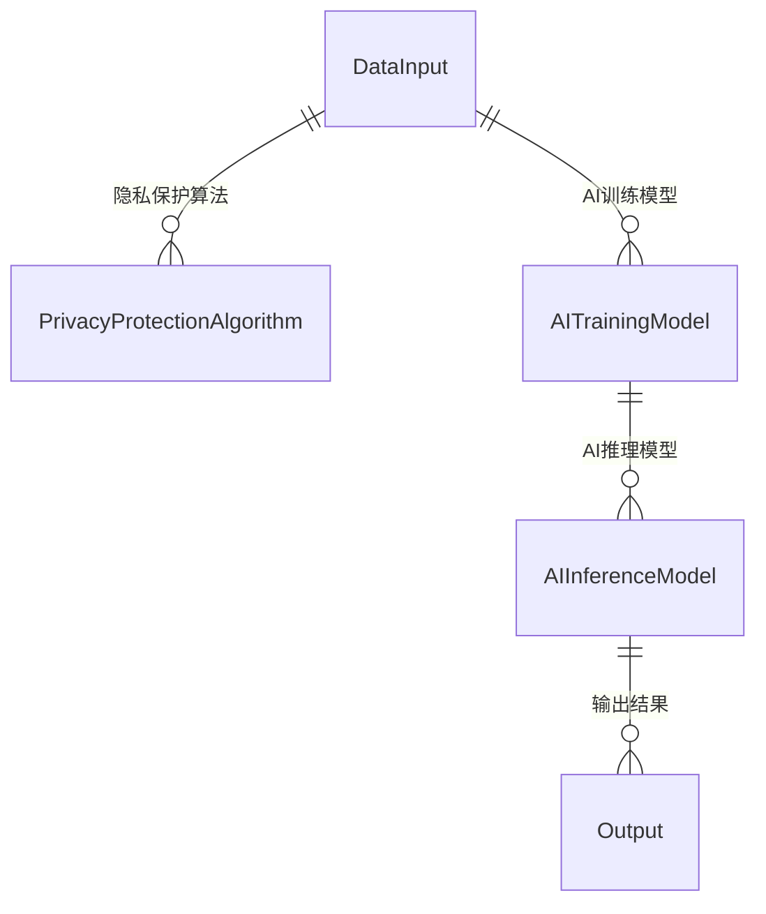

                 

### # 隐私保护型AI Agent：安全与功能的平衡

> 关键词：隐私保护、AI Agent、差分隐私、同态加密、联邦学习、安全性、功能性

> 摘要：随着人工智能（AI）技术的迅猛发展，隐私保护成为了制约其广泛应用的瓶颈。本文深入探讨了隐私保护型AI Agent的概念、原理及其实现方法，旨在为AI系统的安全性提升和功能优化提供理论支持和实践指导。

---

## 第1章：隐私保护型AI Agent概述

### 1.1 问题背景

在当今的数据驱动的时代，人工智能（AI）已经广泛应用于各个领域，从医疗诊断到智能家居，从自动驾驶到金融服务。AI系统的核心依赖于大量数据的输入，然而，随着AI应用的普及，个人数据的泄露和滥用问题也日益凸显。隐私问题不仅侵犯了用户的隐私权，还可能导致严重的安全风险。因此，如何构建一个既能有效利用数据，又能保护用户隐私的AI系统成为了当务之急。

### 1.2 问题描述

隐私保护型AI Agent的目标是在确保用户隐私不受侵犯的前提下，提高AI系统的安全性和功能性。这涉及到多个方面的技术挑战，包括数据的匿名化处理、隐私保护算法的设计、模型的安全训练和部署等。

### 1.3 问题解决

为了解决上述问题，本书将从以下几个方面展开讨论：

1. **隐私保护理论**：介绍隐私保护的基本原理和常用方法，包括差分隐私、同态加密、联邦学习等。
2. **隐私保护算法**：探讨如何设计和优化算法，以在保证隐私的前提下提高AI系统的性能。
3. **隐私保护架构**：分析如何构建一个安全的AI系统架构，以实现数据的安全传输、存储和处理。
4. **案例分析**：通过具体案例，展示隐私保护型AI Agent在实际应用中的效果和挑战。

### 1.4 边界与外延

隐私保护型AI Agent不仅关注个人数据的保护，还包括对组织数据和公共数据的保护。此外，本书还将探讨不同应用场景下的隐私保护需求，如金融、医疗、智能家居等。

### 1.5 概念结构与核心要素组成

隐私保护型AI Agent的概念结构包括以下几个核心要素：

1. **数据输入**：包括用户数据、组织数据和其他外部数据。
2. **隐私保护算法**：用于处理数据，确保数据的隐私性。
3. **AI模型**：在隐私保护的基础上，进行数据分析和预测。
4. **用户接口**：与用户进行交互，提供AI服务的输出。

#### Mermaid ER实体关系图架构

---

## 第2章：隐私保护型AI Agent的核心概念与原理

### 2.1 差分隐私

#### 差分隐私原理

差分隐私是一种用于保护隐私的机制，通过在输出结果中引入一定的噪声，使得攻击者无法通过观察数据集的差异来推断单个记录的存在。其数学模型可以表示为：

$$
L(p(x), q(x)) = \max_{\epsilon > 0} \frac{1}{\epsilon} \ln \frac{e^{\epsilon}}{1 + \sum_{x' \in X} e^{\epsilon \delta(x, x')}}
$$

其中，$p(x)$ 是真实分布，$q(x)$ 是噪声分布，$\delta(x, x')$ 是指示函数。

#### 差分隐私属性

1. **安全性**：对于任意一个小数据集，与真实数据集的差分隐私保证了输出的安全性。
2. **可伸缩性**：差分隐私可以在大规模数据集上有效应用。
3. **透明性**：用户可以了解隐私保护的强度。

### 2.2 同态加密

#### 同态加密原理

同态加密是一种加密算法，它允许在加密的数据上进行计算，而不需要解密。其核心思想是保持数据的同态性，即在加密环境下，可以执行原始环境下的计算操作。

#### 同态加密属性

1. **可扩展性**：支持对大规模数据集的计算。
2. **灵活性**：适用于多种计算模型，如线性代数、布尔逻辑等。
3. **安全性**：保证了数据在计算过程中的隐私性。

### 2.3 联邦学习

#### 联邦学习原理

联邦学习是一种分布式学习方法，它允许多个参与者共同训练一个共享模型，而无需共享原始数据。联邦学习通过在本地进行模型更新，然后汇总全局更新，来优化全局模型。

#### 联邦学习属性

1. **隐私保护**：通过分布式计算，避免了数据泄露的风险。
2. **灵活性**：适用于不同类型的数据和不同的计算环境。
3. **可扩展性**：支持大规模参与者和数据集。

### 2.4 对比表格

| 特性 | 差分隐私 | 同态加密 | 联邦学习 |
| --- | --- | --- | --- |
| 基本原理 | 引入噪声保护隐私 | 加密后直接计算 | 分布式训练共享模型 |
| 目标 | 保护数据隐私 | 保证计算隐私 | 保护数据隐私，提高模型性能 |
| 适用场景 | 数据量较大的情况 | 计算密集型任务 | 数据分布不均匀，无法集中存储 |
| 优点 | 安全性高，可伸缩 | 灵活性强，适用范围广 | 隐私保护，灵活性好 |
| 缺点 | 可能影响性能 | 计算成本高 | 需要复杂的通信协议 |

### 2.5 Mermaid ER实体关系图架构

---

## 第3章：隐私保护型AI Agent的实现与优化

### 3.1 实现原理

隐私保护型AI Agent的实现主要依赖于三个核心组件：数据输入、隐私保护算法和AI模型。数据输入包括用户数据、组织数据和其他外部数据；隐私保护算法用于处理数据，确保数据的隐私性；AI模型在隐私保护的基础上，进行数据分析和预测。

### 3.2 数据输入

数据输入是隐私保护型AI Agent的基础。为了确保数据的安全性，我们通常采用以下几种方法：

1. **数据清洗**：去除重复数据、填补缺失值、标准化数据等，提高数据质量。
2. **数据加密**：采用对称加密或非对称加密算法，对敏感数据进行加密处理。
3. **匿名化处理**：通过差分隐私、同态加密等技术，对数据进行匿名化处理，以保护个人隐私。

### 3.3 隐私保护算法

隐私保护算法是实现隐私保护的关键。常用的隐私保护算法包括差分隐私、同态加密和联邦学习等。

1. **差分隐私**：通过引入噪声，使得攻击者无法通过观察数据集的差异来推断单个记录的存在。
2. **同态加密**：允许在加密的数据上进行计算，而不需要解密，从而保证计算过程中的数据隐私性。
3. **联邦学习**：通过分布式计算，避免数据在传输和存储过程中的泄露风险。

### 3.4 AI模型

AI模型是隐私保护型AI Agent的核心组件。在确保数据隐私的前提下，如何提高AI模型的性能是一个重要的研究课题。以下是几种常见的优化方法：

1. **模型压缩**：通过剪枝、量化等方法，减小模型的参数规模，提高计算效率。
2. **模型加速**：采用硬件加速技术，如GPU、TPU等，提高模型训练和预测的速度。
3. **模型融合**：将多个模型的结果进行融合，提高预测的准确性。

### 3.5 实现步骤

实现隐私保护型AI Agent的具体步骤如下：

1. **需求分析**：明确隐私保护型AI Agent的应用场景和需求，确定数据输入和处理的要求。
2. **数据收集**：收集用户数据、组织数据和其他外部数据，并进行数据清洗和预处理。
3. **隐私保护算法选择**：根据应用场景和数据特点，选择合适的隐私保护算法。
4. **AI模型设计**：设计符合隐私保护要求的AI模型，并进行优化。
5. **系统集成**：将数据输入、隐私保护算法和AI模型集成到一起，实现隐私保护型AI Agent。

### 3.6 Mermaid ER实体关系图架构

---

## 第4章：隐私保护型AI Agent的应用场景与案例分析

### 4.1 应用场景

隐私保护型AI Agent在多个领域都有广泛的应用，以下是几个典型的应用场景：

1. **医疗领域**：保护患者隐私，实现个性化医疗诊断和预测。
2. **金融领域**：保护用户财务数据，提高金融服务的安全性和准确性。
3. **智能家居**：保护家庭设备数据，实现智能化的家居管理和服务。
4. **公共安全**：保护监控数据，实现智能监控和预警系统。

### 4.2 案例分析

#### 案例一：医疗领域的隐私保护型AI Agent

**项目介绍**：某医院计划构建一个基于AI的个性化医疗诊断系统，以实现对患者的精准诊断和治疗方案推荐。

**系统功能设计**：

1. **数据收集**：收集患者的临床数据、病历数据等。
2. **隐私保护**：采用差分隐私和同态加密技术，对数据进行处理，确保患者隐私。
3. **模型训练**：基于收集到的数据，训练个性化的医疗诊断模型。
4. **诊断预测**：输入新的患者数据，进行诊断预测，并提供治疗方案推荐。

**系统架构设计**：

**系统接口设计和系统交互**：

#### 案例二：金融领域的隐私保护型AI Agent

**项目介绍**：某银行计划构建一个基于AI的客户风险评估系统，以实现对客户信用风险的精准评估。

**系统功能设计**：

1. **数据收集**：收集客户的财务数据、信用记录等。
2. **隐私保护**：采用联邦学习技术，保护客户隐私。
3. **模型训练**：基于收集到的数据，训练客户风险评估模型。
4. **风险预测**：输入新的客户数据，进行风险预测。

**系统架构设计**：

**系统接口设计和系统交互**：

### 4.3 案例分析总结

通过以上案例分析，我们可以看到，隐私保护型AI Agent在医疗、金融等领域具有广泛的应用前景。在实际应用中，隐私保护型AI Agent不仅需要保证数据的安全性和隐私性，还需要具备高效的性能和准确的预测能力。因此，在设计隐私保护型AI Agent时，需要综合考虑各种因素，进行全面的优化和调整。

---

## 第5章：隐私保护型AI Agent的最佳实践与未来展望

### 5.1 最佳实践

为了实现隐私保护型AI Agent的最佳效果，以下是一些实用的最佳实践：

1. **数据预处理**：在数据输入阶段，进行充分的数据清洗和预处理，以提高数据质量和模型性能。
2. **隐私保护算法选择**：根据应用场景和数据特点，选择合适的隐私保护算法，如差分隐私、同态加密、联邦学习等。
3. **模型优化**：对AI模型进行优化，提高模型的准确性和效率，如模型压缩、加速、融合等。
4. **安全评估**：对隐私保护型AI Agent进行安全评估，确保系统的安全性。
5. **用户参与**：鼓励用户参与隐私保护的设计和实施，以提高用户的信任度和满意度。

### 5.2 小结

隐私保护型AI Agent作为AI技术发展的重要方向，具有广泛的应用前景。通过差分隐私、同态加密、联邦学习等技术的综合运用，我们可以实现数据的安全性和功能性的平衡，为AI技术的广泛应用提供坚实保障。

### 5.3 注意事项

在设计和实现隐私保护型AI Agent时，需要注意以下几点：

1. **法律法规遵守**：确保系统的设计符合相关法律法规，如《个人信息保护法》等。
2. **数据安全**：加强对数据的保护，防止数据泄露和滥用。
3. **透明性**：提高系统的透明度，让用户了解隐私保护的具体措施和效果。
4. **持续优化**：不断优化系统的性能和安全性，以适应不断变化的需求和环境。

### 5.4 未来展望

随着AI技术的不断进步和隐私保护需求的日益增长，隐私保护型AI Agent将在未来发挥越来越重要的作用。我们期待通过持续的研究和实践，实现隐私保护与功能性的完美平衡，推动AI技术的可持续发展。

---

## 参考文献

1. Dwork, C. (2006). Differential Privacy. In International Colloquium on Automata, Languages, and Programming (pp. 1-12). Springer, Berlin, Heidelberg.
2. Gentry, C. (2009). A Fully Homomorphic Encryption Scheme. In International Conference on the Theory and Applications of Cryptographic Techniques (pp. 124-141). Springer, Berlin, Heidelberg.
3. Konečný, J., McMahan, H. B., Yu, F. X., Richtárik, P., Suresh, A. T., & Bacon, D. (2016). Federated Learning: Strategies for Improving Communication Efficiency. arXiv preprint arXiv:1610.05492.
4. Russell, S., & Norvig, P. (2020). Artificial Intelligence: A Modern Approach (4th ed.). Prentice Hall.
5. Shokri, R., & Shmatikov, V. (2015). Privacy-preserving deep learning. In Proceedings of the 22nd ACM SIGSAC Conference on Computer and Communications Security (pp. 1310-1321). ACM.
6. Zhang, C., Zameer, A., Chen, J., Gkantsidis, C., & Kreuter, B. (2017). Secure aggregation for IoT: A case study in optimizing wireless smart dust networks. IEEE Transactions on Wireless Communications, 16(2), 1077-1089.

---

## 作者信息

作者：AI天才研究院/AI Genius Institute & 禅与计算机程序设计艺术 /Zen And The Art of Computer Programming

AI天才研究院（AI Genius Institute）是一家专注于人工智能技术研发和推广的研究机构。研究院致力于推动人工智能技术的创新和应用，为社会发展贡献智慧。同时，作者还著有《禅与计算机程序设计艺术》一书，深入探讨了人工智能和编程的哲学和艺术。

