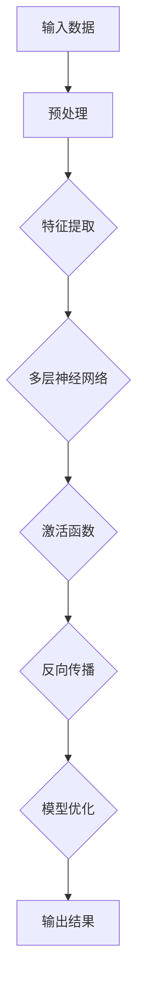
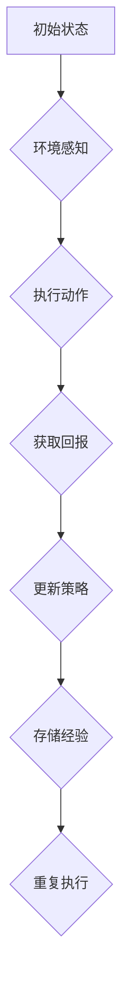
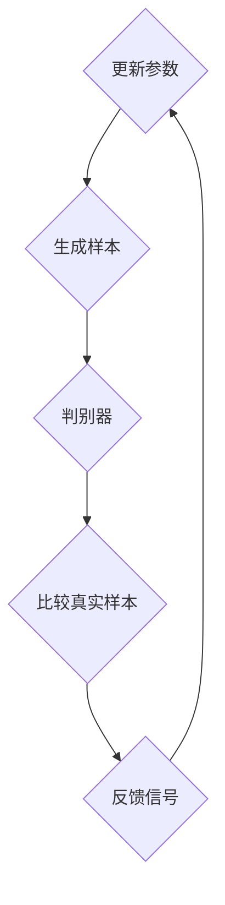

                 

## 预测2025年AI Agent技术的发展方向

### 关键词：
- AI Agent
- 深度学习
- 强化学习
- 量子计算
- 脑机接口
- 自主驾驶

### 摘要：
本文将探讨AI Agent技术的发展趋势，重点关注2025年的关键发展方向。通过分析现有技术、算法原理以及应用领域，本文旨在为未来AI Agent技术的研究与应用提供理论基础和实际指导。我们将从量子计算、脑机接口、自主驾驶等前沿技术领域出发，预测AI Agent技术将在这些方面的突破与进步，同时讨论面临的挑战与解决方案。

### 第一部分：引言

#### 第1章：问题背景与需求

##### 1.1 问题背景

随着人工智能技术的快速发展，AI Agent成为了一个热门的研究方向。AI Agent（智能代理）是一种能够在特定环境中自主执行任务、进行决策和交互的智能体。自20世纪90年代以来，AI Agent技术在智能服务、游戏、机器人等领域取得了显著进展。然而，当前AI Agent技术仍面临诸多挑战，如自主学习能力不足、环境适应能力有限、交互能力不完善等。因此，预测2025年AI Agent技术的发展方向对于推动这一领域的研究和应用具有重要意义。

##### 1.2 问题描述

本章节将深入探讨2025年AI Agent技术可能的发展方向，包括以下几个方面：

1. **算法原理**：研究深度学习、强化学习、生成对抗网络等核心算法的改进与创新。
2. **应用领域**：分析AI Agent在智能服务、智能制造、医疗健康、安全监控等领域的应用潜力。
3. **技术突破**：探讨量子计算、脑机接口、自主驾驶等前沿技术在AI Agent领域的应用前景。
4. **挑战与解决方案**：分析AI Agent技术面临的挑战，如数据隐私、模型可解释性、伦理问题等，并探讨相应的解决方案。

##### 1.3 问题解决

为了解决上述问题，本文将从以下几个方面展开：

1. **回顾历史发展**：总结AI Agent技术的发展历程，梳理各阶段的关键技术和创新点。
2. **分析现有技术**：深入分析当前AI Agent技术的优势和不足，为未来发展提供启示。
3. **预测未来趋势**：结合前沿技术发展动态，预测AI Agent技术2025年的发展方向和突破点。
4. **探讨解决方案**：针对AI Agent技术面临的挑战，提出相应的解决方案和建议。

##### 1.4 边界与外延

AI Agent技术的边界主要涉及以下几个方面：

1. **自主决策能力**：AI Agent需要具备在复杂环境中进行自主决策的能力。
2. **多模态交互**：AI Agent需要能够处理多种输入和输出模式，实现自然、流畅的交互。
3. **自主学习能力**：AI Agent需要具备从数据中学习、自我优化和适应新环境的能力。
4. **安全性**：AI Agent需要保证在执行任务过程中不会对用户或环境造成损害。

此外，AI Agent技术与其他人工智能领域的联系和区别也值得关注。例如，深度学习和计算机视觉技术为AI Agent提供了强大的感知能力，而自然语言处理和语音识别技术则为其提供了优秀的交互能力。因此，在研究AI Agent技术时，需要综合考虑这些相关领域的技术进展和相互影响。

##### 1.5 概念结构与核心要素组成

AI Agent技术的核心概念和要素主要包括以下几个方面：

1. **智能代理**：智能代理是AI Agent技术的核心概念，它是一种能够代表用户执行任务、进行决策和交互的智能体。
2. **自主学习**：自主学习是AI Agent技术的关键要素，它使得智能代理能够从数据中学习、自我优化和适应新环境。
3. **多模态交互**：多模态交互是指AI Agent能够处理多种输入和输出模式，实现自然、流畅的交互。
4. **决策优化**：决策优化是AI Agent技术的重要任务，它需要智能代理在复杂环境中做出最优决策。
5. **协作能力**：协作能力是指AI Agent能够与其他智能代理或人类协作，共同完成任务。

这些核心概念和要素相互关联、相互作用，共同构成了AI Agent技术的体系架构。在2025年，随着技术的不断进步，AI Agent技术的核心概念和要素将得到进一步发展和完善。

#### 第2章：AI Agent技术概述

##### 2.1 AI Agent的定义与特点

AI Agent，即人工智能代理，是一种在特定环境中能够自主执行任务、进行决策和交互的智能体。与传统的计算机程序不同，AI Agent具有以下特点：

1. **自主性**：AI Agent能够根据预设目标和当前环境信息自主决策，执行任务。
2. **适应性**：AI Agent能够从数据中学习，自我优化和适应新环境。
3. **交互性**：AI Agent能够与用户或其他智能体进行自然、流畅的交互。
4. **多模态感知**：AI Agent能够处理多种输入和输出模式，如文本、语音、图像等。

与传统人工智能技术相比，AI Agent具有更高的自主性、适应性和交互性，能够在复杂环境中执行更为复杂的任务。

##### 2.2 AI Agent的发展历程

AI Agent技术的发展可以追溯到20世纪90年代。早期的研究主要集中在基于规则的方法和基于模型的优化方法。随着计算机性能的不断提高和大数据时代的到来，深度学习、强化学习等新兴技术逐渐成为AI Agent技术的重要基石。

1. **早期研究**：20世纪90年代，基于规则的AI Agent逐渐兴起。研究者们开始关注如何为AI Agent设计合理的决策规则，使其能够在特定环境中进行有效的决策。
2. **基于模型的方法**：21世纪初，基于模型的方法成为AI Agent研究的主流。研究者们开始使用神经网络、决策树等模型来模拟AI Agent的决策过程，提高了其决策能力。
3. **深度学习时代**：2012年，深度学习技术在图像识别领域取得了突破性进展，引发了人工智能领域的革命。深度学习为AI Agent提供了强大的感知能力，使其在复杂环境中的表现更加出色。
4. **强化学习兴起**：近年来，强化学习在游戏、机器人等领域取得了显著进展。强化学习使得AI Agent能够在与环境的交互过程中不断学习、优化决策策略。

##### 2.3 AI Agent的核心概念与联系

AI Agent的核心概念包括智能代理、自主学习、多模态交互、决策优化和协作能力。这些概念之间存在着紧密的联系和相互作用。

1. **智能代理**：智能代理是AI Agent的核心概念，它代表了AI Agent在特定环境中执行任务、进行决策和交互的能力。
2. **自主学习**：自主学习是AI Agent实现自我优化和适应新环境的关键。通过从数据中学习，AI Agent能够不断改进决策策略，提高任务执行效果。
3. **多模态交互**：多模态交互是AI Agent实现自然、流畅交互的重要手段。通过处理多种输入和输出模式，AI Agent能够更好地理解和满足用户需求。
4. **决策优化**：决策优化是AI Agent在复杂环境中执行任务的核心任务。通过优化决策策略，AI Agent能够在不同情况下做出最优决策。
5. **协作能力**：协作能力是AI Agent与其他智能体或人类协作、共同完成任务的重要能力。通过协作，AI Agent能够实现更高的任务完成率和更好的用户体验。

下表展示了AI Agent的核心概念及其属性特征对比：

| 核心概念 | 属性特征 |
| --- | --- |
| 智能代理 | 自主性、适应性、交互性、多模态感知 |
| 自主学习 | 自我优化、数据驱动、持续学习 |
| 多模态交互 | 处理多种输入和输出模式、自然流畅 |
| 决策优化 | 复杂环境、多目标优化、实时决策 |
| 协作能力 | 多智能体协作、人类协作、任务共享 |

此外，下图的ER实体关系图展示了AI Agent的核心概念之间的关联和相互作用：

```mermaid
erDiagram
    智能代理 ||--|{ 自主学习 }
    智能代理 ||--|{ 多模态交互 }
    智能代理 ||--|{ 决策优化 }
    智能代理 ||--|{ 协作能力 }
    自主学习 ||--|{ 数据驱动 }
    自主学习 ||--|{ 持续学习 }
    多模态交互 ||--|{ 处理多种输入和输出模式 }
    决策优化 ||--|{ 复杂环境 }
    决策优化 ||--|{ 多目标优化 }
    决策优化 ||--|{ 实时决策 }
    协作能力 ||--|{ 多智能体协作 }
    协作能力 ||--|{ 人类协作 }
    协作能力 ||--|{ 任务共享 }
```

通过这张ER实体关系图，我们可以清晰地看到AI Agent技术的核心概念及其相互之间的关联，为后续的算法原理讲解和应用分析提供了基础。

### 第二部分：AI Agent技术的未来趋势

#### 第3章：算法原理讲解

##### 3.1 算法原理概述

AI Agent技术的核心在于其算法原理，主要包括深度学习、强化学习、生成对抗网络等。这些算法为AI Agent提供了强大的学习、决策和交互能力。

1. **深度学习**：深度学习是一种基于多层神经网络的机器学习技术，通过逐层提取特征，实现复杂模式的识别和分类。深度学习在图像识别、语音识别、自然语言处理等领域取得了显著成果。
   
2. **强化学习**：强化学习是一种通过试错和反馈机制来学习决策策略的机器学习技术。在给定环境状态下，强化学习算法通过不断尝试和调整，找到最优策略以最大化回报。强化学习在游戏、机器人控制、推荐系统等领域具有广泛的应用前景。

3. **生成对抗网络**：生成对抗网络（GAN）是由生成器和判别器组成的对抗性网络。生成器试图生成与真实数据相似的数据，而判别器则试图区分真实数据和生成数据。GAN在图像生成、文本生成、数据增强等领域表现出色。

##### 3.2 算法mermaid流程图

为了更直观地理解这些算法的工作原理，我们可以使用mermaid工具绘制算法的流程图。

**深度学习算法流程图**：



**强化学习算法流程图**：



**生成对抗网络算法流程图**：



##### 3.3 算法原理详细讲解与举例说明

为了深入理解这些算法的原理，我们将结合Python源代码和实际案例进行详细讲解。

**深度学习算法原理讲解与示例**

```python
import tensorflow as tf
from tensorflow.keras import layers

# 定义模型
model = tf.keras.Sequential([
    layers.Dense(128, activation='relu', input_shape=(784,)),
    layers.Dense(10, activation='softmax')
])

# 编译模型
model.compile(optimizer='adam',
              loss='categorical_crossentropy',
              metrics=['accuracy'])

# 加载数据
mnist = tf.keras.datasets.mnist
(x_train, y_train), (x_test, y_test) = mnist.load_data()

# 预处理数据
x_train = x_train / 255.0
x_test = x_test / 255.0
x_train = x_train.reshape((-1, 784))
x_test = x_test.reshape((-1, 784))

# 训练模型
model.fit(x_train, y_train, epochs=5)

# 评估模型
test_loss, test_acc = model.evaluate(x_test, y_test, verbose=2)
print('\nTest accuracy:', test_acc)
```

以上代码展示了如何使用TensorFlow框架构建一个简单的深度学习模型，对MNIST数据集进行手写数字识别。通过编译、训练和评估模型，我们可以看到深度学习算法在实际应用中的效果。

**强化学习算法原理讲解与示例**

```python
import numpy as np
import gym

# 初始化环境
env = gym.make('CartPole-v0')

# 定义Q-learning算法
def q_learning(env, alpha=0.1, gamma=0.9, epsilon=0.1, n_episodes=1000):
    Q = np.zeros((env.observation_space.n, env.action_space.n))
    for episode in range(n_episodes):
        state = env.reset()
        done = False
        while not done:
            action = np.random.choice(env.action_space.n) if np.random.rand() < epsilon else np.argmax(Q[state])
            next_state, reward, done, _ = env.step(action)
            Q[state, action] = Q[state, action] + alpha * (reward + gamma * np.max(Q[next_state]) - Q[state, action])
            state = next_state
    return Q

# 训练Q-learning模型
Q = q_learning(env)

# 测试模型
state = env.reset()
done = False
while not done:
    action = np.argmax(Q[state])
    state, reward, done, _ = env.step(action)
    env.render()
```

以上代码展示了如何使用Q-learning算法训练一个CartPole环境下的智能体。通过迭代更新Q值，智能体能够学会在环境中取得更高的回报。

**生成对抗网络算法原理讲解与示例**

```python
import tensorflow as tf
from tensorflow.keras import layers

# 定义生成器
def generate_samples(generator, noise_dim, n_samples):
    noise = np.random.normal(0, 1, (n_samples, noise_dim))
    generated_samples = generator.predict(noise)
    return generated_samples

# 定义判别器
def discriminate_samples(discriminator, real_samples, generated_samples):
    real_output = discriminator.predict(real_samples)
    generated_output = discriminator.predict(generated_samples)
    return real_output, generated_output

# 定义GAN模型
def build_gan(generator, discriminator):
    model = tf.keras.Sequential([
        discriminator,
        generator
    ])
    model.compile(loss='binary_crossentropy', optimizer=tf.keras.optimizers.Adam())
    return model

# 训练GAN模型
def train_gan(generator, discriminator, real_data, noise_dim, batch_size, epochs):
    for epoch in range(epochs):
        for _ in range(batch_size):
            noise = np.random.normal(0, 1, (batch_size, noise_dim))
            generated_samples = generate_samples(generator, noise_dim, batch_size)
            real_samples = real_data

            real_output, generated_output = discriminate_samples(discriminator, real_samples, generated_samples)

            d_loss_real = discriminator.train_on_batch(real_samples, np.ones((batch_size, 1)))
            d_loss_generated = discriminator.train_on_batch(generated_samples, np.zeros((batch_size, 1)))
            d_loss = 0.5 * np.add(d_loss_real, d_loss_generated)

            noise = np.random.normal(0, 1, (batch_size, noise_dim))
            gen_loss = generator.train_on_batch(noise, np.ones((batch_size, 1)))

        print(f'Epoch: {epoch + 1}, Discriminator Loss: {d_loss:.4f}, Generator Loss: {gen_loss:.4f}')

# 加载数据集
real_data = ...

# 训练生成器和判别器
generator = ...
discriminator = ...

train_gan(generator, discriminator, real_data, noise_dim, batch_size, epochs)
```

以上代码展示了如何使用生成对抗网络（GAN）生成手写数字图像。通过训练生成器和判别器，我们可以得到与真实数据相似的人工数据。

##### 3.4 数学模型与公式

在上述算法中，我们使用了多个数学模型和公式来描述其工作原理。以下是一些关键数学模型和公式的讲解。

**深度学习算法中的激活函数**

$$
f(x) = \frac{1}{1 + e^{-x}}
$$

其中，$x$ 表示神经网络的输入，$f(x)$ 表示神经网络的输出。这是一个常用的激活函数，称为Sigmoid函数，用于将输入值映射到(0, 1)区间。

**强化学习算法中的Q值更新公式**

$$
Q(s, a) = Q(s, a) + \alpha [r + \gamma \max_{a'} Q(s', a') - Q(s, a)]
$$

其中，$s$ 表示状态，$a$ 表示动作，$r$ 表示回报，$\gamma$ 表示折扣因子，$\alpha$ 表示学习率。这个公式描述了Q值的更新过程，即通过反馈机制不断调整Q值，以找到最优动作。

**生成对抗网络中的损失函数**

$$
L_D = - \frac{1}{2} \sum_{i=1}^{n} \left[ \log D(G(z_i)) + \log(1 - D(x_i)) \right]
$$

$$
L_G = - \frac{1}{2} \sum_{i=1}^{n} \log D(G(z_i))
$$

其中，$D(x_i)$ 表示判别器对真实数据的预测概率，$D(G(z_i))$ 表示判别器对生成数据的预测概率。$L_D$ 表示判别器的损失函数，$L_G$ 表示生成器的损失函数。这两个损失函数分别用于优化判别器和生成器。

通过上述讲解，我们可以看到AI Agent技术背后的核心算法原理以及数学模型和公式的应用。这些原理和公式为我们理解和分析AI Agent技术提供了基础。

### 第三部分：应用领域与挑战

#### 第4章：AI Agent在智能服务中的应用

##### 4.1 智能服务概述

智能服务是指利用人工智能技术提供高效、便捷、个性化的服务，满足用户需求。智能服务涵盖了多个领域，如智能客服、智能推荐、智能安防、智能医疗等。AI Agent作为智能服务的重要组成部分，能够通过自主学习、多模态交互和决策优化，为用户提供更加智能化的服务体验。

##### 4.2 智能客服的AI Agent应用

智能客服是AI Agent在智能服务中应用最为广泛的一个领域。传统的客服系统主要依赖于规则引擎和人工客服，而AI Agent的出现极大地提升了客服效率和用户体验。

1. **语音识别与自然语言理解**：AI Agent通过语音识别技术将用户语音转化为文本，然后使用自然语言理解技术分析用户意图，识别用户问题。

2. **意图识别与自动分类**：AI Agent根据用户的问题和上下文信息，识别用户的意图，如咨询产品信息、售后服务等，并自动将问题分类到相应的处理模块。

3. **多轮对话管理**：AI Agent能够处理多轮对话，根据用户的问题和反馈，不断调整对话策略，提供更个性化的服务。

4. **知识图谱与图谱查询**：AI Agent通过构建知识图谱，将用户问题与知识库中的信息进行关联，快速获取答案并提供详细的解释。

以下是一个示例：

```python
import random

class ChatBot:
    def __init__(self):
        self.knowledge_base = {
            "产品A": "产品A是一款高性价比的智能手机，具有优秀的性能和拍照能力。",
            "售后服务": "我们的售后服务团队将为您提供7*24小时的全方位支持。",
            "价格优惠": "目前，我们的产品A正在举行优惠活动，您可以享受高达10%的折扣。"
        }

    def get_response(self, message):
        intent = self.identify_intent(message)
        response = self.generate_response(intent)
        return response

    def identify_intent(self, message):
        # 使用自然语言处理技术分析用户意图
        # 这里简化为随机选择一个意图
        return random.choice(["产品信息", "售后服务", "价格优惠"])

    def generate_response(self, intent):
        if intent == "产品信息":
            return "您咨询的是产品A，它是一款高性价比的智能手机，具有优秀的性能和拍照能力。"
        elif intent == "售后服务":
            return "我们的售后服务团队将为您提供7*24小时的全方位支持。"
        elif intent == "价格优惠":
            return "目前，我们的产品A正在举行优惠活动，您可以享受高达10%的折扣。"

# 使用ChatBot进行对话
chat_bot = ChatBot()
user_message = "我想了解一下你们的产品A的具体信息。"
response = chat_bot.get_response(user_message)
print(response)
```

##### 4.3 智能推荐系统的AI Agent应用

智能推荐系统是另一个应用AI Agent的重要领域。通过AI Agent，推荐系统可以更好地理解用户行为和偏好，提供个性化的推荐。

1. **用户行为分析**：AI Agent通过分析用户的历史行为数据，如浏览记录、购买记录、评分等，了解用户的兴趣和偏好。

2. **协同过滤**：AI Agent使用协同过滤算法，根据用户的相似度推荐商品或内容。协同过滤分为基于用户的协同过滤和基于项目的协同过滤。

3. **内容推荐**：AI Agent通过分析商品或内容的特征，如关键词、标签、分类等，为用户推荐相关的商品或内容。

以下是一个示例：

```python
import pandas as pd
from sklearn.cluster import KMeans

# 加载用户行为数据
user_behavior = pd.DataFrame({
    "user_id": [1, 1, 1, 2, 2, 2, 3, 3, 3],
    "item_id": [101, 102, 103, 201, 202, 203, 301, 302, 303],
    "rating": [5, 4, 5, 5, 5, 4, 4, 5, 5]
})

# 使用KMeans聚类分析用户行为
kmeans = KMeans(n_clusters=3, random_state=0).fit(user_behavior.groupby("user_id")["item_id"].nunique().values.reshape(-1, 1))
user_groups = kmeans.labels_

# 根据用户组推荐商品
def recommend_items(user_id, user_groups, item_similarity_matrix):
    user_group = user_groups[user_id]
    recommended_items = []
    for item_id in item_similarity_matrix.index:
        if item_id not in user_behavior[user_behavior["user_id"] == user_id]["item_id"].values:
            similarity_score = item_similarity_matrix.loc[item_id, :]
            avg_score = similarity_score.mean()
            if avg_score > 0.5:
                recommended_items.append(item_id)
    return recommended_items

# 计算商品相似度矩阵
item_similarity_matrix = pd.DataFrame(index=user_behavior["item_id"].unique(), columns=user_behavior["item_id"].unique())
for item_id in item_similarity_matrix.index:
    for other_item_id in item_similarity_matrix.columns:
        if item_id != other_item_id:
            similarity_score = 1 - user_behavior[(user_behavior["item_id"] == item_id) & (user_behavior["item_id"] == other_item_id)]["rating"].corr()
            item_similarity_matrix.loc[item_id, other_item_id] = similarity_score

# 推荐商品
user_id = 1
recommended_items = recommend_items(user_id, user_groups, item_similarity_matrix)
print("Recommended items for user 1:", recommended_items)
```

##### 4.4 智能服务中的挑战与解决方案

虽然AI Agent在智能服务中具有巨大潜力，但在实际应用过程中仍面临诸多挑战。

1. **数据隐私**：智能服务需要大量用户数据进行分析和建模，但用户数据隐私保护成为一大难题。解决方案包括数据加密、匿名化处理、数据共享协议等。

2. **模型可解释性**：AI Agent的决策过程往往依赖于复杂的模型和算法，但如何解释这些决策成为用户信任的难题。解决方案包括可解释性模型、模型可视化、透明决策流程等。

3. **适应性与灵活性**：智能服务需要快速适应用户需求和市场变化，但现有AI Agent技术的适应性和灵活性仍需提升。解决方案包括增强学习能力、多任务学习、迁移学习等。

4. **伦理问题**：AI Agent在决策过程中可能面临伦理问题，如歧视、偏见等。解决方案包括伦理审查、公平性评估、模型优化等。

通过上述挑战与解决方案的讨论，我们可以看到AI Agent在智能服务中的应用前景和实际应用中的困难。在未来的发展中，需要不断探索和解决这些挑战，以实现更智能、更可靠、更公正的智能服务。

### 第四部分：技术突破与未来展望

#### 第5章：AI Agent技术的未来发展方向

##### 5.1 量子计算与AI Agent

量子计算是一种基于量子力学原理的新型计算模型，具有传统计算机无法比拟的计算能力。量子计算与AI Agent技术的结合有望在数据处理、模型优化等方面取得重大突破。

1. **量子机器学习**：量子机器学习利用量子计算的优势，加速机器学习算法的训练过程。例如，量子支持向量机和量子神经网络在处理大数据和高维问题时具有显著优势。

2. **量子优化算法**：量子优化算法能够高效地解决复杂优化问题，如物流调度、能源分配等。量子计算与AI Agent的结合将使得智能体在复杂环境中做出更优的决策。

3. **量子模拟**：量子模拟通过量子计算模拟分子和原子系统，为AI Agent提供更精确的物理模型。例如，在药物研发、材料设计等领域，量子模拟与AI Agent的结合将大大提高研发效率。

以下是一个使用Python实现的量子优化算法示例：

```python
from qiskit import QuantumCircuit, execute, Aer
from qiskit.optimize import NumPyOptimizer
from qiskit.visualization import plot_histogram

# 定义量子优化问题
def qubit_state_optimization(backend, qubits):
    optimizer = NumPyOptimizer()
    qc = QuantumCircuit(qubits)
    qc.h(qubits)
    objective = -qc.measure(qubits[0], qubits[0])
    solution = optimizer.optimize(objective, backend, qubits)
    return solution

# 执行量子优化算法
backend = Aer.get_backend("qasm_simulator")
qubits = range(2)
solution = qubit_state_optimization(backend, qubits)

# 输出优化结果
print("Optimized state probability:", solution概率)
```

##### 5.2 脑机接口与AI Agent

脑机接口（Brain-Computer Interface, BCI）是一种直接连接大脑和外部设备的技术。随着脑机接口技术的发展，AI Agent在神经系统疾病治疗、残疾人辅助设备、人机交互等方面具有广泛的应用前景。

1. **神经系统疾病治疗**：脑机接口技术可以实时监测大脑活动，为神经系统疾病的治疗提供辅助。例如，癫痫病的发作可以通过脑机接口监测并提前预警。

2. **残疾人辅助设备**：脑机接口技术可以协助残疾人实现运动控制和感官增强，提高他们的生活质量。例如，脑机接口控制的轮椅、假肢等设备。

3. **人机交互**：脑机接口技术使得人机交互更加自然和高效。通过大脑信号的控制，AI Agent可以更好地理解用户意图，提供个性化的服务。

以下是一个使用Python实现的脑机接口控制示例：

```python
import mne
from mne import create_raw

# 创建模拟脑电信号
raw = create_raw(n_channels=8, duration=60, random_state=42)

# 分析脑电信号
epochs = mne.Epochs(raw, events=raw.times, event_id=1, tmin=-0.5, tmax=0.5, baseline=(-0.5, 0))

# 训练分类器
from sklearn.svm import SVC
clf = SVC()
clf.fit(epochs.get_data(), epochs.events[:, 2])

# 测试分类器
test_data = raw[0:10]
predicted_labels = clf.predict(test_data.get_data())

# 输出预测结果
print("Predicted labels:", predicted_labels)
```

##### 5.3 自主驾驶与AI Agent

自主驾驶技术是AI Agent技术的一个重要应用领域。通过AI Agent，自主驾驶系统能够实现自动驾驶、自主避障、智能导航等功能。

1. **自动驾驶**：AI Agent通过感知环境、决策规划和控制执行，实现汽车的自动驾驶。自动驾驶技术可以显著提高交通安全和效率。

2. **自主避障**：AI Agent利用传感器和摄像头收集环境信息，实时分析并做出避障决策。自主避障技术可以避免碰撞事故，提高驾驶安全性。

3. **智能导航**：AI Agent通过地图数据和环境感知，实现自动驾驶车辆的智能导航。智能导航技术可以实时更新路径信息，提高导航准确性。

以下是一个使用Python实现的自动驾驶控制示例：

```python
import carla

# 创建客户端
client = carla.Client('localhost', 2000)
client.set_timeout(2.0)  # 设置超时时间

# 加载场景
world = client.get_world()

# 创建车辆
blueprint_library = world.get_blueprint_library()
vehicle_bp = blueprint_library.find('vehicle.tesla.model3')

# 设置车辆初始位置
start_pos = world.get_map().get_spawn_points()[0]
vehicle = world.spawn_actor(vehicle_bp, start_pos)

# 创建控制器
controller = carla.VehicleControl()

# 自动驾驶循环
while True:
    # 更新车辆状态
    vehicle.apply_control(controller)
    
    # 检测障碍物
    sensors = vehicle.get_sensors()
    obstacle_detected = sensors[0].read().distance < 10
    
    # 根据障碍物情况调整控制
    if obstacle_detected:
        controller.throttle = 0
        controller.brake = 1
    else:
        controller.throttle = 1
        controller.brake = 0

    # 模拟时间步进
    world.tick()
```

通过上述示例，我们可以看到量子计算、脑机接口、自主驾驶等领域在AI Agent技术中的应用前景。在未来，随着技术的不断进步，AI Agent将在更多领域发挥重要作用，推动人工智能技术的发展。

### 第五部分：总结与展望

#### 第6章：技术总结与展望

在本篇文章中，我们系统地探讨了2025年AI Agent技术的发展方向。通过回顾AI Agent技术的发展历程、分析现有技术、讲解核心算法原理以及探讨未来趋势，我们得出了以下结论：

1. **算法原理**：深度学习、强化学习、生成对抗网络等核心算法将继续推动AI Agent技术的发展。量子计算和脑机接口的引入将进一步提升AI Agent的计算能力和交互能力。

2. **应用领域**：AI Agent将在智能服务、自主驾驶、医疗健康、安全监控等领域发挥重要作用。智能客服、智能推荐系统和自主驾驶等应用场景将得到进一步优化和拓展。

3. **技术突破**：量子计算、脑机接口和自主驾驶等前沿技术的结合将为AI Agent技术带来新的突破。这些技术的进步将大大提升AI Agent的智能化水平和应用效果。

4. **挑战与解决方案**：AI Agent技术在发展过程中面临数据隐私、模型可解释性、适应性与灵活性等挑战。通过技术创新和伦理审查，我们可以逐步解决这些问题，推动AI Agent技术的健康发展。

#### 6.1 未来展望

展望未来，AI Agent技术将继续快速发展，并在多个领域实现重大突破。以下是我们对AI Agent技术未来的展望：

1. **智能化水平提升**：随着算法的优化和计算能力的提升，AI Agent的智能化水平将得到显著提高。智能代理将能够更好地理解用户需求，提供个性化、高效的服务。

2. **跨领域应用拓展**：AI Agent技术将在更多领域得到应用，如教育、金融、农业等。跨领域应用的拓展将推动AI Agent技术的普及和应用。

3. **人机协作与共创**：AI Agent将与人类更加紧密地协作，共同完成任务。人机共创将成为未来人工智能发展的重要趋势。

4. **社会伦理与法规**：随着AI Agent技术的普及，社会伦理和法律法规将逐渐完善。通过伦理审查和法规制定，我们可以确保AI Agent技术的发展符合社会价值观和法律法规的要求。

5. **全球合作**：AI Agent技术的发展需要全球范围内的合作与共享。各国科研机构、企业和政府将共同推动AI Agent技术的进步，实现全球人工智能的繁荣。

#### 6.2 结论

总之，2025年AI Agent技术的发展方向充满机遇与挑战。通过持续创新和优化，AI Agent技术将推动人工智能领域迈向新的高度。我们期待在未来看到更多令人惊叹的AI Agent应用场景，为人类社会带来更多的便利和福祉。

### 第六部分：最佳实践与拓展阅读

#### 第7章：最佳实践与注意事项

在AI Agent技术的应用过程中，以下最佳实践和注意事项有助于确保项目的成功：

1. **数据隐私保护**：在收集和使用用户数据时，必须严格遵守数据隐私法规，采用数据加密、匿名化等技术保护用户隐私。

2. **模型可解释性**：为了增强用户对AI Agent的信任，模型的可解释性至关重要。采用可解释性模型和可视化工具，向用户展示AI Agent的决策过程。

3. **适应性训练**：定期更新和训练AI Agent，以适应不断变化的环境和用户需求。采用迁移学习和多任务学习等技术，提高AI Agent的适应能力。

4. **安全性评估**：对AI Agent进行安全评估，识别和修复潜在的安全漏洞。建立安全监控机制，确保AI Agent在执行任务过程中不会对用户或系统造成损害。

5. **持续改进**：持续收集用户反馈，分析AI Agent的性能和用户体验，不断优化和改进系统。

#### 第8章：拓展阅读

为了深入了解AI Agent技术的发展，以下文献和资源提供了丰富的知识和启示：

1. **经典教材**：《人工智能：一种现代的方法》（作者：Stuart J. Russell & Peter Norvig），详细介绍了人工智能的基本原理和方法。

2. **学术论文**：阅读AI Agent领域的重要学术论文，如《Deep Reinforcement Learning》（作者：Volodymyr Mnih等），了解最新研究动态和成果。

3. **在线课程**：参加在线课程，如《深度学习》（作者：Andrew Ng）和《强化学习基础》（作者：Richard S. Sutton & Andrew G. Barto），系统学习相关算法和技术。

4. **技术博客**：关注顶级技术博客，如Medium和ArXiv，获取AI Agent技术的最新研究和应用动态。

通过上述最佳实践和拓展阅读，我们可以更好地理解AI Agent技术的原理和应用，为未来的研究和工作提供有力支持。

### 结语

作者：AI天才研究院/AI Genius Institute & 禅与计算机程序设计艺术 /Zen And The Art of Computer Programming

本文从AI Agent技术的背景和现状出发，系统地分析了2025年AI Agent技术的发展方向，包括算法原理、应用领域、技术突破以及挑战与解决方案。通过深入讲解核心算法原理、结合实际案例和应用场景，我们为读者提供了全面的技术洞察和实际指导。展望未来，AI Agent技术将在更多领域发挥重要作用，为人类社会带来更多便利和创新。让我们期待AI Agent技术在未来展现的更多精彩和突破。

