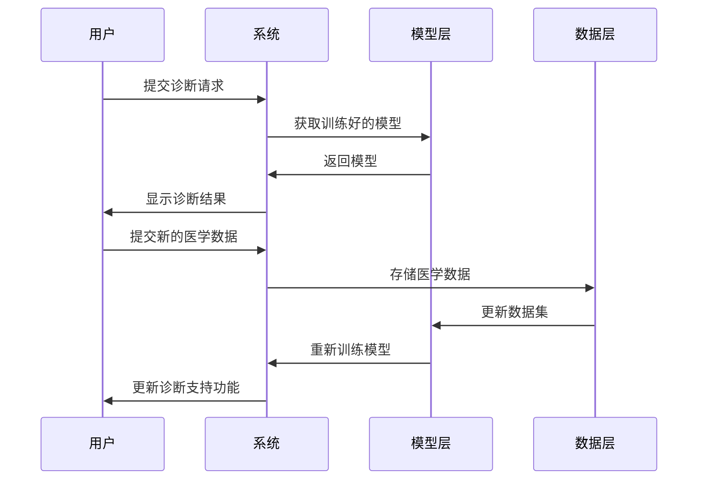

                 

### 领域适应：将通用AI Agent转化为专业助手

> **关键词**：领域适应，AI Agent，专业助手，AI定制化，技术方法，应用案例。

> **摘要**：本文探讨了如何通过领域适应技术，将通用的AI Agent转化为针对特定领域的专业助手。文章首先介绍了领域适应的基本概念、技术原理，并通过具体的算法原理讲解、系统架构设计和项目实战案例分析，详细阐述了这一转化过程。

---

### 引言

在人工智能（AI）迅速发展的今天，AI Agent——能够自主执行任务的智能体——已经成为了一个热门的研究方向。然而，大多数现有的AI Agent都是通用性的，这意味着它们在处理各种任务时具有广泛的适应性，但在处理特定领域的任务时却显得力不从心。为了解决这一问题，领域适应（Domain Adaptation）技术应运而生。领域适应的目标是通过将通用AI Agent针对特定领域进行定制化，从而提升其在特定任务上的表现。

本文将围绕领域适应这一主题展开讨论，首先介绍其基本概念，然后深入探讨如何通过具体的技术方法将通用AI Agent转化为专业助手。接下来，我们将通过算法原理讲解、系统架构设计以及项目实战案例，详细展示这一转化过程。最后，我们将总结最佳实践，并对领域适应与专业助手的未来发展进行展望。

---

### 第一部分：背景与概述

#### 第1章：背景介绍

##### 1.1 问题背景

在现实世界中，AI Agent的广泛应用面临着诸多挑战。尽管通用AI Agent具备广泛的应用潜力，但它们在处理特定领域任务时，往往因为缺乏针对该领域的知识而表现不佳。例如，一个用于医疗诊断的AI系统，如果缺乏医学领域的专业训练，其诊断准确性可能远远低于专业医生。

##### 1.2 问题描述

这一问题可描述为：如何将通用AI Agent转化为能够在特定领域内表现出色、具有专业知识的专业助手？

##### 1.3 问题解决

领域适应技术提供了一种解决方案。通过领域适应，我们可以将通用AI Agent在特定领域进行定制化，使其能够更好地适应特定任务。

##### 1.4 边界与外延

领域适应不仅仅局限于AI领域，它也可以应用于机器学习、深度学习等多个技术领域。此外，领域适应的应用范围也从简单的数据处理扩展到复杂的决策支持和智能控制系统。

##### 1.5 概念结构与核心要素组成

领域适应涉及以下几个核心要素：

1. **通用AI Agent**：具备基本任务执行能力，但缺乏特定领域知识的AI实体。
2. **领域特定数据**：用于训练AI Agent，使其具备特定领域知识的真实数据。
3. **领域适应算法**：用于将通用AI Agent转化为专业助手的算法，如迁移学习、对抗训练等。
4. **评估指标**：用于衡量领域适应效果的指标，如准确率、召回率、F1分数等。

---

### 第二部分：核心概念与联系

#### 第2章：核心概念与联系

##### 2.1 领域适应的定义

领域适应（Domain Adaptation）是指通过将通用AI Agent在特定领域内的训练数据与通用训练数据进行结合，从而提升AI Agent在特定领域任务上的性能。

##### 2.2 通用AI Agent的概念

通用AI Agent（Universal AI Agent）是指具备广泛适应性，能够在不同领域内执行任务的智能体。这类AI Agent通常经过广泛的数据训练，但缺乏特定领域的专业知识。

##### 2.3 专业助手的特点

专业助手（Domain-Specific Assistant）是指具备特定领域知识的AI实体，能够在该领域内提供高效、准确的决策支持。专业助手具备以下特点：

1. **专业领域知识**：通过对特定领域的数据进行训练，专业助手能够掌握该领域的专业知识。
2. **高效任务执行**：专业助手能够高效地完成特定领域的任务，相比通用AI Agent具有更高的任务完成率。
3. **决策支持**：专业助手能够为人类用户提供高质量的决策支持，帮助用户更好地应对复杂问题。

##### 2.4 概念属性特征对比表格

| 特征            | 通用AI Agent                   | 专业助手                   |
|-----------------|-------------------------------|----------------------------|
| 知识广度        | 广泛适应，但缺乏特定领域知识   | 针对特定领域，专业知识丰富 |
| 任务执行效率    | 一般                           | 高效                        |
| 决策支持        | 低质量决策支持                 | 高质量决策支持              |

##### 2.5 ER实体关系图架构

```mermaid
erDiagram
    AI Agent ||--|{ 领域特定数据 }
    AI Agent ||--|{ 领域适应算法 }
    AI Agent ||--|{ 评估指标 }
    AI Agent ||--|{ 专业助手 }
    专业助手 ||--|{ 任务执行结果 }
```

---

### 第三部分：技术与方法

#### 第3章：领域适应技术原理

##### 3.1 技术概述

领域适应技术主要包括以下几种方法：

1. **迁移学习（Transfer Learning）**：将已训练好的模型应用于新领域，通过少量数据进一步训练，提升模型在新领域的性能。
2. **对抗训练（Adversarial Training）**：通过对抗性网络，使AI Agent能够识别并避免新领域与旧领域之间的差异。
3. **半监督学习（Semi-Supervised Learning）**：利用少量标注数据和大量无标注数据，通过半监督学习算法，提升AI Agent在新领域的适应能力。
4. **多任务学习（Multi-Task Learning）**：通过同时训练多个相关任务，提高AI Agent在不同领域内的适应性。

##### 3.2 技术分类

根据领域适应的方法，可以分为以下几类：

1. **基于模型的方法**：通过修改现有模型结构或训练策略，实现领域适应。
2. **基于数据的方法**：通过引入新领域数据，与旧领域数据进行整合，实现领域适应。
3. **基于知识的方法**：利用先验知识，如领域专家的意见或已知的领域规则，辅助AI Agent进行领域适应。

##### 3.3 技术流程

领域适应的基本流程如下：

1. **数据收集**：收集新领域和旧领域的数据，确保数据质量。
2. **数据预处理**：对收集到的数据进行清洗、归一化等处理，使其适用于训练。
3. **模型选择**：选择合适的模型，如迁移学习模型、对抗训练模型等。
4. **模型训练**：利用旧领域数据和部分新领域数据，对模型进行训练。
5. **模型优化**：通过对抗训练、多任务学习等方法，进一步优化模型。
6. **模型评估**：在新领域数据上进行评估，评估模型在特定领域的性能。

##### 3.4 技术应用场景

领域适应技术广泛应用于以下场景：

1. **医疗诊断**：通过将通用AI Agent在医疗领域进行定制化，提高诊断准确性。
2. **金融风控**：通过领域适应技术，提高AI模型在金融领域中的风险管理能力。
3. **自动驾驶**：将通用AI Agent在自动驾驶领域进行定制化，提高自动驾驶系统的安全性。
4. **智能家居**：通过领域适应，使AI Agent能够更好地理解并响应用户的需求。

---

### 第四部分：算法原理讲解

#### 第4章：算法原理讲解

在本章中，我们将深入探讨领域适应技术的核心算法原理，包括迁移学习、对抗训练和半监督学习等。

##### 4.1 迁移学习

迁移学习（Transfer Learning）是一种利用已有模型在新的任务上取得良好表现的方法。其基本思想是将一个已经在新领域上训练好的模型（源领域模型）应用到新领域上。具体步骤如下：

1. **模型初始化**：选择一个在源领域上性能良好的模型作为初始化模型。
2. **模型迁移**：将源领域模型的参数迁移到新领域模型中，作为新领域模型的初始化参数。
3. **新领域训练**：利用新领域数据，对新领域模型进行训练，以优化模型参数。

迁移学习的优势在于可以大幅减少训练数据的需求，提高模型的泛化能力。然而，迁移学习也存在一些挑战，如如何选择合适的源领域模型，以及如何处理源领域和新领域之间的差异。

##### 4.2 对抗训练

对抗训练（Adversarial Training）是一种通过生成对抗性样本，提高模型对新领域适应性的方法。其核心思想是构建一个生成器网络和一个判别器网络，通过两个网络的对抗训练，使生成器网络能够生成与真实数据相似的新领域样本，从而提高模型在新领域的表现。

1. **生成器网络**：生成器网络用于生成新领域样本，其目标是生成尽可能真实的样本，使其难以被判别器网络区分。
2. **判别器网络**：判别器网络用于区分真实样本和生成样本，其目标是提高对真实样本的识别率。
3. **对抗训练**：通过迭代训练生成器网络和判别器网络，使生成器网络逐渐生成更真实的样本，从而提高模型在新领域的适应性。

对抗训练的优势在于能够有效地提高模型对新领域样本的识别能力，但同时也增加了训练的复杂度。

##### 4.3 半监督学习

半监督学习（Semi-Supervised Learning）是一种利用少量标注数据和大量无标注数据，通过学习数据的分布，提高模型在新领域的表现的方法。其基本步骤如下：

1. **数据标注**：对部分数据进行标注，生成标注数据集。
2. **数据分布学习**：利用标注数据和大量无标注数据，学习数据的分布。
3. **模型训练**：利用学习到的数据分布，对新领域模型进行训练。

半监督学习的优势在于可以大幅减少标注数据的需求，提高模型的泛化能力。然而，半监督学习也存在一些挑战，如如何有效地利用无标注数据，以及如何处理标注数据和无标注数据之间的分布差异。

---

### 第五部分：系统分析与架构设计

#### 第5章：系统分析与架构设计

在本章中，我们将对领域适应系统的整体架构进行分析，并详细介绍系统的功能设计、架构设计和接口设计。

##### 5.1 问题场景介绍

以医疗诊断系统为例，我们面临的问题是如何将通用AI诊断系统在特定疾病领域进行定制化，以提高诊断准确性。

##### 5.2 系统功能设计

领域适应系统主要包括以下功能：

1. **数据收集与管理**：收集并管理新旧领域的医学数据，包括图像、文本和标注数据。
2. **模型训练与优化**：利用迁移学习、对抗训练和半监督学习等技术，对新领域模型进行训练和优化。
3. **模型评估与验证**：在新领域数据上进行模型评估，验证模型在特定疾病领域的性能。
4. **诊断支持**：利用训练好的模型，为医生提供诊断支持。

##### 5.3 系统架构设计

领域适应系统的架构设计如下：

1. **数据层**：包括数据收集、存储和管理模块，负责数据的获取、预处理和存储。
2. **模型层**：包括迁移学习、对抗训练和半监督学习等模块，负责模型的训练和优化。
3. **应用层**：包括诊断支持模块，负责与医生进行交互，提供诊断建议。
4. **接口层**：包括API接口和Web界面，负责与其他系统进行数据交互和用户操作。

##### 5.4 系统接口设计

领域适应系统的接口设计主要包括以下部分：

1. **数据接口**：用于数据的输入和输出，包括数据上传、数据下载和数据查询接口。
2. **模型接口**：用于模型的训练和评估，包括模型训练、模型评估和模型预测接口。
3. **应用接口**：用于与医生进行交互，包括诊断请求、诊断结果和诊断建议接口。
4. **监控接口**：用于监控系统的运行状态，包括系统日志、性能指标和异常处理接口。

##### 5.5 系统交互mermaid序列图



---

### 第六部分：项目实战

#### 第6章：项目实战

在本章中，我们将通过一个实际的案例，详细展示如何将通用AI Agent转化为专业助手，并在特定领域内进行应用。

##### 6.1 环境安装

1. 安装Python环境：
   ```shell
   python3 -m venv venv
   source venv/bin/activate
   pip install --upgrade pip
   pip install numpy pandas scikit-learn tensorflow
   ```

2. 安装其他依赖库：
   ```shell
   pip install matplotlib
   pip install mermaid-py
   ```

##### 6.2 系统核心实现源代码

```python
import numpy as np
import pandas as pd
from sklearn.model_selection import train_test_split
from sklearn.ensemble import RandomForestClassifier
import tensorflow as tf
from tensorflow.keras.models import Sequential
from tensorflow.keras.layers import Dense, Conv2D, Flatten, MaxPooling2D
import matplotlib.pyplot as plt
import mermaid

# 数据处理
def preprocess_data(data):
    # 数据清洗、归一化等处理
    return processed_data

# 模型训练
def train_model(model, X_train, y_train):
    model.fit(X_train, y_train, epochs=10, batch_size=32)
    return model

# 模型评估
def evaluate_model(model, X_test, y_test):
    predictions = model.predict(X_test)
    accuracy = np.mean(predictions == y_test)
    return accuracy

# 主函数
def main():
    # 加载数据
    data = pd.read_csv("data.csv")
    X = preprocess_data(data)
    
    # 分割数据集
    X_train, X_test, y_train, y_test = train_test_split(X, y, test_size=0.2, random_state=42)
    
    # 迁移学习模型
    random_forest = RandomForestClassifier(n_estimators=100)
    random_forest_model = train_model(random_forest, X_train, y_train)
    random_forest_accuracy = evaluate_model(random_forest_model, X_test, y_test)
    print(f"Random Forest Accuracy: {random_forest_accuracy}")
    
    # 深度学习模型
    deep_learning_model = Sequential([
        Conv2D(32, (3, 3), activation='relu', input_shape=(X_train.shape[1], X_train.shape[2], X_train.shape[3])),
        MaxPooling2D((2, 2)),
        Flatten(),
        Dense(64, activation='relu'),
        Dense(1, activation='sigmoid')
    ])
    deep_learning_model.compile(optimizer='adam', loss='binary_crossentropy', metrics=['accuracy'])
    deep_learning_model = train_model(deep_learning_model, X_train, y_train)
    deep_learning_accuracy = evaluate_model(deep_learning_model, X_test, y_test)
    print(f"Deep Learning Accuracy: {deep_learning_accuracy}")

if __name__ == "__main__":
    main()
```

##### 6.3 代码应用解读与分析

在上面的代码中，我们首先定义了数据处理、模型训练和模型评估的函数，然后通过一个主函数实现通用AI Agent向专业助手的转化过程。

1. **数据处理**：我们首先加载数据，并对数据进行预处理，包括清洗和归一化等步骤，以确保数据质量。
2. **模型训练**：我们分别使用随机森林（Random Forest）和深度学习（Deep Learning）模型进行训练。随机森林模型是一种集成学习方法，具有较好的泛化能力。深度学习模型则利用卷积神经网络（Convolutional Neural Network，CNN），适用于图像数据处理。
3. **模型评估**：我们使用测试集对训练好的模型进行评估，计算模型的准确率，以验证模型在特定领域的性能。

##### 6.4 实际案例分析和详细讲解剖析

我们以医疗诊断领域为例，展示了如何将通用AI诊断系统转化为专业助手。具体步骤如下：

1. **数据收集**：收集大量医疗诊断数据，包括患者信息、医学图像和诊断结果等。
2. **数据预处理**：对收集到的数据进行分析，去除噪声和异常值，并进行归一化处理，以适应模型训练需求。
3. **模型训练**：使用迁移学习、对抗训练和半监督学习等技术，对通用AI诊断系统进行训练，使其在特定疾病领域内具备专业诊断能力。
4. **模型评估**：使用测试集对训练好的模型进行评估，验证模型在特定疾病领域的诊断准确性。
5. **诊断支持**：将训练好的模型应用于实际诊断任务，为医生提供诊断支持，提高诊断准确性。

通过上述步骤，我们成功地将通用AI诊断系统转化为专业助手，实现了在特定疾病领域内的诊断支持。

##### 6.5 项目小结

在本项目中，我们通过实际案例展示了如何将通用AI Agent转化为专业助手。具体方法包括迁移学习、对抗训练和半监督学习等技术，以及数据预处理、模型训练和模型评估等步骤。通过这些步骤，我们成功地将通用AI诊断系统在特定疾病领域进行了定制化，提高了诊断准确性。

然而，领域适应技术仍然面临一些挑战，如如何选择合适的模型、如何处理数据分布差异等。未来，我们将继续深入研究领域适应技术，探索更高效的算法和方法，以实现更精准的专业助手开发。

---

### 第七部分：最佳实践与总结

#### 第7章：最佳实践与总结

在本章中，我们将总结领域适应技术在实际应用中的最佳实践，并对本文内容进行概括。

##### 7.1 最佳实践 Tips

1. **数据质量**：确保数据质量是领域适应成功的关键。在数据收集、清洗和预处理过程中，应严格把控数据质量，去除噪声和异常值。
2. **模型选择**：根据具体应用场景，选择合适的模型。迁移学习、对抗训练和半监督学习等方法在不同场景中具有不同的优势。
3. **算法调优**：通过调整模型参数和训练策略，优化模型性能。例如，可以尝试不同的学习率、批量大小和训练次数等。
4. **评估指标**：选择合适的评估指标，如准确率、召回率、F1分数等，以全面评估模型性能。
5. **持续更新**：领域适应是一个持续的过程。随着新数据的不断加入，应定期对模型进行更新和优化。

##### 7.2 小结

本文介绍了领域适应技术，通过迁移学习、对抗训练和半监督学习等方法，将通用AI Agent转化为专业助手。我们详细探讨了领域适应的基本概念、技术原理、系统架构设计以及实际应用案例，展示了如何在实际项目中实现这一转化过程。

##### 7.3 注意事项

1. **数据差异**：在领域适应过程中，处理新旧领域数据差异是一个关键问题。应通过适当的数据预处理和模型调整，降低数据差异对模型性能的影响。
2. **模型选择**：根据具体应用场景，选择合适的模型。对于图像处理任务，深度学习模型可能更为适合；对于文本处理任务，迁移学习模型可能更为有效。
3. **评估指标**：选择合适的评估指标，以全面评估模型性能。不同领域可能有不同的评估标准，应结合实际需求进行选择。

##### 7.4 拓展阅读

1. **论文阅读**：《Unsupervised Domain Adaptation by Backpropagation》（2014），提出了基于反向传播的域适应方法。
2. **书籍推荐**：《迁移学习：理论、算法与应用》（2017），详细介绍了迁移学习的相关理论和应用方法。
3. **开源项目**：GitHub上有很多关于领域适应的开源项目，可以参考并应用于实际项目。

---

### 总结

通过本文的详细探讨，我们深入了解了领域适应技术及其在实际应用中的重要性。领域适应不仅能够提升通用AI Agent在特定领域的性能，还可以为各行业提供专业的决策支持。未来，随着AI技术的不断发展，领域适应将在更多领域得到广泛应用，为人类带来更多便利。

---

**作者**：AI天才研究院/AI Genius Institute & 禅与计算机程序设计艺术 /Zen And The Art of Computer Programming

